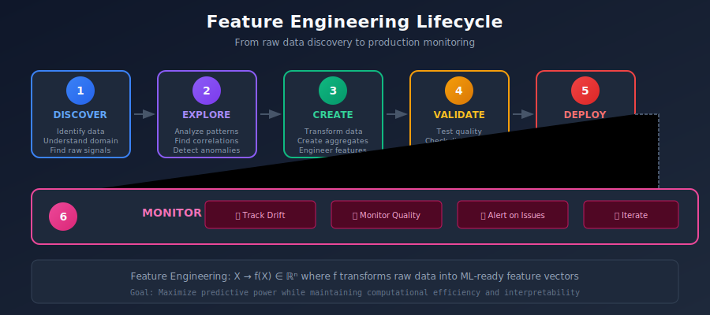
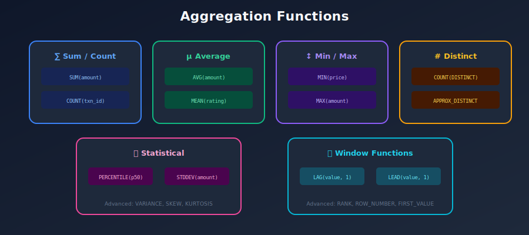

# ⚙️ Chapter 4: Feature Engineering

> *"Feature engineering is the art and science of transforming raw data into predictive signals."*

---

## 🎯 What You'll Learn

- Feature engineering patterns and best practices

- Batch vs streaming feature computation

- Aggregation patterns and time windows

- Feature transformation pipelines

- Testing and validation

---

## 📚 Table of Contents

1. [Feature Engineering Overview](#feature-engineering-overview)
2. [Feature Types and Patterns](#feature-types-and-patterns)
3. [Aggregation Patterns](#aggregation-patterns)
4. [Time Windows](#time-windows)
5. [Batch Feature Engineering](#batch-feature-engineering)
6. [Streaming Feature Engineering](#streaming-feature-engineering)
7. [On-Demand Features](#on-demand-features)
8. [Feature Pipelines](#feature-pipelines)

---

## Feature Engineering Overview

### The Feature Engineering Lifecycle



---

## Feature Types and Patterns

### Common Feature Patterns

```python
# 1. IDENTITY FEATURES (Raw values)
identity_features = {
    "user_id": "user_123",
    "product_price": 29.99,
    "category": "electronics"
}

# 2. DERIVED FEATURES (Computed from raw)
derived_features = {
    "user_age": (today - user_birthdate).days // 365,
    "is_premium": user_subscription_type == "premium",
    "price_bucket": "medium" if 20 < price < 50 else "other"
}

# 3. AGGREGATE FEATURES (Summarized data)
aggregate_features = {
    "user_total_purchases": sum(purchases),
    "user_avg_order_value": mean(order_values),
    "product_total_views": count(views)
}

# 4. TIME-WINDOWED FEATURES (Time-based aggregates)
windowed_features = {
    "user_purchases_7d": count(purchases, window="7d"),
    "user_avg_spend_30d": mean(amounts, window="30d"),
    "user_sessions_24h": count(sessions, window="24h")
}

# 5. RATIO FEATURES (Comparisons)
ratio_features = {
    "purchase_to_view_ratio": purchases / views,
    "current_vs_avg_amount": current_amount / avg_amount,
    "user_vs_cohort_spend": user_spend / cohort_avg_spend
}

# 6. LAG FEATURES (Historical values)
lag_features = {
    "previous_purchase_amount": purchase_amount.lag(1),
    "purchase_amount_7d_ago": purchase_amount.lag(7),
    "amount_change": current - previous
}

# 7. EMBEDDING FEATURES (Dense vectors)
embedding_features = {
    "user_embedding": [0.1, 0.2, ..., 0.9],  # 128-dim
    "product_embedding": [0.3, 0.4, ..., 0.1],  # 256-dim
}

```

### Feature Pattern Decision Tree



---

## Aggregation Patterns

### Common Aggregation Functions

```python
from pyspark.sql import functions as F

# NUMERIC AGGREGATIONS
numeric_aggs = {
    "sum": F.sum("amount"),
    "mean": F.avg("amount"),
    "median": F.percentile_approx("amount", 0.5),
    "min": F.min("amount"),
    "max": F.max("amount"),
    "std": F.stddev("amount"),
    "variance": F.variance("amount"),
    "count": F.count("*"),
    "count_distinct": F.countDistinct("item_id"),
}

# CONDITIONAL AGGREGATIONS
conditional_aggs = {
    "count_high_value": F.sum(F.when(F.col("amount") > 100, 1).otherwise(0)),
    "sum_if_category": F.sum(F.when(F.col("category") == "electronics", F.col("amount"))),
    "avg_positive_only": F.avg(F.when(F.col("rating") > 0, F.col("rating"))),
}

# STRING AGGREGATIONS
string_aggs = {
    "most_common": F.mode("category"),
    "first_value": F.first("category"),
    "last_value": F.last("category"),
    "concat_all": F.collect_list("tag"),
    "unique_values": F.collect_set("category"),
}

# PERCENTILE AGGREGATIONS
percentile_aggs = {
    "p25": F.percentile_approx("amount", 0.25),
    "p50": F.percentile_approx("amount", 0.50),
    "p75": F.percentile_approx("amount", 0.75),
    "p90": F.percentile_approx("amount", 0.90),
    "p99": F.percentile_approx("amount", 0.99),
}

```

### Multi-Level Aggregations

```python
# Aggregate at multiple levels
"""
Raw Data:
+---------+------------+--------+--------+

| user_id | merchant_id| amount |  date  |
+---------+------------+--------+--------+

|  u1     |    m1      |  100   | Jan 1  |
|  u1     |    m1      |   50   | Jan 2  |
|  u1     |    m2      |   75   | Jan 3  |
|  u2     |    m1      |  200   | Jan 1  |
+---------+------------+--------+--------+

Level 1: User Features (aggregate by user)
+---------+---------------+----------------+

| user_id | total_spent   | merchant_count |
+---------+---------------+----------------+

|  u1     |    225        |      2         |
|  u2     |    200        |      1         |
+---------+---------------+----------------+

Level 2: User-Merchant Features (aggregate by pair)
+---------+------------+---------------+----------+

| user_id | merchant_id| total_spent   | txn_count|
+---------+------------+---------------+----------+

|  u1     |    m1      |    150        |    2     |
|  u1     |    m2      |     75        |    1     |
|  u2     |    m1      |    200        |    1     |
+---------+------------+---------------+----------+

Level 3: Merchant Features (aggregate by merchant)
+------------+---------------+----------------+

| merchant_id| total_revenue | unique_users   |
+------------+---------------+----------------+

|    m1      |    350        |      2         |
|    m2      |     75        |      1         |
+------------+---------------+----------------+
"""

```

---

## Time Windows

### Mathematical Definition of Time Windows

Time windows are fundamental to feature engineering. Given a time series of events, we compute aggregates over specific temporal intervals.

#### Tumbling Windows
Non-overlapping, fixed-size windows:

```math
W_i = [t_0 + i \cdot \Delta, t_0 + (i+1) \cdot \Delta)

```

Where \( \Delta \) is the window size.

#### Sliding Windows
Overlapping windows with configurable slide interval:

```math
W_i = [t_0 + i \cdot \delta, t_0 + i \cdot \delta + \Delta)

```

Where \( \delta \) is the slide interval and \( \Delta \) is window size.

#### Rolling Aggregations

For a feature \( f \) computed over window \( W \):

| Aggregation | Formula | Description |
|------------|---------|-------------|
| **Sum** | \( \sum_{t \in W} x_t \) | Total value in window |
| **Mean** | \( \frac{1}{\|W\|} \sum_{t \in W} x_t \) | Average value |
| **Count** | \( \|W\| \) | Number of events |
| **Variance** | \( \frac{1}{\|W\|} \sum_{t \in W} (x_t - \mu)^2 \) | Spread of values |
| **Max/Min** | \( \max_{t \in W} x_t \) | Extreme values |

### Window Types


### Time Window Implementation

```python
from datetime import datetime, timedelta
from pyspark.sql import functions as F
from pyspark.sql.window import Window

# Define time window boundaries
def compute_windowed_features(df, windows=[1, 7, 30]):
    """Compute features for multiple time windows."""

    features = df.select("user_id").distinct()
    current_time = datetime.now()

    for days in windows:
        window_start = current_time - timedelta(days=days)

        windowed = df.filter(F.col("timestamp") >= window_start).groupBy("user_id").agg(
            F.sum("amount").alias(f"total_amount_{days}d"),
            F.count("*").alias(f"transaction_count_{days}d"),
            F.avg("amount").alias(f"avg_amount_{days}d"),
            F.max("amount").alias(f"max_amount_{days}d"),
        )

        features = features.join(windowed, "user_id", "left")

    return features

# Rolling window with Spark Window functions
def compute_rolling_features(df):
    """Compute rolling window features."""

    # Define window spec: last 7 rows ordered by timestamp
    window_spec = Window.partitionBy("user_id").orderBy("timestamp").rowsBetween(-6, 0)

    df_with_rolling = df.withColumn(
        "rolling_avg_7",
        F.avg("amount").over(window_spec)
    ).withColumn(
        "rolling_sum_7",
        F.sum("amount").over(window_spec)
    )

    return df_with_rolling

```

---

## Batch Feature Engineering

### Spark-Based Feature Pipeline

```python
from pyspark.sql import SparkSession
from pyspark.sql import functions as F
from datetime import datetime, timedelta

class BatchFeatureEngine:
    """Batch feature engineering with Spark."""

    def __init__(self, spark: SparkSession):
        self.spark = spark

    def compute_user_features(self, transactions_path: str, as_of_date: datetime = None):
        """Compute user-level features from transactions."""

        if as_of_date is None:
            as_of_date = datetime.now()

        # Read raw data
        transactions = self.spark.read.parquet(transactions_path)

        # Filter to relevant time period
        transactions = transactions.filter(
            F.col("timestamp") <= as_of_date
        )

        # Compute aggregate features
        user_features = transactions.groupBy("user_id").agg(
            # Lifetime features
            F.sum("amount").alias("lifetime_total_spent"),
            F.count("*").alias("lifetime_transaction_count"),
            F.avg("amount").alias("lifetime_avg_transaction"),
            F.max("amount").alias("lifetime_max_transaction"),
            F.min("timestamp").alias("first_transaction_date"),
            F.max("timestamp").alias("last_transaction_date"),
            F.countDistinct("merchant_id").alias("unique_merchants"),

            # Behavioral features
            F.stddev("amount").alias("transaction_amount_std"),
            F.collect_set("category").alias("purchased_categories"),
        )

        # Add derived features
        user_features = user_features.withColumn(
            "days_since_first_transaction",
            F.datediff(F.lit(as_of_date), F.col("first_transaction_date"))
        ).withColumn(
            "days_since_last_transaction",
            F.datediff(F.lit(as_of_date), F.col("last_transaction_date"))
        ).withColumn(
            "transaction_frequency",
            F.col("lifetime_transaction_count") /
            (F.col("days_since_first_transaction") + 1)
        )

        # Add windowed features
        for days in [7, 30, 90]:
            window_start = as_of_date - timedelta(days=days)

            windowed = transactions.filter(
                F.col("timestamp") >= window_start
            ).groupBy("user_id").agg(
                F.sum("amount").alias(f"total_spent_{days}d"),
                F.count("*").alias(f"transaction_count_{days}d"),
                F.avg("amount").alias(f"avg_transaction_{days}d"),
            )

            user_features = user_features.join(windowed, "user_id", "left")

        # Fill nulls
        user_features = user_features.na.fill(0)

        # Add metadata
        user_features = user_features.withColumn(
            "feature_timestamp",
            F.lit(as_of_date)
        )

        return user_features

    def write_to_feature_store(self, features, output_path: str):
        """Write features to offline store."""
        features.write.format("delta").mode("append").partitionBy(
            "feature_date"
        ).save(output_path)

```

### dbt for Feature Engineering

```sql
-- models/features/user_transaction_features.sql

{{ config(
    materialized='incremental',
    unique_key='user_id',
    partition_by={
        "field": "feature_date",
        "data_type": "date"
    }
) }}

WITH transactions AS (
    SELECT * FROM {{ ref('stg_transactions') }}
    
    WHERE timestamp > (SELECT MAX(feature_date) FROM {{ this }})
    
),

user_aggs AS (
    SELECT
        user_id,

        -- Lifetime aggregates
        SUM(amount) AS lifetime_total_spent,
        COUNT(*) AS lifetime_transaction_count,
        AVG(amount) AS lifetime_avg_transaction,
        MAX(amount) AS lifetime_max_transaction,
        MIN(timestamp) AS first_transaction_date,
        MAX(timestamp) AS last_transaction_date,
        COUNT(DISTINCT merchant_id) AS unique_merchants,

        -- 7-day aggregates
        SUM(CASE WHEN timestamp >= CURRENT_DATE - 7 THEN amount ELSE 0 END)
            AS total_spent_7d,
        COUNT(CASE WHEN timestamp >= CURRENT_DATE - 7 THEN 1 END)
            AS transaction_count_7d,

        -- 30-day aggregates
        SUM(CASE WHEN timestamp >= CURRENT_DATE - 30 THEN amount ELSE 0 END)
            AS total_spent_30d,
        COUNT(CASE WHEN timestamp >= CURRENT_DATE - 30 THEN 1 END)
            AS transaction_count_30d,

        CURRENT_DATE AS feature_date

    FROM transactions
    GROUP BY user_id
)

SELECT
    *,
    -- Derived features
    DATE_DIFF(CURRENT_DATE, first_transaction_date, DAY) AS account_age_days,
    DATE_DIFF(CURRENT_DATE, last_transaction_date, DAY) AS days_since_last_txn,
    lifetime_transaction_count / NULLIF(DATE_DIFF(CURRENT_DATE, first_transaction_date, DAY), 0)
        AS transaction_frequency
FROM user_aggs

```

---

## Streaming Feature Engineering

### Flink Streaming Features

```python
from pyflink.datastream import StreamExecutionEnvironment
from pyflink.table import StreamTableEnvironment, DataTypes
from pyflink.table.window import Tumble, Slide

class StreamingFeatureEngine:
    """Real-time feature engineering with Flink."""

    def __init__(self):
        self.env = StreamExecutionEnvironment.get_execution_environment()
        self.t_env = StreamTableEnvironment.create(self.env)

    def setup_source(self):
        """Configure Kafka source."""
        self.t_env.execute_sql("""
            CREATE TABLE transactions (
                user_id STRING,
                merchant_id STRING,
                amount DOUBLE,
                category STRING,
                event_time TIMESTAMP(3),
                WATERMARK FOR event_time AS event_time - INTERVAL '5' SECOND
            ) WITH (
                'connector' = 'kafka',
                'topic' = 'transactions',
                'properties.bootstrap.servers' = 'localhost:9092',
                'format' = 'json',
                'scan.startup.mode' = 'latest-offset'
            )
        """)

    def compute_windowed_features(self):
        """Compute time-windowed features."""

        # 5-minute tumbling window features
        self.t_env.execute_sql("""
            CREATE VIEW user_features_5min AS
            SELECT
                user_id,
                TUMBLE_START(event_time, INTERVAL '5' MINUTE) AS window_start,
                TUMBLE_END(event_time, INTERVAL '5' MINUTE) AS window_end,
                COUNT(*) AS transaction_count_5min,
                SUM(amount) AS total_amount_5min,
                AVG(amount) AS avg_amount_5min,
                MAX(amount) AS max_amount_5min
            FROM transactions
            GROUP BY user_id, TUMBLE(event_time, INTERVAL '5' MINUTE)
        """)

        # 1-hour sliding window (updated every 5 min)
        self.t_env.execute_sql("""
            CREATE VIEW user_features_1h AS
            SELECT
                user_id,
                HOP_START(event_time, INTERVAL '5' MINUTE, INTERVAL '1' HOUR) AS window_start,
                COUNT(*) AS transaction_count_1h,
                SUM(amount) AS total_amount_1h,
                COUNT(DISTINCT merchant_id) AS unique_merchants_1h
            FROM transactions
            GROUP BY user_id, HOP(event_time, INTERVAL '5' MINUTE, INTERVAL '1' HOUR)
        """)

    def sink_to_redis(self):
        """Write features to Redis for online serving."""
        self.t_env.execute_sql("""
            CREATE TABLE redis_sink (
                user_id STRING,
                transaction_count_5min BIGINT,
                total_amount_5min DOUBLE,
                transaction_count_1h BIGINT,
                PRIMARY KEY (user_id) NOT ENFORCED
            ) WITH (
                'connector' = 'redis',
                'host' = 'localhost',
                'port' = '6379',
                'command' = 'HSET'
            )
        """)

        self.t_env.execute_sql("""
            INSERT INTO redis_sink
            SELECT
                f5.user_id,
                f5.transaction_count_5min,
                f5.total_amount_5min,
                f1h.transaction_count_1h
            FROM user_features_5min f5
            JOIN user_features_1h f1h
            ON f5.user_id = f1h.user_id
        """)

```

---

## On-Demand Features

### Request-Time Feature Computation

```python
from feast import on_demand_feature_view, Field
from feast.types import Float64, Int64

# On-demand feature that uses request data
@on_demand_feature_view(
    sources=[
        user_features,  # Pre-computed features
    ],
    schema=[
        Field(name="amount_vs_avg", dtype=Float64),
        Field(name="is_unusual_amount", dtype=Int64),
        Field(name="time_since_last_txn_hours", dtype=Float64),
    ]
)
def transaction_context_features(inputs: dict) -> dict:
    """
    Compute features at request time using:
    - Pre-computed features from feature store
    - Request data (current transaction details)
    """

    # Get pre-computed features
    user_avg = inputs["user_avg_transaction"]
    user_last_txn_ts = inputs["user_last_transaction_ts"]

    # Get request data
    current_amount = inputs["request_amount"]
    request_time = inputs["request_timestamp"]

    # Compute on-demand features
    amount_vs_avg = current_amount / (user_avg + 0.01)  # Avoid division by zero
    is_unusual = 1 if amount_vs_avg > 3.0 else 0
    hours_since_last = (request_time - user_last_txn_ts).total_seconds() / 3600

    return {
        "amount_vs_avg": amount_vs_avg,
        "is_unusual_amount": is_unusual,
        "time_since_last_txn_hours": hours_since_last,
    }

# Usage at serving time
features = store.get_online_features(
    features=[
        "user_features:avg_transaction",
        "user_features:last_transaction_ts",
        "transaction_context_features:amount_vs_avg",
        "transaction_context_features:is_unusual_amount",
    ],
    entity_rows=[{
        "user_id": "user_123",
        "request_amount": 500.0,
        "request_timestamp": datetime.now(),
    }]
)

```

---

## Feature Pipelines

### Orchestrated Pipeline with Airflow

```python
from airflow import DAG
from airflow.operators.python import PythonOperator
from airflow.providers.apache.spark.operators.spark_submit import SparkSubmitOperator
from datetime import datetime, timedelta

default_args = {
    'owner': 'ml-platform',
    'depends_on_past': False,
    'retries': 2,
    'retry_delay': timedelta(minutes=5),
}

with DAG(
    'feature_engineering_pipeline',
    default_args=default_args,
    description='Daily feature engineering pipeline',
    schedule_interval='0 2 * * *',  # Run at 2 AM daily
    start_date=datetime(2024, 1, 1),
    catchup=False,
    tags=['features', 'ml'],
) as dag:

    # Task 1: Compute batch features
    compute_user_features = SparkSubmitOperator(
        task_id='compute_user_features',
        application='s3://spark-jobs/feature_engineering.py',
        conf={
            'spark.executor.memory': '8g',
            'spark.executor.cores': '4',
        },
        application_args=[
            '--date', '{{ ds }}',
            '--input', 's3://data-lake/transactions/',
            '--output', 's3://feature-store/user_features/',
        ],
    )

    # Task 2: Validate features
    def validate_features(**context):
        from great_expectations import DataContext

        context = DataContext()
        results = context.run_checkpoint(
            checkpoint_name="feature_quality_check",
            batch_request={
                "datasource_name": "feature_store",
                "data_asset_name": "user_features",
            }
        )

        if not results.success:
            raise ValueError("Feature validation failed!")

    validate_features_task = PythonOperator(
        task_id='validate_features',
        python_callable=validate_features,
    )

    # Task 3: Materialize to online store
    def materialize_features(**context):
        from feast import FeatureStore

        store = FeatureStore(repo_path="/opt/feast/feature_repo")
        store.materialize_incremental(
            end_date=datetime.now()
        )

    materialize_task = PythonOperator(
        task_id='materialize_to_online',
        python_callable=materialize_features,
    )

    # Define dependencies
    compute_user_features >> validate_features_task >> materialize_task

```

---

## Summary

### Feature Engineering Best Practices

| Practice | Description |
|----------|-------------|
| **Start simple** | Raw features first, add complexity as needed |
| **Version everything** | Feature definitions, transformations, pipelines |
| **Test thoroughly** | Unit tests, integration tests, data validation |
| **Monitor continuously** | Freshness, quality, drift |
| **Document well** | Business meaning, computation logic, dependencies |

### Feature Engineering Checklist

```
□ Define clear feature semantics (what does it mean?)
□ Choose appropriate aggregation windows
□ Handle missing values explicitly
□ Validate data types and ranges
□ Test for training-serving consistency
□ Set up monitoring for drift
□ Document assumptions and edge cases

```

---

[← Previous: Architecture](../03_architecture/README.md) | [Back to Main](../README.md) | [Next: Online Serving →](../05_online_serving/README.md)

---

<div align="center">

**[⬆ Back to Top](#)** | **[📚 Main Repository](https://github.com/Gaurav14cs17/ml_system_design)**

Made with 💜 by [Gaurav14cs17](https://github.com/Gaurav14cs17)

</div>
