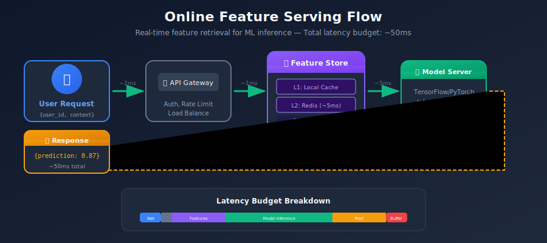
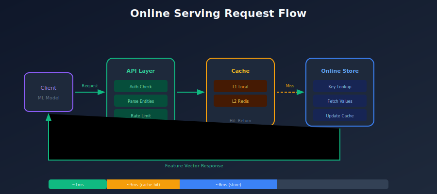
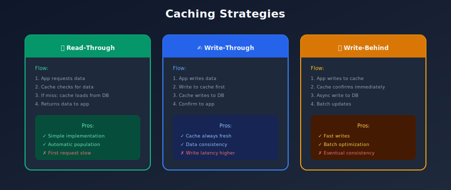
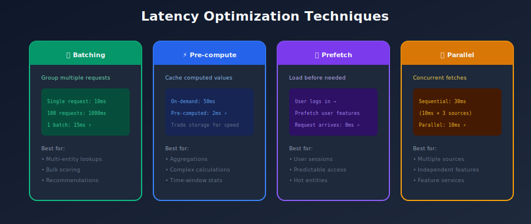
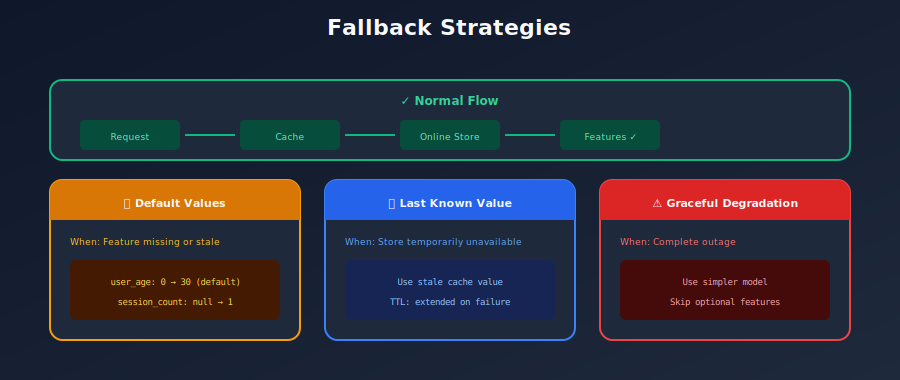
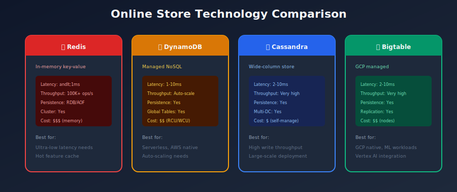

# ⚡ Chapter 5: Online Feature Serving

> *"Online serving is where milliseconds matter - the critical path between user request and ML prediction."*

<p align="center">
  
</p>

---

## 🎯 What You'll Learn

- Online serving architecture patterns
- Low-latency design principles
- Caching strategies
- Scaling for high throughput
- Online store technologies

---

## 📚 Table of Contents

1. [Online Serving Overview](#online-serving-overview)
2. [Latency Requirements](#latency-requirements)
3. [Online Store Design](#online-store-design)
4. [Serving Patterns](#serving-patterns)
5. [Caching Strategies](#caching-strategies)
6. [Scaling and Performance](#scaling-and-performance)

---

## Online Serving Overview

### What is Online Serving?

Online serving retrieves feature values in **real-time** for ML model inference. It's the critical path that directly impacts user experience.



### Online vs Offline Serving

| Aspect | Online Serving | Offline Serving |
|--------|---------------|-----------------|
| **Latency** | <10ms P99 | Minutes to hours |
| **Query** | Point lookup by entity | Batch scan with joins |
| **Data** | Latest feature values | Historical values |
| **Scale** | 100K+ QPS | Petabytes of data |
| **Use case** | Real-time inference | Training data |

---

## Latency Requirements

### Latency Budget Breakdown



### Latency Optimization Techniques

```python
# 1. BATCH REQUESTS (amortize overhead)
# Instead of:
for user_id in user_ids:
    features = store.get_online_features(entity_rows=[{"user_id": user_id}])

# Do this:
features = store.get_online_features(
    entity_rows=[{"user_id": uid} for uid in user_ids]  # Batch!
)

# 2. SELECT ONLY NEEDED FEATURES
# Instead of:
features = store.get_online_features(features=["user_features:*"])  # All features

# Do this:
features = store.get_online_features(
    features=[
        "user_features:age",
        "user_features:lifetime_value",
    ]  # Only what model needs
)

# 3. USE FEATURE SERVICES (single optimized query)
fraud_features = FeatureService(
    name="fraud_model_features",
    features=[user_features, merchant_features, transaction_features]
)

# Single call gets all features
features = store.get_online_features(
    features=fraud_features,
    entity_rows=entity_rows
)

```

---

## Online Store Design

### Key-Value Store Schema



### Online Store Technologies



---

## Serving Patterns

### Pattern 1: Direct Lookup

```python
class DirectLookupServer:
    """Simplest pattern: direct key-value lookup."""

    def __init__(self, redis_client):
        self.redis = redis_client

    def get_features(self, entity_id: str, feature_names: list) -> dict:
        """Get features directly from online store."""
        key = f"user_features:{entity_id}"

        if feature_names:
            values = self.redis.hmget(key, feature_names)
            return dict(zip(feature_names, values))
        else:
            return self.redis.hgetall(key)

```

### Pattern 2: Feature Service Aggregation

```python
class FeatureServiceServer:
    """Aggregate multiple feature views into single response."""

    def __init__(self, online_store, feature_registry):
        self.store = online_store
        self.registry = feature_registry

    def get_features(
        self,
        feature_service: str,
        entity_rows: list
    ) -> list:
        """Get features for a feature service."""

        # Look up feature service definition
        service_def = self.registry.get_feature_service(feature_service)

        # Group features by entity type
        features_by_entity = self._group_by_entity(service_def.features)

        results = []
        for entity_row in entity_rows:
            row_features = {}

            # Fetch from each feature view
            for entity_type, features in features_by_entity.items():
                entity_key = entity_row.get(entity_type)
                if entity_key:
                    view_features = self.store.get(
                        feature_view=features.view_name,
                        entity_key=entity_key,
                        feature_names=features.names
                    )
                    row_features.update(view_features)

            results.append(row_features)

        return results

```

### Pattern 3: With On-Demand Computation

```python
class HybridFeatureServer:
    """Combine pre-computed and on-demand features."""

    def get_features(
        self,
        feature_service: str,
        entity_rows: list,
        request_data: dict = None
    ) -> list:
        """Get pre-computed + compute on-demand features."""

        # 1. Get pre-computed features from online store
        precomputed = self._get_precomputed_features(
            feature_service, entity_rows
        )

        # 2. Compute on-demand features
        on_demand = self._compute_on_demand_features(
            feature_service, entity_rows, request_data, precomputed
        )

        # 3. Merge results
        results = []
        for i, row in enumerate(entity_rows):
            merged = {**precomputed[i], **on_demand[i]}
            results.append(merged)

        return results

    def _compute_on_demand_features(
        self,
        feature_service: str,
        entity_rows: list,
        request_data: dict,
        precomputed: list
    ) -> list:
        """Execute on-demand feature transformations."""

        service_def = self.registry.get_feature_service(feature_service)

        results = []
        for i, row in enumerate(entity_rows):
            inputs = {
                **precomputed[i],
                **request_data,
                **row
            }

            on_demand_features = {}
            for odfv in service_def.on_demand_feature_views:
                features = odfv.transform_fn(inputs)
                on_demand_features.update(features)

            results.append(on_demand_features)

        return results

```

---

## Caching Strategies

### Multi-Level Caching



### Cache Implementation

```python
from functools import lru_cache
import redis
from datetime import timedelta

class CachedFeatureStore:
    """Feature store with multi-level caching."""

    def __init__(self, online_store, redis_client):
        self.store = online_store
        self.redis = redis_client
        self._local_cache = {}
        self.local_cache_ttl = timedelta(seconds=30)
        self.redis_cache_ttl = timedelta(minutes=5)

    def get_features(self, entity_id: str, features: list) -> dict:
        """Get features with caching."""
        cache_key = f"{entity_id}:{','.join(sorted(features))}"

        # L1: Check local cache
        if cache_key in self._local_cache:
            entry = self._local_cache[cache_key]
            if entry['expires_at'] > datetime.now():
                return entry['data']

        # L2: Check Redis cache
        redis_key = f"feature_cache:{cache_key}"
        cached = self.redis.get(redis_key)
        if cached:
            data = json.loads(cached)
            self._set_local_cache(cache_key, data)
            return data

        # L3: Fetch from online store
        data = self.store.get_features(entity_id, features)

        # Populate caches
        self._set_local_cache(cache_key, data)
        self.redis.setex(
            redis_key,
            self.redis_cache_ttl,
            json.dumps(data)
        )

        return data

    def _set_local_cache(self, key: str, data: dict):
        self._local_cache[key] = {
            'data': data,
            'expires_at': datetime.now() + self.local_cache_ttl
        }

```

---

## Scaling and Performance

### Horizontal Scaling



### Performance Monitoring

```python
# Key metrics to monitor
METRICS = {
    # Latency metrics
    "feature_lookup_latency_p50": "P50 latency for feature lookups",
    "feature_lookup_latency_p99": "P99 latency for feature lookups",
    "feature_lookup_latency_max": "Max latency",

    # Throughput metrics
    "feature_requests_total": "Total feature requests",
    "feature_requests_per_second": "Request rate",

    # Cache metrics
    "cache_hit_rate": "Percentage of requests served from cache",
    "cache_size_bytes": "Current cache size",

    # Error metrics
    "feature_lookup_errors": "Failed lookups",
    "feature_null_rate": "Percentage of null features returned",

    # Staleness metrics
    "feature_age_seconds": "Age of returned features",
}

```

---

## Summary

### Online Serving Checklist

```
□ Latency budget defined (<10ms for features)
□ Online store selected (Redis/DynamoDB/etc)
□ Caching strategy implemented
□ Batch API for efficiency
□ Feature services defined
□ Monitoring dashboards set up
□ Auto-scaling configured
□ Failover strategy in place

```

### Key Takeaways

1. **Latency is critical** - Every millisecond counts
2. **Batch requests** - Amortize overhead
3. **Cache aggressively** - Multi-level caching
4. **Select only needed features** - Minimize data transfer
5. **Monitor everything** - Latency, throughput, errors

---

[← Previous: Feature Engineering](../04_feature_engineering/README.md) | [Back to Main](../README.md) | [Next: Offline Serving →](../06_offline_serving/README.md)

---

<div align="center">

**[⬆ Back to Top](#)** | **[📚 Main Repository](https://github.com/Gaurav14cs17/ml_system_design)**

Made with 💜 by [Gaurav14cs17](https://github.com/Gaurav14cs17)

</div>
