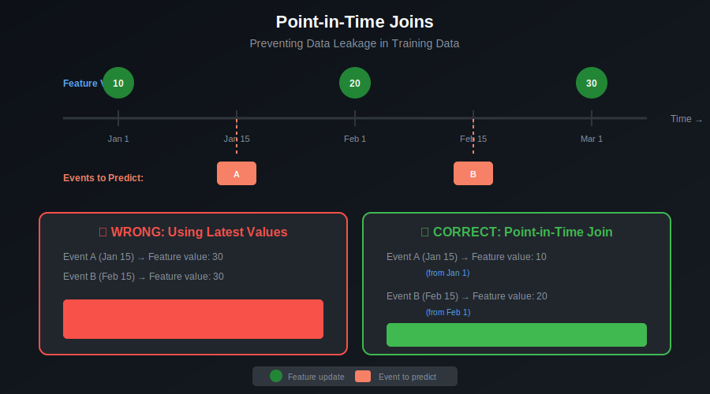
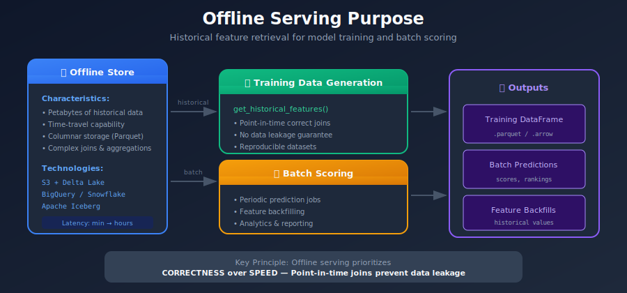
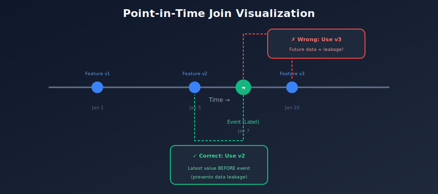
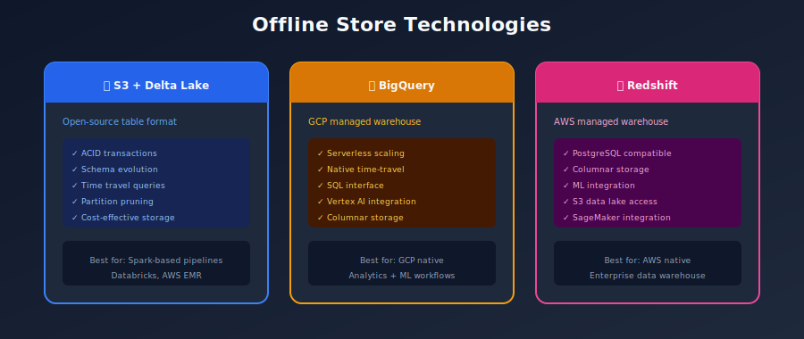

# 📦 Chapter 6: Offline Feature Serving

> *"Offline serving powers model training - where historical accuracy matters more than speed."*

<p align="center">
  
</p>

---

## 🎯 What You'll Learn

- Offline serving architecture

- Point-in-time correctness

- Training data generation

- Batch retrieval patterns

- Data formats and optimization

---

## 📚 Table of Contents

1. [Offline Serving Overview](#offline-serving-overview)

2. [Point-in-Time Joins](#point-in-time-joins)

3. [Training Data Generation](#training-data-generation)

4. [Offline Store Technologies](#offline-store-technologies)

5. [Query Optimization](#query-optimization)

6. [Data Formats](#data-formats)

---

## Offline Serving Overview

### Purpose of Offline Serving



### Offline vs Online Serving

| Aspect | Offline Serving | Online Serving |
|--------|-----------------|----------------|
| **Latency** | Minutes to hours | Milliseconds |
| **Scale** | Petabytes | Gigabytes |
| **Query** | Complex joins, aggregations | Point lookups |
| **Data** | Historical (time-travel) | Latest values only |
| **Output** | DataFrame/Parquet | JSON/Protobuf |
| **Use case** | Training, batch scoring | Real-time inference |

---

## Point-in-Time Joins

### The Critical Concept

Point-in-time joins ensure that training data uses **only information available at prediction time**, preventing data leakage.



### Implementation with Feast

```python
from feast import FeatureStore
import pandas as pd

# Initialize feature store
store = FeatureStore(repo_path="feature_repo/")

# Entity DataFrame with timestamps
entity_df = pd.DataFrame({
    "user_id": ["user_1", "user_2", "user_1"],
    "event_timestamp": [
        pd.Timestamp("2024-01-15"),
        pd.Timestamp("2024-01-20"),
        pd.Timestamp("2024-02-10"),
    ],
    "label": [1, 0, 0]
})

# Get historical features (point-in-time correct)
training_df = store.get_historical_features(
    entity_df=entity_df,
    features=[
        "user_features:login_count_30d",
        "user_features:total_purchases",
        "user_features:avg_session_duration",
    ]
).to_df()

# Result includes features as they were at each event_timestamp
print(training_df)

```

### SQL-Based Point-in-Time Join

```sql
-- Point-in-time join in SQL (e.g., BigQuery, Spark SQL)
WITH ranked_features AS (
    SELECT
        f.*,
        ROW_NUMBER() OVER (
            PARTITION BY f.user_id
            ORDER BY f.feature_timestamp DESC
        ) as rn
    FROM features f
    INNER JOIN labels l
        ON f.user_id = l.user_id
        AND f.feature_timestamp <= l.event_timestamp  -- Only past features!
)
SELECT
    l.user_id,
    l.event_timestamp,
    l.label,
    rf.login_count_30d,
    rf.total_purchases,
    rf.feature_timestamp as feature_ts_used
FROM labels l
LEFT JOIN ranked_features rf
    ON l.user_id = rf.user_id
    AND l.event_timestamp = rf.event_timestamp
    AND rf.rn = 1  -- Most recent feature before event

```

---

## Training Data Generation

### Complete Training Pipeline

```python
from feast import FeatureStore
from datetime import datetime, timedelta
import pandas as pd

class TrainingDataGenerator:
    """Generate training datasets from feature store."""

    def __init__(self, feature_store_path: str):
        self.store = FeatureStore(repo_path=feature_store_path)

    def generate_training_data(
        self,
        labels_query: str,
        feature_service: str,
        start_date: datetime,
        end_date: datetime,
        output_path: str
    ) -> pd.DataFrame:
        """
        Generate training dataset with point-in-time correct features.
        """

        # Step 1: Load labels
        print("Loading labels...")
        labels_df = self._load_labels(labels_query, start_date, end_date)
        print(f"  Loaded {len(labels_df)} labels")

        # Step 2: Get historical features
        print("Fetching historical features...")
        training_df = self.store.get_historical_features(
            entity_df=labels_df,
            features=self.store.get_feature_service(feature_service),
        ).to_df()
        print(f"  Generated {len(training_df)} training examples")

        # Step 3: Validate data quality
        print("Validating data quality...")
        self._validate_training_data(training_df)

        # Step 4: Save to storage
        print(f"Saving to {output_path}...")
        self._save_training_data(training_df, output_path)

        return training_df

    def _load_labels(
        self,
        query: str,
        start_date: datetime,
        end_date: datetime
    ) -> pd.DataFrame:
        """Load labels from data warehouse."""
        # Execute query against data warehouse
        # Must include entity columns and event_timestamp
        pass

    def _validate_training_data(self, df: pd.DataFrame):
        """Validate training data quality."""
        # Check for nulls
        null_pct = df.isnull().sum() / len(df) * 100
        high_null_cols = null_pct[null_pct > 10]
        if len(high_null_cols) > 0:
            print(f"  Warning: High null columns: {high_null_cols.to_dict()}")

        # Check for data leakage (feature timestamp > event timestamp)
        if 'feature_timestamp' in df.columns and 'event_timestamp' in df.columns:
            leakage = df[df['feature_timestamp'] > df['event_timestamp']]
            if len(leakage) > 0:
                raise ValueError(f"Data leakage detected: {len(leakage)} rows")

    def _save_training_data(self, df: pd.DataFrame, path: str):
        """Save training data in efficient format."""
        df.to_parquet(
            path,
            compression='snappy',
            index=False
        )

# Usage
generator = TrainingDataGenerator("feature_repo/")
training_df = generator.generate_training_data(
    labels_query="""
        SELECT user_id, event_timestamp, churned as label
        FROM ml.churn_labels
        WHERE event_timestamp BETWEEN '{start}' AND '{end}'
    """,
    feature_service="churn_prediction_features",
    start_date=datetime(2024, 1, 1),
    end_date=datetime(2024, 6, 30),
    output_path="s3://ml-data/training/churn_model_v2/"
)

```

---

## Offline Store Technologies

### Technology Comparison



### Delta Lake Configuration

```python
# Delta Lake offline store configuration
from feast import FeatureStore
from feast.infra.offline_stores.contrib.spark_offline_store.spark import (
    SparkOfflineStoreConfig
)

# feature_store.yaml
"""
project: ml_platform
registry: s3://feature-store/registry.db
provider: local

offline_store:
    type: spark
    spark_conf:
        spark.sql.extensions: io.delta.sql.DeltaSparkSessionExtension
        spark.sql.catalog.spark_catalog: org.apache.spark.sql.delta.catalog.DeltaCatalog
        spark.databricks.delta.retentionDurationCheck.enabled: false
"""

# Writing features to Delta Lake
features_df.write.format("delta").mode("append").partitionBy(
    "date"
).save("s3://feature-store/user_features/")

# Reading with time travel
historical_features = spark.read.format("delta").option(
    "timestampAsOf", "2024-01-15 00:00:00"
).load("s3://feature-store/user_features/")

```

---

## Query Optimization

### Partition Pruning

```python
# Effective partitioning strategy
"""
PARTITION STRATEGY:
s3://feature-store/user_features/
+-- date=2024-01-01/

|   +-- hour=00/
|   |   +-- part-00000.parquet

|   +-- hour=01/
|   +-- ...
+-- date=2024-01-02/
+-- ...

Query: Get features for Jan 15
→ Only scans date=2024-01-15/ partition
→ 30x faster than full scan
"""

# Spark query with partition pruning
features = spark.read.parquet("s3://feature-store/user_features/").filter(
    (F.col("date") >= "2024-01-15") &
    (F.col("date") <= "2024-01-15")
)

```

### Predicate Pushdown

```python
# Let storage layer filter data
# Good: Filter pushed to Parquet
df = spark.read.parquet(path).filter(F.col("user_id") == "user_123")

# Bad: Filter applied after full scan
df = spark.read.parquet(path)
df = df[df["user_id"] == "user_123"]  # Full data loaded first!

```

---

## Data Formats

### Parquet Optimization

```python
# Optimal Parquet settings for feature data
def write_features_parquet(df, path):
    df.write.format("parquet").option(
        "compression", "snappy"  # Fast compression
    ).option(
        "parquet.block.size", 128 * 1024 * 1024  # 128MB row groups
    ).option(
        "parquet.page.size", 1024 * 1024  # 1MB pages
    ).mode("append").partitionBy(
        "date"
    ).save(path)

```

### Format Comparison

| Format | Compression | Read Speed | Write Speed | Best For |
|--------|-------------|------------|-------------|----------|
| **Parquet** | High | Fast | Medium | General purpose |
| **Delta** | High | Fast | Medium | ACID, time-travel |
| **Iceberg** | High | Fast | Medium | Schema evolution |
| **Avro** | Medium | Medium | Fast | Streaming |

---

## Summary

### Offline Serving Best Practices

1. **Always use point-in-time joins** - Prevent data leakage

2. **Partition by time** - Enable efficient queries

3. **Use columnar formats** - Parquet/Delta for analytics

4. **Validate training data** - Check for nulls, leakage

5. **Version training datasets** - Reproducibility

### Key Takeaways

- Offline serving is about **correctness**, not speed

- Point-in-time joins are **essential** for valid training data

- Choose storage based on **scale and query patterns**

- **Optimize partitioning** for your access patterns

---

[← Previous: Online Serving](../05_online_serving/README.md) | [Back to Main](../README.md) | [Next: Feature Registry →](../07_feature_registry/README.md)

---

<div align="center">

**[⬆ Back to Top](#)** | **[📚 Main Repository](https://github.com/Gaurav14cs17/ml_system_design)**

Made with 💜 by [Gaurav14cs17](https://github.com/Gaurav14cs17)

</div>
