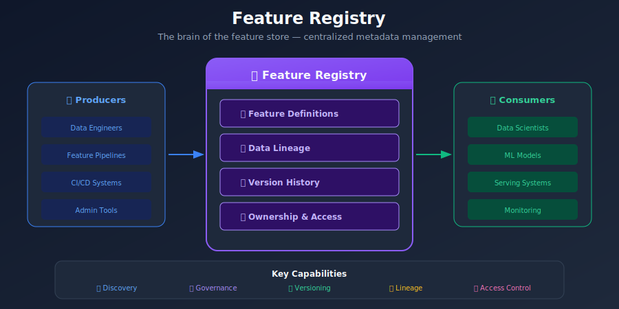
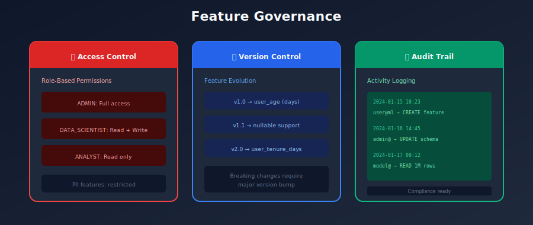

# 📋 Chapter 7: Feature Registry

> *"The feature registry is the brain of your feature store - the single source of truth for all feature metadata."*

---

## 🎯 What You'll Learn

- What is a feature registry
- Metadata management
- Feature discovery and search
- Lineage tracking
- Governance and access control

---

## 📚 Table of Contents

1. [Registry Overview](#registry-overview)
2. [Metadata Schema](#metadata-schema)
3. [Feature Discovery](#feature-discovery)
4. [Lineage Tracking](#lineage-tracking)
5. [Governance](#governance)
6. [Implementation Patterns](#implementation-patterns)

---

## Registry Overview

### What is a Feature Registry?



### Registry in the Feature Store


---

## Metadata Schema

### Core Registry Entities

```python
from dataclasses import dataclass
from typing import List, Dict, Optional
from datetime import datetime
from enum import Enum

class FeatureStatus(Enum):
    ACTIVE = "active"
    DEPRECATED = "deprecated"
    EXPERIMENTAL = "experimental"

@dataclass
class EntityDefinition:
    """Entity registered in the feature store."""
    name: str
    join_keys: List[str]
    description: str
    owner: str
    created_at: datetime
    tags: Dict[str, str]

@dataclass
class FeatureDefinition:
    """Individual feature metadata."""
    name: str
    dtype: str
    description: str
    feature_view: str
    entity: str

    # Ownership
    owner: str
    team: str

    # Classification
    tags: List[str]
    status: FeatureStatus

    # Data quality
    null_percentage: Optional[float]
    freshness_sla: Optional[str]

    # Governance
    pii: bool
    gdpr_relevant: bool

    # Lineage
    source_table: str
    transformation: str
    dependencies: List[str]

    # History
    created_at: datetime
    updated_at: datetime
    version: str

@dataclass
class FeatureViewDefinition:
    """Feature view (group of features) metadata."""
    name: str
    entities: List[str]
    features: List[str]
    source: str
    ttl_seconds: int

    owner: str
    description: str
    tags: Dict[str, str]

    # Computation
    batch_source: Optional[str]
    stream_source: Optional[str]
    transformation_query: Optional[str]

    created_at: datetime
    version: str

@dataclass
class FeatureServiceDefinition:
    """Feature service (model-facing API) metadata."""
    name: str
    features: List[str]  # feature_view:feature_name

    owner: str
    description: str

    # Usage tracking
    consuming_models: List[str]

    created_at: datetime
    version: str

```

### Database Schema

```sql
-- Feature Registry Database Schema

CREATE TABLE entities (
    id SERIAL PRIMARY KEY,
    name VARCHAR(255) UNIQUE NOT NULL,
    join_keys JSONB NOT NULL,
    description TEXT,
    owner VARCHAR(255),
    tags JSONB DEFAULT '{}',
    created_at TIMESTAMP DEFAULT NOW(),
    updated_at TIMESTAMP DEFAULT NOW()
);

CREATE TABLE feature_views (
    id SERIAL PRIMARY KEY,
    name VARCHAR(255) UNIQUE NOT NULL,
    entity_names JSONB NOT NULL,
    source_type VARCHAR(50),
    source_config JSONB,
    ttl_seconds INTEGER,
    description TEXT,
    owner VARCHAR(255),
    tags JSONB DEFAULT '{}',
    created_at TIMESTAMP DEFAULT NOW(),
    version VARCHAR(50) DEFAULT '1.0.0'
);

CREATE TABLE features (
    id SERIAL PRIMARY KEY,
    name VARCHAR(255) NOT NULL,
    feature_view_id INTEGER REFERENCES feature_views(id),
    dtype VARCHAR(50) NOT NULL,
    description TEXT,
    tags JSONB DEFAULT '{}',

    -- Governance
    is_pii BOOLEAN DEFAULT FALSE,
    status VARCHAR(50) DEFAULT 'active',

    -- Quality metrics (updated by monitoring)
    null_percentage FLOAT,
    last_computed_at TIMESTAMP,

    created_at TIMESTAMP DEFAULT NOW(),
    UNIQUE(name, feature_view_id)
);

CREATE TABLE feature_services (
    id SERIAL PRIMARY KEY,
    name VARCHAR(255) UNIQUE NOT NULL,
    feature_refs JSONB NOT NULL,  -- ["view:feature", ...]
    description TEXT,
    owner VARCHAR(255),
    created_at TIMESTAMP DEFAULT NOW(),
    version VARCHAR(50) DEFAULT '1.0.0'
);

CREATE TABLE feature_lineage (
    id SERIAL PRIMARY KEY,
    source_type VARCHAR(50),  -- 'table', 'feature', 'model'
    source_id VARCHAR(255),
    target_type VARCHAR(50),
    target_id VARCHAR(255),
    relationship VARCHAR(50),  -- 'derived_from', 'used_by'
    created_at TIMESTAMP DEFAULT NOW()
);

-- Indexes for search
CREATE INDEX idx_features_tags ON features USING GIN (tags);
CREATE INDEX idx_feature_views_owner ON feature_views(owner);
CREATE INDEX idx_features_status ON features(status);

```

---

## Feature Discovery

### Search and Browse

```python
class FeatureDiscovery:
    """Feature discovery and search capabilities."""

    def __init__(self, registry_db):
        self.db = registry_db

    def search_features(
        self,
        query: str = None,
        tags: List[str] = None,
        owner: str = None,
        entity: str = None,
        status: str = "active",
        limit: int = 100
    ) -> List[FeatureDefinition]:
        """
        Search features by various criteria.
        """
        sql = """
            SELECT f.*, fv.name as view_name
            FROM features f
            JOIN feature_views fv ON f.feature_view_id = fv.id
            WHERE f.status = %s
        """
        params = [status]

        if query:
            sql += " AND (f.name ILIKE %s OR f.description ILIKE %s)"
            params.extend([f"%{query}%", f"%{query}%"])

        if tags:
            sql += " AND f.tags ?| %s"
            params.append(tags)

        if owner:
            sql += " AND fv.owner = %s"
            params.append(owner)

        if entity:
            sql += " AND fv.entity_names ? %s"
            params.append(entity)

        sql += " LIMIT %s"
        params.append(limit)

        return self.db.execute(sql, params)

    def get_feature_stats(self, feature_name: str) -> dict:
        """Get statistics about a feature."""
        return {
            "usage_count": self._count_models_using(feature_name),
            "null_percentage": self._get_null_rate(feature_name),
            "last_updated": self._get_last_update(feature_name),
            "freshness": self._get_freshness(feature_name),
        }

    def get_similar_features(self, feature_name: str, limit: int = 10) -> List[str]:
        """Find features similar to the given one."""
        # Based on:
        # - Name similarity
        # - Same entity
        # - Same tags
        # - Same owner/team
        pass

    def get_popular_features(self, limit: int = 20) -> List[dict]:
        """Get most used features across models."""
        sql = """
            SELECT f.name, COUNT(DISTINCT fs.id) as usage_count
            FROM features f
            JOIN feature_services fs ON fs.feature_refs ? f.name
            WHERE f.status = 'active'
            GROUP BY f.name
            ORDER BY usage_count DESC
            LIMIT %s
        """
        return self.db.execute(sql, [limit])

# Usage example
discovery = FeatureDiscovery(registry_db)

# Search for user engagement features
results = discovery.search_features(
    query="engagement",
    tags=["user", "activity"],
    entity="user",
    status="active"
)

# Display in CLI/UI
for feature in results:
    print(f"""
    {feature.name}
    +-- Type: {feature.dtype}
    +-- View: {feature.feature_view}
    +-- Owner: {feature.owner}
    +-- Tags: {', '.join(feature.tags)}
    +-- Description: {feature.description}
    """)

```

---

## Lineage Tracking

### Lineage Graph



### Lineage Implementation

```python
class LineageTracker:
    """Track feature lineage and dependencies."""

    def __init__(self, registry_db):
        self.db = registry_db

    def add_lineage(
        self,
        source_type: str,
        source_id: str,
        target_type: str,
        target_id: str,
        relationship: str = "derived_from"
    ):
        """Record a lineage relationship."""
        sql = """
            INSERT INTO feature_lineage
            (source_type, source_id, target_type, target_id, relationship)
            VALUES (%s, %s, %s, %s, %s)
            ON CONFLICT DO NOTHING
        """
        self.db.execute(sql, [
            source_type, source_id, target_type, target_id, relationship
        ])

    def get_upstream(self, feature_name: str) -> List[dict]:
        """Get all upstream dependencies (data sources, other features)."""
        sql = """
            WITH RECURSIVE upstream AS (
                SELECT source_type, source_id, 1 as depth
                FROM feature_lineage
                WHERE target_type = 'feature' AND target_id = %s

                UNION ALL

                SELECT l.source_type, l.source_id, u.depth + 1
                FROM feature_lineage l
                JOIN upstream u ON l.target_id = u.source_id
                WHERE u.depth < 10
            )
            SELECT * FROM upstream
        """
        return self.db.execute(sql, [feature_name])

    def get_downstream(self, feature_name: str) -> List[dict]:
        """Get all downstream dependents (features, models)."""
        sql = """
            WITH RECURSIVE downstream AS (
                SELECT target_type, target_id, 1 as depth
                FROM feature_lineage
                WHERE source_type = 'feature' AND source_id = %s

                UNION ALL

                SELECT l.target_type, l.target_id, d.depth + 1
                FROM feature_lineage l
                JOIN downstream d ON l.source_id = d.target_id
                WHERE d.depth < 10
            )
            SELECT * FROM downstream
        """
        return self.db.execute(sql, [feature_name])

    def impact_analysis(self, source_type: str, source_id: str) -> dict:
        """Analyze impact if a source changes."""
        downstream = self.get_downstream_all(source_type, source_id)

        return {
            "affected_features": [
                d for d in downstream if d["target_type"] == "feature"
            ],
            "affected_models": [
                d for d in downstream if d["target_type"] == "model"
            ],
            "affected_services": [
                d for d in downstream if d["target_type"] == "service"
            ],
        }

# Usage
lineage = LineageTracker(registry_db)

# Record lineage when defining features
lineage.add_lineage(
    source_type="table",
    source_id="orders",
    target_type="feature",
    target_id="user_total_orders"
)

# Impact analysis before making changes
impact = lineage.impact_analysis("table", "orders")
print(f"Changing orders table will affect:")
print(f"  - {len(impact['affected_features'])} features")
print(f"  - {len(impact['affected_models'])} models")

```

---

## Governance

### Access Control

```python
class FeatureAccessControl:
    """Manage access to features and feature views."""

    def __init__(self, registry_db):
        self.db = registry_db

    def check_access(
        self,
        user: str,
        feature_name: str,
        action: str  # 'read', 'write', 'admin'
    ) -> bool:
        """Check if user has access to feature."""
        # Get feature's access control list
        acl = self._get_feature_acl(feature_name)

        # Check user permissions
        user_groups = self._get_user_groups(user)

        for group in user_groups:
            if group in acl.get(action, []):
                return True

        return False

    def set_access(
        self,
        feature_name: str,
        action: str,
        groups: List[str]
    ):
        """Set access control for a feature."""
        sql = """
            UPDATE features
            SET access_control = access_control || %s
            WHERE name = %s
        """
        self.db.execute(sql, [
            {action: groups},
            feature_name
        ])

# Example access policies
ACCESS_POLICIES = {
    "user_pii_features": {
        "read": ["data-scientists", "ml-engineers", "compliance"],
        "write": ["data-platform"],
        "admin": ["data-platform-leads"]
    },
    "public_features": {
        "read": ["*"],  # Everyone
        "write": ["data-platform", "ml-engineers"],
        "admin": ["data-platform"]
    }
}

```

### Data Classification

```python
# Feature classification for governance
CLASSIFICATION_LEVELS = {
    "public": {
        "description": "Non-sensitive, can be widely shared",
        "retention": "indefinite",
        "access": "all_employees"
    },
    "internal": {
        "description": "Internal business data",
        "retention": "3_years",
        "access": "data_team"
    },
    "confidential": {
        "description": "Sensitive business data",
        "retention": "1_year",
        "access": "need_to_know"
    },
    "pii": {
        "description": "Personally identifiable information",
        "retention": "as_required",
        "access": "pii_approved",
        "gdpr": True,
        "encryption": "required"
    }
}

```

---

## Implementation Patterns

### GitOps for Feature Definitions

```yaml
# feature_repo/feature_views/user_features.yaml
apiVersion: feast.dev/v1alpha1
kind: FeatureView
metadata:
  name: user_features
  labels:
    team: growth
    domain: user
spec:
  entities:
    - user
  ttl: 86400s  # 1 day
  features:
    - name: total_purchases
      dtype: INT64
      description: Total number of purchases by user
      tags:
        - engagement
        - monetization
    - name: avg_order_value
      dtype: FLOAT64
      description: Average order value in USD
  source:
    type: bigquery
    table: project.dataset.user_features
    timestamp_field: feature_timestamp

```

### Registry API

```python
from fastapi import FastAPI, HTTPException
from pydantic import BaseModel

app = FastAPI(title="Feature Registry API")

@app.get("/features")
def list_features(
    tags: List[str] = None,
    owner: str = None,
    status: str = "active"
):
    """List all features matching criteria."""
    return discovery.search_features(tags=tags, owner=owner, status=status)

@app.get("/features/{feature_name}")
def get_feature(feature_name: str):
    """Get feature details."""
    feature = registry.get_feature(feature_name)
    if not feature:
        raise HTTPException(404, "Feature not found")
    return feature

@app.get("/features/{feature_name}/lineage")
def get_feature_lineage(feature_name: str):
    """Get feature lineage."""
    return {
        "upstream": lineage.get_upstream(feature_name),
        "downstream": lineage.get_downstream(feature_name)
    }

@app.post("/features/{feature_name}/deprecate")
def deprecate_feature(feature_name: str):
    """Mark feature as deprecated."""
    # Check for downstream dependencies
    downstream = lineage.get_downstream(feature_name)
    if downstream:
        return {
            "status": "warning",
            "message": f"Feature has {len(downstream)} dependents",
            "dependents": downstream
        }

    registry.update_status(feature_name, "deprecated")
    return {"status": "deprecated"}

```

---

## Summary

### Registry Best Practices

| Practice | Description |
|----------|-------------|
| **Single source of truth** | All metadata in one place |
| **Version everything** | Track all changes |
| **Enforce ownership** | Every feature has an owner |
| **Track lineage** | Know upstream and downstream |
| **Enable discovery** | Make features searchable |

### Key Takeaways

1. Registry is the **brain** of the feature store
2. **Metadata quality** drives feature reuse
3. **Lineage** enables impact analysis
4. **Governance** ensures compliance
5. **GitOps** enables versioning and review

---

[← Previous: Offline Serving](../06_offline_serving/README.md) | [Back to Main](../README.md) | [Next: Data Sources →](../08_data_sources/README.md)

---

<div align="center">

**[⬆ Back to Top](#)** | **[📚 Main Repository](https://github.com/Gaurav14cs17/ml_system_design)**

Made with 💜 by [Gaurav14cs17](https://github.com/Gaurav14cs17)

</div>
