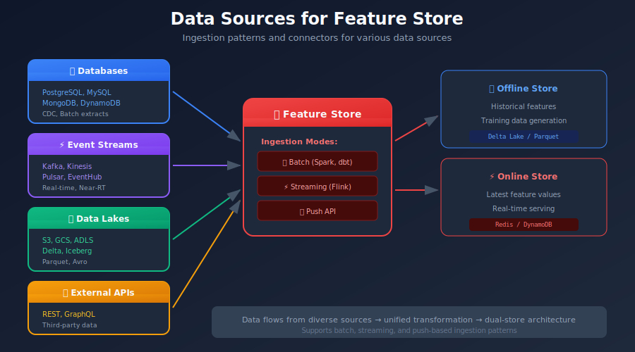
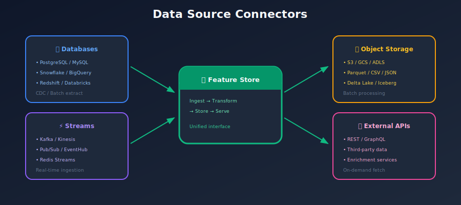
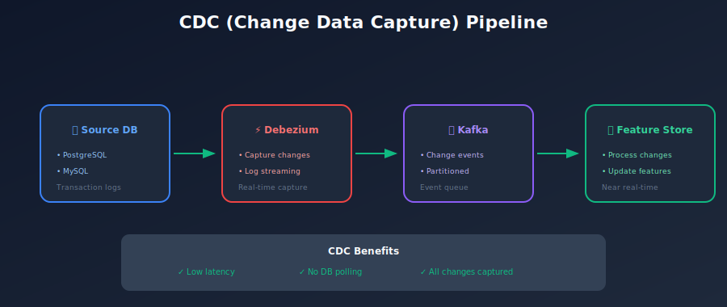
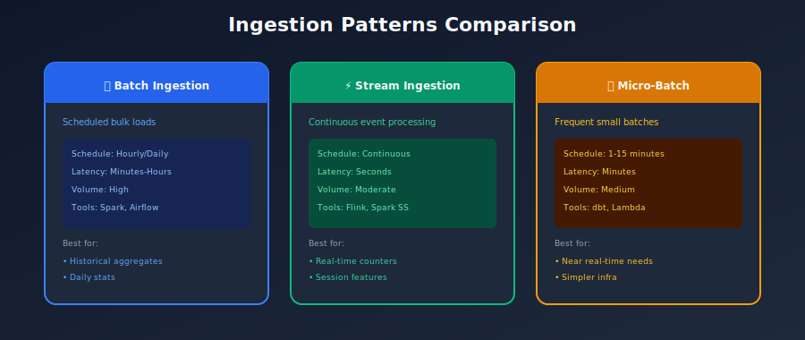

# 🔌 Chapter 8: Data Sources & Ingestion

> *"A feature store is only as good as its data sources - garbage in, garbage out."*

---

## 🎯 What You'll Learn

- Types of data sources
- Ingestion patterns (batch and streaming)
- Data connectors
- Change Data Capture (CDC)
- Data quality at ingestion

---

## 📚 Table of Contents

1. [Data Source Types](#data-source-types)
2. [Batch Ingestion](#batch-ingestion)
3. [Streaming Ingestion](#streaming-ingestion)
4. [Change Data Capture](#change-data-capture)
5. [Data Connectors](#data-connectors)
6. [Data Quality](#data-quality)

---

## Data Source Types

### Common Data Sources



### Source Configuration in Feast

```python
from feast import FileSource, BigQuerySource, KafkaSource
from feast.data_format import JsonFormat

# File source (Data Lake)
file_source = FileSource(
    name="user_transactions",
    path="s3://data-lake/transactions/*.parquet",
    timestamp_field="event_timestamp",
    created_timestamp_column="created_timestamp",
    description="User transaction events from data lake"
)

# BigQuery source (Data Warehouse)
bq_source = BigQuerySource(
    name="user_profiles",
    table="project.dataset.user_profiles",
    timestamp_field="updated_at",
    description="User profile data from BigQuery"
)

# Kafka source (Streaming)
kafka_source = KafkaSource(
    name="click_events",
    kafka_bootstrap_servers="localhost:9092",
    topic="user-clicks",
    timestamp_field="event_timestamp",
    message_format=JsonFormat(
        schema_json="""{
            "type": "record",
            "name": "ClickEvent",
            "fields": [
                {"name": "user_id", "type": "string"},
                {"name": "page", "type": "string"},
                {"name": "event_timestamp", "type": "long"}
            ]
        }"""
    )
)

```

---

## Batch Ingestion

### Batch Ingestion Pipeline



### Spark Batch Ingestion

```python
from pyspark.sql import SparkSession
from datetime import datetime, timedelta

class BatchIngestionPipeline:
    """Batch ingestion from various sources."""

    def __init__(self, spark: SparkSession):
        self.spark = spark

    def ingest_from_database(
        self,
        jdbc_url: str,
        table: str,
        start_time: datetime,
        end_time: datetime
    ):
        """Ingest data from JDBC source."""

        df = self.spark.read.format("jdbc").options(
            url=jdbc_url,
            dbtable=f"""(
                SELECT * FROM {table}
                WHERE updated_at >= '{start_time}'
                AND updated_at < '{end_time}'
            ) as subquery""",
            driver="org.postgresql.Driver",
            numPartitions=10,
            partitionColumn="id",
            lowerBound=0,
            upperBound=1000000
        ).load()

        return df

    def ingest_from_data_lake(
        self,
        path: str,
        date: str
    ):
        """Ingest partitioned data from data lake."""

        df = self.spark.read.parquet(
            f"{path}/date={date}/"
        )
        return df

    def compute_features(self, df):
        """Transform raw data into features."""
        from pyspark.sql import functions as F

        features = df.groupBy("user_id").agg(
            F.sum("amount").alias("total_amount"),
            F.count("*").alias("transaction_count"),
            F.avg("amount").alias("avg_amount"),
            F.max("timestamp").alias("last_transaction")
        ).withColumn(
            "feature_timestamp",
            F.current_timestamp()
        )

        return features

    def write_to_feature_store(self, features, path: str):
        """Write features to offline store."""
        features.write.format("delta").mode("append").partitionBy(
            "date"
        ).save(path)

# Airflow DAG task
def run_batch_ingestion(ds, **kwargs):
    spark = SparkSession.builder.appName("feature_ingestion").getOrCreate()
    pipeline = BatchIngestionPipeline(spark)

    # Ingest yesterday's data
    df = pipeline.ingest_from_data_lake(
        path="s3://data-lake/transactions/",
        date=ds
    )

    features = pipeline.compute_features(df)

    pipeline.write_to_feature_store(
        features,
        path="s3://feature-store/user_features/"
    )

```

---

## Streaming Ingestion

### Streaming Pipeline Architecture



### Kafka + Flink Streaming

```python
from pyflink.datastream import StreamExecutionEnvironment
from pyflink.table import StreamTableEnvironment

class StreamIngestionPipeline:
    """Streaming ingestion with Flink."""

    def __init__(self):
        self.env = StreamExecutionEnvironment.get_execution_environment()
        self.t_env = StreamTableEnvironment.create(self.env)

    def setup_kafka_source(self):
        """Configure Kafka source."""
        self.t_env.execute_sql("""
            CREATE TABLE click_events (
                user_id STRING,
                page_id STRING,
                action STRING,
                event_time TIMESTAMP(3),
                WATERMARK FOR event_time AS event_time - INTERVAL '5' SECOND
            ) WITH (
                'connector' = 'kafka',
                'topic' = 'click-events',
                'properties.bootstrap.servers' = 'kafka:9092',
                'format' = 'json',
                'scan.startup.mode' = 'latest-offset'
            )
        """)

    def compute_streaming_features(self):
        """Compute windowed features from stream."""
        self.t_env.execute_sql("""
            CREATE VIEW user_click_features AS
            SELECT
                user_id,
                TUMBLE_END(event_time, INTERVAL '5' MINUTE) as feature_time,
                COUNT(*) as click_count_5min,
                COUNT(DISTINCT page_id) as unique_pages_5min
            FROM click_events
            GROUP BY user_id, TUMBLE(event_time, INTERVAL '5' MINUTE)
        """)

    def sink_to_redis(self):
        """Write to online store."""
        self.t_env.execute_sql("""
            CREATE TABLE redis_sink (
                user_id STRING,
                click_count_5min BIGINT,
                unique_pages_5min BIGINT,
                PRIMARY KEY (user_id) NOT ENFORCED
            ) WITH (
                'connector' = 'redis',
                'host' = 'redis',
                'port' = '6379',
                'command' = 'HSET'
            )
        """)

        self.t_env.execute_sql("""
            INSERT INTO redis_sink
            SELECT user_id, click_count_5min, unique_pages_5min
            FROM user_click_features
        """)

```

---

## Change Data Capture

### CDC Pattern



### Debezium CDC Setup

```json
// Debezium connector configuration
{
  "name": "users-connector",
  "config": {
    "connector.class": "io.debezium.connector.postgresql.PostgresConnector",
    "database.hostname": "postgres",
    "database.port": "5432",
    "database.user": "debezium",
    "database.password": "secret",
    "database.dbname": "app_db",
    "database.server.name": "app",
    "table.include.list": "public.users,public.orders",
    "plugin.name": "pgoutput",
    "slot.name": "debezium_slot",
    "publication.name": "debezium_pub",
    "transforms": "route",
    "transforms.route.type": "org.apache.kafka.connect.transforms.RegexRouter",
    "transforms.route.regex": "([^.]+)\\.([^.]+)\\.([^.]+)",
    "transforms.route.replacement": "$3-cdc"
  }
}

```

### Processing CDC Events

```python
def process_cdc_event(event: dict) -> dict:
    """Process a CDC event from Debezium."""

    operation = event.get("op")  # c=create, u=update, d=delete

    if operation == "d":
        # Handle delete
        return {
            "action": "delete",
            "key": event["before"]["id"]
        }

    # For create/update, use "after" state
    record = event.get("after", {})

    return {
        "action": "upsert",
        "key": record["id"],
        "data": record,
        "timestamp": event.get("ts_ms")
    }

```

---

## Data Connectors

### Connector Architecture

```python
from abc import ABC, abstractmethod
from typing import Iterator, Dict, Any

class DataConnector(ABC):
    """Base class for data source connectors."""

    @abstractmethod
    def connect(self):
        """Establish connection to data source."""
        pass

    @abstractmethod
    def read(self, query: str) -> Iterator[Dict[str, Any]]:
        """Read data from source."""
        pass

    @abstractmethod
    def close(self):
        """Close connection."""
        pass

class PostgresConnector(DataConnector):
    """PostgreSQL connector."""

    def __init__(self, host: str, port: int, database: str, user: str, password: str):
        self.config = {
            "host": host,
            "port": port,
            "database": database,
            "user": user,
            "password": password
        }
        self.conn = None

    def connect(self):
        import psycopg2
        self.conn = psycopg2.connect(**self.config)

    def read(self, query: str) -> Iterator[Dict[str, Any]]:
        with self.conn.cursor() as cursor:
            cursor.execute(query)
            columns = [desc[0] for desc in cursor.description]
            for row in cursor:
                yield dict(zip(columns, row))

    def close(self):
        if self.conn:
            self.conn.close()

class KafkaConnector(DataConnector):
    """Kafka streaming connector."""

    def __init__(self, bootstrap_servers: str, topic: str, group_id: str):
        self.config = {
            "bootstrap_servers": bootstrap_servers,
            "group_id": group_id,
            "auto_offset_reset": "earliest"
        }
        self.topic = topic
        self.consumer = None

    def connect(self):
        from kafka import KafkaConsumer
        self.consumer = KafkaConsumer(
            self.topic,
            **self.config,
            value_deserializer=lambda m: json.loads(m.decode('utf-8'))
        )

    def read(self, query: str = None) -> Iterator[Dict[str, Any]]:
        for message in self.consumer:
            yield message.value

    def close(self):
        if self.consumer:
            self.consumer.close()

```

---

## Data Quality

### Quality Checks at Ingestion

```python
from great_expectations.core import ExpectationSuite
import great_expectations as ge

class DataQualityValidator:
    """Validate data quality at ingestion."""

    def __init__(self):
        self.context = ge.get_context()

    def create_expectations(self, feature_name: str) -> ExpectationSuite:
        """Create expectations for a feature."""
        suite = self.context.create_expectation_suite(
            f"{feature_name}_expectations"
        )

        # Add expectations
        suite.add_expectation(
            ge.expectations.ExpectColumnValuesToNotBeNull(
                column="user_id"
            )
        )

        suite.add_expectation(
            ge.expectations.ExpectColumnValuesToBeBetween(
                column="amount",
                min_value=0,
                max_value=100000
            )
        )

        return suite

    def validate(self, df, suite_name: str) -> dict:
        """Validate DataFrame against expectations."""
        batch = self.context.get_batch(
            batch_kwargs={"dataset": df},
            expectation_suite_name=suite_name
        )

        results = batch.validate()

        return {
            "success": results.success,
            "statistics": results.statistics,
            "failed_expectations": [
                r for r in results.results if not r.success
            ]
        }

# Usage in ingestion pipeline
def ingest_with_validation(df, feature_name: str):
    validator = DataQualityValidator()

    # Validate data quality
    results = validator.validate(df, f"{feature_name}_expectations")

    if not results["success"]:
        # Log failures
        for failure in results["failed_expectations"]:
            logger.warning(f"Quality check failed: {failure}")

        # Optionally halt pipeline
        if critical_failure(results):
            raise DataQualityError("Critical data quality failure")

    # Proceed with ingestion
    write_to_feature_store(df)

```

---

## Summary

### Data Source Best Practices

| Practice | Description |
|----------|-------------|
| **Use CDC for databases** | Real-time, efficient updates |
| **Validate at ingestion** | Catch quality issues early |
| **Handle late data** | Watermarks for streaming |
| **Monitor freshness** | Track data latency |
| **Version schemas** | Handle schema evolution |

### Key Takeaways

1. **Choose the right pattern** - Batch vs streaming vs CDC
2. **Validate early** - Data quality at ingestion
3. **Handle failures gracefully** - Retries, dead letter queues
4. **Monitor everything** - Latency, throughput, errors

---

[← Previous: Feature Registry](../07_feature_registry/README.md) | [Back to Main](../README.md) | [Next: Monitoring →](../09_monitoring/README.md)

---

<div align="center">

**[⬆ Back to Top](#)** | **[📚 Main Repository](https://github.com/Gaurav14cs17/ml_system_design)**

Made with 💜 by [Gaurav14cs17](https://github.com/Gaurav14cs17)

</div>
