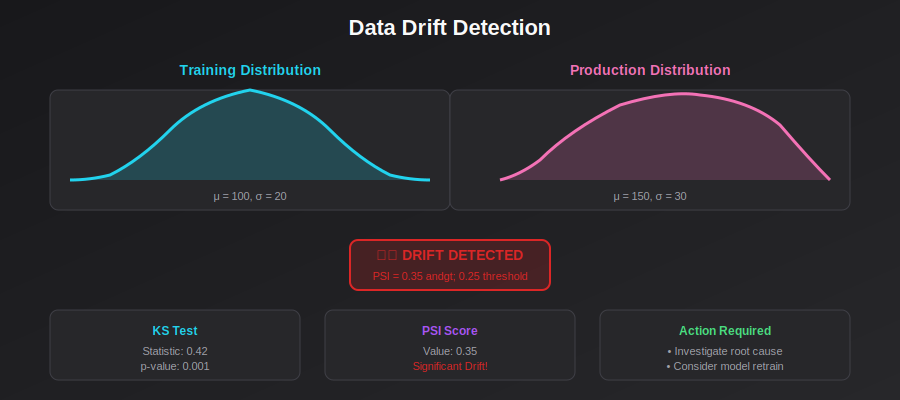
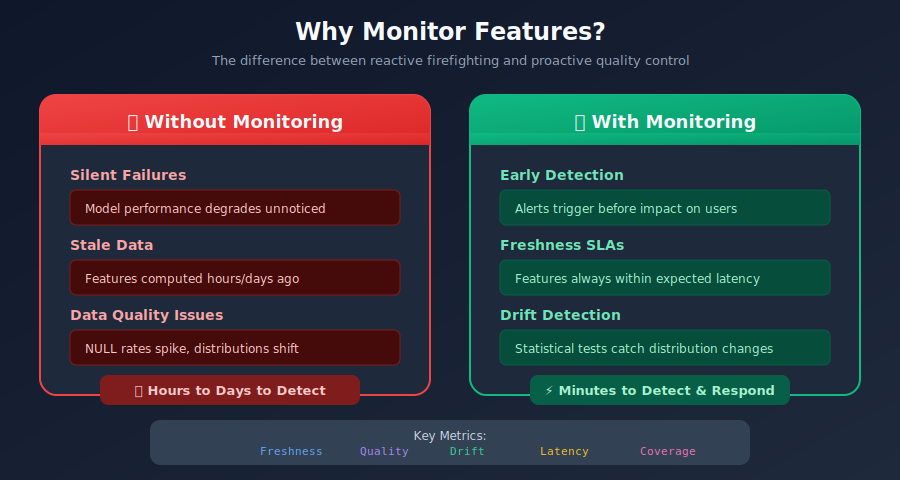
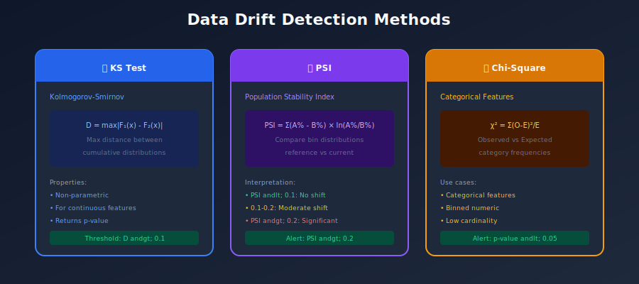
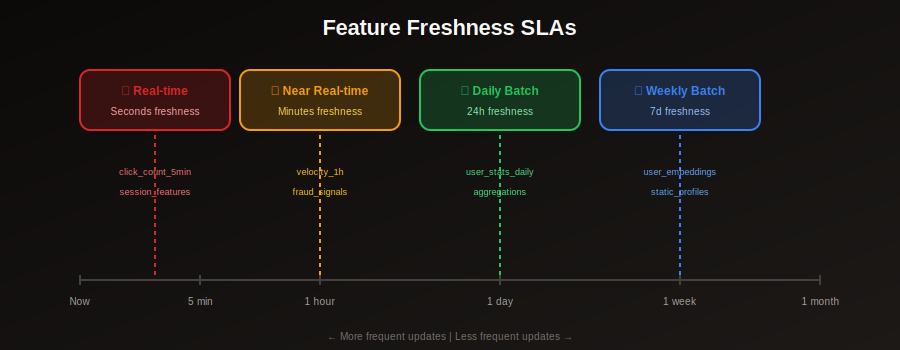
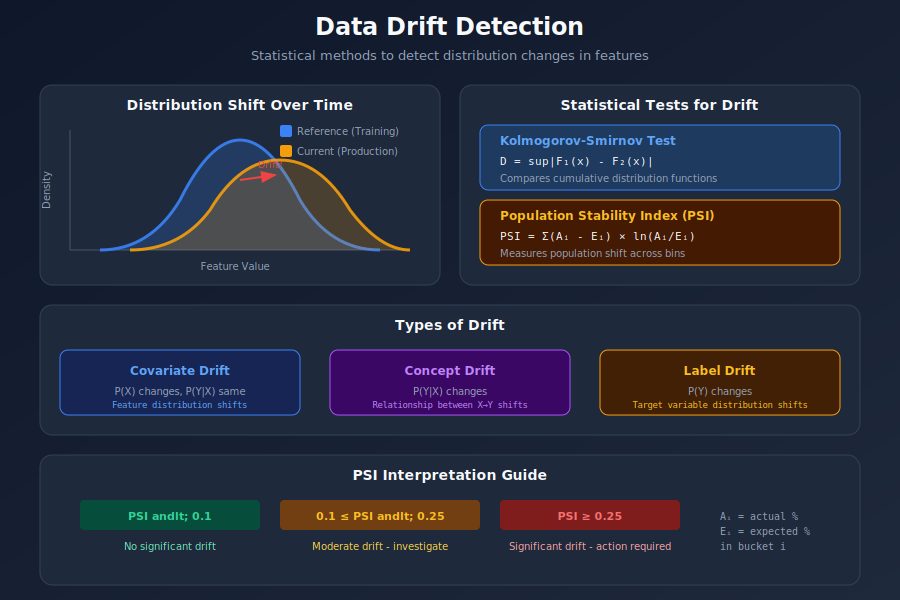

# 📊 Chapter 9: Monitoring & Observability

> *"You can't improve what you don't measure - monitoring is essential for production ML systems."*

<p align="center">
  
</p>

---

## 🎯 What You'll Learn

- Feature monitoring strategies
- Data drift detection
- Quality metrics
- Alerting and dashboards
- Debugging feature issues

---

## 📚 Table of Contents

1. [Monitoring Overview](#monitoring-overview)
2. [Key Metrics](#key-metrics)
3. [Data Drift Detection](#data-drift-detection)
4. [Feature Quality](#feature-quality)
5. [Alerting](#alerting)
6. [Dashboards](#dashboards)

---

## Monitoring Overview

### Why Monitor Features?



### Monitoring Architecture



---

## Key Metrics

<p align="center">
  
</p>

### Essential Metrics to Track

```python
from dataclasses import dataclass
from typing import Dict, List
from datetime import datetime, timedelta

@dataclass
class FeatureMetrics:
    """Core metrics for feature monitoring."""

    # Freshness metrics
    last_updated: datetime
    staleness_seconds: float
    update_frequency_actual: timedelta
    update_frequency_expected: timedelta

    # Quality metrics
    null_rate: float
    distinct_count: int
    min_value: float
    max_value: float
    mean_value: float
    std_value: float

    # Serving metrics
    request_count: int
    latency_p50: float
    latency_p99: float
    error_rate: float
    cache_hit_rate: float

    # Volume metrics
    row_count: int
    bytes_size: int

class MetricsCollector:
    """Collect feature metrics."""

    def collect_freshness_metrics(self, feature_view: str) -> Dict:
        """Collect freshness metrics for a feature view."""
        latest_timestamp = self._get_latest_timestamp(feature_view)
        expected_frequency = self._get_expected_frequency(feature_view)

        staleness = datetime.now() - latest_timestamp
        is_stale = staleness > expected_frequency

        return {
            "feature_view": feature_view,
            "last_updated": latest_timestamp,
            "staleness_seconds": staleness.total_seconds(),
            "is_stale": is_stale,
            "expected_frequency_seconds": expected_frequency.total_seconds()
        }

    def collect_quality_metrics(self, feature_view: str) -> Dict:
        """Collect quality metrics."""
        df = self._read_latest_features(feature_view)

        metrics = {}
        for column in df.columns:
            if column in ['entity_id', 'timestamp']:
                continue

            metrics[column] = {
                "null_rate": df[column].isnull().mean(),
                "distinct_count": df[column].nunique(),
                "min": df[column].min() if df[column].dtype in ['int64', 'float64'] else None,
                "max": df[column].max() if df[column].dtype in ['int64', 'float64'] else None,
                "mean": df[column].mean() if df[column].dtype in ['int64', 'float64'] else None,
                "std": df[column].std() if df[column].dtype in ['int64', 'float64'] else None,
            }

        return metrics

    def collect_serving_metrics(self, feature_service: str) -> Dict:
        """Collect serving metrics from Prometheus."""
        return {
            "request_count": self._query_prometheus(
                f'sum(feature_requests_total{{service="{feature_service}"}})'
            ),
            "latency_p50": self._query_prometheus(
                f'histogram_quantile(0.5, feature_latency_bucket{{service="{feature_service}"}})'
            ),
            "latency_p99": self._query_prometheus(
                f'histogram_quantile(0.99, feature_latency_bucket{{service="{feature_service}"}})'
            ),
            "error_rate": self._query_prometheus(
                f'sum(rate(feature_errors_total{{service="{feature_service}"}}[5m]))'
            )
        }
```

### Prometheus Metrics Definition

```python
from prometheus_client import Counter, Histogram, Gauge

# Request metrics
FEATURE_REQUESTS = Counter(
    'feature_requests_total',
    'Total feature requests',
    ['feature_service', 'status']
)

FEATURE_LATENCY = Histogram(
    'feature_latency_seconds',
    'Feature retrieval latency',
    ['feature_service'],
    buckets=[0.001, 0.005, 0.01, 0.025, 0.05, 0.1, 0.25, 0.5, 1.0]
)

# Quality metrics
FEATURE_NULL_RATE = Gauge(
    'feature_null_rate',
    'Percentage of null values',
    ['feature_view', 'feature_name']
)

FEATURE_STALENESS = Gauge(
    'feature_staleness_seconds',
    'Seconds since last feature update',
    ['feature_view']
)

# Usage in serving code
def get_features(feature_service: str, entities: list):
    with FEATURE_LATENCY.labels(feature_service=feature_service).time():
        try:
            features = store.get_online_features(...)
            FEATURE_REQUESTS.labels(feature_service=feature_service, status='success').inc()
            return features
        except Exception as e:
            FEATURE_REQUESTS.labels(feature_service=feature_service, status='error').inc()
            raise
```

---

## Data Drift Detection

### Mathematical Foundation

Data drift occurs when the statistical properties of input features change over time, potentially degrading model performance. Understanding the mathematical basis for drift detection is essential.

#### Drift Types

Let \( P_{ref}(X) \) be the reference (training) distribution and \( P_{cur}(X) \) be the current (production) distribution:

| Drift Type | Mathematical Definition | Description |
|------------|------------------------|-------------|
| **Covariate Drift** | \( P_{ref}(X) \neq P_{cur}(X) \), but \( P(Y\|X) \) unchanged | Feature distributions shift |
| **Concept Drift** | \( P_{ref}(Y\|X) \neq P_{cur}(Y\|X) \) | The relationship between X and Y changes |
| **Label Drift** | \( P_{ref}(Y) \neq P_{cur}(Y) \) | Target variable distribution shifts |

### Types of Drift



### Statistical Tests for Drift Detection

#### Kolmogorov-Smirnov (KS) Test

The KS test measures the maximum difference between two cumulative distribution functions:

```math
D = \sup_x |F_{ref}(x) - F_{cur}(x)|
```

Where:
- \( F_{ref}(x) \) = CDF of reference distribution
- \( F_{cur}(x) \) = CDF of current distribution
- $\sup$ = supremum (maximum) over all x

**Interpretation**: Reject null hypothesis (no drift) if p-value < α (typically 0.05)

#### Population Stability Index (PSI)

PSI quantifies the shift between two distributions by comparing bin populations:

```math
PSI = \sum_{i=1}^{n} (A_i - E_i) \times \ln\left(\frac{A_i}{E_i}\right)
```

Where:
- $A_i$ = Actual percentage in bin i (current data)
- $E_i$ = Expected percentage in bin i (reference data)
- $n$ = Number of bins

**PSI Interpretation**:

| PSI Value | Interpretation | Action |
|-----------|---------------|--------|
| PSI < 0.1 | No significant drift | Monitor |
| 0.1 ≤ PSI < 0.25 | Moderate drift | Investigate |
| PSI ≥ 0.25 | Significant drift | Retrain model |

#### Jensen-Shannon Divergence

An alternative symmetric measure based on KL divergence:

```math
JS(P \| Q) = \frac{1}{2} D_{KL}(P \| M) + \frac{1}{2} D_{KL}(Q \| M)
```

Where \( M = \frac{1}{2}(P + Q) \) and $D_{KL}$ is the Kullback-Leibler divergence.

### Drift Detection Implementation

```python
import numpy as np
from scipy import stats
from typing import Dict, Tuple

class DriftDetector:
    """Detect distribution drift in features."""

    def __init__(self, reference_data: dict):
        """Initialize with reference (training) distributions."""
        self.reference = reference_data

    def detect_drift(
        self,
        current_data: dict,
        method: str = "ks_test",
        threshold: float = 0.05
    ) -> Dict[str, dict]:
        """Detect drift for all features."""
        results = {}

        for feature_name in self.reference.keys():
            if feature_name not in current_data:
                results[feature_name] = {"error": "Feature missing"}
                continue

            ref_values = self.reference[feature_name]
            cur_values = current_data[feature_name]

            if method == "ks_test":
                drift_result = self._ks_test(ref_values, cur_values, threshold)
            elif method == "psi":
                drift_result = self._psi_test(ref_values, cur_values, threshold)
            else:
                raise ValueError(f"Unknown method: {method}")

            results[feature_name] = drift_result

        return results

    def _ks_test(
        self,
        reference: np.ndarray,
        current: np.ndarray,
        threshold: float
    ) -> dict:
        """Kolmogorov-Smirnov test for drift."""
        statistic, p_value = stats.ks_2samp(reference, current)

        return {
            "method": "ks_test",
            "statistic": statistic,
            "p_value": p_value,
            "is_drift": p_value < threshold,
            "threshold": threshold
        }

    def _psi_test(
        self,
        reference: np.ndarray,
        current: np.ndarray,
        threshold: float = 0.1
    ) -> dict:
        """Population Stability Index for drift."""

        # Bin the data
        bins = np.histogram_bin_edges(reference, bins=10)

        ref_counts, _ = np.histogram(reference, bins=bins)
        cur_counts, _ = np.histogram(current, bins=bins)

        # Convert to percentages
        ref_pct = ref_counts / len(reference)
        cur_pct = cur_counts / len(current)

        # Avoid division by zero
        ref_pct = np.clip(ref_pct, 0.0001, 1)
        cur_pct = np.clip(cur_pct, 0.0001, 1)

        # Calculate PSI
        psi = np.sum((cur_pct - ref_pct) * np.log(cur_pct / ref_pct))

        return {
            "method": "psi",
            "psi_value": psi,
            "is_drift": psi > threshold,
            "threshold": threshold,
            "interpretation": self._interpret_psi(psi)
        }

    def _interpret_psi(self, psi: float) -> str:
        """Interpret PSI value."""
        if psi < 0.1:
            return "No significant drift"
        elif psi < 0.25:
            return "Moderate drift - investigate"
        else:
            return "Significant drift - action required"

# Usage
detector = DriftDetector(reference_data=training_distributions)

# Run daily
current_distributions = compute_current_distributions()
drift_results = detector.detect_drift(current_distributions)

for feature, result in drift_results.items():
    if result.get("is_drift"):
        alert(f"Drift detected in {feature}: {result}")
```

---

## Feature Quality

### Quality Checks

```python
class FeatureQualityMonitor:
    """Monitor feature quality metrics."""

    def __init__(self, expectations: dict):
        self.expectations = expectations

    def check_quality(self, feature_view: str, data: dict) -> dict:
        """Run quality checks on feature data."""
        results = {
            "feature_view": feature_view,
            "timestamp": datetime.now(),
            "checks": []
        }

        for feature_name, values in data.items():
            if feature_name not in self.expectations:
                continue

            exp = self.expectations[feature_name]

            # Null check
            null_rate = sum(1 for v in values if v is None) / len(values)
            results["checks"].append({
                "feature": feature_name,
                "check": "null_rate",
                "value": null_rate,
                "threshold": exp.get("max_null_rate", 0.05),
                "passed": null_rate <= exp.get("max_null_rate", 0.05)
            })

            # Range check (for numeric)
            if exp.get("min") is not None or exp.get("max") is not None:
                valid_values = [v for v in values if v is not None]
                min_val = min(valid_values) if valid_values else None
                max_val = max(valid_values) if valid_values else None

                range_ok = True
                if exp.get("min") is not None and min_val is not None:
                    range_ok = range_ok and min_val >= exp["min"]
                if exp.get("max") is not None and max_val is not None:
                    range_ok = range_ok and max_val <= exp["max"]

                results["checks"].append({
                    "feature": feature_name,
                    "check": "value_range",
                    "min_observed": min_val,
                    "max_observed": max_val,
                    "expected_min": exp.get("min"),
                    "expected_max": exp.get("max"),
                    "passed": range_ok
                })

        results["all_passed"] = all(c["passed"] for c in results["checks"])
        return results

# Quality expectations
EXPECTATIONS = {
    "user_age": {
        "max_null_rate": 0.01,
        "min": 0,
        "max": 120
    },
    "transaction_amount": {
        "max_null_rate": 0.0,
        "min": 0,
        "max": 1000000
    },
    "user_lifetime_value": {
        "max_null_rate": 0.05,
        "min": 0
    }
}

monitor = FeatureQualityMonitor(EXPECTATIONS)
results = monitor.check_quality("user_features", current_data)
```

---

## Alerting

### Alert Rules

```yaml

# prometheus-rules.yaml
groups:
  - name: feature_store_alerts
    rules:

      # Staleness alert
      - alert: FeatureStale
        expr: feature_staleness_seconds > 7200  # 2 hours
        for: 5m
        labels:
          severity: warning
        annotations:
          summary: "Feature view {{ $labels.feature_view }} is stale"
          description: "Features haven't been updated for {{ $value | humanizeDuration }}"

      # High null rate
      - alert: HighNullRate
        expr: feature_null_rate > 0.1
        for: 10m
        labels:
          severity: warning
        annotations:
          summary: "High null rate in {{ $labels.feature_name }}"
          description: "Null rate is {{ $value | humanizePercentage }}"

      # High latency
      - alert: HighServingLatency
        expr: histogram_quantile(0.99, feature_latency_seconds_bucket) > 0.1
        for: 5m
        labels:
          severity: critical
        annotations:
          summary: "Feature serving latency is high"
          description: "P99 latency is {{ $value }}s"

      # Drift detected
      - alert: FeatureDrift
        expr: feature_drift_detected == 1
        for: 1h
        labels:
          severity: warning
        annotations:
          summary: "Drift detected in {{ $labels.feature_name }}"
```

### Alert Manager

```python
class AlertManager:
    """Manage feature store alerts."""

    def __init__(self, slack_webhook: str, pagerduty_key: str):
        self.slack_webhook = slack_webhook
        self.pagerduty_key = pagerduty_key

    def send_alert(self, alert: dict):
        """Route alert to appropriate channel."""
        severity = alert.get("severity", "info")

        if severity == "critical":
            self._send_pagerduty(alert)
            self._send_slack(alert)
        elif severity == "warning":
            self._send_slack(alert)
        else:
            self._log_alert(alert)

    def _send_slack(self, alert: dict):
        """Send alert to Slack."""
        import requests

        color = {
            "critical": "danger",
            "warning": "warning",
            "info": "good"
        }.get(alert["severity"], "good")

        payload = {
            "attachments": [{
                "color": color,
                "title": alert["summary"],
                "text": alert["description"],
                "fields": [
                    {"title": "Feature", "value": alert.get("feature", "N/A"), "short": True},
                    {"title": "Severity", "value": alert["severity"], "short": True}
                ]
            }]
        }

        requests.post(self.slack_webhook, json=payload)
```

---

## Dashboards

### Grafana Dashboard Configuration

```json
{
  "dashboard": {
    "title": "Feature Store Monitoring",
    "panels": [
      {
        "title": "Feature Freshness",
        "type": "stat",
        "targets": [{
          "expr": "feature_staleness_seconds",
          "legendFormat": "{{ feature_view }}"
        }],
        "fieldConfig": {
          "defaults": {
            "thresholds": {
              "steps": [
                {"color": "green", "value": null},
                {"color": "yellow", "value": 3600},
                {"color": "red", "value": 7200}
              ]
            },
            "unit": "s"
          }
        }
      },
      {
        "title": "Serving Latency P99",
        "type": "graph",
        "targets": [{
          "expr": "histogram_quantile(0.99, rate(feature_latency_seconds_bucket[5m]))",
          "legendFormat": "{{ feature_service }}"
        }],
        "yAxes": [{"format": "s"}]
      },
      {
        "title": "Request Rate",
        "type": "graph",
        "targets": [{
          "expr": "sum(rate(feature_requests_total[5m])) by (feature_service)",
          "legendFormat": "{{ feature_service }}"
        }]
      },
      {
        "title": "Null Rate by Feature",
        "type": "table",
        "targets": [{
          "expr": "feature_null_rate",
          "format": "table"
        }]
      }
    ]
  }
}
```

---

## Summary

### Monitoring Checklist

```
□ Freshness monitoring for all feature views
□ Quality metrics (null rates, distributions)
□ Drift detection (KS test, PSI)
□ Serving latency tracking
□ Alert rules configured
□ Dashboards created
□ On-call runbooks documented
```

### Key Takeaways

1. **Monitor freshness** - Know when features are stale
2. **Track quality** - Catch issues before they impact models
3. **Detect drift** - Distributions change over time
4. **Alert appropriately** - Right severity, right channel
5. **Visualize everything** - Dashboards for quick insights

---

[← Previous: Data Sources](../08_data_sources/README.md) | [Back to Main](../README.md) | [Next: Tools Comparison →](../10_tools_comparison/README.md)

---

<div align="center">

**[⬆ Back to Top](#)** | **[📚 Main Repository](https://github.com/Gaurav14cs17/ml_system_design)**

Made with 💜 by [Gaurav14cs17](https://github.com/Gaurav14cs17)

</div>
