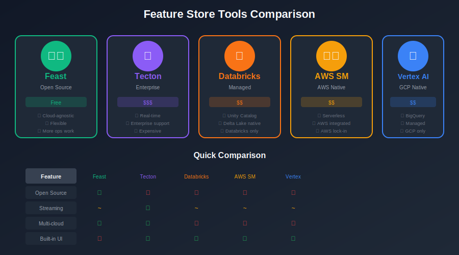
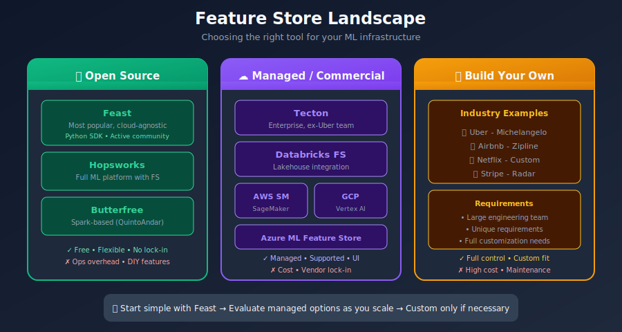
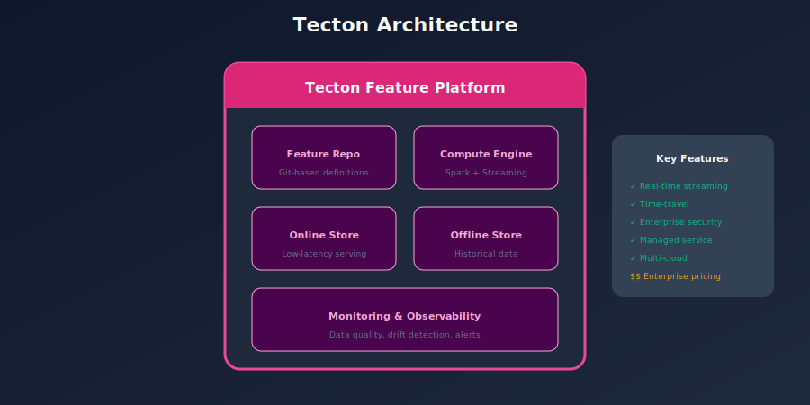
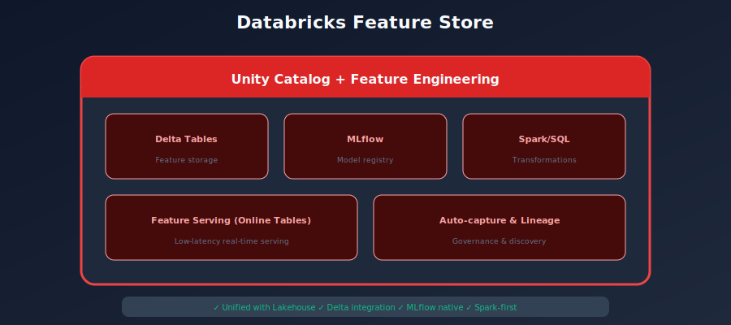
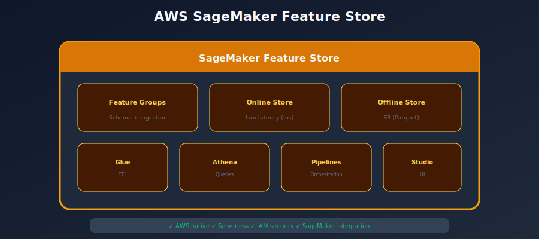
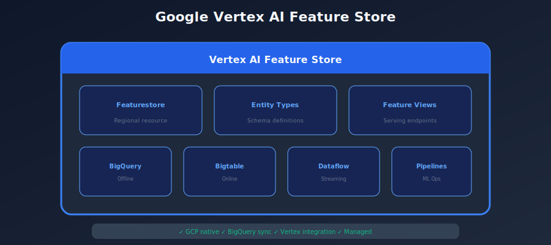
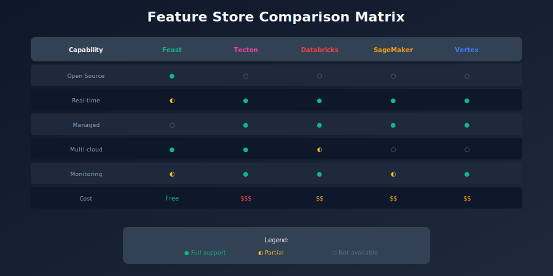
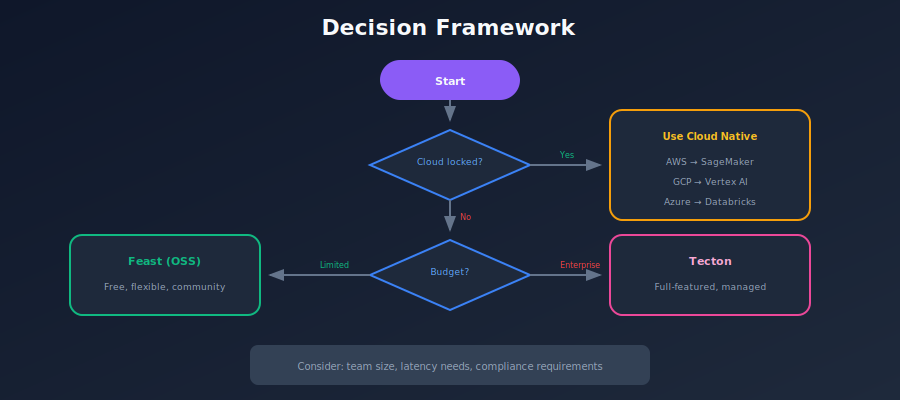

# 🔧 Chapter 10: Feature Store Tools Comparison

> *"Choosing the right feature store depends on your scale, team, and infrastructure."*

<p align="center">
  
</p>

---

## 🎯 What You'll Learn

- Overview of major feature store platforms

- Open source vs managed solutions

- Comparison across key dimensions

- Decision framework for selection

---

## 📚 Table of Contents

1. [Tool Landscape](#tool-landscape)

2. [Feast (Open Source)](#feast-open-source)

3. [Tecton](#tecton)

4. [Databricks Feature Store](#databricks-feature-store)

5. [AWS SageMaker Feature Store](#aws-sagemaker-feature-store)

6. [GCP Vertex AI Feature Store](#gcp-vertex-ai-feature-store)

7. [Comparison Matrix](#comparison-matrix)

8. [Decision Framework](#decision-framework)

---

## Tool Landscape

### Market Overview



---

## Feast (Open Source)

### Overview



### Feast Architecture

```python
# Feast project structure
"""
feature_repo/
+-- feature_store.yaml        # Configuration
+-- data_sources.py           # Data source definitions
+-- features.py               # Feature views
+-- feature_services.py       # Feature services
"""

# feature_store.yaml
"""
project: my_project
registry: s3://my-bucket/registry.db
provider: aws
online_store:
    type: redis
    connection_string: redis://localhost:6379
offline_store:
    type: file
"""

# Example feature definition
from feast import Entity, FeatureView, Field, FileSource
from feast.types import Float64, Int64
from datetime import timedelta

# Entity
user = Entity(name="user", join_keys=["user_id"])

# Source
source = FileSource(
    path="s3://data/user_features.parquet",
    timestamp_field="event_timestamp"
)

# Feature View
user_features = FeatureView(
    name="user_features",
    entities=[user],
    ttl=timedelta(days=1),
    schema=[
        Field(name="total_purchases", dtype=Int64),
        Field(name="avg_purchase_amount", dtype=Float64),
    ],
    source=source,
)

```

---

## Tecton

### Overview



### Tecton Example

```python
# Tecton feature definition
from tecton import Entity, BatchSource, StreamSource
from tecton import batch_feature_view, stream_feature_view
from datetime import timedelta

# Entity
user = Entity(name="user", join_keys=["user_id"])

# Batch Feature View
@batch_feature_view(
    sources=[transactions_batch_source],
    entities=[user],
    mode="spark_sql",
    online=True,
    offline=True,
    feature_start_time=datetime(2020, 1, 1),
    batch_schedule=timedelta(days=1),
)
def user_transaction_features(transactions):
    return f"""
        SELECT
            user_id,
            SUM(amount) as total_spend_30d,
            COUNT(*) as transaction_count_30d,
            AVG(amount) as avg_transaction_30d
        FROM {transactions}
        WHERE timestamp >= current_date - interval 30 day
        GROUP BY user_id
    """

# Stream Feature View (real-time)
@stream_feature_view(
    source=transactions_stream,
    entities=[user],
    mode="spark_sql",
    online=True,
    aggregation_interval=timedelta(minutes=5),
    aggregations=[
        Aggregation(column="amount", function="sum", time_windows=[timedelta(hours=1)]),
        Aggregation(column="amount", function="count", time_windows=[timedelta(hours=1)]),
    ],
)
def user_realtime_features(transactions):
    return transactions

```

---

## Databricks Feature Store

### Overview



### Databricks Example

```python
from databricks.feature_store import FeatureStoreClient
from pyspark.sql import functions as F

fs = FeatureStoreClient()

# Create feature table
def compute_user_features(transactions_df):
    return transactions_df.groupBy("user_id").agg(
        F.sum("amount").alias("total_spend"),
        F.count("*").alias("transaction_count"),
        F.avg("amount").alias("avg_amount")
    )

user_features = compute_user_features(transactions_df)

# Create or update feature table
fs.create_table(
    name="ml.features.user_transaction_features",
    primary_keys=["user_id"],
    df=user_features,
    description="User transaction aggregates"
)

# Read features for training
training_set = fs.create_training_set(
    df=labels_df,
    feature_lookups=[
        FeatureLookup(
            table_name="ml.features.user_transaction_features",
            feature_names=["total_spend", "transaction_count"],
            lookup_key="user_id"
        )
    ],
    label="label"
)

training_df = training_set.load_df()

```

---

## AWS SageMaker Feature Store

### Overview



### SageMaker Example

```python
import boto3
import sagemaker
from sagemaker.feature_store.feature_group import FeatureGroup

# Create feature group
feature_group = FeatureGroup(
    name="user-transaction-features",
    sagemaker_session=sagemaker.Session()
)

feature_definitions = [
    {"FeatureName": "user_id", "FeatureType": "String"},
    {"FeatureName": "total_spend", "FeatureType": "Fractional"},
    {"FeatureName": "transaction_count", "FeatureType": "Integral"},
    {"FeatureName": "event_time", "FeatureType": "Fractional"},
]

feature_group.create(
    s3_uri=f"s3://{bucket}/feature-store/",
    record_identifier_name="user_id",
    event_time_feature_name="event_time",
    role_arn=role,
    enable_online_store=True,
    feature_definitions=feature_definitions
)

# Ingest features
feature_group.ingest(data_frame=features_df, max_workers=3)

# Get online features
featurestore_runtime = boto3.client("sagemaker-featurestore-runtime")
response = featurestore_runtime.get_record(
    FeatureGroupName="user-transaction-features",
    RecordIdentifierValueAsString="user_123"
)

```

---

## GCP Vertex AI Feature Store

### Overview



### Vertex AI Example

```python
from google.cloud import aiplatform

aiplatform.init(project="my-project", location="us-central1")

# Create feature store
feature_store = aiplatform.Featurestore.create(
    featurestore_id="my_featurestore",
    online_store_fixed_node_count=1
)

# Create entity type
user_entity = feature_store.create_entity_type(
    entity_type_id="user",
    description="User entity"
)

# Create features
user_entity.batch_create_features(
    feature_configs={
        "total_spend": {"value_type": "DOUBLE"},
        "transaction_count": {"value_type": "INT64"},
    }
)

# Ingest features from BigQuery
user_entity.ingest_from_bq(
    feature_ids=["total_spend", "transaction_count"],
    feature_time="event_time",
    bq_source_uri="bq://project.dataset.user_features",
    entity_id_field="user_id"
)

# Online serving
user_entity.read(entity_ids=["user_123"])

```

---

## Comparison Matrix

### Feature Comparison

| Feature | Feast | Tecton | Databricks | SageMaker | Vertex AI |
|---------|-------|--------|------------|-----------|-----------|
| **Open Source** | ✅ | ❌ | ❌ | ❌ | ❌ |
| **Streaming Features** | ⚠️ | ✅ | ⚠️ | ⚠️ | ⚠️ |
| **Batch Features** | ✅ | ✅ | ✅ | ✅ | ✅ |
| **On-demand Features** | ✅ | ✅ | ❌ | ❌ | ❌ |
| **Point-in-time Joins** | ✅ | ✅ | ✅ | ✅ | ✅ |
| **Feature Registry** | ✅ | ✅ | ✅ | ✅ | ✅ |
| **Built-in UI** | ❌ | ✅ | ✅ | ✅ | ✅ |
| **Multi-cloud** | ✅ | ✅ | ❌ | ❌ | ❌ |

### Operational Comparison

| Aspect | Feast | Tecton | Databricks | SageMaker | Vertex AI |
|--------|-------|--------|------------|-----------|-----------|
| **Setup Complexity** | Medium | Low | Low | Low | Low |
| **Operational Burden** | High | Low | Low | Low | Low |
| **Cost** | Low | $$$ | $$ | $$ | $$ |
| **Vendor Lock-in** | None | Medium | High | High | High |
| **Support** | Community | Enterprise | Enterprise | Enterprise | Enterprise |

---

## Decision Framework

### Choosing the Right Tool



### Recommendation Summary

| Scenario | Recommendation |
|----------|----------------|
| **Startup, batch-only** | Feast |
| **AWS all-in** | SageMaker Feature Store |
| **GCP all-in** | Vertex AI Feature Store |
| **Databricks user** | Databricks Feature Store |
| **Enterprise, real-time** | Tecton |
| **Multi-cloud, flexible** | Feast |

---

## Summary

### Key Takeaways

1. **No one-size-fits-all** - Choose based on your context

2. **Start simple** - You can migrate later

3. **Consider total cost** - Including operational overhead

4. **Evaluate streaming needs** - Big differentiator

5. **Plan for growth** - Choose something that scales

---

[← Previous: Monitoring](../09_monitoring/README.md) | [Back to Main](../README.md) | [Next: Implementation →](../11_implementation/README.md)

---

<div align="center">

**[⬆ Back to Top](#)** | **[📚 Main Repository](https://github.com/Gaurav14cs17/ml_system_design)**

Made with 💜 by [Gaurav14cs17](https://github.com/Gaurav14cs17)

</div>
