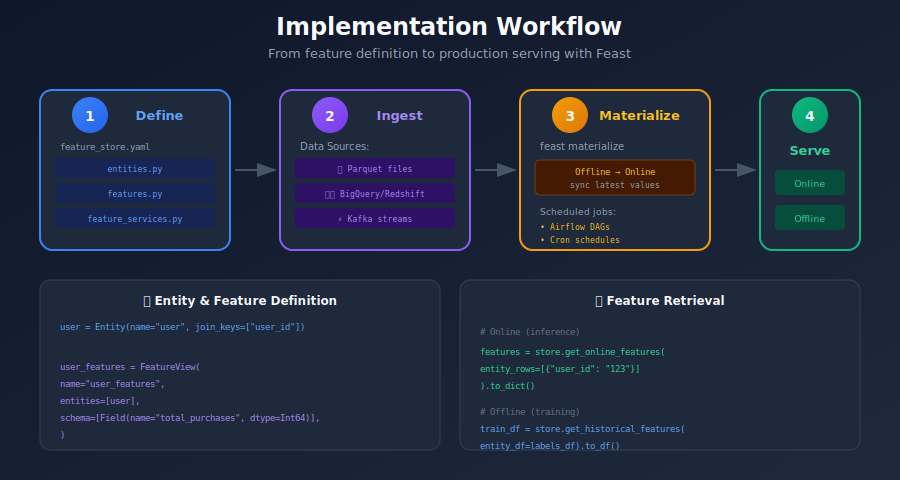
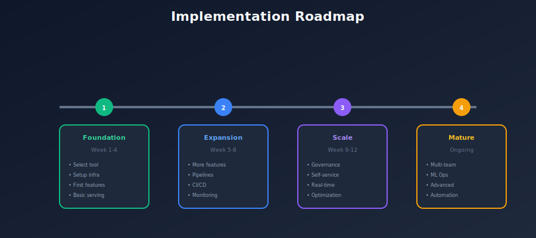

# 💻 Chapter 11: Implementation Examples

> *"Theory without practice is sterile - let's build a feature store from scratch."*

<p align="center">
  
</p>

---

## 🎯 What You'll Learn

- Complete Feast implementation

- Building features for fraud detection

- End-to-end ML pipeline with feature store

- Production deployment patterns

---

## 📚 Table of Contents

1. [Project Setup](#project-setup)

2. [Fraud Detection Use Case](#fraud-detection-use-case)

3. [Feature Definitions](#feature-definitions)

4. [Batch Feature Pipeline](#batch-feature-pipeline)

5. [Online Serving](#online-serving)

6. [Training Pipeline](#training-pipeline)

---

## Project Setup

### Project Structure



### Configuration

```yaml
# feature_repo/feature_store.yaml
project: fraud_detection
registry: data/registry.db
provider: local

online_store:
    type: redis
    connection_string: redis://localhost:6379

offline_store:
    type: file

entity_key_serialization_version: 2

```

### Requirements

```text
# requirements.txt
feast==0.36.0
pandas>=1.5.0
numpy>=1.23.0
scikit-learn>=1.2.0
redis>=4.5.0
pyarrow>=11.0.0
great-expectations>=0.15.0

```

### Initialize Project

```bash
# Create project directory
mkdir fraud_detection_project
cd fraud_detection_project

# Create virtual environment
python -m venv venv
source venv/bin/activate

# Install dependencies
pip install -r requirements.txt

# Initialize Feast project
cd feature_repo
feast init

```

---

## Fraud Detection Use Case

### Business Context



---

## Feature Definitions

### Entities

```python
# feature_repo/entities.py
from feast import Entity

# User entity
user = Entity(
    name="user",
    join_keys=["user_id"],
    description="A registered user"
)

# Merchant entity
merchant = Entity(
    name="merchant",
    join_keys=["merchant_id"],
    description="A merchant/business"
)

```

### Data Sources

```python
# feature_repo/data_sources.py
from feast import FileSource
from datetime import timedelta

# User features source (batch)
user_features_source = FileSource(
    name="user_features_source",
    path="data/user_features.parquet",
    timestamp_field="event_timestamp",
    created_timestamp_column="created_timestamp",
    description="Pre-computed user features"
)

# Transaction history source
transaction_source = FileSource(
    name="transaction_source",
    path="data/transactions.parquet",
    timestamp_field="transaction_timestamp",
    description="Historical transactions"
)

# Merchant features source
merchant_features_source = FileSource(
    name="merchant_features_source",
    path="data/merchant_features.parquet",
    timestamp_field="event_timestamp",
    description="Merchant aggregated features"
)

```

### Feature Views

```python
# feature_repo/feature_views.py
from feast import FeatureView, Field
from feast.types import Float64, Int64, String, Bool
from datetime import timedelta

from entities import user, merchant
from data_sources import user_features_source, merchant_features_source

# User features (batch computed)
user_features = FeatureView(
    name="user_features",
    entities=[user],
    ttl=timedelta(days=1),
    schema=[
        Field(name="account_age_days", dtype=Int64, description="Days since account creation"),
        Field(name="total_transactions", dtype=Int64, description="Lifetime transaction count"),
        Field(name="avg_transaction_amount", dtype=Float64, description="Average transaction amount"),
        Field(name="std_transaction_amount", dtype=Float64, description="Std dev of transaction amount"),
        Field(name="max_transaction_amount", dtype=Float64, description="Maximum transaction ever"),
        Field(name="fraud_count", dtype=Int64, description="Historical fraud count"),
        Field(name="verification_level", dtype=String, description="Account verification level"),
    ],
    source=user_features_source,
    tags={"team": "fraud", "domain": "user"},
)

# User transaction velocity features (more recent)
user_velocity_features = FeatureView(
    name="user_velocity_features",
    entities=[user],
    ttl=timedelta(hours=1),  # Shorter TTL for velocity
    schema=[
        Field(name="transactions_1h", dtype=Int64, description="Transactions in last hour"),
        Field(name="transactions_24h", dtype=Int64, description="Transactions in last 24 hours"),
        Field(name="amount_1h", dtype=Float64, description="Total amount in last hour"),
        Field(name="unique_merchants_24h", dtype=Int64, description="Unique merchants in 24h"),
    ],
    source=user_features_source,  # Would be streaming in production
    tags={"team": "fraud", "domain": "velocity"},
)

# Merchant features
merchant_features = FeatureView(
    name="merchant_features",
    entities=[merchant],
    ttl=timedelta(days=1),
    schema=[
        Field(name="merchant_category", dtype=String, description="Merchant category code"),
        Field(name="merchant_risk_score", dtype=Float64, description="Risk score 0-1"),
        Field(name="avg_transaction_amount", dtype=Float64, description="Average txn at merchant"),
        Field(name="fraud_rate", dtype=Float64, description="Historical fraud rate"),
    ],
    source=merchant_features_source,
    tags={"team": "fraud", "domain": "merchant"},
)

```

### On-Demand Features

```python
# feature_repo/on_demand_features.py
from feast import on_demand_feature_view, Field
from feast.types import Float64, Int64
import pandas as pd

# Request schema for on-demand features
from feast import RequestSource

request_source = RequestSource(
    name="transaction_request",
    schema=[
        Field(name="transaction_amount", dtype=Float64),
        Field(name="transaction_hour", dtype=Int64),
    ]
)

@on_demand_feature_view(
    sources=[user_features, request_source],
    schema=[
        Field(name="amount_vs_avg_ratio", dtype=Float64),
        Field(name="amount_vs_max_ratio", dtype=Float64),
        Field(name="is_night_transaction", dtype=Int64),
        Field(name="is_high_amount", dtype=Int64),
    ]
)
def transaction_context_features(inputs: pd.DataFrame) -> pd.DataFrame:
    """Compute transaction context features at request time."""
    df = pd.DataFrame()

    # Amount relative to user's average
    df["amount_vs_avg_ratio"] = (
        inputs["transaction_amount"] /
        (inputs["avg_transaction_amount"] + 0.01)  # Avoid div by zero
    )

    # Amount relative to user's max
    df["amount_vs_max_ratio"] = (
        inputs["transaction_amount"] /
        (inputs["max_transaction_amount"] + 0.01)
    )

    # Is night transaction (10 PM - 6 AM)
    df["is_night_transaction"] = (
        (inputs["transaction_hour"] >= 22) |
        (inputs["transaction_hour"] <= 6)
    ).astype(int)

    # Is high amount (>3x average)
    df["is_high_amount"] = (
        inputs["transaction_amount"] > 3 * inputs["avg_transaction_amount"]
    ).astype(int)

    return df

```

### Feature Services

```python
# feature_repo/feature_services.py
from feast import FeatureService

from feature_views import user_features, user_velocity_features, merchant_features
from on_demand_features import transaction_context_features

# Feature service for fraud model v1
fraud_detection_v1 = FeatureService(
    name="fraud_detection_v1",
    features=[
        user_features[[
            "account_age_days",
            "total_transactions",
            "avg_transaction_amount",
            "fraud_count",
        ]],
        merchant_features[[
            "merchant_risk_score",
            "fraud_rate",
        ]],
    ],
    tags={"model": "fraud_v1"},
)

# Feature service for fraud model v2 (with velocity and on-demand)
fraud_detection_v2 = FeatureService(
    name="fraud_detection_v2",
    features=[
        user_features,
        user_velocity_features,
        merchant_features,
        transaction_context_features,
    ],
    tags={"model": "fraud_v2"},
)

```

---

## Batch Feature Pipeline

### Feature Computation

```python
# pipelines/feature_pipeline.py
from pyspark.sql import SparkSession
from pyspark.sql import functions as F
from datetime import datetime, timedelta
import pandas as pd

class FeaturePipeline:
    """Compute batch features for fraud detection."""

    def __init__(self, spark: SparkSession = None):
        self.spark = spark or SparkSession.builder.appName("feature_pipeline").getOrCreate()

    def compute_user_features(self, transactions_path: str, as_of_date: datetime) -> pd.DataFrame:
        """Compute user-level features."""

        transactions = self.spark.read.parquet(transactions_path)

        # Filter to relevant time period
        transactions = transactions.filter(
            F.col("transaction_timestamp") <= as_of_date
        )

        # Compute aggregates
        user_features = transactions.groupBy("user_id").agg(
            # Lifetime aggregates
            F.count("*").alias("total_transactions"),
            F.avg("amount").alias("avg_transaction_amount"),
            F.stddev("amount").alias("std_transaction_amount"),
            F.max("amount").alias("max_transaction_amount"),
            F.sum(F.when(F.col("is_fraud") == 1, 1).otherwise(0)).alias("fraud_count"),
            F.min("transaction_timestamp").alias("first_transaction"),
        )

        # Add derived features
        user_features = user_features.withColumn(
            "account_age_days",
            F.datediff(F.lit(as_of_date), F.col("first_transaction"))
        ).withColumn(
            "event_timestamp",
            F.lit(as_of_date)
        ).withColumn(
            "created_timestamp",
            F.current_timestamp()
        )

        # Select final columns
        return user_features.select(
            "user_id",
            "account_age_days",
            "total_transactions",
            "avg_transaction_amount",
            "std_transaction_amount",
            "max_transaction_amount",
            "fraud_count",
            "event_timestamp",
            "created_timestamp"
        ).toPandas()

    def compute_velocity_features(self, transactions_path: str, as_of_date: datetime) -> pd.DataFrame:
        """Compute velocity features (short time windows)."""

        transactions = self.spark.read.parquet(transactions_path)

        # Last 24 hours
        cutoff_24h = as_of_date - timedelta(hours=24)
        cutoff_1h = as_of_date - timedelta(hours=1)

        transactions_recent = transactions.filter(
            F.col("transaction_timestamp") >= cutoff_24h
        )

        velocity_features = transactions_recent.groupBy("user_id").agg(
            # 1 hour window
            F.sum(F.when(
                F.col("transaction_timestamp") >= cutoff_1h, 1
            ).otherwise(0)).alias("transactions_1h"),
            F.sum(F.when(
                F.col("transaction_timestamp") >= cutoff_1h, F.col("amount")
            ).otherwise(0)).alias("amount_1h"),

            # 24 hour window
            F.count("*").alias("transactions_24h"),
            F.countDistinct("merchant_id").alias("unique_merchants_24h"),
        ).withColumn(
            "event_timestamp",
            F.lit(as_of_date)
        )

        return velocity_features.toPandas()

    def run(self, transactions_path: str, output_path: str):
        """Run full feature pipeline."""
        as_of_date = datetime.now()

        # Compute features
        print("Computing user features...")
        user_features = self.compute_user_features(transactions_path, as_of_date)

        print("Computing velocity features...")
        velocity_features = self.compute_velocity_features(transactions_path, as_of_date)

        # Save to parquet
        user_features.to_parquet(f"{output_path}/user_features.parquet")
        velocity_features.to_parquet(f"{output_path}/velocity_features.parquet")

        print(f"Features saved to {output_path}")

        return user_features, velocity_features

# Run pipeline
if __name__ == "__main__":
    pipeline = FeaturePipeline()
    pipeline.run(
        transactions_path="data/raw/transactions/",
        output_path="feature_repo/data/"
    )

```

### Apply and Materialize

```bash
# Apply feature definitions
cd feature_repo
feast apply

# Materialize features to online store
feast materialize-incremental $(date -u +"%Y-%m-%dT%H:%M:%S")

```

---

## Online Serving

### Feature Server

```python
# pipelines/inference_pipeline.py
from feast import FeatureStore
from datetime import datetime
import numpy as np

class FraudPredictionService:
    """Real-time fraud prediction service."""

    def __init__(self, feature_store_path: str, model_path: str):
        self.store = FeatureStore(repo_path=feature_store_path)
        self.model = self._load_model(model_path)

    def _load_model(self, path: str):
        """Load trained model."""
        import joblib
        return joblib.load(path)

    def predict(self, transaction: dict) -> dict:
        """
        Predict fraud probability for a transaction.

        Args:
            transaction: {
                "user_id": "user_123",
                "merchant_id": "merchant_456",
                "transaction_amount": 150.0,
                "transaction_hour": 14
            }

        Returns:
            {"fraud_probability": 0.03, "is_fraud": False}
        """

        # Get features from feature store
        entity_rows = [{
            "user_id": transaction["user_id"],
            "merchant_id": transaction["merchant_id"],
            "transaction_amount": transaction["transaction_amount"],
            "transaction_hour": transaction["transaction_hour"],
        }]

        features = self.store.get_online_features(
            features=self.store.get_feature_service("fraud_detection_v2"),
            entity_rows=entity_rows
        ).to_dict()

        # Prepare feature vector
        feature_vector = self._prepare_features(features)

        # Predict
        probability = self.model.predict_proba(feature_vector)[0][1]

        return {
            "fraud_probability": float(probability),
            "is_fraud": probability > 0.5,
            "features_used": features
        }

    def _prepare_features(self, features: dict) -> np.ndarray:
        """Convert feature dict to model input."""
        feature_names = [
            "account_age_days",
            "total_transactions",
            "avg_transaction_amount",
            "fraud_count",
            "transactions_1h",
            "amount_vs_avg_ratio",
            "merchant_risk_score",
        ]

        return np.array([[
            features[name][0] if features[name][0] is not None else 0
            for name in feature_names
        ]])

# FastAPI endpoint
from fastapi import FastAPI, HTTPException
from pydantic import BaseModel

app = FastAPI()
service = FraudPredictionService(
    feature_store_path="feature_repo/",
    model_path="models/fraud_model_v2.joblib"
)

class TransactionRequest(BaseModel):
    user_id: str
    merchant_id: str
    transaction_amount: float
    transaction_hour: int

@app.post("/predict")
async def predict_fraud(request: TransactionRequest):
    try:
        result = service.predict(request.dict())
        return result
    except Exception as e:
        raise HTTPException(status_code=500, detail=str(e))

```

---

## Training Pipeline

### Generate Training Data

```python
# pipelines/training_pipeline.py
from feast import FeatureStore
import pandas as pd
from sklearn.model_selection import train_test_split
from sklearn.ensemble import RandomForestClassifier
from sklearn.metrics import classification_report, roc_auc_score
import joblib

class TrainingPipeline:
    """Training pipeline using feature store."""

    def __init__(self, feature_store_path: str):
        self.store = FeatureStore(repo_path=feature_store_path)

    def generate_training_data(self, labels_path: str) -> pd.DataFrame:
        """Generate training data with point-in-time correct features."""

        # Load labels (historical fraud outcomes)
        labels_df = pd.read_parquet(labels_path)

        # Ensure we have required columns
        # user_id, merchant_id, event_timestamp, is_fraud

        # Get historical features
        training_df = self.store.get_historical_features(
            entity_df=labels_df,
            features=self.store.get_feature_service("fraud_detection_v2"),
        ).to_df()

        print(f"Generated {len(training_df)} training examples")
        print(f"Features: {list(training_df.columns)}")

        return training_df

    def train_model(self, training_df: pd.DataFrame, target_col: str = "is_fraud"):
        """Train fraud detection model."""

        # Prepare features
        feature_cols = [
            col for col in training_df.columns
            if col not in ["user_id", "merchant_id", "event_timestamp", target_col]
        ]

        X = training_df[feature_cols].fillna(0)
        y = training_df[target_col]

        # Split
        X_train, X_test, y_train, y_test = train_test_split(
            X, y, test_size=0.2, random_state=42, stratify=y
        )

        # Train
        model = RandomForestClassifier(
            n_estimators=100,
            max_depth=10,
            random_state=42,
            class_weight="balanced"
        )
        model.fit(X_train, y_train)

        # Evaluate
        y_pred = model.predict(X_test)
        y_prob = model.predict_proba(X_test)[:, 1]

        print("\nModel Performance:")
        print(classification_report(y_test, y_pred))
        print(f"ROC-AUC: {roc_auc_score(y_test, y_prob):.4f}")

        # Feature importance
        importance = pd.DataFrame({
            "feature": feature_cols,
            "importance": model.feature_importances_
        }).sort_values("importance", ascending=False)
        print("\nTop Features:")
        print(importance.head(10))

        return model, feature_cols

    def save_model(self, model, feature_cols: list, path: str):
        """Save model and metadata."""
        joblib.dump({
            "model": model,
            "feature_cols": feature_cols,
            "feature_service": "fraud_detection_v2",
        }, path)
        print(f"Model saved to {path}")

    def run(self, labels_path: str, model_output_path: str):
        """Run full training pipeline."""

        print("Step 1: Generate training data")
        training_df = self.generate_training_data(labels_path)

        print("\nStep 2: Train model")
        model, feature_cols = self.train_model(training_df)

        print("\nStep 3: Save model")
        self.save_model(model, feature_cols, model_output_path)

        return model

# Run training
if __name__ == "__main__":
    pipeline = TrainingPipeline(feature_store_path="feature_repo/")
    pipeline.run(
        labels_path="data/labels/fraud_labels.parquet",
        model_output_path="models/fraud_model_v2.joblib"
    )

```

---

## Summary

### Implementation Checklist

```
□ Project structure created
□ Feast initialized
□ Entities defined
□ Data sources configured
□ Feature views created
□ On-demand features added
□ Feature services defined
□ Batch pipeline implemented
□ Features materialized
□ Training pipeline working
□ Online serving functional
□ API endpoint created

```

### Key Files

| File | Purpose |
|------|---------|
| `feature_store.yaml` | Configuration |
| `entities.py` | Entity definitions |
| `feature_views.py` | Feature view definitions |
| `feature_services.py` | Model-facing APIs |
| `feature_pipeline.py` | Batch computation |
| `training_pipeline.py` | ML training |
| `inference_pipeline.py` | Online serving |

---

[← Previous: Tools Comparison](../10_tools_comparison/README.md) | [Back to Main](../README.md) | [Next: Best Practices →](../12_best_practices/README.md)

---

<div align="center">

**[⬆ Back to Top](#)** | **[📚 Main Repository](https://github.com/Gaurav14cs17/ml_system_design)**

Made with 💜 by [Gaurav14cs17](https://github.com/Gaurav14cs17)

</div>
