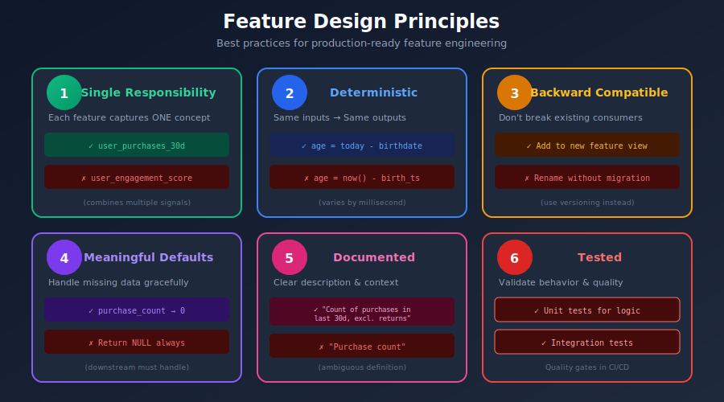
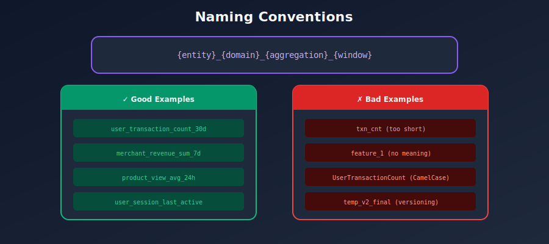
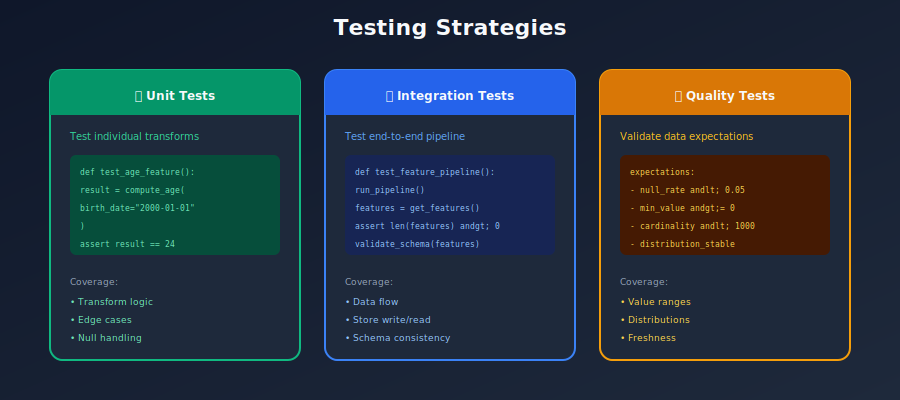
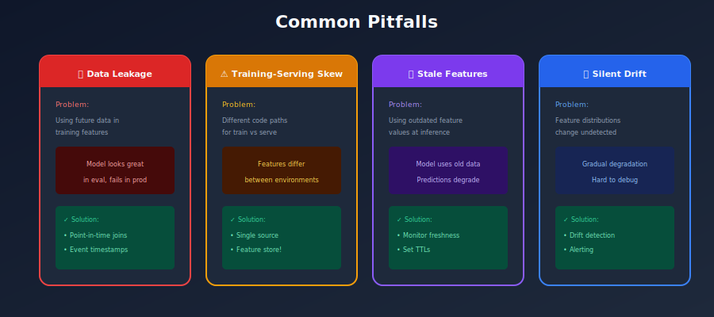
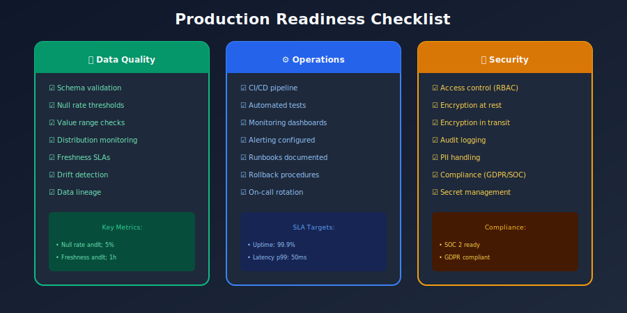

# ✅ Chapter 12: Best Practices & Production Guidelines

> *"The difference between a prototype and production is attention to detail in operations, security, and reliability."*

---

## 🎯 What You'll Learn

- Production-ready feature store patterns
- Security and compliance
- Performance optimization
- Operational excellence
- Common pitfalls to avoid

---

## 📚 Table of Contents

1. [Design Best Practices](#design-best-practices)
2. [Naming Conventions](#naming-conventions)
3. [Performance Optimization](#performance-optimization)
4. [Security & Compliance](#security-compliance)
5. [Operational Excellence](#operational-excellence)
6. [Testing Strategies](#testing-strategies)
7. [Common Pitfalls](#common-pitfalls)
8. [Checklist for Production](#checklist-for-production)

---

## Design Best Practices

### Feature Design Principles



### Entity Design

```python
# GOOD: Clear, single-purpose entities
user = Entity(
    name="user",
    join_keys=["user_id"],
    description="Registered user identified by UUID"
)

merchant = Entity(
    name="merchant",
    join_keys=["merchant_id"],
    description="Business entity identified by merchant_id"
)

# For relationship features, use composite entities
user_merchant = Entity(
    name="user_merchant",
    join_keys=["user_id", "merchant_id"],
    description="User-merchant interaction pair"
)

# BAD: Mixing different types of identifiers
bad_entity = Entity(
    name="entity",  # Too generic
    join_keys=["id"],  # Unclear what "id" refers to
)

```

### Feature View Organization



---

## Naming Conventions

### Feature Naming Standards

```python
# NAMING CONVENTION
# {entity}_{domain}_{aggregation}_{window}

# Examples:
GOOD_NAMES = [
    "user_transaction_count_30d",      # user, transaction, count, 30 days
    "user_purchase_amount_sum_7d",     # user, purchase, sum, 7 days
    "merchant_fraud_rate_lifetime",    # merchant, fraud, rate, all time
    "user_session_duration_avg_24h",   # user, session, average, 24 hours
    "user_merchant_affinity_score",    # composite entity, affinity, score
]

BAD_NAMES = [
    "f1",                   # Not descriptive
    "userPurchases",        # Inconsistent casing
    "user-total-amount",    # Hyphens instead of underscores
    "total_amount",         # Missing entity prefix
    "user_feature_v2",      # Version in name (use metadata instead)
]

# CASING: Use snake_case consistently
# LENGTH: Keep under 60 characters
# PREFIXES: Always include entity name

```

### Feature View and Service Naming

```python
# Feature Views: {entity}_{source}_{frequency}
feature_view_names = [
    "user_transactions_daily",
    "user_clicks_hourly",
    "merchant_reviews_weekly",
]

# Feature Services: {model_name}_v{version}
feature_service_names = [
    "fraud_detection_v1",
    "fraud_detection_v2",  # New version with more features
    "recommendations_v1",
    "churn_prediction_v1",
]

# Tags: Use consistently
STANDARD_TAGS = {
    "team": ["fraud", "growth", "pricing"],
    "domain": ["user", "merchant", "transaction"],
    "env": ["dev", "staging", "prod"],
    "pii": ["true", "false"],
    "freshness": ["realtime", "hourly", "daily", "weekly"],
}

```

---

## Performance Optimization

### Online Store Optimization

```python
# 1. BATCH REQUESTS
# Bad: Multiple single requests
for user_id in user_ids:
    features = store.get_online_features(entity_rows=[{"user_id": user_id}])

# Good: Single batch request
features = store.get_online_features(
    entity_rows=[{"user_id": uid} for uid in user_ids]
)

# 2. SELECT ONLY NEEDED FEATURES
# Bad: Get all features
features = store.get_online_features(features=["user_features:*"])

# Good: Get only what's needed
features = store.get_online_features(
    features=[
        "user_features:total_purchases",
        "user_features:avg_amount",
    ]
)

# 3. USE FEATURE SERVICES
# Pre-defined feature sets for each model
features = store.get_online_features(
    features=store.get_feature_service("fraud_model_v2"),
    entity_rows=entity_rows
)

# 4. CACHE APPROPRIATELY
# In-process cache for hot entities
from functools import lru_cache

@lru_cache(maxsize=10000)
def get_cached_features(user_id: str):
    return store.get_online_features(
        features=["user_features:static_features"],
        entity_rows=[{"user_id": user_id}]
    ).to_dict()

```

### Offline Store Optimization

```python
# 1. PARTITION EFFECTIVELY
# Partition by date for time-based queries
features.write.format("delta").partitionBy("date").save(path)

# 2. USE COLUMNAR FORMATS
# Parquet/Delta for analytics workloads
features.write.format("parquet").mode("append").save(path)

# 3. OPTIMIZE FILE SIZES
# Target 128MB-1GB files
spark.conf.set("spark.sql.files.maxPartitionBytes", 128 * 1024 * 1024)

# 4. USE PREDICATE PUSHDOWN
# Filter before loading
features = spark.read.parquet(path).filter(
    (F.col("date") >= start_date) &
    (F.col("date") <= end_date)
)

```

---

## Security & Compliance

### Access Control

```python
# Role-based access control
ACCESS_POLICIES = {
    "feature_views": {
        "user_pii_features": {
            "read": ["data-scientists", "ml-engineers", "compliance"],
            "write": ["data-platform"],
            "admin": ["data-platform-leads"]
        },
        "user_public_features": {
            "read": ["*"],  # All authenticated users
            "write": ["data-platform", "ml-engineers"],
        }
    },
    "feature_services": {
        "fraud_model_v2": {
            "read": ["fraud-team", "ml-platform"],
        }
    }
}

# Implement access checks
def check_access(user: str, resource: str, action: str) -> bool:
    policy = ACCESS_POLICIES.get(resource, {})
    allowed_roles = policy.get(action, [])
    user_roles = get_user_roles(user)
    return any(role in allowed_roles for role in user_roles)

```

### PII Handling



### Audit Logging

```python
import logging
from datetime import datetime

class FeatureAuditLogger:
    """Log all feature access for compliance."""

    def __init__(self):
        self.logger = logging.getLogger("feature_audit")

    def log_access(
        self,
        user: str,
        feature_service: str,
        entity_ids: list,
        action: str = "read"
    ):
        self.logger.info({
            "timestamp": datetime.utcnow().isoformat(),
            "user": user,
            "action": action,
            "feature_service": feature_service,
            "entity_count": len(entity_ids),
            "entity_sample": entity_ids[:5] if len(entity_ids) > 5 else entity_ids,
        })

    def log_write(
        self,
        user: str,
        feature_view: str,
        row_count: int
    ):
        self.logger.info({
            "timestamp": datetime.utcnow().isoformat(),
            "user": user,
            "action": "write",
            "feature_view": feature_view,
            "row_count": row_count,
        })

```

---

## Operational Excellence

### Monitoring Checklist



### Runbooks

```markdown
# RUNBOOK: Stale Features Alert

## Symptoms
- Alert: "Feature view X is stale"
- Features not updated for >2x expected interval

## Diagnosis Steps
1. Check pipeline status
   ```
   airflow dags list-runs -d feature_pipeline
   ```
2. Check data source availability
3. Check compute resources (Spark cluster, etc.)

## Resolution Steps
1. If pipeline failed:
   - Check logs for root cause
   - Fix and re-run: `airflow dags trigger feature_pipeline`
2. If data source unavailable:
   - Contact data team
   - Consider fallback to cached values
3. If resource issue:
   - Scale up compute
   - Optimize job

## Escalation
- P1: Page on-call after 15 min
- P2: Slack #feature-store-alerts

```

### Disaster Recovery

```python
# Feature store backup strategy
BACKUP_STRATEGY = {
    "registry": {
        "backup_frequency": "hourly",
        "retention": "30 days",
        "method": "pg_dump to S3"
    },
    "offline_store": {
        "backup_frequency": "none",  # Delta Lake has time travel
        "retention": "90 days via Delta",
        "method": "Delta Lake VACUUM with retention"
    },
    "online_store": {
        "backup_frequency": "continuous",
        "retention": "7 days",
        "method": "Redis replication + RDB snapshots"
    }
}

# Recovery procedures
def recover_from_backup(component: str, point_in_time: datetime):
    if component == "registry":
        restore_postgres_from_s3(point_in_time)
    elif component == "offline_store":
        restore_delta_time_travel(point_in_time)
    elif component == "online_store":
        restore_redis_from_snapshot(point_in_time)
        rematerialize_from_offline()

```

---

## Testing Strategies

### Unit Tests

```python
# tests/test_features.py
import pytest
import pandas as pd
from feature_repo.feature_views import user_features
from feature_repo.on_demand_features import transaction_context_features

class TestFeatureDefinitions:
    """Test feature definitions."""

    def test_user_features_schema(self):
        """Verify feature schema."""
        feature_names = [f.name for f in user_features.features]

        assert "account_age_days" in feature_names
        assert "total_transactions" in feature_names
        assert "avg_transaction_amount" in feature_names

    def test_user_features_entity(self):
        """Verify entity configuration."""
        entity_names = [e.name for e in user_features.entities]
        assert "user" in entity_names

    def test_ttl_configured(self):
        """Verify TTL is set."""
        assert user_features.ttl is not None
        assert user_features.ttl.total_seconds() > 0

class TestOnDemandFeatures:
    """Test on-demand feature transformations."""

    def test_amount_vs_avg_ratio(self):
        """Test ratio calculation."""
        inputs = pd.DataFrame({
            "transaction_amount": [100.0],
            "avg_transaction_amount": [50.0],
            "max_transaction_amount": [200.0],
            "transaction_hour": [14],
        })

        result = transaction_context_features.transform(inputs)

        assert result["amount_vs_avg_ratio"].iloc[0] == 2.0

    def test_handles_zero_avg(self):
        """Test division by zero handling."""
        inputs = pd.DataFrame({
            "transaction_amount": [100.0],
            "avg_transaction_amount": [0.0],
            "max_transaction_amount": [0.0],
            "transaction_hour": [14],
        })

        result = transaction_context_features.transform(inputs)

        # Should not raise, should handle gracefully
        assert result["amount_vs_avg_ratio"].iloc[0] > 0

```

### Integration Tests

```python
# tests/test_integration.py
import pytest
from feast import FeatureStore
import pandas as pd

@pytest.fixture
def feature_store():
    return FeatureStore(repo_path="feature_repo/")

class TestFeatureRetrieval:
    """Integration tests for feature retrieval."""

    def test_online_features(self, feature_store):
        """Test online feature retrieval."""
        features = feature_store.get_online_features(
            features=[
                "user_features:account_age_days",
                "user_features:total_transactions",
            ],
            entity_rows=[{"user_id": "test_user_1"}]
        ).to_dict()

        assert "account_age_days" in features
        assert len(features["account_age_days"]) == 1

    def test_historical_features(self, feature_store):
        """Test historical feature retrieval."""
        entity_df = pd.DataFrame({
            "user_id": ["test_user_1", "test_user_2"],
            "event_timestamp": pd.to_datetime(["2024-01-15", "2024-01-20"])
        })

        training_df = feature_store.get_historical_features(
            entity_df=entity_df,
            features=["user_features:account_age_days"]
        ).to_df()

        assert len(training_df) == 2
        assert "account_age_days" in training_df.columns

```

---

## Common Pitfalls

### Pitfalls to Avoid



---

## Checklist for Production

### Pre-Production Checklist

```
FEATURE STORE PRODUCTION READINESS CHECKLIST
=============================================

DESIGN
□ All features have clear documentation
□ Naming conventions followed
□ Entities properly defined
□ TTLs set appropriately
□ Feature services defined for each model

DATA QUALITY
□ Data validation rules defined
□ Null handling strategy documented
□ Schema validation in place
□ Historical data backfilled

MONITORING
□ Freshness monitoring configured
□ Quality metrics tracked
□ Drift detection enabled
□ Alerting rules defined
□ Dashboards created

SECURITY
□ Access control implemented
□ PII features identified and protected
□ Audit logging enabled
□ Encryption at rest and in transit

OPERATIONS
□ Runbooks documented
□ On-call rotation defined
□ Backup strategy implemented
□ Disaster recovery tested
□ Capacity planning done

TESTING
□ Unit tests for feature logic
□ Integration tests for retrieval
□ Performance tests for latency
□ End-to-end tests with models

DEPLOYMENT
□ CI/CD pipeline configured
□ Staging environment tested
□ Rollback procedure documented
□ Feature flags for new features

```

---

## Summary

### Key Best Practices

| Area | Best Practice |
|------|---------------|
| **Design** | Single responsibility, deterministic, documented |
| **Naming** | Consistent, descriptive, include entity prefix |
| **Performance** | Batch requests, select only needed features |
| **Security** | Role-based access, PII handling, audit logs |
| **Operations** | Monitor freshness, quality, and performance |
| **Testing** | Unit, integration, and performance tests |

### Golden Rules

1. **Feature store for both training and serving** - Consistency is key
2. **Always use point-in-time joins** - Prevent data leakage
3. **Monitor everything** - Can't fix what you can't see
4. **Document thoroughly** - Future you will thank you
5. **Start simple, iterate** - Don't over-engineer upfront

---

## 📚 Further Resources

- [Feast Documentation](https://docs.feast.dev/)
- [Feature Stores for ML Book](https://www.oreilly.com/library/view/feature-stores-for/9781098143732/)
- [MLOps Community](https://mlops.community/)
- [Made With ML](https://madewithml.com/)

---

[← Previous: Implementation](../11_implementation/README.md) | [Back to Main](../README.md)

---

*Congratulations! You've completed the Feature Store guide. Now go build something amazing! 🚀*

---

<div align="center">

**[⬆ Back to Top](#)** | **[📚 Main Repository](https://github.com/Gaurav14cs17/ml_system_design)**

Made with 💜 by [Gaurav14cs17](https://github.com/Gaurav14cs17)

</div>
