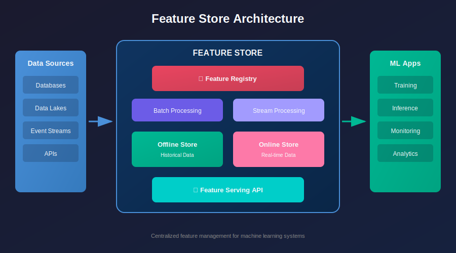
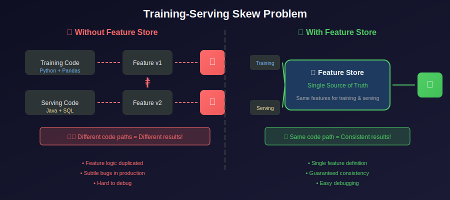
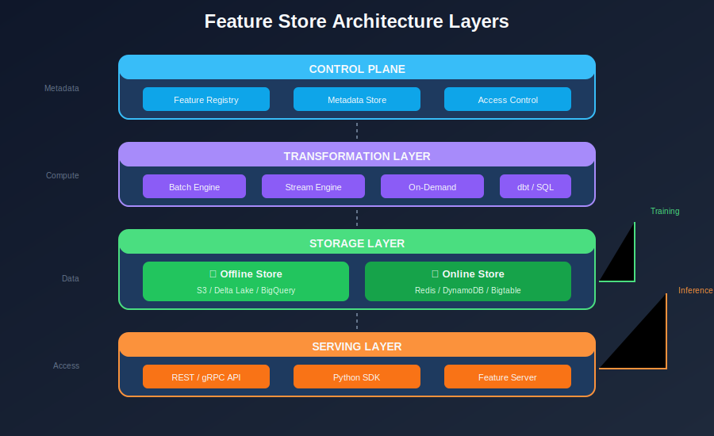
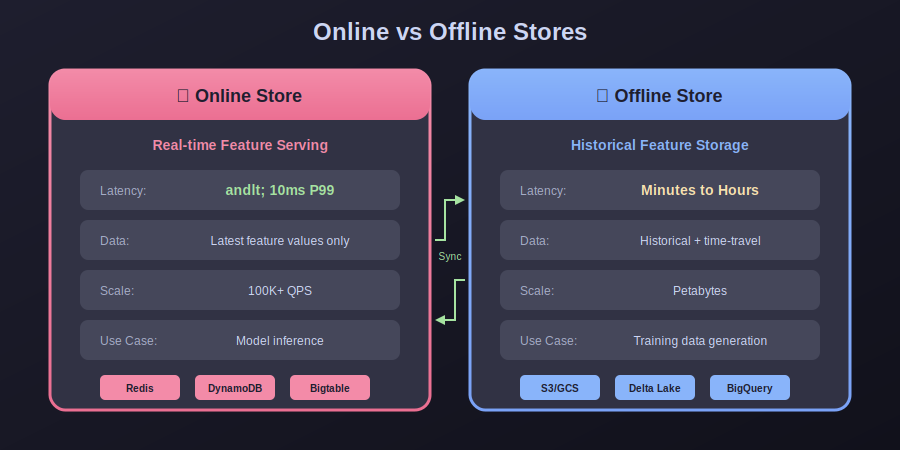
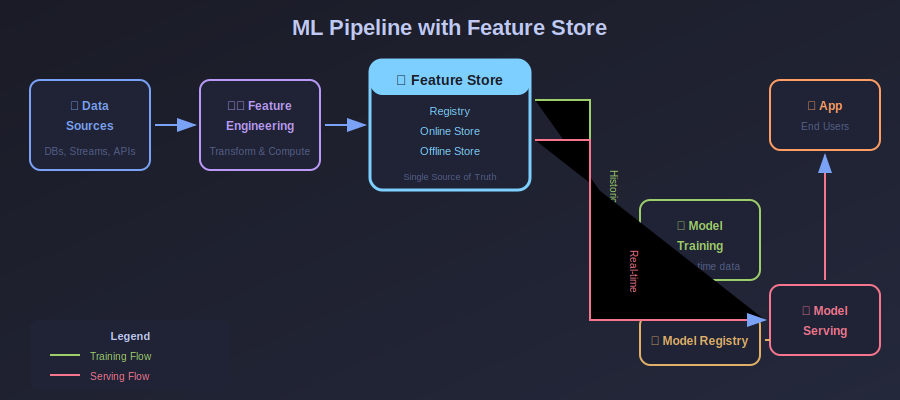
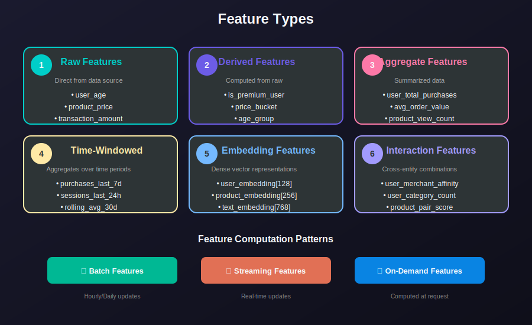

# 🏪 Feature Store - Complete System Design Guide

> A comprehensive, production-ready guide to designing, building, and operating Feature Stores for Machine Learning systems.

  

---

## 📚 Table of Contents

| Chapter | Topic | Description |
|---------|-------|-------------|
| 01 | [Introduction](./01_introduction/) | What is a Feature Store? Why do we need it? |
| 02 | [Core Concepts](./02_core_concepts/) | Features, Entities, Feature Groups, Feature Views |
| 03 | [Architecture](./03_architecture/) | System design, components, and data flow |
| 04 | [Feature Engineering](./04_feature_engineering/) | Transformation patterns and pipelines |
| 05 | [Online Serving](./05_online_serving/) | Real-time feature retrieval at low latency |
| 06 | [Offline Serving](./06_offline_serving/) | Batch feature retrieval for training |
| 07 | [Feature Registry](./07_feature_registry/) | Catalog, discovery, and governance |
| 08 | [Data Sources](./08_data_sources/) | Ingestion patterns and connectors |
| 09 | [Monitoring](./09_monitoring/) | Observability, drift detection, quality |
| 10 | [Tools Comparison](./10_tools_comparison/) | Feast, Tecton, Databricks, AWS, GCP, etc. |
| 11 | [Implementation](./11_implementation/) | Hands-on code examples and projects |
| 12 | [Best Practices](./12_best_practices/) | Production guidelines and patterns |

---

## 🎯 What is a Feature Store?

A **Feature Store** is a centralized repository for storing, managing, and serving machine learning features. It acts as the **data layer** between raw data sources and ML models.

---

## 🚀 Why Feature Stores Matter

### The Training-Serving Skew Problem

  

Without a feature store, teams often create different code paths for training and serving, leading to subtle bugs and inconsistent results.

---

## 🏗️ Key Components

  

### 1. Feature Registry (Catalog)

- Metadata storage

- Feature discovery

- Version control

- Lineage tracking

### 2. Offline Store

- Historical feature values

- Training data generation

- Point-in-time correctness

- Typically: Data Lake, Data Warehouse

### 3. Online Store

- Latest feature values

- Low-latency serving (<10ms)

- High throughput

- Typically: Redis, DynamoDB, Cassandra

### 4. Feature Engineering Pipeline

- Transformation logic

- Batch and streaming processing

- Materialization jobs

### 5. Feature Serving API

- Consistent retrieval interface

- Batch and real-time modes

- SDK integrations

---

## 📊 Online vs Offline Stores

  

---

## 🔄 Feature Store in ML Pipeline

  

---

## 🎓 Learning Path

### Beginner

1. Start with [Introduction](./01_introduction/) to understand the fundamentals

2. Learn [Core Concepts](./02_core_concepts/) - features, entities, feature groups

3. Explore [Architecture](./03_architecture/) for system understanding

### Intermediate

4. Deep dive into [Feature Engineering](./04_feature_engineering/)

5. Understand [Online Serving](./05_online_serving/) patterns

6. Master [Offline Serving](./06_offline_serving/) for training

### Advanced

7. Implement [Feature Registry](./07_feature_registry/) for governance

8. Design [Data Sources](./08_data_sources/) integration

9. Build [Monitoring](./09_monitoring/) systems

### Expert

10. Compare [Tools](./10_tools_comparison/) for your use case

11. Build with [Implementation](./11_implementation/) examples

12. Apply [Best Practices](./12_best_practices/) for production

---

---

## 🔍 Feature Types

  

---

## 🛠️ Tech Stack Covered

| Category | Technologies |
|----------|-------------|
| **Feature Stores** | Feast, Tecton, Databricks Feature Store, AWS SageMaker FS, GCP Vertex AI FS, Hopsworks |
| **Online Stores** | Redis, DynamoDB, Cassandra, Bigtable, ScyllaDB |
| **Offline Stores** | S3, Delta Lake, Apache Iceberg, BigQuery, Snowflake, Redshift |
| **Processing** | Apache Spark, Apache Flink, Apache Kafka, dbt |
| **Orchestration** | Airflow, Dagster, Prefect, Kubeflow |
| **Languages** | Python, SQL, Scala |

---

## 📈 When to Use a Feature Store

### ✅ Good Fit

- Multiple ML models sharing features

- Need for real-time inference

- Large data science teams

- Feature reuse is important

- Training-serving consistency required

- Complex feature engineering pipelines

### ❌ May Be Overkill

- Single model, single team

- Batch-only predictions

- Simple features (raw columns)

- Early-stage ML projects

- Limited engineering resources

---

---

## 🔧 Tools Comparison

  

---

## 🔗 Quick Links

- **[Start Learning →](./01_introduction/)**

- **[Jump to Implementation →](./11_implementation/)**

- **[Compare Tools →](./10_tools_comparison/)**

---

## 📖 References

- [Feast Documentation](https://docs.feast.dev/)

- [Tecton Platform](https://www.tecton.ai/)

- [Feature Store for ML (O'Reilly)](https://www.oreilly.com/library/view/feature-stores-for/9781098143732/)

- [MLOps Community](https://mlops.community/)

---

*Last Updated: January 2026*

---

**[⬆ Back to Top](#)** | **[📚 Main Repository](https://github.com/Gaurav14cs17/ml_system_design)**

Made with 💜 by [Gaurav14cs17](https://github.com/Gaurav14cs17)

