# 📖 Introduction to Model Serving

<p align="center">
  
</p>

<p align="center">
  
</p>

## Table of Contents
- [What is Model Serving?](#what-is-model-serving)
- [Why Model Serving Matters](#why-model-serving-matters)
- [The ML Deployment Gap](#the-ml-deployment-gap)
- [Core Concepts](#core-concepts)
- [Serving Paradigms](#serving-paradigms)
- [Architecture Components](#architecture-components)
- [Challenges in Production](#challenges-in-production)
- [Success Metrics](#success-metrics)
- [Industry Use Cases](#industry-use-cases)
- [Getting Started](#getting-started)

---

## What is Model Serving?

**Model Serving** is the process of deploying trained machine learning models into production environments where they can receive input data, perform inference (predictions), and return results to applications or end-users in a reliable, scalable, and efficient manner.

Think of it as the "last mile" of machine learning — where months of data collection, feature engineering, and model training finally meet the real world.

```mermaid
graph TB
    subgraph Serving["⚡ MODEL SERVING"]
        Input[📥 Input Data] --> Pre[🔄 Preprocessing]
        Pre --> Model[🧠 Model Inference]
        Model --> Post[🔄 Postprocessing]
        Post --> Output[📤 Predictions]
    end

    style Serving fill:#e8f5e9

```




### The Serving Layer Responsibilities

| Responsibility | Description |
|---------------|-------------|
| **Request Handling** | Accept incoming prediction requests via HTTP/gRPC |
| **Preprocessing** | Transform raw input into model-compatible format |
| **Inference** | Execute the model to generate predictions |
| **Postprocessing** | Format predictions for downstream consumption |
| **Response Delivery** | Return results with appropriate status codes |

---

## Why Model Serving Matters

### The Business Value


### Key Statistics

- **87%** of ML models never make it to production (Gartner)
- Models that do deploy often take **3-6 months** from training to production
- Poor serving infrastructure causes **40%** of ML project failures
- Well-designed serving systems can reduce inference costs by **10x**

### Impact Areas

1. **User Experience**: Fast, reliable predictions improve product quality
2. **Business Metrics**: Enable real-time personalization, fraud detection, recommendations
3. **Operational Efficiency**: Automate decisions at scale
4. **Competitive Advantage**: Faster time-to-market for ML features

---

## The ML Deployment Gap

### Why Serving is Hard


### Common Failure Modes

| Failure Mode | Cause | Impact |
|-------------|-------|--------|
| **Slow Inference** | Unoptimized model, no batching | Poor UX, timeouts |
| **Memory Leaks** | Large models, improper cleanup | Server crashes |
| **Model Staleness** | No retraining pipeline | Degraded accuracy |
| **Data Skew** | Training/serving data mismatch | Wrong predictions |
| **Cascading Failures** | No circuit breakers | System-wide outage |

---

## Core Concepts

### 1. Inference vs Training

```python
# Training Mode (Development)
# - Backward pass (gradients)
# - Batch processing
# - Hours/days to complete
# - Focus on accuracy

model.train()
for epoch in range(100):
    for batch in dataloader:
        loss = model(batch)
        loss.backward()
        optimizer.step()

# Inference Mode (Production)
# - Forward pass only
# - Single/small batch
# - Milliseconds per request
# - Focus on latency + throughput

model.eval()
with torch.no_grad():
    prediction = model(input_tensor)

```

### 2. Latency Breakdown


### 3. Throughput and Latency Mathematics

#### Throughput Calculation

**Throughput** \( T \) (requests per second) for a system with \( W \) workers and latency \( L \):

\[
T = \frac{W}{L} = W \times \frac{1000\text{ms}}{L_{\text{ms}}}
\]

**Example:**
- \( W = 4 \) workers
- \( L = 50 \) ms per inference
- \( T = 4 \times \frac{1000}{50} = 80 \) RPS per server

For \( N \) servers: \( T_{\text{total}} = N \times T = 10 \times 80 = 800 \) RPS

#### Latency Percentiles

Latency is typically measured at percentiles:
- **P50** (median): 50% of requests faster
- **P95**: 95% of requests faster  
- **P99**: 99% of requests faster (SLO target)

For a log-normal latency distribution:

\[
P(L \leq x) = \Phi\left(\frac{\ln x - \mu}{\sigma}\right)
\]

#### Goodput vs Throughput

**Goodput** \( G \) accounts for failed requests:

\[
G = T \times (1 - \epsilon)
\]

where \( \epsilon \) is the error rate.

#### Service Level Objectives (SLOs)

A typical SLO might be: "P99 latency < 100ms for 99.9% of time windows"

Mathematically:
\[
P(L_{P99} < 100\text{ms}) \geq 0.999
\]

### 4. Model Serialization

```python
# Different serialization formats
import torch
import tensorflow as tf
import pickle
import onnx

# PyTorch - TorchScript
scripted_model = torch.jit.script(model)
scripted_model.save("model.pt")

# TensorFlow - SavedModel
tf.saved_model.save(model, "saved_model/")

# ONNX - Cross-framework
torch.onnx.export(model, dummy_input, "model.onnx")

# Pickle - Simple but risky (security issues)
pickle.dump(model, open("model.pkl", "wb"))

```

---

## Serving Paradigms

### Paradigm Overview


### 1. Online Serving (Real-time)


**Use Cases:**
- ✅ Fraud detection at transaction time
- ✅ Real-time recommendations
- ✅ Chatbots and conversational AI
- ✅ Image/video analysis

**Characteristics:**
- Low latency (P99 < 100ms)
- Single or small batch inference
- Synchronous request-response
- High availability requirements

### 2. Batch Serving (Offline)

```mermaid
flowchart LR
    A[(📊 Data Lake)] --> B[🔄 ETL]
    B --> C[📦 Batch Job]
    C --> D[🧠 Model]
    D --> E[(💾 Results Store)]

    F[⏰ Scheduled: Daily/Weekly]

    style A fill:#e3f2fd
    style E fill:#c8e6c9

```



**Use Cases:**
- ✅ Nightly recommendation generation
- ✅ Bulk scoring of customer segments
- ✅ Pre-computing embeddings
- ✅ Report generation

**Characteristics:**
- High throughput priority
- Large batch sizes (1000s of samples)
- Scheduled execution (cron jobs)
- Cost-efficient (spot instances)

### 3. Streaming Serving (Near Real-time)


**Use Cases:**
- ✅ IoT sensor anomaly detection
- ✅ Real-time content moderation
- ✅ Clickstream analysis
- ✅ Network intrusion detection

**Characteristics:**
- Continuous processing
- Event-driven architecture
- Windowed aggregations
- Exactly-once semantics

### Paradigm Comparison

| Aspect | Online | Batch | Streaming |
|--------|--------|-------|-----------|
| **Latency** | < 100ms | Hours | Seconds-Minutes |
| **Throughput** | 100s-1000s RPS | Millions/job | 10000s events/sec |
| **Data** | Single request | Historical | Continuous |
| **Scaling** | Horizontal | Vertical/Distributed | Partitioned |
| **Cost Model** | Always-on | On-demand | Always-on |

---

## Architecture Components

### High-Level Architecture

```mermaid
flowchart TB
    subgraph Clients["👥 CLIENTS"]
        Web[🌐 Web]
        Mobile[📱 Mobile]
        IoT[📡 IoT]
        Internal[🔧 Internal]
    end

    subgraph Ingress["🚪 INGRESS LAYER"]
        Gateway[API Gateway]
        RateLimit[Rate Limiter]
        LB[Load Balancer]
    end

    subgraph Serving["⚙️ SERVING LAYER"]
        S1[Server #1]
        S2[Server #2]
        S3[Server #3]
        SN[Server #N]
    end

    subgraph Data["💾 DATA LAYER"]
        FS[(Feature Store)]
        MR[(Model Registry)]
        Cache[(Prediction Cache)]
    end

    subgraph Observability["📊 OBSERVABILITY"]
        Metrics[📈 Prometheus]
        Logs[📋 ELK]
        Traces[🔍 Jaeger]
    end

    Clients --> Ingress
    Ingress --> Serving
    Serving --> Data
    Serving --> Observability

    style Clients fill:#e3f2fd
    style Ingress fill:#c8e6c9
    style Serving fill:#fff9c4
    style Data fill:#f8bbd9
    style Observability fill:#d1c4e9

```



### Request Flow

```mermaid
sequenceDiagram
    participant C as 👤 Client
    participant G as 🚪 Gateway
    participant L as ⚖️ Load Balancer
    participant S as ⚙️ Server
    participant F as 💾 Feature Store
    participant M as 🧠 Model
    participant Ca as 📦 Cache

    C->>G: HTTP Request
    G->>G: Auth + Rate Limit
    G->>L: Forward
    L->>S: Route to Server
    S->>Ca: Check Cache
    alt Cache Hit
        Ca-->>S: Cached Result
    else Cache Miss
        S->>F: Get Features
        F-->>S: Features
        S->>M: Inference
        M-->>S: Prediction
        S->>Ca: Store Result
    end
    S-->>C: Response

```



### Component Deep Dive

#### 1. Model Server

```python
# Core responsibilities of a model server
class ModelServer:
    def __init__(self):
        self.model = self.load_model()
        self.preprocessor = self.load_preprocessor()
        self.postprocessor = self.load_postprocessor()

    def load_model(self):
        """Load model from registry/storage"""
        pass

    def preprocess(self, raw_input):
        """Transform raw input → model input"""
        pass

    def predict(self, processed_input):
        """Execute inference"""
        pass

    def postprocess(self, raw_output):
        """Transform model output → API response"""
        pass

    def health_check(self):
        """Liveness/readiness probes"""
        pass

```

#### 2. Model Registry


#### 3. Feature Store

```python
# Feature retrieval pattern
from feast import FeatureStore

store = FeatureStore(repo_path="./feature_repo")

# Online serving - low latency feature retrieval
features = store.get_online_features(
    features=[
        "user_features:age",
        "user_features:purchase_count_7d",
        "item_features:category",
        "item_features:price"
    ],
    entity_rows=[{"user_id": 12345, "item_id": 67890}]
).to_dict()

```

---

## Challenges in Production

### 1. The Data Distribution Shift Problem


### 2. Cold Start Problem

```python
# Problem: Model loading takes 30 seconds
# Solution: Pre-warm instances

class ModelServerWithWarmup:
    def __init__(self):
        self.model = None
        self.is_ready = False

    async def startup(self):
        """Called during container startup"""
        self.model = await self.load_model()  # 30 sec
        await self.warmup()  # Run dummy inferences
        self.is_ready = True

    async def warmup(self):
        """Pre-warm model caches and JIT compilation"""
        dummy_inputs = self.generate_dummy_inputs(n=100)
        for inp in dummy_inputs:
            _ = self.model.predict(inp)

    def readiness_check(self):
        """Kubernetes readiness probe"""
        return {"ready": self.is_ready}

```

### 3. Memory Management


### 4. Dependency Hell

```yaml
# Common dependency conflicts
# model trained with:
torch==1.9.0
numpy==1.19.5
transformers==4.5.0

# production environment has:
torch==2.0.0      # Breaking API changes
numpy==1.24.0     # Deprecated functions
transformers==4.28.0  # Different model behavior

# Solution: Containerization
FROM python:3.9-slim
COPY requirements.txt .
RUN pip install -r requirements.txt
COPY model/ /app/model/

```

---

## Success Metrics

### Service Level Objectives (SLOs)


### Key Performance Indicators (KPIs)

| Category | Metric | Description | Target |
|----------|--------|-------------|--------|
| **Latency** | P50 | Median response time | < 30ms |
| **Latency** | P95 | 95th percentile | < 75ms |
| **Latency** | P99 | 99th percentile | < 100ms |
| **Throughput** | RPS | Requests per second | > 1000 |
| **Reliability** | Availability | Uptime percentage | > 99.9% |
| **Reliability** | Error Rate | Failed requests | < 0.1% |
| **Efficiency** | GPU Utilization | Hardware usage | > 70% |
| **Efficiency** | Cost per 1M predictions | Infrastructure cost | < $1 |
| **Quality** | Model Accuracy | Prediction quality | > 90% |
| **Quality** | Data Drift Score | Distribution shift | < 0.1 |

---

## Industry Use Cases

### 1. E-Commerce: Real-time Recommendations


### 2. Fintech: Fraud Detection


### 3. Healthcare: Medical Image Analysis


---

## Getting Started

### Your First Model Server

```python
# simple_server.py
from fastapi import FastAPI
from pydantic import BaseModel
import torch
import numpy as np

app = FastAPI(title="My First Model Server")

# Load model at startup
model = torch.jit.load("model.pt")
model.eval()

class PredictionRequest(BaseModel):
    features: list[float]

class PredictionResponse(BaseModel):
    prediction: float
    confidence: float

@app.post("/predict", response_model=PredictionResponse)
async def predict(request: PredictionRequest):
    # Convert input to tensor
    input_tensor = torch.tensor([request.features], dtype=torch.float32)

    # Run inference
    with torch.no_grad():
        output = model(input_tensor)
        probabilities = torch.softmax(output, dim=1)

    # Extract prediction
    prediction = torch.argmax(probabilities, dim=1).item()
    confidence = probabilities[0][prediction].item()

    return PredictionResponse(
        prediction=prediction,
        confidence=confidence
    )

@app.get("/health")
async def health():
    return {"status": "healthy"}

# Run with: uvicorn simple_server:app --host 0.0.0.0 --port 8000

```

### Docker Deployment

```dockerfile
# Dockerfile
FROM python:3.10-slim

WORKDIR /app

# Install dependencies
COPY requirements.txt .
RUN pip install --no-cache-dir -r requirements.txt

# Copy model and code
COPY model.pt .
COPY simple_server.py .

# Expose port
EXPOSE 8000

# Health check
HEALTHCHECK --interval=30s --timeout=3s \
  CMD curl -f http://localhost:8000/health || exit 1

# Run server
CMD ["uvicorn", "simple_server:app", "--host", "0.0.0.0", "--port", "8000"]

```

### Testing Your Server

```bash
# Build and run
docker build -t my-model-server .
docker run -p 8000:8000 my-model-server

# Test prediction endpoint
curl -X POST "http://localhost:8000/predict" \
  -H "Content-Type: application/json" \
  -d '{"features": [0.5, 0.3, 0.2, 0.8]}'

# Response
# {"prediction": 1, "confidence": 0.89}

```

---

## Summary

Model serving transforms ML experiments into production value. Key takeaways:

1. **Serving ≠ Training**: Different goals, constraints, and optimization targets
2. **Choose the Right Paradigm**: Online for real-time, batch for throughput, streaming for events
3. **Design for Failure**: Everything fails eventually; build resilience
4. **Measure Everything**: You can't improve what you don't measure
5. **Start Simple**: Begin with FastAPI, scale to specialized frameworks when needed

---

## Next Steps

→ **[02. Serving Frameworks](../02_serving_frameworks/)**: Deep dive into Flask, FastAPI, TF Serving, TorchServe, and Triton

---

*Continue your journey through the Model Serving guide!*

---

<div align="center">

**[⬆ Back to Top](#)** | **[📚 Main Repository](https://github.com/Gaurav14cs17/ml_system_design)**

Made with 💜 by [Gaurav14cs17](https://github.com/Gaurav14cs17)

</div>
