# 🛠️ Serving Frameworks

<p align="center">
  
</p>

## Table of Contents

- [Overview](#overview)

- [Framework Categories](#framework-categories)

- [Flask: The Classic Choice](#flask-the-classic-choice)

- [FastAPI: Modern Python Serving](#fastapi-modern-python-serving)

- [TensorFlow Serving](#tensorflow-serving)

- [TorchServe](#torchserve)

- [NVIDIA Triton Inference Server](#nvidia-triton-inference-server)

- [Seldon Core](#seldon-core)

- [BentoML](#bentoml)

- [Framework Comparison](#framework-comparison)

- [Choosing the Right Framework](#choosing-the-right-framework)

- [Best Practices](#best-practices)

---

## Overview

Serving frameworks provide the infrastructure layer between your trained ML model and production applications. They handle request routing, model loading, inference execution, and response formatting.

```mermaid
flowchart TB
    subgraph General["🌐 GENERAL PURPOSE"]
        Flask[Flask]
        FastAPI[FastAPI]
    end

    subgraph MLNative["🧠 ML-SPECIALIZED"]
        TFS[TensorFlow Serving]
        TS[TorchServe]
        Triton[NVIDIA Triton]
    end

    subgraph K8s["☸️ KUBERNETES-NATIVE"]
        Seldon[Seldon Core]
        KServe[KServe]
    end

    subgraph Agnostic["🔧 FRAMEWORK-AGNOSTIC"]
        Bento[BentoML]
        Ray[Ray Serve]
    end

    style General fill:#e3f2fd
    style MLNative fill:#fff3e0
    style K8s fill:#e8f5e9
    style Agnostic fill:#fce4ec

```




---

## Framework Categories

### 1. Web Frameworks (Flask, FastAPI)

- **Pros**: Familiar, flexible, easy to customize

- **Cons**: Manual optimization required, no built-in ML features

- **Best for**: Simple models, rapid prototyping, custom preprocessing

### 2. ML-Native Frameworks (TF Serving, TorchServe)

- **Pros**: Optimized for specific frameworks, built-in batching

- **Cons**: Framework lock-in, less flexibility

- **Best for**: Production TensorFlow/PyTorch models

### 3. Multi-Framework Servers (Triton, BentoML)

- **Pros**: Support multiple frameworks, GPU optimization

- **Cons**: Steeper learning curve

- **Best for**: Multi-model deployments, GPU workloads

### 4. Kubernetes-Native (Seldon, KServe)

- **Pros**: Cloud-native, auto-scaling, canary deployments

- **Cons**: Requires Kubernetes expertise

- **Best for**: Enterprise ML platforms, complex pipelines

---

## Flask: The Classic Choice

### Overview
Flask is a lightweight WSGI web framework. While not ML-specific, its simplicity makes it popular for quick model deployments.

### Basic Implementation

```python
# flask_server.py
from flask import Flask, request, jsonify
import torch
import numpy as np
from functools import lru_cache

app = Flask(__name__)

# Model loading with caching
@lru_cache(maxsize=1)
def load_model():
    """Load model once and cache it"""
    model = torch.jit.load("model.pt")
    model.eval()
    return model

def preprocess(data):
    """Convert JSON input to tensor"""
    features = np.array(data["features"], dtype=np.float32)
    return torch.from_numpy(features).unsqueeze(0)

def postprocess(output):
    """Convert tensor output to JSON-serializable format"""
    probabilities = torch.softmax(output, dim=1)
    prediction = torch.argmax(probabilities, dim=1).item()
    confidence = probabilities[0][prediction].item()
    return {"prediction": prediction, "confidence": float(confidence)}

@app.route("/predict", methods=["POST"])
def predict():
    try:
        # Get input data
        data = request.get_json()

        # Preprocess
        input_tensor = preprocess(data)

        # Inference
        model = load_model()
        with torch.no_grad():
            output = model(input_tensor)

        # Postprocess
        result = postprocess(output)

        return jsonify(result)

    except Exception as e:
        return jsonify({"error": str(e)}), 500

@app.route("/health", methods=["GET"])
def health():
    return jsonify({"status": "healthy"})

if __name__ == "__main__":
    # Don't use in production - use gunicorn instead
    app.run(host="0.0.0.0", port=5000)

```

### Production Deployment with Gunicorn

```python
# gunicorn_config.py
import multiprocessing

# Worker configuration
workers = multiprocessing.cpu_count() * 2 + 1
worker_class = "sync"  # or "gevent" for async
threads = 2
timeout = 120

# Binding
bind = "0.0.0.0:5000"

# Logging
accesslog = "-"
errorlog = "-"
loglevel = "info"

# Performance
keepalive = 5
max_requests = 1000
max_requests_jitter = 50

```

```bash
# Run with gunicorn
gunicorn -c gunicorn_config.py flask_server:app

```

### Flask Limitations for ML

| Limitation | Impact | Mitigation |
|-----------|--------|------------|
| Synchronous by default | Blocks on inference | Use async workers (gevent) |
| No built-in batching | Low GPU utilization | Implement custom batching |
| No model versioning | Harder deployments | Use MLflow/custom solution |
| Manual optimization | Higher latency | Profile and optimize code |

---

## FastAPI: Modern Python Serving

### Overview
FastAPI is a modern, high-performance framework built on Starlette and Pydantic. It offers async support, automatic validation, and OpenAPI documentation.

### Why FastAPI for ML?


### Complete FastAPI Server

```python
# fastapi_server.py
from fastapi import FastAPI, HTTPException, BackgroundTasks, Depends
from fastapi.middleware.cors import CORSMiddleware
from pydantic import BaseModel, Field
from contextlib import asynccontextmanager
import torch
import numpy as np
from typing import List, Optional
import time
import logging

# Configure logging
logging.basicConfig(level=logging.INFO)
logger = logging.getLogger(__name__)

# Pydantic models for request/response validation
class PredictionRequest(BaseModel):
    features: List[float] = Field(..., min_items=1, description="Input features")
    request_id: Optional[str] = Field(None, description="Optional request ID for tracking")

    class Config:
        json_schema_extra = {
            "example": {
                "features": [0.5, 0.3, 0.2, 0.8],
                "request_id": "req-123"
            }
        }

class PredictionResponse(BaseModel):
    prediction: int
    confidence: float
    latency_ms: float
    request_id: Optional[str] = None

class BatchPredictionRequest(BaseModel):
    instances: List[List[float]]

class BatchPredictionResponse(BaseModel):
    predictions: List[PredictionResponse]
    total_latency_ms: float

class HealthResponse(BaseModel):
    status: str
    model_loaded: bool
    version: str

# Global model storage
class ModelState:
    model: torch.nn.Module = None
    version: str = "1.0.0"

model_state = ModelState()

# Lifecycle management
@asynccontextmanager
async def lifespan(app: FastAPI):
    """Handle startup and shutdown events"""
    # Startup
    logger.info("Loading model...")
    model_state.model = torch.jit.load("model.pt")
    model_state.model.eval()
    logger.info("Model loaded successfully")

    # Warm up the model
    dummy_input = torch.randn(1, 4)
    with torch.no_grad():
        _ = model_state.model(dummy_input)
    logger.info("Model warmed up")

    yield

    # Shutdown
    logger.info("Shutting down...")
    model_state.model = None

# Create FastAPI app
app = FastAPI(
    title="ML Model Serving API",
    description="Production-ready model serving with FastAPI",
    version="1.0.0",
    lifespan=lifespan
)

# CORS middleware
app.add_middleware(
    CORSMiddleware,
    allow_origins=["*"],
    allow_credentials=True,
    allow_methods=["*"],
    allow_headers=["*"],
)

# Dependency for model access
def get_model():
    if model_state.model is None:
        raise HTTPException(status_code=503, detail="Model not loaded")
    return model_state.model

# Endpoints
@app.post("/predict", response_model=PredictionResponse)
async def predict(
    request: PredictionRequest,
    model: torch.nn.Module = Depends(get_model)
):
    """Single prediction endpoint"""
    start_time = time.perf_counter()

    try:
        # Preprocess
        input_tensor = torch.tensor([request.features], dtype=torch.float32)

        # Inference
        with torch.no_grad():
            output = model(input_tensor)
            probabilities = torch.softmax(output, dim=1)

        # Postprocess
        prediction = torch.argmax(probabilities, dim=1).item()
        confidence = probabilities[0][prediction].item()

        latency_ms = (time.perf_counter() - start_time) * 1000

        return PredictionResponse(
            prediction=prediction,
            confidence=round(confidence, 4),
            latency_ms=round(latency_ms, 2),
            request_id=request.request_id
        )

    except Exception as e:
        logger.error(f"Prediction error: {str(e)}")
        raise HTTPException(status_code=500, detail=str(e))

@app.post("/predict/batch", response_model=BatchPredictionResponse)
async def predict_batch(
    request: BatchPredictionRequest,
    model: torch.nn.Module = Depends(get_model)
):
    """Batch prediction endpoint for higher throughput"""
    start_time = time.perf_counter()

    try:
        # Preprocess batch
        input_tensor = torch.tensor(request.instances, dtype=torch.float32)

        # Batch inference
        with torch.no_grad():
            outputs = model(input_tensor)
            probabilities = torch.softmax(outputs, dim=1)

        # Postprocess batch
        predictions = []
        for i, (output, prob) in enumerate(zip(outputs, probabilities)):
            pred = torch.argmax(prob).item()
            conf = prob[pred].item()
            predictions.append(PredictionResponse(
                prediction=pred,
                confidence=round(conf, 4),
                latency_ms=0.0  # Individual latency not meaningful for batch
            ))

        total_latency = (time.perf_counter() - start_time) * 1000

        return BatchPredictionResponse(
            predictions=predictions,
            total_latency_ms=round(total_latency, 2)
        )

    except Exception as e:
        logger.error(f"Batch prediction error: {str(e)}")
        raise HTTPException(status_code=500, detail=str(e))

@app.get("/health", response_model=HealthResponse)
async def health():
    """Health check endpoint"""
    return HealthResponse(
        status="healthy",
        model_loaded=model_state.model is not None,
        version=model_state.version
    )

@app.get("/metrics")
async def metrics():
    """Prometheus-compatible metrics endpoint"""
    # In production, use prometheus_client library
    return {
        "requests_total": 0,  # Track with middleware
        "request_latency_seconds": 0.0,
        "model_version": model_state.version
    }

# Run with: uvicorn fastapi_server:app --host 0.0.0.0 --port 8000 --workers 4

```

### Async Batching for Higher Throughput

```python
# async_batcher.py
import asyncio
from typing import List, Any
from collections import deque
import time

class AsyncBatcher:
    """
    Collects individual requests and processes them in batches
    for higher GPU utilization.
    """

    def __init__(
        self,
        model,
        max_batch_size: int = 32,
        max_wait_ms: float = 10.0
    ):
        self.model = model
        self.max_batch_size = max_batch_size
        self.max_wait_ms = max_wait_ms
        self.pending: deque = deque()
        self.lock = asyncio.Lock()
        self._batch_task = None

    async def predict(self, features: List[float]) -> dict:
        """Submit a prediction request and wait for result"""
        future = asyncio.Future()

        async with self.lock:
            self.pending.append((features, future))

            # Start batch processing if needed
            if len(self.pending) >= self.max_batch_size:
                await self._process_batch()
            elif self._batch_task is None:
                self._batch_task = asyncio.create_task(
                    self._wait_and_process()
                )

        return await future

    async def _wait_and_process(self):
        """Wait for max_wait_ms then process batch"""
        await asyncio.sleep(self.max_wait_ms / 1000)
        async with self.lock:
            if self.pending:
                await self._process_batch()
            self._batch_task = None

    async def _process_batch(self):
        """Process all pending requests as a batch"""
        if not self.pending:
            return

        # Collect batch
        batch_items = []
        while self.pending and len(batch_items) < self.max_batch_size:
            batch_items.append(self.pending.popleft())

        # Prepare batch input
        features_batch = [item[0] for item in batch_items]
        futures = [item[1] for item in batch_items]

        try:
            # Run batch inference
            import torch
            input_tensor = torch.tensor(features_batch, dtype=torch.float32)

            with torch.no_grad():
                outputs = self.model(input_tensor)
                probabilities = torch.softmax(outputs, dim=1)

            # Distribute results
            for i, future in enumerate(futures):
                pred = torch.argmax(probabilities[i]).item()
                conf = probabilities[i][pred].item()
                future.set_result({
                    "prediction": pred,
                    "confidence": float(conf)
                })

        except Exception as e:
            # Propagate error to all futures
            for future in futures:
                if not future.done():
                    future.set_exception(e)

# Usage in FastAPI
batcher = None

@app.on_event("startup")
async def setup_batcher():
    global batcher
    batcher = AsyncBatcher(model_state.model, max_batch_size=32, max_wait_ms=10)

@app.post("/predict/batched")
async def predict_with_batching(request: PredictionRequest):
    result = await batcher.predict(request.features)
    return result

```

---

## TensorFlow Serving

### Overview
TensorFlow Serving is Google's production-grade serving system designed specifically for TensorFlow models. It provides high-performance serving with automatic batching, model versioning, and gRPC/REST interfaces.

### Architecture


### Preparing Models for TF Serving

```python
# save_model_for_serving.py
import tensorflow as tf

# Define and train model
model = tf.keras.Sequential([
    tf.keras.layers.Dense(128, activation='relu', input_shape=(10,)),
    tf.keras.layers.Dropout(0.2),
    tf.keras.layers.Dense(64, activation='relu'),
    tf.keras.layers.Dense(10, activation='softmax')
])

model.compile(optimizer='adam', loss='sparse_categorical_crossentropy')
# model.fit(X_train, y_train, epochs=10)

# Save in TF Serving format
MODEL_DIR = "/models/my_model"
VERSION = 1

export_path = f"{MODEL_DIR}/{VERSION}"
model.save(export_path)

print(f"Model saved to: {export_path}")

# Saved model structure:
# /models/my_model/
# +-- 1/
#     +-- saved_model.pb
#     +-- variables/
#         +-- variables.data-00000-of-00001
#         +-- variables.index

```

### Running TensorFlow Serving

```bash
# Docker deployment
docker run -p 8501:8501 \
  -v "/path/to/models:/models" \
  -e MODEL_NAME=my_model \
  tensorflow/serving:latest

# With batching configuration
docker run -p 8501:8501 \
  -v "/path/to/models:/models" \
  -v "/path/to/batching.config:/config/batching.config" \
  -e MODEL_NAME=my_model \
  tensorflow/serving:latest \
  --enable_batching=true \
  --batching_parameters_file=/config/batching.config

```

### Batching Configuration

```protobuf
# batching.config
max_batch_size { value: 32 }
batch_timeout_micros { value: 10000 }
max_enqueued_batches { value: 100 }
num_batch_threads { value: 4 }
pad_variable_length_inputs: true

```

### Client Code

```python
# tf_serving_client.py
import requests
import json
import numpy as np

# REST API
def predict_rest(data, model_name="my_model", version=None):
    url = f"http://localhost:8501/v1/models/{model_name}"
    if version:
        url += f"/versions/{version}"
    url += ":predict"

    payload = {
        "instances": data.tolist()
    }

    response = requests.post(url, json=payload)
    return response.json()

# Example usage
X = np.random.randn(5, 10).astype(np.float32)
result = predict_rest(X)
print(result)
# {'predictions': [[0.1, 0.2, ...], [...], ...]}

# gRPC API (higher performance)
import grpc
from tensorflow_serving.apis import predict_pb2
from tensorflow_serving.apis import prediction_service_pb2_grpc
import tensorflow as tf

def predict_grpc(data, model_name="my_model"):
    channel = grpc.insecure_channel("localhost:8500")
    stub = prediction_service_pb2_grpc.PredictionServiceStub(channel)

    request = predict_pb2.PredictRequest()
    request.model_spec.name = model_name
    request.inputs["input_1"].CopyFrom(
        tf.make_tensor_proto(data, shape=data.shape)
    )

    response = stub.Predict(request)
    return tf.make_ndarray(response.outputs["output_1"])

```

### Model Versioning with TF Serving

```python
# Model versioning configuration
# model.config

model_config_list {
  config {
    name: 'my_model'
    base_path: '/models/my_model'
    model_platform: 'tensorflow'
    model_version_policy {
      specific {
        versions: 1
        versions: 2
      }
    }
    version_labels {
      key: 'stable'
      value: 1
    }
    version_labels {
      key: 'canary'
      value: 2
    }
  }
}

# Request specific version
# /v1/models/my_model/versions/2:predict
# /v1/models/my_model/labels/canary:predict

```

---

## TorchServe

### Overview
TorchServe is PyTorch's production serving solution, developed by AWS and Facebook. It provides model archiving, REST/gRPC APIs, and management endpoints.

### Architecture


### Creating a Model Archive (.mar)

```python
# handler.py - Custom inference handler
import torch
import json
from ts.torch_handler.base_handler import BaseHandler

class MyModelHandler(BaseHandler):
    """
    Custom handler for model inference
    """

    def __init__(self):
        super().__init__()
        self.initialized = False

    def initialize(self, context):
        """Load model and initialize resources"""
        self.manifest = context.manifest
        properties = context.system_properties
        model_dir = properties.get("model_dir")

        # Load model
        model_file = self.manifest["model"]["modelFile"]
        model_path = f"{model_dir}/{model_file}"

        self.device = torch.device(
            "cuda" if torch.cuda.is_available() else "cpu"
        )
        self.model = torch.jit.load(model_path, map_location=self.device)
        self.model.eval()

        self.initialized = True

    def preprocess(self, data):
        """Transform raw input into tensor"""
        preprocessed = []
        for row in data:
            # Handle different input formats
            if isinstance(row, dict):
                features = row.get("data") or row.get("body")
            else:
                features = row

            if isinstance(features, bytes):
                features = json.loads(features.decode("utf-8"))

            tensor = torch.tensor(features["features"], dtype=torch.float32)
            preprocessed.append(tensor)

        return torch.stack(preprocessed).to(self.device)

    def inference(self, data):
        """Run model inference"""
        with torch.no_grad():
            outputs = self.model(data)
            return outputs

    def postprocess(self, inference_output):
        """Transform model output for response"""
        probabilities = torch.softmax(inference_output, dim=1)
        predictions = torch.argmax(probabilities, dim=1)

        results = []
        for pred, prob in zip(predictions, probabilities):
            results.append({
                "prediction": pred.item(),
                "confidence": prob[pred].item(),
                "probabilities": prob.tolist()
            })

        return results

```

### Packaging the Model

```bash
# Install torch-model-archiver
pip install torch-model-archiver

# Create .mar file
torch-model-archiver \
    --model-name my_model \
    --version 1.0 \
    --serialized-file model.pt \
    --handler handler.py \
    --extra-files index_to_name.json \
    --export-path model_store/

# Output: model_store/my_model.mar

```

### TorchServe Configuration

```properties
# config.properties
inference_address=http://0.0.0.0:8080
management_address=http://0.0.0.0:8081
metrics_address=http://0.0.0.0:8082

# Model settings
load_models=all
model_store=/model-store
number_of_netty_threads=4
job_queue_size=100

# Worker settings
default_workers_per_model=1
default_response_timeout=120

# Batching
batch_size=8
max_batch_delay=100

```

### Running TorchServe

```bash
# Start server
torchserve --start \
    --model-store model_store \
    --models my_model=my_model.mar \
    --ts-config config.properties

# Docker deployment
docker run -p 8080:8080 -p 8081:8081 -p 8082:8082 \
    -v $(pwd)/model_store:/home/model-server/model-store \
    pytorch/torchserve:latest \
    torchserve --start --model-store model-store --models my_model=my_model.mar

```

### Management API

```bash
# List models
curl http://localhost:8081/models

# Register new model
curl -X POST "http://localhost:8081/models?url=my_model.mar"

# Scale workers
curl -X PUT "http://localhost:8081/models/my_model?min_worker=4&max_worker=8"

# Unregister model
curl -X DELETE "http://localhost:8081/models/my_model"

# Get model status
curl http://localhost:8081/models/my_model

```

---

## NVIDIA Triton Inference Server

### Overview
Triton Inference Server is NVIDIA's high-performance serving solution supporting multiple frameworks (TensorFlow, PyTorch, ONNX, TensorRT, Python) with advanced GPU optimization.

### Why Triton?


### Model Repository Structure


### Model Configuration

```protobuf
# config.pbtxt for PyTorch model
name: "text_classification"
platform: "pytorch_libtorch"
max_batch_size: 64

input [
  {
    name: "INPUT__0"
    data_type: TYPE_INT64
    dims: [ 512 ]  # sequence length
  }
]

output [
  {
    name: "OUTPUT__0"
    data_type: TYPE_FP32
    dims: [ 10 ]  # num classes
  }
]

# Instance groups - how many model instances to run
instance_group [
  {
    count: 2
    kind: KIND_GPU
    gpus: [ 0 ]
  }
]

# Dynamic batching configuration
dynamic_batching {
  preferred_batch_size: [ 8, 16, 32 ]
  max_queue_delay_microseconds: 100
}

# Version policy
version_policy: { latest { num_versions: 2 }}

```

### TensorRT Optimization

```protobuf
# config.pbtxt for TensorRT model
name: "optimized_model"
platform: "tensorrt_plan"
max_batch_size: 128

optimization {
  # GPU execution accelerators
  execution_accelerators {
    gpu_execution_accelerator : [
      { name : "tensorrt" }
    ]
  }

  # Memory optimizations
  input_pinned_memory { enable: true }
  output_pinned_memory { enable: true }

  # CUDA graphs for reduced latency
  cuda {
    graphs: true
    busy_wait_events: true
  }
}

```

### Python Backend for Custom Logic

```python
# model.py - Custom Python backend
import triton_python_backend_utils as pb_utils
import numpy as np
import json

class TritonPythonModel:
    """Custom preprocessing/postprocessing in Python"""

    def initialize(self, args):
        """Called once when model is loaded"""
        self.model_config = json.loads(args['model_config'])
        output_config = pb_utils.get_output_config_by_name(
            self.model_config, "OUTPUT"
        )
        self.output_dtype = pb_utils.triton_string_to_numpy(
            output_config['data_type']
        )

    def execute(self, requests):
        """Process batch of requests"""
        responses = []

        for request in requests:
            # Get input
            input_tensor = pb_utils.get_input_tensor_by_name(
                request, "INPUT"
            )
            input_data = input_tensor.as_numpy()

            # Custom processing
            processed = self.preprocess(input_data)

            # Create output tensor
            output_tensor = pb_utils.Tensor(
                "OUTPUT",
                processed.astype(self.output_dtype)
            )

            # Create response
            response = pb_utils.InferenceResponse(
                output_tensors=[output_tensor]
            )
            responses.append(response)

        return responses

    def preprocess(self, data):
        """Your custom preprocessing logic"""
        # Example: normalize input
        return (data - data.mean()) / data.std()

    def finalize(self):
        """Called when model is unloaded"""
        pass

```

### Running Triton

```bash
# Docker with GPU
docker run --gpus all -p 8000:8000 -p 8001:8001 -p 8002:8002 \
    -v $(pwd)/model_repository:/models \
    nvcr.io/nvidia/tritonserver:24.01-py3 \
    tritonserver --model-repository=/models

# Ports:
# 8000 - HTTP
# 8001 - gRPC
# 8002 - Metrics

```

### Triton Client

```python
# triton_client.py
import tritonclient.http as httpclient
import numpy as np

# Create client
client = httpclient.InferenceServerClient(url="localhost:8000")

# Check server health
print(client.is_server_live())
print(client.is_server_ready())
print(client.is_model_ready("text_classification"))

# Prepare input
input_data = np.random.randint(0, 1000, size=(4, 512)).astype(np.int64)

inputs = [
    httpclient.InferInput("INPUT__0", input_data.shape, "INT64")
]
inputs[0].set_data_from_numpy(input_data)

outputs = [
    httpclient.InferRequestedOutput("OUTPUT__0")
]

# Run inference
result = client.infer(
    model_name="text_classification",
    inputs=inputs,
    outputs=outputs
)

# Get output
output_data = result.as_numpy("OUTPUT__0")
print(f"Predictions shape: {output_data.shape}")

```

---

## Seldon Core

### Overview
Seldon Core is a Kubernetes-native platform for deploying ML models at scale. It provides inference graphs, A/B testing, canary deployments, and advanced monitoring.

### Architecture


### SeldonDeployment Manifest

```yaml
# seldon_deployment.yaml
apiVersion: machinelearning.seldon.io/v1
kind: SeldonDeployment
metadata:
  name: sklearn-classifier
  namespace: seldon
spec:
  name: sklearn
  predictors:
  - name: default
    replicas: 3
    graph:
      name: classifier
      implementation: SKLEARN_SERVER
      modelUri: gs://my-bucket/sklearn-model
      envSecretRefName: gcp-credentials
    componentSpecs:
    - spec:
        containers:
        - name: classifier
          resources:
            requests:
              memory: "1Gi"
              cpu: "500m"
            limits:
              memory: "2Gi"
              cpu: "1000m"
    traffic: 100
    labels:
      version: v1

```

### Custom Python Model

```python
# MyModel.py
class MyModel:
    """
    Seldon-compatible model class
    """

    def __init__(self):
        """Called once during initialization"""
        import joblib
        self.model = joblib.load("model.pkl")
        self.ready = True

    def predict(self, X, features_names=None, meta=None):
        """
        Main prediction method

        Args:
            X: Input data (numpy array or list)
            features_names: Optional feature names
            meta: Optional metadata

        Returns:
            predictions: Model output
        """
        return self.model.predict(X)

    def predict_proba(self, X, features_names=None, meta=None):
        """Return probability predictions"""
        return self.model.predict_proba(X)

    def send_feedback(self, features, feature_names, reward, truth, routing):
        """Handle feedback for online learning"""
        # Log feedback for analysis
        print(f"Received feedback: reward={reward}, truth={truth}")

    def tags(self):
        """Return metadata tags"""
        return {"model_version": "1.0", "author": "data-team"}

```

### A/B Testing with Seldon

```yaml
# ab_test_deployment.yaml
apiVersion: machinelearning.seldon.io/v1
kind: SeldonDeployment
metadata:
  name: ab-test-model
spec:
  predictors:
  - name: model-a
    replicas: 2
    traffic: 80
    graph:
      name: classifier-a
      implementation: SKLEARN_SERVER
      modelUri: gs://models/model-a
    labels:
      version: a

  - name: model-b
    replicas: 1
    traffic: 20
    graph:
      name: classifier-b
      implementation: SKLEARN_SERVER
      modelUri: gs://models/model-b
    labels:
      version: b

```

---

## BentoML

### Overview
BentoML is a framework-agnostic platform for building production-ready ML services. It provides model packaging, API serving, and deployment to various platforms.

### Core Concepts


### Saving Models

```python
# save_model.py
import bentoml
import torch
from sklearn.ensemble import RandomForestClassifier
import xgboost as xgb

# Save PyTorch model
pytorch_model = torch.jit.load("model.pt")
bentoml.pytorch.save_model(
    "text_classifier",
    pytorch_model,
    signatures={"__call__": {"batchable": True}},
    labels={"framework": "pytorch", "task": "classification"},
    metadata={"accuracy": 0.95}
)

# Save scikit-learn model
sklearn_model = RandomForestClassifier()
sklearn_model.fit(X_train, y_train)
bentoml.sklearn.save_model(
    "rf_classifier",
    sklearn_model,
    signatures={"predict": {"batchable": True}},
)

# Save XGBoost model
xgb_model = xgb.XGBClassifier()
xgb_model.fit(X_train, y_train)
bentoml.xgboost.save_model("xgb_classifier", xgb_model)

# List saved models
print(bentoml.models.list())

```

### Building a Service

```python
# service.py
import bentoml
from bentoml.io import JSON, NumpyNdarray
import numpy as np
from pydantic import BaseModel
from typing import List

# Load models
text_classifier_runner = bentoml.pytorch.get("text_classifier:latest").to_runner()
rf_runner = bentoml.sklearn.get("rf_classifier:latest").to_runner()

# Create service
svc = bentoml.Service("multi_model_service", runners=[text_classifier_runner, rf_runner])

# Request/Response models
class TextInput(BaseModel):
    text: str

class PredictionOutput(BaseModel):
    prediction: int
    confidence: float
    model_used: str

# Text classification endpoint
@svc.api(input=JSON(pydantic_model=TextInput), output=JSON())
async def classify_text(input_data: TextInput) -> dict:
    """Classify text using PyTorch model"""
    # Preprocessing would go here
    features = preprocess_text(input_data.text)

    # Run inference
    result = await text_classifier_runner.async_run(features)

    return {
        "prediction": int(result.argmax()),
        "confidence": float(result.max()),
        "model_used": "pytorch_text_classifier"
    }

# Tabular classification endpoint
@svc.api(input=NumpyNdarray(), output=NumpyNdarray())
async def classify_tabular(input_array: np.ndarray) -> np.ndarray:
    """Classify tabular data using RandomForest"""
    return await rf_runner.predict.async_run(input_array)

# Batch processing
@svc.api(input=JSON(), output=JSON(), route="/batch")
async def batch_predict(inputs: List[dict]) -> List[dict]:
    """Process multiple inputs in batch"""
    results = []
    for inp in inputs:
        result = await classify_text(TextInput(**inp))
        results.append(result)
    return results

def preprocess_text(text: str) -> np.ndarray:
    """Convert text to features"""
    # Tokenization, embedding, etc.
    return np.random.randn(1, 512).astype(np.float32)

```

### Build and Deploy

```yaml
# bentofile.yaml
service: "service:svc"
description: "Multi-model ML service"

labels:
  owner: ml-team
  stage: production

include:
  - "*.py"

python:
  packages:
    - torch>=2.0.0
    - scikit-learn>=1.0.0
    - xgboost>=1.7.0
    - numpy
    - pydantic

docker:
  distro: debian
  python_version: "3.10"
  cuda_version: "11.8"
  system_packages:
    - libgomp1

```

```bash
# Build bento
bentoml build

# List bentos
bentoml list

# Serve locally
bentoml serve service:svc --reload

# Containerize
bentoml containerize multi_model_service:latest

# Run container
docker run -p 3000:3000 multi_model_service:latest

```

---

## Framework Comparison

### Feature Matrix

| Feature | Flask | FastAPI | TF Serving | TorchServe | Triton | Seldon | BentoML |
|---------|-------|---------|------------|------------|--------|--------|---------|
| **Async Support** | ⚠️ | ✅ | ✅ | ✅ | ✅ | ✅ | ✅ |
| **Auto Batching** | ❌ | ❌ | ✅ | ✅ | ✅ | ⚠️ | ✅ |
| **gRPC** | ❌ | ❌ | ✅ | ✅ | ✅ | ✅ | ✅ |
| **Multi-Framework** | ✅ | ✅ | ❌ | ❌ | ✅ | ✅ | ✅ |
| **GPU Optimization** | ⚠️ | ⚠️ | ✅ | ✅ | ✅ | ⚠️ | ✅ |
| **Model Versioning** | ❌ | ❌ | ✅ | ✅ | ✅ | ✅ | ✅ |
| **K8s Native** | ❌ | ❌ | ❌ | ❌ | ❌ | ✅ | ⚠️ |
| **A/B Testing** | ❌ | ❌ | ⚠️ | ❌ | ❌ | ✅ | ❌ |
| **Learning Curve** | Low | Low | Medium | Medium | High | High | Medium |

### Performance Benchmarks


---

## Choosing the Right Framework

### Decision Tree


### Use Case Recommendations

| Use Case | Recommended | Why |
|----------|-------------|-----|
| MVP/Prototype | FastAPI | Quick setup, great docs |
| TensorFlow Production | TF Serving | Native support, batching |
| PyTorch Production | TorchServe | Native support, easy deploy |
| Multi-Model GPU | Triton | Best GPU utilization |
| Kubernetes Platform | Seldon/KServe | Native K8s, A/B testing |
| Framework Agnostic | BentoML | Flexibility, good DX |

---

## Best Practices

### 1. Always Implement Health Checks

```python
@app.get("/health")
async def health():
    return {"status": "healthy"}

@app.get("/ready")
async def ready():
    # Check model is loaded
    if model is None:
        raise HTTPException(503, "Model not loaded")
    return {"status": "ready"}

```

### 2. Use Async for I/O Operations

```python
# Good: Non-blocking
async def get_features(user_id: str):
    async with aiohttp.ClientSession() as session:
        async with session.get(f"{FEATURE_STORE_URL}/{user_id}") as resp:
            return await resp.json()

# Bad: Blocking the event loop
def get_features(user_id: str):
    return requests.get(f"{FEATURE_STORE_URL}/{user_id}").json()

```

### 3. Warm Up Models on Startup

```python
@app.on_event("startup")
async def warmup():
    dummy_input = generate_dummy_input()
    for _ in range(10):
        _ = model.predict(dummy_input)
    logger.info("Model warmed up")

```

### 4. Implement Graceful Shutdown

```python
import signal
import sys

def graceful_shutdown(signum, frame):
    logger.info("Received shutdown signal")
    # Finish processing current requests
    # Close connections
    # Save state if needed
    sys.exit(0)

signal.signal(signal.SIGTERM, graceful_shutdown)

```

### 5. Profile and Monitor

```python
from prometheus_client import Counter, Histogram, generate_latest
import time

REQUEST_COUNT = Counter('prediction_requests_total', 'Total predictions')
REQUEST_LATENCY = Histogram('prediction_latency_seconds', 'Prediction latency')

@app.post("/predict")
async def predict(request: Request):
    REQUEST_COUNT.inc()
    start = time.perf_counter()

    result = await run_inference(request)

    REQUEST_LATENCY.observe(time.perf_counter() - start)
    return result

@app.get("/metrics")
async def metrics():
    return Response(generate_latest(), media_type="text/plain")

```

---

## Summary

| Framework | Best For | Complexity | Performance |
|-----------|----------|------------|-------------|
| Flask | Simple APIs, learning | Low | Basic |
| FastAPI | Production Python APIs | Low-Medium | Good |
| TF Serving | TensorFlow models | Medium | Excellent |
| TorchServe | PyTorch models | Medium | Excellent |
| Triton | Multi-framework, GPUs | High | Best |
| Seldon | Kubernetes, MLOps | High | Good |
| BentoML | Any framework | Medium | Good |

---

## Next Steps

→ **[03. Model Formats & Optimization](../03_model_formats/)**: Learn about ONNX, TensorRT, and model optimization techniques

---

*Master the tools, then choose wisely based on your constraints!*

---

<div align="center">

**[⬆ Back to Top](#)** | **[📚 Main Repository](https://github.com/Gaurav14cs17/ml_system_design)**

Made with 💜 by [Gaurav14cs17](https://github.com/Gaurav14cs17)

</div>
