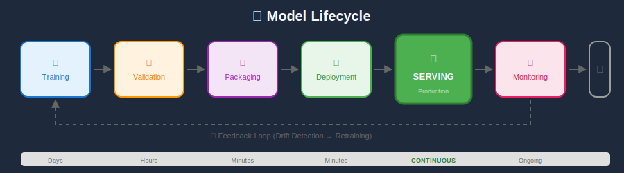
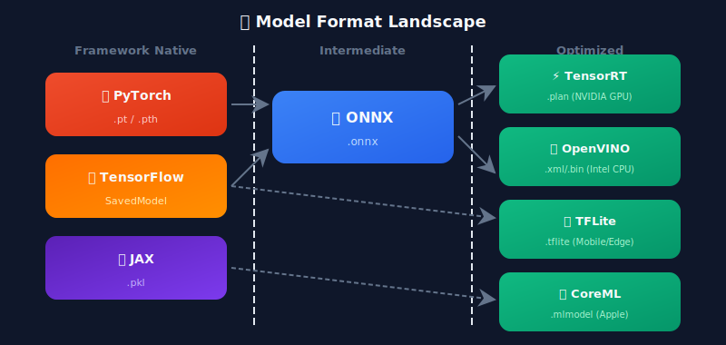
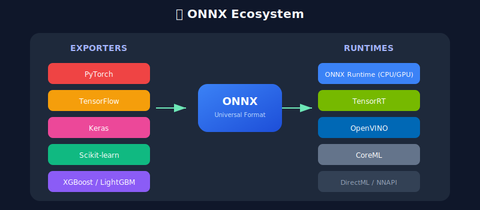
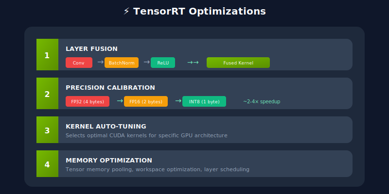

# 📦 Model Formats & Optimization

<p align="center">
  
</p>

## Table of Contents
- [Overview](#overview)
- [Native Framework Formats](#native-framework-formats)
- [ONNX: The Universal Format](#onnx-the-universal-format)
- [TensorRT: NVIDIA Optimization](#tensorrt-nvidia-optimization)
- [OpenVINO: Intel Optimization](#openvino-intel-optimization)
- [Model Conversion Pipeline](#model-conversion-pipeline)
- [Optimization Techniques](#optimization-techniques)
- [Best Practices](#best-practices)

---

## Overview

Model format selection impacts inference speed, memory usage, and deployment flexibility. The right format can improve performance by 2-10x.



---

## Native Framework Formats

### PyTorch Formats

```python
import torch

# 1. State Dict (weights only) - Most flexible
torch.save(model.state_dict(), "model_weights.pth")

# Loading requires model architecture
model = MyModel()
model.load_state_dict(torch.load("model_weights.pth"))

# 2. Full Model (pickle) - Includes architecture
torch.save(model, "full_model.pt")
model = torch.load("full_model.pt")  # Security risk!

# 3. TorchScript (Recommended for production)
# Trace-based (for models without control flow)
traced_model = torch.jit.trace(model, example_input)
traced_model.save("traced_model.pt")

# Script-based (for models with control flow)
scripted_model = torch.jit.script(model)
scripted_model.save("scripted_model.pt")

# Loading TorchScript (no architecture needed)
loaded = torch.jit.load("scripted_model.pt")
```

### TensorFlow Formats

```python
import tensorflow as tf

# 1. SavedModel (Recommended)
model.save("saved_model/", save_format="tf")
loaded = tf.saved_model.load("saved_model/")

# 2. Keras H5 (Legacy)
model.save("model.h5")
loaded = tf.keras.models.load_model("model.h5")

# 3. Checkpoint (weights only)
checkpoint = tf.train.Checkpoint(model=model)
checkpoint.save("ckpt/model")

# 4. Concrete Functions (optimized serving)
@tf.function(input_signature=[tf.TensorSpec([None, 224, 224, 3], tf.float32)])
def serve(x):
    return model(x)

tf.saved_model.save(model, "optimized/", signatures={"serving_default": serve})
```

---

## ONNX: The Universal Format

### What is ONNX?

Open Neural Network Exchange (ONNX) is an open format for representing ML models, enabling interoperability between frameworks.



### PyTorch to ONNX

```python
import torch
import torch.onnx

# Define model and example input
model = MyModel()
model.eval()
dummy_input = torch.randn(1, 3, 224, 224)

# Export to ONNX
torch.onnx.export(
    model,
    dummy_input,
    "model.onnx",
    export_params=True,
    opset_version=17,
    do_constant_folding=True,
    input_names=["input"],
    output_names=["output"],
    dynamic_axes={
        "input": {0: "batch_size"},
        "output": {0: "batch_size"}
    }
)

# Verify export
import onnx
onnx_model = onnx.load("model.onnx")
onnx.checker.check_model(onnx_model)
print("ONNX model is valid!")
```

### ONNX Runtime Inference

```python
import onnxruntime as ort
import numpy as np

# Create session with optimizations
session_options = ort.SessionOptions()
session_options.graph_optimization_level = ort.GraphOptimizationLevel.ORT_ENABLE_ALL
session_options.intra_op_num_threads = 4

# CPU provider
providers = ["CPUExecutionProvider"]

# GPU provider (if available)
if ort.get_device() == "GPU":
    providers = [
        ("CUDAExecutionProvider", {
            "device_id": 0,
            "arena_extend_strategy": "kNextPowerOfTwo",
            "gpu_mem_limit": 2 * 1024 * 1024 * 1024,
            "cudnn_conv_algo_search": "EXHAUSTIVE",
        }),
        "CPUExecutionProvider"
    ]

session = ort.InferenceSession("model.onnx", session_options, providers=providers)

# Run inference
input_name = session.get_inputs()[0].name
output_name = session.get_outputs()[0].name

input_data = np.random.randn(1, 3, 224, 224).astype(np.float32)
result = session.run([output_name], {input_name: input_data})
print(f"Output shape: {result[0].shape}")
```

---

## TensorRT: NVIDIA Optimization

### Overview

TensorRT is NVIDIA's deep learning inference optimizer and runtime for production deployment on NVIDIA GPUs.

### Optimization Techniques



### ONNX to TensorRT

```python
import tensorrt as trt

def build_engine(onnx_path, engine_path, fp16=True, int8=False):
    """Build TensorRT engine from ONNX model"""
    logger = trt.Logger(trt.Logger.WARNING)
    builder = trt.Builder(logger)
    network_flags = 1 << int(trt.NetworkDefinitionCreationFlag.EXPLICIT_BATCH)
    network = builder.create_network(network_flags)
    parser = trt.OnnxParser(network, logger)

    # Parse ONNX
    with open(onnx_path, "rb") as f:
        if not parser.parse(f.read()):
            for error in range(parser.num_errors):
                print(parser.get_error(error))
            raise RuntimeError("ONNX parsing failed")

    # Build config
    config = builder.create_builder_config()
    config.set_memory_pool_limit(trt.MemoryPoolType.WORKSPACE, 1 << 30)  # 1GB

    if fp16:
        config.set_flag(trt.BuilderFlag.FP16)

    if int8:
        config.set_flag(trt.BuilderFlag.INT8)
        config.int8_calibrator = MyCalibrator()  # Custom calibrator

    # Build engine
    serialized_engine = builder.build_serialized_network(network, config)

    # Save engine
    with open(engine_path, "wb") as f:
        f.write(serialized_engine)

    return serialized_engine

# Build FP16 engine
build_engine("model.onnx", "model_fp16.plan", fp16=True)
```

### TensorRT Inference

```python
import tensorrt as trt
import pycuda.driver as cuda
import pycuda.autoinit
import numpy as np

class TRTInference:
    def __init__(self, engine_path):
        logger = trt.Logger(trt.Logger.WARNING)
        with open(engine_path, "rb") as f:
            self.engine = trt.Runtime(logger).deserialize_cuda_engine(f.read())

        self.context = self.engine.create_execution_context()
        self.stream = cuda.Stream()

        # Allocate buffers
        self.inputs = []
        self.outputs = []
        self.bindings = []

        for i in range(self.engine.num_io_tensors):
            name = self.engine.get_tensor_name(i)
            dtype = trt.nptype(self.engine.get_tensor_dtype(name))
            shape = self.engine.get_tensor_shape(name)
            size = trt.volume(shape)

            host_mem = cuda.pagelocked_empty(size, dtype)
            device_mem = cuda.mem_alloc(host_mem.nbytes)
            self.bindings.append(int(device_mem))

            if self.engine.get_tensor_mode(name) == trt.TensorIOMode.INPUT:
                self.inputs.append({"host": host_mem, "device": device_mem})
            else:
                self.outputs.append({"host": host_mem, "device": device_mem})

    def infer(self, input_data):

        # Copy input to device
        np.copyto(self.inputs[0]["host"], input_data.ravel())
        cuda.memcpy_htod_async(self.inputs[0]["device"], self.inputs[0]["host"], self.stream)

        # Execute
        self.context.execute_async_v2(bindings=self.bindings, stream_handle=self.stream.handle)

        # Copy output to host
        cuda.memcpy_dtoh_async(self.outputs[0]["host"], self.outputs[0]["device"], self.stream)
        self.stream.synchronize()

        return self.outputs[0]["host"].copy()

# Usage
trt_engine = TRTInference("model_fp16.plan")
result = trt_engine.infer(input_data)
```

---

## OpenVINO: Intel Optimization

### Overview

OpenVINO (Open Visual Inference and Neural Network Optimization) is Intel's toolkit for optimizing and deploying inference on Intel hardware (CPUs, GPUs, VPUs).

### Model Optimization Workflow

```python
from openvino.tools import mo
from openvino.runtime import Core

# Convert ONNX to OpenVINO IR
model = mo.convert_model(
    "model.onnx",
    compress_to_fp16=True,
    input_shape=[1, 3, 224, 224]
)

# Save IR format
from openvino.runtime import serialize
serialize(model, "model.xml")

# Load and run inference
core = Core()
compiled_model = core.compile_model("model.xml", "CPU")

# Get input/output info
input_layer = compiled_model.input(0)
output_layer = compiled_model.output(0)

# Run inference
import numpy as np
input_data = np.random.randn(1, 3, 224, 224).astype(np.float32)
result = compiled_model([input_data])[output_layer]
```

---

## Model Conversion Pipeline

### Unified Conversion Script

```python

# convert_model.py
import argparse
from pathlib import Path

def convert_pytorch_to_onnx(model_path, output_path, input_shape):
    import torch
    model = torch.jit.load(model_path)
    model.eval()

    dummy_input = torch.randn(*input_shape)
    torch.onnx.export(
        model, dummy_input, output_path,
        opset_version=17,
        input_names=["input"],
        output_names=["output"],
        dynamic_axes={"input": {0: "batch"}, "output": {0: "batch"}}
    )
    print(f"Exported to {output_path}")

def convert_onnx_to_tensorrt(onnx_path, output_path, fp16=True):
    import tensorrt as trt

    # ... TensorRT conversion code
    print(f"TensorRT engine saved to {output_path}")

def convert_onnx_to_openvino(onnx_path, output_path):
    from openvino.tools import mo
    from openvino.runtime import serialize
    model = mo.convert_model(onnx_path, compress_to_fp16=True)
    serialize(model, output_path)
    print(f"OpenVINO IR saved to {output_path}")

if __name__ == "__main__":
    parser = argparse.ArgumentParser()
    parser.add_argument("--source", required=True)
    parser.add_argument("--target", choices=["onnx", "tensorrt", "openvino"])
    parser.add_argument("--input", required=True)
    parser.add_argument("--output", required=True)
    args = parser.parse_args()

    # Run conversion based on target
    if args.target == "onnx":
        convert_pytorch_to_onnx(args.input, args.output, [1, 3, 224, 224])
    elif args.target == "tensorrt":
        convert_onnx_to_tensorrt(args.input, args.output)
    elif args.target == "openvino":
        convert_onnx_to_openvino(args.input, args.output)
```

---

## Optimization Techniques

### 1. Graph Optimization

```python
import onnx
from onnxruntime.transformers import optimizer

# Load model
model = onnx.load("model.onnx")

# Optimize for transformer models
optimized = optimizer.optimize_model(
    "model.onnx",
    model_type="bert",
    num_heads=12,
    hidden_size=768,
    optimization_options=optimizer.FusionOptions("bert")
)

optimized.save_model_to_file("model_optimized.onnx")
```

### 2. Constant Folding

```python
import onnx
from onnx import optimizer

# Load model
model = onnx.load("model.onnx")

# Apply optimizations
passes = [
    "eliminate_identity",
    "eliminate_nop_transpose",
    "fuse_consecutive_transposes",
    "fuse_add_bias_into_conv",
    "fuse_bn_into_conv",
    "fuse_matmul_add_bias_into_gemm"
]

optimized = optimizer.optimize(model, passes)
onnx.save(optimized, "model_optimized.onnx")
```

---

## Best Practices

### Format Selection Guide

| Scenario | Recommended Format |
|----------|-------------------|
| NVIDIA GPU Production | TensorRT |
| Intel CPU Production | OpenVINO |
| Cross-platform | ONNX Runtime |
| Mobile (iOS) | CoreML |
| Mobile (Android) | TFLite / NNAPI |
| Edge Devices | TFLite / ONNX Runtime |

### Optimization Checklist

1. ✅ Convert to ONNX first (universal intermediate)
2. ✅ Apply graph optimizations (fusion, folding)
3. ✅ Use FP16 when accuracy permits (2x speedup)
4. ✅ Consider INT8 for edge (4x speedup, needs calibration)
5. ✅ Profile before and after optimization
6. ✅ Validate accuracy degradation < 1%

---

## Next Steps

→ **[04. Inference Patterns](../04_inference_patterns/)**: Learn batch vs real-time serving patterns

---

*Choose the right format for your hardware and requirements!*

---

<div align="center">

**[⬆ Back to Top](#)** | **[📚 Main Repository](https://github.com/Gaurav14cs17/ml_system_design)**

Made with 💜 by [Gaurav14cs17](https://github.com/Gaurav14cs17)

</div>
