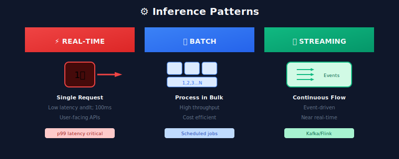
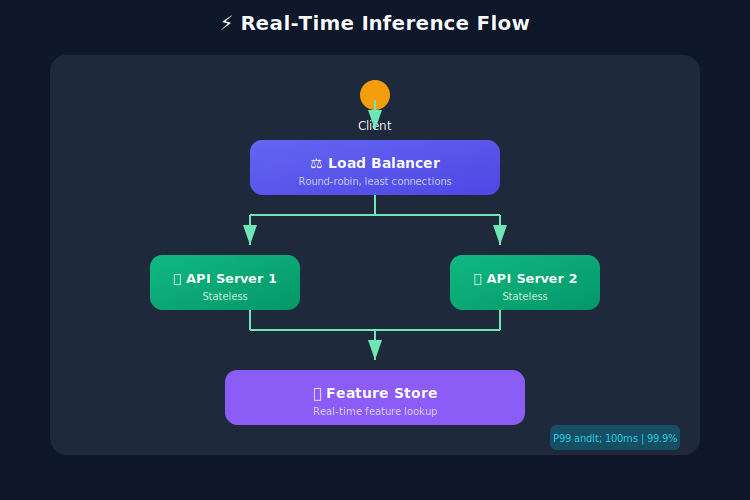
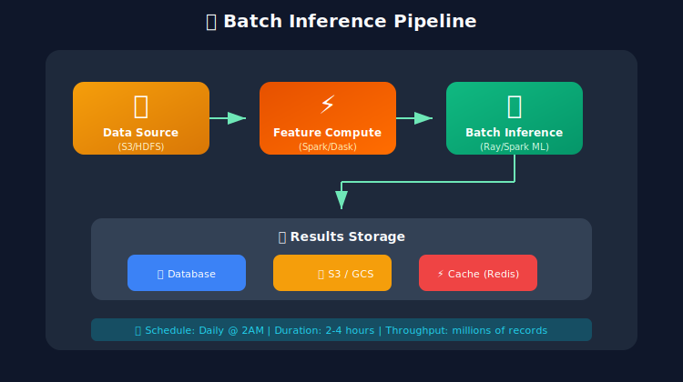
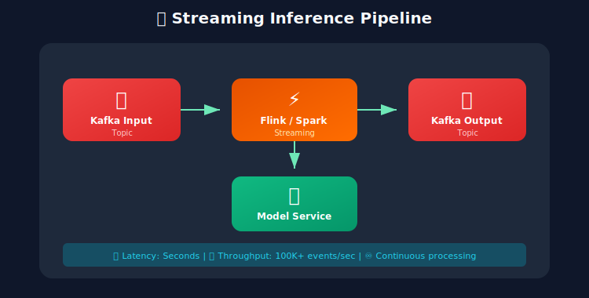
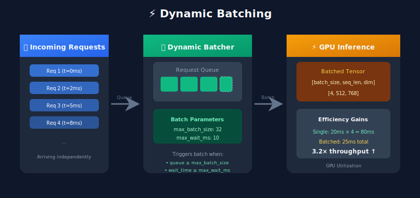
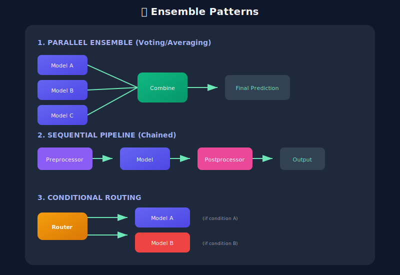

# ⚡ Inference Patterns

<p align="center">
  
</p>

## Table of Contents
- [Overview](#overview)
- [Real-time (Online) Inference](#real-time-online-inference)
- [Batch Inference](#batch-inference)
- [Streaming Inference](#streaming-inference)
- [Dynamic Batching](#dynamic-batching)
- [Model Ensembles](#model-ensembles)
- [Pattern Selection Guide](#pattern-selection-guide)

---

## Overview

Inference patterns define how your model processes predictions. The choice depends on latency requirements, throughput needs, and infrastructure constraints.



---

## Real-time (Online) Inference

### Architecture



### Implementation

```python
# real_time_server.py
from fastapi import FastAPI, HTTPException
from pydantic import BaseModel
import torch
import time
import asyncio
from typing import List
import redis

app = FastAPI()

# Load model at startup
model = None
feature_store = redis.Redis(host="localhost", port=6379, decode_responses=True)

@app.on_event("startup")
async def load_model():
    global model
    model = torch.jit.load("model.pt")
    model.eval()

class PredictionRequest(BaseModel):
    user_id: str
    item_id: str
    context: dict = {}

class PredictionResponse(BaseModel):
    score: float
    latency_ms: float
    cache_hit: bool = False

@app.post("/predict", response_model=PredictionResponse)
async def predict(request: PredictionRequest):
    start_time = time.perf_counter()

    # Check cache
    cache_key = f"{request.user_id}:{request.item_id}"
    cached = feature_store.get(f"pred:{cache_key}")
    if cached:
        return PredictionResponse(
            score=float(cached),
            latency_ms=(time.perf_counter() - start_time) * 1000,
            cache_hit=True
        )

    # Fetch features (async)
    features = await get_features(request.user_id, request.item_id)

    # Run inference
    input_tensor = torch.tensor([features], dtype=torch.float32)
    with torch.no_grad():
        output = model(input_tensor)

    score = output[0].item()

    # Cache result (5 minute TTL)
    feature_store.setex(f"pred:{cache_key}", 300, str(score))

    latency_ms = (time.perf_counter() - start_time) * 1000

    return PredictionResponse(score=score, latency_ms=latency_ms)

async def get_features(user_id: str, item_id: str) -> List[float]:
    """Fetch features from feature store"""
    user_features = feature_store.hgetall(f"user:{user_id}")
    item_features = feature_store.hgetall(f"item:{item_id}")

    # Combine features
    return [
        float(user_features.get("age", 0)),
        float(user_features.get("purchase_count", 0)),
        float(item_features.get("price", 0)),
        float(item_features.get("category_id", 0))
    ]
```

### Real-time Best Practices

| Practice | Description |
|----------|-------------|
| Pre-load models | Load on startup, not per-request |
| Use feature stores | Sub-millisecond feature retrieval |
| Implement caching | Cache frequent predictions |
| Set timeouts | Fail fast on slow requests |
| Use connection pooling | Reuse database/service connections |

---

## Batch Inference

### Architecture



### Implementation with Spark

```python
# batch_inference_spark.py
from pyspark.sql import SparkSession
from pyspark.sql.functions import udf, col
from pyspark.sql.types import FloatType, ArrayType
import torch
import numpy as np

# Initialize Spark
spark = SparkSession.builder \
    .appName("BatchInference") \
    .config("spark.executor.memory", "8g") \
    .config("spark.driver.memory", "4g") \
    .getOrCreate()

# Broadcast model to all workers
model_bytes = open("model.pt", "rb").read()
broadcast_model = spark.sparkContext.broadcast(model_bytes)

def load_model_on_worker():
    """Load model from broadcast variable"""
    import io
    model = torch.jit.load(io.BytesIO(broadcast_model.value))
    model.eval()
    return model

# UDF for prediction
@udf(returnType=FloatType())
def predict_udf(features):
    model = load_model_on_worker()
    input_tensor = torch.tensor([features], dtype=torch.float32)
    with torch.no_grad():
        output = model(input_tensor)
    return float(output[0].item())

# Load data
df = spark.read.parquet("s3://data/features/")

# Run batch inference
predictions = df.withColumn(
    "prediction",
    predict_udf(col("features"))
)

# Save results
predictions.write \
    .mode("overwrite") \
    .parquet("s3://data/predictions/")

print(f"Processed {predictions.count()} records")
```

### Batch with GPU (Ray)

```python
# batch_inference_ray.py
import ray
from ray import data
import torch
import numpy as np

ray.init()

class BatchPredictor:
    def __init__(self):
        self.model = torch.jit.load("model.pt")
        if torch.cuda.is_available():
            self.model = self.model.cuda()
        self.model.eval()

    def __call__(self, batch: dict) -> dict:
        features = torch.tensor(batch["features"], dtype=torch.float32)
        if torch.cuda.is_available():
            features = features.cuda()

        with torch.no_grad():
            predictions = self.model(features).cpu().numpy()

        batch["prediction"] = predictions
        return batch

# Load data
ds = ray.data.read_parquet("s3://data/features/")

# Run batch inference with GPU
predictions = ds.map_batches(
    BatchPredictor,
    batch_size=256,
    num_gpus=1,
    compute=ray.data.ActorPoolStrategy(size=4)
)

# Save results
predictions.write_parquet("s3://data/predictions/")
```

---

## Streaming Inference

### Architecture



### Implementation with Faust

```python
# streaming_inference.py
import faust
from datetime import datetime
import torch
import json

# Initialize Faust app
app = faust.App(
    'ml-inference',
    broker='kafka://localhost:9092',
    value_serializer='json'
)

# Define event schema
class PredictionEvent(faust.Record):
    user_id: str
    features: list
    timestamp: str

class PredictionResult(faust.Record):
    user_id: str
    prediction: float
    timestamp: str
    model_version: str

# Topics
input_topic = app.topic('events', value_type=PredictionEvent)
output_topic = app.topic('predictions', value_type=PredictionResult)

# Load model
model = torch.jit.load("model.pt")
model.eval()
MODEL_VERSION = "1.0.0"

@app.agent(input_topic)
async def process_events(events):
    """Process streaming events"""
    async for event in events:
        # Run inference
        input_tensor = torch.tensor([event.features], dtype=torch.float32)
        with torch.no_grad():
            output = model(input_tensor)

        prediction = output[0].item()

        # Send result to output topic
        result = PredictionResult(
            user_id=event.user_id,
            prediction=prediction,
            timestamp=datetime.utcnow().isoformat(),
            model_version=MODEL_VERSION
        )

        await output_topic.send(value=result)

# Windowed aggregations
@app.agent(input_topic)
async def compute_stats(events):
    """Compute rolling statistics"""
    async for event in events.take(100, within=60):  # 100 events or 60 seconds
        # Compute aggregates
        pass

if __name__ == '__main__':
    app.main()
```

---

## Dynamic Batching

### Concept

Dynamic batching collects individual requests and processes them together for better GPU utilization.



### Implementation

```python
# dynamic_batcher.py
import asyncio
import time
from typing import List, Any, Callable
from dataclasses import dataclass
import torch

@dataclass
class BatchRequest:
    data: Any
    future: asyncio.Future
    arrival_time: float

class DynamicBatcher:
    def __init__(
        self,
        model: torch.nn.Module,
        max_batch_size: int = 32,
        max_wait_ms: float = 10.0
    ):
        self.model = model
        self.max_batch_size = max_batch_size
        self.max_wait_seconds = max_wait_ms / 1000
        self.queue: List[BatchRequest] = []
        self.lock = asyncio.Lock()
        self.processing = False

    async def predict(self, data: torch.Tensor) -> torch.Tensor:
        """Submit prediction request and wait for result"""
        loop = asyncio.get_event_loop()
        future = loop.create_future()
        request = BatchRequest(data, future, time.time())

        async with self.lock:
            self.queue.append(request)

            if len(self.queue) >= self.max_batch_size:
                asyncio.create_task(self._process_batch())
            elif len(self.queue) == 1:
                asyncio.create_task(self._wait_and_process())

        return await future

    async def _wait_and_process(self):
        """Wait for timeout then process"""
        await asyncio.sleep(self.max_wait_seconds)
        await self._process_batch()

    async def _process_batch(self):
        """Process all queued requests"""
        async with self.lock:
            if not self.queue or self.processing:
                return

            self.processing = True
            batch = self.queue[:self.max_batch_size]
            self.queue = self.queue[self.max_batch_size:]

        try:
            # Stack inputs
            inputs = torch.cat([req.data for req in batch], dim=0)

            # Run inference
            with torch.no_grad():
                outputs = self.model(inputs)

            # Distribute results
            for i, req in enumerate(batch):
                req.future.set_result(outputs[i:i+1])

        except Exception as e:
            for req in batch:
                if not req.future.done():
                    req.future.set_exception(e)

        finally:
            self.processing = False

# Usage in FastAPI
batcher = None

@app.on_event("startup")
async def setup():
    global batcher
    model = torch.jit.load("model.pt")
    model.eval()
    batcher = DynamicBatcher(model, max_batch_size=32, max_wait_ms=10)

@app.post("/predict")
async def predict(request: PredictionRequest):
    input_tensor = torch.tensor([request.features], dtype=torch.float32)
    result = await batcher.predict(input_tensor)
    return {"prediction": result[0].tolist()}
```

---

## Model Ensembles

### Ensemble Patterns



### Implementation

```python
# ensemble_server.py
from fastapi import FastAPI
import torch
import numpy as np
from typing import List
import asyncio

app = FastAPI()

class EnsemblePredictor:
    def __init__(self, model_paths: List[str], weights: List[float] = None):
        self.models = [torch.jit.load(path) for path in model_paths]
        for model in self.models:
            model.eval()

        self.weights = weights or [1.0 / len(self.models)] * len(self.models)

    async def predict_parallel(self, input_tensor: torch.Tensor) -> torch.Tensor:
        """Run all models in parallel and combine results"""
        async def run_model(model, data):
            with torch.no_grad():
                return model(data)

        tasks = [run_model(model, input_tensor) for model in self.models]
        outputs = await asyncio.gather(*tasks)

        # Weighted average
        combined = sum(w * out for w, out in zip(self.weights, outputs))
        return combined

    def predict_voting(self, input_tensor: torch.Tensor) -> int:
        """Majority voting for classification"""
        predictions = []
        with torch.no_grad():
            for model in self.models:
                output = model(input_tensor)
                pred = torch.argmax(output, dim=1).item()
                predictions.append(pred)

        # Return most common prediction
        return max(set(predictions), key=predictions.count)

ensemble = EnsemblePredictor([
    "model_v1.pt",
    "model_v2.pt",
    "model_v3.pt"
], weights=[0.5, 0.3, 0.2])

@app.post("/predict/ensemble")
async def predict(request: PredictionRequest):
    input_tensor = torch.tensor([request.features], dtype=torch.float32)
    result = await ensemble.predict_parallel(input_tensor)
    return {"prediction": result[0].tolist()}
```

---

## Pattern Selection Guide

### Decision Matrix

| Requirement | Real-time | Batch | Streaming |
|------------|-----------|-------|-----------|
| Latency < 100ms | ✅ | ❌ | ⚠️ |
| Throughput priority | ❌ | ✅ | ⚠️ |
| Cost efficiency | ⚠️ | ✅ | ⚠️ |
| Always-on | ✅ | ❌ | ✅ |
| Event-driven | ⚠️ | ❌ | ✅ |
| Historical data | ❌ | ✅ | ⚠️ |

### Use Case Mapping

| Use Case | Pattern | Why |
|----------|---------|-----|
| Fraud detection | Real-time | Immediate decision needed |
| Recommendations | Real-time + Cache | User expects instant results |
| Email campaigns | Batch | Process millions overnight |
| Search ranking | Real-time | Query-time personalization |
| IoT monitoring | Streaming | Continuous event processing |
| Report generation | Batch | Large data, no urgency |

---

## Next Steps

→ **[05. Versioning & A/B Testing](../05_versioning_ab_testing/)**: Learn model versioning and experimentation

---

*Choose the right pattern for your latency and throughput requirements!*

---

<div align="center">

**[⬆ Back to Top](#)** | **[📚 Main Repository](https://github.com/Gaurav14cs17/ml_system_design)**

Made with 💜 by [Gaurav14cs17](https://github.com/Gaurav14cs17)

</div>
