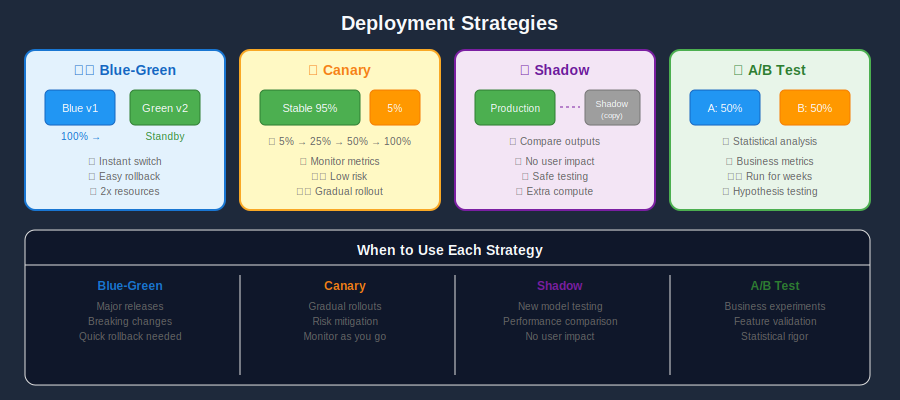
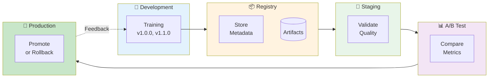
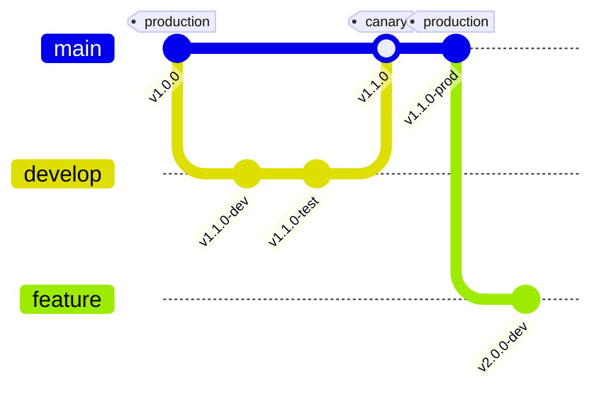
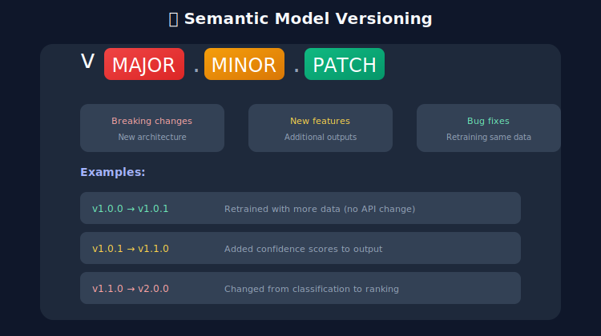
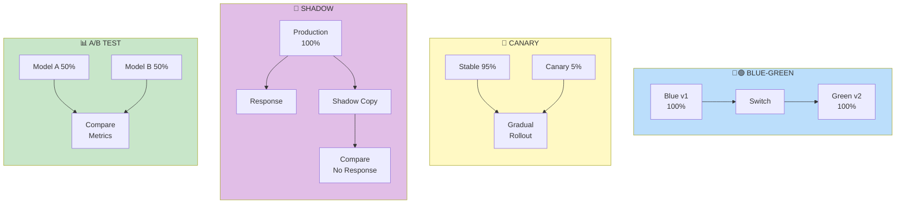
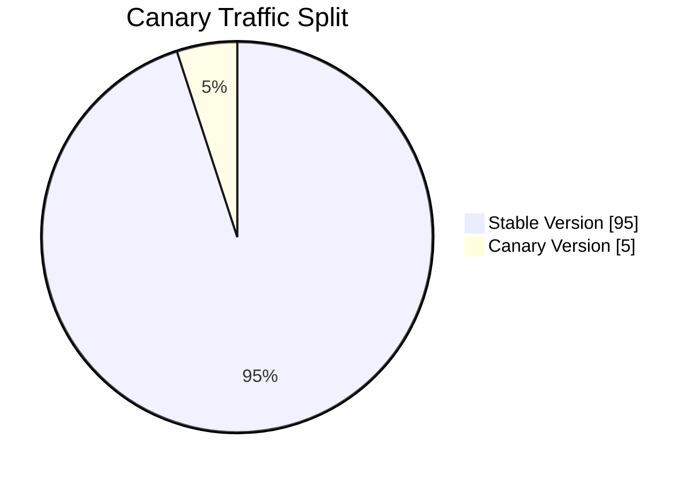

# 🔄 Model Versioning & A/B Testing

<p align="center">
  
</p>

## Table of Contents
- [Overview](#overview)
- [Model Versioning Strategies](#model-versioning-strategies)
- [Model Registry](#model-registry)
- [Deployment Strategies](#deployment-strategies)
- [A/B Testing Framework](#ab-testing-framework)
- [Canary Deployments](#canary-deployments)
- [Shadow Deployments](#canary-deployments)
- [Rollback Strategies](#rollback-strategies)
- [Best Practices](#best-practices)

---

## Overview

Model versioning and A/B testing ensure safe, measurable model deployments in production.





---

## Model Versioning Strategies

### Semantic Versioning for Models



### Version Metadata

```python
# model_version.py
from dataclasses import dataclass
from datetime import datetime
from typing import Dict, List, Optional
import json

@dataclass
class ModelVersion:
    name: str
    version: str
    created_at: datetime
    framework: str
    metrics: Dict[str, float]
    training_data: str
    hyperparameters: Dict
    dependencies: Dict[str, str]
    tags: List[str]
    stage: str  # development, staging, production, archived

    def to_dict(self) -> dict:
        return {
            "name": self.name,
            "version": self.version,
            "created_at": self.created_at.isoformat(),
            "framework": self.framework,
            "metrics": self.metrics,
            "training_data": self.training_data,
            "hyperparameters": self.hyperparameters,
            "dependencies": self.dependencies,
            "tags": self.tags,
            "stage": self.stage
        }

# Example usage
model_v1 = ModelVersion(
    name="recommendation_model",
    version="1.2.3",
    created_at=datetime.now(),
    framework="pytorch==2.0.0",
    metrics={"auc": 0.89, "ndcg@10": 0.76},
    training_data="s3://data/training/2024-01-01",
    hyperparameters={"learning_rate": 0.001, "epochs": 50},
    dependencies={"numpy": "1.24.0", "torch": "2.0.0"},
    tags=["recommendation", "production-ready"],
    stage="staging"
)
```

---

## Model Registry

### MLflow Integration

```python
# model_registry.py
import mlflow
from mlflow.tracking import MlflowClient

# Configure MLflow
mlflow.set_tracking_uri("http://mlflow-server:5000")
client = MlflowClient()

def register_model(model, model_name: str, metrics: dict, params: dict):
    """Register model with MLflow"""
    with mlflow.start_run():
        # Log parameters
        mlflow.log_params(params)

        # Log metrics
        mlflow.log_metrics(metrics)

        # Log model
        mlflow.pytorch.log_model(
            model,
            artifact_path="model",
            registered_model_name=model_name
        )

        run_id = mlflow.active_run().info.run_id

    return run_id

def promote_model(model_name: str, version: int, stage: str):
    """Promote model to new stage"""
    client.transition_model_version_stage(
        name=model_name,
        version=version,
        stage=stage  # "Staging", "Production", "Archived"
    )

def get_production_model(model_name: str):
    """Load the production model"""
    model_uri = f"models:/{model_name}/Production"
    return mlflow.pytorch.load_model(model_uri)

def compare_models(model_name: str, v1: int, v2: int):
    """Compare two model versions"""
    v1_details = client.get_model_version(model_name, v1)
    v2_details = client.get_model_version(model_name, v2)

    v1_run = client.get_run(v1_details.run_id)
    v2_run = client.get_run(v2_details.run_id)

    return {
        "v1": {"version": v1, "metrics": v1_run.data.metrics},
        "v2": {"version": v2, "metrics": v2_run.data.metrics}
    }
```

---

## Deployment Strategies

### Strategy Comparison





---

## A/B Testing Framework

### Implementation

```python
# ab_testing.py
from fastapi import FastAPI, Request
import hashlib
import random
from typing import Dict, Optional
import torch
from dataclasses import dataclass
from datetime import datetime

app = FastAPI()

@dataclass
class Experiment:
    name: str
    model_a_path: str
    model_b_path: str
    traffic_split: float  # Percentage to model B
    start_date: datetime
    end_date: Optional[datetime] = None

class ABTestingRouter:
    def __init__(self):
        self.experiments: Dict[str, Experiment] = {}
        self.models: Dict[str, torch.nn.Module] = {}

    def create_experiment(self, experiment: Experiment):
        """Create new A/B test experiment"""
        self.experiments[experiment.name] = experiment

        # Load both models
        self.models[f"{experiment.name}_a"] = torch.jit.load(experiment.model_a_path)
        self.models[f"{experiment.name}_b"] = torch.jit.load(experiment.model_b_path)

    def get_variant(self, experiment_name: str, user_id: str) -> str:
        """Deterministically assign user to variant"""
        experiment = self.experiments[experiment_name]

        # Hash user_id for consistent assignment
        hash_input = f"{experiment_name}:{user_id}"
        hash_value = int(hashlib.md5(hash_input.encode()).hexdigest(), 16)
        bucket = (hash_value % 100) / 100.0

        if bucket < experiment.traffic_split:
            return "B"
        return "A"

    def get_model(self, experiment_name: str, variant: str) -> torch.nn.Module:
        """Get model for variant"""
        key = f"{experiment_name}_{variant.lower()}"
        return self.models[key]

router = ABTestingRouter()

# Create experiment
router.create_experiment(Experiment(
    name="recommendation_v2_test",
    model_a_path="models/rec_v1.pt",
    model_b_path="models/rec_v2.pt",
    traffic_split=0.2,  # 20% to new model
    start_date=datetime.now()
))

@app.post("/predict")
async def predict(request: Request, user_id: str, features: list):
    experiment_name = "recommendation_v2_test"

    # Get variant assignment
    variant = router.get_variant(experiment_name, user_id)

    # Get appropriate model
    model = router.get_model(experiment_name, variant)

    # Run inference
    input_tensor = torch.tensor([features], dtype=torch.float32)
    with torch.no_grad():
        output = model(input_tensor)

    prediction = output[0].tolist()

    # Log for analysis
    log_experiment_event(experiment_name, user_id, variant, prediction)

    return {
        "prediction": prediction,
        "variant": variant,
        "experiment": experiment_name
    }

def log_experiment_event(experiment: str, user_id: str, variant: str, prediction):
    """Log experiment events for analysis"""
    event = {
        "timestamp": datetime.utcnow().isoformat(),
        "experiment": experiment,
        "user_id": user_id,
        "variant": variant,
        "prediction": prediction
    }
    # Send to analytics pipeline (Kafka, BigQuery, etc.)
    print(f"Logged: {event}")
```

### Statistical Analysis

```python
# experiment_analysis.py
import numpy as np
from scipy import stats
from typing import List, Tuple

def calculate_sample_size(
    baseline_rate: float,
    minimum_detectable_effect: float,
    alpha: float = 0.05,
    power: float = 0.8
) -> int:
    """Calculate required sample size for experiment"""
    from statsmodels.stats.power import NormalIndPower

    effect_size = minimum_detectable_effect / np.sqrt(baseline_rate * (1 - baseline_rate))
    analysis = NormalIndPower()
    sample_size = analysis.solve_power(
        effect_size=effect_size,
        alpha=alpha,
        power=power,
        alternative='two-sided'
    )
    return int(np.ceil(sample_size))

def analyze_experiment(
    control_conversions: int,
    control_total: int,
    treatment_conversions: int,
    treatment_total: int
) -> dict:
    """Analyze A/B test results"""
    control_rate = control_conversions / control_total
    treatment_rate = treatment_conversions / treatment_total

    # Chi-squared test
    contingency = [
        [control_conversions, control_total - control_conversions],
        [treatment_conversions, treatment_total - treatment_conversions]
    ]
    chi2, p_value, dof, expected = stats.chi2_contingency(contingency)

    # Relative uplift
    relative_uplift = (treatment_rate - control_rate) / control_rate * 100

    # Confidence interval (95%)
    se = np.sqrt(treatment_rate * (1 - treatment_rate) / treatment_total)
    ci_low = treatment_rate - 1.96 * se
    ci_high = treatment_rate + 1.96 * se

    return {
        "control_rate": control_rate,
        "treatment_rate": treatment_rate,
        "relative_uplift": relative_uplift,
        "p_value": p_value,
        "significant": p_value < 0.05,
        "confidence_interval": (ci_low, ci_high)
    }

# Example
results = analyze_experiment(
    control_conversions=450,
    control_total=10000,
    treatment_conversions=520,
    treatment_total=10000
)
print(f"Uplift: {results['relative_uplift']:.1f}%")
print(f"P-value: {results['p_value']:.4f}")
print(f"Significant: {results['significant']}")
```

---

## Canary Deployments

### Kubernetes Canary

```yaml
# canary-deployment.yaml
apiVersion: v1
kind: Service
metadata:
  name: model-service
spec:
  selector:
    app: model-server
  ports:
    - port: 80
      targetPort: 8080
---
apiVersion: apps/v1
kind: Deployment
metadata:
  name: model-stable
spec:
  replicas: 9
  selector:
    matchLabels:
      app: model-server
      version: stable
  template:
    metadata:
      labels:
        app: model-server
        version: stable
    spec:
      containers:
        - name: model
          image: model-server:v1.0.0
          ports:
            - containerPort: 8080
---
apiVersion: apps/v1
kind: Deployment
metadata:
  name: model-canary
spec:
  replicas: 1  # 10% traffic
  selector:
    matchLabels:
      app: model-server
      version: canary
  template:
    metadata:
      labels:
        app: model-server
        version: canary
    spec:
      containers:
        - name: model
          image: model-server:v2.0.0
          ports:
            - containerPort: 8080
```

### Progressive Rollout

```python
# progressive_rollout.py
import time
from kubernetes import client, config

config.load_kube_config()
apps_v1 = client.AppsV1Api()

def progressive_rollout(
    namespace: str,
    stable_deployment: str,
    canary_deployment: str,
    steps: list = [10, 25, 50, 75, 100],
    step_duration_minutes: int = 30
):
    """Progressive canary rollout"""
    total_replicas = 10

    for percentage in steps:
        canary_replicas = int(total_replicas * percentage / 100)
        stable_replicas = total_replicas - canary_replicas

        print(f"Rolling out: {percentage}% canary ({canary_replicas} replicas)")

        # Scale deployments
        scale_deployment(namespace, canary_deployment, canary_replicas)
        scale_deployment(namespace, stable_deployment, stable_replicas)

        # Wait and monitor
        success = monitor_canary(namespace, canary_deployment, step_duration_minutes)

        if not success:
            print("Canary failed health checks. Rolling back...")
            rollback(namespace, stable_deployment, canary_deployment, total_replicas)
            return False

    print("Canary rollout complete!")
    return True

def scale_deployment(namespace: str, name: str, replicas: int):
    """Scale deployment to specified replicas"""
    body = {"spec": {"replicas": replicas}}
    apps_v1.patch_namespaced_deployment_scale(name, namespace, body)

def monitor_canary(namespace: str, deployment: str, duration_minutes: int) -> bool:
    """Monitor canary health during rollout step"""
    # Check error rates, latency, etc.
    # Return False if metrics exceed thresholds
    return True

def rollback(namespace: str, stable: str, canary: str, total: int):
    """Rollback to stable version"""
    scale_deployment(namespace, canary, 0)
    scale_deployment(namespace, stable, total)
```

---

## Rollback Strategies

### Automated Rollback

```python
# rollback_manager.py
from prometheus_api_client import PrometheusConnect
from datetime import datetime, timedelta

class RollbackManager:
    def __init__(self, prometheus_url: str):
        self.prom = PrometheusConnect(url=prometheus_url)
        self.thresholds = {
            "error_rate": 0.01,  # 1%
            "p99_latency_ms": 200,
            "prediction_drift": 0.1
        }

    def check_health(self, model_version: str) -> dict:
        """Check model health metrics"""
        metrics = {}

        # Error rate
        error_query = f'sum(rate(model_errors_total{{version="{model_version}"}}[5m])) / sum(rate(model_requests_total{{version="{model_version}"}}[5m]))'
        result = self.prom.custom_query(error_query)
        metrics["error_rate"] = float(result[0]["value"][1]) if result else 0

        # Latency
        latency_query = f'histogram_quantile(0.99, rate(model_latency_bucket{{version="{model_version}"}}[5m]))'
        result = self.prom.custom_query(latency_query)
        metrics["p99_latency_ms"] = float(result[0]["value"][1]) * 1000 if result else 0

        return metrics

    def should_rollback(self, model_version: str) -> Tuple[bool, str]:
        """Determine if rollback is needed"""
        metrics = self.check_health(model_version)

        for metric, value in metrics.items():
            if value > self.thresholds.get(metric, float('inf')):
                return True, f"{metric} exceeded threshold: {value} > {self.thresholds[metric]}"

        return False, "All metrics within thresholds"

    def execute_rollback(self, current_version: str, previous_version: str):
        """Execute rollback to previous version"""
        print(f"Rolling back from {current_version} to {previous_version}")
        # Update deployment, traffic routing, etc.

# Automated health check loop
manager = RollbackManager("http://prometheus:9090")

async def health_check_loop(model_version: str, check_interval: int = 60):
    while True:
        should_rollback, reason = manager.should_rollback(model_version)
        if should_rollback:
            print(f"Triggering rollback: {reason}")
            manager.execute_rollback(model_version, "previous_stable")
            break
        await asyncio.sleep(check_interval)
```

---

## Best Practices

### Versioning Checklist

- ✅ Use semantic versioning (MAJOR.MINOR.PATCH)
- ✅ Store all metadata with model artifacts
- ✅ Track training data versions
- ✅ Log all hyperparameters
- ✅ Record dependency versions

### A/B Testing Checklist

- ✅ Calculate sample size before starting
- ✅ Use consistent user bucketing
- ✅ Run for sufficient duration
- ✅ Monitor guardrail metrics
- ✅ Document experiment results

### Deployment Checklist

- ✅ Start with shadow deployment
- ✅ Use gradual canary rollout
- ✅ Set up automated rollback
- ✅ Monitor business metrics
- ✅ Have runbook for incidents

---

## Next Steps

→ **[06. Scaling & Load Balancing](../06_scaling_load_balancing/)**: Learn horizontal scaling and load distribution

---

*Safe deployments through versioning, testing, and gradual rollouts!*

---

<div align="center">

**[⬆ Back to Top](#)** | **[📚 Main Repository](https://github.com/Gaurav14cs17/ml_system_design)**

Made with 💜 by [Gaurav14cs17](https://github.com/Gaurav14cs17)

</div>
