# 📈 Scaling & Load Balancing

<p align="center">
  
</p>

## Table of Contents
- [Overview](#overview)
- [Scaling Fundamentals](#scaling-fundamentals)
- [Horizontal Scaling](#horizontal-scaling)
- [Autoscaling Strategies](#autoscaling-strategies)
- [Load Balancing Algorithms](#load-balancing-algorithms)
- [Kubernetes Scaling](#kubernetes-scaling)
- [GPU Scaling](#gpu-scaling)
- [Capacity Planning](#capacity-planning)
- [Best Practices](#best-practices)

---

## Overview

Scaling ensures your ML serving system handles varying traffic while maintaining latency SLOs and cost efficiency.

```mermaid
flowchart LR
    subgraph Vertical["⬆️ VERTICAL SCALING"]
        V1[Small<br/>Instance] --> V2[Large<br/>Instance]
        V3["Limited ceiling"]
    end

    subgraph Horizontal["➡️ HORIZONTAL SCALING"]
        H1[🖥️]
        H2[🖥️]
        H3[🖥️]
        H4["Add more instances"]
    end

    style Vertical fill:#ffcdd2
    style Horizontal fill:#c8e6c9
```

```mermaid
graph TB
    subgraph Traffic["📈 TRAFFIC PATTERN"]
        T1[Normal Load] --> T2[Peak Load] --> T3[Normal Load]
    end

    subgraph AutoScale["⚡ AUTOSCALING"]
        A1[2 Pods] --> A2[10 Pods] --> A3[2 Pods]
    end

    Traffic -.-> AutoScale

    style Traffic fill:#e3f2fd
    style AutoScale fill:#fff9c4
```





---

## Scaling Fundamentals

### Key Metrics for Scaling

| Metric | Description | Target |
|--------|-------------|--------|
| **RPS** | Requests per second | Business requirement |
| **Latency P99** | 99th percentile response time | < SLO (e.g., 100ms) |
| **CPU Utilization** | Average CPU usage | 60-70% |
| **GPU Utilization** | Average GPU usage | 70-80% |
| **Memory Usage** | RAM consumption | < 80% |

### Little's Law

**Little's Law** is a fundamental theorem in queueing theory that relates three key metrics:

\[
L = \lambda \times W
\]

where:
- \( L \) = Average number of requests **in the system** (queue + being processed)
- \( \lambda \) = **Arrival rate** (requests per second)
- \( W \) = Average **time in system** (total latency including queue time)

#### Derivation Intuition

Consider a system over time period \( T \):
- Total arrivals: \( A = \lambda \times T \)
- Each request spends average time \( W \) in system
- Area under "requests in system" curve: \( A \times W = \lambda T W \)
- Average requests in system: \( L = \frac{\lambda T W}{T} = \lambda W \)

#### Capacity Planning Formula

From Little's Law, we can derive the **required concurrency**:

\[
\text{Required Replicas} \geq \frac{\lambda \times W}{\text{Throughput per Replica}}
\]

**Example calculation:**
- Target: \( \lambda = 1000 \) RPS
- Latency: \( W = 50 \) ms = 0.05 s
- Concurrent requests: \( L = 1000 \times 0.05 = 50 \)
- If each server handles 10 concurrent requests: Need 5+ servers

#### Extended Little's Law (with Utilization)

Including **server utilization** \( \rho \):

\[
W = W_s + W_q = \frac{1}{\mu} + \frac{\rho}{\mu(1-\rho)}
\]

where:
- \( W_s \) = service time (inference time)
- \( W_q \) = queue wait time
- \( \mu \) = service rate (requests/second per server)
- \( \rho = \frac{\lambda}{\mu} \) = utilization (must be < 1 for stability)

**Key insight:** As \( \rho \to 1 \), queue time \( W_q \to \infty \). Keep utilization at 60-70% for acceptable latency.

---

## Horizontal Scaling

### Architecture


### Stateless Design Principles

```python
# WRONG: Stateful server
class StatefulServer:
    def __init__(self):
        self.request_count = 0  # Server-local state
        self.cache = {}  # Local cache

    def predict(self, request):
        self.request_count += 1
        # State won't be consistent across instances

# CORRECT: Stateless server with external state
class StatelessServer:
    def __init__(self, redis_client, model_path):
        self.redis = redis_client  # External state
        self.model = torch.jit.load(model_path)

    def predict(self, request):
        # Check external cache
        cached = self.redis.get(f"pred:{request.key}")
        if cached:
            return cached

        # Compute and cache externally
        result = self.model(request.data)
        self.redis.setex(f"pred:{request.key}", 300, result)
        return result
```

---

## Autoscaling Strategies

### Metric-Based Autoscaling


### Predictive Autoscaling

```python
# predictive_autoscaler.py
import numpy as np
from sklearn.linear_model import LinearRegression
from datetime import datetime, timedelta

class PredictiveAutoscaler:
    def __init__(self, history_hours: int = 168):  # 1 week
        self.history_hours = history_hours
        self.model = LinearRegression()
        self.trained = False

    def fit(self, traffic_history: list):
        """Train on historical traffic patterns"""
        X = []
        y = []

        for i, (timestamp, traffic) in enumerate(traffic_history):
            features = self._extract_features(timestamp)
            X.append(features)
            y.append(traffic)

        self.model.fit(np.array(X), np.array(y))
        self.trained = True

    def _extract_features(self, timestamp: datetime) -> list:
        """Extract time-based features"""
        return [
            timestamp.hour,
            timestamp.weekday(),
            1 if timestamp.weekday() >= 5 else 0,  # Weekend
            np.sin(2 * np.pi * timestamp.hour / 24),
            np.cos(2 * np.pi * timestamp.hour / 24)
        ]

    def predict_traffic(self, future_timestamp: datetime) -> float:
        """Predict traffic for future timestamp"""
        features = self._extract_features(future_timestamp)
        return self.model.predict([features])[0]

    def get_recommended_replicas(
        self,
        future_timestamp: datetime,
        rps_per_replica: float = 100
    ) -> int:
        """Calculate recommended replicas"""
        predicted_traffic = self.predict_traffic(future_timestamp)
        replicas = int(np.ceil(predicted_traffic / rps_per_replica))
        return max(2, replicas)  # Minimum 2 for HA

# Usage
scaler = PredictiveAutoscaler()
scaler.fit(historical_traffic_data)

# Pre-scale for predicted traffic
future = datetime.now() + timedelta(hours=2)
recommended = scaler.get_recommended_replicas(future)
print(f"Recommended replicas for {future}: {recommended}")
```

---

## Load Balancing Algorithms

### Algorithm Comparison


### Custom Load Balancer

```python
# load_balancer.py
import random
import time
from collections import defaultdict
from typing import List, Optional
import asyncio
import aiohttp

class Server:
    def __init__(self, url: str, weight: int = 1):
        self.url = url
        self.weight = weight
        self.active_connections = 0
        self.total_requests = 0
        self.avg_latency = 0.0
        self.is_healthy = True

class LoadBalancer:
    def __init__(self, servers: List[Server], algorithm: str = "round_robin"):
        self.servers = servers
        self.algorithm = algorithm
        self.current_index = 0

    def get_server(self, request_key: Optional[str] = None) -> Server:
        healthy_servers = [s for s in self.servers if s.is_healthy]
        if not healthy_servers:
            raise Exception("No healthy servers available")

        if self.algorithm == "round_robin":
            return self._round_robin(healthy_servers)
        elif self.algorithm == "least_connections":
            return self._least_connections(healthy_servers)
        elif self.algorithm == "weighted":
            return self._weighted(healthy_servers)
        elif self.algorithm == "consistent_hash":
            return self._consistent_hash(healthy_servers, request_key)
        elif self.algorithm == "least_latency":
            return self._least_latency(healthy_servers)

    def _round_robin(self, servers: List[Server]) -> Server:
        server = servers[self.current_index % len(servers)]
        self.current_index += 1
        return server

    def _least_connections(self, servers: List[Server]) -> Server:
        return min(servers, key=lambda s: s.active_connections)

    def _weighted(self, servers: List[Server]) -> Server:
        total_weight = sum(s.weight for s in servers)
        r = random.uniform(0, total_weight)
        cumulative = 0
        for server in servers:
            cumulative += server.weight
            if r <= cumulative:
                return server
        return servers[-1]

    def _consistent_hash(self, servers: List[Server], key: str) -> Server:
        if not key:
            return random.choice(servers)
        hash_value = hash(key) % len(servers)
        return servers[hash_value]

    def _least_latency(self, servers: List[Server]) -> Server:
        return min(servers, key=lambda s: s.avg_latency)

    async def health_check(self):
        """Periodic health checks"""
        async with aiohttp.ClientSession() as session:
            for server in self.servers:
                try:
                    async with session.get(
                        f"{server.url}/health",
                        timeout=aiohttp.ClientTimeout(total=5)
                    ) as response:
                        server.is_healthy = response.status == 200
                except:
                    server.is_healthy = False
```

---

## Kubernetes Scaling

### Horizontal Pod Autoscaler

```yaml
# hpa.yaml
apiVersion: autoscaling/v2
kind: HorizontalPodAutoscaler
metadata:
  name: model-server-hpa
spec:
  scaleTargetRef:
    apiVersion: apps/v1
    kind: Deployment
    name: model-server
  minReplicas: 2
  maxReplicas: 20
  metrics:
    - type: Resource
      resource:
        name: cpu
        target:
          type: Utilization
          averageUtilization: 70
    - type: Resource
      resource:
        name: memory
        target:
          type: Utilization
          averageUtilization: 80
    - type: Pods
      pods:
        metric:
          name: requests_per_second
        target:
          type: AverageValue
          averageValue: "100"
  behavior:
    scaleDown:
      stabilizationWindowSeconds: 300
      policies:
        - type: Percent
          value: 10
          periodSeconds: 60
    scaleUp:
      stabilizationWindowSeconds: 0
      policies:
        - type: Percent
          value: 100
          periodSeconds: 15
        - type: Pods
          value: 4
          periodSeconds: 15
      selectPolicy: Max
```

### KEDA for Custom Metrics

```yaml
# keda-scaledobject.yaml
apiVersion: keda.sh/v1alpha1
kind: ScaledObject
metadata:
  name: model-server-scaler
spec:
  scaleTargetRef:
    name: model-server
  minReplicaCount: 2
  maxReplicaCount: 50
  triggers:
    - type: prometheus
      metadata:
        serverAddress: http://prometheus:9090
        metricName: model_request_queue_length
        query: sum(model_request_queue_length{deployment="model-server"})
        threshold: "50"
    - type: prometheus
      metadata:
        serverAddress: http://prometheus:9090
        metricName: model_latency_p99
        query: histogram_quantile(0.99, rate(model_latency_bucket[1m]))
        threshold: "0.1"  # 100ms
```

---

## GPU Scaling

### Multi-GPU Strategies


### Triton Dynamic Batching

```protobuf
# config.pbtxt
dynamic_batching {
  preferred_batch_size: [ 8, 16, 32, 64 ]
  max_queue_delay_microseconds: 5000
}

instance_group [
  {
    count: 2
    kind: KIND_GPU
    gpus: [ 0 ]
  },
  {
    count: 2
    kind: KIND_GPU
    gpus: [ 1 ]
  }
]
```

---

## Capacity Planning

### Capacity Calculator

```python
# capacity_calculator.py

def calculate_capacity(
    peak_rps: float,
    latency_target_ms: float,
    availability_target: float,
    single_instance_rps: float,
    failure_rate: float = 0.01
) -> dict:
    """Calculate infrastructure capacity requirements"""

    # Base replicas for traffic
    base_replicas = peak_rps / single_instance_rps

    # Headroom for traffic spikes (20%)
    spike_headroom = base_replicas * 0.2

    # N+1 redundancy
    redundancy_replicas = 1

    # Account for failure rate
    failure_overhead = base_replicas * failure_rate

    total_replicas = int(np.ceil(
        base_replicas + spike_headroom + redundancy_replicas + failure_overhead
    ))

    # Calculate costs (example pricing)
    cost_per_replica_hour = 0.10  # $0.10/hour
    monthly_cost = total_replicas * cost_per_replica_hour * 24 * 30

    return {
        "base_replicas": int(np.ceil(base_replicas)),
        "total_replicas": total_replicas,
        "max_rps_capacity": total_replicas * single_instance_rps,
        "monthly_cost_usd": monthly_cost,
        "cost_per_million_requests": monthly_cost / (peak_rps * 3600 * 24 * 30 / 1_000_000)
    }

# Example
capacity = calculate_capacity(
    peak_rps=5000,
    latency_target_ms=50,
    availability_target=0.999,
    single_instance_rps=200
)
print(f"Required replicas: {capacity['total_replicas']}")
print(f"Monthly cost: ${capacity['monthly_cost_usd']:.2f}")
```

---

## Best Practices

### Scaling Checklist

- ✅ Design stateless services
- ✅ Use external state stores (Redis, DynamoDB)
- ✅ Implement health checks
- ✅ Set resource limits and requests
- ✅ Configure autoscaling with appropriate thresholds
- ✅ Use predictive scaling for known patterns
- ✅ Implement graceful shutdown

### Anti-Patterns to Avoid

| Anti-Pattern | Problem | Solution |
|-------------|---------|----------|
| Vertical-only scaling | Limited by machine size | Use horizontal scaling |
| No autoscaling | Over/under provisioning | Configure HPA |
| Aggressive scale-down | Thrashing | Add stabilization window |
| Ignoring cold start | Latency spikes | Pre-warm instances |
| Single AZ deployment | SPOF | Multi-AZ distribution |

---

## Next Steps

→ **[07. Monitoring & Observability](../07_monitoring_observability/)**: Learn metrics, logging, and alerting

---

*Scale smart: right-size for typical load, autoscale for peaks!*

---

<div align="center">

**[⬆ Back to Top](#)** | **[📚 Main Repository](https://github.com/Gaurav14cs17/ml_system_design)**

Made with 💜 by [Gaurav14cs17](https://github.com/Gaurav14cs17)

</div>
