# 📊 Monitoring & Observability

<p align="center">
  
</p>

## Table of Contents

- [Overview](#overview)

- [The Three Pillars](#the-three-pillars)

- [ML-Specific Metrics](#ml-specific-metrics)

- [Prometheus & Grafana](#prometheus-grafana)

- [Distributed Tracing](#distributed-tracing)

- [Model Drift Detection](#model-drift-detection)

- [Alerting Strategies](#alerting-strategies)

- [Dashboards](#dashboards)

- [Best Practices](#best-practices)

---

## Overview

Observability in ML serving goes beyond traditional infrastructure monitoring to include model-specific metrics like prediction quality, data drift, and feature distributions.

```mermaid
flowchart TB
    subgraph App["🌐 APPLICATION LAYER"]
        Latency[⏱️ Request Latency]
        RPS[📈 Throughput RPS]
        Errors[❌ Error Rates]
    end

    subgraph Model["🧠 MODEL LAYER"]
        Predictions[📊 Prediction Distribution]
        Confidence[🎯 Confidence Scores]
        Drift[🔄 Feature Drift]
    end

    subgraph Data["💾 DATA LAYER"]
        Input[📥 Input Distribution]
        Missing[⚠️ Missing Values]
        Anomalies[🚨 Anomalies]
    end

    subgraph Infra["🖥️ INFRASTRUCTURE"]
        CPU[💻 CPU/GPU]
        Memory[🧮 Memory]
        Network[🌐 Network I/O]
    end

    App --> Model --> Data --> Infra

    style App fill:#e3f2fd
    style Model fill:#fff3e0
    style Data fill:#e8f5e9
    style Infra fill:#fce4ec

```




---

## The Three Pillars

### Metrics, Logs, and Traces


---

## ML-Specific Metrics

### Key Metrics to Track

```python
# ml_metrics.py
from prometheus_client import Counter, Histogram, Gauge, Summary
import numpy as np

# Request metrics
PREDICTION_REQUESTS = Counter(
    'ml_prediction_requests_total',
    'Total prediction requests',
    ['model_name', 'model_version', 'status']
)

PREDICTION_LATENCY = Histogram(
    'ml_prediction_latency_seconds',
    'Prediction latency in seconds',
    ['model_name'],
    buckets=[0.01, 0.025, 0.05, 0.075, 0.1, 0.25, 0.5, 1.0]
)

# Model metrics
PREDICTION_CONFIDENCE = Histogram(
    'ml_prediction_confidence',
    'Model prediction confidence scores',
    ['model_name', 'predicted_class'],
    buckets=[0.1, 0.2, 0.3, 0.4, 0.5, 0.6, 0.7, 0.8, 0.9, 0.95, 0.99]
)

PREDICTION_VALUE = Summary(
    'ml_prediction_value',
    'Distribution of prediction values',
    ['model_name']
)

# Feature metrics
FEATURE_VALUE = Histogram(
    'ml_feature_value',
    'Feature value distribution',
    ['feature_name'],
    buckets=np.linspace(0, 1, 11).tolist()
)

FEATURE_MISSING = Counter(
    'ml_feature_missing_total',
    'Count of missing feature values',
    ['feature_name']
)

# Infrastructure metrics
GPU_UTILIZATION = Gauge(
    'ml_gpu_utilization_percent',
    'GPU utilization percentage',
    ['gpu_id']
)

MODEL_MEMORY_BYTES = Gauge(
    'ml_model_memory_bytes',
    'Model memory usage in bytes',
    ['model_name']
)

```

### Instrumented Prediction Endpoint

```python
# instrumented_server.py
from fastapi import FastAPI, HTTPException
import time
import torch
from prometheus_client import generate_latest, CONTENT_TYPE_LATEST
from starlette.responses import Response

app = FastAPI()

@app.post("/predict")
async def predict(request: PredictionRequest):
    start_time = time.perf_counter()

    try:
        # Track feature statistics
        for i, value in enumerate(request.features):
            FEATURE_VALUE.labels(feature_name=f"feature_{i}").observe(value)

        # Run inference
        input_tensor = torch.tensor([request.features])
        with torch.no_grad():
            output = model(input_tensor)
            probabilities = torch.softmax(output, dim=1)

        prediction = torch.argmax(probabilities, dim=1).item()
        confidence = probabilities[0][prediction].item()

        # Record metrics
        PREDICTION_REQUESTS.labels(
            model_name="my_model",
            model_version="1.0.0",
            status="success"
        ).inc()

        PREDICTION_CONFIDENCE.labels(
            model_name="my_model",
            predicted_class=str(prediction)
        ).observe(confidence)

        PREDICTION_VALUE.labels(model_name="my_model").observe(prediction)

        latency = time.perf_counter() - start_time
        PREDICTION_LATENCY.labels(model_name="my_model").observe(latency)

        return {"prediction": prediction, "confidence": confidence}

    except Exception as e:
        PREDICTION_REQUESTS.labels(
            model_name="my_model",
            model_version="1.0.0",
            status="error"
        ).inc()
        raise HTTPException(status_code=500, detail=str(e))

@app.get("/metrics")
async def metrics():
    return Response(generate_latest(), media_type=CONTENT_TYPE_LATEST)

```

---

## Prometheus & Grafana

### Prometheus Configuration

```yaml
# prometheus.yml
global:
  scrape_interval: 15s
  evaluation_interval: 15s

rule_files:
  - "ml_alerts.yml"

alerting:
  alertmanagers:
    - static_configs:
        - targets: ["alertmanager:9093"]

scrape_configs:
  - job_name: "model-servers"
    kubernetes_sd_configs:
      - role: pod
    relabel_configs:
      - source_labels: [__meta_kubernetes_pod_label_app]
        regex: model-server
        action: keep
      - source_labels: [__meta_kubernetes_pod_annotation_prometheus_io_path]
        action: replace
        target_label: __metrics_path__
        regex: (.+)

```

### Alert Rules

```yaml
# ml_alerts.yml
groups:
  - name: ml_serving_alerts
    rules:
      - alert: HighErrorRate
        expr: |
          sum(rate(ml_prediction_requests_total{status="error"}[5m]))
          / sum(rate(ml_prediction_requests_total[5m])) > 0.01
        for: 5m
        labels:
          severity: critical
        annotations:
          summary: "High prediction error rate"
          description: "Error rate is {{ $value | humanizePercentage }}"

      - alert: HighLatency
        expr: |
          histogram_quantile(0.99,
            rate(ml_prediction_latency_seconds_bucket[5m])
          ) > 0.1
        for: 5m
        labels:
          severity: warning
        annotations:
          summary: "High P99 latency"
          description: "P99 latency is {{ $value }}s"

      - alert: LowConfidencePredictions
        expr: |
          histogram_quantile(0.5,
            rate(ml_prediction_confidence_bucket[1h])
          ) < 0.6
        for: 30m
        labels:
          severity: warning
        annotations:
          summary: "Model confidence dropping"
          description: "Median confidence is {{ $value }}"

      - alert: GPUMemoryHigh
        expr: ml_gpu_memory_used_bytes / ml_gpu_memory_total_bytes > 0.9
        for: 10m
        labels:
          severity: warning
        annotations:
          summary: "GPU memory usage high"

```

---

## Distributed Tracing

### OpenTelemetry Integration

```python
# tracing.py
from opentelemetry import trace
from opentelemetry.exporter.jaeger.thrift import JaegerExporter
from opentelemetry.sdk.trace import TracerProvider
from opentelemetry.sdk.trace.export import BatchSpanProcessor
from opentelemetry.instrumentation.fastapi import FastAPIInstrumentor
from opentelemetry.instrumentation.requests import RequestsInstrumentor

# Setup tracer
trace.set_tracer_provider(TracerProvider())
tracer = trace.get_tracer(__name__)

# Configure Jaeger exporter
jaeger_exporter = JaegerExporter(
    agent_host_name="jaeger",
    agent_port=6831,
)
trace.get_tracer_provider().add_span_processor(
    BatchSpanProcessor(jaeger_exporter)
)

# Instrument FastAPI
FastAPIInstrumentor.instrument_app(app)
RequestsInstrumentor().instrument()

# Custom spans for ML operations
@app.post("/predict")
async def predict(request: PredictionRequest):
    with tracer.start_as_current_span("prediction") as span:
        span.set_attribute("model.name", "my_model")
        span.set_attribute("model.version", "1.0.0")

        # Feature retrieval span
        with tracer.start_as_current_span("feature_retrieval"):
            features = await get_features(request.user_id)

        # Preprocessing span
        with tracer.start_as_current_span("preprocessing"):
            input_tensor = preprocess(features)

        # Inference span
        with tracer.start_as_current_span("inference") as inference_span:
            output = model(input_tensor)
            inference_span.set_attribute("batch_size", input_tensor.shape[0])

        # Postprocessing span
        with tracer.start_as_current_span("postprocessing"):
            result = postprocess(output)

        span.set_attribute("prediction.class", result["class"])
        span.set_attribute("prediction.confidence", result["confidence"])

        return result

```

---

## Model Drift Detection

### Data Drift Monitoring

```python
# drift_detector.py
import numpy as np
from scipy import stats
from typing import Dict, List
from dataclasses import dataclass
import json

@dataclass
class DriftReport:
    feature_name: str
    drift_score: float
    is_drifted: bool
    method: str
    details: dict

class DriftDetector:
    def __init__(self, reference_data: np.ndarray, feature_names: List[str]):
        self.reference_data = reference_data
        self.feature_names = feature_names
        self.reference_stats = self._compute_stats(reference_data)

    def _compute_stats(self, data: np.ndarray) -> Dict:
        """Compute statistical summary"""
        return {
            "mean": np.mean(data, axis=0),
            "std": np.std(data, axis=0),
            "percentiles": np.percentile(data, [25, 50, 75], axis=0)
        }

    def detect_drift(
        self,
        current_data: np.ndarray,
        method: str = "ks",
        threshold: float = 0.05
    ) -> List[DriftReport]:
        """Detect drift for each feature"""
        reports = []

        for i, feature_name in enumerate(self.feature_names):
            ref_values = self.reference_data[:, i]
            curr_values = current_data[:, i]

            if method == "ks":
                # Kolmogorov-Smirnov test
                statistic, p_value = stats.ks_2samp(ref_values, curr_values)
                is_drifted = p_value < threshold

                report = DriftReport(
                    feature_name=feature_name,
                    drift_score=statistic,
                    is_drifted=is_drifted,
                    method="Kolmogorov-Smirnov",
                    details={"p_value": p_value, "statistic": statistic}
                )

            elif method == "psi":
                # Population Stability Index
                psi = self._calculate_psi(ref_values, curr_values)
                is_drifted = psi > 0.2  # PSI > 0.2 indicates significant drift

                report = DriftReport(
                    feature_name=feature_name,
                    drift_score=psi,
                    is_drifted=is_drifted,
                    method="PSI",
                    details={"psi": psi}
                )

            reports.append(report)

        return reports

    def _calculate_psi(
        self,
        reference: np.ndarray,
        current: np.ndarray,
        bins: int = 10
    ) -> float:
        """Calculate Population Stability Index"""
        # Create bins based on reference data
        _, bin_edges = np.histogram(reference, bins=bins)

        # Calculate proportions
        ref_percents = np.histogram(reference, bins=bin_edges)[0] / len(reference)
        curr_percents = np.histogram(current, bins=bin_edges)[0] / len(current)

        # Avoid division by zero
        ref_percents = np.clip(ref_percents, 0.0001, 1)
        curr_percents = np.clip(curr_percents, 0.0001, 1)

        # PSI formula
        psi = np.sum((curr_percents - ref_percents) * np.log(curr_percents / ref_percents))
        return psi

# Usage
detector = DriftDetector(training_data, feature_names)

# Periodically check for drift
drift_reports = detector.detect_drift(production_data, method="psi")
for report in drift_reports:
    if report.is_drifted:
        print(f"⚠️ Drift detected in {report.feature_name}: {report.drift_score:.3f}")

```

### Prediction Drift

```python
# prediction_drift.py
from collections import deque
import numpy as np

class PredictionDriftMonitor:
    def __init__(self, window_size: int = 10000, baseline_window: int = 50000):
        self.window_size = window_size
        self.baseline_window = baseline_window
        self.predictions = deque(maxlen=baseline_window)
        self.baseline_distribution = None

    def add_prediction(self, prediction: float):
        """Add prediction to monitoring window"""
        self.predictions.append(prediction)

        # Establish baseline once we have enough data
        if len(self.predictions) == self.baseline_window and self.baseline_distribution is None:
            self.baseline_distribution = np.array(list(self.predictions))

    def check_drift(self) -> dict:
        """Check for prediction drift"""
        if self.baseline_distribution is None:
            return {"status": "collecting_baseline"}

        # Get recent predictions
        recent = np.array(list(self.predictions)[-self.window_size:])

        # Statistical tests
        ks_stat, ks_pvalue = stats.ks_2samp(self.baseline_distribution, recent)

        # Mean shift
        baseline_mean = np.mean(self.baseline_distribution)
        recent_mean = np.mean(recent)
        mean_shift = (recent_mean - baseline_mean) / baseline_mean * 100

        return {
            "status": "monitoring",
            "ks_statistic": ks_stat,
            "ks_pvalue": ks_pvalue,
            "drift_detected": ks_pvalue < 0.01,
            "baseline_mean": baseline_mean,
            "recent_mean": recent_mean,
            "mean_shift_percent": mean_shift
        }

```

---

## Alerting Strategies

### Alert Hierarchy


---

## Dashboards

### Essential ML Serving Dashboard Panels


---

## Best Practices

### Monitoring Checklist

- ✅ Track all four metric types (counter, gauge, histogram, summary)

- ✅ Instrument preprocessing, inference, and postprocessing separately

- ✅ Monitor model-specific metrics (confidence, predictions)

- ✅ Set up drift detection for features and predictions

- ✅ Create dashboards for different audiences

- ✅ Configure alerts with appropriate severity levels

- ✅ Implement distributed tracing for debugging

### Key Metrics Summary

| Metric | Type | Purpose |
|--------|------|---------|
| Request count | Counter | Traffic volume |
| Error count | Counter | Reliability |
| Latency | Histogram | Performance |
| Prediction distribution | Histogram | Model behavior |
| Confidence scores | Histogram | Model certainty |
| Feature values | Histogram | Data quality |
| GPU utilization | Gauge | Resource usage |

---

## Next Steps

→ **[08. Caching Strategies](../08_caching_strategies/)**: Learn response and feature caching

---

*Observe everything, alert on what matters!*

---

<div align="center">

**[⬆ Back to Top](#)** | **[📚 Main Repository](https://github.com/Gaurav14cs17/ml_system_design)**

Made with 💜 by [Gaurav14cs17](https://github.com/Gaurav14cs17)

</div>
