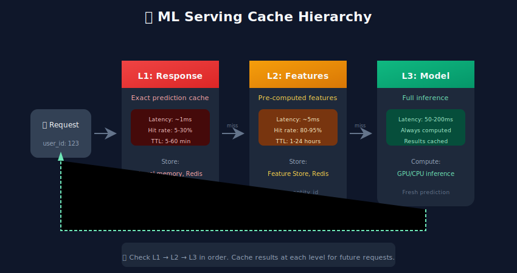
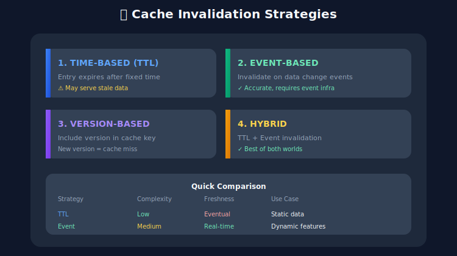

# 💾 Caching Strategies

## Table of Contents
- [Overview](#overview)
- [Cache Types](#cache-types)
- [Response Caching](#response-caching)
- [Feature Caching](#feature-caching)
- [Embedding Caching](#embedding-caching)
- [Cache Invalidation](#cache-invalidation)
- [Distributed Caching](#distributed-caching)
- [Cache Performance](#cache-performance)
- [Best Practices](#best-practices)

---

## Overview

Caching reduces latency and compute costs by storing and reusing frequently accessed data or computed results.



---

## Cache Types

### Comparison

| Cache Type | What's Cached | TTL | Use Case |
|-----------|--------------|-----|----------|
| **Response** | Full predictions | Minutes-Hours | Repeated identical requests |
| **Feature** | Computed features | Seconds-Minutes | Real-time feature serving |
| **Embedding** | Vector embeddings | Hours-Days | Similarity search, recommendations |
| **Model** | Loaded models | Until update | Avoid reload overhead |

---

## Response Caching

### Implementation

```python

# response_cache.py
import redis
import hashlib
import json
from fastapi import FastAPI, Request
from functools import wraps
import time

app = FastAPI()
cache = redis.Redis(host="localhost", port=6379, decode_responses=True)

def cache_response(ttl_seconds: int = 300):
    """Decorator for caching prediction responses"""
    def decorator(func):
        @wraps(func)
        async def wrapper(*args, **kwargs):

            # Generate cache key from request
            request = kwargs.get("request")
            cache_key = generate_cache_key(request)

            # Check cache
            cached = cache.get(cache_key)
            if cached:
                return json.loads(cached)

            # Compute result
            result = await func(*args, **kwargs)

            # Store in cache
            cache.setex(cache_key, ttl_seconds, json.dumps(result))

            return result
        return wrapper
    return decorator

def generate_cache_key(request: dict) -> str:
    """Generate deterministic cache key from request"""

    # Normalize and hash request
    normalized = json.dumps(request, sort_keys=True)
    return f"pred:{hashlib.md5(normalized.encode()).hexdigest()}"

@app.post("/predict")
@cache_response(ttl_seconds=300)
async def predict(request: PredictionRequest):

    # This only runs on cache miss
    result = model.predict(request.features)
    return {"prediction": result}
```

### Semantic Caching

```python

# semantic_cache.py
import numpy as np
from redis import Redis
from redis.commands.search.field import VectorField, TextField
from redis.commands.search.query import Query

class SemanticCache:
    """Cache based on semantic similarity of inputs"""

    def __init__(self, redis_client: Redis, similarity_threshold: float = 0.95):
        self.redis = redis_client
        self.threshold = similarity_threshold
        self.index_name = "semantic_cache"

    def get(self, query_embedding: np.ndarray) -> dict | None:
        """Find similar cached result"""
        query = (
            Query(f"*=>[KNN 1 @embedding $vec AS score]")
            .return_fields("result", "score")
            .dialect(2)
        )

        params = {"vec": query_embedding.tobytes()}
        results = self.redis.ft(self.index_name).search(query, query_params=params)

        if results.docs:
            score = float(results.docs[0].score)
            if score >= self.threshold:
                return json.loads(results.docs[0].result)

        return None

    def set(self, embedding: np.ndarray, result: dict, ttl: int = 3600):
        """Store result with embedding"""
        key = f"cache:{uuid.uuid4()}"
        self.redis.hset(key, mapping={
            "embedding": embedding.tobytes(),
            "result": json.dumps(result)
        })
        self.redis.expire(key, ttl)
```

---

## Feature Caching

### Feature Store with Caching

```python

# feature_cache.py
import redis
from typing import Dict, List, Optional
import json
import time

class FeatureCache:
    def __init__(
        self,
        redis_client: redis.Redis,
        default_ttl: int = 300,
        batch_size: int = 100
    ):
        self.redis = redis_client
        self.default_ttl = default_ttl
        self.batch_size = batch_size

    def get_features(self, entity_id: str, feature_names: List[str]) -> Dict:
        """Get features for entity with caching"""
        cache_key = f"features:{entity_id}"

        # Try cache first
        cached = self.redis.hgetall(cache_key)
        if cached:
            return {k: float(v) for k, v in cached.items() if k in feature_names}

        return None

    def set_features(self, entity_id: str, features: Dict, ttl: Optional[int] = None):
        """Cache features for entity"""
        cache_key = f"features:{entity_id}"
        ttl = ttl or self.default_ttl

        pipeline = self.redis.pipeline()
        pipeline.hset(cache_key, mapping={k: str(v) for k, v in features.items()})
        pipeline.expire(cache_key, ttl)
        pipeline.execute()

    def get_batch_features(
        self,
        entity_ids: List[str],
        feature_names: List[str]
    ) -> Dict[str, Dict]:
        """Batch feature retrieval"""
        results = {}
        missing = []

        # Batch get from cache
        pipeline = self.redis.pipeline()
        for entity_id in entity_ids:
            pipeline.hgetall(f"features:{entity_id}")

        cached_results = pipeline.execute()

        for entity_id, cached in zip(entity_ids, cached_results):
            if cached:
                results[entity_id] = {
                    k: float(v) for k, v in cached.items()
                    if k in feature_names
                }
            else:
                missing.append(entity_id)

        return results, missing

# Usage with fallback to feature store
class CachedFeatureService:
    def __init__(self, cache: FeatureCache, feature_store):
        self.cache = cache
        self.store = feature_store

    async def get_features(self, entity_id: str, features: List[str]) -> Dict:

        # Try cache
        cached = self.cache.get_features(entity_id, features)
        if cached:
            return cached

        # Fallback to feature store
        result = await self.store.get_online_features(entity_id, features)

        # Populate cache
        self.cache.set_features(entity_id, result)

        return result
```

---

## Embedding Caching

### Vector Embedding Cache

```python

# embedding_cache.py
import numpy as np
import redis
from typing import List, Optional, Tuple
import struct

class EmbeddingCache:
    """Cache for vector embeddings with efficient storage"""

    def __init__(
        self,
        redis_client: redis.Redis,
        embedding_dim: int,
        ttl_hours: int = 24
    ):
        self.redis = redis_client
        self.dim = embedding_dim
        self.ttl = ttl_hours * 3600

    def _serialize(self, embedding: np.ndarray) -> bytes:
        """Serialize embedding to bytes"""
        return embedding.astype(np.float32).tobytes()

    def _deserialize(self, data: bytes) -> np.ndarray:
        """Deserialize bytes to embedding"""
        return np.frombuffer(data, dtype=np.float32)

    def get(self, item_id: str) -> Optional[np.ndarray]:
        """Get embedding from cache"""
        data = self.redis.get(f"emb:{item_id}")
        if data:
            return self._deserialize(data)
        return None

    def set(self, item_id: str, embedding: np.ndarray):
        """Cache embedding"""
        self.redis.setex(
            f"emb:{item_id}",
            self.ttl,
            self._serialize(embedding)
        )

    def get_batch(self, item_ids: List[str]) -> Tuple[Dict, List[str]]:
        """Batch get embeddings"""
        keys = [f"emb:{id}" for id in item_ids]
        values = self.redis.mget(keys)

        results = {}
        missing = []

        for item_id, value in zip(item_ids, values):
            if value:
                results[item_id] = self._deserialize(value)
            else:
                missing.append(item_id)

        return results, missing

    def set_batch(self, embeddings: Dict[str, np.ndarray]):
        """Batch set embeddings"""
        pipeline = self.redis.pipeline()
        for item_id, embedding in embeddings.items():
            pipeline.setex(
                f"emb:{item_id}",
                self.ttl,
                self._serialize(embedding)
            )
        pipeline.execute()

# Usage in recommendation system
class CachedEmbeddingService:
    def __init__(self, cache: EmbeddingCache, embedding_model):
        self.cache = cache
        self.model = embedding_model

    async def get_embeddings(self, item_ids: List[str]) -> Dict[str, np.ndarray]:

        # Check cache
        cached, missing = self.cache.get_batch(item_ids)

        if missing:

            # Compute missing embeddings
            computed = await self.model.encode_batch(missing)

            # Cache them
            self.cache.set_batch(computed)

            cached.update(computed)

        return cached
```

---

## Cache Invalidation

### Invalidation Strategies



### Event-Based Invalidation

```python

# cache_invalidation.py
import redis
from typing import List
import json

class CacheInvalidator:
    def __init__(self, redis_client: redis.Redis):
        self.redis = redis_client
        self.pubsub = redis_client.pubsub()

    def invalidate_by_pattern(self, pattern: str):
        """Invalidate all keys matching pattern"""
        cursor = 0
        while True:
            cursor, keys = self.redis.scan(cursor, match=pattern, count=1000)
            if keys:
                self.redis.delete(*keys)
            if cursor == 0:
                break

    def invalidate_entity(self, entity_type: str, entity_id: str):
        """Invalidate all cache entries for entity"""
        patterns = [
            f"features:{entity_id}",
            f"emb:{entity_id}",
            f"pred:*{entity_id}*"
        ]
        for pattern in patterns:
            self.invalidate_by_pattern(pattern)

    def publish_invalidation(self, entity_type: str, entity_id: str):
        """Publish invalidation event"""
        event = json.dumps({
            "type": "invalidate",
            "entity_type": entity_type,
            "entity_id": entity_id
        })
        self.redis.publish("cache_invalidation", event)

    def subscribe_invalidations(self, handler):
        """Subscribe to invalidation events"""
        self.pubsub.subscribe("cache_invalidation")

        for message in self.pubsub.listen():
            if message["type"] == "message":
                event = json.loads(message["data"])
                handler(event)

# Model version-based invalidation
class VersionedCache:
    def __init__(self, redis_client: redis.Redis, model_version: str):
        self.redis = redis_client
        self.version = model_version

    def _key(self, base_key: str) -> str:
        """Include version in cache key"""
        return f"v{self.version}:{base_key}"

    def get(self, key: str):
        return self.redis.get(self._key(key))

    def set(self, key: str, value, ttl: int = 300):
        self.redis.setex(self._key(key), ttl, value)
```

---

## Distributed Caching

### Redis Cluster Setup

```python

# distributed_cache.py
from redis.cluster import RedisCluster
from typing import List, Dict
import json

class DistributedMLCache:
    def __init__(self, startup_nodes: List[Dict]):
        self.cluster = RedisCluster(
            startup_nodes=startup_nodes,
            decode_responses=True,
            skip_full_coverage_check=True
        )

    def get_with_fallback(self, keys: List[str], fallback_fn):
        """Get from cache with fallback for misses"""
        pipeline = self.cluster.pipeline()
        for key in keys:
            pipeline.get(key)

        results = pipeline.execute()

        cached = {}
        missing_keys = []

        for key, result in zip(keys, results):
            if result:
                cached[key] = json.loads(result)
            else:
                missing_keys.append(key)

        # Fetch missing
        if missing_keys:
            fetched = fallback_fn(missing_keys)

            # Cache fetched results
            pipeline = self.cluster.pipeline()
            for key, value in fetched.items():
                pipeline.setex(key, 300, json.dumps(value))
            pipeline.execute()

            cached.update(fetched)

        return cached

# Configuration
nodes = [
    {"host": "redis-1", "port": 6379},
    {"host": "redis-2", "port": 6379},
    {"host": "redis-3", "port": 6379}
]
cache = DistributedMLCache(nodes)
```

---

## Cache Performance

### Metrics to Track

```python

# cache_metrics.py
from prometheus_client import Counter, Histogram, Gauge

CACHE_HITS = Counter(
    'cache_hits_total',
    'Total cache hits',
    ['cache_type']
)

CACHE_MISSES = Counter(
    'cache_misses_total',
    'Total cache misses',
    ['cache_type']
)

CACHE_LATENCY = Histogram(
    'cache_latency_seconds',
    'Cache operation latency',
    ['cache_type', 'operation'],
    buckets=[0.0001, 0.0005, 0.001, 0.005, 0.01, 0.05]
)

CACHE_SIZE = Gauge(
    'cache_size_bytes',
    'Current cache size',
    ['cache_type']
)

# Calculate hit rate
# hit_rate = cache_hits_total / (cache_hits_total + cache_misses_total)
```

### Performance Guidelines

| Metric | Target | Action if Missed |
|--------|--------|-----------------|
| Hit Rate | > 80% | Increase TTL, check key design |
| Latency P99 | < 5ms | Check network, use local cache |
| Memory Usage | < 80% | Eviction policy, reduce TTL |

---

## Best Practices

### Caching Checklist

- ✅ Cache at multiple levels (response, feature, embedding)
- ✅ Use appropriate TTLs for each cache type
- ✅ Implement cache warming on deployment
- ✅ Monitor hit rates and latencies
- ✅ Handle cache failures gracefully
- ✅ Use consistent hashing for distribution
- ✅ Implement proper invalidation strategy

### What NOT to Cache

| Data Type | Reason |
|-----------|--------|
| Highly dynamic features | Stale data hurts accuracy |
| User-specific sensitive data | Privacy concerns |
| Random/exploration results | Defeats purpose |
| Very rare requests | Low hit rate, wastes memory |

---

## Next Steps

→ **[09. Feature Stores](../09_feature_stores/)**: Learn online/offline feature serving

---

*Cache smart: high-impact, stable data with appropriate TTLs!*

---

<div align="center">

**[⬆ Back to Top](#)** | **[📚 Main Repository](https://github.com/Gaurav14cs17/ml_system_design)**

Made with 💜 by [Gaurav14cs17](https://github.com/Gaurav14cs17)

</div>
