# 🗄️ Feature Stores

<p align="center">
  
</p>

## Table of Contents
- [Overview](#overview)
- [Why Feature Stores](#why-feature-stores)
- [Online vs Offline Stores](#online-vs-offline-stores)
- [Feast Implementation](#feast-implementation)
- [Feature Engineering Pipelines](#feature-engineering-pipelines)
- [Feature Registry](#feature-registry)
- [Best Practices](#best-practices)

---

## Overview

Feature stores provide a centralized system for storing, managing, and serving features for machine learning, ensuring consistency between training and serving.

```mermaid
flowchart TB
    subgraph Sources["📊 DATA SOURCES"]
        DB[(Database)]
        Kafka{{Kafka}}
        S3[(S3)]
        API[APIs]
    end

    subgraph FeatureStore["🗄️ FEATURE STORE"]
        subgraph Registry["📋 Feature Registry"]
            Meta[Metadata]
            Lineage[Lineage]
            Version[Versioning]
        end

        subgraph Stores["💾 Storage"]
            Offline[(Offline Store<br/>Data Lake)]
            Online[(Online Store<br/>Redis)]
        end
    end

    subgraph Consumers["👥 CONSUMERS"]
        Training[🔬 Training Pipeline]
        Serving[🚀 Serving Endpoint]
    end

    Sources --> FeatureStore
    Offline --> Training
    Online --> Serving

    style Sources fill:#e3f2fd
    style FeatureStore fill:#fff3e0
    style Registry fill:#e8f5e9
    style Stores fill:#f3e5f5
    style Consumers fill:#c8e6c9
```




---

## Why Feature Stores

### The Training-Serving Skew Problem


### Key Benefits

| Benefit | Description |
|---------|-------------|
| **Consistency** | Same features for training and serving |
| **Reusability** | Share features across teams and models |
| **Discovery** | Find existing features, avoid duplication |
| **Point-in-time** | Avoid data leakage in training |
| **Low latency** | Optimized online serving |

---

## Online vs Offline Stores

### Comparison


---

## Feast Implementation

### Project Setup

```python
# feature_repo/feature_store.yaml
project: ml_recommendation
registry: gs://my-bucket/registry.db
provider: gcp
online_store:
  type: redis
  connection_string: redis://localhost:6379
offline_store:
  type: bigquery
entity_key_serialization_version: 2
```

### Entity and Feature Definitions

```python
# feature_repo/features.py
from feast import Entity, Feature, FeatureView, FileSource, ValueType
from feast.types import Float32, Int64, String
from datetime import timedelta

# Define entities
user = Entity(
    name="user_id",
    value_type=ValueType.INT64,
    description="Unique user identifier"
)

item = Entity(
    name="item_id",
    value_type=ValueType.INT64,
    description="Unique item identifier"
)

# Define data sources
user_features_source = FileSource(
    path="gs://data/user_features.parquet",
    timestamp_field="event_timestamp",
    created_timestamp_column="created_timestamp"
)

item_features_source = FileSource(
    path="gs://data/item_features.parquet",
    timestamp_field="event_timestamp"
)

# Define feature views
user_features = FeatureView(
    name="user_features",
    entities=[user],
    ttl=timedelta(days=1),
    schema=[
        Feature(name="age", dtype=Int64),
        Feature(name="gender", dtype=String),
        Feature(name="purchase_count_7d", dtype=Int64),
        Feature(name="purchase_count_30d", dtype=Int64),
        Feature(name="avg_order_value", dtype=Float32),
        Feature(name="user_embedding", dtype=Float32),  # 128-dim vector
    ],
    online=True,
    source=user_features_source,
    tags={"team": "recommendation", "owner": "ml-team"}
)

item_features = FeatureView(
    name="item_features",
    entities=[item],
    ttl=timedelta(hours=1),
    schema=[
        Feature(name="category", dtype=String),
        Feature(name="price", dtype=Float32),
        Feature(name="popularity_score", dtype=Float32),
        Feature(name="item_embedding", dtype=Float32),
    ],
    online=True,
    source=item_features_source,
    tags={"team": "recommendation"}
)
```

### Training Data Retrieval

```python
# training_pipeline.py
from feast import FeatureStore
import pandas as pd

store = FeatureStore(repo_path="feature_repo/")

# Training labels with timestamps
entity_df = pd.DataFrame({
    "user_id": [1, 2, 3, 4, 5],
    "item_id": [101, 102, 103, 104, 105],
    "event_timestamp": pd.to_datetime([
        "2024-01-01", "2024-01-02", "2024-01-03",
        "2024-01-04", "2024-01-05"
    ]),
    "label": [1, 0, 1, 1, 0]
})

# Get historical features (point-in-time correct)
training_df = store.get_historical_features(
    entity_df=entity_df,
    features=[
        "user_features:age",
        "user_features:purchase_count_7d",
        "user_features:avg_order_value",
        "item_features:category",
        "item_features:price",
        "item_features:popularity_score"
    ]
).to_df()

print(training_df.head())
```

### Online Serving

```python
# serving_endpoint.py
from feast import FeatureStore
from fastapi import FastAPI

app = FastAPI()
store = FeatureStore(repo_path="feature_repo/")

@app.post("/predict")
async def predict(user_id: int, item_id: int):
    # Get online features
    features = store.get_online_features(
        features=[
            "user_features:age",
            "user_features:purchase_count_7d",
            "user_features:avg_order_value",
            "item_features:category",
            "item_features:price",
            "item_features:popularity_score"
        ],
        entity_rows=[{"user_id": user_id, "item_id": item_id}]
    ).to_dict()

    # Format for model
    feature_vector = [
        features["age"][0],
        features["purchase_count_7d"][0],
        features["avg_order_value"][0],
        features["price"][0],
        features["popularity_score"][0]
    ]

    # Run inference
    prediction = model.predict([feature_vector])

    return {"prediction": prediction[0]}

# Materialize features to online store
# feast materialize-incremental $(date +%Y-%m-%dT%H:%M:%S)
```

---

## Feature Engineering Pipelines

### Streaming Features

```python
# streaming_features.py
from pyspark.sql import SparkSession
from pyspark.sql.functions import window, avg, count, col
from pyspark.sql.types import StructType, StructField, StringType, FloatType

spark = SparkSession.builder \
    .appName("StreamingFeatures") \
    .getOrCreate()

# Read from Kafka
events = spark.readStream \
    .format("kafka") \
    .option("kafka.bootstrap.servers", "kafka:9092") \
    .option("subscribe", "user_events") \
    .load()

# Parse events
schema = StructType([
    StructField("user_id", StringType()),
    StructField("event_type", StringType()),
    StructField("amount", FloatType()),
    StructField("timestamp", StringType())
])

parsed = events.select(
    from_json(col("value").cast("string"), schema).alias("data")
).select("data.*")

# Compute windowed features
windowed_features = parsed \
    .withWatermark("timestamp", "10 minutes") \
    .groupBy(
        col("user_id"),
        window(col("timestamp"), "1 hour", "10 minutes")
    ) \
    .agg(
        count("*").alias("event_count_1h"),
        avg("amount").alias("avg_amount_1h")
    )

# Write to feature store (Redis)
def write_to_redis(batch_df, batch_id):
    for row in batch_df.collect():
        redis_client.hset(
            f"user_features:{row.user_id}",
            mapping={
                "event_count_1h": row.event_count_1h,
                "avg_amount_1h": row.avg_amount_1h
            }
        )

windowed_features.writeStream \
    .foreachBatch(write_to_redis) \
    .outputMode("update") \
    .start()
```

### Batch Feature Pipeline

```python
# batch_features.py
from datetime import datetime, timedelta
import pandas as pd

def compute_user_features(date: datetime) -> pd.DataFrame:
    """Compute user features for a given date"""

    # 7-day purchase count
    purchases_7d = spark.sql(f"""
        SELECT
            user_id,
            COUNT(*) as purchase_count_7d,
            AVG(amount) as avg_order_value
        FROM purchases
        WHERE date BETWEEN '{date - timedelta(days=7)}' AND '{date}'
        GROUP BY user_id
    """).toPandas()

    # 30-day purchase count
    purchases_30d = spark.sql(f"""
        SELECT
            user_id,
            COUNT(*) as purchase_count_30d
        FROM purchases
        WHERE date BETWEEN '{date - timedelta(days=30)}' AND '{date}'
        GROUP BY user_id
    """).toPandas()

    # Merge features
    features = purchases_7d.merge(purchases_30d, on="user_id", how="outer")
    features["event_timestamp"] = date

    return features

# Backfill historical features
for date in pd.date_range(start="2023-01-01", end="2024-01-01"):
    features = compute_user_features(date)
    features.to_parquet(f"gs://data/user_features/date={date.date()}/data.parquet")
```

---

## Feature Registry

### Feature Discovery

```python
# feature_registry.py
from feast import FeatureStore

store = FeatureStore(repo_path="feature_repo/")

# List all feature views
for fv in store.list_feature_views():
    print(f"\nFeature View: {fv.name}")
    print(f"  Entities: {[e.name for e in fv.entities]}")
    print(f"  Features: {[f.name for f in fv.features]}")
    print(f"  Tags: {fv.tags}")
    print(f"  TTL: {fv.ttl}")

# Search for features by tag
recommendation_features = [
    fv for fv in store.list_feature_views()
    if fv.tags.get("team") == "recommendation"
]

# Get feature statistics
from feast.infra.offline_stores.offline_utils import get_offline_store

offline_store = get_offline_store(store.config)
stats = offline_store.get_statistics(
    feature_view="user_features",
    features=["purchase_count_7d", "avg_order_value"]
)
```

---

## Best Practices

### Feature Store Checklist

- ✅ Define clear entity keys
- ✅ Set appropriate TTLs
- ✅ Use point-in-time joins for training
- ✅ Monitor feature freshness
- ✅ Version feature definitions
- ✅ Document feature semantics
- ✅ Test feature pipelines

### Common Pitfalls

| Pitfall | Problem | Solution |
|---------|---------|----------|
| No timestamps | Data leakage | Always include event_timestamp |
| Wrong TTL | Stale/missing features | Match TTL to business logic |
| No monitoring | Silent failures | Alert on freshness, nulls |
| Duplicate features | Inconsistency | Central registry, discovery |

---

## Next Steps

→ **[10. Edge Deployment](../10_edge_deployment/)**: Learn mobile and IoT model serving

---

*Feature stores: one source of truth for features across training and serving!*

---

<div align="center">

**[⬆ Back to Top](#)** | **[📚 Main Repository](https://github.com/Gaurav14cs17/ml_system_design)**

Made with 💜 by [Gaurav14cs17](https://github.com/Gaurav14cs17)

</div>
