# 📱 Edge Deployment

<p align="center">
  
</p>

## Table of Contents
- [Overview](#overview)
- [Edge vs Cloud Trade-offs](#edge-vs-cloud-trade-offs)
- [Model Optimization for Edge](#model-optimization-for-edge)
- [Mobile Deployment](#mobile-deployment)
- [Browser-Based Inference](#browser-based-inference)
- [IoT and Embedded Systems](#iot-and-embedded-systems)
- [Federated Learning](#federated-learning)
- [Best Practices](#best-practices)

---

## Overview

Edge deployment runs ML models directly on end-user devices (phones, browsers, IoT) rather than cloud servers, enabling offline operation and reduced latency.

```mermaid
mindmap
  root((Edge<br/>Deployment))
    Devices
      📱 Mobile
      💻 Browser
      🎮 IoT/Embedded
      🚗 Automotive
      📷 Camera/Vision
    Frameworks
      TensorFlow Lite
      Core ML
      ONNX Runtime
      TensorFlow.js
      PyTorch Mobile
    Benefits
      ⚡ Low Latency
      📴 Offline
      🔒 Privacy
      💰 No Network Cost
    Challenges
      💻 Limited Compute
      📦 Size Constraints
      🔋 Battery Limits

```

```mermaid
flowchart LR
    subgraph Cloud["☁️ CLOUD"]
        CS[Cloud Server]
        CL["100ms+ latency"]
        CN["Needs network"]
    end

    subgraph Edge["📱 EDGE"]
        ED[Edge Device]
        EL["~10ms latency"]
        EO["Works offline"]
    end

    User[👤 User] --> Cloud
    User --> Edge

    style Cloud fill:#e3f2fd
    style Edge fill:#c8e6c9

```






---

## Edge vs Cloud Trade-offs

### Decision Matrix

| Factor | Edge | Cloud | Winner |
|--------|------|-------|--------|
| **Latency** | ~10ms | ~100ms+ | Edge |
| **Offline** | ✅ Yes | ❌ No | Edge |
| **Privacy** | ✅ Data stays local | ❌ Data sent | Edge |
| **Model size** | Limited (~100MB) | Unlimited | Cloud |
| **Compute power** | Limited | Unlimited | Cloud |
| **Model updates** | Complex | Easy | Cloud |
| **Cost at scale** | Free per inference | Pay per request | Edge |

### When to Use Edge


---

## Model Optimization for Edge

### Optimization Techniques


### TensorFlow Lite Conversion

```python
# tflite_conversion.py
import tensorflow as tf

# Load model
model = tf.keras.models.load_model("model.h5")

# Basic conversion
converter = tf.lite.TFLiteConverter.from_keras_model(model)
tflite_model = converter.convert()

# With quantization
converter = tf.lite.TFLiteConverter.from_keras_model(model)
converter.optimizations = [tf.lite.Optimize.DEFAULT]

# INT8 quantization with representative dataset
def representative_dataset():
    for _ in range(100):
        yield [np.random.randn(1, 224, 224, 3).astype(np.float32)]

converter.representative_dataset = representative_dataset
converter.target_spec.supported_ops = [tf.lite.OpsSet.TFLITE_BUILTINS_INT8]
converter.inference_input_type = tf.int8
converter.inference_output_type = tf.int8

quantized_model = converter.convert()

# Save
with open("model_quantized.tflite", "wb") as f:
    f.write(quantized_model)

print(f"Original size: {len(tflite_model) / 1024 / 1024:.2f} MB")
print(f"Quantized size: {len(quantized_model) / 1024 / 1024:.2f} MB")

```

---

## Mobile Deployment

### Android with TensorFlow Lite

```kotlin
// AndroidInference.kt
import org.tensorflow.lite.Interpreter
import java.nio.ByteBuffer

class ImageClassifier(context: Context) {
    private var interpreter: Interpreter

    init {
        val model = loadModelFile(context, "model.tflite")
        val options = Interpreter.Options()
            .setNumThreads(4)
            .setUseNNAPI(true)  // Hardware acceleration
        interpreter = Interpreter(model, options)
    }

    fun classify(bitmap: Bitmap): List<Pair<String, Float>> {
        // Preprocess image
        val input = preprocessImage(bitmap)

        // Output buffer
        val output = Array(1) { FloatArray(NUM_CLASSES) }

        // Run inference
        interpreter.run(input, output)

        // Get top predictions
        return output[0]
            .mapIndexed { idx, prob -> labels[idx] to prob }
            .sortedByDescending { it.second }
            .take(5)
    }

    private fun preprocessImage(bitmap: Bitmap): ByteBuffer {
        val buffer = ByteBuffer.allocateDirect(1 * 224 * 224 * 3 * 4)
        buffer.order(ByteOrder.nativeOrder())

        val pixels = IntArray(224 * 224)
        bitmap.getPixels(pixels, 0, 224, 0, 0, 224, 224)

        for (pixel in pixels) {
            buffer.putFloat(((pixel shr 16) and 0xFF) / 255f)  // R
            buffer.putFloat(((pixel shr 8) and 0xFF) / 255f)   // G
            buffer.putFloat((pixel and 0xFF) / 255f)           // B
        }

        return buffer
    }
}

```

### iOS with Core ML

```swift
// iOSInference.swift
import CoreML
import Vision

class ImageClassifier {
    private let model: VNCoreMLModel

    init() throws {
        let config = MLModelConfiguration()
        config.computeUnits = .all  // Use GPU/Neural Engine

        let coreMLModel = try MyModel(configuration: config)
        model = try VNCoreMLModel(for: coreMLModel.model)
    }

    func classify(image: CGImage, completion: @escaping ([Classification]) -> Void) {
        let request = VNCoreMLRequest(model: model) { request, error in
            guard let results = request.results as? [VNClassificationObservation] else {
                return
            }

            let classifications = results.prefix(5).map { observation in
                Classification(
                    label: observation.identifier,
                    confidence: observation.confidence
                )
            }

            completion(classifications)
        }

        let handler = VNImageRequestHandler(cgImage: image)
        try? handler.perform([request])
    }
}

struct Classification {
    let label: String
    let confidence: Float
}

```

---

## Browser-Based Inference

### TensorFlow.js

```javascript
// browser_inference.js
import * as tf from '@tensorflow/tfjs';

class ImageClassifier {
    constructor() {
        this.model = null;
    }

    async loadModel() {
        // Load from URL
        this.model = await tf.loadLayersModel('/models/model.json');

        // Warm up
        const warmupResult = this.model.predict(
            tf.zeros([1, 224, 224, 3])
        );
        warmupResult.dispose();

        console.log('Model loaded and warmed up');
    }

    async classify(imageElement) {
        // Preprocess image
        const tensor = tf.browser.fromPixels(imageElement)
            .resizeBilinear([224, 224])
            .expandDims(0)
            .div(255.0);

        // Run inference
        const predictions = this.model.predict(tensor);
        const probabilities = await predictions.data();

        // Clean up tensors
        tensor.dispose();
        predictions.dispose();

        // Get top predictions
        const topK = this.getTopK(probabilities, 5);
        return topK;
    }

    getTopK(probabilities, k) {
        const indexed = Array.from(probabilities)
            .map((prob, idx) => ({ probability: prob, classIndex: idx }));

        return indexed
            .sort((a, b) => b.probability - a.probability)
            .slice(0, k);
    }
}

// Usage
const classifier = new ImageClassifier();
await classifier.loadModel();

const image = document.getElementById('input-image');
const results = await classifier.classify(image);
console.log('Top predictions:', results);

```

### WebGL/WebGPU Acceleration

```javascript
// webgpu_inference.js
import * as tf from '@tensorflow/tfjs';
import '@tensorflow/tfjs-backend-webgpu';

async function setupWebGPU() {
    // Check WebGPU support
    if (!navigator.gpu) {
        console.log('WebGPU not supported, falling back to WebGL');
        await tf.setBackend('webgl');
    } else {
        await tf.setBackend('webgpu');
    }

    await tf.ready();
    console.log('Using backend:', tf.getBackend());
}

// Benchmark inference
async function benchmark(model, input, iterations = 100) {
    // Warm up
    for (let i = 0; i < 10; i++) {
        const result = model.predict(input);
        result.dispose();
    }

    // Timed runs
    const start = performance.now();
    for (let i = 0; i < iterations; i++) {
        const result = model.predict(input);
        await result.data();  // Force sync
        result.dispose();
    }
    const elapsed = performance.now() - start;

    console.log(`Average inference: ${elapsed / iterations}ms`);
}

```

---

## IoT and Embedded Systems

### Raspberry Pi Deployment

```python
# raspberry_pi_inference.py
import tflite_runtime.interpreter as tflite
import numpy as np
from picamera2 import Picamera2
import cv2

class EdgeInference:
    def __init__(self, model_path: str):
        # Load model with Edge TPU if available
        try:
            self.interpreter = tflite.Interpreter(
                model_path=model_path,
                experimental_delegates=[
                    tflite.load_delegate('libedgetpu.so.1')
                ]
            )
            print("Using Edge TPU")
        except:
            self.interpreter = tflite.Interpreter(model_path=model_path)
            print("Using CPU")

        self.interpreter.allocate_tensors()
        self.input_details = self.interpreter.get_input_details()
        self.output_details = self.interpreter.get_output_details()

    def preprocess(self, frame):
        # Resize and normalize
        img = cv2.resize(frame, (224, 224))
        img = img.astype(np.float32) / 255.0
        return np.expand_dims(img, axis=0)

    def predict(self, frame):
        input_data = self.preprocess(frame)
        self.interpreter.set_tensor(
            self.input_details[0]['index'],
            input_data
        )
        self.interpreter.invoke()
        output = self.interpreter.get_tensor(
            self.output_details[0]['index']
        )
        return output[0]

# Real-time camera inference
def main():
    model = EdgeInference("model_edgetpu.tflite")
    camera = Picamera2()
    camera.start()

    while True:
        frame = camera.capture_array()
        predictions = model.predict(frame)

        # Display results
        top_class = np.argmax(predictions)
        confidence = predictions[top_class]
        print(f"Class: {top_class}, Confidence: {confidence:.2f}")

if __name__ == "__main__":
    main()

```

---

## Federated Learning

### Concept


### TensorFlow Federated Example

```python
# federated_learning.py
import tensorflow_federated as tff

# Define model
def create_keras_model():
    return tf.keras.Sequential([
        tf.keras.layers.Dense(10, activation='relu'),
        tf.keras.layers.Dense(10, activation='softmax')
    ])

def model_fn():
    keras_model = create_keras_model()
    return tff.learning.from_keras_model(
        keras_model,
        input_spec=preprocessed_example_dataset.element_spec,
        loss=tf.keras.losses.SparseCategoricalCrossentropy(),
        metrics=[tf.keras.metrics.SparseCategoricalAccuracy()]
    )

# Create federated averaging process
iterative_process = tff.learning.algorithms.build_weighted_fed_avg(
    model_fn,
    client_optimizer_fn=lambda: tf.keras.optimizers.SGD(0.02),
    server_optimizer_fn=lambda: tf.keras.optimizers.SGD(1.0)
)

# Initialize
state = iterative_process.initialize()

# Training rounds
for round_num in range(10):
    # Sample clients
    sampled_clients = sample_clients(federated_train_data, num_clients=10)

    # Federated training round
    state, metrics = iterative_process.next(state, sampled_clients)

    print(f'Round {round_num}: {metrics}')

```

---

## Best Practices

### Edge Deployment Checklist

- ✅ Profile model on target device
- ✅ Optimize model size (quantization, pruning)
- ✅ Test accuracy after optimization
- ✅ Implement graceful fallbacks
- ✅ Handle model updates securely
- ✅ Monitor on-device performance
- ✅ Battery/power consumption testing

### Model Size Guidelines

| Device Type | Max Model Size | Target Latency |
|------------|----------------|----------------|
| High-end phone | 100MB | <50ms |
| Mid-range phone | 30MB | <100ms |
| Browser | 10MB | <100ms |
| IoT/Embedded | 5MB | <200ms |
| Microcontroller | 500KB | <1s |

---

## Next Steps

→ **[11. Serverless Serving](../11_serverless_serving/)**: Learn AWS Lambda and Cloud Functions

---

*Edge deployment: bring intelligence to the device, not data to the cloud!*

---

<div align="center">

**[⬆ Back to Top](#)** | **[📚 Main Repository](https://github.com/Gaurav14cs17/ml_system_design)**

Made with 💜 by [Gaurav14cs17](https://github.com/Gaurav14cs17)

</div>
