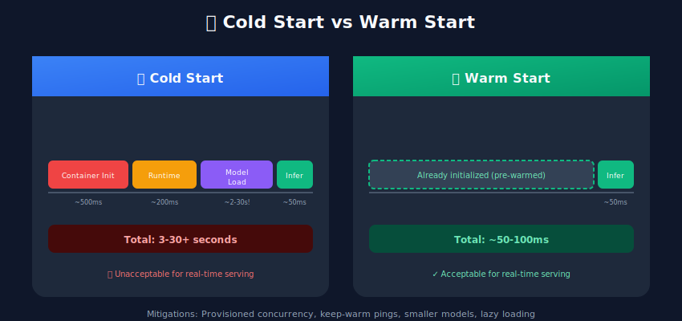
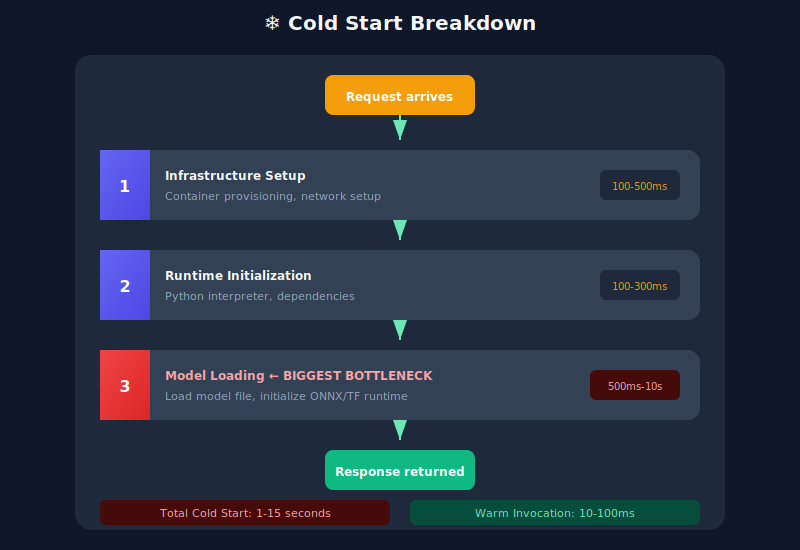
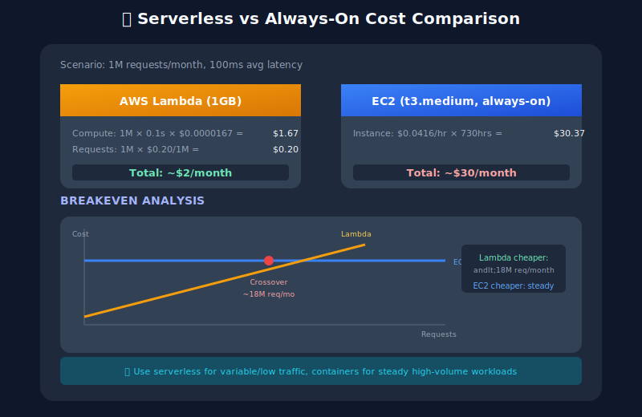

# ☁️ Serverless Model Serving

## Table of Contents
- [Overview](#overview)
- [Serverless Platforms](#serverless-platforms)
- [AWS Lambda](#aws-lambda)
- [Google Cloud Functions](#google-cloud-functions)
- [Cold Start Optimization](#cold-start-optimization)
- [Container-Based Serverless](#container-based-serverless)
- [Cost Analysis](#cost-analysis)
- [Best Practices](#best-practices)

---

## Overview

Serverless computing runs code without managing servers, automatically scaling from zero to thousands of instances based on demand.



---

## Serverless Platforms

### Platform Comparison

| Platform | Max Memory | Timeout | Cold Start | GPU |
|----------|-----------|---------|------------|-----|
| AWS Lambda | 10GB | 15min | 100ms-10s | ❌ |
| GCP Cloud Functions | 16GB | 60min | 100ms-5s | ❌ |
| Azure Functions | 14GB | Unlimited | 100ms-10s | ❌ |
| AWS Lambda Container | 10GB | 15min | 1-30s | ❌ |
| GCP Cloud Run | 32GB | 60min | 0-5s | ✅ |
| AWS Fargate | 120GB | Unlimited | 30-60s | ❌ |

---

## AWS Lambda

### Lambda Function with Model

```python

# lambda_handler.py
import json
import boto3
import numpy as np
import onnxruntime as ort
import os

# Load model at module level (cold start only)
MODEL_PATH = "/opt/ml/model.onnx"
session = None

def load_model():
    global session
    if session is None:
        session_options = ort.SessionOptions()
        session_options.graph_optimization_level = ort.GraphOptimizationLevel.ORT_ENABLE_ALL
        session_options.intra_op_num_threads = 2
        session = ort.InferenceSession(MODEL_PATH, session_options)
    return session

def lambda_handler(event, context):
    """AWS Lambda handler for ML inference"""
    try:

        # Parse input
        body = json.loads(event.get('body', '{}'))
        features = np.array(body['features'], dtype=np.float32)
        features = features.reshape(1, -1)

        # Load model (cached after cold start)
        model = load_model()

        # Run inference
        input_name = model.get_inputs()[0].name
        output_name = model.get_outputs()[0].name
        result = model.run([output_name], {input_name: features})

        prediction = result[0].tolist()

        return {
            'statusCode': 200,
            'headers': {'Content-Type': 'application/json'},
            'body': json.dumps({
                'prediction': prediction,
                'model_version': os.environ.get('MODEL_VERSION', '1.0')
            })
        }

    except Exception as e:
        return {
            'statusCode': 500,
            'body': json.dumps({'error': str(e)})
        }
```

### Lambda Deployment with SAM

```yaml

# template.yaml
AWSTemplateFormatVersion: '2010-09-09'
Transform: AWS::Serverless-2016-10-31

Globals:
  Function:
    Timeout: 30
    MemorySize: 3008
    Runtime: python3.10

Resources:
  MLInferenceFunction:
    Type: AWS::Serverless::Function
    Properties:
      CodeUri: src/
      Handler: lambda_handler.lambda_handler
      Architectures:
        - x86_64
      Environment:
        Variables:
          MODEL_VERSION: "1.0.0"
      Layers:
        - !Ref ONNXRuntimeLayer
        - !Ref ModelLayer
      Events:
        InferenceAPI:
          Type: Api
          Properties:
            Path: /predict
            Method: post
      Policies:
        - S3ReadPolicy:
            BucketName: !Ref ModelBucket
    Metadata:
      BuildMethod: python3.10

  ONNXRuntimeLayer:
    Type: AWS::Serverless::LayerVersion
    Properties:
      ContentUri: layers/onnxruntime/
      CompatibleRuntimes:
        - python3.10
    Metadata:
      BuildMethod: python3.10

  ModelLayer:
    Type: AWS::Serverless::LayerVersion
    Properties:
      ContentUri: layers/model/
      CompatibleRuntimes:
        - python3.10

Outputs:
  ApiEndpoint:
    Description: "API Gateway endpoint URL"
    Value: !Sub "https://${ServerlessRestApi}.execute-api.${AWS::Region}.amazonaws.com/Prod/predict"
```

### Provisioned Concurrency

```yaml

# Eliminate cold starts for critical functions
Resources:
  MLFunction:
    Type: AWS::Serverless::Function
    Properties:

      # ... other properties
      ProvisionedConcurrencyConfig:
        ProvisionedConcurrentExecutions: 10
      AutoPublishAlias: live
      DeploymentPreference:
        Type: Linear10PercentEvery1Minute
```

---

## Google Cloud Functions

### Cloud Function Implementation

```python

# main.py
import functions_framework
from flask import jsonify
import numpy as np
import onnxruntime as ort
import os

# Global model loading
model_session = None

def get_model():
    global model_session
    if model_session is None:
        model_path = os.environ.get('MODEL_PATH', '/workspace/model.onnx')
        model_session = ort.InferenceSession(model_path)
    return model_session

@functions_framework.http
def predict(request):
    """HTTP Cloud Function for ML inference"""

    # Handle CORS
    if request.method == 'OPTIONS':
        headers = {
            'Access-Control-Allow-Origin': '*',
            'Access-Control-Allow-Methods': 'POST',
            'Access-Control-Allow-Headers': 'Content-Type'
        }
        return ('', 204, headers)

    try:
        request_json = request.get_json(silent=True)
        features = np.array(request_json['features'], dtype=np.float32)
        features = features.reshape(1, -1)

        model = get_model()
        input_name = model.get_inputs()[0].name
        result = model.run(None, {input_name: features})

        return jsonify({
            'prediction': result[0].tolist(),
            'status': 'success'
        })

    except Exception as e:
        return jsonify({'error': str(e), 'status': 'error'}), 500
```

### Deployment

```bash

# Deploy to GCP
gcloud functions deploy ml-inference \
    --runtime python310 \
    --trigger-http \
    --allow-unauthenticated \
    --memory 4096MB \
    --timeout 60s \
    --min-instances 1 \
    --max-instances 100 \
    --set-env-vars MODEL_PATH=/workspace/model.onnx
```

---

## Cold Start Optimization

### Cold Start Anatomy



### Optimization Strategies

```python

# optimized_lambda.py
import os
import json

# 1. INIT OUTSIDE HANDLER - Runs once per container
import onnxruntime as ort

# Pre-load model during init
MODEL_PATH = os.environ.get('MODEL_PATH', '/opt/model.onnx')

# Use aggressive optimization
options = ort.SessionOptions()
options.graph_optimization_level = ort.GraphOptimizationLevel.ORT_ENABLE_ALL
options.intra_op_num_threads = 2
options.inter_op_num_threads = 2

# Load immediately
print("Loading model...")
session = ort.InferenceSession(MODEL_PATH, options)

# 2. WARM UP - Run dummy inference to trigger JIT
import numpy as np
dummy_input = np.zeros((1, session.get_inputs()[0].shape[1]), dtype=np.float32)
_ = session.run(None, {session.get_inputs()[0].name: dummy_input})
print("Model warmed up!")

def lambda_handler(event, context):
    """Handler runs fast after cold start"""
    body = json.loads(event['body'])
    features = np.array(body['features'], dtype=np.float32).reshape(1, -1)

    # Fast inference (already loaded)
    result = session.run(None, {session.get_inputs()[0].name: features})

    return {
        'statusCode': 200,
        'body': json.dumps({'prediction': result[0].tolist()})
    }
```

### Keep-Warm Strategy

```python

# keep_warm.py
import boto3
import json
from datetime import datetime

lambda_client = boto3.client('lambda')

def keep_warm_handler(event, context):
    """Scheduled function to keep ML functions warm"""
    functions_to_warm = [
        'ml-inference-prod',
        'ml-inference-staging'
    ]

    for func_name in functions_to_warm:
        for _ in range(5):  # Keep 5 instances warm
            try:
                lambda_client.invoke(
                    FunctionName=func_name,
                    InvocationType='Event',  # Async
                    Payload=json.dumps({'warmup': True})
                )
            except Exception as e:
                print(f"Error warming {func_name}: {e}")

    return {'status': 'warmed', 'timestamp': datetime.now().isoformat()}

# In your main handler, check for warmup
def lambda_handler(event, context):
    if event.get('warmup'):
        return {'status': 'warm'}

    # Normal inference logic...
```

---

## Container-Based Serverless

### AWS Lambda with Container Image

```dockerfile

# Dockerfile
FROM public.ecr.aws/lambda/python:3.10

# Install dependencies
COPY requirements.txt .
RUN pip install --no-cache-dir -r requirements.txt

# Copy model and code
COPY model.onnx ${LAMBDA_TASK_ROOT}/
COPY app.py ${LAMBDA_TASK_ROOT}/

CMD ["app.lambda_handler"]
```

### Google Cloud Run

```dockerfile

# Dockerfile for Cloud Run
FROM python:3.10-slim

WORKDIR /app

# Install dependencies
COPY requirements.txt .
RUN pip install --no-cache-dir -r requirements.txt

# Copy application
COPY . .

# Cloud Run expects PORT env var
ENV PORT=8080
EXPOSE 8080

# Start server
CMD ["gunicorn", "--bind", ":8080", "--workers", "1", "--threads", "8", "app:app"]
```

```python

# app.py for Cloud Run
from flask import Flask, request, jsonify
import onnxruntime as ort
import numpy as np

app = Flask(__name__)

# Load model at startup
session = ort.InferenceSession("model.onnx")

@app.route('/predict', methods=['POST'])
def predict():
    data = request.get_json()
    features = np.array(data['features'], dtype=np.float32).reshape(1, -1)

    result = session.run(None, {session.get_inputs()[0].name: features})

    return jsonify({'prediction': result[0].tolist()})

@app.route('/health', methods=['GET'])
def health():
    return jsonify({'status': 'healthy'})

if __name__ == '__main__':
    import os
    port = int(os.environ.get('PORT', 8080))
    app.run(host='0.0.0.0', port=port)
```

---

## Cost Analysis

### Serverless vs Always-On



### Cost Optimization Tips

| Strategy | Savings |
|----------|---------|
| Right-size memory | 20-50% |
| Provisioned concurrency (high traffic) | Reduce cold starts |
| ARM architecture | 20% cheaper |
| Shorter timeouts | Fail fast, less cost |

---

## Best Practices

### Serverless ML Checklist

- ✅ Keep model size small (<250MB)
- ✅ Use ONNX Runtime for fastest inference
- ✅ Load model outside handler
- ✅ Warm up model with dummy inference
- ✅ Use Provisioned Concurrency for production
- ✅ Implement keep-warm for sporadic traffic
- ✅ Monitor cold start rates
- ✅ Set appropriate memory (more = faster)

### When NOT to Use Serverless

| Scenario | Reason |
|----------|--------|
| Large models (>500MB) | Slow cold starts |
| GPU required | No GPU support |
| Consistent high traffic | More expensive |
| Sub-10ms latency | Cold start risk |

---

## Next Steps

→ **[12. GPU Optimization](../12_gpu_optimization/)**: Learn CUDA, batching, and multi-GPU

---

*Serverless: pay for what you use, scale automatically!*

---

<div align="center">

**[⬆ Back to Top](#)** | **[📚 Main Repository](https://github.com/Gaurav14cs17/ml_system_design)**

Made with 💜 by [Gaurav14cs17](https://github.com/Gaurav14cs17)

</div>
