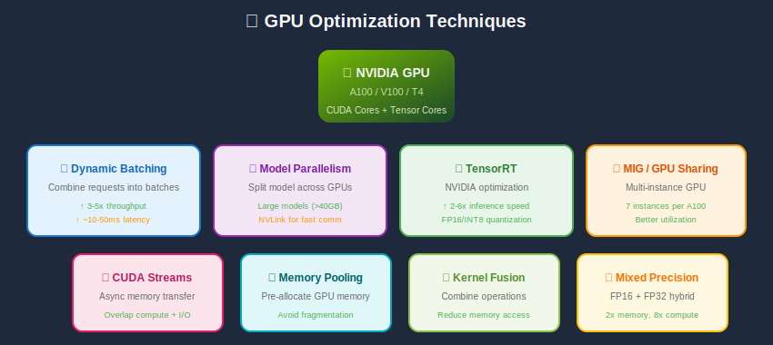
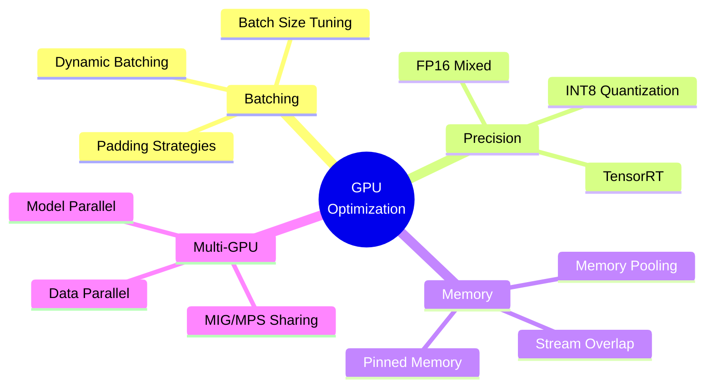
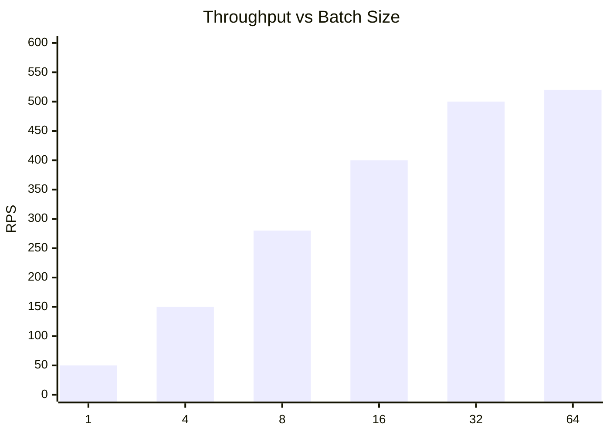
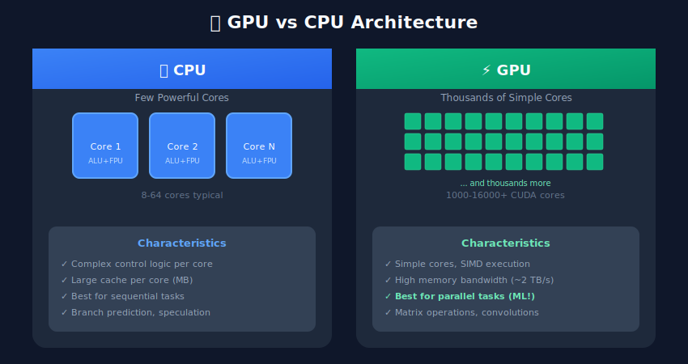

# 🎮 GPU Optimization

<p align="center">
  
</p>

## Table of Contents
- [Overview](#overview)
- [Performance Fundamentals](#performance-fundamentals)
- [GPU Architecture Basics](#gpu-architecture-basics)
- [CUDA Optimization](#cuda-optimization)
- [Batching Strategies](#batching-strategies)
- [Multi-GPU Serving](#multi-gpu-serving)
- [Memory Optimization](#memory-optimization)
- [GPU Sharing (MIG/MPS)](#gpu-sharing-migmps)
- [Profiling and Benchmarking](#profiling-and-benchmarking)
- [Best Practices](#best-practices)

---

## Overview

GPU optimization is critical for high-throughput ML serving. A well-optimized GPU serving system can achieve 10-100x better throughput than naive implementations.

---

## Performance Fundamentals

### Roofline Model

The **roofline model** provides a visual framework for understanding performance limits. Performance $P$ (in FLOPS) is bounded by:

\[
P \leq \min\left(\text{Peak FLOPS}, \, I \times \text{Memory Bandwidth}\right)
\]

where $I$ is the **arithmetic intensity** (FLOPS per byte of data moved):

\[
I = \frac{\text{Total FLOPS}}{\text{Total Bytes Transferred}}
\]

**Compute-bound** operations (high $I$): Matrix multiplication, convolutions
**Memory-bound** operations (low $I$): Element-wise ops, batch norm

### GPU Utilization Formula

**Effective GPU utilization** depends on:

\[
\eta_{\text{GPU}} = \eta_{\text{occupancy}} \times \eta_{\text{memory}} \times \eta_{\text{compute}}
\]

where:
- $\eta_{\text{occupancy}}$ = fraction of SMs actively executing
- $\eta_{\text{memory}}$ = memory bandwidth utilization  
- $\eta_{\text{compute}}$ = ALU utilization

### Latency vs Throughput

For batch size $B$ and single-sample latency $l$:

**Throughput:**
\[
\text{Throughput} = \frac{B}{L(B)}
\]

where \( L(B) \) is the batch latency. Due to parallelism:

\[
L(B) \approx l + c \cdot \log(B) \quad \text{(not } B \times l \text{)}
\]

### Amdahl's Law for GPU Acceleration

If fraction $p$ of computation is parallelizable and GPU provides speedup $s$:

\[
\text{Speedup} = \frac{1}{(1-p) + \frac{p}{s}}
\]

Even with $s \to \infty$, speedup is bounded by $\frac{1}{1-p}$.






---

## GPU Architecture Basics

### GPU vs CPU



### Memory Hierarchy


---

## CUDA Optimization

### CUDA Streams for Concurrency

```python

# cuda_streams.py
import torch
import torch.cuda as cuda

class StreamedInference:
    def __init__(self, model, num_streams: int = 4):
        self.model = model.cuda()
        self.model.eval()
        self.streams = [cuda.Stream() for _ in range(num_streams)]
        self.current_stream = 0

    def predict_async(self, input_batch):
        """Run inference on dedicated CUDA stream"""
        stream = self.streams[self.current_stream]
        self.current_stream = (self.current_stream + 1) % len(self.streams)

        with cuda.stream(stream):

            # Copy to GPU
            input_gpu = input_batch.cuda(non_blocking=True)

            # Inference
            with torch.no_grad():
                output = self.model(input_gpu)

            # Copy back
            result = output.cpu()

        return result, stream

    def predict_batch_parallel(self, batches):
        """Process multiple batches in parallel streams"""
        results = []
        streams_used = []

        # Launch all batches
        for batch in batches:
            result, stream = self.predict_async(batch)
            results.append(result)
            streams_used.append(stream)

        # Synchronize all streams
        for stream in streams_used:
            stream.synchronize()

        return results

# Usage
model = StreamedInference(my_model, num_streams=4)
batches = [torch.randn(32, 3, 224, 224) for _ in range(4)]
results = model.predict_batch_parallel(batches)
```

### Memory Pinning

```python

# memory_optimization.py
import torch

# Pin memory for faster CPU-GPU transfer
def create_pinned_buffer(shape, dtype=torch.float32):
    """Create pinned memory buffer for fast transfers"""
    return torch.empty(shape, dtype=dtype, pin_memory=True)

class OptimizedDataLoader:
    def __init__(self, batch_size: int, feature_dim: int):

        # Pre-allocate pinned buffers
        self.input_buffer = create_pinned_buffer((batch_size, feature_dim))
        self.gpu_buffer = torch.empty(
            (batch_size, feature_dim),
            dtype=torch.float32,
            device='cuda'
        )

    def load_batch(self, data):
        """Load batch with pinned memory"""

        # Copy to pinned buffer
        self.input_buffer.copy_(torch.tensor(data))

        # Async transfer to GPU
        self.gpu_buffer.copy_(self.input_buffer, non_blocking=True)

        return self.gpu_buffer
```

---

## Batching Strategies

### Dynamic Batching Implementation

```python

# dynamic_batching.py
import asyncio
import torch
from collections import deque
from dataclasses import dataclass
from typing import List, Any
import time

@dataclass
class InferenceRequest:
    data: torch.Tensor
    future: asyncio.Future
    timestamp: float

class DynamicBatcher:
    def __init__(
        self,
        model,
        max_batch_size: int = 32,
        max_wait_ms: float = 10.0,
        preferred_batch_sizes: List[int] = None
    ):
        self.model = model
        self.max_batch_size = max_batch_size
        self.max_wait_ms = max_wait_ms
        self.preferred_sizes = preferred_batch_sizes or [8, 16, 32]

        self.queue = deque()
        self.lock = asyncio.Lock()
        self.processing = False

    async def predict(self, input_data: torch.Tensor) -> torch.Tensor:
        """Submit single request for batched processing"""
        loop = asyncio.get_event_loop()
        future = loop.create_future()

        request = InferenceRequest(
            data=input_data,
            future=future,
            timestamp=time.time()
        )

        async with self.lock:
            self.queue.append(request)

            if len(self.queue) >= self.max_batch_size:
                asyncio.create_task(self._process_batch())
            elif len(self.queue) == 1:
                asyncio.create_task(self._wait_and_process())

        return await future

    def _select_batch_size(self, queue_size: int) -> int:
        """Select optimal batch size from preferred sizes"""
        for size in reversed(self.preferred_sizes):
            if queue_size >= size:
                return size
        return queue_size

    async def _wait_and_process(self):
        await asyncio.sleep(self.max_wait_ms / 1000)
        await self._process_batch()

    async def _process_batch(self):
        async with self.lock:
            if not self.queue or self.processing:
                return

            self.processing = True
            batch_size = self._select_batch_size(len(self.queue))
            requests = [self.queue.popleft() for _ in range(min(batch_size, len(self.queue)))]

        try:

            # Stack inputs into batch
            batch_input = torch.stack([r.data for r in requests]).cuda()

            # Run batched inference
            with torch.no_grad():
                batch_output = self.model(batch_input)

            # Distribute results
            for i, request in enumerate(requests):
                request.future.set_result(batch_output[i].cpu())

        except Exception as e:
            for request in requests:
                if not request.future.done():
                    request.future.set_exception(e)

        finally:
            self.processing = False

            # Check if more requests arrived
            if self.queue:
                asyncio.create_task(self._process_batch())
```

### Padding for Variable-Length Inputs

```python

# batch_padding.py
import torch
from typing import List, Tuple

def pad_sequences(
    sequences: List[torch.Tensor],
    padding_value: float = 0.0
) -> Tuple[torch.Tensor, torch.Tensor]:
    """Pad variable-length sequences for batching"""
    lengths = [len(seq) for seq in sequences]
    max_len = max(lengths)
    batch_size = len(sequences)

    # Create padded tensor
    padded = torch.full(
        (batch_size, max_len, sequences[0].shape[-1]),
        padding_value
    )

    # Create attention mask
    mask = torch.zeros(batch_size, max_len)

    for i, seq in enumerate(sequences):
        padded[i, :lengths[i]] = seq
        mask[i, :lengths[i]] = 1

    return padded, mask

# For efficient batching, group by similar lengths
def bucket_by_length(
    sequences: List[torch.Tensor],
    num_buckets: int = 4
) -> List[List[torch.Tensor]]:
    """Group sequences by length for efficient batching"""
    lengths = [(i, len(seq)) for i, seq in enumerate(sequences)]
    sorted_lengths = sorted(lengths, key=lambda x: x[1])

    bucket_size = len(sorted_lengths) // num_buckets
    buckets = []

    for i in range(num_buckets):
        start = i * bucket_size
        end = start + bucket_size if i < num_buckets - 1 else len(sorted_lengths)
        bucket_indices = [idx for idx, _ in sorted_lengths[start:end]]
        buckets.append([sequences[idx] for idx in bucket_indices])

    return buckets
```

---

## Multi-GPU Serving

### Data Parallel Inference

```python

# multi_gpu_inference.py
import torch
import torch.nn as nn
from typing import List

class MultiGPUServer:
    def __init__(self, model: nn.Module, gpu_ids: List[int]):
        self.gpu_ids = gpu_ids
        self.num_gpus = len(gpu_ids)

        # Create model replica on each GPU
        self.models = []
        for gpu_id in gpu_ids:
            model_copy = model.to(f'cuda:{gpu_id}')
            model_copy.eval()
            self.models.append(model_copy)

        self.current_gpu = 0

    def predict_round_robin(self, input_batch: torch.Tensor) -> torch.Tensor:
        """Route requests to GPUs in round-robin fashion"""
        gpu_id = self.gpu_ids[self.current_gpu]
        model = self.models[self.current_gpu]

        self.current_gpu = (self.current_gpu + 1) % self.num_gpus

        with torch.no_grad():
            input_gpu = input_batch.to(f'cuda:{gpu_id}')
            output = model(input_gpu)

        return output.cpu()

    def predict_parallel(self, input_batch: torch.Tensor) -> torch.Tensor:
        """Split batch across all GPUs"""
        batch_size = input_batch.shape[0]
        chunk_size = batch_size // self.num_gpus

        # Split input
        chunks = torch.chunk(input_batch, self.num_gpus)

        outputs = []
        streams = []

        # Launch on all GPUs
        for i, (chunk, model) in enumerate(zip(chunks, self.models)):
            gpu_id = self.gpu_ids[i]
            stream = torch.cuda.Stream(device=f'cuda:{gpu_id}')

            with torch.cuda.stream(stream):
                chunk_gpu = chunk.to(f'cuda:{gpu_id}', non_blocking=True)
                with torch.no_grad():
                    output = model(chunk_gpu)
                outputs.append(output)

            streams.append(stream)

        # Synchronize all streams
        for stream in streams:
            stream.synchronize()

        # Gather results
        outputs_cpu = [out.cpu() for out in outputs]
        return torch.cat(outputs_cpu, dim=0)

# Usage
server = MultiGPUServer(model, gpu_ids=[0, 1, 2, 3])
result = server.predict_parallel(large_batch)
```

---

## Memory Optimization

### Memory Pool Management

```python

# memory_pool.py
import torch
from typing import Tuple

class GPUMemoryPool:
    """Pre-allocated GPU memory pool for inference"""

    def __init__(
        self,
        max_batch_size: int,
        input_shape: Tuple[int, ...],
        output_shape: Tuple[int, ...],
        device: str = 'cuda:0'
    ):
        self.device = device

        # Pre-allocate input buffer
        self.input_buffer = torch.empty(
            (max_batch_size, *input_shape),
            dtype=torch.float32,
            device=device
        )

        # Pre-allocate output buffer
        self.output_buffer = torch.empty(
            (max_batch_size, *output_shape),
            dtype=torch.float32,
            device=device
        )

    def get_input_buffer(self, batch_size: int) -> torch.Tensor:
        """Get slice of input buffer for batch"""
        return self.input_buffer[:batch_size]

    def get_output_buffer(self, batch_size: int) -> torch.Tensor:
        """Get slice of output buffer for batch"""
        return self.output_buffer[:batch_size]

# Enable memory caching
torch.cuda.empty_cache()
torch.cuda.memory.set_per_process_memory_fraction(0.8)

# Use memory efficient inference
with torch.cuda.amp.autocast():  # Mixed precision
    with torch.inference_mode():  # Faster than no_grad()
        output = model(input_batch)
```

---

## GPU Sharing (MIG/MPS)

### NVIDIA MIG (Multi-Instance GPU)

```bash

# Enable MIG mode on A100
sudo nvidia-smi -i 0 -mig 1

# Create GPU instances
sudo nvidia-smi mig -cgi 9,9,9 -C  # 3 equal partitions

# List instances
nvidia-smi mig -lgi

# Assign to containers
docker run --gpus '"device=0:0"' my-ml-server:v1  # First partition
docker run --gpus '"device=0:1"' my-ml-server:v2  # Second partition
```

### CUDA MPS (Multi-Process Service)

```bash

# Start MPS control daemon
export CUDA_MPS_PIPE_DIRECTORY=/tmp/nvidia-mps
export CUDA_MPS_LOG_DIRECTORY=/tmp/nvidia-log
nvidia-cuda-mps-control -d

# Configure resource limits
echo "set_default_active_thread_percentage 33" | nvidia-cuda-mps-control

# Run multiple processes sharing GPU
CUDA_VISIBLE_DEVICES=0 python server1.py &
CUDA_VISIBLE_DEVICES=0 python server2.py &
CUDA_VISIBLE_DEVICES=0 python server3.py &
```

---

## Profiling and Benchmarking

### PyTorch Profiler

```python

# profiling.py
import torch
from torch.profiler import profile, record_function, ProfilerActivity

def profile_inference(model, input_batch, num_iterations: int = 100):
    """Profile model inference"""
    model.eval()
    input_gpu = input_batch.cuda()

    # Warmup
    for _ in range(10):
        with torch.no_grad():
            _ = model(input_gpu)

    torch.cuda.synchronize()

    # Profile
    with profile(
        activities=[ProfilerActivity.CPU, ProfilerActivity.CUDA],
        record_shapes=True,
        profile_memory=True,
        with_stack=True
    ) as prof:
        for _ in range(num_iterations):
            with record_function("inference"):
                with torch.no_grad():
                    output = model(input_gpu)
                torch.cuda.synchronize()

    # Print results
    print(prof.key_averages().table(sort_by="cuda_time_total", row_limit=20))

    # Export Chrome trace
    prof.export_chrome_trace("trace.json")

# Benchmark throughput
def benchmark_throughput(model, batch_size: int, num_batches: int = 100):
    """Measure inference throughput"""
    import time

    model.eval()
    input_batch = torch.randn(batch_size, 3, 224, 224).cuda()

    # Warmup
    for _ in range(10):
        with torch.no_grad():
            _ = model(input_batch)

    torch.cuda.synchronize()
    start = time.perf_counter()

    for _ in range(num_batches):
        with torch.no_grad():
            _ = model(input_batch)

    torch.cuda.synchronize()
    elapsed = time.perf_counter() - start

    total_samples = batch_size * num_batches
    throughput = total_samples / elapsed
    latency_per_batch = elapsed / num_batches * 1000

    print(f"Throughput: {throughput:.0f} samples/sec")
    print(f"Latency per batch: {latency_per_batch:.2f} ms")

    return throughput, latency_per_batch
```

---

## Best Practices

### GPU Optimization Checklist

- ✅ Use dynamic batching (10x throughput)
- ✅ Enable mixed precision (FP16)
- ✅ Pre-allocate memory buffers
- ✅ Use CUDA streams for concurrency
- ✅ Pin CPU memory for transfers
- ✅ Profile before optimizing
- ✅ Monitor GPU utilization
- ✅ Consider MIG for multi-tenancy

### Common Pitfalls

| Pitfall | Impact | Solution |
|---------|--------|----------|
| No batching | 10x slower | Dynamic batching |
| CPU-GPU sync | Stalls pipeline | Async operations |
| Memory fragmentation | OOM errors | Memory pooling |
| Small batches | Low utilization | Larger batches |

---

## Next Steps

→ **[13. Model Compression](../13_model_compression/)**: Learn quantization, pruning, distillation

---

*Maximize GPU utilization for cost-effective, high-throughput serving!*

---

<div align="center">

**[⬆ Back to Top](#)** | **[📚 Main Repository](https://github.com/Gaurav14cs17/ml_system_design)**

Made with 💜 by [Gaurav14cs17](https://github.com/Gaurav14cs17)

</div>
