# 🗜️ Model Compression

<p align="center">
  
</p>

## Table of Contents
- [Overview](#overview)
- [Mathematical Foundations](#mathematical-foundations)
- [Quantization](#quantization)
- [Pruning](#pruning)
- [Knowledge Distillation](#knowledge-distillation)
- [Low-Rank Factorization](#low-rank-factorization)
- [Compression Pipeline](#compression-pipeline)
- [Best Practices](#best-practices)

---

## Overview

Model compression reduces model size and inference cost while maintaining accuracy, enabling deployment on resource-constrained devices.

### The Compression Problem

Given a neural network \( f_\theta(x) \) with parameters $\theta \in \mathbb{R}^n$, the goal of compression is to find a smaller representation $\hat{\theta}$ such that:

\[
\min_{\hat{\theta}} \mathcal{L}(f_{\hat{\theta}}) \quad \text{subject to} \quad |\hat{\theta}| \ll |\theta|
\]

where $\mathcal{L}$ is the task loss and $|\cdot|$ denotes the storage size.

---

## Mathematical Foundations

### Information-Theoretic View

The **rate-distortion theory** provides a fundamental limit on compression. For a model with weights $W$ and reconstruction $\hat{W}$:

\[
R(D) = \min_{p(\hat{W}|W): \mathbb{E}[d(W,\hat{W})] \leq D} I(W; \hat{W})
\]

where:
- \( R(D) \) is the minimum bits needed to achieve distortion $D$
- \( I(W; \hat{W}) \) is the mutual information
- \( d(W, \hat{W}) \) is a distortion measure (e.g., MSE)

### Compression Ratio

The **compression ratio** $\rho$ is defined as:

\[
\rho = \frac{\text{Original Size}}{\text{Compressed Size}} = \frac{n \cdot b_{\text{orig}}}{n_{\text{eff}} \cdot b_{\text{new}}}
\]

where:
- $n$ = number of parameters
- $b_{\text{orig}}$ = bits per parameter (32 for FP32)
- $n_{\text{eff}}$ = effective non-zero parameters
- $b_{\text{new}}$ = bits after quantization

```mermaid
flowchart LR
    subgraph Original["📦 ORIGINAL"]
        O[500MB Model<br/>100ms latency]
    end

    subgraph Techniques["🔧 TECHNIQUES"]
        Q[🔢 Quantization<br/>FP32→INT8<br/>4x smaller]
        P[✂️ Pruning<br/>Remove weights<br/>2-10x smaller]
        D[🎓 Distillation<br/>Large→Small<br/>Custom size]
    end

    subgraph Result["✨ RESULT"]
        R[50MB Model<br/>25ms latency<br/>95% accuracy]
    end

    Original --> Techniques --> Result

    style Original fill:#ffcdd2
    style Techniques fill:#fff9c4
    style Result fill:#c8e6c9
```




---

## Quantization

Quantization maps floating-point values to lower-precision representations. This is the most widely used compression technique due to its simplicity and effectiveness.

### Mathematical Framework

#### Affine Quantization

The affine (asymmetric) quantization maps a floating-point value $x$ to an integer $q$:

\[
q = \text{clamp}\left(\left\lfloor \frac{x}{S} \right\rceil + Z, \, q_{\min}, \, q_{\max}\right)
\]

where:
- $S$ is the **scale factor** (step size)
- $Z$ is the **zero-point** (integer offset)
- $\lfloor \cdot \rceil$ denotes rounding to nearest integer
- $q_{\min}, q_{\max}$ are the quantization bounds (e.g., -128, 127 for INT8)

The **dequantization** (reconstruction) is:

\[
\hat{x} = S \cdot (q - Z)
\]

#### Scale and Zero-Point Calculation

Given the range $[x_{\min}, x_{\max}]$ of values to quantize:

\[
S = \frac{x_{\max} - x_{\min}}{q_{\max} - q_{\min}}
\]

\[
Z = q_{\min} - \left\lfloor \frac{x_{\min}}{S} \right\rceil
\]

#### Symmetric Quantization

For symmetric quantization (zero-point = 0), the scale is:

\[
S = \frac{\max(|x_{\min}|, |x_{\max}|)}{q_{\max}}
\]

This is simpler and faster but wastes representational capacity if the distribution is asymmetric.

#### Quantization Error

The **quantization error** (noise) follows a uniform distribution with variance:

\[
\sigma_q^2 = \frac{S^2}{12}
\]

The **Signal-to-Quantization-Noise Ratio (SQNR)** in dB is approximately:

\[
\text{SQNR} \approx 6.02b + 10\log_{10}\left(\frac{\sigma_x^2}{\sigma_q^2}\right)
\]

where $b$ is the number of bits. Each additional bit improves SQNR by ~6 dB.

### Precision Levels


| Format | Bits | Range | Precision | Memory Reduction |
|--------|------|-------|-----------|------------------|
| FP32 | 32 | ±3.4×10³⁸ | ~7 decimal digits | 1× (baseline) |
| FP16 | 16 | ±65,504 | ~3 decimal digits | 2× |
| BF16 | 16 | ±3.4×10³⁸ | ~2 decimal digits | 2× |
| INT8 | 8 | [-128, 127] | Integer only | 4× |
| INT4 | 4 | [-8, 7] | Integer only | 8× |

### PyTorch Quantization

```python

# quantization.py
import torch
import torch.quantization as quant

# 1. DYNAMIC QUANTIZATION (Easiest)
# Weights quantized statically, activations dynamically
model_fp32 = load_model()
model_int8 = torch.quantization.quantize_dynamic(
    model_fp32,
    {torch.nn.Linear, torch.nn.LSTM},
    dtype=torch.qint8
)

# 2. STATIC QUANTIZATION (Best quality)
# Requires calibration data
class QuantizedModel(torch.nn.Module):
    def __init__(self, model):
        super().__init__()
        self.quant = torch.quantization.QuantStub()
        self.model = model
        self.dequant = torch.quantization.DeQuantStub()

    def forward(self, x):
        x = self.quant(x)
        x = self.model(x)
        x = self.dequant(x)
        return x

# Prepare for quantization
model = QuantizedModel(load_model())
model.qconfig = torch.quantization.get_default_qconfig('fbgemm')
model_prepared = torch.quantization.prepare(model)

# Calibrate with representative data
with torch.no_grad():
    for batch in calibration_loader:
        model_prepared(batch)

# Convert to quantized model
model_quantized = torch.quantization.convert(model_prepared)

# 3. QUANTIZATION-AWARE TRAINING (QAT)
# Train with simulated quantization
model.train()
model.qconfig = torch.quantization.get_default_qat_qconfig('fbgemm')
model_qat = torch.quantization.prepare_qat(model)

# Fine-tune with QAT
for epoch in range(num_epochs):
    for batch in train_loader:
        output = model_qat(batch)
        loss = criterion(output, labels)
        loss.backward()
        optimizer.step()

# Convert to fully quantized
model_quantized = torch.quantization.convert(model_qat.eval())
```

### INT8 Calibration

```python

# calibration.py
import numpy as np
from typing import List

class MinMaxCalibrator:
    """Collect min/max statistics for INT8 calibration"""

    def __init__(self):
        self.min_val = float('inf')
        self.max_val = float('-inf')

    def collect(self, tensor: np.ndarray):
        self.min_val = min(self.min_val, tensor.min())
        self.max_val = max(self.max_val, tensor.max())

    def compute_scale_zero_point(self) -> tuple:
        """Compute quantization parameters"""

        # Symmetric quantization
        abs_max = max(abs(self.min_val), abs(self.max_val))
        scale = abs_max / 127.0
        zero_point = 0

        return scale, zero_point

class PercentileCalibrator:
    """Use percentiles to handle outliers"""

    def __init__(self, percentile: float = 99.99):
        self.percentile = percentile
        self.values = []

    def collect(self, tensor: np.ndarray):
        self.values.extend(tensor.flatten().tolist())

    def compute_scale_zero_point(self) -> tuple:
        arr = np.array(self.values)
        min_val = np.percentile(arr, 100 - self.percentile)
        max_val = np.percentile(arr, self.percentile)

        scale = (max_val - min_val) / 255.0
        zero_point = int(-min_val / scale)

        return scale, zero_point
```

---

## Pruning

Pruning removes redundant weights from neural networks based on the observation that many weights contribute minimally to the output.

### Mathematical Framework

#### The Lottery Ticket Hypothesis

A randomly-initialized neural network contains a **sparse subnetwork** (the "winning ticket") that, when trained in isolation, can match the full network's accuracy:

\[
\exists \, m \in \{0,1\}^{|\theta|} : \mathcal{L}(f_{m \odot \theta_0}) \approx \mathcal{L}(f_\theta)
\]

where $m$ is a binary mask and $\theta_0$ are the initial weights.

#### Importance Scoring

Pruning requires measuring weight importance. Common metrics include:

**1. Magnitude-based (L1/L2 norm):**
\[
\text{Importance}(w_i) = |w_i| \quad \text{or} \quad |w_i|^2
\]

**2. Gradient-based (sensitivity):**
\[
\text{Importance}(w_i) = \left|\frac{\partial \mathcal{L}}{\partial w_i}\right| \cdot |w_i|
\]

**3. Hessian-based (second-order):**
\[
\text{Importance}(w_i) = \frac{w_i^2}{2 \cdot [H^{-1}]_{ii}}
\]

where $H$ is the Hessian matrix of the loss.

#### Sparsity Metrics

**Model sparsity** is the fraction of zero weights:

\[
\text{Sparsity} = \frac{\|\theta\|_0}{|\theta|} = \frac{\#\{w_i = 0\}}{\#\{w_i\}}
\]

**Layer-wise sparsity** can vary; critical layers (first/last) typically retain more weights.

#### Pruning Schedule

Gradual pruning follows a **cubic sparsity schedule**:

\[
s_t = s_f + (s_i - s_f)\left(1 - \frac{t - t_0}{n\Delta t}\right)^3
\]

where:
- $s_t$ = sparsity at step $t$
- $s_i, s_f$ = initial and final sparsity
- $t_0$ = pruning start step
- $n, \Delta t$ = pruning frequency parameters

### Pruning Types


| Type | Granularity | Hardware Support | Typical Sparsity |
|------|-------------|------------------|------------------|
| Unstructured | Individual weights | Sparse libraries | 90%+ |
| Structured | Channels/filters | Native (dense ops) | 30-50% |
| N:M Sparse | N zeros per M weights | NVIDIA Ampere+ | 50% (2:4) |

### PyTorch Pruning

```python

# pruning.py
import torch
import torch.nn.utils.prune as prune
from torch import nn

def apply_unstructured_pruning(model: nn.Module, amount: float = 0.5):
    """Apply unstructured L1 pruning"""
    for name, module in model.named_modules():
        if isinstance(module, nn.Linear):
            prune.l1_unstructured(module, name='weight', amount=amount)
        elif isinstance(module, nn.Conv2d):
            prune.l1_unstructured(module, name='weight', amount=amount)

    return model

def apply_structured_pruning(model: nn.Module, amount: float = 0.3):
    """Remove entire channels based on L2 norm"""
    for name, module in model.named_modules():
        if isinstance(module, nn.Conv2d):
            prune.ln_structured(
                module,
                name='weight',
                amount=amount,
                n=2,
                dim=0  # Prune output channels
            )

    return model

def remove_pruning_reparameterization(model: nn.Module):
    """Make pruning permanent"""
    for name, module in model.named_modules():
        if isinstance(module, (nn.Linear, nn.Conv2d)):
            try:
                prune.remove(module, 'weight')
            except:
                pass

    return model

def get_sparsity(model: nn.Module) -> float:
    """Calculate model sparsity"""
    total_params = 0
    zero_params = 0

    for param in model.parameters():
        total_params += param.numel()
        zero_params += (param == 0).sum().item()

    return zero_params / total_params

# Iterative pruning (better accuracy retention)
def iterative_pruning(model, train_fn, final_sparsity=0.9, steps=10):
    """Gradually prune model over multiple steps"""
    current_sparsity = 0
    sparsity_per_step = final_sparsity / steps

    for step in range(steps):

        # Prune
        current_sparsity += sparsity_per_step
        apply_unstructured_pruning(model, amount=sparsity_per_step)

        # Fine-tune
        train_fn(model, epochs=5)

        print(f"Step {step+1}: Sparsity = {get_sparsity(model):.2%}")

    return model
```

---

## Knowledge Distillation

Knowledge distillation transfers learned representations from a large "teacher" model to a smaller "student" model, often achieving better accuracy than training the student from scratch.

### Mathematical Framework

#### Soft Targets and Temperature Scaling

The key insight is that the teacher's soft probability distribution contains more information than hard labels. The **softmax with temperature** $T$ is:

\[
p_i = \frac{\exp(z_i / T)}{\sum_j \exp(z_j / T)}
\]

where $z_i$ are the logits (pre-softmax activations).

**Temperature effects:**
- $T = 1$: Standard softmax (sharp distribution)
- $T > 1$: Softer distribution, reveals "dark knowledge"
- $T \to \infty$: Approaches uniform distribution

The soft probabilities encode relationships between classes (e.g., "3" is more similar to "8" than to "7").

#### Distillation Loss Function

The total loss combines hard and soft targets:

\[
\mathcal{L}_{\text{distill}} = \alpha \cdot \mathcal{L}_{\text{hard}} + (1 - \alpha) \cdot \mathcal{L}_{\text{soft}}
\]

**Hard loss** (standard cross-entropy with ground truth):
\[
\mathcal{L}_{\text{hard}} = -\sum_i y_i \log p_i^{(S)}
\]

**Soft loss** (KL divergence from teacher):
\[
\mathcal{L}_{\text{soft}} = T^2 \cdot D_{\text{KL}}\left(p^{(T)} \| p^{(S)}\right) = T^2 \sum_i p_i^{(T)} \log \frac{p_i^{(T)}}{p_i^{(S)}}
\]

where:
- \( p^{(T)} \) = teacher's soft probabilities
- \( p^{(S)} \) = student's soft probabilities
- The $T^2$ factor compensates for the gradient magnitude reduction at high temperatures

#### Why Does Distillation Work?

**Gradient analysis** shows that soft targets provide richer gradients:

\[
\frac{\partial \mathcal{L}_{\text{soft}}}{\partial z_i^{(S)}} = \frac{1}{T}\left(p_i^{(S)} - p_i^{(T)}\right)
\]

This gradient:
1. Is non-zero for all classes (not just the correct one)
2. Contains inter-class relationship information
3. Has lower variance than hard labels

#### Feature-based Distillation

Beyond logits, intermediate features can be matched:

\[
\mathcal{L}_{\text{hint}} = \|f_l^{(S)}(x) - r(f_l^{(T)}(x))\|_2^2
\]

where \( r(\cdot) \) is a regressor to match dimensions.

### Distillation Framework


### Implementation

```python

# distillation.py
import torch
import torch.nn as nn
import torch.nn.functional as F

class DistillationLoss(nn.Module):
    def __init__(
        self,
        alpha: float = 0.5,
        temperature: float = 4.0
    ):
        super().__init__()
        self.alpha = alpha
        self.temperature = temperature
        self.ce_loss = nn.CrossEntropyLoss()
        self.kl_loss = nn.KLDivLoss(reduction='batchmean')

    def forward(
        self,
        student_logits: torch.Tensor,
        teacher_logits: torch.Tensor,
        labels: torch.Tensor
    ) -> torch.Tensor:

        # Hard label loss
        hard_loss = self.ce_loss(student_logits, labels)

        # Soft label loss (knowledge transfer)
        student_soft = F.log_softmax(student_logits / self.temperature, dim=1)
        teacher_soft = F.softmax(teacher_logits / self.temperature, dim=1)
        soft_loss = self.kl_loss(student_soft, teacher_soft) * (self.temperature ** 2)

        # Combined loss
        total_loss = self.alpha * hard_loss + (1 - self.alpha) * soft_loss

        return total_loss

def train_distillation(
    teacher: nn.Module,
    student: nn.Module,
    train_loader,
    epochs: int = 10,
    alpha: float = 0.5,
    temperature: float = 4.0
):
    """Train student model with knowledge distillation"""
    teacher.eval()
    student.train()

    criterion = DistillationLoss(alpha=alpha, temperature=temperature)
    optimizer = torch.optim.Adam(student.parameters(), lr=1e-4)

    for epoch in range(epochs):
        total_loss = 0

        for batch_idx, (data, labels) in enumerate(train_loader):
            data, labels = data.cuda(), labels.cuda()

            # Get teacher predictions (no gradient)
            with torch.no_grad():
                teacher_logits = teacher(data)

            # Get student predictions
            student_logits = student(data)

            # Compute loss
            loss = criterion(student_logits, teacher_logits, labels)

            # Backprop
            optimizer.zero_grad()
            loss.backward()
            optimizer.step()

            total_loss += loss.item()

        print(f"Epoch {epoch+1}: Loss = {total_loss / len(train_loader):.4f}")

    return student
```

---

## Low-Rank Factorization

Low-rank factorization exploits the fact that weight matrices in neural networks are often approximately low-rank, meaning they can be decomposed into smaller matrices.

### Mathematical Framework

#### Singular Value Decomposition (SVD)

Any matrix $W \in \mathbb{R}^{m \times n}$ can be decomposed as:

\[
W = U \Sigma V^T = \sum_{i=1}^{r} \sigma_i u_i v_i^T
\]

where:
- $U \in \mathbb{R}^{m \times m}$ = left singular vectors (orthonormal)
- $\Sigma \in \mathbb{R}^{m \times n}$ = diagonal matrix of singular values $\sigma_1 \geq \sigma_2 \geq \cdots \geq 0$
- $V \in \mathbb{R}^{n \times n}$ = right singular vectors (orthonormal)
- \( r = \text{rank}(W) \)

#### Truncated SVD Approximation

The **Eckart-Young theorem** states that the best rank-$k$ approximation (in Frobenius norm) is:

\[
\hat{W}_k = U_k \Sigma_k V_k^T = \sum_{i=1}^{k} \sigma_i u_i v_i^T
\]

with approximation error:

\[
\|W - \hat{W}_k\|_F = \sqrt{\sum_{i=k+1}^{r} \sigma_i^2}
\]

#### Parameter Reduction

Original: $m \times n$ parameters

After rank-$k$ factorization: $W \approx AB$ where $A \in \mathbb{R}^{m \times k}$ and $B \in \mathbb{R}^{k \times n}$

**Compression ratio:**
\[
\rho = \frac{mn}{k(m+n)} = \frac{mn}{km + kn}
\]

For compression, we need $k < \frac{mn}{m+n}$.

#### Energy-based Rank Selection

Choose rank $k$ to preserve fraction $\tau$ of the "energy":

\[
\frac{\sum_{i=1}^{k} \sigma_i^2}{\sum_{i=1}^{r} \sigma_i^2} \geq \tau
\]

Typically $\tau = 0.99$ preserves most information with significant compression.

#### Application to Convolutions

For convolutional layers with kernel $\mathcal{K} \in \mathbb{R}^{C_{out} \times C_{in} \times H \times W}$:

1. **Reshape** to 2D: \( W \in \mathbb{R}^{C_{out} \times (C_{in} \cdot H \cdot W)} \)
2. **Apply SVD**: $W \approx AB$
3. **Replace** original conv with two convs: 1×1 conv (B) followed by 1×1 conv (A)

### Matrix Decomposition

```python

# low_rank.py
import torch
import torch.nn as nn

class LowRankLinear(nn.Module):
    """Approximate linear layer with low-rank decomposition"""

    def __init__(
        self,
        in_features: int,
        out_features: int,
        rank: int
    ):
        super().__init__()

        # W (out x in) ≈ A (out x rank) @ B (rank x in)
        self.A = nn.Linear(rank, out_features, bias=False)
        self.B = nn.Linear(in_features, rank, bias=True)

    def forward(self, x):
        return self.A(self.B(x))

def compress_linear_svd(
    layer: nn.Linear,
    rank: int
) -> LowRankLinear:
    """Compress linear layer using SVD"""
    W = layer.weight.data

    # SVD decomposition
    U, S, Vh = torch.linalg.svd(W, full_matrices=False)

    # Keep top-k singular values
    U_k = U[:, :rank]
    S_k = S[:rank]
    Vh_k = Vh[:rank, :]

    # Create low-rank layer
    compressed = LowRankLinear(
        in_features=layer.in_features,
        out_features=layer.out_features,
        rank=rank
    )

    # Set weights
    compressed.A.weight.data = U_k @ torch.diag(S_k)
    compressed.B.weight.data = Vh_k
    if layer.bias is not None:
        compressed.B.bias.data = layer.bias.data

    return compressed

def estimate_rank(layer: nn.Linear, threshold: float = 0.99) -> int:
    """Estimate optimal rank preserving threshold of variance"""
    W = layer.weight.data
    _, S, _ = torch.linalg.svd(W, full_matrices=False)

    total_variance = (S ** 2).sum()
    cumulative = torch.cumsum(S ** 2, dim=0) / total_variance

    rank = (cumulative < threshold).sum().item() + 1
    return rank
```

---

## Compression Pipeline

### Combined Approach

```python

# compression_pipeline.py
from dataclasses import dataclass
from typing import Optional

@dataclass
class CompressionConfig:
    quantization: bool = True
    quantization_bits: int = 8
    pruning: bool = True
    pruning_amount: float = 0.5
    distillation: bool = False
    target_size_mb: Optional[float] = None

def compress_model(
    model: nn.Module,
    config: CompressionConfig,
    calibration_data=None,
    teacher_model=None
) -> nn.Module:
    """Apply compression pipeline"""

    original_size = get_model_size_mb(model)
    print(f"Original model size: {original_size:.2f} MB")

    # 1. Knowledge Distillation (if enabled)
    if config.distillation and teacher_model:
        print("Applying knowledge distillation...")
        model = train_distillation(teacher_model, model, train_loader)

    # 2. Pruning
    if config.pruning:
        print(f"Applying {config.pruning_amount:.0%} pruning...")
        model = apply_unstructured_pruning(model, config.pruning_amount)
        model = remove_pruning_reparameterization(model)

    # 3. Quantization
    if config.quantization:
        print(f"Applying {config.quantization_bits}-bit quantization...")
        if config.quantization_bits == 8:
            model = torch.quantization.quantize_dynamic(
                model, {nn.Linear}, dtype=torch.qint8
            )

    compressed_size = get_model_size_mb(model)
    print(f"Compressed model size: {compressed_size:.2f} MB")
    print(f"Compression ratio: {original_size / compressed_size:.2f}x")

    return model

def get_model_size_mb(model: nn.Module) -> float:
    """Calculate model size in MB"""
    param_size = sum(p.numel() * p.element_size() for p in model.parameters())
    buffer_size = sum(b.numel() * b.element_size() for b in model.buffers())
    return (param_size + buffer_size) / 1024 / 1024
```

---

## Best Practices

### Compression Strategy by Use Case

| Use Case | Recommended Approach | Expected Savings |
|----------|---------------------|------------------|
| Mobile deployment | Quantization + Pruning | 4-10x smaller |
| Edge/IoT | INT8 + Distillation | 8-20x smaller |
| Cloud cost reduction | FP16 + Pruning | 2-4x faster |
| Latency critical | INT8 + TensorRT | 2-4x faster |

### Accuracy vs Size Trade-off


### Compression Checklist

- ✅ Baseline accuracy before compression
- ✅ Start with quantization (easiest, best ROI)
- ✅ Add pruning if more compression needed
- ✅ Use distillation for aggressive compression
- ✅ Validate accuracy after each step
- ✅ Profile inference speed improvement

---

## Next Steps

→ **[14. Security & Privacy](../14_security_privacy/)**: Learn model protection and secure inference

---

*Compress smart: maximize efficiency while preserving accuracy!*

---

<div align="center">

**[⬆ Back to Top](#)** | **[📚 Main Repository](https://github.com/Gaurav14cs17/ml_system_design)**

Made with 💜 by [Gaurav14cs17](https://github.com/Gaurav14cs17)

</div>
