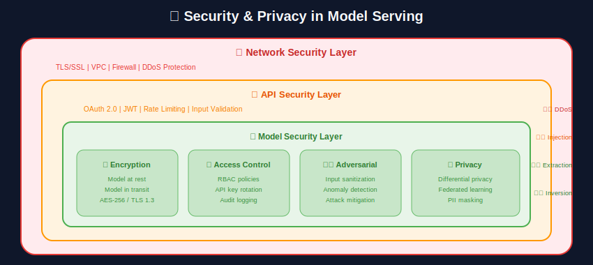
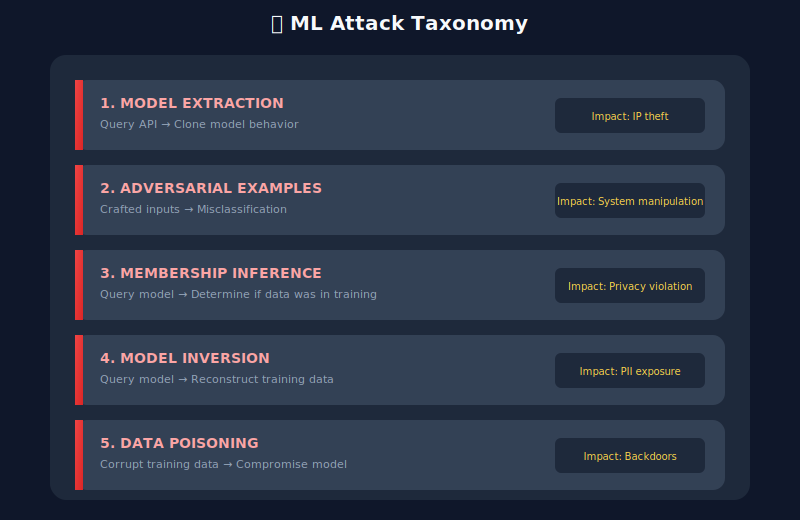
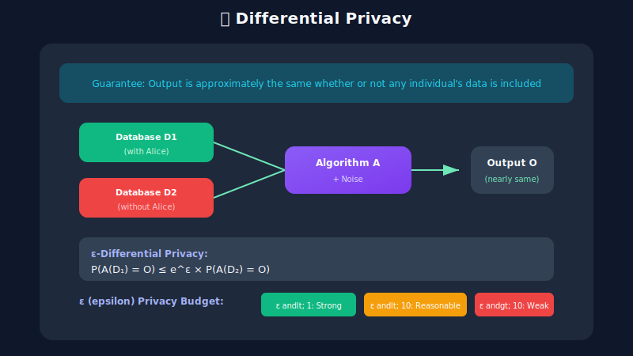

# 🔐 Security & Privacy

<p align="center">
  
</p>

## Table of Contents
- [Overview](#overview)
- [Threat Model](#threat-model)
- [Model Protection](#model-protection)
- [Secure Inference](#secure-inference)
- [Data Privacy](#data-privacy)
- [Differential Privacy](#differential-privacy)
- [Compliance](#compliance)
- [Best Practices](#best-practices)

---

## Overview

ML serving systems face unique security challenges: protecting valuable model IP, ensuring inference privacy, and complying with data regulations.


---

## Threat Model

### Attack Vectors



---

## Model Protection

### Model Encryption

```python
# model_encryption.py
import torch
from cryptography.fernet import Fernet
import io
import os

class EncryptedModelLoader:
    def __init__(self, key: bytes = None):
        if key is None:
            key = Fernet.generate_key()
        self.cipher = Fernet(key)
        self.key = key

    def encrypt_model(self, model: torch.nn.Module, output_path: str):
        """Encrypt and save model"""
        # Serialize model
        buffer = io.BytesIO()
        torch.save(model.state_dict(), buffer)
        model_bytes = buffer.getvalue()

        # Encrypt
        encrypted = self.cipher.encrypt(model_bytes)

        # Save
        with open(output_path, 'wb') as f:
            f.write(encrypted)

        return self.key

    def load_model(self, model_class, encrypted_path: str, **kwargs):
        """Load and decrypt model"""
        with open(encrypted_path, 'rb') as f:
            encrypted = f.read()

        # Decrypt
        decrypted = self.cipher.decrypt(encrypted)

        # Load state dict
        buffer = io.BytesIO(decrypted)
        state_dict = torch.load(buffer)

        # Create model
        model = model_class(**kwargs)
        model.load_state_dict(state_dict)

        return model

# Usage
loader = EncryptedModelLoader()
key = loader.encrypt_model(model, "model.encrypted")

# Later, with key
loader = EncryptedModelLoader(key)
model = loader.load_model(MyModel, "model.encrypted")
```

### Model Signing

```python
# model_signing.py
import hashlib
import json
from cryptography.hazmat.primitives import hashes, serialization
from cryptography.hazmat.primitives.asymmetric import padding, rsa
from datetime import datetime

class ModelSigner:
    def __init__(self, private_key=None, public_key=None):
        if private_key is None:
            # Generate new key pair
            self.private_key = rsa.generate_private_key(
                public_exponent=65537,
                key_size=2048
            )
            self.public_key = self.private_key.public_key()
        else:
            self.private_key = private_key
            self.public_key = public_key

    def sign_model(self, model_path: str) -> dict:
        """Create signed manifest for model"""
        # Compute model hash
        with open(model_path, 'rb') as f:
            model_hash = hashlib.sha256(f.read()).hexdigest()

        # Create manifest
        manifest = {
            "model_path": model_path,
            "model_hash": model_hash,
            "signed_at": datetime.utcnow().isoformat(),
            "version": "1.0.0"
        }

        # Sign manifest
        manifest_bytes = json.dumps(manifest, sort_keys=True).encode()
        signature = self.private_key.sign(
            manifest_bytes,
            padding.PSS(
                mgf=padding.MGF1(hashes.SHA256()),
                salt_length=padding.PSS.MAX_LENGTH
            ),
            hashes.SHA256()
        )

        manifest["signature"] = signature.hex()
        return manifest

    def verify_model(self, model_path: str, manifest: dict) -> bool:
        """Verify model integrity"""
        # Check model hash
        with open(model_path, 'rb') as f:
            current_hash = hashlib.sha256(f.read()).hexdigest()

        if current_hash != manifest["model_hash"]:
            return False

        # Verify signature
        signature = bytes.fromhex(manifest["signature"])
        manifest_copy = {k: v for k, v in manifest.items() if k != "signature"}
        manifest_bytes = json.dumps(manifest_copy, sort_keys=True).encode()

        try:
            self.public_key.verify(
                signature,
                manifest_bytes,
                padding.PSS(
                    mgf=padding.MGF1(hashes.SHA256()),
                    salt_length=padding.PSS.MAX_LENGTH
                ),
                hashes.SHA256()
            )
            return True
        except:
            return False
```

---

## Secure Inference

### Rate Limiting & Abuse Prevention

```python
# rate_limiting.py
from fastapi import FastAPI, HTTPException, Request
from fastapi.middleware.cors import CORSMiddleware
import time
from collections import defaultdict
import asyncio

app = FastAPI()

class RateLimiter:
    def __init__(
        self,
        requests_per_minute: int = 60,
        requests_per_day: int = 1000
    ):
        self.rpm = requests_per_minute
        self.rpd = requests_per_day
        self.minute_counts = defaultdict(list)
        self.day_counts = defaultdict(list)

    def is_allowed(self, client_id: str) -> bool:
        now = time.time()
        minute_ago = now - 60
        day_ago = now - 86400

        # Clean old entries
        self.minute_counts[client_id] = [
            t for t in self.minute_counts[client_id] if t > minute_ago
        ]
        self.day_counts[client_id] = [
            t for t in self.day_counts[client_id] if t > day_ago
        ]

        # Check limits
        if len(self.minute_counts[client_id]) >= self.rpm:
            return False
        if len(self.day_counts[client_id]) >= self.rpd:
            return False

        # Record request
        self.minute_counts[client_id].append(now)
        self.day_counts[client_id].append(now)

        return True

rate_limiter = RateLimiter(requests_per_minute=100, requests_per_day=10000)

@app.middleware("http")
async def rate_limit_middleware(request: Request, call_next):
    client_id = request.headers.get("X-API-Key", request.client.host)

    if not rate_limiter.is_allowed(client_id):
        raise HTTPException(status_code=429, detail="Rate limit exceeded")

    response = await call_next(request)
    return response
```

### Input Validation

```python
# input_validation.py
import numpy as np
from pydantic import BaseModel, validator
from typing import List

class PredictionInput(BaseModel):
    features: List[float]

    @validator('features')
    def validate_features(cls, v):
        # Check length
        if len(v) != EXPECTED_FEATURE_COUNT:
            raise ValueError(f"Expected {EXPECTED_FEATURE_COUNT} features")

        # Check for NaN/Inf
        if any(np.isnan(x) or np.isinf(x) for x in v):
            raise ValueError("Features contain NaN or Inf")

        # Check ranges
        for i, val in enumerate(v):
            if val < FEATURE_MINS[i] or val > FEATURE_MAXS[i]:
                raise ValueError(f"Feature {i} out of expected range")

        return v

class AdversarialDetector:
    def __init__(self, model, threshold: float = 0.1):
        self.model = model
        self.threshold = threshold

    def detect_adversarial(self, input_tensor) -> bool:
        """Detect potential adversarial examples"""
        # Method 1: Input perturbation sensitivity
        perturbed = input_tensor + torch.randn_like(input_tensor) * 0.01

        with torch.no_grad():
            original_pred = self.model(input_tensor)
            perturbed_pred = self.model(perturbed)

        # Large prediction change from small perturbation = suspicious
        diff = (original_pred - perturbed_pred).abs().mean()

        return diff > self.threshold
```

---

## Data Privacy

### Data Anonymization

```python
# anonymization.py
import hashlib
import random
from typing import Dict, Any

class DataAnonymizer:
    def __init__(self, salt: str = None):
        self.salt = salt or str(random.getrandbits(128))

    def hash_identifier(self, identifier: str) -> str:
        """One-way hash for identifiers"""
        salted = f"{self.salt}{identifier}".encode()
        return hashlib.sha256(salted).hexdigest()[:16]

    def anonymize_record(self, record: Dict[str, Any]) -> Dict[str, Any]:
        """Anonymize a data record"""
        anonymized = {}

        for key, value in record.items():
            if key in IDENTIFIER_FIELDS:
                anonymized[key] = self.hash_identifier(str(value))
            elif key in SENSITIVE_FIELDS:
                anonymized[key] = self.generalize(key, value)
            else:
                anonymized[key] = value

        return anonymized

    def generalize(self, field: str, value: Any) -> Any:
        """Generalize sensitive values"""
        if field == "age":
            # Age buckets
            return f"{(value // 10) * 10}-{(value // 10) * 10 + 9}"
        elif field == "zipcode":
            # Keep first 3 digits
            return str(value)[:3] + "XX"
        elif field == "income":
            # Income ranges
            ranges = [0, 30000, 60000, 100000, 150000, float('inf')]
            for i in range(len(ranges) - 1):
                if ranges[i] <= value < ranges[i + 1]:
                    return f"{ranges[i]}-{ranges[i+1]}"

        return "[REDACTED]"
```

### K-Anonymity

```python
# k_anonymity.py
import pandas as pd
from typing import List

def check_k_anonymity(df: pd.DataFrame, quasi_identifiers: List[str], k: int) -> bool:
    """Check if dataset satisfies k-anonymity"""
    groups = df.groupby(quasi_identifiers).size()
    return groups.min() >= k

def enforce_k_anonymity(
    df: pd.DataFrame,
    quasi_identifiers: List[str],
    k: int
) -> pd.DataFrame:
    """Generalize data until k-anonymity is achieved"""
    result = df.copy()

    while not check_k_anonymity(result, quasi_identifiers, k):
        # Find smallest group
        groups = result.groupby(quasi_identifiers).size()
        smallest_group = groups.idxmin()

        # Generalize most specific quasi-identifier
        for qi in quasi_identifiers:
            result[qi] = result[qi].apply(lambda x: generalize_value(qi, x))

            if check_k_anonymity(result, quasi_identifiers, k):
                break

    return result
```

---

## Differential Privacy

### Concept



### DP-SGD Training

```python
# dp_training.py
import torch
from opacus import PrivacyEngine

def train_with_differential_privacy(
    model,
    train_loader,
    epochs: int = 10,
    target_epsilon: float = 3.0,
    max_grad_norm: float = 1.0
):
    """Train model with differential privacy guarantees"""

    optimizer = torch.optim.SGD(model.parameters(), lr=0.01)

    # Attach privacy engine
    privacy_engine = PrivacyEngine()

    model, optimizer, train_loader = privacy_engine.make_private_with_epsilon(
        module=model,
        optimizer=optimizer,
        data_loader=train_loader,
        epochs=epochs,
        target_epsilon=target_epsilon,
        target_delta=1e-5,
        max_grad_norm=max_grad_norm
    )

    # Training loop
    for epoch in range(epochs):
        for batch in train_loader:
            optimizer.zero_grad()
            output = model(batch['input'])
            loss = criterion(output, batch['label'])
            loss.backward()
            optimizer.step()

        # Check privacy budget
        epsilon = privacy_engine.get_epsilon(delta=1e-5)
        print(f"Epoch {epoch}: ε = {epsilon:.2f}")

    return model
```

### Private Inference

```python
# private_inference.py
import numpy as np

class PrivatePredictor:
    """Add noise to predictions for privacy"""

    def __init__(self, model, epsilon: float = 1.0, sensitivity: float = 1.0):
        self.model = model
        self.epsilon = epsilon
        self.sensitivity = sensitivity

    def predict(self, input_data) -> np.ndarray:
        """Make private prediction with Laplace noise"""
        # Get raw prediction
        raw_prediction = self.model.predict(input_data)

        # Add calibrated Laplace noise
        scale = self.sensitivity / self.epsilon
        noise = np.random.laplace(0, scale, raw_prediction.shape)

        private_prediction = raw_prediction + noise

        return private_prediction

    def predict_argmax(self, input_data) -> int:
        """Private argmax using exponential mechanism"""
        raw_prediction = self.model.predict(input_data)[0]

        # Exponential mechanism
        scores = raw_prediction * self.epsilon / (2 * self.sensitivity)
        exp_scores = np.exp(scores - np.max(scores))
        probabilities = exp_scores / exp_scores.sum()

        return np.random.choice(len(probabilities), p=probabilities)
```

---

## Compliance

### GDPR Requirements for ML

| Requirement | Implementation |
|------------|----------------|
| Right to explanation | Explainable AI, feature importance |
| Right to be forgotten | Model retraining, data deletion |
| Data minimization | Feature selection, anonymization |
| Purpose limitation | Access controls, audit logs |
| Consent management | Opt-in/out mechanisms |

### Audit Logging

```python
# audit_logging.py
import json
import logging
from datetime import datetime
from typing import Any, Dict

class MLAuditLogger:
    def __init__(self, log_file: str = "ml_audit.log"):
        self.logger = logging.getLogger("ml_audit")
        handler = logging.FileHandler(log_file)
        handler.setFormatter(logging.Formatter('%(message)s'))
        self.logger.addHandler(handler)
        self.logger.setLevel(logging.INFO)

    def log_inference(
        self,
        request_id: str,
        user_id: str,
        model_version: str,
        input_hash: str,
        prediction: Any,
        latency_ms: float
    ):
        """Log inference event for audit"""
        event = {
            "event_type": "inference",
            "timestamp": datetime.utcnow().isoformat(),
            "request_id": request_id,
            "user_id": user_id,
            "model_version": model_version,
            "input_hash": input_hash,  # Don't log actual input
            "prediction_summary": summarize_prediction(prediction),
            "latency_ms": latency_ms
        }
        self.logger.info(json.dumps(event))

    def log_data_access(
        self,
        user_id: str,
        data_subject_id: str,
        purpose: str,
        fields_accessed: list
    ):
        """Log data access for compliance"""
        event = {
            "event_type": "data_access",
            "timestamp": datetime.utcnow().isoformat(),
            "user_id": user_id,
            "data_subject_id": data_subject_id,
            "purpose": purpose,
            "fields": fields_accessed
        }
        self.logger.info(json.dumps(event))
```

---

## Best Practices

### Security Checklist

- ✅ Encrypt models at rest and in transit
- ✅ Sign and verify model artifacts
- ✅ Implement rate limiting
- ✅ Validate all inputs
- ✅ Use secure communication (TLS)
- ✅ Audit log all access
- ✅ Regular security assessments

### Privacy Checklist

- ✅ Minimize data collection
- ✅ Anonymize training data
- ✅ Consider differential privacy
- ✅ Implement data retention policies
- ✅ Support right to be forgotten
- ✅ Document data flows

---

## Next Steps

→ **[15. Cost Optimization](../15_cost_optimization/)**: Learn resource management and cost reduction

---

*Secure by design: protect models, data, and user privacy!*

---

<div align="center">

**[⬆ Back to Top](#)** | **[📚 Main Repository](https://github.com/Gaurav14cs17/ml_system_design)**

Made with 💜 by [Gaurav14cs17](https://github.com/Gaurav14cs17)

</div>
