# 💰 Cost Optimization

<p align="center">
  
</p>

## Table of Contents
- [Overview](#overview)
- [Cost Breakdown](#cost-breakdown)
- [Right-Sizing](#right-sizing)
- [Spot/Preemptible Instances](#spotpreemptible-instances)
- [Autoscaling Strategies](#autoscaling-strategies)
- [Model Optimization for Cost](#model-optimization-for-cost)
- [Cost Monitoring](#cost-monitoring)
- [Best Practices](#best-practices)

---

## Overview

ML serving can be expensive at scale. Understanding and optimizing costs is critical for sustainable ML operations.

```mermaid
flowchart TB
    subgraph Costs["💸 COST FACTORS"]
        Compute["💻 Compute 60-80%<br/>GPU/CPU instances"]
        Storage["💾 Storage 5-15%<br/>Models, Features, Logs"]
        Network["🌐 Network 5-10%<br/>Data transfer, API"]
        Other["🔧 Other 5-10%<br/>Monitoring, LB"]
    end

    subgraph Savings["💰 OPTIMIZATION LEVERS"]
        RS["📏 Right-sizing<br/>40-60% savings"]
        Spot["☁️ Spot Instances<br/>60-90% savings"]
        Model["🗜️ Model Optimization<br/>2-10x efficiency"]
        Auto["⚡ Autoscaling<br/>20-40% savings"]
    end

    Costs --> Savings

    style Costs fill:#ffcdd2
    style Savings fill:#c8e6c9
```





---

## Cost Breakdown

### Cost per Prediction Calculator

```python

# cost_calculator.py
from dataclasses import dataclass
from typing import Optional

@dataclass
class InfrastructureCost:
    instance_type: str
    hourly_cost: float
    requests_per_second: float
    utilization: float = 0.7  # Average utilization

def calculate_cost_per_million_predictions(
    infra: InfrastructureCost,
    num_instances: int = 1
) -> float:
    """Calculate cost per million predictions"""

    # Requests per hour
    requests_per_hour = infra.requests_per_second * 3600 * infra.utilization

    # Requests per instance per hour
    total_requests_per_hour = requests_per_hour * num_instances

    # Total hourly cost
    total_hourly_cost = infra.hourly_cost * num_instances

    # Cost per million requests
    cost_per_million = (total_hourly_cost / total_requests_per_hour) * 1_000_000

    return cost_per_million

# Example comparison
gpu_instance = InfrastructureCost(
    instance_type="p3.2xlarge",
    hourly_cost=3.06,
    requests_per_second=500
)

cpu_instance = InfrastructureCost(
    instance_type="c5.4xlarge",
    hourly_cost=0.68,
    requests_per_second=100
)

print(f"GPU cost: ${calculate_cost_per_million_predictions(gpu_instance):.2f}/M predictions")
print(f"CPU cost: ${calculate_cost_per_million_predictions(cpu_instance):.2f}/M predictions")
```

### Monthly Cost Estimation

```python

# monthly_cost_estimator.py

def estimate_monthly_cost(
    avg_requests_per_second: float,
    peak_multiplier: float = 2.0,
    instance_hourly_cost: float = 3.06,
    instance_capacity_rps: float = 500,
    min_instances: int = 2,
    utilization_target: float = 0.7
) -> dict:
    """Estimate monthly infrastructure cost"""

    # Base instances for average load
    base_instances = max(
        min_instances,
        int(avg_requests_per_second / (instance_capacity_rps * utilization_target)) + 1
    )

    # Peak instances
    peak_rps = avg_requests_per_second * peak_multiplier
    peak_instances = int(peak_rps / (instance_capacity_rps * utilization_target)) + 1

    # Assume peak for 4 hours/day, base for 20 hours
    hours_per_month = 730
    peak_hours = 4 * 30  # 4 hours per day
    base_hours = hours_per_month - peak_hours

    # Cost calculation
    base_cost = base_instances * instance_hourly_cost * base_hours
    peak_cost = peak_instances * instance_hourly_cost * peak_hours
    total_monthly = base_cost + peak_cost

    # Total predictions
    total_predictions = avg_requests_per_second * 3600 * 24 * 30

    return {
        "base_instances": base_instances,
        "peak_instances": peak_instances,
        "monthly_cost": total_monthly,
        "cost_per_million": total_monthly / (total_predictions / 1_000_000),
        "total_predictions": total_predictions
    }

# Example
estimate = estimate_monthly_cost(
    avg_requests_per_second=200,
    peak_multiplier=3.0,
    instance_hourly_cost=3.06,
    instance_capacity_rps=500
)
print(f"Monthly cost: ${estimate['monthly_cost']:,.2f}")
print(f"Cost per million: ${estimate['cost_per_million']:.3f}")
```

---

## Right-Sizing

### Instance Selection Matrix


### Profiling for Right-Sizing

```python

# rightsizing.py
import psutil
import torch
import time
from dataclasses import dataclass
from typing import List

@dataclass
class ResourceProfile:
    avg_cpu_percent: float
    max_cpu_percent: float
    avg_memory_mb: float
    max_memory_mb: float
    avg_gpu_percent: float
    avg_gpu_memory_mb: float
    avg_latency_ms: float
    throughput_rps: float

def profile_model_resources(
    model,
    sample_inputs: List,
    duration_seconds: int = 60
) -> ResourceProfile:
    """Profile model resource usage"""
    cpu_samples = []
    memory_samples = []
    gpu_samples = []
    gpu_memory_samples = []
    latencies = []

    start_time = time.time()
    request_count = 0

    while time.time() - start_time < duration_seconds:

        # Record resources before
        cpu_samples.append(psutil.cpu_percent())
        memory_samples.append(psutil.Process().memory_info().rss / 1024 / 1024)

        if torch.cuda.is_available():
            gpu_samples.append(torch.cuda.utilization())
            gpu_memory_samples.append(
                torch.cuda.memory_allocated() / 1024 / 1024
            )

        # Run inference
        sample = sample_inputs[request_count % len(sample_inputs)]
        inference_start = time.perf_counter()

        with torch.no_grad():
            _ = model(sample)

        latencies.append((time.perf_counter() - inference_start) * 1000)
        request_count += 1

    elapsed = time.time() - start_time

    return ResourceProfile(
        avg_cpu_percent=sum(cpu_samples) / len(cpu_samples),
        max_cpu_percent=max(cpu_samples),
        avg_memory_mb=sum(memory_samples) / len(memory_samples),
        max_memory_mb=max(memory_samples),
        avg_gpu_percent=sum(gpu_samples) / len(gpu_samples) if gpu_samples else 0,
        avg_gpu_memory_mb=sum(gpu_memory_samples) / len(gpu_memory_samples) if gpu_memory_samples else 0,
        avg_latency_ms=sum(latencies) / len(latencies),
        throughput_rps=request_count / elapsed
    )

def recommend_instance(profile: ResourceProfile) -> str:
    """Recommend instance type based on profile"""

    # CPU-bound
    if profile.avg_gpu_percent < 20:
        if profile.avg_memory_mb < 4000:
            return "c5.xlarge (4 vCPU, 8GB)"
        elif profile.avg_memory_mb < 8000:
            return "c5.2xlarge (8 vCPU, 16GB)"
        else:
            return "c5.4xlarge (16 vCPU, 32GB)"

    # GPU-bound
    if profile.avg_gpu_memory_mb < 4000:
        return "g4dn.xlarge (T4 16GB)"
    elif profile.avg_gpu_memory_mb < 16000:
        return "g4dn.2xlarge (T4 16GB)"
    else:
        return "g4dn.12xlarge (4x T4)"
```

---

## Spot/Preemptible Instances

### Spot Instance Strategy


### Kubernetes Spot Node Pool

```yaml

# spot-nodepool.yaml
apiVersion: karpenter.sh/v1alpha5
kind: Provisioner
metadata:
  name: ml-spot-provisioner
spec:
  requirements:
    - key: "karpenter.sh/capacity-type"
      operator: In
      values: ["spot"]
    - key: "node.kubernetes.io/instance-type"
      operator: In
      values:
        - g4dn.xlarge
        - g4dn.2xlarge
        - g5.xlarge
        - g5.2xlarge
  limits:
    resources:
      cpu: 1000
      memory: 4000Gi
      nvidia.com/gpu: 100
  ttlSecondsAfterEmpty: 30
  ttlSecondsUntilExpired: 2592000  # 30 days

---

# Fallback to on-demand for critical workloads
apiVersion: karpenter.sh/v1alpha5
kind: Provisioner
metadata:
  name: ml-ondemand-provisioner
spec:
  requirements:
    - key: "karpenter.sh/capacity-type"
      operator: In
      values: ["on-demand"]
    - key: "node.kubernetes.io/instance-type"
      operator: In
      values: ["g4dn.xlarge"]
  limits:
    resources:
      nvidia.com/gpu: 10  # Limited on-demand capacity
```

### Graceful Shutdown Handler

```python

# spot_handler.py
import signal
import sys
import time
import requests

class SpotTerminationHandler:
    """Handle AWS spot instance termination"""

    def __init__(self, model_server):
        self.model_server = model_server
        self.terminating = False

        # Register signal handlers
        signal.signal(signal.SIGTERM, self.handle_termination)
        signal.signal(signal.SIGINT, self.handle_termination)

    def check_spot_termination(self):
        """Check for spot termination notice (AWS)"""
        try:
            response = requests.get(
                "http://169.254.169.254/latest/meta-data/spot/termination-time",
                timeout=1
            )
            if response.status_code == 200:
                return True
        except:
            pass
        return False

    def handle_termination(self, signum, frame):
        """Graceful shutdown on termination"""
        print("Received termination signal, shutting down gracefully...")
        self.terminating = True

        # Stop accepting new requests
        self.model_server.stop_accepting_requests()

        # Wait for in-flight requests (max 2 minutes)
        timeout = 120
        start = time.time()
        while self.model_server.has_active_requests() and time.time() - start < timeout:
            time.sleep(1)

        # Cleanup
        self.model_server.cleanup()

        print("Graceful shutdown complete")
        sys.exit(0)

    def run_termination_check_loop(self):
        """Continuously check for spot termination"""
        while not self.terminating:
            if self.check_spot_termination():
                self.handle_termination(None, None)
            time.sleep(5)
```

---

## Autoscaling Strategies

### Cost-Aware Autoscaling

```python

# cost_aware_autoscaler.py
from dataclasses import dataclass
from typing import List
import math

@dataclass
class ScalingDecision:
    target_replicas: int
    estimated_cost_per_hour: float
    reasoning: str

class CostAwareAutoscaler:
    def __init__(
        self,
        min_replicas: int = 2,
        max_replicas: int = 20,
        target_utilization: float = 0.7,
        cost_per_instance_hour: float = 0.50,
        requests_per_instance_rps: float = 100,
        latency_slo_ms: float = 100
    ):
        self.min_replicas = min_replicas
        self.max_replicas = max_replicas
        self.target_utilization = target_utilization
        self.cost_per_hour = cost_per_instance_hour
        self.capacity_rps = requests_per_instance_rps
        self.latency_slo = latency_slo_ms

    def calculate_replicas(
        self,
        current_rps: float,
        current_latency_ms: float,
        current_replicas: int
    ) -> ScalingDecision:
        """Calculate optimal replica count"""

        # Capacity-based calculation
        capacity_replicas = math.ceil(
            current_rps / (self.capacity_rps * self.target_utilization)
        )

        # Latency-based adjustment
        if current_latency_ms > self.latency_slo:

            # Scale up if latency exceeds SLO
            latency_replicas = current_replicas * (current_latency_ms / self.latency_slo)
        else:
            latency_replicas = capacity_replicas

        # Take the maximum
        target = max(capacity_replicas, int(latency_replicas))

        # Apply bounds
        target = max(self.min_replicas, min(self.max_replicas, target))

        # Calculate cost
        estimated_cost = target * self.cost_per_hour

        reasoning = (
            f"RPS: {current_rps:.0f}, Latency: {current_latency_ms:.0f}ms, "
            f"Capacity needs: {capacity_replicas}, Latency needs: {int(latency_replicas)}"
        )

        return ScalingDecision(
            target_replicas=target,
            estimated_cost_per_hour=estimated_cost,
            reasoning=reasoning
        )

# Scheduled scaling for known patterns
class ScheduledScaler:
    def __init__(self, scaling_schedule: dict):
        """
        scaling_schedule format:
        {
            "weekday": {
                0: 2,   # midnight
                8: 5,   # 8 AM
                12: 10, # noon
                18: 8,  # 6 PM
                22: 3   # 10 PM
            },
            "weekend": {
                0: 2,
                10: 4,
                20: 2
            }
        }
        """
        self.schedule = scaling_schedule

    def get_scheduled_replicas(self, hour: int, is_weekend: bool) -> int:
        schedule = self.schedule["weekend" if is_weekend else "weekday"]

        # Find the most recent scheduled value
        applicable_hour = max(h for h in schedule.keys() if h <= hour)
        return schedule[applicable_hour]
```

---

## Model Optimization for Cost

### Efficiency Comparison


### Cost-Efficiency Metrics

```python

# efficiency_metrics.py

def calculate_efficiency_metrics(
    monthly_cost: float,
    monthly_predictions: int,
    latency_p99_ms: float,
    accuracy: float
) -> dict:
    """Calculate efficiency metrics for comparison"""

    return {

        # Cost efficiency
        "cost_per_million_predictions": monthly_cost / (monthly_predictions / 1_000_000),
        "predictions_per_dollar": monthly_predictions / monthly_cost,

        # Performance efficiency
        "predictions_per_second_per_dollar": (
            monthly_predictions / (monthly_cost * 730 * 3600)  # per second per dollar/hour
        ),

        # Quality-adjusted cost
        "cost_per_accurate_million": (
            monthly_cost / (monthly_predictions * accuracy / 1_000_000)
        ),

        # Latency-adjusted cost (lower is better)
        "cost_latency_product": monthly_cost * latency_p99_ms / 1000,
    }

# Compare optimizations
baseline = calculate_efficiency_metrics(1000, 100_000_000, 100, 0.95)
optimized = calculate_efficiency_metrics(200, 500_000_000, 20, 0.94)

print(f"Baseline: ${baseline['cost_per_million_predictions']:.2f}/M")
print(f"Optimized: ${optimized['cost_per_million_predictions']:.2f}/M")
print(f"Improvement: {baseline['cost_per_million_predictions'] / optimized['cost_per_million_predictions']:.1f}x")
```

---

## Cost Monitoring

### Cost Dashboard Metrics

```python

# cost_monitoring.py
from prometheus_client import Gauge, Counter
import time

# Cost metrics
ESTIMATED_HOURLY_COST = Gauge(
    'ml_serving_estimated_hourly_cost_usd',
    'Estimated hourly infrastructure cost',
    ['service']
)

COST_PER_PREDICTION = Gauge(
    'ml_serving_cost_per_prediction_usd',
    'Cost per prediction in USD',
    ['model']
)

PREDICTIONS_COUNT = Counter(
    'ml_serving_predictions_total',
    'Total predictions served',
    ['model']
)

INFRASTRUCTURE_COST = Counter(
    'ml_serving_infrastructure_cost_usd_total',
    'Cumulative infrastructure cost',
    ['service']
)

class CostTracker:
    def __init__(self, hourly_rate: float, service_name: str):
        self.hourly_rate = hourly_rate
        self.service_name = service_name
        self.start_time = time.time()
        self.prediction_count = 0

    def record_prediction(self, model_name: str):
        self.prediction_count += 1
        PREDICTIONS_COUNT.labels(model=model_name).inc()

        # Update cost metrics
        elapsed_hours = (time.time() - self.start_time) / 3600
        total_cost = elapsed_hours * self.hourly_rate

        if self.prediction_count > 0:
            cost_per_pred = total_cost / self.prediction_count
            COST_PER_PREDICTION.labels(model=model_name).set(cost_per_pred)

        ESTIMATED_HOURLY_COST.labels(service=self.service_name).set(self.hourly_rate)
```

### Cost Alerts

```yaml

# cost_alerts.yaml
groups:
  - name: cost_alerts
    rules:
      - alert: HighCostPerPrediction
        expr: ml_serving_cost_per_prediction_usd > 0.0001
        for: 30m
        labels:
          severity: warning
        annotations:
          summary: "Cost per prediction exceeds threshold"
          description: "Cost is ${{ $value }}/prediction, expected <$0.0001"

      - alert: InfrastructureCostSpike
        expr: |
          rate(ml_serving_infrastructure_cost_usd_total[1h]) >
          1.5 * avg_over_time(rate(ml_serving_infrastructure_cost_usd_total[1h])[24h:1h])
        for: 15m
        labels:
          severity: warning
        annotations:
          summary: "Infrastructure cost spike detected"

      - alert: LowEfficiency
        expr: |
          rate(ml_serving_predictions_total[1h]) /
          ml_serving_estimated_hourly_cost_usd < 100000
        for: 1h
        labels:
          severity: info
        annotations:
          summary: "Low prediction efficiency"
          description: "Less than 100K predictions per dollar"
```

---

## Best Practices

### Cost Optimization Checklist

- ✅ Right-size instances based on profiling
- ✅ Use spot instances for non-critical workloads
- ✅ Implement effective autoscaling
- ✅ Optimize models (quantization, pruning)
- ✅ Enable dynamic batching
- ✅ Monitor cost per prediction
- ✅ Use reserved instances for baseline
- ✅ Clean up unused resources

### Quick Wins

| Action | Effort | Savings |
|--------|--------|---------|
| Enable spot instances | Low | 60-70% |
| Right-size instances | Low | 20-40% |
| Implement autoscaling | Medium | 20-30% |
| FP16 inference | Low | 30-50% |
| Dynamic batching | Medium | 50-80% |

### Cost Optimization Formula

```
Optimal Cost = min(
    Compute Cost +
    Opportunity Cost (latency) +
    Risk Cost (availability)
)

Subject to:
    Latency P99 < SLO
    Availability > 99.9%
    Accuracy > threshold
```

---

## Summary


---

## Conclusion

You've completed the Model Serving guide! Key takeaways:

1. **Start simple** with FastAPI, scale to specialized frameworks
2. **Optimize models** with quantization and batching
3. **Scale smart** with autoscaling and spot instances
4. **Monitor everything** including costs
5. **Secure by design** with encryption and privacy

---

*Congratulations on completing the Model Serving curriculum! 🎉*

---

<div align="center">

**[⬆ Back to Top](#)** | **[📚 Main Repository](https://github.com/Gaurav14cs17/ml_system_design)**

Made with 💜 by [Gaurav14cs17](https://github.com/Gaurav14cs17)

</div>
