# 🚀 Model Serving - Complete Guide

## Overview

Model Serving is the critical bridge between trained machine learning models and real-world applications. It encompasses the infrastructure, techniques, and best practices required to deploy models in production environments where they can process incoming requests and return predictions efficiently, reliably, and at scale.

<p align="center">
  
</p>

---

## 🎯 Complete Learning Path

<p align="center">
  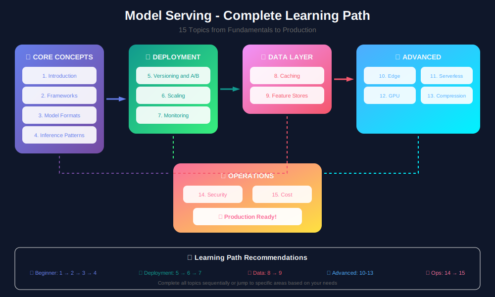
</p>

---

## 📚 Table of Contents

| # | Topic | Description |
|---|-------|-------------|
| 1 | [Introduction to Model Serving](./01_introduction/) | Fundamentals, concepts, and serving paradigms |
| 2 | [Serving Frameworks](./02_serving_frameworks/) | Flask, FastAPI, TF Serving, TorchServe, Triton |
| 3 | [Model Formats & Optimization](./03_model_formats/) | ONNX, TensorRT, OpenVINO, model conversion |
| 4 | [Inference Patterns](./04_inference_patterns/) | Batch vs real-time, sync vs async serving |
| 5 | [Model Versioning & A/B Testing](./05_versioning_ab_testing/) | Version control, canary deployments, experiments |
| 6 | [Scaling & Load Balancing](./06_scaling_load_balancing/) | Horizontal scaling, autoscaling, load distribution |
| 7 | [Monitoring & Observability](./07_monitoring_observability/) | Metrics, logging, alerting, model drift detection |
| 8 | [Caching Strategies](./08_caching_strategies/) | Response caching, feature caching, embedding caches |
| 9 | [Feature Stores](./09_feature_stores/) | Online/offline stores, feature pipelines, Feast |
| 10 | [Edge Deployment](./10_edge_deployment/) | Mobile, IoT, browser-based inference |
| 11 | [Serverless Serving](./11_serverless_serving/) | AWS Lambda, Cloud Functions, cold starts |
| 12 | [GPU Optimization](./12_gpu_optimization/) | CUDA, batching, multi-GPU, GPU sharing |
| 13 | [Model Compression](./13_model_compression/) | Quantization, pruning, knowledge distillation |
| 14 | [Security & Privacy](./14_security_privacy/) | Model protection, secure inference, federated learning |
| 15 | [Cost Optimization](./15_cost_optimization/) | Resource management, spot instances, right-sizing |

---

## 🏗️ High-Level Architecture

<p align="center">
  
</p>

---

## 📊 Serving Paradigms

<p align="center">
  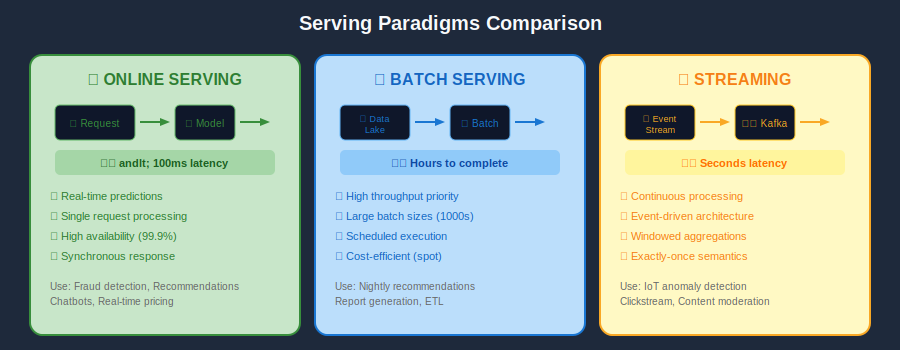
</p>

---

## 🛠️ Serving Frameworks

<p align="center">
  
</p>

---

## 🔀 Deployment Strategies

<p align="center">
  
</p>

---

## 🔄 Model Lifecycle

<p align="center">
  
</p>

---

## 📈 Performance Metrics

<p align="center">
  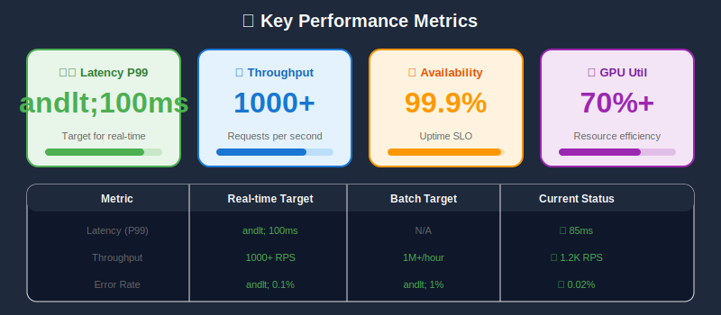
</p>

---

## 💰 Cost Distribution

<p align="center">
  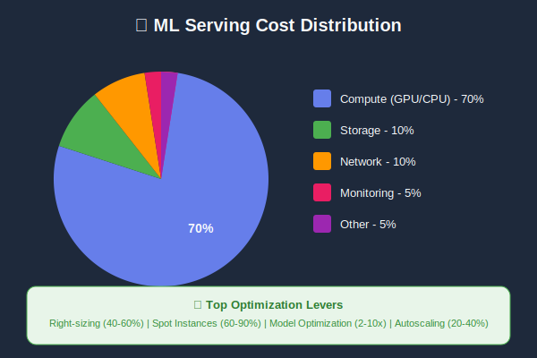
</p>

---

## 🎯 Learning Path (Mermaid)

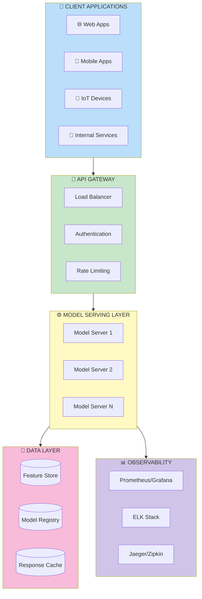

---

## 📊 Request Flow

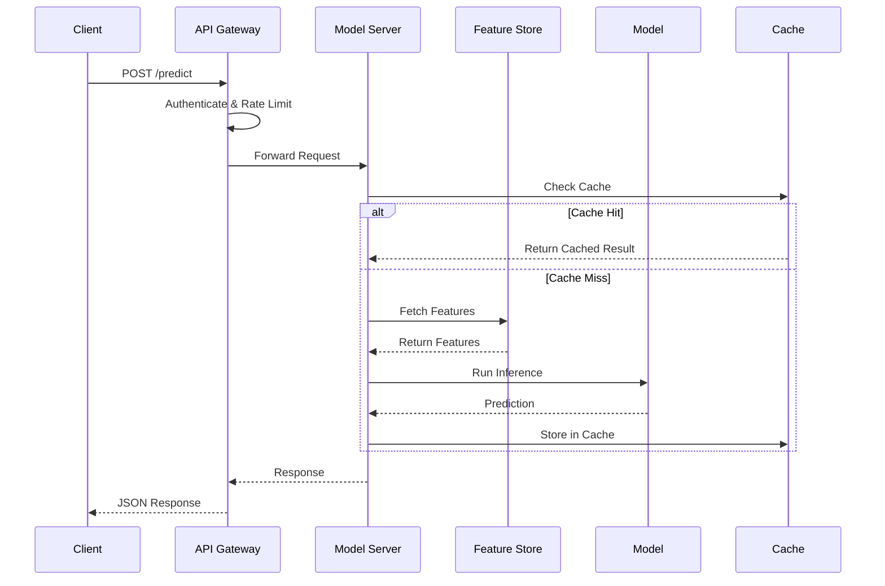

---

## 🔄 Model Lifecycle

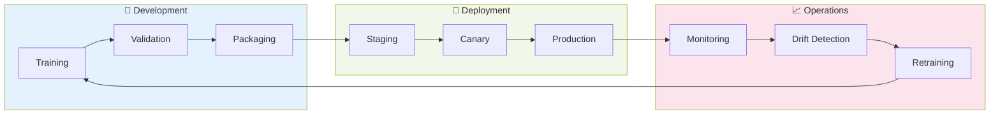

---

## 🔑 Key Concepts

### Latency vs Throughput Trade-off

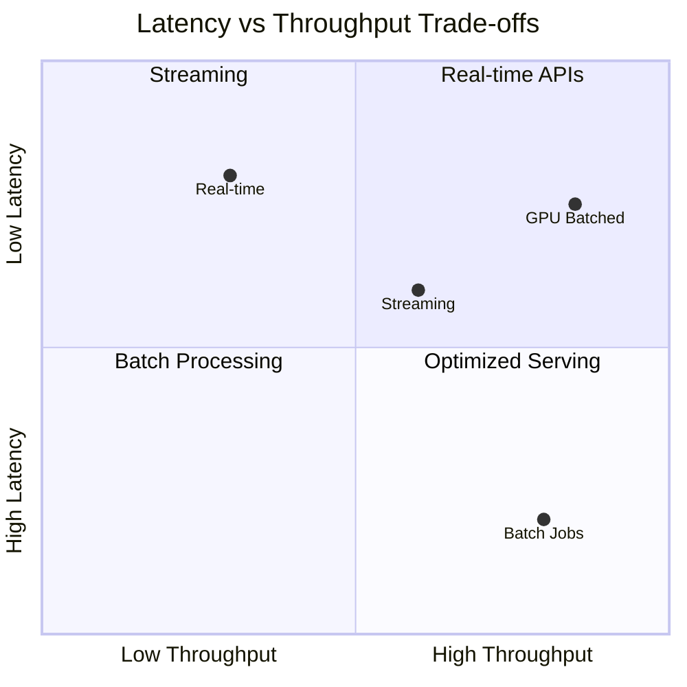

### Serving Patterns Comparison

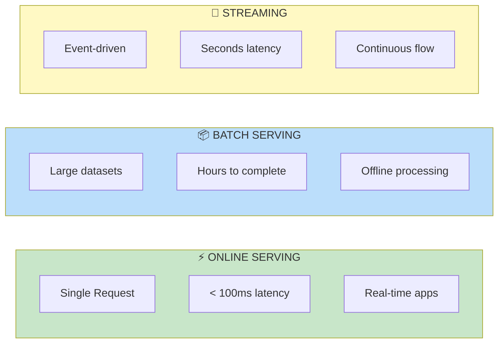

---

## 🛠️ Technology Stack

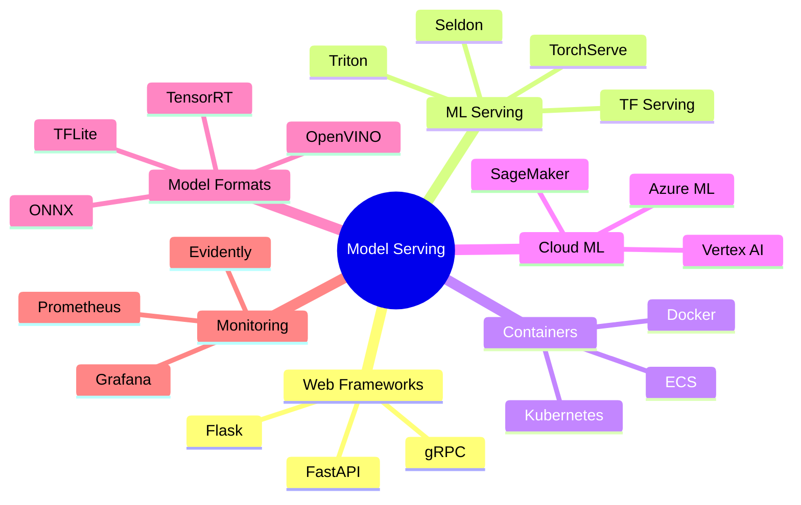

---

## 📈 Performance Metrics

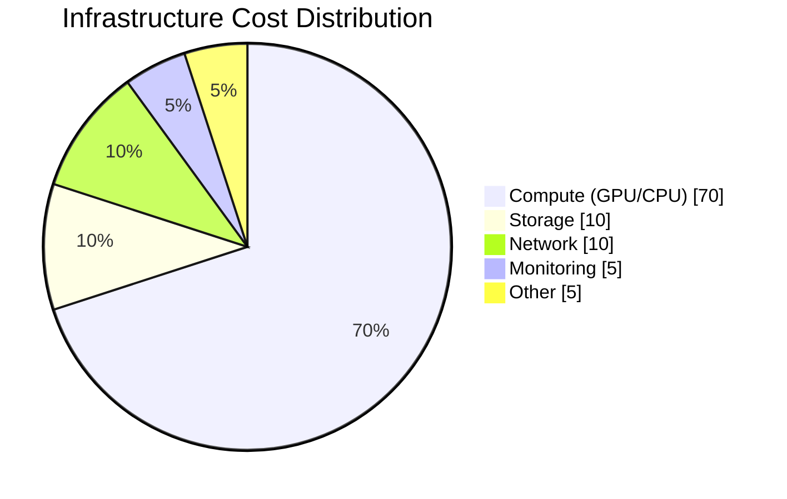

| Metric | Target (Real-time) | Target (Batch) |
|--------|-------------------|----------------|
| Latency (P99) | < 100ms | N/A |
| Throughput | 1000+ RPS | Millions/hour |
| Availability | 99.9%+ | 99%+ |
| GPU Utilization | 70%+ | 90%+ |

---

## 🔀 Deployment Strategies

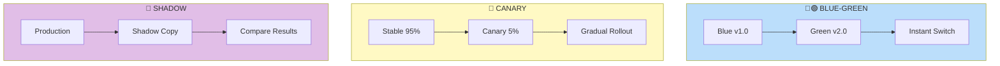

---

## 🚦 Quick Start

```bash
# Navigate to any topic
cd 01_introduction/

# Read the detailed blog content
cat README.md

# Run example code (where applicable)
python examples/basic_server.py
```

---

## 📖 How to Use This Guide

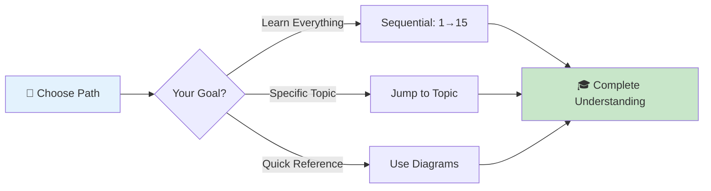

1. **Sequential Learning**: Follow topics 1-15 in order for comprehensive understanding
2. **Reference Mode**: Jump to specific topics as needed for your current project
3. **Hands-on Practice**: Each topic includes code examples and exercises
4. **Deep Dives**: Follow links to external resources for advanced topics

---

## 🎯 Topic Overview Map

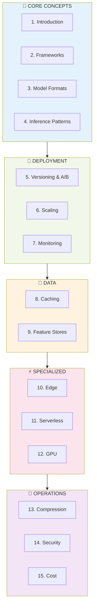

---

## 🤝 Contributing

Each topic follows a consistent structure:
- ✅ Conceptual overview with Mermaid diagrams
- ✅ Real-world use cases
- ✅ Code examples with comments
- ✅ Best practices and anti-patterns
- ✅ Further reading and resources

---

*Last Updated: January 2026*

---

<div align="center">

**[⬆ Back to Top](#)** | **[📚 Main Repository](https://github.com/Gaurav14cs17/ml_system_design)**

Made with 💜 by [Gaurav14cs17](https://github.com/Gaurav14cs17)

</div>
