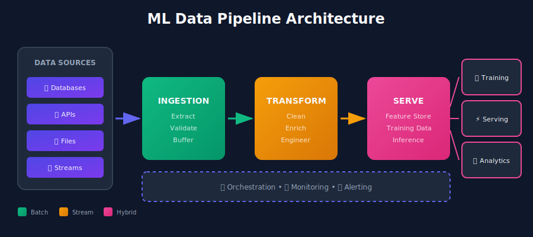
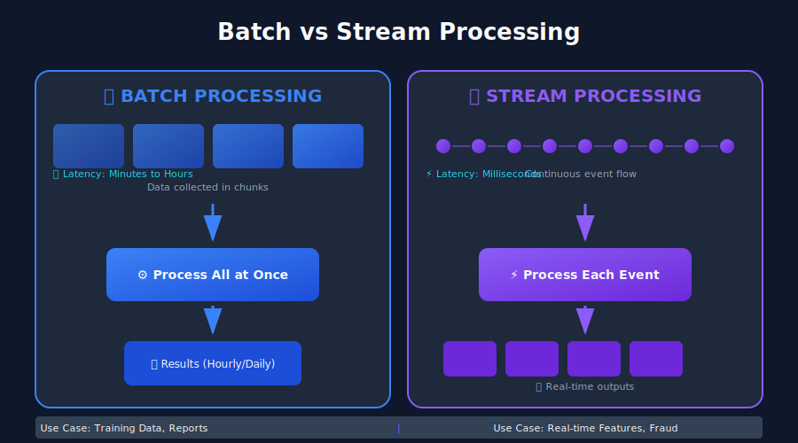
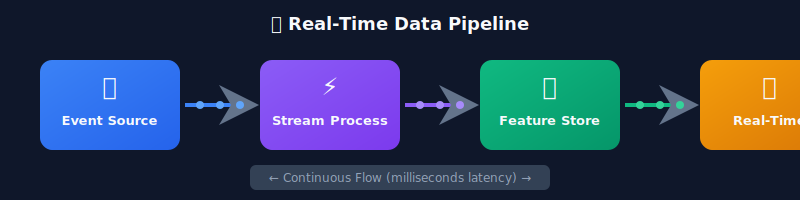
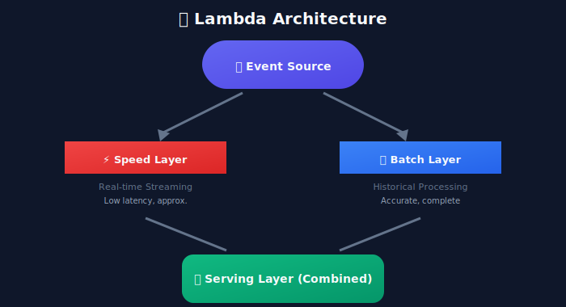
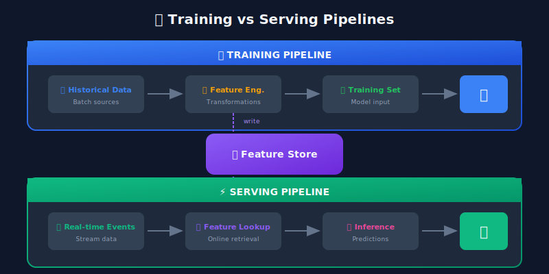
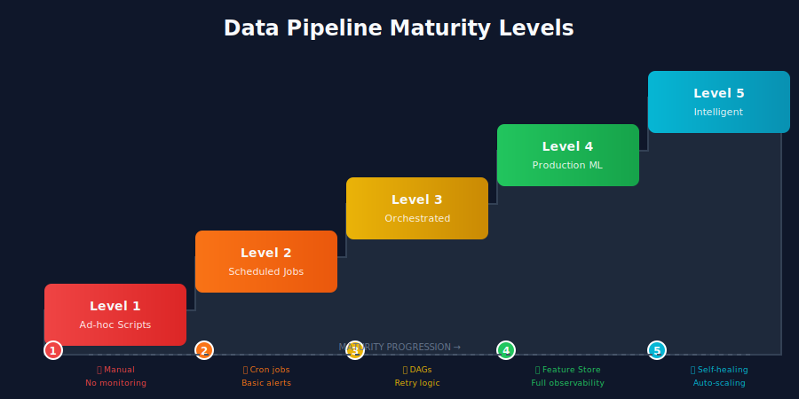

# Introduction to Data Pipelines in ML Systems

## 🎯 What is a Data Pipeline?

A **data pipeline** is an automated system that moves, transforms, and processes data from one or more sources to a destination where it can be used for analysis, machine learning, or other applications. Think of it as a sophisticated assembly line for data.



---

## 📐 Mathematical Framework for Data Pipelines

### Formal Definition

A data pipeline can be formally defined as a **directed acyclic graph (DAG)** of transformations:

```math
\mathcal{P} = (V, E, T)

```

where:
- $V = \{v\_1, v\_2, ..., v\_n\}$ is the set of **data nodes** (datasets)
- $E \subseteq V \times V$ is the set of **directed edges** representing data flow
- $T = \{t\_1, t\_2, ..., t\_m\}$ is the set of **transformation functions**

Each transformation $t\_i: D\_{in} \rightarrow D\_{out}$ maps input data to output data.

### Pipeline Composition

Pipelines compose through function composition. For transformations $f$ and $g$:

```math
(g \circ f)(D) = g(f(D))

```

This composition must satisfy the **closure property** — output schema of $f$ must match input schema of $g$.

### Data Flow Algebra

The flow of data through a pipeline follows algebraic rules:

**Union** (combining sources):

```math
D_{combined} = D_1 \cup D_2

```

**Filter** (selection):

```math
D_{filtered} = \sigma_{\phi}(D) = \{d \in D : \phi(d) = \text{true}\}

```

**Projection** (column selection):

```math
D_{projected} = \pi_{A_1, A_2, ..., A_k}(D)

```

**Join** (combining on keys):

```math
D_1 \bowtie_{key} D_2 = \{(d_1, d_2) : d_1.key = d_2.key\}

```

### Latency and Throughput Model

Pipeline performance is characterized by:

**End-to-End Latency** — time for a single record:

```math
L_{total} = \sum_{i=1}^{n} L_i + \sum_{j=1}^{m} Q_j

```

where $L\_i$ is processing latency at stage $i$ and $Q\_j$ is queueing delay.

**Throughput** — records per unit time:

```math
\Theta = \min_{i} \frac{P_i}{S_i}

```

where $P\_i$ is parallelism and $S\_i$ is processing time per record at stage $i$.

**Little's Law** relates these:

```math
L = \lambda \cdot W

```

where $L$ = items in system, $\lambda$ = arrival rate, $W$ = wait time.

---

## 🤔 Why Are Data Pipelines Critical for ML?

### The Reality of ML Projects

> "Data is the fuel that powers machine learning. Without a robust pipeline, your ML engine will sputter and fail."

Consider this statistic: **80-90% of time in ML projects is spent on data-related tasks**. This includes:

- Collecting data from various sources
- Cleaning and preprocessing
- Feature engineering
- Ensuring data quality
- Managing data versions

### The Cost of Bad Data

| Issue | Impact |
|-------|--------|
| Missing values | Model training failures, biased predictions |
| Inconsistent formats | Integration errors, delayed deployments |
| Stale data | Outdated predictions, poor user experience |
| Data drift | Model degradation, incorrect business decisions |

## 🏗️ Anatomy of an ML Data Pipeline

### Core Components

```python
# Conceptual representation of pipeline stages
class MLDataPipeline:
    def __init__(self):
        self.stages = [
            "data_ingestion",      # Collect from sources
            "data_validation",     # Check quality & schema
            "data_transformation", # Clean, normalize, encode
            "feature_engineering", # Create ML features
            "feature_store",       # Store & serve features
            "model_training_data", # Prepare training sets
            "serving_data"         # Real-time inference data
        ]

    def run(self, data):
        for stage in self.stages:
            data = self.execute_stage(stage, data)
        return data

```

### 1. Data Sources Layer

ML pipelines typically ingest from multiple sources:

- **Structured Data**: Databases (PostgreSQL, MySQL), Data Warehouses (Snowflake, BigQuery)
- **Semi-Structured**: JSON/XML APIs, Log files, NoSQL (MongoDB, Cassandra)
- **Unstructured**: Images, Videos, Audio, Text documents
- **Streaming**: Kafka, Kinesis, Pub/Sub, Event buses
- **Third-Party**: External APIs, Partner data feeds

### 2. Ingestion Layer

The ingestion layer handles:

```python
# Example: Multi-source ingestion
class DataIngestionLayer:
    def ingest_batch(self, source_config):
        """Periodic bulk data loading"""
        if source_config.type == "database":
            return self.jdbc_extract(source_config)
        elif source_config.type == "api":
            return self.api_fetch(source_config)
        elif source_config.type == "file":
            return self.file_read(source_config)

    def ingest_stream(self, stream_config):
        """Real-time continuous ingestion"""
        consumer = KafkaConsumer(stream_config.topic)
        for message in consumer:
            yield self.process_message(message)

```

### 3. Storage Layer

Different storage solutions for different needs:

| Storage Type | Use Case | Examples |
|--------------|----------|----------|
| Data Lake | Raw, unprocessed data | S3, ADLS, GCS |
| Data Warehouse | Structured, analytical | Snowflake, BigQuery, Redshift |
| Feature Store | ML-ready features | Feast, Tecton, Hopsworks |
| Model Registry | Trained models | MLflow, Weights & Biases |

### 4. Processing Layer

```python
# Transformation patterns
class DataProcessor:
    def clean(self, df):
        """Remove duplicates, handle nulls"""
        df = df.drop_duplicates()
        df = df.fillna(self.default_values)
        return df

    def normalize(self, df):
        """Standardize formats and scales"""
        for col in self.numeric_cols:
            df[col] = (df[col] - df[col].mean()) / df[col].std()
        return df

    def engineer_features(self, df):
        """Create derived features"""
        df['user_engagement'] = df['clicks'] / df['impressions']
        df['recency_score'] = self.compute_recency(df['last_activity'])
        return df

```

## 📊 Types of Data Pipelines



### Mathematical Models of Processing Paradigms

Before diving into implementations, let's understand the theoretical models:

#### Bounded vs Unbounded Data

- **Bounded Data** $D\_B$: Finite dataset with known cardinality $|D\_B| < \infty$
- **Unbounded Data** $D\_U$: Infinite stream where $|D\_U| \rightarrow \infty$ over time

This distinction fundamentally shapes processing strategies.

#### Time Semantics

Two critical time concepts in data processing:

**Event Time** $t\_e$: When the event actually occurred

```math
t_e = \text{timestamp embedded in event}

```

**Processing Time** $t\_p$: When the system processes the event

```math
t_p = \text{current system time}

```

**Skew**: The difference between them

```math
\Delta t = t_p - t_e

```

Event time processing requires **watermarks** — markers indicating "all events up to time $W$ have arrived":

```math
W(t_p) = \max(t_e) - \text{allowed\_lateness}

```

### Batch Pipelines

**Characteristics:**
- Process data in scheduled intervals (hourly, daily, weekly)
- Handle large volumes efficiently
- Higher latency but simpler to implement

**Mathematical Model:**
For a batch window $[t\_1, t\_2]$:

```math
D_{batch} = \{d \in D : t_1 \leq t_e(d) < t_2\}

```

Processing applies a function $f$ to the entire batch:

```math
R = f(D_{batch})

```

**Complexity**: $O(|D\_{batch}|)$ time, requires $O(|D\_{batch}|)$ memory for full-batch aggregations.

**Use Cases:**
- Training data preparation
- Historical analytics
- Periodic reporting
- Model retraining

### Streaming Pipelines

**Characteristics:**
- Process data in real-time or near-real-time
- Handle continuous data flows
- Lower latency, higher complexity

**Mathematical Model:**
Events arrive as a sequence $(e\_1, e\_2, e\_3, ...)$ with inter-arrival times following some distribution.

For **Poisson arrivals** (common model):

```math
P(N(t) = k) = \frac{(\lambda t)^k e^{-\lambda t}}{k!}

```

where $\lambda$ is the arrival rate.

**Windowed Aggregations:**

*Tumbling window* of size $w$:

```math
W_k = \{d : k \cdot w \leq t_e(d) < (k+1) \cdot w\}

```

*Sliding window* with size $w$ and slide $s$:

```math
W_{k} = \{d : k \cdot s \leq t_e(d) < k \cdot s + w\}

```

*Session window* with gap $g$:

```math
W_{session} = \{d_1, ..., d_n\} \text{ where } t_e(d_{i+1}) - t_e(d_i) < g

```



**Use Cases:**
- Real-time recommendations
- Fraud detection
- Live personalization
- IoT sensor processing

### Hybrid (Lambda/Kappa) Architecture

Modern ML systems often combine both:



## 🔧 Key Design Principles

### Mathematical Foundations of Reliable Pipelines

The following principles are not just best practices — they have rigorous mathematical foundations that guarantee correctness.

### 1. Idempotency

> Running the same pipeline multiple times should produce the same result.

**Formal Definition:**
A function $f$ is **idempotent** if:

```math
f(f(x)) = f(x)

```

For pipeline operations, this extends to:

```math
\text{apply}(D, op, n) = \text{apply}(D, op, 1) \quad \forall n \geq 1

```

**Why It Matters:**
In distributed systems with retries, an operation may execute multiple times. Without idempotency:
- **With retries**: Data can be duplicated or corrupted
- **With idempotency**: Safe to retry without side effects

**Achieving Idempotency:**
1. **Keyed upserts** instead of appends: $\text{UPSERT}(key, value)$
2. **Partition overwrites**: Replace entire partition rather than append
3. **Deterministic processing**: Same input always produces same output

```python
# Good: Idempotent operation
def process_partition(date, data):
    # Clear existing data for this partition
    delete_partition(date)
    # Write new data
    write_partition(date, data)

# Bad: Non-idempotent (appends cause duplicates)
def process_data(data):
    append_to_table(data)  # Running twice = duplicate data!

```

### 2. Fault Tolerance

```python
# Retry logic with exponential backoff
import time
from functools import wraps

def retry_with_backoff(max_retries=3, base_delay=1):
    def decorator(func):
        @wraps(func)
        def wrapper(*args, **kwargs):
            for attempt in range(max_retries):
                try:
                    return func(*args, **kwargs)
                except Exception as e:
                    if attempt == max_retries - 1:
                        raise
                    delay = base_delay * (2 ** attempt)
                    time.sleep(delay)
        return wrapper
    return decorator

@retry_with_backoff(max_retries=3)
def fetch_data_from_api(endpoint):
    response = requests.get(endpoint)
    response.raise_for_status()
    return response.json()

```

### 3. Scalability

```python
# Horizontal scaling with partitioning
class ScalablePipeline:
    def process_large_dataset(self, dataset):
        # Partition data for parallel processing
        partitions = self.partition_by(dataset, key='date')

        # Process partitions in parallel
        with ProcessPoolExecutor(max_workers=10) as executor:
            results = executor.map(self.process_partition, partitions)

        return self.combine_results(results)

```

### 4. Observability

```python
# Comprehensive logging and metrics
import logging
from prometheus_client import Counter, Histogram

records_processed = Counter('records_processed_total', 'Total records processed')
processing_time = Histogram('processing_duration_seconds', 'Time spent processing')

class ObservablePipeline:
    def process(self, data):
        with processing_time.time():
            try:
                result = self._transform(data)
                records_processed.inc(len(data))
                logging.info(f"Processed {len(data)} records successfully")
                return result
            except Exception as e:
                logging.error(f"Pipeline failed: {str(e)}")
                raise

```

## 🛠️ Common Tools & Technologies

### Orchestration

| Tool | Best For | Learning Curve |
|------|----------|----------------|
| Apache Airflow | Complex DAGs, mature ecosystem | Medium |
| Prefect | Modern Python-native workflows | Low |
| Dagster | Data-aware orchestration | Medium |
| Luigi | Simple dependencies | Low |

### Processing Engines

| Engine | Type | Scale |
|--------|------|-------|
| Apache Spark | Batch + Streaming | Massive |
| Apache Flink | Streaming-first | Large |
| Dask | Python-native parallel | Medium |
| Pandas | Single-node | Small |

### Storage

| Solution | Type | Use Case |
|----------|------|----------|
| Delta Lake | Lakehouse | ACID on data lakes |
| Apache Iceberg | Table format | Time travel, schema evolution |
| Apache Hudi | Streaming lakehouse | Upserts, CDC |

## 💡 ML-Specific Considerations

### Training vs Serving Pipelines



### Training-Serving Skew

One of the most common issues in ML systems:

```python
# Example of training-serving skew
# Training time (batch processing)
def training_preprocessing(data):
    data['normalized'] = (data['value'] - data['value'].mean()) / data['value'].std()
    return data

# Serving time (real-time) - WRONG!
def serving_preprocessing(value):
    # Using different statistics leads to skew!
    return (value - running_mean) / running_std

# CORRECT: Use saved statistics from training
def serving_preprocessing_correct(value, saved_stats):
    return (value - saved_stats['mean']) / saved_stats['std']

```

## 📈 Maturity Levels of Data Pipelines



### Level 1: Ad-hoc Scripts
- Manual execution
- No monitoring
- No version control
- ❌ Not production-ready

### Level 2: Scheduled Jobs
- Basic scheduling (cron)
- Simple error notifications
- Source control
- ⚠️ Minimal production use

### Level 3: Orchestrated Pipelines
- DAG-based orchestration
- Retry logic
- Basic monitoring
- ✅ Production-ready for batch

### Level 4: Production ML Pipelines
- Full observability
- Data versioning
- Feature stores
- CI/CD integration
- ✅ Enterprise ML-ready

### Level 5: Intelligent Pipelines
- Self-healing capabilities
- Auto-scaling
- ML-powered optimization
- Drift detection
- 🚀 Advanced ML platform

## 🎓 Key Takeaways

1. **Data pipelines are the backbone of ML systems** - They determine data quality, freshness, and reliability

2. **Choose the right paradigm** - Batch for training data, streaming for real-time features, hybrid for comprehensive solutions

3. **Design for failure** - Implement idempotency, retries, and graceful degradation

4. **Invest in observability** - You can't fix what you can't see

5. **Mind the gap** - Training-serving skew is a silent killer of ML performance

## 📚 Further Reading

- [Designing Data-Intensive Applications](https://dataintensive.net/) by Martin Kleppmann
- [The Data Engineering Cookbook](https://github.com/andkret/Cookbook)
- [Fundamentals of Data Engineering](https://www.oreilly.com/library/view/fundamentals-of-data/9781098108298/)

---

*Next Chapter: [Data Ingestion Patterns →](../02_data_ingestion/README.md)*

---

<div align="center">

**[⬆ Back to Top](#)** | **[📚 Main Repository](https://github.com/Gaurav14cs17/ml_system_design)**

Made with 💜 by [Gaurav14cs17](https://github.com/Gaurav14cs17)

</div>
