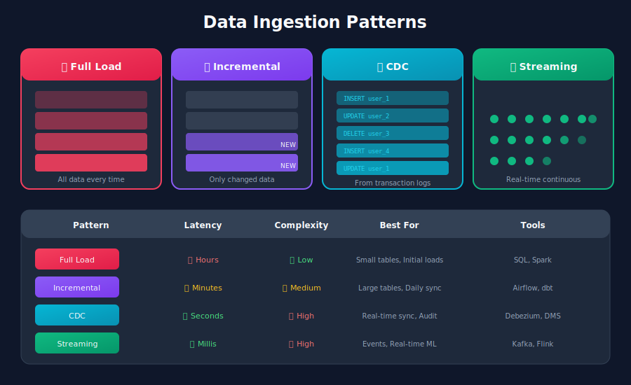
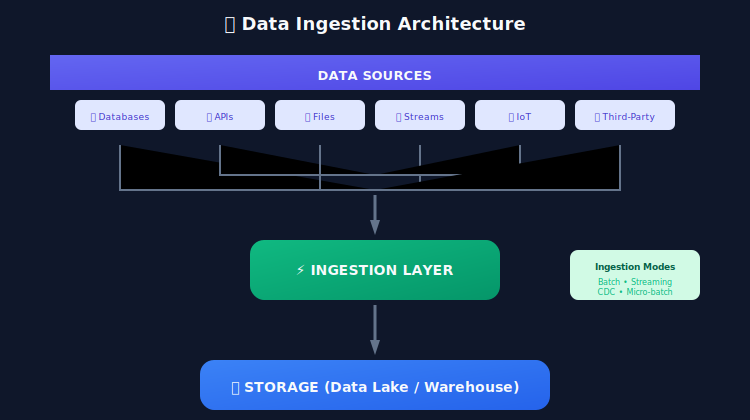
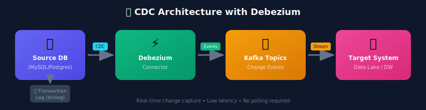
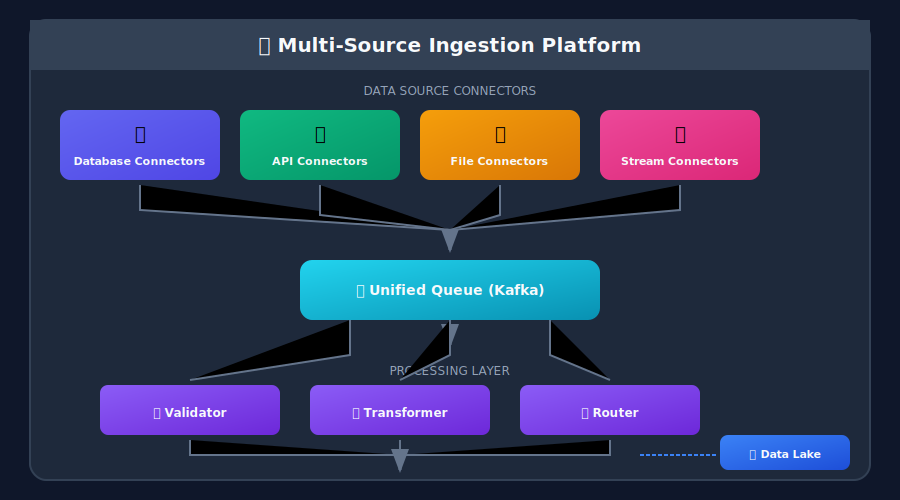

# Data Ingestion Patterns for ML Systems

## 🎯 What is Data Ingestion?

**Data ingestion** is the process of collecting, importing, and loading data from various sources into a storage system where it can be processed and analyzed. It's the entry point of your data pipeline.





---

## 📐 Mathematical Models for Data Ingestion

### Arrival Process Theory

Data arrives according to stochastic processes. Understanding these helps design robust ingestion systems.

#### Poisson Process (Common Model)

Events arrive independently at rate $\lambda$:

$$
P(N(t) = k) = \frac{(\lambda t)^k e^{-\lambda t}}{k!}
$$

**Inter-arrival times** are exponentially distributed:

$$
f(t) = \lambda e^{-\lambda t}, \quad E[T] = \frac{1}{\lambda}
$$

**Memoryless property:** $P(T > s + t | T > s) = P(T > t)$

This means knowing an event hasn't occurred doesn't help predict when it will.

#### Non-Homogeneous Poisson Process

When arrival rate varies with time $\lambda(t)$:

$$
P(N(t_1, t_2) = k) = \frac{\Lambda(t_1, t_2)^k e^{-\Lambda(t_1, t_2)}}{k!}
$$

where $\Lambda(t\_1, t\_2) = \int\_{t\_1}^{t\_2} \lambda(t) dt$.

**Application:** Model daily traffic patterns with peak hours.

### Incremental Ingestion Mathematics

#### Change Detection

For incremental loads, detect changes using:

**Timestamp-based:**

$$
\Delta D = \{d \in D : d.updated\_at > t_{last\_sync}\}
$$

**Hash-based:**

$$
\Delta D = \{d \in D : h(d) \neq h_{stored}(d.id)\}
$$

where $h$ is a hash function (e.g., MD5, SHA-256).

#### Merge (Upsert) Operation

For source $S$ and target $T$ with key $K$:

$$
T' = (T \setminus T_K) \cup S
$$

where $T\_K = \{t \in T : t.K \in S.K\}$ (existing records with matching keys).

**MERGE SQL pattern:**
```
WHEN MATCHED THEN UPDATE
WHEN NOT MATCHED THEN INSERT
```

### CDC (Change Data Capture) Theory

#### Log-Based CDC

Database transaction logs record all changes as an ordered sequence:

$$
\text{Log} = [(op_1, t_1), (op_2, t_2), ..., (op_n, t_n)]
$$

where $op\_i \in \{\text{INSERT}, \text{UPDATE}, \text{DELETE}\}$.

**Serialization:** Log order preserves causality → eventual consistency guaranteed.

#### Change Vector

Each change event contains:

$$
\Delta = (\text{op}, \text{before}, \text{after}, \text{timestamp}, \text{transaction\_id})
$$

**Before-image:** State before change (for UPDATE, DELETE)
**After-image:** State after change (for INSERT, UPDATE)

### Throughput and Backpressure

#### Ingestion Throughput

$$
\Theta_{ingest} = \min(\Theta_{source}, \Theta_{network}, \Theta_{sink})
$$

System throughput is limited by the slowest component.

#### Backpressure Model

When $\lambda\_{arrival} > \mu\_{processing}$:

**Queue growth rate:**

$$
\frac{dQ}{dt} = \lambda - \mu > 0
$$

**Time to overflow:**

$$
t_{overflow} = \frac{Q_{max}}{\lambda - \mu}
$$

**Backpressure strategies:**
1. **Drop**: Discard excess events (lossy)
2. **Buffer**: Queue events (bounded by memory)
3. **Throttle**: Slow down source (requires feedback)

### Exactly-Once Delivery

#### Deduplication Mathematics

For event stream with possible duplicates:

$$
D_{dedup} = \{d \in D : \nexists d' \in D, d'.id = d.id \land d' \prec d\}
$$

Keep only first occurrence of each event ID.

**Bloom Filter for Deduplication:**

Space-efficient probabilistic deduplication:

$$
P(\text{false positive}) \approx \left(1 - e^{-kn/m}\right)^k
$$

where $k$ = hash functions, $n$ = elements seen, $m$ = bits.

**Optimal $k$:** $k^* = \frac{m}{n} \ln 2$

#### Checkpointing

Save progress to enable recovery:

$$
\text{checkpoint} = (\text{offset}, \text{state}, \text{timestamp})
$$

**Recovery:** Resume from last checkpoint, reprocess $[checkpoint, current)$.

**At-least-once + idempotent sink = exactly-once semantics**

### Rate Limiting Theory

For API ingestion with rate limit $R$ (requests/second):

**Token bucket algorithm:**

$$
\text{tokens}(t) = \min(B, \text{tokens}(t-\Delta t) + R \cdot \Delta t)
$$

where $B$ = bucket capacity.

**Request allowed if:** $\text{tokens} \geq 1$

**Burst capacity:** Can make $B$ requests instantly, then sustained $R$ requests/second.

---

## 🔄 Ingestion Patterns

### 1. Full Load (Snapshot)

**Concept:** Extract the complete dataset every time.

```python
class FullLoadIngestion:
    """
    Full load extracts ALL data from source on each run.
    Simple but expensive for large datasets.
    """

    def ingest(self, source_table: str, target_table: str):

        # Step 1: Truncate target (or use write mode 'overwrite')
        self.truncate_table(target_table)

        # Step 2: Load all data from source
        query = f"SELECT * FROM {source_table}"
        data = self.extract(query)

        # Step 3: Write to target
        self.load(data, target_table, mode='overwrite')

        return {"records_loaded": len(data)}
```

**Pros:**
- ✅ Simple to implement
- ✅ Guarantees data consistency
- ✅ No tracking of changes needed

**Cons:**
- ❌ Expensive for large datasets
- ❌ High network/storage costs
- ❌ Longer processing times

**Use Cases:**
- Small reference tables (countries, categories)
- Initial data loads
- When source doesn't support incremental extraction

---

### 2. Incremental Load (Delta)

**Concept:** Extract only data that has changed since the last load.

```python
from datetime import datetime, timedelta

class IncrementalIngestion:
    """
    Incremental load extracts only NEW or MODIFIED records.
    Efficient for large, frequently updated datasets.
    """

    def __init__(self, state_store):
        self.state_store = state_store  # Tracks last sync time

    def ingest(self, source_table: str, target_table: str,
               timestamp_column: str = 'updated_at'):

        # Step 1: Get last sync timestamp
        last_sync = self.state_store.get(f"{source_table}_last_sync")
        if last_sync is None:
            last_sync = datetime(1970, 1, 1)  # Beginning of time

        # Step 2: Extract only changed records
        query = f"""
            SELECT * FROM {source_table}
            WHERE {timestamp_column} > '{last_sync}'
        """
        new_data = self.extract(query)

        # Step 3: Merge/Upsert into target
        self.merge(new_data, target_table, key_columns=['id'])

        # Step 4: Update sync state
        new_sync_time = datetime.utcnow()
        self.state_store.set(f"{source_table}_last_sync", new_sync_time)

        return {"records_loaded": len(new_data)}

    def merge(self, data, target_table, key_columns):
        """
        MERGE (upsert) pattern:
        - INSERT if key doesn't exist
        - UPDATE if key exists
        """

        # SQL MERGE example (conceptual)
        merge_sql = f"""
            MERGE INTO {target_table} AS target
            USING staging_table AS source
            ON target.id = source.id
            WHEN MATCHED THEN UPDATE SET ...
            WHEN NOT MATCHED THEN INSERT ...
        """
        self.execute(merge_sql)
```

**Strategies for Incremental Detection:**

| Strategy | Description | Pros | Cons |
|----------|-------------|------|------|
| Timestamp-based | Use `updated_at` column | Simple, reliable | Requires timestamp column |
| CDC (Change Data Capture) | Capture DB transaction log | Real-time, complete | Complex setup |
| Checksum/Hash | Compare row hashes | Detects any change | Expensive computation |
| Version column | Increment version on change | Simple tracking | Requires schema change |

---

### 3. Change Data Capture (CDC)

**Concept:** Capture and replicate database changes in real-time by reading transaction logs.

```python
from debezium import DebeziumConnector  # Conceptual

class CDCIngestion:
    """
    CDC captures INSERT, UPDATE, DELETE operations from
    database transaction logs in real-time.
    """

    def __init__(self, db_config):
        self.connector = DebeziumConnector(db_config)

    def start_capture(self, source_table: str):
        """Start streaming changes from source table"""

        for change_event in self.connector.stream(source_table):
            self.process_change(change_event)

    def process_change(self, event):
        """
        Change event structure:
        {
            "op": "u",  # c=create, u=update, d=delete
            "before": {"id": 1, "name": "old"},
            "after": {"id": 1, "name": "new"},
            "ts_ms": 1634567890123
        }
        """
        operation = event['op']

        if operation == 'c':  # CREATE
            self.insert_record(event['after'])
        elif operation == 'u':  # UPDATE
            self.update_record(event['after'])
        elif operation == 'd':  # DELETE
            self.delete_record(event['before'])
```

**CDC Architecture with Debezium:**



**Popular CDC Tools:**
- **Debezium** - Open source, Kafka-based
- **AWS DMS** - Managed migration service
- **Fivetran** - SaaS ELT with CDC
- **Airbyte** - Open source data integration

---

### 4. Streaming Ingestion

**Concept:** Continuously ingest data in real-time as events occur.

```python
from kafka import KafkaConsumer
from typing import Callable, Dict
import json

class StreamIngestion:
    """
    Real-time streaming ingestion from message queues.
    """

    def __init__(self, bootstrap_servers: list):
        self.bootstrap_servers = bootstrap_servers

    def consume_stream(
        self,
        topic: str,
        processor: Callable[[Dict], None],
        consumer_group: str = "ml-pipeline"
    ):
        """
        Consume and process stream in real-time.

        Args:
            topic: Kafka topic to consume
            processor: Function to process each message
            consumer_group: Consumer group for offset management
        """
        consumer = KafkaConsumer(
            topic,
            bootstrap_servers=self.bootstrap_servers,
            group_id=consumer_group,
            auto_offset_reset='earliest',
            enable_auto_commit=True,
            value_deserializer=lambda m: json.loads(m.decode('utf-8'))
        )

        for message in consumer:
            try:

                # Process each event
                processor(message.value)

            except Exception as e:

                # Handle failures (dead letter queue, retry, etc.)
                self.handle_failure(message, e)

    def handle_failure(self, message, error):
        """Send failed messages to dead letter queue for review"""
        self.send_to_dlq(message, error)

# Usage example
def process_click_event(event: Dict):
    """Process user click events for ML features"""
    user_id = event['user_id']
    item_id = event['item_id']
    timestamp = event['timestamp']

    # Update real-time features
    update_user_click_count(user_id)
    update_item_popularity(item_id)

    # Store for batch processing
    write_to_feature_store(user_id, item_id, timestamp)

# Start consuming
ingestion = StreamIngestion(['kafka:9092'])
ingestion.consume_stream('user-clicks', process_click_event)
```

---

### 5. API-Based Ingestion

**Concept:** Extract data from REST/GraphQL APIs with pagination and rate limiting.

```python
import requests
import time
from typing import Generator, Dict, List

class APIIngestion:
    """
    Ingest data from REST APIs with pagination and rate limiting.
    """

    def __init__(self, base_url: str, api_key: str):
        self.base_url = base_url
        self.headers = {"Authorization": f"Bearer {api_key}"}
        self.rate_limit_delay = 0.5  # seconds between requests

    def fetch_paginated(
        self,
        endpoint: str,
        page_size: int = 100
    ) -> Generator[Dict, None, None]:
        """
        Fetch all pages from paginated API endpoint.

        Handles:
        - Cursor-based pagination
        - Offset-based pagination
        - Rate limiting
        """
        cursor = None

        while True:

            # Build request with pagination
            params = {"limit": page_size}
            if cursor:
                params["cursor"] = cursor

            # Fetch page
            response = self._make_request(endpoint, params)

            # Yield records
            for record in response.get('data', []):
                yield record

            # Check for next page
            cursor = response.get('next_cursor')
            if not cursor or not response.get('data'):
                break

            # Rate limiting
            time.sleep(self.rate_limit_delay)

    def _make_request(self, endpoint: str, params: Dict) -> Dict:
        """Make API request with retry logic"""
        url = f"{self.base_url}/{endpoint}"

        for attempt in range(3):
            try:
                response = requests.get(
                    url,
                    headers=self.headers,
                    params=params,
                    timeout=30
                )

                if response.status_code == 429:  # Rate limited
                    retry_after = int(response.headers.get('Retry-After', 60))
                    time.sleep(retry_after)
                    continue

                response.raise_for_status()
                return response.json()

            except requests.RequestException as e:
                if attempt == 2:
                    raise
                time.sleep(2 ** attempt)  # Exponential backoff

        raise Exception("Max retries exceeded")

    def ingest_to_storage(self, endpoint: str, target_path: str):
        """Full ingestion pipeline from API to storage"""
        records = list(self.fetch_paginated(endpoint))

        # Convert to DataFrame and save
        import pandas as pd
        df = pd.DataFrame(records)
        df.to_parquet(target_path, index=False)

        return {"records_ingested": len(records)}

# Example: Ingest user data from CRM API
api = APIIngestion(
    base_url="https://api.crm.example.com/v1",
    api_key="your-api-key"
)

for user in api.fetch_paginated("users"):
    print(f"Ingested user: {user['id']}")
```

---

### 6. File-Based Ingestion

**Concept:** Ingest data from files (CSV, JSON, Parquet, etc.) from file systems or object storage.

```python
import boto3
from pathlib import Path
import pandas as pd
from typing import List, Iterator
import pyarrow.parquet as pq

class FileIngestion:
    """
    Ingest data from various file formats in object storage.
    """

    def __init__(self, bucket: str):
        self.s3 = boto3.client('s3')
        self.bucket = bucket

    def list_new_files(
        self,
        prefix: str,
        last_processed_key: str = None
    ) -> List[str]:
        """List files newer than last processed"""
        paginator = self.s3.get_paginator('list_objects_v2')

        new_files = []
        for page in paginator.paginate(Bucket=self.bucket, Prefix=prefix):
            for obj in page.get('Contents', []):
                if last_processed_key is None or obj['Key'] > last_processed_key:
                    new_files.append(obj['Key'])

        return sorted(new_files)

    def read_file(self, key: str) -> pd.DataFrame:
        """Read file based on extension"""
        extension = Path(key).suffix.lower()

        path = f"s3://{self.bucket}/{key}"

        if extension == '.csv':
            return pd.read_csv(path)
        elif extension == '.json':
            return pd.read_json(path, lines=True)
        elif extension == '.parquet':
            return pd.read_parquet(path)
        else:
            raise ValueError(f"Unsupported format: {extension}")

    def ingest_directory(
        self,
        prefix: str,
        target_table: str,
        checkpoint_key: str = None
    ) -> dict:
        """Ingest all new files in directory"""

        files = self.list_new_files(prefix, checkpoint_key)
        total_records = 0

        for file_key in files:
            df = self.read_file(file_key)
            self.write_to_table(df, target_table, mode='append')
            total_records += len(df)

            # Update checkpoint
            self.update_checkpoint(prefix, file_key)

        return {
            "files_processed": len(files),
            "records_ingested": total_records
        }

    def stream_large_file(
        self,
        key: str,
        chunk_size: int = 100000
    ) -> Iterator[pd.DataFrame]:
        """Stream large files in chunks to avoid memory issues"""

        path = f"s3://{self.bucket}/{key}"

        # For Parquet files, use row group streaming
        parquet_file = pq.ParquetFile(path)
        for batch in parquet_file.iter_batches(batch_size=chunk_size):
            yield batch.to_pandas()
```

---

## 🔧 Handling Common Challenges

### 1. Schema Evolution

```python
from dataclasses import dataclass
from typing import Dict, Any, Optional

@dataclass
class SchemaRegistry:
    """Handle schema evolution in data ingestion"""

    def __init__(self, registry_url: str):
        self.registry_url = registry_url

    def validate_and_evolve(
        self,
        data: Dict[str, Any],
        schema_id: str
    ) -> Dict[str, Any]:
        """
        Validate incoming data and handle schema changes.

        Strategies:
        1. Add new columns with defaults
        2. Convert types with casting
        3. Reject breaking changes
        """
        current_schema = self.get_schema(schema_id)

        # Check for new fields
        new_fields = set(data.keys()) - set(current_schema.fields)
        if new_fields:
            self.evolve_schema(schema_id, new_fields, data)

        # Check for missing required fields
        missing = set(current_schema.required) - set(data.keys())
        if missing:
            data = self.apply_defaults(data, missing, current_schema)

        return data

# Example: Handling schema changes gracefully
class FlexibleIngestion:
    def ingest_with_schema_evolution(self, data: dict, target: str):
        """
        Merge new data while handling schema changes.
        Uses Delta Lake's schema evolution capability.
        """
        from delta import DeltaTable

        # Write with schema merge enabled
        spark.createDataFrame([data]).write \
            .format("delta") \
            .mode("append") \
            .option("mergeSchema", "true") \
            .save(target)
```

### 2. Data Quality at Ingestion

```python
from pydantic import BaseModel, validator
from typing import Optional
from datetime import datetime

class UserEventSchema(BaseModel):
    """Validate data at ingestion time"""

    user_id: str
    event_type: str
    timestamp: datetime
    properties: Optional[dict] = {}

    @validator('user_id')
    def validate_user_id(cls, v):
        if not v or len(v) < 5:
            raise ValueError('Invalid user_id')
        return v

    @validator('event_type')
    def validate_event_type(cls, v):
        valid_types = ['click', 'view', 'purchase', 'signup']
        if v not in valid_types:
            raise ValueError(f'event_type must be one of {valid_types}')
        return v

class QualityAwareIngestion:
    def ingest_with_validation(self, raw_data: list) -> dict:
        """Ingest with quality checks and quarantine bad records"""

        valid_records = []
        quarantine_records = []

        for record in raw_data:
            try:
                validated = UserEventSchema(**record)
                valid_records.append(validated.dict())
            except Exception as e:
                quarantine_records.append({
                    "record": record,
                    "error": str(e),
                    "timestamp": datetime.utcnow()
                })

        # Write valid records
        self.write_to_target(valid_records)

        # Write quarantine for investigation
        if quarantine_records:
            self.write_to_quarantine(quarantine_records)

        return {
            "valid": len(valid_records),
            "quarantined": len(quarantine_records)
        }
```

### 3. Exactly-Once Semantics

```python
class ExactlyOnceIngestion:
    """
    Achieve exactly-once processing semantics.

    Strategies:
    1. Idempotent writes (use unique keys)
    2. Transactional processing
    3. Offset/checkpoint management
    """

    def __init__(self, checkpoint_store):
        self.checkpoint_store = checkpoint_store

    def process_with_exactly_once(self, source_id: str, records: list):
        """Process records with exactly-once guarantees"""

        # Get last processed position
        last_offset = self.checkpoint_store.get(source_id)

        # Filter already processed records
        new_records = [r for r in records if r['offset'] > last_offset]

        if not new_records:
            return {"status": "no_new_records"}

        # Begin transaction
        with self.begin_transaction() as txn:
            try:

                # Write records
                for record in new_records:
                    self.write_record(record, txn)

                # Update checkpoint atomically with data
                new_offset = max(r['offset'] for r in new_records)
                self.checkpoint_store.set(source_id, new_offset, txn)

                # Commit transaction
                txn.commit()

            except Exception as e:
                txn.rollback()
                raise

        return {"processed": len(new_records)}
```

---

## 📊 Ingestion Patterns Comparison

| Pattern | Latency | Complexity | Cost | Use Case |
|---------|---------|------------|------|----------|
| Full Load | High | Low | High | Small tables, initial loads |
| Incremental | Medium | Medium | Medium | Large tables, daily updates |
| CDC | Low | High | Medium | Real-time sync, event sourcing |
| Streaming | Very Low | High | Variable | Real-time ML features |
| API | Variable | Medium | Variable | Third-party integrations |
| File | High | Low | Low | Batch uploads, data dumps |

---

## 🏗️ Production Architecture

### Multi-Source Ingestion Platform



---

## 🎓 Key Takeaways

1. **Choose the right pattern** for your latency, volume, and complexity requirements

2. **Implement idempotency** to handle retries and failures gracefully

3. **Validate early** - catch data quality issues at ingestion, not downstream

4. **Handle schema evolution** - data schemas will change, plan for it

5. **Monitor everything** - track latency, volume, errors, and data quality metrics

---

*Next Chapter: [Data Validation & Quality →](../03_data_validation_quality/README.md)*

---

<div align="center">

**[⬆ Back to Top](#)** | **[📚 Main Repository](https://github.com/Gaurav14cs17/ml_system_design)**

Made with 💜 by [Gaurav14cs17](https://github.com/Gaurav14cs17)

</div>
