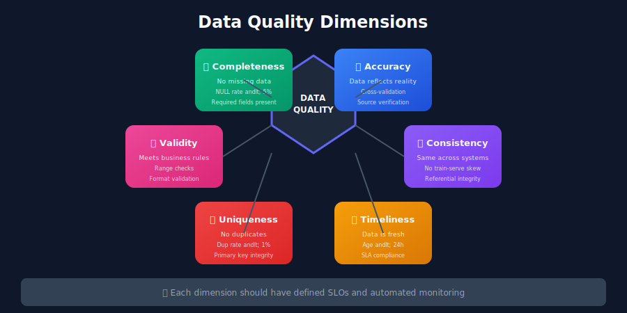
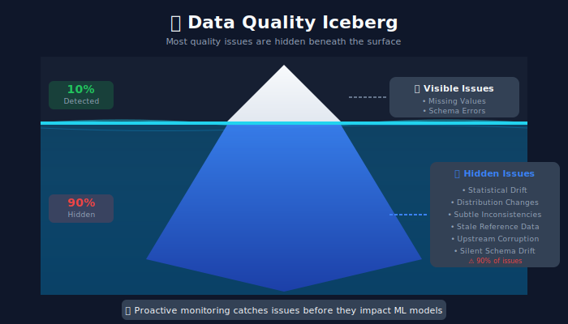
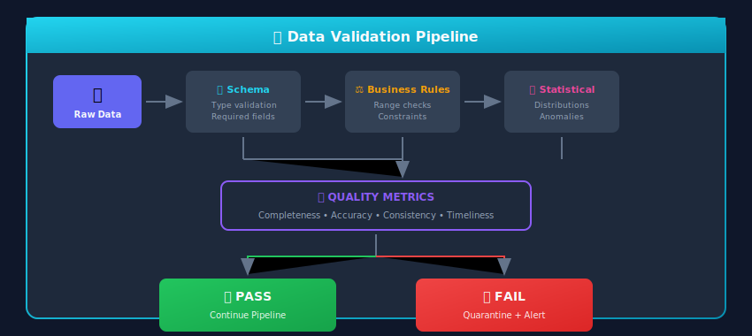

# Data Validation & Quality for ML Systems



## 🎯 Why Data Quality Matters in ML

> "Garbage in, garbage out" — This age-old computing adage is especially true for machine learning systems.

Unlike traditional software where bugs cause immediate failures, data quality issues in ML silently degrade model performance, leading to:

- **Incorrect predictions** affecting user experience

- **Biased models** causing fairness issues

- **Revenue loss** from poor recommendations

- **Compliance violations** in regulated industries



---

## 📐 Mathematical Framework for Data Quality

### Formal Quality Metrics

Data quality can be rigorously measured using mathematical definitions:

#### Completeness

**Definition:** The ratio of present (non-null) values to total expected values.

$$C(D, A) = \frac{|\{d \in D : d.A \neq \text{NULL}\}|}{|D|}$$

For multiple attributes $A_1, ..., A_k$ with weights $w_i$:

$$C_{weighted}(D) = \sum_{i=1}^{k} w_i \cdot C(D, A_i), \quad \sum w_i = 1$$

#### Accuracy

**Definition:** The proportion of data points that correctly represent reality.

$$\text{Acc}(D, D^*) = \frac{|\{d \in D : d = d^*\}|}{|D|}$$

where $D^*$ is the ground truth dataset.

When ground truth is unavailable, use **proxy accuracy** via cross-validation:

$$\hat{\text{Acc}} = 1 - \frac{1}{n}\sum_{i=1}^{n}|y_i - \hat{y}_i|$$

#### Consistency

**Definition:** Data satisfies all integrity constraints.

For constraint set $\Phi = \{\phi_1, \phi_2, ..., \phi_m\}$:

$$\text{Cons}(D) = \frac{|\{d \in D : \forall \phi_i \in \Phi, \phi_i(d) = \text{true}\}|}{|D|}$$

Common constraints:

- **Domain**: $\phi_{domain}(d) = d.age \in [0, 150]$

- **Referential**: $\phi_{ref}(d) = d.user_id \in \text{Users}$

- **Functional dependency**: $d_1.zip = d_2.zip \Rightarrow d_1.city = d_2.city$

#### Timeliness/Freshness

**Definition:** How current the data is relative to expectations.

**Age-based freshness:**

$$F(D) = 1 - \frac{\max(\text{now} - t_{latest}, 0)}{T_{max}}$$

**Exponential decay model:**

$$F(D) = e^{-\lambda \cdot \Delta t}$$

where $\lambda = \frac{\ln(2)}{\text{half_life}}$ is the decay constant.

### Statistical Distribution Tests

#### Kolmogorov-Smirnov Test (Continuous Variables)

Measures the maximum distance between two cumulative distribution functions:

$$D_{KS} = \sup_x |F_{reference}(x) - F_{new}(x)|$$

**Null hypothesis** $H_0$: Both samples come from the same distribution.

**Decision rule:** Reject $H_0$ if $D_{KS} > D_{critical}(\alpha, n_1, n_2)$

#### Chi-Square Test (Categorical Variables)

For category distributions:

$$\chi^2 = \sum_{i=1}^{k} \frac{(O_i - E_i)^2}{E_i}$$

where $O_i$ = observed count, $E_i$ = expected count.

**Degrees of freedom:** $df = k - 1$

#### Population Stability Index (PSI)

Measures shift between reference and current distributions:

$$\text{PSI} = \sum_{i=1}^{k} (p_i^{new} - p_i^{ref}) \cdot \ln\left(\frac{p_i^{new}}{p_i^{ref}}\right)$$

| PSI Value | Interpretation |
|-----------|----------------|
| < 0.1 | No significant shift |
| 0.1 - 0.25 | Moderate shift (investigate) |
| > 0.25 | Significant shift (action required) |

### Anomaly Detection Mathematics

#### Z-Score Method

For normally distributed data:

$$z_i = \frac{x_i - \mu}{\sigma}$$

**Outlier threshold:** $|z_i| > 3$ (captures 99.7% of normal data)

#### Interquartile Range (IQR) Method

Robust to non-normal distributions:

$$\text{IQR} = Q_3 - Q_1$$

**Lower bound:** $Q_1 - 1.5 \times \text{IQR}$
**Upper bound:** $Q_3 + 1.5 \times \text{IQR}$

#### Mahalanobis Distance (Multivariate)

For detecting outliers in multivariate data:

$$D_M(\mathbf{x}) = \sqrt{(\mathbf{x} - \boldsymbol{\mu})^T \Sigma^{-1} (\mathbf{x} - \boldsymbol{\mu})}$$

where $\boldsymbol{\mu}$ is the mean vector and $\Sigma$ is the covariance matrix.

Under normality, $D_M^2$ follows a $\chi^2_p$ distribution (p = dimensions).

### Information-Theoretic Quality Measures

#### Entropy (Data Diversity)

$$H(X) = -\sum_{i=1}^{n} p(x_i) \log_2 p(x_i)$$

Low entropy → highly concentrated distribution
High entropy → uniform distribution

#### Mutual Information (Redundancy)

Between features $X$ and $Y$:

$$I(X; Y) = \sum_{x,y} p(x,y) \log_2 \frac{p(x,y)}{p(x)p(y)}$$

High $I(X; Y)$ between features may indicate redundancy.

---

## 🔍 Dimensions of Data Quality

### The DAMA Framework (Extended for ML)

| Dimension | Description | ML Impact | Example Check |
|-----------|-------------|-----------|---------------|
| **Completeness** | No missing required data | Reduced training samples | NULL rate < 5% |
| **Accuracy** | Data reflects reality | Wrong labels, poor predictions | Cross-validation checks |
| **Consistency** | Same data across systems | Training-serving skew | Hash comparison |
| **Timeliness** | Data is fresh enough | Stale predictions | Data age < 24h |
| **Uniqueness** | No unwanted duplicates | Biased training | Duplicate rate < 1% |
| **Validity** | Data meets business rules | Invalid feature values | Range checks |
| **Distribution** | Statistical properties match expectations | Model drift | KS test p-value > 0.05 |

---

## 🏗️ Data Validation Architecture



---

## 🔧 Validation Techniques

### 1. Schema Validation

```python
from pydantic import BaseModel, Field, validator
from typing import Optional, List
from datetime import datetime
from enum import Enum

class TransactionType(str, Enum):
    PURCHASE = "purchase"
    REFUND = "refund"
    ADJUSTMENT = "adjustment"

class TransactionSchema(BaseModel):
    """Strict schema validation for transaction data"""

    transaction_id: str = Field(..., min_length=10, max_length=50)
    user_id: str = Field(..., min_length=5)
    amount: float = Field(..., ge=0, le=1000000)
    currency: str = Field(..., regex="^[A-Z]{3}$")
    transaction_type: TransactionType
    timestamp: datetime
    items: List[str] = Field(..., min_items=1)
    metadata: Optional[dict] = None

    @validator('timestamp')
    def validate_timestamp(cls, v):
        if v > datetime.utcnow():
            raise ValueError("Timestamp cannot be in the future")
        if (datetime.utcnow() - v).days > 365:
            raise ValueError("Transaction too old (> 1 year)")
        return v

    @validator('amount')
    def validate_amount(cls, v, values):
        if values.get('transaction_type') == TransactionType.REFUND and v <= 0:
            raise ValueError("Refund amount must be positive")
        return v

    class Config:
        extra = "forbid"  # Reject unknown fields

# Batch validation
def validate_batch(records: List[dict]) -> tuple:
    """Validate a batch of records, return valid and invalid"""
    valid = []
    invalid = []

    for record in records:
        try:
            validated = TransactionSchema(**record)
            valid.append(validated.dict())
        except Exception as e:
            invalid.append({
                "record": record,
                "errors": str(e)
            })

    return valid, invalid

```

### 2. Great Expectations Framework

```python
import great_expectations as gx
from great_expectations.core.batch import RuntimeBatchRequest

# Initialize context
context = gx.get_context()

# Define expectation suite
suite = context.create_expectation_suite("ml_training_data_suite")

# Add expectations programmatically
validator = context.get_validator(
    batch_request=RuntimeBatchRequest(
        datasource_name="my_datasource",
        data_connector_name="runtime",
        data_asset_name="training_data"
    ),
    expectation_suite=suite
)

# Completeness expectations
validator.expect_column_values_to_not_be_null("user_id")
validator.expect_column_values_to_not_be_null("target_label")

# Validity expectations
validator.expect_column_values_to_be_between(
    "age", min_value=0, max_value=120
)
validator.expect_column_values_to_match_regex(
    "email", regex=r"^[\w\.-]+@[\w\.-]+\.\w+$"
)

# Uniqueness expectations
validator.expect_column_values_to_be_unique("transaction_id")

# Distribution expectations
validator.expect_column_mean_to_be_between(
    "purchase_amount", min_value=50, max_value=200
)
validator.expect_column_stdev_to_be_between(
    "purchase_amount", min_value=10, max_value=100
)

# Categorical expectations
validator.expect_column_distinct_values_to_be_in_set(
    "country_code", value_set=["US", "UK", "CA", "DE", "FR"]
)

# Save suite
validator.save_expectation_suite(discard_failed_expectations=False)

# Run validation
results = context.run_checkpoint(checkpoint_name="training_data_checkpoint")
print(f"Validation passed: {results.success}")

```

### 3. Statistical Validation

```python
import numpy as np
from scipy import stats
import pandas as pd
from typing import Dict, List, Tuple

class StatisticalValidator:
    """Detect statistical anomalies and distribution drift"""

    def __init__(self, reference_stats: Dict):
        self.reference = reference_stats

    def check_distribution_drift(
        self,
        column: str,
        new_data: np.ndarray,
        threshold: float = 0.05
    ) -> Tuple[bool, float]:
        """
        Use Kolmogorov-Smirnov test to detect distribution changes.

        Returns:
            (is_drifted, p_value)
        """
        reference_data = self.reference[column]['sample']
        statistic, p_value = stats.ks_2samp(reference_data, new_data)

        is_drifted = p_value < threshold
        return is_drifted, p_value

    def check_summary_stats(
        self,
        column: str,
        new_data: np.ndarray,
        tolerance: float = 0.2
    ) -> Dict:
        """Check if summary statistics are within expected range"""

        ref_mean = self.reference[column]['mean']
        ref_std = self.reference[column]['std']

        new_mean = np.mean(new_data)
        new_std = np.std(new_data)

        mean_diff = abs(new_mean - ref_mean) / ref_mean if ref_mean != 0 else 0
        std_diff = abs(new_std - ref_std) / ref_std if ref_std != 0 else 0

        return {
            "column": column,
            "reference_mean": ref_mean,
            "new_mean": new_mean,
            "mean_drift_pct": mean_diff * 100,
            "mean_check_passed": mean_diff <= tolerance,
            "reference_std": ref_std,
            "new_std": new_std,
            "std_drift_pct": std_diff * 100,
            "std_check_passed": std_diff <= tolerance
        }

    def check_categorical_distribution(
        self,
        column: str,
        new_data: pd.Series,
        threshold: float = 0.1
    ) -> Dict:
        """Check if categorical proportions have shifted"""

        ref_proportions = self.reference[column]['proportions']
        new_proportions = new_data.value_counts(normalize=True).to_dict()

        # Chi-square test for categorical drift
        categories = set(ref_proportions.keys()) | set(new_proportions.keys())

        observed = [new_proportions.get(cat, 0) for cat in categories]
        expected = [ref_proportions.get(cat, 0.001) for cat in categories]

        # Normalize to same scale
        observed = np.array(observed) / sum(observed) * len(new_data)
        expected = np.array(expected) / sum(expected) * len(new_data)

        chi2, p_value = stats.chisquare(observed, expected)

        return {
            "column": column,
            "chi2_statistic": chi2,
            "p_value": p_value,
            "is_drifted": p_value < threshold,
            "new_categories": set(new_proportions.keys()) - set(ref_proportions.keys())
        }

    def detect_outliers(
        self,
        column: str,
        new_data: np.ndarray,
        method: str = "iqr"
    ) -> Dict:
        """Detect outliers using IQR or Z-score method"""

        if method == "iqr":
            Q1 = np.percentile(new_data, 25)
            Q3 = np.percentile(new_data, 75)
            IQR = Q3 - Q1
            lower_bound = Q1 - 1.5 * IQR
            upper_bound = Q3 + 1.5 * IQR
            outliers = (new_data < lower_bound) | (new_data > upper_bound)

        elif method == "zscore":
            z_scores = np.abs(stats.zscore(new_data))
            outliers = z_scores > 3

        return {
            "column": column,
            "outlier_count": np.sum(outliers),
            "outlier_percentage": np.mean(outliers) * 100,
            "outlier_indices": np.where(outliers)[0].tolist()
        }

# Usage example
reference_stats = {
    "age": {
        "mean": 35.5,
        "std": 12.3,
        "sample": np.random.normal(35.5, 12.3, 10000)
    },
    "income": {
        "mean": 65000,
        "std": 25000,
        "sample": np.random.normal(65000, 25000, 10000)
    }
}

validator = StatisticalValidator(reference_stats)

# Check new batch
new_ages = np.random.normal(38, 15, 1000)  # Slightly drifted
drift_result = validator.check_distribution_drift("age", new_ages)
print(f"Age distribution drifted: {drift_result[0]}, p-value: {drift_result[1]:.4f}")

```

### 4. TensorFlow Data Validation (TFDV)

```python
import tensorflow_data_validation as tfdv
from tensorflow_data_validation import StatsOptions

# Generate statistics from training data
train_stats = tfdv.generate_statistics_from_dataframe(train_df)

# Visualize statistics
tfdv.visualize_statistics(train_stats)

# Infer schema from training data
schema = tfdv.infer_schema(statistics=train_stats)

# Add constraints to schema
tfdv.set_domain(schema, 'country', tfdv.schema_pb2.StringDomain(
    value=['US', 'UK', 'CA', 'DE', 'FR']
))

tfdv.get_feature(schema, 'age').float_domain.min = 0
tfdv.get_feature(schema, 'age').float_domain.max = 120

# Validate new data against schema
serving_stats = tfdv.generate_statistics_from_dataframe(serving_df)
anomalies = tfdv.validate_statistics(serving_stats, schema)

# Display anomalies
tfdv.display_anomalies(anomalies)

# Check for skew and drift
skew_anomalies = tfdv.validate_statistics(
    statistics=serving_stats,
    schema=schema,
    previous_statistics=train_stats
)

# Custom validation with environment
schema.default_environment.append('TRAINING')
schema.default_environment.append('SERVING')

# Some features only in training (like labels)
tfdv.get_feature(schema, 'label').not_in_environment.append('SERVING')

```

---

## 📋 Quality Rules Engine

```python
from dataclasses import dataclass
from typing import Callable, List, Any
from enum import Enum
import pandas as pd

class Severity(str, Enum):
    WARNING = "warning"
    ERROR = "error"
    CRITICAL = "critical"

@dataclass
class QualityRule:
    """Define a data quality rule"""
    name: str
    description: str
    check_function: Callable[[pd.DataFrame], bool]
    severity: Severity
    dimension: str  # completeness, accuracy, etc.

class QualityRulesEngine:
    """Engine to execute data quality rules"""

    def __init__(self):
        self.rules: List[QualityRule] = []

    def add_rule(self, rule: QualityRule):
        self.rules.append(rule)

    def run_checks(self, df: pd.DataFrame) -> dict:
        """Execute all quality rules"""
        results = {
            "passed": [],
            "warnings": [],
            "errors": [],
            "critical": [],
            "summary": {}
        }

        for rule in self.rules:
            try:
                passed = rule.check_function(df)
                result = {
                    "rule": rule.name,
                    "description": rule.description,
                    "dimension": rule.dimension,
                    "passed": passed
                }

                if passed:
                    results["passed"].append(result)
                elif rule.severity == Severity.WARNING:
                    results["warnings"].append(result)
                elif rule.severity == Severity.ERROR:
                    results["errors"].append(result)
                else:
                    results["critical"].append(result)

            except Exception as e:
                results["errors"].append({
                    "rule": rule.name,
                    "error": str(e)
                })

        results["summary"] = {
            "total_rules": len(self.rules),
            "passed": len(results["passed"]),
            "warnings": len(results["warnings"]),
            "errors": len(results["errors"]),
            "critical": len(results["critical"]),
            "overall_pass": len(results["critical"]) == 0 and len(results["errors"]) == 0
        }

        return results

# Example usage
engine = QualityRulesEngine()

# Completeness rules
engine.add_rule(QualityRule(
    name="user_id_not_null",
    description="User ID should never be null",
    check_function=lambda df: df['user_id'].notna().all(),
    severity=Severity.CRITICAL,
    dimension="completeness"
))

engine.add_rule(QualityRule(
    name="email_completeness",
    description="Email should be at least 95% complete",
    check_function=lambda df: df['email'].notna().mean() >= 0.95,
    severity=Severity.ERROR,
    dimension="completeness"
))

# Validity rules
engine.add_rule(QualityRule(
    name="valid_age_range",
    description="Age should be between 0 and 120",
    check_function=lambda df: df['age'].between(0, 120).all(),
    severity=Severity.ERROR,
    dimension="validity"
))

engine.add_rule(QualityRule(
    name="positive_amount",
    description="Transaction amount should be positive",
    check_function=lambda df: (df['amount'] > 0).all(),
    severity=Severity.CRITICAL,
    dimension="validity"
))

# Uniqueness rules
engine.add_rule(QualityRule(
    name="unique_transaction_id",
    description="Transaction ID must be unique",
    check_function=lambda df: df['transaction_id'].is_unique,
    severity=Severity.CRITICAL,
    dimension="uniqueness"
))

# Distribution rules
engine.add_rule(QualityRule(
    name="reasonable_purchase_distribution",
    description="Average purchase should be between $20 and $500",
    check_function=lambda df: 20 <= df['amount'].mean() <= 500,
    severity=Severity.WARNING,
    dimension="distribution"
))

# Run checks
results = engine.run_checks(transactions_df)
print(f"Quality check {'PASSED' if results['summary']['overall_pass'] else 'FAILED'}")

```

---

## 🔄 Real-Time Quality Monitoring

```python
from prometheus_client import Counter, Gauge, Histogram
import time

# Define metrics
quality_checks_total = Counter(
    'data_quality_checks_total',
    'Total quality checks run',
    ['dimension', 'status']
)

null_rate_gauge = Gauge(
    'data_null_rate',
    'Null rate by column',
    ['table', 'column']
)

distribution_drift = Gauge(
    'data_distribution_drift',
    'Distribution drift score',
    ['table', 'column']
)

validation_duration = Histogram(
    'data_validation_duration_seconds',
    'Time spent on validation'
)

class RealTimeQualityMonitor:
    """Monitor data quality in real-time with metrics"""

    def __init__(self, table_name: str):
        self.table_name = table_name

    @validation_duration.time()
    def validate_batch(self, df: pd.DataFrame) -> dict:
        """Validate batch and emit metrics"""

        results = {"issues": []}

        # Check nulls for each column
        for col in df.columns:
            null_rate = df[col].isna().mean()
            null_rate_gauge.labels(
                table=self.table_name,
                column=col
            ).set(null_rate)

            if null_rate > 0.1:  # More than 10% null
                results["issues"].append({
                    "type": "high_null_rate",
                    "column": col,
                    "rate": null_rate
                })
                quality_checks_total.labels(
                    dimension="completeness",
                    status="failed"
                ).inc()
            else:
                quality_checks_total.labels(
                    dimension="completeness",
                    status="passed"
                ).inc()

        return results

    def track_drift(self, column: str, drift_score: float):
        """Track distribution drift"""
        distribution_drift.labels(
            table=self.table_name,
            column=column
        ).set(drift_score)

        if drift_score > 0.1:
            # Alert on significant drift
            self.send_drift_alert(column, drift_score)

```

---

## 🏷️ Data Quality SLOs/SLAs

### Defining Quality SLOs

```python
from dataclasses import dataclass
from typing import Dict

@dataclass
class QualitySLO:
    """Service Level Objective for data quality"""
    metric: str
    target: float
    window: str  # "1h", "1d", "7d"
    critical: bool

# Define SLOs for ML training data
TRAINING_DATA_SLOS = {
    "completeness": QualitySLO(
        metric="non_null_percentage",
        target=99.0,
        window="1d",
        critical=True
    ),
    "freshness": QualitySLO(
        metric="max_data_age_hours",
        target=24.0,
        window="1h",
        critical=True
    ),
    "uniqueness": QualitySLO(
        metric="duplicate_rate",
        target=0.1,  # Less than 0.1%
        window="1d",
        critical=False
    ),
    "validity": QualitySLO(
        metric="valid_record_percentage",
        target=99.5,
        window="1d",
        critical=True
    ),
    "stability": QualitySLO(
        metric="distribution_drift_score",
        target=0.05,  # KS statistic threshold
        window="7d",
        critical=False
    )
}

class SLOMonitor:
    """Monitor and alert on SLO violations"""

    def __init__(self, slos: Dict[str, QualitySLO]):
        self.slos = slos
        self.current_values: Dict[str, float] = {}

    def update_metric(self, metric_name: str, value: float):
        self.current_values[metric_name] = value
        self.check_slo(metric_name)

    def check_slo(self, metric_name: str):
        if metric_name not in self.slos:
            return

        slo = self.slos[metric_name]
        current = self.current_values.get(metric_name)

        if current is None:
            return

        # Check if SLO is violated
        violated = current < slo.target

        if violated:
            self.handle_violation(metric_name, slo, current)

    def handle_violation(self, metric_name: str, slo: QualitySLO, current: float):
        severity = "CRITICAL" if slo.critical else "WARNING"

        alert = {
            "severity": severity,
            "metric": metric_name,
            "slo_target": slo.target,
            "current_value": current,
            "window": slo.window,
            "message": f"{severity}: {metric_name} is {current:.2f}, below SLO target of {slo.target}"
        }

        self.send_alert(alert)

```

---

## 🎯 Best Practices

### 1. Fail Fast, Fail Safe

```python
class DataValidationPipeline:
    def run(self, data):
        # Stage 1: Critical checks (block pipeline)
        critical_passed = self.run_critical_checks(data)
        if not critical_passed:
            self.quarantine_data(data)
            raise DataQualityException("Critical quality check failed")

        # Stage 2: Warning checks (continue but log)
        warnings = self.run_warning_checks(data)
        if warnings:
            self.log_warnings(warnings)

        # Stage 3: Proceed with valid data
        return self.process(data)

```

### 2. Layer Your Validation

```
Layer 1: Schema (types, required fields)
    ↓
Layer 2: Business Rules (ranges, formats)
    ↓
Layer 3: Statistical (distributions, outliers)
    ↓
Layer 4: Cross-Dataset (consistency, freshness)
    ↓
Layer 5: ML-Specific (feature drift, training-serving skew)

```

### 3. Version Your Expectations

```python
# Store expectations with data version
expectations_v1 = {
    "version": "1.0",
    "created": "2024-01-15",
    "columns": {
        "age": {"min": 18, "max": 100},
        "income": {"min": 0, "max": 1000000}
    }
}

# When schema changes, update version
expectations_v2 = {
    "version": "2.0",
    "created": "2024-03-01",
    "columns": {
        "age": {"min": 13, "max": 120},  # Changed
        "income": {"min": 0, "max": 1000000},
        "credit_score": {"min": 300, "max": 850}  # New column
    }
}

```

---

## 🎓 Key Takeaways

1. **Validate at every stage** - Ingestion, transformation, and before model training

2. **Automate quality checks** - Manual review doesn't scale

3. **Set quality SLOs** - Define and monitor against measurable targets

4. **Quarantine bad data** - Don't let bad data poison your models

5. **Monitor for drift** - Data distributions change over time

6. **Make quality visible** - Dashboards, alerts, and reports

---

*Next Chapter: [ETL/ELT & Data Transformation →](../04_etl_data_transformation/README.md)*

---

<div align="center">

**[⬆ Back to Top](#)** | **[📚 Main Repository](https://github.com/Gaurav14cs17/ml_system_design)**

Made with 💜 by [Gaurav14cs17](https://github.com/Gaurav14cs17)

</div>
