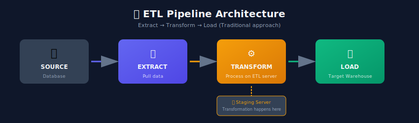
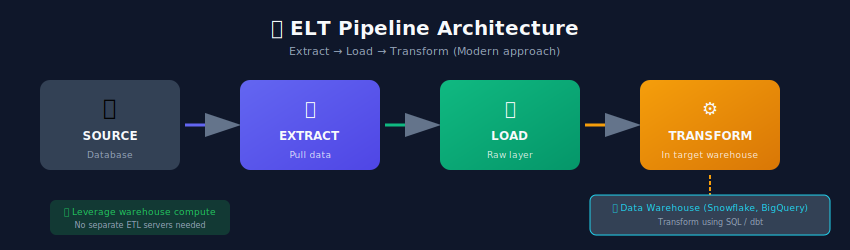
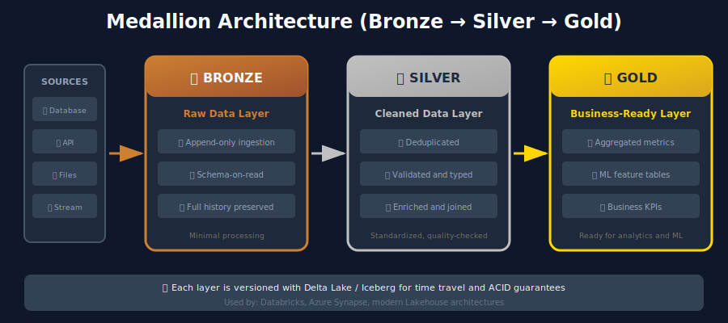

# ETL/ELT & Data Transformation for ML Systems

## 🎯 Understanding ETL vs ELT

### Traditional ETL (Extract, Transform, Load)



**Characteristics:**

- Transform happens **before** loading to destination

- Requires separate staging/processing infrastructure

- Good for: complex transformations, data cleansing before load

### Modern ELT (Extract, Load, Transform)



**Characteristics:**

- Load raw data first, transform in-place

- Leverages powerful warehouse compute (Snowflake, BigQuery, Databricks)

- Good for: modern cloud warehouses, flexible transformations

### Comparison

| Aspect | ETL | ELT |
|--------|-----|-----|
| Transform Location | Staging server | Target warehouse |
| Data Volume | Limited by staging | Scales with warehouse |
| Flexibility | Fixed transformations | Ad-hoc transformations |
| Cost | Infrastructure heavy | Compute-based billing |
| Latency | Higher | Lower |
| Best For | Legacy systems | Cloud-native architectures |

---

## 🔧 Transformation Patterns

### 1. Data Cleaning

```python
import pandas as pd
import numpy as np
from typing import Dict, List, Optional

class DataCleaner:
    """Common data cleaning transformations"""

    def remove_duplicates(
        self,
        df: pd.DataFrame,
        subset: Optional[List[str]] = None,
        keep: str = 'last'
    ) -> pd.DataFrame:
        """
        Remove duplicate rows.

        Args:
            df: Input DataFrame
            subset: Columns to consider for duplicates
            keep: 'first', 'last', or False (remove all)
        """
        original_count = len(df)
        df = df.drop_duplicates(subset=subset, keep=keep)
        removed = original_count - len(df)
        print(f"Removed {removed} duplicate rows")
        return df

    def handle_missing_values(
        self,
        df: pd.DataFrame,
        strategy: Dict[str, str]
    ) -> pd.DataFrame:
        """
        Handle missing values with column-specific strategies.

        Strategies:
        - 'drop': Remove rows with nulls
        - 'mean': Fill with column mean
        - 'median': Fill with column median
        - 'mode': Fill with most frequent value
        - 'constant:VALUE': Fill with constant
        - 'forward': Forward fill
        - 'backward': Backward fill
        """
        for column, strat in strategy.items():
            if strat == 'drop':
                df = df.dropna(subset=[column])
            elif strat == 'mean':
                df[column] = df[column].fillna(df[column].mean())
            elif strat == 'median':
                df[column] = df[column].fillna(df[column].median())
            elif strat == 'mode':
                df[column] = df[column].fillna(df[column].mode()[0])
            elif strat.startswith('constant:'):
                value = strat.split(':')[1]
                df[column] = df[column].fillna(value)
            elif strat == 'forward':
                df[column] = df[column].fillna(method='ffill')
            elif strat == 'backward':
                df[column] = df[column].fillna(method='bfill')

        return df

    def standardize_text(
        self,
        df: pd.DataFrame,
        columns: List[str],
        operations: List[str] = ['lower', 'strip', 'remove_special']
    ) -> pd.DataFrame:
        """Standardize text columns"""
        import re

        for col in columns:
            if 'lower' in operations:
                df[col] = df[col].str.lower()
            if 'strip' in operations:
                df[col] = df[col].str.strip()
            if 'remove_special' in operations:
                df[col] = df[col].apply(
                    lambda x: re.sub(r'[^a-zA-Z0-9\s]', '', str(x)) if pd.notna(x) else x
                )

        return df

    def standardize_dates(
        self,
        df: pd.DataFrame,
        date_columns: Dict[str, str],
        target_format: str = '%Y-%m-%d'
    ) -> pd.DataFrame:
        """Convert various date formats to standard format"""
        for col, source_format in date_columns.items():
            df[col] = pd.to_datetime(df[col], format=source_format)
            df[col] = df[col].dt.strftime(target_format)
        return df

# Example usage
cleaner = DataCleaner()

df = cleaner.remove_duplicates(df, subset=['user_id', 'timestamp'])
df = cleaner.handle_missing_values(df, {
    'age': 'median',
    'income': 'mean',
    'country': 'constant:Unknown',
    'email': 'drop'
})
df = cleaner.standardize_text(df, ['name', 'city'], ['lower', 'strip'])

```

### 2. Data Normalization & Encoding

```python
from sklearn.preprocessing import StandardScaler, MinMaxScaler, LabelEncoder, OneHotEncoder
import pandas as pd
import numpy as np

class FeatureTransformer:
    """Feature transformation for ML"""

    def __init__(self):
        self.scalers = {}
        self.encoders = {}

    def scale_numeric(
        self,
        df: pd.DataFrame,
        columns: List[str],
        method: str = 'standard',
        fit: bool = True
    ) -> pd.DataFrame:
        """
        Scale numeric features.

        Methods:
        - 'standard': Zero mean, unit variance (StandardScaler)
        - 'minmax': Scale to [0, 1] range (MinMaxScaler)
        - 'robust': Scale using median and IQR (RobustScaler)
        - 'log': Log transformation
        """
        df = df.copy()

        for col in columns:
            if method == 'log':
                df[col] = np.log1p(df[col])
            else:
                if method == 'standard':
                    scaler = StandardScaler()
                elif method == 'minmax':
                    scaler = MinMaxScaler()
                elif method == 'robust':
                    from sklearn.preprocessing import RobustScaler
                    scaler = RobustScaler()

                if fit:
                    df[col] = scaler.fit_transform(df[[col]])
                    self.scalers[col] = scaler
                else:
                    df[col] = self.scalers[col].transform(df[[col]])

        return df

    def encode_categorical(
        self,
        df: pd.DataFrame,
        columns: Dict[str, str],
        fit: bool = True
    ) -> pd.DataFrame:
        """
        Encode categorical features.

        Methods:
        - 'label': Integer encoding (0, 1, 2, ...)
        - 'onehot': One-hot encoding
        - 'target': Target encoding (mean of target per category)
        - 'frequency': Frequency encoding
        """
        df = df.copy()

        for col, method in columns.items():
            if method == 'label':
                if fit:
                    encoder = LabelEncoder()
                    df[col] = encoder.fit_transform(df[col].astype(str))
                    self.encoders[col] = encoder
                else:
                    df[col] = self.encoders[col].transform(df[col].astype(str))

            elif method == 'onehot':
                if fit:
                    encoder = OneHotEncoder(sparse=False, handle_unknown='ignore')
                    encoded = encoder.fit_transform(df[[col]])
                    self.encoders[col] = encoder
                else:
                    encoded = self.encoders[col].transform(df[[col]])

                # Create column names
                feature_names = [f"{col}_{cat}" for cat in encoder.categories_[0]]
                encoded_df = pd.DataFrame(encoded, columns=feature_names, index=df.index)

                # Drop original and concat encoded
                df = df.drop(columns=[col])
                df = pd.concat([df, encoded_df], axis=1)

            elif method == 'frequency':
                if fit:
                    freq_map = df[col].value_counts(normalize=True).to_dict()
                    self.encoders[col] = freq_map
                else:
                    freq_map = self.encoders[col]

                df[col] = df[col].map(freq_map).fillna(0)

        return df

    def bin_numeric(
        self,
        df: pd.DataFrame,
        column: str,
        bins: List[float],
        labels: Optional[List[str]] = None
    ) -> pd.DataFrame:
        """Bin continuous variable into discrete bins"""
        df = df.copy()
        binned_col = f"{column}_binned"
        df[binned_col] = pd.cut(df[column], bins=bins, labels=labels)
        return df

# Example usage
transformer = FeatureTransformer()

# Scale numeric features
df = transformer.scale_numeric(df, ['age', 'income', 'credit_score'], method='standard')

# Encode categorical features
df = transformer.encode_categorical(df, {
    'gender': 'onehot',
    'country': 'frequency',
    'category': 'label'
})

# Bin continuous variable
df = transformer.bin_numeric(df, 'age',
    bins=[0, 18, 35, 50, 65, 100],
    labels=['teen', 'young_adult', 'adult', 'middle_age', 'senior']
)

```

### 3. SQL-Based Transformations (dbt Style)

```sql
-- models/staging/stg_orders.sql
-- Staging model: light transformations on raw data

WITH source AS (
    SELECT * FROM {{ source('raw', 'orders') }}
),

cleaned AS (
    SELECT
        -- Primary key
        order_id,

        -- Foreign keys
        customer_id,
        product_id,

        -- Clean and cast columns
        LOWER(TRIM(status)) AS order_status,
        CAST(order_date AS DATE) AS order_date,
        CAST(amount AS DECIMAL(10, 2)) AS order_amount,

        -- Handle nulls
        COALESCE(discount_amount, 0) AS discount_amount,

        -- Parse JSON
        JSON_EXTRACT_SCALAR(metadata, '$.source') AS order_source,

        -- Derived columns
        CASE
            WHEN status = 'completed' THEN amount - COALESCE(discount_amount, 0)
            ELSE 0
        END AS revenue,

        -- Metadata
        _loaded_at AS ingested_at

    FROM source
    WHERE order_date IS NOT NULL
      AND customer_id IS NOT NULL
)

SELECT * FROM cleaned

```

```sql
-- models/marts/fct_customer_orders.sql
-- Fact table with aggregations for ML features

WITH orders AS (
    SELECT * FROM {{ ref('stg_orders') }}
),

customer_metrics AS (
    SELECT
        customer_id,

        -- Order counts
        COUNT(*) AS total_orders,
        COUNT(CASE WHEN order_status = 'completed' THEN 1 END) AS completed_orders,
        COUNT(CASE WHEN order_status = 'cancelled' THEN 1 END) AS cancelled_orders,

        -- Revenue metrics
        SUM(revenue) AS total_revenue,
        AVG(revenue) AS avg_order_value,
        MAX(revenue) AS max_order_value,

        -- Recency
        MAX(order_date) AS last_order_date,
        MIN(order_date) AS first_order_date,
        DATEDIFF(CURRENT_DATE, MAX(order_date)) AS days_since_last_order,

        -- Frequency
        DATEDIFF(MAX(order_date), MIN(order_date)) / NULLIF(COUNT(*) - 1, 0) AS avg_days_between_orders,

        -- Discount behavior
        AVG(discount_amount / NULLIF(order_amount, 0)) AS avg_discount_rate,

        -- Order source distribution
        COUNT(CASE WHEN order_source = 'mobile' THEN 1 END) * 1.0 / COUNT(*) AS mobile_order_ratio,
        COUNT(CASE WHEN order_source = 'web' THEN 1 END) * 1.0 / COUNT(*) AS web_order_ratio

    FROM orders
    GROUP BY customer_id
)

SELECT
    cm.*,

    -- Calculate RFM segments
    NTILE(5) OVER (ORDER BY days_since_last_order DESC) AS recency_score,
    NTILE(5) OVER (ORDER BY total_orders) AS frequency_score,
    NTILE(5) OVER (ORDER BY total_revenue) AS monetary_score,

    -- Customer lifetime value proxy
    total_revenue / GREATEST(DATEDIFF(CURRENT_DATE, first_order_date) / 365.0, 0.1) AS annual_value

FROM customer_metrics

```

### 4. PySpark Transformations

```python
from pyspark.sql import SparkSession, DataFrame
from pyspark.sql import functions as F
from pyspark.sql.window import Window
from typing import List

spark = SparkSession.builder.appName("MLTransformations").getOrCreate()

class SparkTransformer:
    """Large-scale transformations with PySpark"""

    def deduplicate(
        self,
        df: DataFrame,
        partition_cols: List[str],
        order_col: str,
        keep: str = 'last'
    ) -> DataFrame:
        """
        Deduplicate keeping first or last record per group.
        Uses window functions for efficient processing.
        """
        window = Window.partitionBy(partition_cols).orderBy(
            F.col(order_col).desc() if keep == 'last' else F.col(order_col).asc()
        )

        return df.withColumn("_row_num", F.row_number().over(window)) \
                 .filter(F.col("_row_num") == 1) \
                 .drop("_row_num")

    def compute_rolling_features(
        self,
        df: DataFrame,
        partition_col: str,
        order_col: str,
        value_col: str,
        windows: List[int] = [7, 30, 90]
    ) -> DataFrame:
        """Compute rolling aggregations for time series features"""

        for days in windows:
            # Define window: last N days
            window = Window.partitionBy(partition_col) \
                          .orderBy(F.col(order_col).cast("long")) \
                          .rangeBetween(-days * 86400, 0)  # seconds

            # Rolling aggregations
            df = df.withColumn(f"{value_col}_sum_{days}d", F.sum(value_col).over(window))
            df = df.withColumn(f"{value_col}_avg_{days}d", F.avg(value_col).over(window))
            df = df.withColumn(f"{value_col}_max_{days}d", F.max(value_col).over(window))
            df = df.withColumn(f"{value_col}_count_{days}d", F.count(value_col).over(window))

        return df

    def compute_lag_features(
        self,
        df: DataFrame,
        partition_col: str,
        order_col: str,
        value_col: str,
        lags: List[int] = [1, 7, 30]
    ) -> DataFrame:
        """Create lagged features for time series"""

        window = Window.partitionBy(partition_col).orderBy(order_col)

        for lag in lags:
            df = df.withColumn(
                f"{value_col}_lag_{lag}",
                F.lag(value_col, lag).over(window)
            )

            # Percent change from lag
            df = df.withColumn(
                f"{value_col}_pct_change_{lag}",
                (F.col(value_col) - F.col(f"{value_col}_lag_{lag}")) /
                F.col(f"{value_col}_lag_{lag}")
            )

        return df

    def pivot_events(
        self,
        df: DataFrame,
        group_cols: List[str],
        pivot_col: str,
        agg_col: str,
        agg_func: str = "sum"
    ) -> DataFrame:
        """Pivot event data to wide format for ML"""

        return df.groupBy(group_cols) \
                 .pivot(pivot_col) \
                 .agg(F.expr(f"{agg_func}({agg_col})"))

    def join_with_broadcast(
        self,
        large_df: DataFrame,
        small_df: DataFrame,
        join_keys: List[str]
    ) -> DataFrame:
        """Efficiently join large table with small lookup table"""
        from pyspark.sql.functions import broadcast

        return large_df.join(broadcast(small_df), join_keys, "left")

# Example: Building ML features with PySpark
transformer = SparkTransformer()

# Load data
orders = spark.read.parquet("s3://bucket/orders/")
customers = spark.read.parquet("s3://bucket/customers/")

# Clean and deduplicate
orders = transformer.deduplicate(
    orders,
    partition_cols=["order_id"],
    order_col="updated_at"
)

# Compute time-based features
orders = transformer.compute_rolling_features(
    orders,
    partition_col="customer_id",
    order_col="order_timestamp",
    value_col="order_amount",
    windows=[7, 30, 90]
)

# Create event counts per customer
event_counts = transformer.pivot_events(
    orders,
    group_cols=["customer_id"],
    pivot_col="order_status",
    agg_col="order_id",
    agg_func="count"
)

# Join with customer data
features = transformer.join_with_broadcast(
    event_counts,
    customers,
    join_keys=["customer_id"]
)

# Save feature table
features.write.mode("overwrite").parquet("s3://bucket/features/customer_features/")

```

---

## 🏗️ Transformation Architecture

### Medallion Architecture (Bronze/Silver/Gold)



### Implementation with Delta Lake

```python
from delta import DeltaTable
from pyspark.sql import SparkSession

spark = SparkSession.builder \
    .config("spark.sql.extensions", "io.delta.sql.DeltaSparkSessionExtension") \
    .config("spark.sql.catalog.spark_catalog", "org.apache.spark.sql.delta.catalog.DeltaCatalog") \
    .getOrCreate()

class MedallionPipeline:
    """Medallion architecture implementation"""

    def __init__(self, base_path: str):
        self.bronze_path = f"{base_path}/bronze"
        self.silver_path = f"{base_path}/silver"
        self.gold_path = f"{base_path}/gold"

    def ingest_to_bronze(self, source_path: str, table_name: str):
        """
        Bronze: Ingest raw data with minimal processing.
        Append-only, preserves full history.
        """
        raw_df = spark.read.json(source_path)

        # Add ingestion metadata
        bronze_df = raw_df \
            .withColumn("_ingested_at", F.current_timestamp()) \
            .withColumn("_source_file", F.input_file_name())

        # Append to bronze table
        bronze_df.write \
            .format("delta") \
            .mode("append") \
            .save(f"{self.bronze_path}/{table_name}")

    def transform_to_silver(self, table_name: str, dedup_keys: List[str]):
        """
        Silver: Clean, deduplicate, validate, standardize.
        """
        # Read from bronze
        bronze_df = spark.read.format("delta").load(f"{self.bronze_path}/{table_name}")

        # Deduplicate (keep latest)
        window = Window.partitionBy(dedup_keys).orderBy(F.col("_ingested_at").desc())
        deduped = bronze_df \
            .withColumn("_row_num", F.row_number().over(window)) \
            .filter(F.col("_row_num") == 1) \
            .drop("_row_num")

        # Clean and standardize
        silver_df = deduped \
            .withColumn("processed_at", F.current_timestamp()) \
            .filter(F.col("id").isNotNull())  # Remove invalid records

        # Merge into silver (upsert)
        silver_path = f"{self.silver_path}/{table_name}"

        if DeltaTable.isDeltaTable(spark, silver_path):
            delta_table = DeltaTable.forPath(spark, silver_path)

            delta_table.alias("target").merge(
                silver_df.alias("source"),
                " AND ".join([f"target.{k} = source.{k}" for k in dedup_keys])
            ).whenMatchedUpdateAll() \
             .whenNotMatchedInsertAll() \
             .execute()
        else:
            silver_df.write.format("delta").save(silver_path)

    def aggregate_to_gold(self, table_name: str, aggregation_sql: str):
        """
        Gold: Business-level aggregations and feature tables.
        """
        # Register silver tables as temp views
        silver_df = spark.read.format("delta").load(f"{self.silver_path}/{table_name}")
        silver_df.createOrReplaceTempView(table_name)

        # Execute aggregation SQL
        gold_df = spark.sql(aggregation_sql)

        # Write to gold
        gold_df.write \
            .format("delta") \
            .mode("overwrite") \
            .save(f"{self.gold_path}/{table_name}_features")

# Example usage
pipeline = MedallionPipeline("s3://datalake")

# Bronze: Ingest raw data
pipeline.ingest_to_bronze("s3://raw/orders/*.json", "orders")

# Silver: Clean and dedupe
pipeline.transform_to_silver("orders", dedup_keys=["order_id"])

# Gold: Aggregate for ML
aggregation_sql = """
    SELECT
        customer_id,
        COUNT(*) as order_count,
        SUM(amount) as total_spend,
        AVG(amount) as avg_order_value,
        MAX(order_date) as last_order_date
    FROM orders
    GROUP BY customer_id
"""
pipeline.aggregate_to_gold("orders", aggregation_sql)

```

---

## 🔄 Incremental Transformations

```python
class IncrementalTransformer:
    """Handle incremental/delta processing efficiently"""

    def __init__(self, checkpoint_path: str):
        self.checkpoint_path = checkpoint_path

    def get_watermark(self, pipeline_name: str) -> str:
        """Get last processed timestamp"""
        try:
            with open(f"{self.checkpoint_path}/{pipeline_name}_watermark.txt") as f:
                return f.read().strip()
        except FileNotFoundError:
            return "1970-01-01 00:00:00"

    def update_watermark(self, pipeline_name: str, watermark: str):
        """Update watermark after successful processing"""
        with open(f"{self.checkpoint_path}/{pipeline_name}_watermark.txt", 'w') as f:
            f.write(watermark)

    def process_incremental(
        self,
        source_df: DataFrame,
        target_path: str,
        watermark_column: str,
        merge_keys: List[str],
        pipeline_name: str
    ):
        """
        Process only new/changed records incrementally.

        Steps:
        1. Get last watermark
        2. Filter to new records
        3. Transform
        4. Merge into target
        5. Update watermark
        """
        # 1. Get watermark
        last_watermark = self.get_watermark(pipeline_name)

        # 2. Filter new records
        new_records = source_df.filter(
            F.col(watermark_column) > F.lit(last_watermark)
        )

        if new_records.count() == 0:
            print("No new records to process")
            return

        # 3. Transform (apply your transformations here)
        transformed = self.apply_transformations(new_records)

        # 4. Merge into target
        if DeltaTable.isDeltaTable(spark, target_path):
            delta_table = DeltaTable.forPath(spark, target_path)

            merge_condition = " AND ".join(
                [f"target.{k} = source.{k}" for k in merge_keys]
            )

            delta_table.alias("target").merge(
                transformed.alias("source"),
                merge_condition
            ).whenMatchedUpdateAll() \
             .whenNotMatchedInsertAll() \
             .execute()
        else:
            transformed.write.format("delta").save(target_path)

        # 5. Update watermark
        new_watermark = new_records.agg(
            F.max(watermark_column)
        ).collect()[0][0]

        self.update_watermark(pipeline_name, str(new_watermark))

        print(f"Processed {new_records.count()} records, watermark updated to {new_watermark}")

```

---

## 🎓 Key Takeaways

1. **Choose ETL vs ELT** based on your infrastructure and transformation complexity

2. **Layer your transformations** - Bronze (raw), Silver (clean), Gold (aggregated)

3. **Make transformations idempotent** - Same input should produce same output

4. **Process incrementally** - Avoid reprocessing all data every run

5. **Test transformations** - Unit test your transformation logic

6. **Version your transformations** - Track changes to transformation logic

---

*Next Chapter: [Feature Engineering Pipelines →](../05_feature_engineering/README.md)*

---

<div align="center">

**[⬆ Back to Top](#)** | **[📚 Main Repository](https://github.com/Gaurav14cs17/ml_system_design)**

Made with 💜 by [Gaurav14cs17](https://github.com/Gaurav14cs17)

</div>
