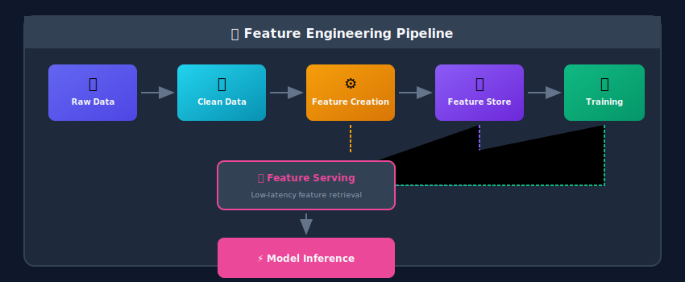
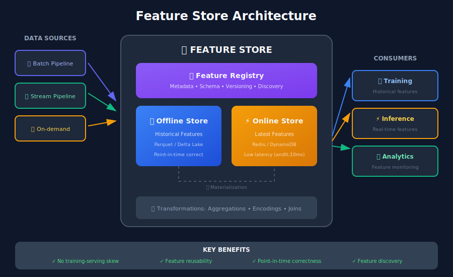
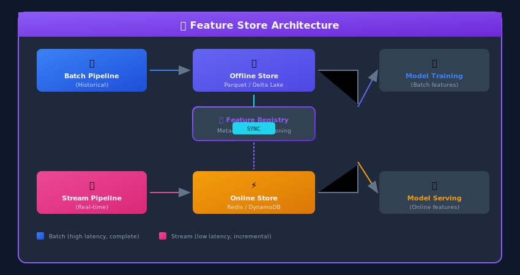

# Feature Engineering Pipelines for ML Systems

## 🎯 What is Feature Engineering?

**Feature engineering** is the process of transforming raw data into meaningful inputs (features) that machine learning models can use to make predictions. It's often called "the art of ML" because good features can dramatically improve model performance.

> "Coming up with features is difficult, time-consuming, requires expert knowledge. Applied machine learning is basically feature engineering." — Andrew Ng



---

## 📐 Mathematical Foundations of Feature Engineering

### The Goal: Maximizing Predictive Information

Feature engineering aims to find transformations $\phi: \mathcal{X} \rightarrow \mathcal{F}$ that maximize the **mutual information** between features and target:

$$
I(\phi(X); Y) = \sum_{f,y} p(f,y) \log \frac{p(f,y)}{p(f)p(y)}
$$

subject to constraints on feature dimensionality and computational cost.

### Feature Transformation Theory

#### Linear Transformations

**Standardization (Z-score normalization):**

$$
z = \frac{x - \mu}{\sigma}
$$

Maps data to have mean $\mu\_z = 0$ and variance $\sigma\_z^2 = 1$.

**Min-Max Scaling:**

$$
x' = \frac{x - x_{min}}{x_{max} - x_{min}}
$$

Maps data to range $[0, 1]$.

**Robust Scaling (using median and IQR):**

$$
x' = \frac{x - \text{median}(x)}{\text{IQR}(x)}
$$

More robust to outliers than standardization.

#### Non-Linear Transformations

**Log Transform:**

$$
x' = \log(x + 1)
$$

Useful for right-skewed distributions. Transforms multiplicative relationships to additive.

**Box-Cox Transform:**

$$
x' = \begin{cases} \frac{x^\lambda - 1}{\lambda} & \lambda \neq 0 \\ \log(x) & \lambda = 0 \end{cases}
$$

The optimal $\lambda$ maximizes the likelihood of normality.

**Power Transform (Yeo-Johnson):**
Extends Box-Cox to negative values.

### Information-Theoretic Feature Selection

#### Filter Methods

**Information Gain:**

$$
IG(Y|X) = H(Y) - H(Y|X) = I(X; Y)
$$

**Gain Ratio (normalized):**

$$
GR(Y|X) = \frac{IG(Y|X)}{H(X)}
$$

Corrects for features with many unique values.

#### Redundancy Minimization

For feature set $S$, the **Maximum Relevance Minimum Redundancy (mRMR)** criterion:

$$
\max_{f \notin S} \left[ I(f; Y) - \frac{1}{|S|} \sum_{g \in S} I(f; g) \right]
$$

Balances relevance to target with redundancy among features.

### Encoding Theory

#### Target Encoding Mathematics

For category $c$ with target $Y$:

**Naive estimate:**

$$
\hat{E}[Y|c] = \frac{\sum_{i: x_i = c} y_i}{n_c}
$$

**Smoothed estimate (regularized):**

$$
\tilde{E}[Y|c] = \frac{n_c \cdot \hat{E}[Y|c] + m \cdot \bar{Y}}{n_c + m}
$$

where $m$ is a smoothing parameter and $\bar{Y}$ is the global mean.

This is equivalent to a **Bayesian shrinkage estimator** with a prior centered at $\bar{Y}$.

#### One-Hot Encoding

Maps categorical variable $c \in \{c\_1, ..., c\_k\}$ to $\mathbb{R}^{k-1}$ (or $\mathbb{R}^k$):

$$
\phi(c) = [\mathbb{1}_{c=c_1}, \mathbb{1}_{c=c_2}, ..., \mathbb{1}_{c=c_{k-1}}]
$$

**Dimensionality:** $k-1$ features (with reference category) or $k$ features (full encoding).

### Temporal Feature Mathematics

#### Cyclic Encoding

For periodic features (hour, day of week, month):

$$
x_{sin} = \sin\left(\frac{2\pi \cdot t}{T}\right), \quad x_{cos} = \cos\left(\frac{2\pi \cdot t}{T}\right)
$$

where $T$ is the period (e.g., 24 for hours, 7 for days).

This maps cyclic values to a unit circle, preserving the property that hour 23 and hour 0 are close.

#### Time-Windowed Aggregations

For a time series $\{(t\_i, x\_i)\}$ and window size $w$:

**Rolling Mean:**

$$
\bar{x}_t^{(w)} = \frac{1}{w}\sum_{i=0}^{w-1} x_{t-i}
$$

**Exponential Moving Average:**

$$
\text{EMA}_t = \alpha \cdot x_t + (1-\alpha) \cdot \text{EMA}_{t-1}
$$

where $\alpha = \frac{2}{w+1}$.

**Rolling Statistics:**
- Variance: $\sigma\_t^{2(w)} = \frac{1}{w}\sum\_{i=0}^{w-1}(x\_{t-i} - \bar{x}\_t^{(w)})^2$
- Min/Max: $\min\_{i \in [t-w, t]} x\_i$, $\max\_{i \in [t-w, t]} x\_i$

### Interaction Features

**Polynomial Features:**
For features $x\_1, x\_2$, degree 2:

$$
\phi(x_1, x_2) = [x_1, x_2, x_1^2, x_2^2, x_1 \cdot x_2]
$$

The number of features for degree $d$ with $n$ original features:

$$
\binom{n + d}{d} = \frac{(n+d)!}{d! \cdot n!}
$$

**Cross-product (interaction):**

$$
x_{interaction} = x_1 \times x_2
$$

Captures synergistic effects not present in individual features.

### Dimensionality Considerations

**Curse of Dimensionality:**
As dimensions increase, data becomes sparse. Volume of a unit hypercube that contains $p$% of data:

$$
\text{side length} = p^{1/d}
$$

For $p = 10\%$ and $d = 10$: side = 0.79 (most of the space is empty).

**Feature Selection Trade-off:**
Adding features increases model capacity but:
1. Increases overfitting risk
2. Requires more data (sample complexity grows with $\sqrt{d}$)
3. Increases computational cost

---

## 🔧 Types of Features

### 1. Numeric Features

```python
import pandas as pd
import numpy as np
from typing import List, Dict

class NumericFeatureEngineering:
    """Transform and create numeric features"""

    def create_basic_statistics(
        self,
        df: pd.DataFrame,
        columns: List[str],
        group_by: str = None
    ) -> pd.DataFrame:
        """Create statistical aggregations"""

        if group_by:
            agg_funcs = ['mean', 'std', 'min', 'max', 'median']
            agg_df = df.groupby(group_by)[columns].agg(agg_funcs)
            agg_df.columns = [f"{col}_{stat}" for col, stat in agg_df.columns]
            return df.merge(agg_df, on=group_by)
        else:
            for col in columns:
                df[f'{col}_zscore'] = (df[col] - df[col].mean()) / df[col].std()
                df[f'{col}_percentile'] = df[col].rank(pct=True)
            return df

    def create_ratios(
        self,
        df: pd.DataFrame,
        ratio_configs: List[Dict]
    ) -> pd.DataFrame:
        """Create ratio features between columns"""

        for config in ratio_configs:
            numerator = config['numerator']
            denominator = config['denominator']
            name = config.get('name', f'{numerator}_to_{denominator}_ratio')

            df[name] = df[numerator] / df[denominator].replace(0, np.nan)
            df[name] = df[name].fillna(0)

        return df

    def create_bins(
        self,
        df: pd.DataFrame,
        column: str,
        strategy: str = 'quantile',
        n_bins: int = 5,
        labels: List[str] = None
    ) -> pd.DataFrame:
        """Bin continuous variables"""

        if strategy == 'quantile':
            df[f'{column}_bin'] = pd.qcut(df[column], q=n_bins, labels=labels, duplicates='drop')
        elif strategy == 'uniform':
            df[f'{column}_bin'] = pd.cut(df[column], bins=n_bins, labels=labels)
        elif strategy == 'custom':
            df[f'{column}_bin'] = pd.cut(df[column], bins=n_bins, labels=labels)

        return df

    def create_polynomial_features(
        self,
        df: pd.DataFrame,
        columns: List[str],
        degree: int = 2
    ) -> pd.DataFrame:
        """Create polynomial and interaction features"""

        from itertools import combinations_with_replacement

        for combo in combinations_with_replacement(columns, degree):
            if len(set(combo)) == 1:

                # Same column - power feature
                col = combo[0]
                power = len(combo)
                df[f'{col}_pow{power}'] = df[col] ** power
            else:

                # Different columns - interaction
                name = '_x_'.join(combo)
                df[name] = np.prod([df[c] for c in combo], axis=0)

        return df

# Example usage
eng = NumericFeatureEngineering()

# Ratio features
df = eng.create_ratios(df, [
    {'numerator': 'clicks', 'denominator': 'impressions', 'name': 'ctr'},
    {'numerator': 'purchases', 'denominator': 'clicks', 'name': 'conversion_rate'},
    {'numerator': 'revenue', 'denominator': 'users', 'name': 'arpu'}
])

# Binned features
df = eng.create_bins(df, 'age', strategy='quantile', n_bins=5,
                     labels=['very_young', 'young', 'middle', 'senior', 'elderly'])

# Polynomial features
df = eng.create_polynomial_features(df, ['price', 'quantity'], degree=2)
```

### 2. Categorical Features

```python
from sklearn.preprocessing import LabelEncoder, TargetEncoder
from category_encoders import WOEEncoder, CatBoostEncoder
import pandas as pd
import numpy as np

class CategoricalFeatureEngineering:
    """Transform categorical features for ML"""

    def __init__(self):
        self.encoders = {}
        self.category_stats = {}

    def frequency_encoding(
        self,
        df: pd.DataFrame,
        columns: List[str],
        normalize: bool = True
    ) -> pd.DataFrame:
        """Encode categories by their frequency"""

        for col in columns:
            freq = df[col].value_counts(normalize=normalize)
            df[f'{col}_freq'] = df[col].map(freq)

        return df

    def target_encoding(
        self,
        df: pd.DataFrame,
        columns: List[str],
        target: str,
        smoothing: float = 10.0,
        fit: bool = True
    ) -> pd.DataFrame:
        """Encode categories by target mean (with smoothing)"""

        global_mean = df[target].mean()

        for col in columns:
            if fit:

                # Calculate category statistics
                category_stats = df.groupby(col)[target].agg(['mean', 'count'])

                # Apply smoothing to prevent overfitting
                smoothed_mean = (
                    (category_stats['count'] * category_stats['mean'] + smoothing * global_mean) /
                    (category_stats['count'] + smoothing)
                )

                self.category_stats[col] = smoothed_mean.to_dict()

            df[f'{col}_target_enc'] = df[col].map(self.category_stats[col])
            df[f'{col}_target_enc'] = df[f'{col}_target_enc'].fillna(global_mean)

        return df

    def category_combinations(
        self,
        df: pd.DataFrame,
        column_pairs: List[tuple]
    ) -> pd.DataFrame:
        """Create combined categorical features"""

        for col1, col2 in column_pairs:
            df[f'{col1}_{col2}'] = df[col1].astype(str) + '_' + df[col2].astype(str)

        return df

    def category_count_features(
        self,
        df: pd.DataFrame,
        group_col: str,
        count_cols: List[str]
    ) -> pd.DataFrame:
        """Count of categories within groups"""

        for col in count_cols:
            count_df = df.groupby(group_col)[col].nunique().reset_index()
            count_df.columns = [group_col, f'{col}_unique_count']
            df = df.merge(count_df, on=group_col, how='left')

        return df

    def rare_category_encoding(
        self,
        df: pd.DataFrame,
        columns: List[str],
        threshold: float = 0.01
    ) -> pd.DataFrame:
        """Group rare categories together"""

        for col in columns:
            freq = df[col].value_counts(normalize=True)
            rare_categories = freq[freq < threshold].index
            df[f'{col}_grouped'] = df[col].apply(
                lambda x: 'RARE' if x in rare_categories else x
            )

        return df

# Example
cat_eng = CategoricalFeatureEngineering()

# Frequency encoding
df = cat_eng.frequency_encoding(df, ['city', 'device_type'])

# Target encoding for high-cardinality categoricals
df = cat_eng.target_encoding(df, ['zip_code', 'merchant_id'], target='is_fraud')

# Category combinations
df = cat_eng.category_combinations(df, [('category', 'subcategory'), ('city', 'device')])

# Handle rare categories
df = cat_eng.rare_category_encoding(df, ['merchant_id'], threshold=0.001)
```

### 3. Temporal Features

```python
import pandas as pd
from datetime import datetime
from typing import List

class TemporalFeatureEngineering:
    """Extract and create time-based features"""

    def extract_datetime_components(
        self,
        df: pd.DataFrame,
        date_column: str,
        components: List[str] = None
    ) -> pd.DataFrame:
        """Extract components from datetime"""

        dt = pd.to_datetime(df[date_column])
        prefix = date_column.replace('_date', '').replace('_time', '').replace('_at', '')

        if components is None:
            components = ['year', 'month', 'day', 'dayofweek', 'hour',
                         'is_weekend', 'is_month_start', 'is_month_end',
                         'quarter', 'dayofyear', 'weekofyear']

        if 'year' in components:
            df[f'{prefix}_year'] = dt.dt.year
        if 'month' in components:
            df[f'{prefix}_month'] = dt.dt.month
        if 'day' in components:
            df[f'{prefix}_day'] = dt.dt.day
        if 'dayofweek' in components:
            df[f'{prefix}_dayofweek'] = dt.dt.dayofweek
        if 'hour' in components:
            df[f'{prefix}_hour'] = dt.dt.hour
        if 'minute' in components:
            df[f'{prefix}_minute'] = dt.dt.minute
        if 'is_weekend' in components:
            df[f'{prefix}_is_weekend'] = dt.dt.dayofweek.isin([5, 6]).astype(int)
        if 'is_month_start' in components:
            df[f'{prefix}_is_month_start'] = dt.dt.is_month_start.astype(int)
        if 'is_month_end' in components:
            df[f'{prefix}_is_month_end'] = dt.dt.is_month_end.astype(int)
        if 'quarter' in components:
            df[f'{prefix}_quarter'] = dt.dt.quarter
        if 'dayofyear' in components:
            df[f'{prefix}_dayofyear'] = dt.dt.dayofyear
        if 'weekofyear' in components:
            df[f'{prefix}_weekofyear'] = dt.dt.isocalendar().week

        return df

    def create_cyclic_features(
        self,
        df: pd.DataFrame,
        column: str,
        max_val: int
    ) -> pd.DataFrame:
        """Create sin/cos features for cyclic patterns"""

        df[f'{column}_sin'] = np.sin(2 * np.pi * df[column] / max_val)
        df[f'{column}_cos'] = np.cos(2 * np.pi * df[column] / max_val)

        return df

    def time_since_event(
        self,
        df: pd.DataFrame,
        event_column: str,
        reference: datetime = None,
        unit: str = 'days'
    ) -> pd.DataFrame:
        """Calculate time elapsed since an event"""

        if reference is None:
            reference = datetime.now()

        dt = pd.to_datetime(df[event_column])
        delta = reference - dt

        if unit == 'days':
            df[f'{event_column}_days_ago'] = delta.dt.days
        elif unit == 'hours':
            df[f'{event_column}_hours_ago'] = delta.dt.total_seconds() / 3600
        elif unit == 'seconds':
            df[f'{event_column}_seconds_ago'] = delta.dt.total_seconds()

        return df

    def time_between_events(
        self,
        df: pd.DataFrame,
        start_column: str,
        end_column: str,
        unit: str = 'days'
    ) -> pd.DataFrame:
        """Calculate duration between two events"""

        start = pd.to_datetime(df[start_column])
        end = pd.to_datetime(df[end_column])
        delta = end - start

        col_name = f'{start_column}_to_{end_column}_{unit}'

        if unit == 'days':
            df[col_name] = delta.dt.days
        elif unit == 'hours':
            df[col_name] = delta.dt.total_seconds() / 3600

        return df

    def add_holidays(
        self,
        df: pd.DataFrame,
        date_column: str,
        country: str = 'US'
    ) -> pd.DataFrame:
        """Add holiday indicators"""

        import holidays

        country_holidays = holidays.country_holidays(country)
        dt = pd.to_datetime(df[date_column])

        df['is_holiday'] = dt.dt.date.apply(lambda x: x in country_holidays).astype(int)
        df['days_to_holiday'] = dt.apply(
            lambda x: self._days_to_nearest_holiday(x, country_holidays)
        )

        return df

    def _days_to_nearest_holiday(self, date, holidays_dict, max_days=30):
        """Find days to nearest holiday"""
        from datetime import timedelta

        for i in range(max_days):
            check_date = (date + timedelta(days=i)).date()
            if check_date in holidays_dict:
                return i
        return max_days

# Example
time_eng = TemporalFeatureEngineering()

# Extract datetime components
df = time_eng.extract_datetime_components(df, 'transaction_date')

# Cyclic encoding for hour and day of week
df = time_eng.create_cyclic_features(df, 'transaction_hour', max_val=24)
df = time_eng.create_cyclic_features(df, 'transaction_dayofweek', max_val=7)

# Recency features
df = time_eng.time_since_event(df, 'last_purchase_date', unit='days')
df = time_eng.time_since_event(df, 'account_created_date', unit='days')
```

### 4. Text Features

```python
from sklearn.feature_extraction.text import TfidfVectorizer, CountVectorizer
from typing import List
import pandas as pd
import numpy as np
import re

class TextFeatureEngineering:
    """Extract features from text data"""

    def __init__(self):
        self.vectorizers = {}

    def basic_text_features(
        self,
        df: pd.DataFrame,
        column: str
    ) -> pd.DataFrame:
        """Extract basic text statistics"""

        text = df[column].fillna('')

        df[f'{column}_length'] = text.str.len()
        df[f'{column}_word_count'] = text.str.split().str.len()
        df[f'{column}_avg_word_length'] = text.apply(
            lambda x: np.mean([len(w) for w in str(x).split()]) if str(x).split() else 0
        )
        df[f'{column}_char_count'] = text.str.replace(' ', '').str.len()
        df[f'{column}_uppercase_ratio'] = text.apply(
            lambda x: sum(1 for c in str(x) if c.isupper()) / max(len(str(x)), 1)
        )
        df[f'{column}_digit_ratio'] = text.apply(
            lambda x: sum(1 for c in str(x) if c.isdigit()) / max(len(str(x)), 1)
        )
        df[f'{column}_special_char_ratio'] = text.apply(
            lambda x: sum(1 for c in str(x) if not c.isalnum() and c != ' ') / max(len(str(x)), 1)
        )

        return df

    def tfidf_features(
        self,
        df: pd.DataFrame,
        column: str,
        max_features: int = 100,
        fit: bool = True
    ) -> pd.DataFrame:
        """Create TF-IDF features"""

        if fit:
            vectorizer = TfidfVectorizer(
                max_features=max_features,
                stop_words='english',
                ngram_range=(1, 2)
            )
            tfidf_matrix = vectorizer.fit_transform(df[column].fillna(''))
            self.vectorizers[column] = vectorizer
        else:
            tfidf_matrix = self.vectorizers[column].transform(df[column].fillna(''))

        # Convert to DataFrame
        feature_names = [f'{column}_tfidf_{i}' for i in range(tfidf_matrix.shape[1])]
        tfidf_df = pd.DataFrame(
            tfidf_matrix.toarray(),
            columns=feature_names,
            index=df.index
        )

        return pd.concat([df, tfidf_df], axis=1)

    def sentiment_features(
        self,
        df: pd.DataFrame,
        column: str
    ) -> pd.DataFrame:
        """Extract sentiment using TextBlob"""

        from textblob import TextBlob

        def get_sentiment(text):
            if pd.isna(text) or text == '':
                return 0, 0
            blob = TextBlob(str(text))
            return blob.sentiment.polarity, blob.sentiment.subjectivity

        sentiments = df[column].apply(get_sentiment)
        df[f'{column}_polarity'] = sentiments.apply(lambda x: x[0])
        df[f'{column}_subjectivity'] = sentiments.apply(lambda x: x[1])

        return df

    def embedding_features(
        self,
        df: pd.DataFrame,
        column: str,
        model_name: str = 'all-MiniLM-L6-v2'
    ) -> pd.DataFrame:
        """Create sentence embeddings using SentenceTransformers"""

        from sentence_transformers import SentenceTransformer

        model = SentenceTransformer(model_name)
        embeddings = model.encode(df[column].fillna('').tolist())

        # Create embedding columns
        embed_df = pd.DataFrame(
            embeddings,
            columns=[f'{column}_embed_{i}' for i in range(embeddings.shape[1])],
            index=df.index
        )

        return pd.concat([df, embed_df], axis=1)

# Example
text_eng = TextFeatureEngineering()

# Basic text features
df = text_eng.basic_text_features(df, 'product_description')

# TF-IDF features
df = text_eng.tfidf_features(df, 'review_text', max_features=50)

# Sentiment
df = text_eng.sentiment_features(df, 'review_text')
```

### 5. Aggregation Features

```python
class AggregationFeatureEngineering:
    """Create aggregated features from transaction/event data"""

    def __init__(self):
        self.agg_stats = {}

    def rolling_aggregations(
        self,
        df: pd.DataFrame,
        group_col: str,
        date_col: str,
        value_col: str,
        windows: List[int] = [7, 30, 90],
        agg_funcs: List[str] = ['sum', 'mean', 'count', 'std']
    ) -> pd.DataFrame:
        """Create rolling window aggregations"""

        df = df.sort_values([group_col, date_col])

        for window in windows:
            for func in agg_funcs:
                col_name = f'{value_col}_{func}_{window}d'

                df[col_name] = df.groupby(group_col)[value_col].transform(
                    lambda x: x.rolling(window=window, min_periods=1).agg(func)
                )

        return df

    def lag_features(
        self,
        df: pd.DataFrame,
        group_col: str,
        date_col: str,
        value_col: str,
        lags: List[int] = [1, 7, 30]
    ) -> pd.DataFrame:
        """Create lag features"""

        df = df.sort_values([group_col, date_col])

        for lag in lags:
            df[f'{value_col}_lag_{lag}'] = df.groupby(group_col)[value_col].shift(lag)

            # Change from lag
            df[f'{value_col}_diff_{lag}'] = df[value_col] - df[f'{value_col}_lag_{lag}']
            df[f'{value_col}_pct_change_{lag}'] = df[f'{value_col}_diff_{lag}'] / df[f'{value_col}_lag_{lag}']

        return df

    def entity_level_aggregations(
        self,
        transactions_df: pd.DataFrame,
        entity_col: str,
        agg_configs: List[Dict]
    ) -> pd.DataFrame:
        """Create entity-level (e.g., user) aggregations"""

        agg_dict = {}
        for config in agg_configs:
            col = config['column']
            funcs = config['functions']
            for func in funcs:
                agg_dict[f'{col}_{func}'] = (col, func)

        entity_features = transactions_df.groupby(entity_col).agg(**agg_dict)

        return entity_features.reset_index()

    def recency_frequency_monetary(
        self,
        df: pd.DataFrame,
        customer_col: str,
        date_col: str,
        amount_col: str,
        reference_date: datetime = None
    ) -> pd.DataFrame:
        """Calculate RFM features"""

        if reference_date is None:
            reference_date = df[date_col].max()

        rfm = df.groupby(customer_col).agg({
            date_col: lambda x: (reference_date - x.max()).days,  # Recency
            customer_col: 'count',  # Frequency
            amount_col: 'sum'  # Monetary
        })

        rfm.columns = ['recency', 'frequency', 'monetary']

        # Create RFM scores (1-5)
        rfm['recency_score'] = pd.qcut(rfm['recency'], q=5, labels=[5,4,3,2,1])
        rfm['frequency_score'] = pd.qcut(rfm['frequency'].rank(method='first'), q=5, labels=[1,2,3,4,5])
        rfm['monetary_score'] = pd.qcut(rfm['monetary'].rank(method='first'), q=5, labels=[1,2,3,4,5])

        rfm['rfm_score'] = rfm['recency_score'].astype(str) + rfm['frequency_score'].astype(str) + rfm['monetary_score'].astype(str)

        return rfm.reset_index()

# Example
agg_eng = AggregationFeatureEngineering()

# Rolling features
df = agg_eng.rolling_aggregations(
    df,
    group_col='user_id',
    date_col='transaction_date',
    value_col='amount',
    windows=[7, 30, 90],
    agg_funcs=['sum', 'mean', 'count']
)

# RFM analysis
rfm_features = agg_eng.recency_frequency_monetary(
    transactions,
    customer_col='customer_id',
    date_col='order_date',
    amount_col='order_value'
)
```

---

## 🏪 Feature Store

### What is a Feature Store?

A **Feature Store** is a centralized repository for storing, managing, and serving ML features. It solves the critical problem of **training-serving skew** and enables **feature reuse**.





### Implementing with Feast

```python

# feature_store/feature_repo/features.py
from feast import Entity, Feature, FeatureView, FileSource, ValueType
from feast.types import Float32, Int64, String
from datetime import timedelta

# Define entities
customer = Entity(
    name="customer_id",
    value_type=ValueType.INT64,
    description="Customer identifier"
)

product = Entity(
    name="product_id",
    value_type=ValueType.INT64,
    description="Product identifier"
)

# Define feature sources (offline)
customer_transactions_source = FileSource(
    path="s3://feature-store/customer_transactions.parquet",
    timestamp_field="event_timestamp",
    created_timestamp_column="created_timestamp"
)

# Define feature views
customer_features = FeatureView(
    name="customer_features",
    entities=["customer_id"],
    ttl=timedelta(days=90),
    schema=[
        Feature(name="total_transactions", dtype=Int64),
        Feature(name="total_spend", dtype=Float32),
        Feature(name="avg_transaction_value", dtype=Float32),
        Feature(name="days_since_last_purchase", dtype=Int64),
        Feature(name="favorite_category", dtype=String),
    ],
    online=True,
    source=customer_transactions_source,
    tags={"team": "ml-platform", "use_case": "recommendations"}
)

# Real-time streaming feature view
from feast import StreamFeatureView

real_time_customer = StreamFeatureView(
    name="customer_realtime_features",
    entities=["customer_id"],
    ttl=timedelta(minutes=5),
    schema=[
        Feature(name="clicks_last_5min", dtype=Int64),
        Feature(name="page_views_last_5min", dtype=Int64),
        Feature(name="cart_value", dtype=Float32),
    ],
    online=True,
    source=kafka_source,  # Kafka stream source
)
```

```python

# Using the Feature Store

from feast import FeatureStore

# Initialize feature store
store = FeatureStore(repo_path="feature_store/feature_repo/")

# Training: Get historical features
entity_df = pd.DataFrame({
    "customer_id": [1001, 1002, 1003],
    "event_timestamp": pd.to_datetime(['2024-01-15', '2024-01-15', '2024-01-15'])
})

training_features = store.get_historical_features(
    entity_df=entity_df,
    features=[
        "customer_features:total_transactions",
        "customer_features:total_spend",
        "customer_features:avg_transaction_value",
    ]
).to_df()

# Serving: Get online features (low latency)
online_features = store.get_online_features(
    features=[
        "customer_features:total_spend",
        "customer_features:days_since_last_purchase",
        "customer_realtime_features:cart_value",
    ],
    entity_rows=[{"customer_id": 1001}]
).to_dict()

print(online_features)

# {'customer_id': [1001], 'total_spend': [5432.50], 'days_since_last_purchase': [3], 'cart_value': [125.00]}
```

---

## 🔄 Feature Pipeline Architecture

### Production Feature Pipeline

```python
from dataclasses import dataclass
from typing import Dict, List, Any
import pandas as pd
from datetime import datetime
import logging

@dataclass
class FeatureConfig:
    """Configuration for a feature"""
    name: str
    type: str  # 'numeric', 'categorical', 'temporal', 'text'
    source_columns: List[str]
    transformation: str
    parameters: Dict[str, Any] = None

class FeaturePipeline:
    """Production-grade feature engineering pipeline"""

    def __init__(self, config: List[FeatureConfig]):
        self.config = config
        self.transformers = {}
        self.logger = logging.getLogger(__name__)

    def fit(self, df: pd.DataFrame) -> 'FeaturePipeline':
        """Fit transformers on training data"""

        for feature_cfg in self.config:
            self.logger.info(f"Fitting transformer for {feature_cfg.name}")

            if feature_cfg.type == 'numeric':
                self._fit_numeric(df, feature_cfg)
            elif feature_cfg.type == 'categorical':
                self._fit_categorical(df, feature_cfg)
            elif feature_cfg.type == 'text':
                self._fit_text(df, feature_cfg)

        return self

    def transform(self, df: pd.DataFrame) -> pd.DataFrame:
        """Transform data using fitted transformers"""

        result_df = df.copy()

        for feature_cfg in self.config:
            self.logger.info(f"Transforming {feature_cfg.name}")

            try:
                if feature_cfg.type == 'numeric':
                    result_df = self._transform_numeric(result_df, feature_cfg)
                elif feature_cfg.type == 'categorical':
                    result_df = self._transform_categorical(result_df, feature_cfg)
                elif feature_cfg.type == 'temporal':
                    result_df = self._transform_temporal(result_df, feature_cfg)
                elif feature_cfg.type == 'text':
                    result_df = self._transform_text(result_df, feature_cfg)
            except Exception as e:
                self.logger.error(f"Error transforming {feature_cfg.name}: {e}")
                raise

        return result_df

    def fit_transform(self, df: pd.DataFrame) -> pd.DataFrame:
        """Fit and transform in one step"""
        return self.fit(df).transform(df)

    def save(self, path: str):
        """Save fitted transformers"""
        import joblib
        joblib.dump(self.transformers, path)

    def load(self, path: str):
        """Load fitted transformers"""
        import joblib
        self.transformers = joblib.load(path)
        return self

    def _fit_numeric(self, df: pd.DataFrame, cfg: FeatureConfig):
        """Fit numeric transformer"""
        from sklearn.preprocessing import StandardScaler, RobustScaler

        col = cfg.source_columns[0]

        if cfg.transformation == 'standard':
            scaler = StandardScaler()
            scaler.fit(df[[col]])
            self.transformers[cfg.name] = scaler
        elif cfg.transformation == 'robust':
            scaler = RobustScaler()
            scaler.fit(df[[col]])
            self.transformers[cfg.name] = scaler

    def _transform_numeric(self, df: pd.DataFrame, cfg: FeatureConfig) -> pd.DataFrame:
        """Apply numeric transformation"""
        col = cfg.source_columns[0]

        if cfg.transformation in ['standard', 'robust']:
            scaler = self.transformers[cfg.name]
            df[cfg.name] = scaler.transform(df[[col]])
        elif cfg.transformation == 'log':
            df[cfg.name] = np.log1p(df[col])
        elif cfg.transformation == 'bin':
            df[cfg.name] = pd.qcut(df[col], q=cfg.parameters.get('bins', 5), labels=False)

        return df

# Example configuration
feature_configs = [
    FeatureConfig(
        name='age_scaled',
        type='numeric',
        source_columns=['age'],
        transformation='standard'
    ),
    FeatureConfig(
        name='income_log',
        type='numeric',
        source_columns=['income'],
        transformation='log'
    ),
    FeatureConfig(
        name='signup_days_ago',
        type='temporal',
        source_columns=['signup_date'],
        transformation='days_since'
    ),
    FeatureConfig(
        name='category_encoded',
        type='categorical',
        source_columns=['category'],
        transformation='target_encode',
        parameters={'target': 'is_purchaser', 'smoothing': 10}
    ),
]

# Use pipeline
pipeline = FeaturePipeline(feature_configs)
train_features = pipeline.fit_transform(train_df)
test_features = pipeline.transform(test_df)

# Save for serving
pipeline.save('models/feature_pipeline.joblib')
```

---

## 🎓 Key Takeaways

1. **Feature engineering is crucial** - Good features often matter more than model choice

2. **Use a Feature Store** - Eliminate training-serving skew and enable reuse

3. **Automate feature pipelines** - Manual feature engineering doesn't scale

4. **Version your features** - Track what features were used for each model

5. **Monitor feature quality** - Feature drift can silently degrade model performance

6. **Document your features** - Future you (and your team) will thank you

---

*Next Chapter: [Data Storage & Formats →](../06_data_storage_formats/README.md)*

---

<div align="center">

**[⬆ Back to Top](#)** | **[📚 Main Repository](https://github.com/Gaurav14cs17/ml_system_design)**

Made with 💜 by [Gaurav14cs17](https://github.com/Gaurav14cs17)

</div>
