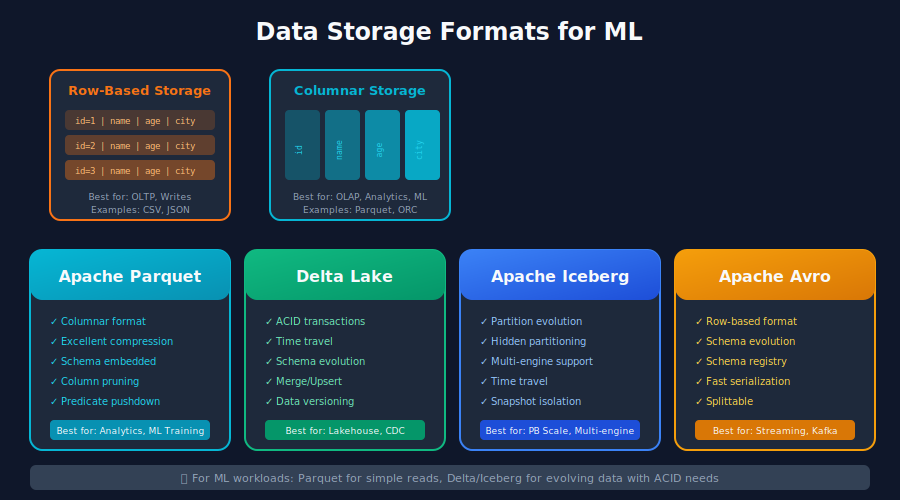
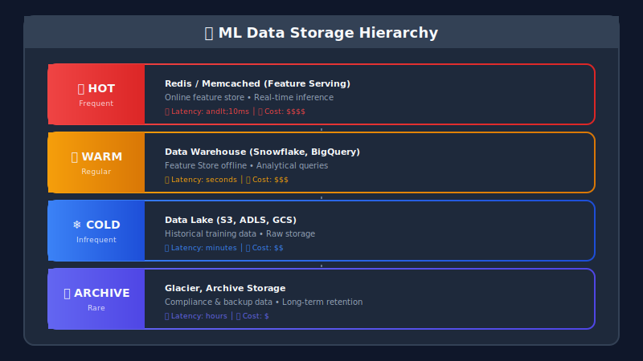
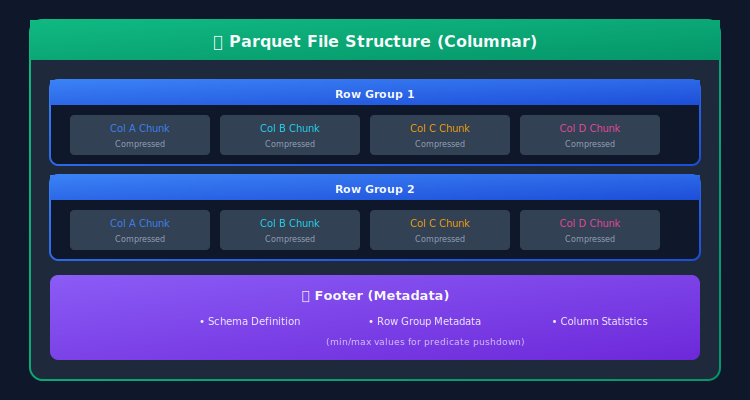
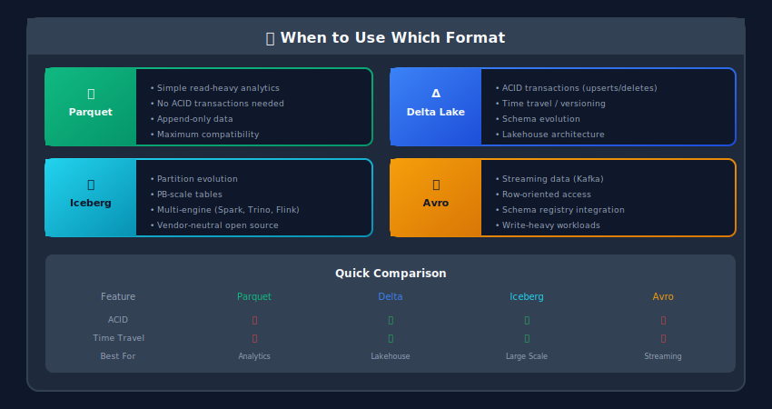
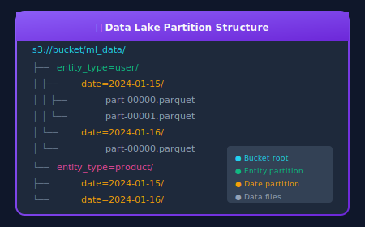

# Data Storage & Formats for ML Systems



## 🎯 Overview

Choosing the right storage solution and data format is crucial for ML systems. The wrong choice can lead to:
- Slow training times
- High storage costs
- Data access bottlenecks
- Scalability limitations



---

## 📁 File Formats

### Format Comparison

| Format | Type | Compression | Schema | Best For | Read Speed | Write Speed |
|--------|------|-------------|--------|----------|------------|-------------|
| **Parquet** | Columnar | Excellent | Embedded | Analytics, ML | ⭐⭐⭐⭐⭐ | ⭐⭐⭐ |
| **ORC** | Columnar | Excellent | Embedded | Hive/Hadoop | ⭐⭐⭐⭐ | ⭐⭐⭐ |
| **Avro** | Row | Good | Embedded | Streaming, ETL | ⭐⭐⭐ | ⭐⭐⭐⭐ |
| **Delta Lake** | Columnar | Excellent | Evolved | ACID, Lakehouse | ⭐⭐⭐⭐⭐ | ⭐⭐⭐⭐ |
| **CSV** | Row | None | External | Simple data | ⭐⭐ | ⭐⭐⭐⭐⭐ |
| **JSON** | Row | Variable | None | Nested, Logs | ⭐⭐ | ⭐⭐⭐⭐ |

### 1. Apache Parquet

**Parquet** is the gold standard for analytical workloads and ML training data.



**Why Parquet for ML:**
- **Column Pruning**: Read only needed columns (critical for wide tables)
- **Predicate Pushdown**: Filter at file level using statistics
- **Compression**: Typically 10x smaller than CSV
- **Type Safety**: Schema embedded in file

```python
import pandas as pd
import pyarrow as pa
import pyarrow.parquet as pq

# Write Parquet with optimizations
df = pd.DataFrame({
    'user_id': range(1000000),
    'age': np.random.randint(18, 80, 1000000),
    'income': np.random.normal(50000, 20000, 1000000),
    'category': np.random.choice(['A', 'B', 'C', 'D'], 1000000)
})

# Convert to PyArrow table for more control
table = pa.Table.from_pandas(df)

# Write with optimal settings for ML
pq.write_table(
    table,
    'data/training_data.parquet',
    compression='snappy',           # Fast compression
    row_group_size=100000,         # Optimize for your read patterns
    use_dictionary=['category'],    # Dictionary encoding for categoricals
    write_statistics=True           # Enable predicate pushdown
)

# Read only needed columns (column pruning)
features = pd.read_parquet(
    'data/training_data.parquet',
    columns=['age', 'income', 'category']  # Only read these columns
)

# Filter while reading (predicate pushdown)
young_users = pd.read_parquet(
    'data/training_data.parquet',
    filters=[('age', '<', 30)]  # Filter at file level
)

# Read partitioned data efficiently
partitioned = pd.read_parquet(
    'data/partitioned/',
    filters=[('date', '>=', '2024-01-01'), ('date', '<', '2024-02-01')]
)
```

### 2. Delta Lake

**Delta Lake** adds ACID transactions, time travel, and schema evolution to Parquet.

```python
from delta import DeltaTable, configure_spark_with_delta_pip
from pyspark.sql import SparkSession

# Initialize Spark with Delta
builder = SparkSession.builder \
    .appName("DeltaLakeDemo") \
    .config("spark.sql.extensions", "io.delta.sql.DeltaSparkSessionExtension") \
    .config("spark.sql.catalog.spark_catalog", "org.apache.spark.sql.delta.catalog.DeltaCatalog")

spark = configure_spark_with_delta_pip(builder).getOrCreate()

# Write Delta table
df.write.format("delta").save("s3://bucket/delta/training_data")

# Time Travel - Read historical versions
# By version
df_v0 = spark.read.format("delta") \
    .option("versionAsOf", 0) \
    .load("s3://bucket/delta/training_data")

# By timestamp
df_yesterday = spark.read.format("delta") \
    .option("timestampAsOf", "2024-01-15 00:00:00") \
    .load("s3://bucket/delta/training_data")

# MERGE (Upsert) - Critical for incremental updates
delta_table = DeltaTable.forPath(spark, "s3://bucket/delta/training_data")

delta_table.alias("target").merge(
    new_data.alias("source"),
    "target.user_id = source.user_id"
).whenMatchedUpdateAll() \
 .whenNotMatchedInsertAll() \
 .execute()

# Schema Evolution
df_with_new_column.write \
    .format("delta") \
    .mode("append") \
    .option("mergeSchema", "true") \
    .save("s3://bucket/delta/training_data")

# Optimize for faster reads
delta_table.optimize().executeCompaction()

# Z-Ordering for faster lookups on specific columns
delta_table.optimize().executeZOrderBy("user_id", "date")

# Vacuum old versions (be careful - removes time travel capability)
delta_table.vacuum(retentionHours=168)  # Keep 7 days
```

### 3. Apache Iceberg

**Iceberg** provides partition evolution, hidden partitioning, and excellent performance.

```python
from pyspark.sql import SparkSession

spark = SparkSession.builder \
    .appName("IcebergDemo") \
    .config("spark.sql.extensions", "org.apache.iceberg.spark.extensions.IcebergSparkSessionExtensions") \
    .config("spark.sql.catalog.iceberg", "org.apache.iceberg.spark.SparkCatalog") \
    .config("spark.sql.catalog.iceberg.type", "hadoop") \
    .config("spark.sql.catalog.iceberg.warehouse", "s3://bucket/iceberg/") \
    .getOrCreate()

# Create Iceberg table with partitioning
spark.sql("""
    CREATE TABLE iceberg.db.events (
        event_id STRING,
        user_id STRING,
        event_type STRING,
        event_time TIMESTAMP,
        properties MAP<STRING, STRING>
    )
    USING iceberg
    PARTITIONED BY (days(event_time), bucket(16, user_id))
""")

# Insert data
df.writeTo("iceberg.db.events").append()

# Time travel queries
spark.sql("SELECT * FROM iceberg.db.events VERSION AS OF 12345")
spark.sql("SELECT * FROM iceberg.db.events TIMESTAMP AS OF '2024-01-15 10:00:00'")

# Partition evolution (change partitioning without rewriting data!)
spark.sql("""
    ALTER TABLE iceberg.db.events
    ADD PARTITION FIELD hours(event_time)
""")

# Table maintenance
spark.sql("CALL iceberg.system.rewrite_data_files('iceberg.db.events')")
spark.sql("CALL iceberg.system.expire_snapshots('iceberg.db.events')")
```

### 4. Format Selection Guide



---

## 🗄️ Storage Systems

### 1. Object Storage (Data Lake)

```python
import boto3
from smart_open import open
import pyarrow.parquet as pq

class DataLakeStorage:
    """Interface for object storage (S3, GCS, ADLS)"""

    def __init__(self, bucket: str, prefix: str = ""):
        self.bucket = bucket
        self.prefix = prefix
        self.s3 = boto3.client('s3')

    def write_parquet(self, df: pd.DataFrame, key: str):
        """Write DataFrame to S3 as Parquet"""
        full_path = f"s3://{self.bucket}/{self.prefix}/{key}"
        df.to_parquet(full_path)

    def read_parquet(self, key: str, columns: list = None) -> pd.DataFrame:
        """Read Parquet from S3 with optional column selection"""
        full_path = f"s3://{self.bucket}/{self.prefix}/{key}"
        return pd.read_parquet(full_path, columns=columns)

    def list_files(self, prefix: str = "") -> list:
        """List files in bucket with prefix"""
        full_prefix = f"{self.prefix}/{prefix}" if self.prefix else prefix

        paginator = self.s3.get_paginator('list_objects_v2')
        files = []

        for page in paginator.paginate(Bucket=self.bucket, Prefix=full_prefix):
            for obj in page.get('Contents', []):
                files.append(obj['Key'])

        return files

    def write_partitioned(
        self,
        df: pd.DataFrame,
        base_key: str,
        partition_cols: list
    ):
        """Write partitioned Parquet dataset"""
        import pyarrow as pa
        import pyarrow.parquet as pq

        table = pa.Table.from_pandas(df)

        pq.write_to_dataset(
            table,
            root_path=f"s3://{self.bucket}/{self.prefix}/{base_key}",
            partition_cols=partition_cols,
            compression='snappy'
        )

# Usage
lake = DataLakeStorage("my-datalake", "ml/features")

# Write partitioned by date and category
lake.write_partitioned(
    df,
    "customer_features",
    partition_cols=['date', 'category']
)

# Read specific partitions
features = pd.read_parquet(
    "s3://my-datalake/ml/features/customer_features/",
    filters=[
        ('date', '>=', '2024-01-01'),
        ('category', '==', 'premium')
    ]
)
```

### 2. Data Warehouse

```python
from google.cloud import bigquery
import snowflake.connector

class WarehouseConnector:
    """Connect to cloud data warehouses"""

    @staticmethod
    def snowflake_query(query: str, connection_params: dict) -> pd.DataFrame:
        """Query Snowflake and return DataFrame"""
        conn = snowflake.connector.connect(**connection_params)

        try:
            cursor = conn.cursor()
            cursor.execute(query)

            # Fetch in chunks for large results
            df = cursor.fetch_pandas_all()
            return df
        finally:
            conn.close()

    @staticmethod
    def bigquery_query(query: str, project_id: str) -> pd.DataFrame:
        """Query BigQuery and return DataFrame"""
        client = bigquery.Client(project=project_id)
        return client.query(query).to_dataframe()

    @staticmethod
    def write_to_snowflake(
        df: pd.DataFrame,
        table: str,
        connection_params: dict,
        if_exists: str = 'append'
    ):
        """Write DataFrame to Snowflake"""
        from snowflake.connector.pandas_tools import write_pandas

        conn = snowflake.connector.connect(**connection_params)

        try:
            success, num_chunks, num_rows, output = write_pandas(
                conn,
                df,
                table_name=table,
                database=connection_params.get('database'),
                schema=connection_params.get('schema'),
                auto_create_table=True if if_exists == 'replace' else False
            )
            return {'success': success, 'rows': num_rows}
        finally:
            conn.close()

# Example: Extract features for training
query = """
    SELECT
        user_id,
        total_orders,
        avg_order_value,
        days_since_last_order,
        customer_segment
    FROM analytics.customer_features
    WHERE snapshot_date = '2024-01-15'
"""

training_data = WarehouseConnector.bigquery_query(query, "my-project")
```

### 3. Feature Store Storage

```python
from typing import Dict, List, Any
import redis
import json

class FeatureStoreStorage:
    """Storage layer for online/offline feature serving"""

    def __init__(
        self,
        online_store: str = "redis://localhost:6379",
        offline_store: str = "s3://feature-store/offline/"
    ):
        self.redis = redis.from_url(online_store)
        self.offline_path = offline_store

    def get_online_features(
        self,
        entity_id: str,
        feature_view: str,
        feature_names: List[str] = None
    ) -> Dict[str, Any]:
        """Get features from online store (low latency)"""

        key = f"{feature_view}:{entity_id}"

        if feature_names:

            # Get specific features
            values = self.redis.hmget(key, feature_names)
            return dict(zip(feature_names, [json.loads(v) if v else None for v in values]))
        else:

            # Get all features
            data = self.redis.hgetall(key)
            return {k.decode(): json.loads(v) for k, v in data.items()}

    def set_online_features(
        self,
        entity_id: str,
        feature_view: str,
        features: Dict[str, Any],
        ttl_seconds: int = 86400
    ):
        """Set features in online store"""

        key = f"{feature_view}:{entity_id}"
        serialized = {k: json.dumps(v) for k, v in features.items()}

        self.redis.hset(key, mapping=serialized)
        if ttl_seconds:
            self.redis.expire(key, ttl_seconds)

    def bulk_set_online_features(
        self,
        feature_view: str,
        features_df: pd.DataFrame,
        entity_col: str,
        ttl_seconds: int = 86400
    ):
        """Bulk load features to online store"""

        pipeline = self.redis.pipeline()

        for _, row in features_df.iterrows():
            entity_id = row[entity_col]
            key = f"{feature_view}:{entity_id}"

            features = row.drop(entity_col).to_dict()
            serialized = {k: json.dumps(v) for k, v in features.items()}

            pipeline.hset(key, mapping=serialized)
            if ttl_seconds:
                pipeline.expire(key, ttl_seconds)

        pipeline.execute()

    def get_historical_features(
        self,
        entity_df: pd.DataFrame,
        feature_view: str,
        entity_col: str,
        timestamp_col: str
    ) -> pd.DataFrame:
        """Get point-in-time correct features from offline store"""

        # Read offline features (partitioned by date)
        features_df = pd.read_parquet(
            f"{self.offline_path}/{feature_view}/",
            columns=None  # Read all columns
        )

        # Point-in-time join
        result = pd.merge_asof(
            entity_df.sort_values(timestamp_col),
            features_df.sort_values('feature_timestamp'),
            left_on=timestamp_col,
            right_on='feature_timestamp',
            by=entity_col,
            direction='backward'  # Get most recent features before timestamp
        )

        return result

# Usage
store = FeatureStoreStorage()

# Serving: Get features for prediction
user_features = store.get_online_features(
    entity_id="user_123",
    feature_view="user_features",
    feature_names=["total_spend", "days_since_last_purchase", "favorite_category"]
)

# Training: Get historical features
entity_df = pd.DataFrame({
    'user_id': ['user_123', 'user_456'],
    'event_timestamp': pd.to_datetime(['2024-01-15', '2024-01-16'])
})

training_features = store.get_historical_features(
    entity_df,
    feature_view="user_features",
    entity_col="user_id",
    timestamp_col="event_timestamp"
)
```

---

## 📊 Partitioning Strategies

### Time-Based Partitioning

```python

# Partitioning for ML training data

# GOOD: Partition by date for time-series data
# s3://bucket/features/date=2024-01-15/
# s3://bucket/features/date=2024-01-16/

# Write with date partitioning
df['date'] = df['timestamp'].dt.date
df.to_parquet(
    's3://bucket/features/',
    partition_cols=['date']
)

# Read specific date range efficiently
training_data = pd.read_parquet(
    's3://bucket/features/',
    filters=[
        ('date', '>=', '2024-01-01'),
        ('date', '<', '2024-01-15')
    ]
)
```

### Multi-Level Partitioning



```python

# Multi-level partitioning for different access patterns
df.to_parquet(
    's3://bucket/ml_data/',
    partition_cols=['entity_type', 'date', 'region']
)

# Efficient reads with partition filters
user_features = pd.read_parquet(
    's3://bucket/ml_data/',
    filters=[
        ('entity_type', '==', 'user'),
        ('date', '>=', '2024-01-01'),
        ('region', 'in', ['US', 'EU'])
    ]
)
```

---

## 🎓 Key Takeaways

1. **Use columnar formats** (Parquet, Delta, Iceberg) for ML workloads

2. **Partition intelligently** - By time for training data, by entity for serving

3. **Consider the access pattern** - Online (low latency) vs Offline (high throughput)

4. **Use table formats** (Delta/Iceberg) for evolving data with ACID needs

5. **Compress appropriately** - Snappy for speed, ZSTD for size

6. **Enable statistics** - For predicate pushdown optimization

---

*Next Chapter: [Batch vs Stream Processing →](../07_batch_stream_processing/README.md)*

---

<div align="center">

**[⬆ Back to Top](#)** | **[📚 Main Repository](https://github.com/Gaurav14cs17/ml_system_design)**

Made with 💜 by [Gaurav14cs17](https://github.com/Gaurav14cs17)

</div>
