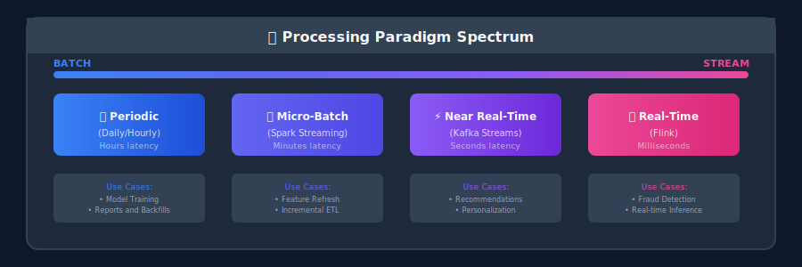
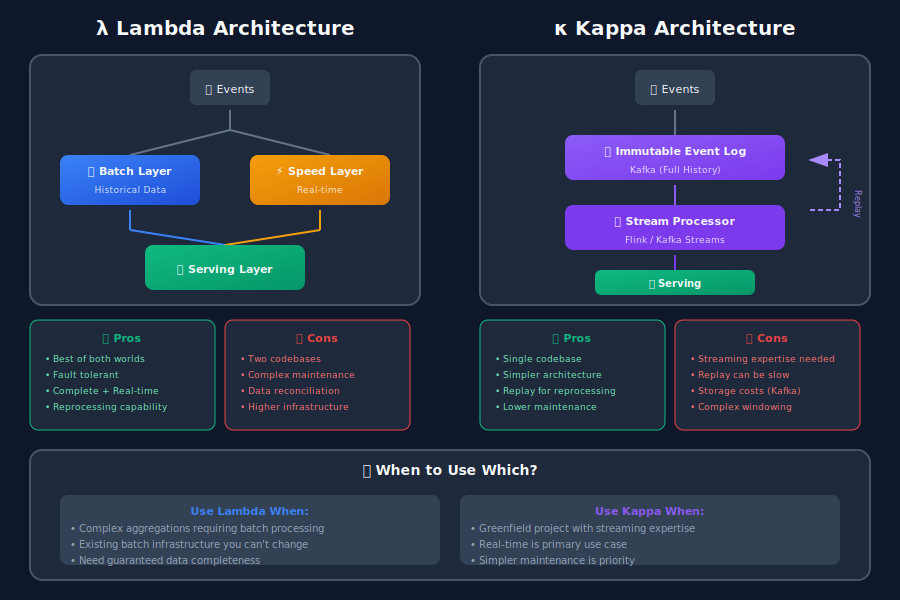
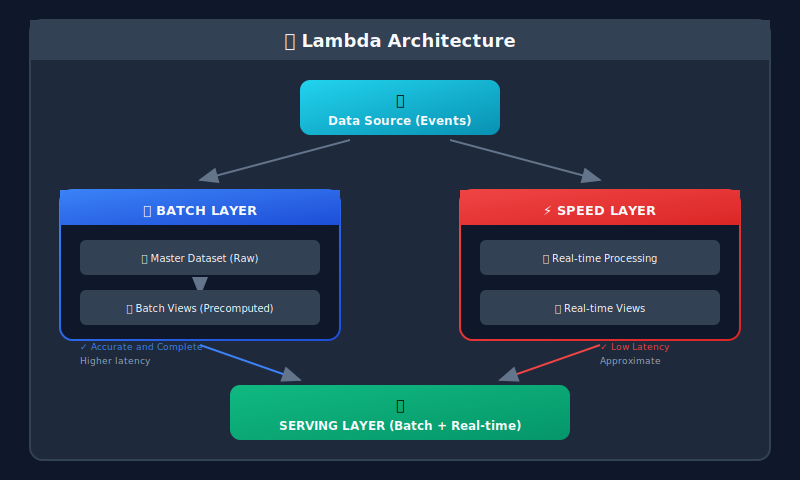
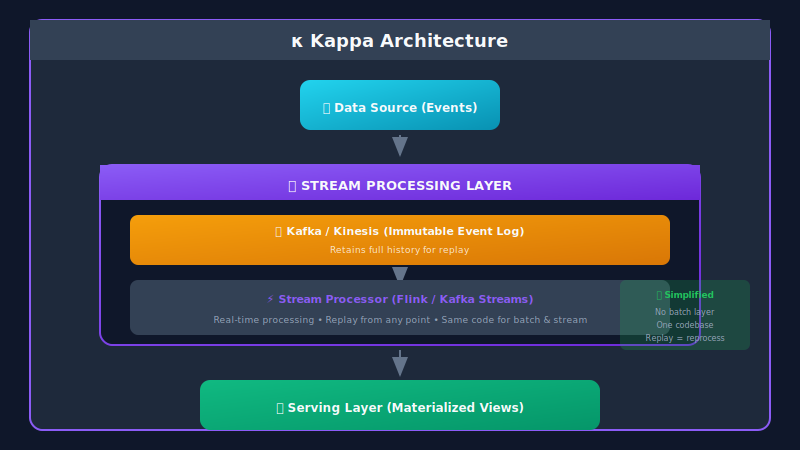

# Batch vs Stream Processing for ML Systems

## 🎯 The Processing Paradigm

Choosing between batch and stream processing is one of the most important architectural decisions in ML systems. Each paradigm has distinct characteristics that make it suitable for different use cases.



---

## 📐 Mathematical Foundations of Processing Systems

### Queueing Theory Fundamentals

Data processing systems can be modeled using queueing theory, which provides insights into latency, throughput, and resource utilization.

#### Kendall Notation: A/S/c

- **A**: Arrival process distribution

- **S**: Service time distribution  

- **c**: Number of servers (workers)

Common models: **M/M/1** (Markovian arrivals, exponential service, single server)

#### Little's Law

The fundamental relationship in queueing systems:

```math
L = \lambda \cdot W

```

where:

- $L$ = average number of items in system

- $\lambda$ = arrival rate (items/second)

- $W$ = average time in system (seconds)

**For pipeline design:** If you want $W < W\_{max}$, then system capacity must exceed $L/W\_{max}$.

#### M/M/1 Queue Analysis

For arrival rate $\lambda$ and service rate $\mu$:

**Utilization:**

```math
\rho = \frac{\lambda}{\mu}

```

**Average time in system:**

```math
W = \frac{1}{\mu - \lambda} = \frac{1}{\mu(1-\rho)}

```

**Average queue length:**

```math
L_q = \frac{\rho^2}{1-\rho}

```

**Key insight:** As $\rho \to 1$, latency $\to \infty$. Keep utilization below 70-80% for stable systems.

### Stream Processing Mathematics

#### Windowing Semantics

**Tumbling Window** (non-overlapping):

```math
W_k = [k \cdot w, (k+1) \cdot w), \quad k \in \mathbb{Z}

```

**Sliding Window** (overlapping):

```math
W_k = [k \cdot s, k \cdot s + w), \quad k \in \mathbb{Z}

```

where $w$ = window size, $s$ = slide interval.

**Session Window** (activity-based):

```math
W_{session} = \{e_1, ..., e_n\} : \forall i, t_{i+1} - t_i < g

```

where $g$ = gap duration.

#### Watermarks and Completeness

A **watermark** $W(t\_p)$ at processing time $t\_p$ is a heuristic bound:

```math
W(t_p) = \max\{t_e : \text{all events with } t_e' \leq t_e \text{ have arrived}\}

```

**Completeness guarantee:** For window $[a, b)$, we can close it when $W(t\_p) \geq b$.

**Allowed lateness:** Events with $t\_e < W(t\_p) - \text{lateness}$ may be dropped.

#### Exactly-Once Semantics

**Idempotent processing** ensures:

```math
f(f(x)) = f(x)

```

**Transactional boundaries** with offset commits:

```math
\text{commit}(\text{offset}_i) \Rightarrow \text{processed}(e_1, ..., e_i)

```

Recovery: Resume from $\text{offset}\_{last\_committed}$.

### Throughput and Latency Trade-offs

#### Batching Effect

For batch size $B$ and per-item processing cost $c$:

**Throughput:**

```math
\Theta = \frac{B}{c_{setup} + B \cdot c_{item}}

```

As $B \to \infty$: $\Theta \to \frac{1}{c\_{item}}$ (asymptotic maximum)

**Latency:**

```math
L = c_{setup} + B \cdot c_{item} + \frac{B-1}{2\lambda}

```

The last term accounts for waiting time to fill the batch.

**Trade-off:** Larger batches → higher throughput, higher latency.

#### Micro-batching

Spark Streaming uses micro-batches with interval $\Delta$:

```math
\text{latency} \geq \Delta + \text{processing\_time}

```

Minimum achievable latency bounded by batch interval.

### Information-Theoretic View

#### Data Freshness as Information

**Information decay:** Older data carries less information about current state.

For exponential decay:

```math
I(t) = I_0 \cdot e^{-\lambda t}

```

where $\lambda$ = decay rate, $t$ = data age.

**Optimal update frequency:** Balance information gain against processing cost:

```math
\max_f \left[ I(1/f) - C(f) \right]

```

where $f$ = update frequency, $C(f)$ = cost function.

#### Entropy of Event Streams

For event types with probabilities $p\_1, ..., p\_n$:

```math
H(X) = -\sum_{i=1}^{n} p_i \log_2 p_i

```

**Implications:**

- High entropy → events are unpredictable → need real-time processing

- Low entropy → events are predictable → batch processing may suffice

### Consistency Models

#### CAP Theorem Trade-offs

In distributed systems, choose 2 of 3:

- **Consistency**: All nodes see same data

- **Availability**: System responds to requests

- **Partition tolerance**: System works despite network failures

**Batch systems:** Typically choose CP (consistent when running)
**Stream systems:** Often choose AP (available, eventually consistent)

#### Eventual Consistency Mathematics

For update propagation time $T$ and update rate $\lambda$:

**Staleness probability:**

```math
P(\text{stale}) = 1 - e^{-\lambda T}

```

**Expected staleness duration:**

```math
E[\text{staleness}] = T/2

```

---

## 📦 Batch Processing

### Characteristics

| Aspect | Description |
|--------|-------------|
| **Latency** | Minutes to hours |
| **Throughput** | Very high (process TBs efficiently) |
| **Complexity** | Lower |
| **Use Cases** | Training data, historical features, ETL |
| **Guarantees** | Exactly-once (easier to achieve) |

### Apache Spark Batch Example

```python
from pyspark.sql import SparkSession
from pyspark.sql import functions as F
from pyspark.sql.window import Window

spark = SparkSession.builder \
    .appName("BatchFeaturePipeline") \
    .config("spark.sql.shuffle.partitions", "200") \
    .getOrCreate()

class BatchFeaturePipeline:
    """Batch processing for ML feature computation"""

    def __init__(self, input_path: str, output_path: str):
        self.input_path = input_path
        self.output_path = output_path

    def compute_user_features(self, date: str):
        """Compute daily user features from transaction data"""

        # Read transactions for the period
        transactions = spark.read.parquet(f"{self.input_path}/transactions/") \
            .filter(F.col("date") <= date) \
            .filter(F.col("date") >= F.date_sub(F.lit(date), 90))  # Last 90 days

        # Compute aggregated features
        user_features = transactions.groupBy("user_id").agg(
            # Recency
            F.datediff(F.lit(date), F.max("transaction_date")).alias("days_since_last_transaction"),

            # Frequency
            F.count("*").alias("transaction_count_90d"),
            F.countDistinct(F.when(F.col("date") >= F.date_sub(F.lit(date), 30), F.col("transaction_id"))).alias("transaction_count_30d"),
            F.countDistinct(F.when(F.col("date") >= F.date_sub(F.lit(date), 7), F.col("transaction_id"))).alias("transaction_count_7d"),

            # Monetary
            F.sum("amount").alias("total_spend_90d"),
            F.avg("amount").alias("avg_transaction_value"),
            F.max("amount").alias("max_transaction_value"),
            F.stddev("amount").alias("std_transaction_value"),

            # Behavioral
            F.countDistinct("merchant_category").alias("unique_categories"),
            F.countDistinct("merchant_id").alias("unique_merchants"),

            # Time patterns
            F.avg(F.hour("transaction_timestamp")).alias("avg_transaction_hour"),
            F.sum(F.when(F.dayofweek("transaction_date").isin([1, 7]), 1).otherwise(0)).alias("weekend_transactions")
        )

        # Add percentile ranks (relative to other users)
        window = Window.orderBy("total_spend_90d")
        user_features = user_features \
            .withColumn("spend_percentile", F.percent_rank().over(window)) \
            .withColumn("feature_date", F.lit(date))

        # Write features partitioned by date
        user_features.write \
            .mode("overwrite") \
            .partitionBy("feature_date") \
            .parquet(f"{self.output_path}/user_features/")

        return user_features

    def compute_product_features(self, date: str):
        """Compute product popularity and stats"""

        transactions = spark.read.parquet(f"{self.input_path}/transactions/") \
            .filter(F.col("date") <= date) \
            .filter(F.col("date") >= F.date_sub(F.lit(date), 30))

        product_features = transactions.groupBy("product_id").agg(
            F.count("*").alias("purchase_count_30d"),
            F.countDistinct("user_id").alias("unique_buyers_30d"),
            F.avg("amount").alias("avg_sale_price"),
            F.sum("amount").alias("total_revenue_30d")
        )

        # Compute popularity rank
        window = Window.orderBy(F.desc("purchase_count_30d"))
        product_features = product_features \
            .withColumn("popularity_rank", F.row_number().over(window)) \
            .withColumn("feature_date", F.lit(date))

        product_features.write \
            .mode("overwrite") \
            .partitionBy("feature_date") \
            .parquet(f"{self.output_path}/product_features/")

        return product_features

    def create_training_dataset(
        self,
        start_date: str,
        end_date: str,
        label_window_days: int = 7
    ):
        """Create training dataset with point-in-time features"""

        # Read events (labels)
        events = spark.read.parquet(f"{self.input_path}/events/") \
            .filter(F.col("date").between(start_date, end_date))

        # Read features
        user_features = spark.read.parquet(f"{self.output_path}/user_features/")
        product_features = spark.read.parquet(f"{self.output_path}/product_features/")

        # Point-in-time join (features before event)
        training_data = events \
            .join(
                user_features,
                (events.user_id == user_features.user_id) &
                (events.event_date > user_features.feature_date),
                "left"
            ) \
            .join(
                product_features,
                (events.product_id == product_features.product_id) &
                (events.event_date > product_features.feature_date),
                "left"
            )

        # Keep only most recent features before each event
        window = Window.partitionBy("event_id").orderBy(F.desc("feature_date"))
        training_data = training_data \
            .withColumn("feature_rank", F.row_number().over(window)) \
            .filter(F.col("feature_rank") == 1)

        return training_data

# Usage
pipeline = BatchFeaturePipeline(
    input_path="s3://datalake/raw/",
    output_path="s3://datalake/features/"
)

# Daily batch job
pipeline.compute_user_features("2024-01-15")
pipeline.compute_product_features("2024-01-15")

# Generate training data
training_data = pipeline.create_training_dataset("2024-01-01", "2024-01-15")

```

---

## 🌊 Stream Processing

### Characteristics

| Aspect | Description |
|--------|-------------|
| **Latency** | Milliseconds to seconds |
| **Throughput** | Moderate (per-event processing) |
| **Complexity** | Higher (state management, ordering) |
| **Use Cases** | Real-time features, fraud detection, recommendations |
| **Guarantees** | At-least-once (exactly-once is harder) |

### Apache Flink Stream Example

```python
from pyflink.datastream import StreamExecutionEnvironment
from pyflink.table import StreamTableEnvironment, EnvironmentSettings
from pyflink.table.expressions import col, lit
from pyflink.table.window import Tumble, Slide

# Initialize Flink environment
env = StreamExecutionEnvironment.get_execution_environment()
settings = EnvironmentSettings.new_instance().in_streaming_mode().build()
t_env = StreamTableEnvironment.create(env, environment_settings=settings)

# Define source (Kafka)
t_env.execute_sql("""
    CREATE TABLE user_events (
        user_id STRING,
        event_type STRING,
        product_id STRING,
        amount DOUBLE,
        event_time TIMESTAMP(3),
        WATERMARK FOR event_time AS event_time - INTERVAL '5' SECOND
    ) WITH (
        'connector' = 'kafka',
        'topic' = 'user-events',
        'properties.bootstrap.servers' = 'kafka:9092',
        'format' = 'json',
        'scan.startup.mode' = 'latest-offset'
    )
""")

# Define sink (Feature Store)
t_env.execute_sql("""
    CREATE TABLE user_realtime_features (
        user_id STRING,
        window_start TIMESTAMP(3),
        click_count_5min BIGINT,
        view_count_5min BIGINT,
        total_amount_5min DOUBLE,
        unique_products_5min BIGINT,
        PRIMARY KEY (user_id) NOT ENFORCED
    ) WITH (
        'connector' = 'upsert-kafka',
        'topic' = 'user-features',
        'properties.bootstrap.servers' = 'kafka:9092',
        'key.format' = 'json',
        'value.format' = 'json'
    )
""")

# Real-time feature computation with sliding window
t_env.execute_sql("""
    INSERT INTO user_realtime_features
    SELECT
        user_id,
        TUMBLE_START(event_time, INTERVAL '5' MINUTE) as window_start,
        COUNT(CASE WHEN event_type = 'click' THEN 1 END) as click_count_5min,
        COUNT(CASE WHEN event_type = 'view' THEN 1 END) as view_count_5min,
        SUM(amount) as total_amount_5min,
        COUNT(DISTINCT product_id) as unique_products_5min
    FROM user_events
    GROUP BY
        user_id,
        TUMBLE(event_time, INTERVAL '5' MINUTE)
""")

```

### Kafka Streams Example (Python with Faust)

```python
import faust
from datetime import timedelta
from typing import Dict, List
import json

# Initialize Faust app
app = faust.App(
    'ml-feature-processor',
    broker='kafka://localhost:9092',
    store='rocksdb://',  # For stateful processing
    topic_partitions=8
)

# Define data models
class UserEvent(faust.Record):
    user_id: str
    event_type: str
    product_id: str
    amount: float
    timestamp: float

class UserFeatures(faust.Record):
    user_id: str
    click_count_5min: int = 0
    view_count_5min: int = 0
    total_amount_5min: float = 0.0
    unique_products: List[str] = []
    last_updated: float = 0.0

# Topics
events_topic = app.topic('user-events', value_type=UserEvent)
features_topic = app.topic('user-features', value_type=UserFeatures)

# State table for user features (windowed)
user_features_table = app.Table(
    'user_features',
    default=UserFeatures,
    partitions=8
).tumbling(timedelta(minutes=5), expires=timedelta(hours=1))

# Stream processor
@app.agent(events_topic)
async def process_events(events):
    """Process events and update real-time features"""

    async for event in events:
        user_id = event.user_id

        # Get current window's features
        features = user_features_table[user_id]

        # Update features
        if event.event_type == 'click':
            features.click_count_5min += 1
        elif event.event_type == 'view':
            features.view_count_5min += 1

        features.total_amount_5min += event.amount

        if event.product_id not in features.unique_products:
            features.unique_products.append(event.product_id)

        features.last_updated = event.timestamp

        # Update table
        user_features_table[user_id] = features

        # Emit to features topic
        await features_topic.send(key=user_id, value=features)

# Aggregation with hopping/sliding windows
@app.agent(events_topic)
async def compute_sliding_aggregates(events):
    """Compute features over sliding windows"""

    async for event in events.group_by(UserEvent.user_id):
        # Use Faust's windowing for sliding aggregates
        window = user_features_table[event.user_id]

        # This automatically handles window semantics
        # Features are aggregated within the window

# API endpoint for feature serving
@app.page('/features/{user_id}')
async def get_features(web, request, user_id: str):
    """Serve real-time features via HTTP"""

    features = user_features_table.get(user_id)

    if features:
        return web.json({
            'user_id': user_id,
            'click_count_5min': features.click_count_5min,
            'view_count_5min': features.view_count_5min,
            'total_amount_5min': features.total_amount_5min,
            'unique_products_count': len(features.unique_products),
            'last_updated': features.last_updated
        })
    else:
        return web.json({'error': 'User not found'}, status=404)

if __name__ == '__main__':
    app.main()

```

---

## 🏗️ Lambda Architecture

Combines batch and streaming for comprehensive data processing.





```python
class LambdaArchitecture:
    """Lambda architecture implementation for ML features"""

    def __init__(self, batch_store, speed_store, serving_store):
        self.batch_store = batch_store
        self.speed_store = speed_store
        self.serving_store = serving_store

    def get_features(self, user_id: str) -> dict:
        """
        Merge batch and real-time features for serving.

        Batch: Historical aggregates computed daily
        Speed: Real-time updates since last batch run
        """

        # Get batch features (computed daily)
        batch_features = self.batch_store.get(user_id, {})

        # Get speed layer features (since last batch)
        speed_features = self.speed_store.get(user_id, {})

        # Merge: speed layer overwrites/augments batch
        merged = {**batch_features}

        # For counters, add speed layer deltas
        for key in ['click_count', 'view_count', 'purchase_count']:
            batch_val = batch_features.get(key, 0)
            speed_val = speed_features.get(f'{key}_delta', 0)
            merged[key] = batch_val + speed_val

        # For latest values, use speed layer if fresher
        for key in ['last_activity', 'cart_value']:
            if key in speed_features:
                merged[key] = speed_features[key]

        return merged

    def batch_process(self, date: str):
        """Run daily batch processing"""

        # Compute comprehensive features from all historical data
        features = self.compute_batch_features(date)

        # Update batch store
        self.batch_store.write(features)

        # Clear speed layer deltas (they're now in batch)
        self.speed_store.clear_before(date)

    def stream_process(self, event: dict):
        """Process real-time event"""

        user_id = event['user_id']

        # Update speed layer with delta
        current = self.speed_store.get(user_id, {})

        if event['type'] == 'click':
            current['click_count_delta'] = current.get('click_count_delta', 0) + 1
        elif event['type'] == 'view':
            current['view_count_delta'] = current.get('view_count_delta', 0) + 1

        current['last_activity'] = event['timestamp']

        self.speed_store.set(user_id, current)

```

---

## 🔄 Kappa Architecture

Simplifies Lambda by using only stream processing.



### Key Concept: Replay for Reprocessing

```python
from confluent_kafka import Consumer, TopicPartition

class KappaReprocessor:
    """
    Kappa architecture: Reprocess by replaying from Kafka.
    Same code handles both real-time and historical.
    """

    def __init__(self, bootstrap_servers: str, topic: str):
        self.bootstrap_servers = bootstrap_servers
        self.topic = topic

    def process_realtime(self, processor_func):
        """Normal real-time processing from latest offset"""

        consumer = Consumer({
            'bootstrap.servers': self.bootstrap_servers,
            'group.id': 'ml-features-realtime',
            'auto.offset.reset': 'latest'
        })
        consumer.subscribe([self.topic])

        while True:
            msg = consumer.poll(1.0)
            if msg is not None:
                processor_func(msg.value())

    def reprocess_from_beginning(self, processor_func, new_version: str):
        """
        Reprocess all historical data for new feature version.
        Uses same processor code - just starts from beginning.
        """

        consumer = Consumer({
            'bootstrap.servers': self.bootstrap_servers,
            'group.id': f'ml-features-reprocess-{new_version}',
            'auto.offset.reset': 'earliest'  # Start from beginning
        })
        consumer.subscribe([self.topic])

        while True:
            msg = consumer.poll(1.0)
            if msg is None:
                # Caught up to end
                break
            processor_func(msg.value(), version=new_version)

    def reprocess_from_timestamp(self, processor_func, timestamp_ms: int):
        """Reprocess from specific timestamp"""

        consumer = Consumer({
            'bootstrap.servers': self.bootstrap_servers,
            'group.id': 'ml-features-reprocess-timestamp',
        })

        # Get partition info
        metadata = consumer.list_topics(self.topic)
        partitions = [
            TopicPartition(self.topic, p)
            for p in metadata.topics[self.topic].partitions
        ]

        # Seek to timestamp
        offsets = consumer.offsets_for_times(
            [TopicPartition(self.topic, p.partition, timestamp_ms) for p in partitions]
        )

        consumer.assign(offsets)

        while True:
            msg = consumer.poll(1.0)
            if msg is None:
                break
            processor_func(msg.value())

```

---

## 📊 Comparison: When to Use What

| Criteria | Batch | Stream | Lambda | Kappa |
|----------|-------|--------|--------|-------|
| **Latency Requirement** | Hours OK | Seconds needed | Both | Seconds (replay for history) |
| **Implementation Complexity** | Low | Medium | High (2 systems) | Medium |
| **Operational Complexity** | Low | Medium | High | Medium |
| **Data Consistency** | Easy | Harder | Complex | Medium |
| **Cost** | Lower | Higher | Highest | Medium |
| **Reprocessing** | Easy | Replay needed | Both paths | Replay |
| **Use Cases** | Training, ETL | Real-time serving | Legacy + real-time | Modern streaming |

---

## 🎓 Key Takeaways

1. **Start with batch** if you can tolerate hours of latency

2. **Add streaming** when real-time features provide business value

3. **Lambda architecture** is powerful but complex - consider maintenance cost

4. **Kappa architecture** simplifies by unifying on streaming (with replay)

5. **Consider hybrid** - batch for training, stream for serving

6. **Test thoroughly** - streaming introduces new failure modes

---

*Next Chapter: [Pipeline Orchestration →](../08_pipeline_orchestration/README.md)*

---

<div align="center">

**[⬆ Back to Top](#)** | **[📚 Main Repository](https://github.com/Gaurav14cs17/ml_system_design)**

Made with 💜 by [Gaurav14cs17](https://github.com/Gaurav14cs17)

</div>
