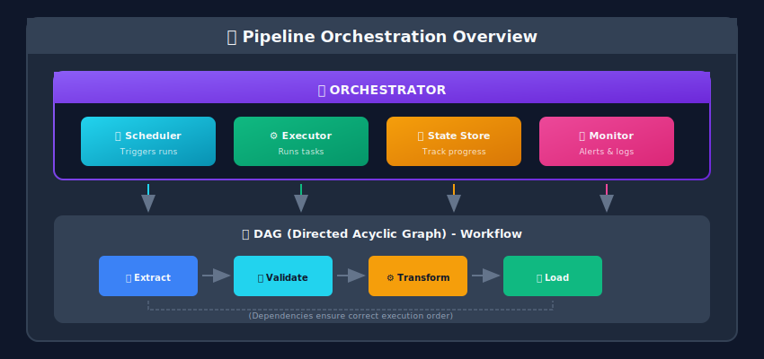
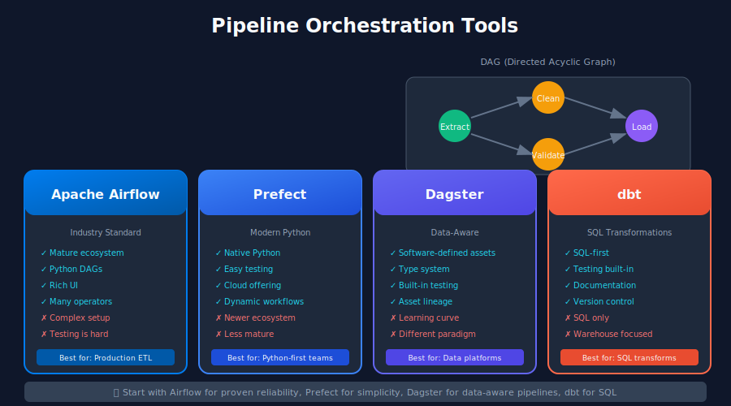

# Pipeline Orchestration for ML Systems

## 🎯 What is Orchestration?

**Orchestration** is the automated coordination, management, and execution of complex data workflows. It ensures that tasks run in the correct order, handles failures gracefully, and provides visibility into pipeline health.



---



## 🛠️ Popular Orchestration Tools

### Tool Comparison

| Tool | Best For | Language | Complexity | Cloud-Native |
|------|----------|----------|------------|--------------|
| **Apache Airflow** | General workflows, mature ecosystem | Python | Medium | ✓ (managed options) |
| **Prefect** | Modern Python workflows | Python | Low | ✓ (Prefect Cloud) |
| **Dagster** | Data-aware orchestration | Python | Medium | ✓ (Dagster Cloud) |
| **Argo Workflows** | Kubernetes-native | YAML | Medium | ✓ |
| **Kubeflow Pipelines** | ML-specific on K8s | Python/YAML | High | ✓ |
| **dbt** | SQL transformations | SQL | Low | ✓ (dbt Cloud) |

---

## 🌬️ Apache Airflow

The most widely used orchestrator for data pipelines.

### DAG Example: ML Feature Pipeline

```python
from datetime import datetime, timedelta
from airflow import DAG
from airflow.operators.python import PythonOperator
from airflow.operators.bash import BashOperator
from airflow.providers.amazon.aws.operators.s3 import S3CreateObjectOperator
from airflow.providers.amazon.aws.transfers.s3_to_redshift import S3ToRedshiftOperator
from airflow.utils.task_group import TaskGroup
from airflow.sensors.external_task import ExternalTaskSensor

# Default arguments
default_args = {
    'owner': 'ml-team',
    'depends_on_past': False,
    'email': ['ml-alerts@company.com'],
    'email_on_failure': True,
    'email_on_retry': False,
    'retries': 3,
    'retry_delay': timedelta(minutes=5),
    'retry_exponential_backoff': True,
    'max_retry_delay': timedelta(hours=1),
}

# Define the DAG
with DAG(
    dag_id='ml_feature_pipeline',
    default_args=default_args,
    description='Daily ML feature computation pipeline',
    schedule_interval='0 6 * * *',  # Daily at 6 AM UTC
    start_date=datetime(2024, 1, 1),
    catchup=False,
    tags=['ml', 'features', 'production'],
    max_active_runs=1,
) as dag:

    # Wait for upstream data to be ready
    wait_for_raw_data = ExternalTaskSensor(
        task_id='wait_for_raw_data',
        external_dag_id='raw_data_ingestion',
        external_task_id='data_quality_check',
        timeout=3600,
        poke_interval=60,
        mode='reschedule',
    )

    # Task Group: Data Validation
    with TaskGroup(group_id='data_validation') as validation_group:

        def validate_schema(**context):
            """Validate input data schema"""
            from great_expectations import get_context

            ge_context = get_context()
            result = ge_context.run_checkpoint(
                checkpoint_name="raw_data_checkpoint"
            )

            if not result.success:
                raise ValueError("Schema validation failed!")

            return {"validation_passed": True}

        validate_schema_task = PythonOperator(
            task_id='validate_schema',
            python_callable=validate_schema,
        )

        def check_data_freshness(**context):
            """Ensure data is not stale"""
            from datetime import datetime
            import pandas as pd

            df = pd.read_parquet('s3://datalake/raw/events/')
            max_date = df['event_date'].max()

            days_old = (datetime.now().date() - max_date).days
            if days_old > 1:
                raise ValueError(f"Data is {days_old} days old!")

            return {"max_date": str(max_date)}

        freshness_task = PythonOperator(
            task_id='check_freshness',
            python_callable=check_data_freshness,
        )

        validate_schema_task >> freshness_task

    # Task Group: Feature Computation
    with TaskGroup(group_id='feature_computation') as compute_group:

        def compute_user_features(**context):
            """Compute user-level features"""
            from pyspark.sql import SparkSession

            execution_date = context['ds']

            spark = SparkSession.builder \
                .appName(f"user_features_{execution_date}") \
                .getOrCreate()

            # Run feature computation
            # ... (feature logic from previous chapter)

            spark.stop()
            return {"features_computed": True}

        user_features_task = PythonOperator(
            task_id='compute_user_features',
            python_callable=compute_user_features,
            pool='spark_pool',  # Limit concurrent Spark jobs
        )

        def compute_product_features(**context):
            """Compute product-level features"""
            execution_date = context['ds']
            # ... product feature logic
            return {"features_computed": True}

        product_features_task = PythonOperator(
            task_id='compute_product_features',
            python_callable=compute_product_features,
            pool='spark_pool',
        )

        def compute_interaction_features(**context):
            """Compute user-product interaction features"""
            execution_date = context['ds']
            # ... interaction feature logic
            return {"features_computed": True}

        interaction_features_task = PythonOperator(
            task_id='compute_interaction_features',
            python_callable=compute_interaction_features,
            pool='spark_pool',
        )

        # These can run in parallel
        [user_features_task, product_features_task] >> interaction_features_task

    # Task Group: Feature Store Sync
    with TaskGroup(group_id='feature_store_sync') as sync_group:

        def sync_to_offline_store(**context):
            """Sync features to offline feature store"""
            from feast import FeatureStore

            store = FeatureStore(repo_path="feature_repo/")
            store.materialize(
                start_date=datetime.now() - timedelta(days=1),
                end_date=datetime.now(),
            )
            return {"synced": True}

        offline_sync = PythonOperator(
            task_id='sync_offline_store',
            python_callable=sync_to_offline_store,
        )

        def sync_to_online_store(**context):
            """Sync latest features to online store (Redis)"""
            import redis
            import pandas as pd

            # Read computed features
            features_df = pd.read_parquet(
                f's3://datalake/features/user_features/date={context["ds"]}/'
            )

            # Sync to Redis
            r = redis.Redis(host='feature-store-redis', port=6379)

            for _, row in features_df.iterrows():
                key = f"user:{row['user_id']}"
                r.hset(key, mapping=row.to_dict())

            return {"synced_count": len(features_df)}

        online_sync = PythonOperator(
            task_id='sync_online_store',
            python_callable=sync_to_online_store,
        )

        offline_sync >> online_sync

    # Quality checks after sync
    def run_feature_quality_checks(**context):
        """Validate feature quality post-computation"""
        checks = {
            "null_rate": check_null_rates(),
            "distribution": check_distributions(),
            "freshness": check_feature_freshness(),
        }

        if not all(checks.values()):
            raise ValueError(f"Quality checks failed: {checks}")

        return checks

    quality_checks = PythonOperator(
        task_id='feature_quality_checks',
        python_callable=run_feature_quality_checks,
    )

    # Notification
    def send_completion_notification(**context):
        """Send Slack notification on completion"""
        from airflow.providers.slack.hooks.slack_webhook import SlackWebhookHook

        hook = SlackWebhookHook(slack_webhook_conn_id='slack_webhook')
        hook.send_text(
            f"✅ ML Feature Pipeline completed for {context['ds']}\n"
            f"Features synced to online and offline stores."
        )

    notify = PythonOperator(
        task_id='send_notification',
        python_callable=send_completion_notification,
        trigger_rule='all_success',
    )

    # Define dependencies
    wait_for_raw_data >> validation_group >> compute_group >> sync_group >> quality_checks >> notify

```

### Airflow Best Practices

```python
# 1. Use Variables and Connections for configuration
from airflow.models import Variable

S3_BUCKET = Variable.get("feature_store_bucket")
ENVIRONMENT = Variable.get("environment", default_var="dev")

# 2. Implement proper XComs for task communication
def task_with_return(**context):
    result = {"key": "value", "count": 100}
    context['ti'].xcom_push(key='my_result', value=result)
    return result

def downstream_task(**context):
    upstream_result = context['ti'].xcom_pull(
        task_ids='task_with_return',
        key='my_result'
    )
    print(f"Got: {upstream_result}")

# 3. Use Sensors appropriately
from airflow.sensors.s3_key_sensor import S3KeySensor

wait_for_file = S3KeySensor(
    task_id='wait_for_file',
    bucket_name='my-bucket',
    bucket_key='data/{{ ds }}/file.parquet',
    poke_interval=60,
    timeout=3600,
    mode='reschedule',  # Don't block worker
)

# 4. Implement proper error handling
from airflow.operators.python import PythonOperator
from airflow.exceptions import AirflowFailException, AirflowSkipException

def conditional_task(**context):
    data_exists = check_data_exists(context['ds'])

    if not data_exists:
        raise AirflowSkipException("No data for this date, skipping")

    if critical_error:
        raise AirflowFailException("Critical error, failing task")

# 5. Use Task Groups for organization
from airflow.utils.task_group import TaskGroup

with TaskGroup(group_id='etl_group') as etl:
    extract >> transform >> load

```

---

## 🌊 Prefect

Modern, Pythonic workflow orchestration.

```python
from prefect import flow, task, get_run_logger
from prefect.tasks import task_input_hash
from prefect.blocks.system import Secret
from datetime import timedelta
import pandas as pd

# Define tasks with caching
@task(
    retries=3,
    retry_delay_seconds=60,
    cache_key_fn=task_input_hash,
    cache_expiration=timedelta(hours=1),
)
def extract_data(date: str) -> pd.DataFrame:
    """Extract raw data from source"""
    logger = get_run_logger()
    logger.info(f"Extracting data for {date}")

    df = pd.read_parquet(f"s3://bucket/raw/date={date}/")
    logger.info(f"Extracted {len(df)} rows")

    return df

@task(retries=2)
def validate_data(df: pd.DataFrame) -> bool:
    """Validate data quality"""
    logger = get_run_logger()

    # Check for nulls
    null_rate = df.isnull().sum().sum() / df.size
    if null_rate > 0.1:
        raise ValueError(f"Null rate too high: {null_rate:.2%}")

    # Check for duplicates
    dup_rate = df.duplicated().sum() / len(df)
    if dup_rate > 0.01:
        raise ValueError(f"Duplicate rate too high: {dup_rate:.2%}")

    logger.info("Data validation passed")
    return True

@task
def compute_features(df: pd.DataFrame) -> pd.DataFrame:
    """Compute ML features"""
    logger = get_run_logger()

    features = df.groupby('user_id').agg({
        'amount': ['sum', 'mean', 'count'],
        'timestamp': 'max'
    })
    features.columns = ['total_amount', 'avg_amount', 'transaction_count', 'last_transaction']

    logger.info(f"Computed features for {len(features)} users")
    return features.reset_index()

@task
def load_to_feature_store(features: pd.DataFrame, date: str):
    """Load features to feature store"""
    logger = get_run_logger()

    # Load to offline store
    features.to_parquet(f"s3://feature-store/user_features/date={date}/")

    # Load to online store (Redis)
    import redis
    r = redis.Redis(host='redis', port=6379)

    for _, row in features.iterrows():
        r.hset(f"user:{row['user_id']}", mapping=row.to_dict())

    logger.info(f"Loaded {len(features)} features to stores")

@task
def send_notification(date: str, feature_count: int):
    """Send completion notification"""
    import requests

    requests.post(
        "https://hooks.slack.com/services/...",
        json={"text": f"✅ Features computed for {date}: {feature_count} users"}
    )

# Define the flow
@flow(
    name="ml-feature-pipeline",
    description="Daily ML feature computation",
    version="1.0.0",
    retries=1,
    retry_delay_seconds=300,
)
def feature_pipeline(date: str):
    """Main feature pipeline flow"""
    logger = get_run_logger()
    logger.info(f"Starting feature pipeline for {date}")

    # Extract
    raw_data = extract_data(date)

    # Validate
    is_valid = validate_data(raw_data)

    # Compute features (only if validation passed)
    features = compute_features(raw_data, wait_for=[is_valid])

    # Load
    load_to_feature_store(features, date)

    # Notify
    send_notification(date, len(features))

    return {"status": "success", "feature_count": len(features)}

# Subflows for modular pipelines
@flow
def user_feature_subflow(date: str):
    """Subflow for user features"""
    data = extract_data.with_options(name="extract_user_data")(date)
    features = compute_user_features(data)
    return features

@flow
def product_feature_subflow(date: str):
    """Subflow for product features"""
    data = extract_data.with_options(name="extract_product_data")(date)
    features = compute_product_features(data)
    return features

@flow
def combined_pipeline(date: str):
    """Combine multiple subflows"""
    user_features = user_feature_subflow(date)
    product_features = product_feature_subflow(date)

    # Combine and load
    combined = merge_features(user_features, product_features)
    load_to_feature_store(combined, date)

# Schedule with Prefect deployments
if __name__ == "__main__":
    from prefect.deployments import Deployment
    from prefect.server.schemas.schedules import CronSchedule

    deployment = Deployment.build_from_flow(
        flow=feature_pipeline,
        name="daily-features",
        schedule=CronSchedule(cron="0 6 * * *", timezone="UTC"),
        work_queue_name="ml-pipelines",
        tags=["ml", "features", "production"],
    )
    deployment.apply()

```

---

## 🗡️ Dagster

Data-aware orchestration with Software-Defined Assets.

```python
from dagster import (
    asset,
    AssetIn,
    DailyPartitionsDefinition,
    AssetExecutionContext,
    Definitions,
    ScheduleDefinition,
    define_asset_job,
    FreshnessPolicy,
    AutoMaterializePolicy,
)
import pandas as pd

# Define partitions (daily)
daily_partitions = DailyPartitionsDefinition(start_date="2024-01-01")

# Software-Defined Assets
@asset(
    partitions_def=daily_partitions,
    compute_kind="pandas",
    group_name="raw",
)
def raw_transactions(context: AssetExecutionContext) -> pd.DataFrame:
    """Raw transaction data from source"""
    partition_date = context.partition_key

    df = pd.read_parquet(f"s3://raw/transactions/date={partition_date}/")

    context.add_output_metadata({
        "num_rows": len(df),
        "columns": list(df.columns),
    })

    return df

@asset(
    partitions_def=daily_partitions,
    ins={"raw_transactions": AssetIn()},
    compute_kind="pandas",
    group_name="validated",
)
def validated_transactions(
    context: AssetExecutionContext,
    raw_transactions: pd.DataFrame
) -> pd.DataFrame:
    """Validated and cleaned transactions"""

    # Remove nulls
    df = raw_transactions.dropna(subset=['user_id', 'amount'])

    # Remove duplicates
    df = df.drop_duplicates(subset=['transaction_id'])

    # Validate ranges
    df = df[(df['amount'] > 0) & (df['amount'] < 100000)]

    context.add_output_metadata({
        "rows_before": len(raw_transactions),
        "rows_after": len(df),
        "dropped_rows": len(raw_transactions) - len(df),
    })

    return df

@asset(
    partitions_def=daily_partitions,
    ins={"validated_transactions": AssetIn()},
    compute_kind="pandas",
    group_name="features",
    freshness_policy=FreshnessPolicy(maximum_lag_minutes=60*6),  # 6 hours
    auto_materialize_policy=AutoMaterializePolicy.eager(),
)
def user_features(
    context: AssetExecutionContext,
    validated_transactions: pd.DataFrame
) -> pd.DataFrame:
    """User-level aggregated features"""

    features = validated_transactions.groupby('user_id').agg({
        'amount': ['sum', 'mean', 'count', 'std'],
        'timestamp': ['min', 'max'],
        'category': pd.Series.nunique,
    })

    features.columns = [
        'total_spend', 'avg_spend', 'transaction_count', 'spend_std',
        'first_transaction', 'last_transaction', 'unique_categories'
    ]

    # Derived features
    features['recency_days'] = (
        pd.Timestamp(context.partition_key) - features['last_transaction']
    ).dt.days

    features['frequency'] = features['transaction_count'] / (
        (features['last_transaction'] - features['first_transaction']).dt.days + 1
    )

    context.add_output_metadata({
        "num_users": len(features),
        "avg_spend": features['avg_spend'].mean(),
    })

    return features.reset_index()

@asset(
    ins={"user_features": AssetIn()},
    compute_kind="redis",
    group_name="serving",
)
def online_feature_store(
    context: AssetExecutionContext,
    user_features: pd.DataFrame
) -> None:
    """Sync features to online store"""
    import redis

    r = redis.Redis(host='redis', port=6379)

    synced = 0
    for _, row in user_features.iterrows():
        r.hset(f"user:{row['user_id']}", mapping=row.to_dict())
        synced += 1

    context.add_output_metadata({
        "users_synced": synced,
    })

# Asset checks for data quality
from dagster import asset_check, AssetCheckResult

@asset_check(asset=user_features)
def check_no_nulls(user_features: pd.DataFrame) -> AssetCheckResult:
    """Check for null values in critical columns"""
    null_count = user_features[['user_id', 'total_spend']].isnull().sum().sum()

    return AssetCheckResult(
        passed=null_count == 0,
        metadata={"null_count": null_count}
    )

@asset_check(asset=user_features)
def check_spend_distribution(user_features: pd.DataFrame) -> AssetCheckResult:
    """Check that spend distribution is reasonable"""
    mean_spend = user_features['total_spend'].mean()

    return AssetCheckResult(
        passed=100 < mean_spend < 10000,
        metadata={"mean_spend": mean_spend}
    )

# Define job and schedule
feature_job = define_asset_job(
    name="daily_features",
    selection=[raw_transactions, validated_transactions, user_features, online_feature_store],
    partitions_def=daily_partitions,
)

daily_schedule = ScheduleDefinition(
    job=feature_job,
    cron_schedule="0 6 * * *",
    execution_timezone="UTC",
)

# Dagster Definitions
defs = Definitions(
    assets=[raw_transactions, validated_transactions, user_features, online_feature_store],
    asset_checks=[check_no_nulls, check_spend_distribution],
    jobs=[feature_job],
    schedules=[daily_schedule],
)

```

---

## 📊 Orchestration Patterns

### Pattern 1: Backfilling

```python
# Airflow backfill
from airflow.utils.dates import days_ago

with DAG(
    dag_id='backfillable_pipeline',
    start_date=days_ago(365),  # Allow backfill for past year
    catchup=True,  # Enable backfilling
) as dag:

    @task
    def process_partition(ds):
        """Process single partition - idempotent"""
        # Clear and recompute
        clear_partition(ds)
        compute_features(ds)

# Prefect backfill
from prefect import flow
from datetime import date, timedelta

@flow
def backfill_features(start_date: date, end_date: date):
    """Backfill features for date range"""
    current = start_date
    while current <= end_date:
        feature_pipeline(str(current))
        current += timedelta(days=1)

```

### Pattern 2: Cross-DAG Dependencies

```python
# Airflow: Wait for upstream DAG
from airflow.sensors.external_task import ExternalTaskSensor

wait_for_upstream = ExternalTaskSensor(
    task_id='wait_for_data_ingestion',
    external_dag_id='data_ingestion_pipeline',
    external_task_id='final_task',
    allowed_states=['success'],
    failed_states=['failed', 'skipped'],
    execution_date_fn=lambda dt: dt,  # Same execution date
    timeout=3600,
)

```

### Pattern 3: Dynamic Task Generation

```python
# Airflow dynamic tasks
from airflow.decorators import dag, task

@dag(schedule_interval='@daily')
def dynamic_feature_pipeline():

    @task
    def get_feature_configs():
        """Get list of features to compute"""
        return ['user_features', 'product_features', 'interaction_features']

    @task
    def compute_feature(feature_name: str):
        """Compute single feature"""
        # ... computation logic
        return {"feature": feature_name, "status": "done"}

    @task
    def combine_results(results):
        """Combine all feature results"""
        return {"all_features": results}

    configs = get_feature_configs()
    features = compute_feature.expand(feature_name=configs)
    combine_results(features)

dynamic_feature_pipeline()

```

---

## 🎓 Key Takeaways

1. **Choose the right tool** - Airflow for maturity, Prefect for simplicity, Dagster for data-awareness

2. **Design for idempotency** - Tasks should be safe to retry

3. **Implement proper monitoring** - Visibility is crucial for debugging

4. **Use backfilling carefully** - Test with limited date ranges first

5. **Handle failures gracefully** - Retries, alerts, and fallbacks

6. **Version your workflows** - Track changes to pipeline logic

---

*Next Chapter: [Data Versioning & Lineage →](../09_data_versioning_lineage/README.md)*

---

<div align="center">

**[⬆ Back to Top](#)** | **[📚 Main Repository](https://github.com/Gaurav14cs17/ml_system_design)**

Made with 💜 by [Gaurav14cs17](https://github.com/Gaurav14cs17)

</div>
