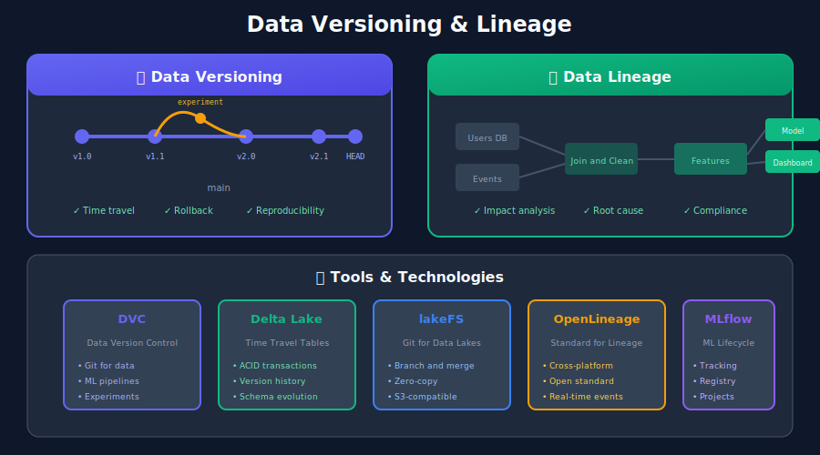
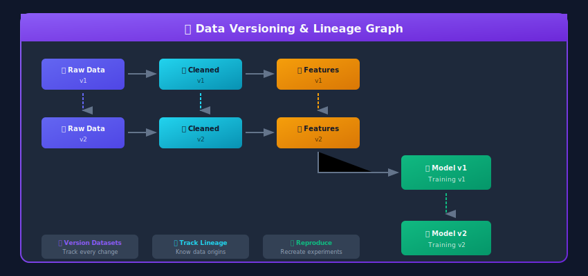
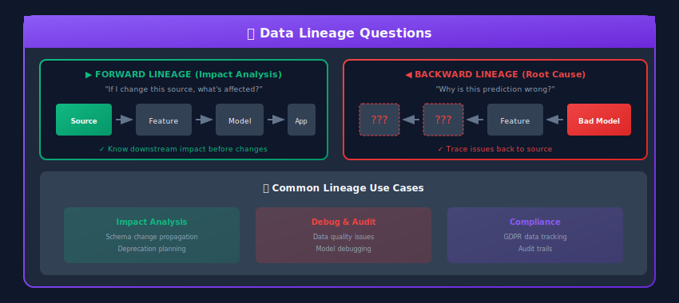

# Data Versioning & Lineage for ML Systems



## 🎯 Why Version Data?

In ML systems, **data versioning** and **lineage tracking** are essential for:

- **Reproducibility**: Recreate any model with exact training data
- **Debugging**: Trace issues back to data problems
- **Compliance**: Audit trail for regulated industries
- **Collaboration**: Share and compare experiments
- **Rollback**: Revert to previous data states



---

## 📦 Data Versioning Tools

### Tool Comparison

| Tool | Best For | Storage | Git Integration | ML Focus |
|------|----------|---------|-----------------|----------|
| **DVC** | ML datasets, models | Remote storage | ✓ (metadata in git) | ✓ |
| **Delta Lake** | Lakehouse tables | ACID on data lake | ✗ | Partial |
| **lakeFS** | Data lake versioning | S3-compatible | Git-like branches | ✓ |
| **Pachyderm** | Data pipelines | Kubernetes | ✗ | ✓ |
| **MLflow** | ML artifacts | Artifact store | ✗ | ✓ |

---

## 🔧 DVC (Data Version Control)

### Setup and Basic Usage

```bash
# Initialize DVC in your project
cd ml-project
dvc init

# Track a large dataset
dvc add data/training_data.parquet

# This creates data/training_data.parquet.dvc (metadata)
# And adds the actual file to .gitignore

# Configure remote storage
dvc remote add -d myremote s3://my-bucket/dvc-store

# Push data to remote
dvc push

# Commit metadata to git
git add data/training_data.parquet.dvc .gitignore
git commit -m "Add training data v1"

# Create a version tag
git tag -a "data-v1.0" -m "Initial training data"

```

### DVC Pipeline Definition

```yaml
# dvc.yaml
stages:
  prepare:
    cmd: python src/prepare.py
    deps:
      - src/prepare.py
      - data/raw/
    outs:
      - data/prepared/
    params:
      - prepare.split_ratio
      - prepare.seed

  featurize:
    cmd: python src/featurize.py
    deps:
      - src/featurize.py
      - data/prepared/
    outs:
      - data/features/
    params:
      - featurize.max_features
      - featurize.ngrams

  train:
    cmd: python src/train.py
    deps:
      - src/train.py
      - data/features/
    outs:
      - models/model.pkl
    params:
      - train.n_estimators
      - train.learning_rate
    metrics:
      - metrics.json:
          cache: false
    plots:
      - plots/confusion_matrix.png

  evaluate:
    cmd: python src/evaluate.py
    deps:
      - src/evaluate.py
      - models/model.pkl
      - data/features/test/
    metrics:
      - evaluation.json:
          cache: false

```

```yaml
# params.yaml
prepare:
  split_ratio: 0.2
  seed: 42

featurize:
  max_features: 5000
  ngrams: 2

train:
  n_estimators: 100
  learning_rate: 0.1

```

### Running DVC Pipelines

```bash
# Run the full pipeline
dvc repro

# Run specific stage
dvc repro train

# Show pipeline status
dvc status

# Compare metrics across experiments
dvc metrics diff

# Compare parameters
dvc params diff

# Visualize pipeline
dvc dag

```

### DVC Experiments

```python
# src/train.py
import dvc.api
import json
import pickle
from sklearn.ensemble import RandomForestClassifier

# Load parameters from params.yaml
params = dvc.api.params_show()

# Load versioned data
with dvc.api.open('data/features/train.pkl', mode='rb') as f:
    X_train, y_train = pickle.load(f)

# Train model
model = RandomForestClassifier(
    n_estimators=params['train']['n_estimators'],
    max_depth=params['train'].get('max_depth'),
    random_state=42
)
model.fit(X_train, y_train)

# Save model
with open('models/model.pkl', 'wb') as f:
    pickle.dump(model, f)

# Log metrics
metrics = {
    'train_accuracy': model.score(X_train, y_train),
    'n_features': X_train.shape[1],
}
with open('metrics.json', 'w') as f:
    json.dump(metrics, f)

```

```bash
# Run experiments with different parameters
dvc exp run --set-param train.n_estimators=200
dvc exp run --set-param train.n_estimators=300

# Compare experiments
dvc exp show

# Apply best experiment to workspace
dvc exp apply exp-abc123

# Clean up experiments
dvc exp gc --workspace

```

---

## 🌊 Delta Lake Time Travel

```python
from delta import DeltaTable
from pyspark.sql import SparkSession

spark = SparkSession.builder \
    .config("spark.sql.extensions", "io.delta.sql.DeltaSparkSessionExtension") \
    .getOrCreate()

# Read specific version
df_v0 = spark.read.format("delta") \
    .option("versionAsOf", 0) \
    .load("s3://bucket/features/user_features/")

# Read as of timestamp
df_historical = spark.read.format("delta") \
    .option("timestampAsOf", "2024-01-15 10:00:00") \
    .load("s3://bucket/features/user_features/")

# Compare versions
from delta.tables import DeltaTable

delta_table = DeltaTable.forPath(spark, "s3://bucket/features/user_features/")

# Get version history
history = delta_table.history()
history.select("version", "timestamp", "operation", "operationMetrics").show()

# +-------+-------------------+-----------+------------------+
# |version|          timestamp|  operation|  operationMetrics|
# +-------+-------------------+-----------+------------------+
# |      5|2024-01-16 10:00:00|      MERGE|{numTargetRows..} |
# |      4|2024-01-15 10:00:00|     UPDATE|{numUpdated...}   |
# |      3|2024-01-14 10:00:00|      WRITE|{numOutputRows..} |
# +-------+-------------------+-----------+------------------+

# Restore to previous version
delta_table.restoreToVersion(3)

# Or restore to timestamp
delta_table.restoreToTimestamp("2024-01-14 10:00:00")

```

### Delta Lake for ML Training Data

```python
class VersionedTrainingDataManager:
    """Manage versioned training datasets with Delta Lake"""

    def __init__(self, base_path: str):
        self.base_path = base_path
        self.spark = SparkSession.builder.getOrCreate()

    def create_training_snapshot(
        self,
        df,
        name: str,
        version_tag: str = None
    ):
        """Create a versioned snapshot of training data"""

        path = f"{self.base_path}/training_data/{name}"

        # Write as Delta table
        df.write.format("delta").mode("overwrite").save(path)

        # Get version number
        delta_table = DeltaTable.forPath(self.spark, path)
        version = delta_table.history(1).collect()[0]["version"]

        # Add tag in metadata
        if version_tag:
            self.spark.sql(f"""
                ALTER TABLE delta.`{path}`
                SET TBLPROPERTIES ('version_tag' = '{version_tag}')
            """)

        return {"path": path, "version": version, "tag": version_tag}

    def get_training_data_by_version(
        self,
        name: str,
        version: int
    ):
        """Load training data at specific version"""

        path = f"{self.base_path}/training_data/{name}"

        return self.spark.read.format("delta") \
            .option("versionAsOf", version) \
            .load(path)

    def compare_versions(
        self,
        name: str,
        version1: int,
        version2: int
    ) -> dict:
        """Compare two versions of training data"""

        df1 = self.get_training_data_by_version(name, version1)
        df2 = self.get_training_data_by_version(name, version2)

        return {
            "v1_count": df1.count(),
            "v2_count": df2.count(),
            "v1_schema": df1.schema.json(),
            "v2_schema": df2.schema.json(),
            "rows_added": df2.exceptAll(df1).count(),
            "rows_removed": df1.exceptAll(df2).count(),
        }

# Usage
manager = VersionedTrainingDataManager("s3://ml-data")

# Create training snapshot
snapshot = manager.create_training_snapshot(
    training_df,
    name="customer_churn",
    version_tag="experiment-42"
)

# Later: load exact data for reproducibility
training_data = manager.get_training_data_by_version(
    "customer_churn",
    version=snapshot["version"]
)

```

---

## 🌲 lakeFS: Git for Data Lakes

```python
import lakefs_client
from lakefs_client import models
from lakefs_client.client import LakeFSClient

# Configure lakeFS client
configuration = lakefs_client.Configuration(
    host="http://localhost:8000/api/v1",
    username="access_key",
    password="secret_key"
)

client = LakeFSClient(configuration)

class LakeFSVersioning:
    """Git-like versioning for data lakes"""

    def __init__(self, client: LakeFSClient, repository: str):
        self.client = client
        self.repository = repository

    def create_branch(self, branch_name: str, source_branch: str = "main"):
        """Create a new branch for data experimentation"""

        branch = models.BranchCreation(
            name=branch_name,
            source=source_branch
        )

        self.client.branches.create_branch(
            repository=self.repository,
            branch_creation=branch
        )

        return f"lakefs://{self.repository}/{branch_name}/"

    def commit(self, branch: str, message: str, metadata: dict = None):
        """Commit changes to branch"""

        commit_creation = models.CommitCreation(
            message=message,
            metadata=metadata or {}
        )

        return self.client.commits.commit(
            repository=self.repository,
            branch=branch,
            commit_creation=commit_creation
        )

    def merge(self, source_branch: str, dest_branch: str):
        """Merge branches (like git merge)"""

        merge = models.Merge(source_ref=source_branch)

        return self.client.refs.merge_into_branch(
            repository=self.repository,
            source_ref=source_branch,
            destination_branch=dest_branch,
            merge=merge
        )

    def get_data_path(self, branch: str, path: str = "") -> str:
        """Get S3-compatible path for branch"""
        return f"s3://lakefs-repo/{self.repository}/{branch}/{path}"

# Usage Example: Experiment with Data Changes
lakefs = LakeFSVersioning(client, "ml-features")

# Create experiment branch
exp_branch = lakefs.create_branch("experiment/new-features", "main")

# Write experimental features to branch
experimental_features.write.parquet(
    f"s3a://ml-features/experiment-new-features/features/"
)

# Commit changes
lakefs.commit(
    branch="experiment/new-features",
    message="Add new customer segment features",
    metadata={"experiment_id": "exp-42", "author": "ml-team"}
)

# After validation, merge to main
lakefs.merge("experiment/new-features", "main")

```

---

## 📊 Data Lineage

### Why Lineage Matters



### OpenLineage Standard

```python
from openlineage.client import OpenLineageClient
from openlineage.client.facet import (
    DataSourceDatasetFacet,
    SchemaDatasetFacet,
    SchemaField,
    SqlJobFacet,
)
from openlineage.client.run import (
    RunEvent,
    RunState,
    Run,
    Job,
    Dataset,
)
from datetime import datetime
import uuid

class LineageTracker:
    """Track data lineage using OpenLineage"""

    def __init__(self, client: OpenLineageClient, namespace: str):
        self.client = client
        self.namespace = namespace

    def start_job(
        self,
        job_name: str,
        inputs: list,
        outputs: list
    ) -> str:
        """Emit job start event"""

        run_id = str(uuid.uuid4())

        event = RunEvent(
            eventType=RunState.START,
            eventTime=datetime.utcnow().isoformat() + "Z",
            run=Run(runId=run_id),
            job=Job(namespace=self.namespace, name=job_name),
            inputs=[
                Dataset(
                    namespace=self.namespace,
                    name=inp["name"],
                    facets={
                        "schema": SchemaDatasetFacet(
                            fields=[
                                SchemaField(name=f["name"], type=f["type"])
                                for f in inp.get("schema", [])
                            ]
                        )
                    }
                )
                for inp in inputs
            ],
            outputs=[
                Dataset(
                    namespace=self.namespace,
                    name=out["name"],
                    facets={
                        "schema": SchemaDatasetFacet(
                            fields=[
                                SchemaField(name=f["name"], type=f["type"])
                                for f in out.get("schema", [])
                            ]
                        )
                    }
                )
                for out in outputs
            ]
        )

        self.client.emit(event)
        return run_id

    def complete_job(self, run_id: str, job_name: str):
        """Emit job completion event"""

        event = RunEvent(
            eventType=RunState.COMPLETE,
            eventTime=datetime.utcnow().isoformat() + "Z",
            run=Run(runId=run_id),
            job=Job(namespace=self.namespace, name=job_name),
        )

        self.client.emit(event)

    def fail_job(self, run_id: str, job_name: str, error: str):
        """Emit job failure event"""

        event = RunEvent(
            eventType=RunState.FAIL,
            eventTime=datetime.utcnow().isoformat() + "Z",
            run=Run(runId=run_id),
            job=Job(namespace=self.namespace, name=job_name),
        )

        self.client.emit(event)

# Example: Track feature pipeline lineage
tracker = LineageTracker(client, "ml-platform")

run_id = tracker.start_job(
    job_name="compute_user_features",
    inputs=[
        {
            "name": "raw.transactions",
            "schema": [
                {"name": "user_id", "type": "STRING"},
                {"name": "amount", "type": "DOUBLE"},
                {"name": "timestamp", "type": "TIMESTAMP"}
            ]
        },
        {
            "name": "raw.users",
            "schema": [
                {"name": "user_id", "type": "STRING"},
                {"name": "signup_date", "type": "DATE"}
            ]
        }
    ],
    outputs=[
        {
            "name": "features.user_features",
            "schema": [
                {"name": "user_id", "type": "STRING"},
                {"name": "total_spend", "type": "DOUBLE"},
                {"name": "transaction_count", "type": "INTEGER"}
            ]
        }
    ]
)

try:
    # Run feature computation
    compute_features()
    tracker.complete_job(run_id, "compute_user_features")
except Exception as e:
    tracker.fail_job(run_id, "compute_user_features", str(e))
    raise

```

### Apache Atlas Integration

```python
from pyatlasclient import AtlasClient

class AtlasLineageManager:
    """Manage lineage in Apache Atlas"""

    def __init__(self, atlas_host: str):
        self.client = AtlasClient(atlas_host)

    def create_dataset_entity(
        self,
        name: str,
        type_name: str,
        qualified_name: str,
        attributes: dict
    ):
        """Create a dataset entity in Atlas"""

        entity = {
            "typeName": type_name,
            "attributes": {
                "name": name,
                "qualifiedName": qualified_name,
                **attributes
            }
        }

        return self.client.entity.create_entity(entity)

    def create_lineage(
        self,
        process_name: str,
        inputs: list,
        outputs: list
    ):
        """Create lineage relationship"""

        # Create process entity that connects inputs to outputs
        process = {
            "typeName": "Process",
            "attributes": {
                "name": process_name,
                "qualifiedName": f"process:{process_name}",
                "inputs": [{"guid": inp} for inp in inputs],
                "outputs": [{"guid": out} for out in outputs]
            }
        }

        return self.client.entity.create_entity(process)

    def get_lineage(self, entity_guid: str, direction: str = "BOTH", depth: int = 3):
        """Get lineage graph for an entity"""

        return self.client.lineage.get_lineage(
            entity_guid,
            direction=direction,
            depth=depth
        )

```

---

## 🔗 End-to-End ML Lineage

```python
from dataclasses import dataclass
from datetime import datetime
from typing import List, Dict, Any
import json
import hashlib

@dataclass
class DatasetVersion:
    path: str
    version: str
    schema: Dict
    row_count: int
    checksum: str
    created_at: datetime

@dataclass
class ModelVersion:
    model_id: str
    version: str
    training_data: DatasetVersion
    features: List[str]
    hyperparameters: Dict
    metrics: Dict
    created_at: datetime

class MLLineageTracker:
    """Track complete ML pipeline lineage"""

    def __init__(self, metadata_store):
        self.store = metadata_store

    def register_dataset(
        self,
        path: str,
        df,
        version_tag: str = None
    ) -> DatasetVersion:
        """Register a dataset version"""

        # Compute checksum
        content_hash = hashlib.sha256(
            df.to_json().encode()
        ).hexdigest()[:16]

        version = version_tag or content_hash

        dataset = DatasetVersion(
            path=path,
            version=version,
            schema=dict(df.dtypes.apply(str)),
            row_count=len(df),
            checksum=content_hash,
            created_at=datetime.utcnow()
        )

        self.store.save_dataset(dataset)
        return dataset

    def register_model(
        self,
        model_id: str,
        training_data: DatasetVersion,
        features: List[str],
        hyperparameters: Dict,
        metrics: Dict
    ) -> ModelVersion:
        """Register a model version with lineage"""

        model = ModelVersion(
            model_id=model_id,
            version=f"v{datetime.utcnow().strftime('%Y%m%d%H%M%S')}",
            training_data=training_data,
            features=features,
            hyperparameters=hyperparameters,
            metrics=metrics,
            created_at=datetime.utcnow()
        )

        self.store.save_model(model)
        return model

    def get_model_lineage(self, model_id: str, version: str) -> Dict:
        """Get complete lineage for a model version"""

        model = self.store.get_model(model_id, version)

        return {
            "model": {
                "id": model.model_id,
                "version": model.version,
                "created_at": model.created_at.isoformat(),
            },
            "training_data": {
                "path": model.training_data.path,
                "version": model.training_data.version,
                "row_count": model.training_data.row_count,
                "checksum": model.training_data.checksum,
            },
            "features": model.features,
            "hyperparameters": model.hyperparameters,
            "metrics": model.metrics,
        }

    def compare_model_versions(
        self,
        model_id: str,
        version1: str,
        version2: str
    ) -> Dict:
        """Compare two model versions"""

        m1 = self.store.get_model(model_id, version1)
        m2 = self.store.get_model(model_id, version2)

        return {
            "training_data_changed": m1.training_data.checksum != m2.training_data.checksum,
            "features_changed": set(m1.features) != set(m2.features),
            "hyperparameters_changed": m1.hyperparameters != m2.hyperparameters,
            "metrics_comparison": {
                metric: {
                    "v1": m1.metrics.get(metric),
                    "v2": m2.metrics.get(metric),
                    "diff": m2.metrics.get(metric, 0) - m1.metrics.get(metric, 0)
                }
                for metric in set(m1.metrics.keys()) | set(m2.metrics.keys())
            }
        }

# Usage
tracker = MLLineageTracker(metadata_store)

# Register training data
training_dataset = tracker.register_dataset(
    path="s3://ml/training/customer_churn_v2.parquet",
    df=training_df,
    version_tag="2024-01-15"
)

# Train model and register with lineage
model = train_model(training_df, hyperparams)
model_version = tracker.register_model(
    model_id="customer_churn_predictor",
    training_data=training_dataset,
    features=["tenure", "monthly_charges", "total_charges"],
    hyperparameters=hyperparams,
    metrics={"auc": 0.85, "precision": 0.78}
)

# Later: understand what data trained a model
lineage = tracker.get_model_lineage(
    "customer_churn_predictor",
    model_version.version
)

```

---

## 🎓 Key Takeaways

1. **Version everything** - Data, code, models, and configurations

2. **Track lineage automatically** - Integrate with your pipelines

3. **Enable reproducibility** - Exact data + code = same model

4. **Plan for auditing** - Compliance requires full history

5. **Choose the right tool** - DVC for files, Delta for tables, lakeFS for lakes

6. **Connect lineage across tools** - Use OpenLineage for standardization

---

*Next Chapter: [Monitoring & Observability →](../10_monitoring_observability/README.md)*

---

<div align="center">

**[⬆ Back to Top](#)** | **[📚 Main Repository](https://github.com/Gaurav14cs17/ml_system_design)**

Made with 💜 by [Gaurav14cs17](https://github.com/Gaurav14cs17)

</div>
