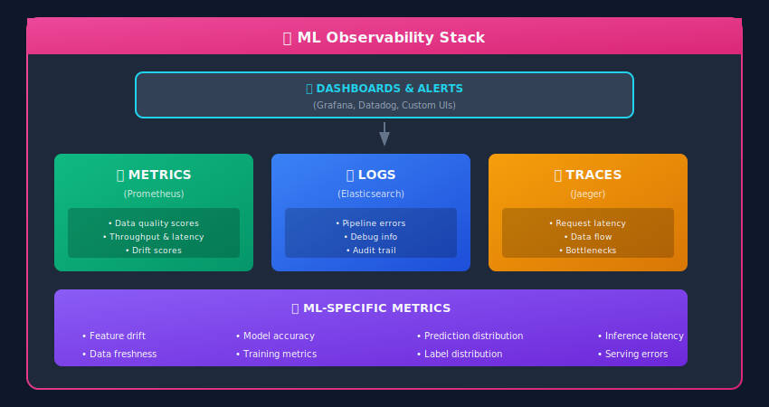

# Monitoring & Observability for ML Data Pipelines


## 🎯 The Three Pillars of Observability

For ML systems, monitoring goes beyond traditional software observability. We need to track **data quality**, **model performance**, and **system health**.



---

## 📊 Key Metrics for Data Pipelines

### Metric Categories

| Category | Metrics | Why It Matters |
|----------|---------|----------------|
| **Data Quality** | Null rate, duplicate rate, schema violations | Bad data → bad models |
| **Freshness** | Data age, last update time | Stale data → outdated predictions |
| **Volume** | Row count, byte size, throughput | Anomalies indicate issues |
| **Latency** | Pipeline duration, task times | SLA compliance |
| **Drift** | Feature distribution shift | Model degradation |
| **Errors** | Task failures, validation errors | Pipeline health |

---

## 🔧 Implementing Metrics with Prometheus

```python
from prometheus_client import Counter, Gauge, Histogram, Summary, start_http_server
from typing import Dict, Any
import time
from functools import wraps

# Define metrics
# Counters: Cumulative values (only go up)
records_processed = Counter(
    'pipeline_records_processed_total',
    'Total records processed',
    ['pipeline', 'stage', 'status']
)

pipeline_runs = Counter(
    'pipeline_runs_total',
    'Total pipeline runs',
    ['pipeline', 'status']
)

# Gauges: Current values (can go up or down)
data_freshness_hours = Gauge(
    'data_freshness_hours',
    'Hours since data was last updated',
    ['dataset']
)

feature_null_rate = Gauge(
    'feature_null_rate',
    'Null rate for features',
    ['feature_name']
)

active_pipelines = Gauge(
    'active_pipelines',
    'Number of currently running pipelines'
)

# Histograms: Distribution of values
pipeline_duration = Histogram(
    'pipeline_duration_seconds',
    'Pipeline execution time',
    ['pipeline'],
    buckets=[60, 300, 600, 1800, 3600, 7200]  # 1min to 2hrs
)

feature_value_distribution = Histogram(
    'feature_value_distribution',
    'Distribution of feature values',
    ['feature_name'],
    buckets=[0.1, 0.5, 1.0, 5.0, 10.0, 50.0, 100.0]
)

# Summary: Quantiles
processing_latency = Summary(
    'record_processing_latency_seconds',
    'Time to process single record',
    ['pipeline']
)

class PipelineMetrics:
    """Metrics collection for data pipelines"""

    def __init__(self, pipeline_name: str):
        self.pipeline_name = pipeline_name

    def record_processed(self, stage: str, status: str = 'success'):
        """Record a processed record"""
        records_processed.labels(
            pipeline=self.pipeline_name,
            stage=stage,
            status=status
        ).inc()

    def record_batch(self, stage: str, count: int, status: str = 'success'):
        """Record a batch of processed records"""
        records_processed.labels(
            pipeline=self.pipeline_name,
            stage=stage,
            status=status
        ).inc(count)

    def set_data_freshness(self, dataset: str, hours: float):
        """Set data freshness metric"""
        data_freshness_hours.labels(dataset=dataset).set(hours)

    def set_null_rate(self, feature: str, rate: float):
        """Set feature null rate"""
        feature_null_rate.labels(feature_name=feature).set(rate)

    def observe_duration(self, duration_seconds: float):
        """Record pipeline duration"""
        pipeline_duration.labels(pipeline=self.pipeline_name).observe(duration_seconds)

    def pipeline_started(self):
        """Mark pipeline as started"""
        active_pipelines.inc()

    def pipeline_finished(self, status: str):
        """Mark pipeline as finished"""
        active_pipelines.dec()
        pipeline_runs.labels(
            pipeline=self.pipeline_name,
            status=status
        ).inc()

def timed_stage(stage_name: str):
    """Decorator to time pipeline stages"""
    def decorator(func):
        @wraps(func)
        def wrapper(*args, **kwargs):
            start = time.time()
            try:
                result = func(*args, **kwargs)
                processing_latency.labels(
                    pipeline=stage_name
                ).observe(time.time() - start)
                return result
            except Exception as e:
                processing_latency.labels(
                    pipeline=stage_name
                ).observe(time.time() - start)
                raise
        return wrapper
    return decorator

# Usage Example
metrics = PipelineMetrics("feature_pipeline")

@timed_stage("extract")
def extract_data():
    metrics.pipeline_started()

    # ... extraction logic
    return data

@timed_stage("transform")
def transform_data(data):
    for record in data:

        # Process record
        metrics.record_processed("transform", "success")
    return transformed

@timed_stage("load")
def load_data(data):

    # ... loading logic
    metrics.record_batch("load", len(data))
    metrics.pipeline_finished("success")

# Start metrics server
if __name__ == "__main__":
    start_http_server(8000)

    # Run pipeline
```

---

## 📈 Data Quality Monitoring

```python
import pandas as pd
import numpy as np
from scipy import stats
from datetime import datetime
from typing import Dict, List, Tuple
from dataclasses import dataclass

@dataclass
class QualityMetric:
    name: str
    value: float
    threshold: float
    passed: bool
    timestamp: datetime

class DataQualityMonitor:
    """Monitor data quality and detect anomalies"""

    def __init__(self, reference_stats: Dict = None):
        self.reference_stats = reference_stats or {}
        self.metrics_history = []

    def compute_completeness(self, df: pd.DataFrame) -> Dict[str, float]:
        """Compute null rates for all columns"""
        null_rates = {}
        for col in df.columns:
            null_rates[col] = df[col].isnull().mean()
        return null_rates

    def compute_uniqueness(self, df: pd.DataFrame, key_columns: List[str]) -> Dict:
        """Check for duplicate records"""
        total = len(df)
        unique = df[key_columns].drop_duplicates().shape[0]

        return {
            "total_records": total,
            "unique_records": unique,
            "duplicate_rate": 1 - (unique / total) if total > 0 else 0
        }

    def detect_distribution_drift(
        self,
        current_df: pd.DataFrame,
        column: str,
        threshold: float = 0.05
    ) -> Tuple[bool, float]:
        """Detect distribution drift using KS test"""

        if column not in self.reference_stats:
            return False, 0.0

        reference = self.reference_stats[column]
        current = current_df[column].dropna().values

        statistic, p_value = stats.ks_2samp(reference, current)

        is_drifted = p_value < threshold
        return is_drifted, p_value

    def detect_value_anomalies(
        self,
        df: pd.DataFrame,
        column: str,
        n_std: float = 3.0
    ) -> Dict:
        """Detect anomalous values using z-score"""

        values = df[column].dropna()
        z_scores = np.abs(stats.zscore(values))

        anomalies = values[z_scores > n_std]

        return {
            "column": column,
            "anomaly_count": len(anomalies),
            "anomaly_rate": len(anomalies) / len(values) if len(values) > 0 else 0,
            "anomaly_values": anomalies.tolist()[:10]  # First 10
        }

    def check_freshness(
        self,
        df: pd.DataFrame,
        timestamp_column: str,
        max_age_hours: float = 24
    ) -> Dict:
        """Check data freshness"""

        max_timestamp = pd.to_datetime(df[timestamp_column]).max()
        age_hours = (datetime.utcnow() - max_timestamp).total_seconds() / 3600

        return {
            "max_timestamp": max_timestamp.isoformat(),
            "age_hours": age_hours,
            "is_fresh": age_hours <= max_age_hours,
            "max_allowed_hours": max_age_hours
        }

    def run_quality_checks(
        self,
        df: pd.DataFrame,
        config: Dict
    ) -> List[QualityMetric]:
        """Run all configured quality checks"""

        metrics = []
        timestamp = datetime.utcnow()

        # Completeness checks
        if 'completeness' in config:
            null_rates = self.compute_completeness(df)
            for col, threshold in config['completeness'].items():
                if col in null_rates:
                    metrics.append(QualityMetric(
                        name=f"null_rate_{col}",
                        value=null_rates[col],
                        threshold=threshold,
                        passed=null_rates[col] <= threshold,
                        timestamp=timestamp
                    ))

        # Uniqueness check
        if 'uniqueness' in config:
            unique_result = self.compute_uniqueness(df, config['uniqueness']['key_columns'])
            threshold = config['uniqueness'].get('max_duplicate_rate', 0.01)
            metrics.append(QualityMetric(
                name="duplicate_rate",
                value=unique_result['duplicate_rate'],
                threshold=threshold,
                passed=unique_result['duplicate_rate'] <= threshold,
                timestamp=timestamp
            ))

        # Drift checks
        if 'drift' in config:
            for col in config['drift']['columns']:
                is_drifted, p_value = self.detect_distribution_drift(
                    df, col, config['drift'].get('threshold', 0.05)
                )
                metrics.append(QualityMetric(
                    name=f"drift_{col}",
                    value=p_value,
                    threshold=config['drift'].get('threshold', 0.05),
                    passed=not is_drifted,
                    timestamp=timestamp
                ))

        # Freshness check
        if 'freshness' in config:
            freshness = self.check_freshness(
                df,
                config['freshness']['timestamp_column'],
                config['freshness']['max_age_hours']
            )
            metrics.append(QualityMetric(
                name="data_freshness_hours",
                value=freshness['age_hours'],
                threshold=freshness['max_allowed_hours'],
                passed=freshness['is_fresh'],
                timestamp=timestamp
            ))

        self.metrics_history.extend(metrics)
        return metrics

    def export_to_prometheus(self, metrics: List[QualityMetric]):
        """Export metrics to Prometheus"""
        for metric in metrics:
            if metric.name.startswith('null_rate_'):
                feature_null_rate.labels(
                    feature_name=metric.name.replace('null_rate_', '')
                ).set(metric.value)
            elif metric.name == 'data_freshness_hours':
                data_freshness_hours.labels(dataset='main').set(metric.value)

# Configuration
quality_config = {
    'completeness': {
        'user_id': 0.0,      # No nulls allowed
        'amount': 0.05,      # Max 5% nulls
        'category': 0.10     # Max 10% nulls
    },
    'uniqueness': {
        'key_columns': ['transaction_id'],
        'max_duplicate_rate': 0.001
    },
    'drift': {
        'columns': ['amount', 'age'],
        'threshold': 0.05
    },
    'freshness': {
        'timestamp_column': 'created_at',
        'max_age_hours': 6
    }
}

# Usage
monitor = DataQualityMonitor(reference_stats)
metrics = monitor.run_quality_checks(new_data_df, quality_config)

# Check if all passed
all_passed = all(m.passed for m in metrics)
if not all_passed:
    failed = [m for m in metrics if not m.passed]
    send_alert(f"Quality check failed: {failed}")
```

---

## 🔔 Alerting System

```python
from enum import Enum
from dataclasses import dataclass
from typing import Callable, List, Optional
import requests

class AlertSeverity(Enum):
    INFO = "info"
    WARNING = "warning"
    ERROR = "error"
    CRITICAL = "critical"

@dataclass
class Alert:
    name: str
    message: str
    severity: AlertSeverity
    labels: Dict[str, str]
    value: Optional[float] = None
    threshold: Optional[float] = None

class AlertManager:
    """Manage alerts for data pipelines"""

    def __init__(self, config: Dict):
        self.config = config
        self.handlers = {
            'slack': self._send_slack,
            'pagerduty': self._send_pagerduty,
            'email': self._send_email,
        }

    def send_alert(self, alert: Alert):
        """Route alert to appropriate channels"""

        # Determine channels based on severity
        if alert.severity == AlertSeverity.CRITICAL:
            channels = ['slack', 'pagerduty']
        elif alert.severity == AlertSeverity.ERROR:
            channels = ['slack']
        else:
            channels = ['slack']

        for channel in channels:
            if channel in self.handlers:
                self.handlers[channel](alert)

    def _send_slack(self, alert: Alert):
        """Send alert to Slack"""

        emoji = {
            AlertSeverity.INFO: "ℹ️",
            AlertSeverity.WARNING: "⚠️",
            AlertSeverity.ERROR: "❌",
            AlertSeverity.CRITICAL: "🚨",
        }

        message = {
            "text": f"{emoji[alert.severity]} *{alert.name}*",
            "attachments": [{
                "color": self._severity_color(alert.severity),
                "fields": [
                    {"title": "Message", "value": alert.message, "short": False},
                    {"title": "Severity", "value": alert.severity.value, "short": True},
                    {"title": "Value", "value": str(alert.value), "short": True} if alert.value else None,
                ]
            }]
        }

        requests.post(
            self.config['slack']['webhook_url'],
            json=message
        )

    def _send_pagerduty(self, alert: Alert):
        """Send alert to PagerDuty"""

        payload = {
            "routing_key": self.config['pagerduty']['routing_key'],
            "event_action": "trigger",
            "payload": {
                "summary": f"{alert.name}: {alert.message}",
                "severity": alert.severity.value,
                "source": "ml-pipeline",
                "custom_details": alert.labels
            }
        }

        requests.post(
            "https://events.pagerduty.com/v2/enqueue",
            json=payload
        )

    def _severity_color(self, severity: AlertSeverity) -> str:
        return {
            AlertSeverity.INFO: "#36a64f",
            AlertSeverity.WARNING: "#ffcc00",
            AlertSeverity.ERROR: "#ff6600",
            AlertSeverity.CRITICAL: "#ff0000",
        }[severity]

class AlertRules:
    """Define alerting rules for data pipelines"""

    def __init__(self, alert_manager: AlertManager):
        self.alert_manager = alert_manager
        self.rules = []

    def add_rule(
        self,
        name: str,
        condition: Callable[[Dict], bool],
        severity: AlertSeverity,
        message_template: str
    ):
        """Add an alerting rule"""
        self.rules.append({
            'name': name,
            'condition': condition,
            'severity': severity,
            'message_template': message_template
        })

    def evaluate(self, metrics: Dict):
        """Evaluate all rules against current metrics"""

        for rule in self.rules:
            try:
                if rule['condition'](metrics):
                    alert = Alert(
                        name=rule['name'],
                        message=rule['message_template'].format(**metrics),
                        severity=rule['severity'],
                        labels={"pipeline": metrics.get('pipeline', 'unknown')},
                        value=metrics.get('value'),
                        threshold=metrics.get('threshold')
                    )
                    self.alert_manager.send_alert(alert)
            except Exception as e:
                print(f"Error evaluating rule {rule['name']}: {e}")

# Define alerting rules
alert_manager = AlertManager(config)
rules = AlertRules(alert_manager)

# Rule: High null rate
rules.add_rule(
    name="High Null Rate",
    condition=lambda m: m.get('null_rate', 0) > 0.1,
    severity=AlertSeverity.ERROR,
    message_template="Null rate is {null_rate:.2%}, exceeds 10% threshold"
)

# Rule: Data freshness
rules.add_rule(
    name="Stale Data",
    condition=lambda m: m.get('data_age_hours', 0) > 6,
    severity=AlertSeverity.WARNING,
    message_template="Data is {data_age_hours:.1f} hours old"
)

# Rule: Pipeline failure
rules.add_rule(
    name="Pipeline Failed",
    condition=lambda m: m.get('pipeline_status') == 'failed',
    severity=AlertSeverity.CRITICAL,
    message_template="Pipeline {pipeline} failed: {error_message}"
)

# Rule: Distribution drift
rules.add_rule(
    name="Feature Drift Detected",
    condition=lambda m: m.get('drift_p_value', 1.0) < 0.05,
    severity=AlertSeverity.WARNING,
    message_template="Feature {feature_name} has drifted (p-value: {drift_p_value:.4f})"
)
```

---

## 📊 Dashboard Design

### Key Dashboard Panels

```yaml

# Grafana Dashboard Configuration (conceptual)
dashboard:
  title: "ML Data Pipeline Monitoring"

  rows:
    - title: "Pipeline Health"
      panels:
        - type: stat
          title: "Active Pipelines"
          query: 'active_pipelines'

        - type: stat
          title: "Pipeline Success Rate (24h)"
          query: 'sum(pipeline_runs_total{status="success"}) / sum(pipeline_runs_total)'
          format: percent

        - type: timeseries
          title: "Pipeline Duration"
          query: 'histogram_quantile(0.95, pipeline_duration_seconds_bucket)'

    - title: "Data Quality"
      panels:
        - type: gauge
          title: "Overall Data Quality Score"
          query: '1 - avg(feature_null_rate)'
          thresholds: [0.9, 0.95, 0.99]

        - type: heatmap
          title: "Null Rate by Feature"
          query: 'feature_null_rate'

        - type: timeseries
          title: "Null Rate Trend"
          query: 'avg_over_time(feature_null_rate[1h])'

    - title: "Data Freshness"
      panels:
        - type: stat
          title: "Data Age (hours)"
          query: 'data_freshness_hours{dataset="main"}'
          thresholds: [1, 6, 24]

        - type: timeseries
          title: "Freshness Over Time"
          query: 'data_freshness_hours'

    - title: "Throughput"
      panels:
        - type: timeseries
          title: "Records Processed per Minute"
          query: 'rate(pipeline_records_processed_total[5m]) * 60'

        - type: stat
          title: "Total Records (24h)"
          query: 'increase(pipeline_records_processed_total[24h])'

    - title: "Drift Detection"
      panels:
        - type: timeseries
          title: "Feature Drift Scores"
          query: 'feature_drift_score'

        - type: table
          title: "Drifted Features"
          query: 'feature_drift_score > 0.1'
```

---

## 🔍 Distributed Tracing

```python
from opentelemetry import trace
from opentelemetry.sdk.trace import TracerProvider
from opentelemetry.sdk.trace.export import BatchSpanProcessor
from opentelemetry.exporter.jaeger.thrift import JaegerExporter
from opentelemetry.instrumentation.requests import RequestsInstrumentor
from functools import wraps

# Initialize tracing
trace.set_tracer_provider(TracerProvider())
tracer = trace.get_tracer(__name__)

# Export to Jaeger
jaeger_exporter = JaegerExporter(
    agent_host_name="localhost",
    agent_port=6831,
)
trace.get_tracer_provider().add_span_processor(
    BatchSpanProcessor(jaeger_exporter)
)

# Instrument HTTP requests automatically
RequestsInstrumentor().instrument()

def traced_stage(stage_name: str):
    """Decorator to add tracing to pipeline stages"""
    def decorator(func):
        @wraps(func)
        def wrapper(*args, **kwargs):
            with tracer.start_as_current_span(stage_name) as span:
                span.set_attribute("stage.name", stage_name)

                try:
                    result = func(*args, **kwargs)

                    # Add result metadata
                    if isinstance(result, pd.DataFrame):
                        span.set_attribute("result.row_count", len(result))
                        span.set_attribute("result.column_count", len(result.columns))

                    span.set_attribute("status", "success")
                    return result

                except Exception as e:
                    span.set_attribute("status", "error")
                    span.set_attribute("error.message", str(e))
                    span.record_exception(e)
                    raise

        return wrapper
    return decorator

class TracedPipeline:
    """Pipeline with distributed tracing"""

    def __init__(self, pipeline_name: str):
        self.pipeline_name = pipeline_name

    def run(self, date: str):
        with tracer.start_as_current_span(self.pipeline_name) as span:
            span.set_attribute("pipeline.name", self.pipeline_name)
            span.set_attribute("pipeline.date", date)

            try:

                # Each stage is automatically traced
                raw_data = self.extract(date)
                validated_data = self.validate(raw_data)
                features = self.transform(validated_data)
                self.load(features)

                span.set_attribute("pipeline.status", "success")

            except Exception as e:
                span.set_attribute("pipeline.status", "failed")
                span.record_exception(e)
                raise

    @traced_stage("extract")
    def extract(self, date: str):

        # Extraction logic
        return pd.read_parquet(f"s3://bucket/raw/date={date}/")

    @traced_stage("validate")
    def validate(self, df: pd.DataFrame):

        # Validation logic
        return df.dropna()

    @traced_stage("transform")
    def transform(self, df: pd.DataFrame):

        # Transformation logic
        return compute_features(df)

    @traced_stage("load")
    def load(self, df: pd.DataFrame):

        # Loading logic
        df.to_parquet("s3://bucket/features/")
```

---

## 🎓 Key Takeaways

1. **Monitor at all levels** - System, pipeline, and data quality

2. **Set up proactive alerting** - Don't wait for users to report issues

3. **Track ML-specific metrics** - Drift, feature quality, model performance

4. **Use distributed tracing** - Essential for debugging complex pipelines

5. **Build dashboards for different audiences** - Engineers vs stakeholders

6. **Automate anomaly detection** - Manual monitoring doesn't scale

---

*Next Chapter: [Scalability Patterns →](../11_scalability_patterns/README.md)*

---

<div align="center">

**[⬆ Back to Top](#)** | **[📚 Main Repository](https://github.com/Gaurav14cs17/ml_system_design)**

Made with 💜 by [Gaurav14cs17](https://github.com/Gaurav14cs17)

</div>
