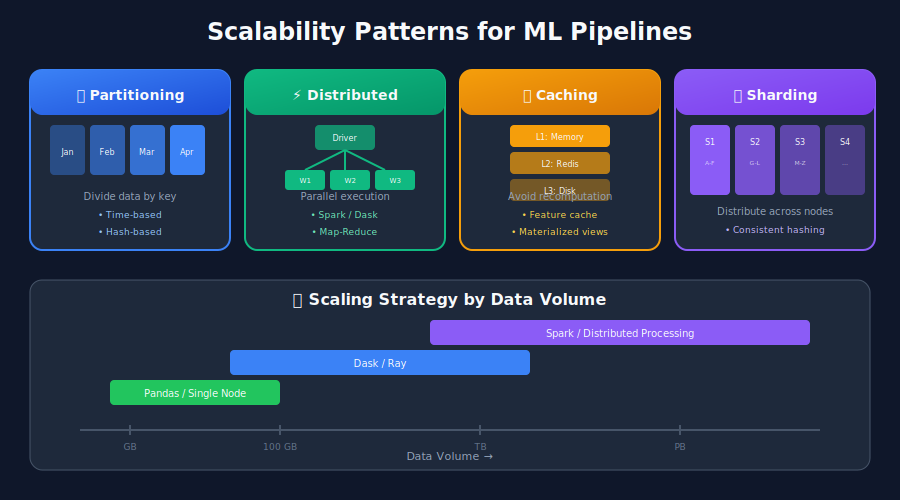
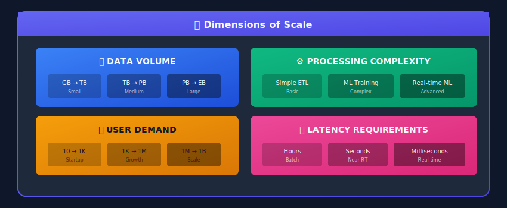

# Scalability Patterns for ML Data Pipelines



## 🎯 Understanding Scale in ML Systems

Scaling ML data pipelines involves handling increasing data volumes, processing complexity, and user demand while maintaining performance and cost efficiency.



---

## 📊 Horizontal vs Vertical Scaling

### Comparison

| Aspect | Vertical (Scale Up) | Horizontal (Scale Out) |
|--------|---------------------|------------------------|
| **Approach** | Bigger machines | More machines |
| **Cost** | Exponential | Linear |
| **Limit** | Hardware caps | Theoretically unlimited |
| **Complexity** | Lower | Higher (distribution) |
| **Failure** | Single point | Fault tolerant |
| **Best For** | Simple workloads | Large-scale ML |

---

## 🔧 Pattern 1: Data Partitioning

### Time-Based Partitioning

```python
from pyspark.sql import SparkSession
from pyspark.sql import functions as F

spark = SparkSession.builder \
    .config("spark.sql.shuffle.partitions", "200") \
    .getOrCreate()

class PartitionedPipeline:
    """Partition data for parallel processing"""

    def __init__(self, base_path: str):
        self.base_path = base_path

    def write_partitioned(
        self,
        df,
        partition_cols: list,
        output_path: str
    ):
        """Write data partitioned by specified columns"""

        df.write \
            .mode("overwrite") \
            .partitionBy(*partition_cols) \
            .parquet(output_path)

    def read_partition_range(
        self,
        path: str,
        start_date: str,
        end_date: str
    ):
        """Efficiently read only needed partitions"""

        return spark.read.parquet(path) \
            .filter(F.col("date").between(start_date, end_date))

    def process_by_partition(
        self,
        input_path: str,
        output_path: str,
        processing_func,
        partition_col: str = "date"
    ):
        """Process data partition by partition"""

        # Get list of partitions
        partitions = spark.read.parquet(input_path) \
            .select(partition_col) \
            .distinct() \
            .collect()

        for row in partitions:
            partition_value = row[partition_col]

            # Read single partition
            partition_df = spark.read.parquet(input_path) \
                .filter(F.col(partition_col) == partition_value)

            # Process
            result_df = processing_func(partition_df)

            # Write to partitioned output
            result_df.write \
                .mode("overwrite") \
                .parquet(f"{output_path}/{partition_col}={partition_value}/")

# Example: Partition by date and customer segment
pipeline = PartitionedPipeline("s3://datalake/")

# Write with partitioning
pipeline.write_partitioned(
    features_df,
    partition_cols=["date", "customer_segment"],
    output_path="s3://datalake/features/"
)

# Read only January 2024 data
jan_data = pipeline.read_partition_range(
    "s3://datalake/features/",
    "2024-01-01",
    "2024-01-31"
)
```

### Hash Partitioning for Distributed Processing

```python
class HashPartitioner:
    """Distribute data evenly across workers"""

    def __init__(self, num_partitions: int):
        self.num_partitions = num_partitions

    def partition_dataframe(
        self,
        df,
        partition_key: str
    ):
        """Partition DataFrame by hash of key column"""

        return df.repartition(
            self.num_partitions,
            F.col(partition_key)
        )

    def process_partitions_parallel(
        self,
        df,
        processing_func,
        partition_key: str
    ):
        """Process partitions in parallel"""

        # Ensure even distribution
        partitioned_df = self.partition_dataframe(df, partition_key)

        # Each partition processed independently
        result = partitioned_df.groupBy(partition_key).applyInPandas(
            processing_func,
            schema=result_schema
        )

        return result

# Usage: Process users in parallel
partitioner = HashPartitioner(num_partitions=100)

def compute_user_features(user_df: pd.DataFrame) -> pd.DataFrame:
    """Compute features for a group of users"""
    # This runs on each partition independently
    return user_df.groupby('user_id').agg({
        'amount': ['sum', 'mean'],
        'transactions': 'count'
    })

result = partitioner.process_partitions_parallel(
    transactions_df,
    compute_user_features,
    partition_key='user_id'
)
```

---

## 🔧 Pattern 2: Distributed Processing

### Spark Optimization for Large Scale

```python
from pyspark.sql import SparkSession
from pyspark.sql import functions as F
from pyspark.sql.window import Window

def create_optimized_spark_session(
    app_name: str,
    executor_memory: str = "8g",
    executor_cores: int = 4,
    num_executors: int = 10
) -> SparkSession:
    """Create Spark session with ML-optimized settings"""

    return SparkSession.builder \
        .appName(app_name) \
        .config("spark.executor.memory", executor_memory) \
        .config("spark.executor.cores", executor_cores) \
        .config("spark.dynamicAllocation.enabled", "true") \
        .config("spark.dynamicAllocation.minExecutors", "5") \
        .config("spark.dynamicAllocation.maxExecutors", str(num_executors * 2)) \
        .config("spark.sql.shuffle.partitions", "200") \
        .config("spark.sql.adaptive.enabled", "true") \
        .config("spark.sql.adaptive.coalescePartitions.enabled", "true") \
        .config("spark.sql.adaptive.skewJoin.enabled", "true") \
        .config("spark.serializer", "org.apache.spark.serializer.KryoSerializer") \
        .config("spark.sql.parquet.compression.codec", "snappy") \
        .getOrCreate()

class ScalableFeaturePipeline:
    """Feature pipeline optimized for scale"""

    def __init__(self, spark: SparkSession):
        self.spark = spark

    def compute_features_at_scale(
        self,
        transactions_path: str,
        output_path: str,
        date: str
    ):
        """Compute features for billions of transactions"""

        # Read with predicate pushdown
        transactions = self.spark.read.parquet(transactions_path) \
            .filter(F.col("date") <= date) \
            .filter(F.col("date") >= F.date_sub(F.lit(date), 90))

        # Persist intermediate result if reused
        transactions.cache()

        # Broadcast small lookup tables
        categories = self.spark.read.parquet("s3://lookup/categories/")
        transactions = transactions.join(
            F.broadcast(categories),
            "category_id"
        )

        # Use window functions efficiently
        user_window = Window.partitionBy("user_id") \
            .orderBy(F.desc("transaction_date"))

        features = transactions \
            .withColumn("transaction_rank", F.row_number().over(user_window)) \
            .groupBy("user_id") \
            .agg(
                F.sum("amount").alias("total_spend"),
                F.avg("amount").alias("avg_spend"),
                F.count("*").alias("transaction_count"),
                F.countDistinct("merchant_id").alias("unique_merchants"),
                F.max("transaction_date").alias("last_transaction")
            )

        # Write with optimal file sizes
        features.coalesce(100) \
            .write \
            .mode("overwrite") \
            .parquet(output_path)

        # Unpersist cached data
        transactions.unpersist()

        return features

# Usage
spark = create_optimized_spark_session(
    "FeaturePipeline",
    executor_memory="16g",
    executor_cores=4,
    num_executors=50
)

pipeline = ScalableFeaturePipeline(spark)
pipeline.compute_features_at_scale(
    "s3://datalake/transactions/",
    "s3://datalake/features/user_features/",
    "2024-01-15"
)
```

### Dask for Larger-than-Memory Processing

```python
import dask.dataframe as dd
from dask.distributed import Client, LocalCluster
from dask import delayed
import pandas as pd

# Create distributed cluster
cluster = LocalCluster(
    n_workers=4,
    threads_per_worker=2,
    memory_limit='4GB'
)
client = Client(cluster)

class DaskScalablePipeline:
    """Process larger-than-memory datasets with Dask"""

    def __init__(self, client: Client):
        self.client = client

    def read_large_dataset(self, path: str) -> dd.DataFrame:
        """Read large dataset lazily"""
        return dd.read_parquet(path)

    def compute_features_parallel(
        self,
        df: dd.DataFrame,
        group_col: str,
        agg_funcs: dict
    ) -> dd.DataFrame:
        """Compute aggregations in parallel across partitions"""

        return df.groupby(group_col).agg(agg_funcs)

    def process_with_custom_function(
        self,
        df: dd.DataFrame,
        func,
        meta
    ) -> dd.DataFrame:
        """Apply custom function to each partition"""

        return df.map_partitions(func, meta=meta)

    def incremental_processing(
        self,
        input_path: str,
        output_path: str,
        processing_func,
        partition_col: str = "date"
    ):
        """Process data incrementally by partition"""

        # Get list of partitions to process
        df = dd.read_parquet(input_path)
        partitions = df[partition_col].unique().compute().tolist()

        # Process each partition
        results = []
        for partition in partitions:
            partition_df = df[df[partition_col] == partition]
            result = partition_df.map_partitions(processing_func)
            result.to_parquet(f"{output_path}/{partition_col}={partition}/")
            results.append(result)

        return results

# Example usage
pipeline = DaskScalablePipeline(client)

# Read 100GB dataset
df = pipeline.read_large_dataset("s3://bucket/large_data/")

# Compute features
features = pipeline.compute_features_parallel(
    df,
    group_col="user_id",
    agg_funcs={
        'amount': ['sum', 'mean', 'std'],
        'transaction_id': 'count'
    }
)

# Materialize results
result = features.compute()
```

---

## 🔧 Pattern 3: Caching & Materialization

```python
import redis
from functools import lru_cache
import hashlib
import pickle

class FeatureCacheManager:
    """Multi-level caching for features"""

    def __init__(
        self,
        redis_host: str = "localhost",
        redis_port: int = 6379
    ):
        self.redis = redis.Redis(host=redis_host, port=redis_port)
        self.local_cache = {}

    def _cache_key(self, entity_id: str, feature_set: str) -> str:
        """Generate cache key"""
        return f"features:{feature_set}:{entity_id}"

    def get_features(
        self,
        entity_id: str,
        feature_set: str
    ) -> dict:
        """Get features with multi-level cache lookup"""

        cache_key = self._cache_key(entity_id, feature_set)

        # Level 1: Local memory cache
        if cache_key in self.local_cache:
            return self.local_cache[cache_key]

        # Level 2: Redis cache
        cached = self.redis.get(cache_key)
        if cached:
            features = pickle.loads(cached)
            self.local_cache[cache_key] = features
            return features

        # Level 3: Compute and cache
        features = self._compute_features(entity_id, feature_set)
        self.set_features(entity_id, feature_set, features)

        return features

    def set_features(
        self,
        entity_id: str,
        feature_set: str,
        features: dict,
        ttl_seconds: int = 3600
    ):
        """Cache features at multiple levels"""

        cache_key = self._cache_key(entity_id, feature_set)

        # Local cache
        self.local_cache[cache_key] = features

        # Redis cache
        self.redis.setex(
            cache_key,
            ttl_seconds,
            pickle.dumps(features)
        )

    def bulk_precompute(
        self,
        entity_ids: list,
        feature_set: str,
        batch_size: int = 1000
    ):
        """Precompute and cache features for many entities"""

        for i in range(0, len(entity_ids), batch_size):
            batch = entity_ids[i:i+batch_size]

            # Compute features for batch
            features_batch = self._compute_batch_features(batch, feature_set)

            # Cache all in pipeline
            pipeline = self.redis.pipeline()
            for entity_id, features in features_batch.items():
                cache_key = self._cache_key(entity_id, feature_set)
                pipeline.setex(cache_key, 3600, pickle.dumps(features))

            pipeline.execute()

    def _compute_features(self, entity_id: str, feature_set: str) -> dict:
        """Compute features from source"""
        # Implement based on your feature logic
        pass

class MaterializedViewManager:
    """Manage materialized views for fast queries"""

    def __init__(self, spark: SparkSession, delta_path: str):
        self.spark = spark
        self.delta_path = delta_path

    def create_materialized_view(
        self,
        name: str,
        query: str,
        partition_cols: list = None
    ):
        """Create a materialized view as Delta table"""

        result = self.spark.sql(query)

        writer = result.write.format("delta").mode("overwrite")

        if partition_cols:
            writer = writer.partitionBy(*partition_cols)

        writer.save(f"{self.delta_path}/{name}")

    def refresh_materialized_view(
        self,
        name: str,
        query: str,
        incremental_filter: str = None
    ):
        """Refresh materialized view (full or incremental)"""

        if incremental_filter:
            # Incremental refresh
            new_data = self.spark.sql(f"{query} WHERE {incremental_filter}")

            from delta.tables import DeltaTable

            delta_table = DeltaTable.forPath(
                self.spark,
                f"{self.delta_path}/{name}"
            )

            delta_table.alias("target").merge(
                new_data.alias("source"),
                "target.id = source.id"
            ).whenMatchedUpdateAll() \
             .whenNotMatchedInsertAll() \
             .execute()
        else:
            # Full refresh
            self.create_materialized_view(name, query)

    def query_materialized_view(self, name: str):
        """Query from materialized view"""
        return self.spark.read.format("delta").load(f"{self.delta_path}/{name}")

# Example: Precompute popular features
cache_manager = FeatureCacheManager()

# Get top 1M active users
active_users = get_active_user_ids(limit=1000000)

# Precompute and cache their features
cache_manager.bulk_precompute(
    entity_ids=active_users,
    feature_set="user_features_v2"
)
```

---

## 🔧 Pattern 4: Async & Parallel Execution

```python
import asyncio
from concurrent.futures import ThreadPoolExecutor, ProcessPoolExecutor
from typing import List, Callable
import aiohttp

class AsyncPipelineExecutor:
    """Execute pipeline stages asynchronously"""

    def __init__(self, max_workers: int = 10):
        self.max_workers = max_workers
        self.thread_pool = ThreadPoolExecutor(max_workers=max_workers)
        self.process_pool = ProcessPoolExecutor(max_workers=max_workers)

    async def run_stage_async(
        self,
        stage_func: Callable,
        inputs: List,
        use_processes: bool = False
    ) -> List:
        """Run stage function on multiple inputs in parallel"""

        loop = asyncio.get_event_loop()
        pool = self.process_pool if use_processes else self.thread_pool

        tasks = [
            loop.run_in_executor(pool, stage_func, inp)
            for inp in inputs
        ]

        return await asyncio.gather(*tasks)

    async def run_pipeline(
        self,
        stages: List[dict],
        initial_input
    ):
        """Run multi-stage pipeline with parallelism"""

        current_input = initial_input

        for stage in stages:
            stage_name = stage['name']
            stage_func = stage['func']
            parallel = stage.get('parallel', False)

            if parallel and isinstance(current_input, list):
                # Run in parallel on list inputs
                current_input = await self.run_stage_async(
                    stage_func,
                    current_input
                )
            else:
                # Run sequentially
                current_input = stage_func(current_input)

            print(f"Stage {stage_name} completed")

        return current_input

class ParallelFeatureComputation:
    """Compute features in parallel across entities"""

    def __init__(self, num_workers: int = 4):
        self.num_workers = num_workers

    def compute_parallel(
        self,
        entity_ids: List[str],
        compute_func: Callable,
        batch_size: int = 100
    ) -> dict:
        """Compute features for entities in parallel batches"""

        # Create batches
        batches = [
            entity_ids[i:i+batch_size]
            for i in range(0, len(entity_ids), batch_size)
        ]

        results = {}

        with ProcessPoolExecutor(max_workers=self.num_workers) as executor:
            futures = {
                executor.submit(compute_func, batch): batch
                for batch in batches
            }

            for future in concurrent.futures.as_completed(futures):
                batch_result = future.result()
                results.update(batch_result)

        return results

# Example: Async API data fetching
class AsyncDataFetcher:
    """Fetch data from multiple APIs in parallel"""

    def __init__(self, rate_limit: int = 100):
        self.rate_limit = rate_limit
        self.semaphore = asyncio.Semaphore(rate_limit)

    async def fetch_one(
        self,
        session: aiohttp.ClientSession,
        url: str
    ) -> dict:
        """Fetch single URL with rate limiting"""

        async with self.semaphore:
            async with session.get(url) as response:
                return await response.json()

    async def fetch_all(self, urls: List[str]) -> List[dict]:
        """Fetch all URLs in parallel"""

        async with aiohttp.ClientSession() as session:
            tasks = [self.fetch_one(session, url) for url in urls]
            return await asyncio.gather(*tasks, return_exceptions=True)

# Usage
async def main():
    executor = AsyncPipelineExecutor(max_workers=10)

    # Define pipeline stages
    stages = [
        {'name': 'extract', 'func': extract_data, 'parallel': False},
        {'name': 'validate', 'func': validate_chunk, 'parallel': True},
        {'name': 'transform', 'func': transform_chunk, 'parallel': True},
        {'name': 'load', 'func': load_data, 'parallel': False}
    ]

    result = await executor.run_pipeline(stages, initial_input=data_paths)

    return result

asyncio.run(main())
```

---

## 🔧 Pattern 5: Sharding for Feature Stores

```python
import hashlib
from typing import List

class ShardedFeatureStore:
    """Distribute features across shards for scale"""

    def __init__(self, shard_count: int, shard_connections: List):
        self.shard_count = shard_count
        self.shards = shard_connections  # Redis connections or similar

    def _get_shard(self, entity_id: str) -> int:
        """Determine shard for entity using consistent hashing"""

        hash_value = int(hashlib.md5(entity_id.encode()).hexdigest(), 16)
        return hash_value % self.shard_count

    def get_features(self, entity_id: str) -> dict:
        """Get features from appropriate shard"""

        shard_id = self._get_shard(entity_id)
        return self.shards[shard_id].hgetall(f"features:{entity_id}")

    def set_features(self, entity_id: str, features: dict):
        """Set features on appropriate shard"""

        shard_id = self._get_shard(entity_id)
        self.shards[shard_id].hset(f"features:{entity_id}", mapping=features)

    def bulk_get(self, entity_ids: List[str]) -> dict:
        """Bulk get features, grouping by shard"""

        # Group entities by shard
        shard_groups = {}
        for entity_id in entity_ids:
            shard_id = self._get_shard(entity_id)
            if shard_id not in shard_groups:
                shard_groups[shard_id] = []
            shard_groups[shard_id].append(entity_id)

        # Fetch from each shard in parallel
        results = {}
        for shard_id, entities in shard_groups.items():
            pipeline = self.shards[shard_id].pipeline()
            for entity_id in entities:
                pipeline.hgetall(f"features:{entity_id}")

            shard_results = pipeline.execute()
            for entity_id, features in zip(entities, shard_results):
                results[entity_id] = features

        return results

    def rebalance_shards(self, new_shard_count: int):
        """Rebalance data across new shard count"""

        # Read all data from old shards
        all_data = {}
        for shard in self.shards:
            keys = shard.keys("features:*")
            for key in keys:
                entity_id = key.decode().split(":")[1]
                all_data[entity_id] = shard.hgetall(key)

        # Update shard count and write to new shards
        self.shard_count = new_shard_count
        # ... initialize new shard connections

        for entity_id, features in all_data.items():
            self.set_features(entity_id, features)
```

---

## 📈 Scaling Strategies Summary

| Challenge | Pattern | Implementation |
|-----------|---------|----------------|
| Large data volume | Partitioning | Time/hash partitions |
| CPU-bound processing | Distributed | Spark, Dask, Ray |
| I/O-bound operations | Async/Parallel | asyncio, ThreadPool |
| Repeated computations | Caching | Redis, materialized views |
| Feature serving latency | Sharding | Consistent hashing |
| Cost optimization | Auto-scaling | K8s, Spark dynamic allocation |

---

## 🎓 Key Takeaways

1. **Partition early** - Design for parallel processing from the start

2. **Cache strategically** - Identify hot data and precompute

3. **Use appropriate tools** - Spark for batch, Flink for stream, Redis for serving

4. **Monitor scaling bottlenecks** - Profile before optimizing

5. **Design for elasticity** - Auto-scale based on demand

6. **Consider cost** - Balance performance with cloud expenses

---

*Next Chapter: [Real-world Case Studies →](../12_case_studies/README.md)*

---

<div align="center">

**[⬆ Back to Top](#)** | **[📚 Main Repository](https://github.com/Gaurav14cs17/ml_system_design)**

Made with 💜 by [Gaurav14cs17](https://github.com/Gaurav14cs17)

</div>
