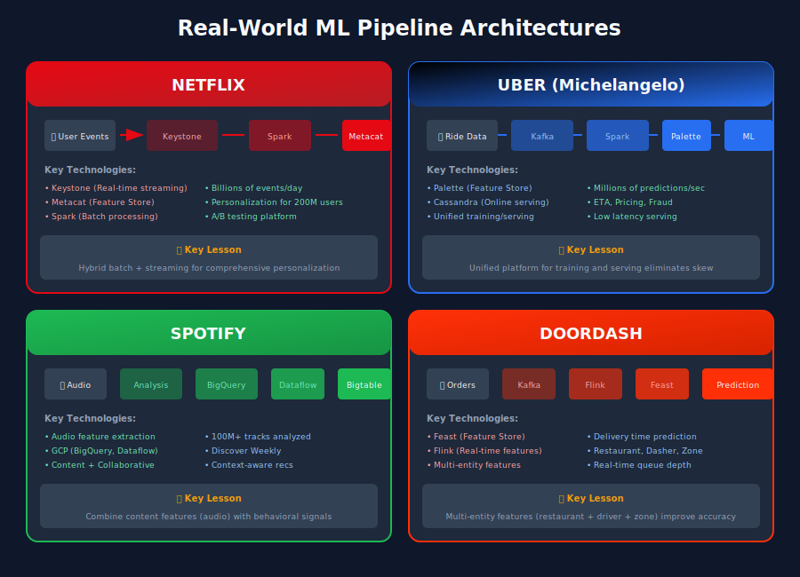
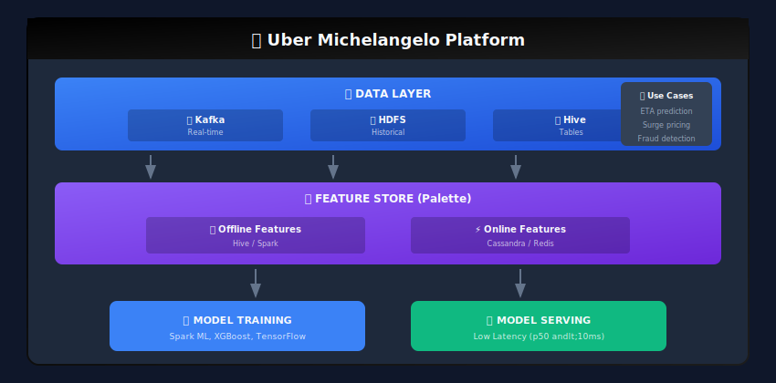
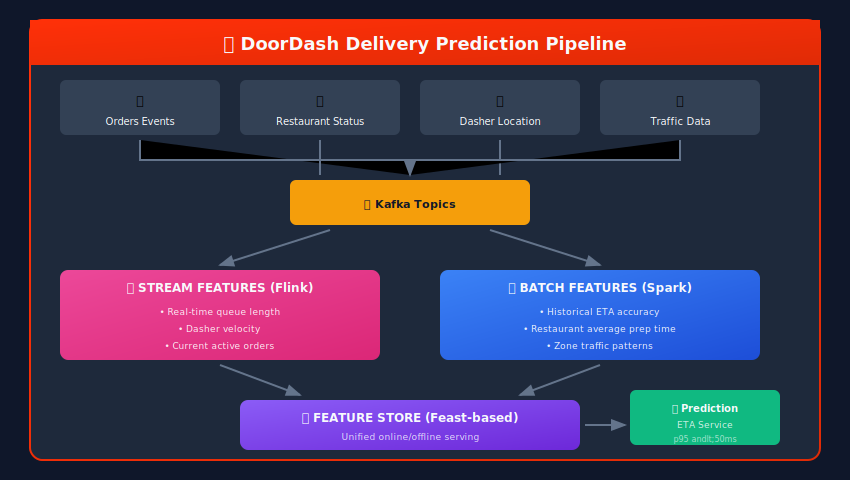
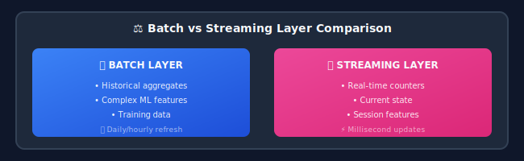

# Real-World Case Studies: ML Data Pipelines



## 🎯 Learning from Industry Leaders

This chapter explores how major tech companies have designed and scaled their ML data pipelines, with key takeaways you can apply to your own systems.

---

## 🔴 Case Study 1: Netflix - Recommendation System Pipeline

### The Challenge

Netflix processes **billions of events daily** to power its recommendation engine, serving 200+ million users with personalized content suggestions.


### Architecture Highlights

```python
# Netflix's approach to feature computation (conceptual)

class NetflixFeaturePipeline:
    """
    Netflix's approach: Batch + Real-time hybrid
    - Batch: Deep historical features (daily)
    - Real-time: Session-based features (streaming)
    """

    def compute_viewing_features(self, user_id: str, window_days: int = 90):
        """
        Features computed from viewing history:
        - Genre preferences (weighted by recency)
        - Completion rates by content type
        - Binge watching patterns
        - Time-of-day preferences
        """

        viewing_history = self.get_viewing_history(user_id, window_days)

        features = {
            # Genre affinity (recency-weighted)
            "genre_affinity": self.compute_genre_affinity(viewing_history),

            # Engagement patterns
            "avg_completion_rate": viewing_history.completion_rate.mean(),
            "binge_score": self.compute_binge_score(viewing_history),

            # Temporal patterns
            "peak_viewing_hour": viewing_history.groupby('hour').size().idxmax(),
            "weekend_viewer_ratio": self.weekend_ratio(viewing_history),

            # Content diversity
            "content_diversity": viewing_history.content_id.nunique() / len(viewing_history),
        }

        return features

    def compute_real_time_features(self, session_events: list):
        """
        Real-time features from current session:
        - Current browsing intent
        - Recency of last interaction
        - Session engagement level
        """

        return {
            "session_duration_mins": self.session_duration(session_events),
            "items_browsed": len(session_events),
            "genres_explored": self.unique_genres(session_events),
            "scroll_depth": self.avg_scroll_depth(session_events),
        }

```

### Key Takeaways

| Lesson | Implementation |
|--------|----------------|
| **Hybrid Architecture** | Batch for deep features + streaming for real-time |
| **Feature Store** | Centralized with versioning (Metacat) |
| **A/B Testing** | Everything is an experiment |
| **Personalization** | Features at multiple granularities (user, session, context) |

---

## 🟢 Case Study 2: Spotify - Audio Feature Pipeline

### The Challenge

Spotify analyzes **100+ million tracks** and processes **billions of listening events** to power Discover Weekly, Daily Mix, and radio features.


### Feature Engineering Approach

```python
class SpotifyAudioFeatures:
    """
    Spotify's audio analysis features (public API example):
    https://developer.spotify.com/documentation/web-api/reference/get-audio-features
    """

    # Audio features extracted from tracks
    AUDIO_FEATURES = {
        "acousticness": "Confidence measure of whether the track is acoustic",
        "danceability": "How suitable for dancing based on tempo, rhythm stability",
        "energy": "Perceptual measure of intensity and activity",
        "instrumentalness": "Predicts whether a track contains no vocals",
        "key": "Estimated overall key (Pitch Class notation)",
        "liveness": "Detects presence of audience in recording",
        "loudness": "Overall loudness in decibels",
        "mode": "Major (1) or minor (0)",
        "speechiness": "Presence of spoken words",
        "tempo": "Estimated tempo in BPM",
        "time_signature": "Estimated time signature",
        "valence": "Musical positiveness (happy vs sad)",
    }

    def compute_playlist_features(self, track_ids: list) -> dict:
        """Aggregate audio features for a playlist"""

        track_features = [self.get_audio_features(tid) for tid in track_ids]

        return {
            "avg_energy": np.mean([t['energy'] for t in track_features]),
            "avg_valence": np.mean([t['valence'] for t in track_features]),
            "tempo_std": np.std([t['tempo'] for t in track_features]),
            "acoustic_ratio": np.mean([t['acousticness'] > 0.5 for t in track_features]),
            "energy_arc": self.compute_energy_arc(track_features),  # How energy changes
        }

    def compute_user_taste_profile(self, listening_history: list) -> dict:
        """Build user's audio preference profile"""

        # Weight by recency and play count
        weighted_features = self.weighted_aggregate(listening_history)

        return {
            "preferred_energy_range": (weighted_features['energy_p25'],
                                       weighted_features['energy_p75']),
            "preferred_tempo_range": (weighted_features['tempo_p25'],
                                      weighted_features['tempo_p75']),
            "acoustic_preference": weighted_features['acousticness_avg'],
            "mood_preference": weighted_features['valence_avg'],
        }

```

### Key Takeaways

| Lesson | Implementation |
|--------|----------------|
| **Content Analysis** | Extract intrinsic features from audio |
| **Multi-Signal** | Combine audio, metadata, and user behavior |
| **GCP Stack** | BigQuery + Dataflow + Bigtable |
| **Contextual** | Time, location, activity-aware recommendations |

---

## 🔵 Case Study 3: Uber - Real-Time ML Platform (Michelangelo)

### The Challenge

Uber needs to serve **millions of predictions per second** for ETA, pricing, fraud detection, and matching.



### Feature Pipeline Implementation

```python
class UberFeaturePipeline:
    """
    Uber's approach to real-time feature serving
    """

    def __init__(self):
        self.online_store = CassandraClient()
        self.offline_store = HiveClient()
        self.feature_registry = FeatureRegistry()

    def compute_eta_features(
        self,
        pickup_location: tuple,
        dropoff_location: tuple,
        request_time: datetime
    ) -> dict:
        """
        Features for ETA prediction
        """

        # Real-time features (from streaming)
        real_time = {
            "current_traffic_factor": self.get_traffic_factor(pickup_location),
            "nearby_driver_count": self.get_nearby_drivers(pickup_location),
            "surge_multiplier": self.get_surge(pickup_location),
            "weather_condition": self.get_weather(pickup_location),
        }

        # Pre-computed features (from batch)
        historical = {
            "route_historical_eta": self.get_historical_eta(
                pickup_location, dropoff_location, request_time.hour
            ),
            "pickup_zone_avg_wait": self.get_zone_stats(pickup_location),
            "driver_avg_rating_zone": self.get_driver_quality(pickup_location),
        }

        # Geographic features (static)
        geo = {
            "straight_line_distance": self.haversine(pickup_location, dropoff_location),
            "pickup_poi_type": self.get_poi_type(pickup_location),
            "is_airport": self.is_airport(pickup_location, dropoff_location),
        }

        return {**real_time, **historical, **geo}

    def compute_fraud_features(self, transaction: dict) -> dict:
        """
        Features for fraud detection (real-time critical)
        """

        user_id = transaction['user_id']

        return {
            # Velocity features (real-time)
            "transactions_last_1h": self.count_transactions(user_id, hours=1),
            "transactions_last_24h": self.count_transactions(user_id, hours=24),
            "unique_devices_24h": self.count_devices(user_id, hours=24),
            "payment_method_age_days": self.payment_age(transaction['payment_id']),

            # Behavioral features (batch computed)
            "avg_transaction_amount": self.get_user_avg(user_id, 'amount'),
            "typical_transaction_hour": self.get_user_peak_hour(user_id),
            "device_familiarity_score": self.device_score(user_id, transaction['device']),

            # Anomaly scores
            "amount_zscore": self.compute_zscore(
                transaction['amount'],
                self.get_user_avg(user_id, 'amount'),
                self.get_user_std(user_id, 'amount')
            ),
        }

class UberFeatureStore:
    """
    Uber Palette Feature Store concepts
    """

    def define_feature(
        self,
        name: str,
        entity: str,
        aggregation: str,
        window: str,
        source: str
    ):
        """
        Define a feature with its computation logic
        """

        feature = Feature(
            name=name,
            entity=entity,
            aggregation=aggregation,
            window=window,
            source=source,
            # Automatically available in both online and offline
            online_enabled=True,
            offline_enabled=True,
        )

        self.register(feature)

    def get_training_data(
        self,
        entity_df: pd.DataFrame,
        features: list,
        label: str
    ) -> pd.DataFrame:
        """
        Point-in-time correct feature retrieval for training
        """

        return self.feature_store.get_historical_features(
            entity_df=entity_df,
            features=features,
            label=label
        ).to_df()

    def get_online_features(
        self,
        entity_keys: dict,
        features: list
    ) -> dict:
        """
        Low-latency feature retrieval for serving
        """

        return self.feature_store.get_online_features(
            entity_keys=entity_keys,
            features=features
        ).to_dict()

```

### Key Takeaways

| Lesson | Implementation |
|--------|----------------|
| **Unified Platform** | One platform for training and serving |
| **Feature Store** | Palette - online and offline in sync |
| **Low Latency** | Cassandra for real-time, optimized serving |
| **Domain Expertise** | Features encode domain knowledge (traffic, geography) |

---

## 🟠 Case Study 4: DoorDash - Delivery Time Prediction

### Architecture Overview



### Feature Categories

```python
class DoorDashFeatures:
    """
    DoorDash delivery time prediction features
    """

    # Restaurant Features
    RESTAURANT_FEATURES = {
        "avg_prep_time_7d": "Average preparation time over last 7 days",
        "current_queue_depth": "Number of orders being prepared",
        "kitchen_capacity_utilization": "How busy is the kitchen",
        "historical_accuracy": "How accurate are their estimates",
        "menu_complexity_score": "Complexity based on order items",
    }

    # Dasher Features
    DASHER_FEATURES = {
        "current_location": "Real-time GPS",
        "delivery_velocity": "Current speed",
        "active_order_count": "Orders currently carrying",
        "historical_completion_rate": "On-time delivery rate",
        "zone_familiarity": "Experience in this delivery zone",
    }

    # Order Features
    ORDER_FEATURES = {
        "item_count": "Number of items in order",
        "special_instructions": "Complexity of customizations",
        "is_priority": "Premium customer order",
        "subtotal": "Order value",
    }

    # Contextual Features
    CONTEXT_FEATURES = {
        "time_of_day": "Hour bucket",
        "day_of_week": "Weekday vs weekend",
        "weather": "Current conditions",
        "local_events": "Sports games, concerts nearby",
        "zone_demand": "Current order volume in zone",
    }

    def compute_delivery_features(self, order: dict) -> dict:
        """Compute features for delivery time prediction"""

        restaurant = order['restaurant_id']
        zone = order['delivery_zone']

        return {
            # Restaurant real-time
            "restaurant_queue": self.get_queue_depth(restaurant),
            "restaurant_avg_prep": self.get_avg_prep_time(restaurant),
            "restaurant_busyness": self.get_busyness_score(restaurant),

            # Zone features
            "zone_avg_delivery": self.get_zone_avg_delivery(zone),
            "zone_dasher_supply": self.get_available_dashers(zone),
            "zone_current_demand": self.get_zone_demand(zone),

            # Route features
            "estimated_distance": self.get_route_distance(order),
            "traffic_factor": self.get_traffic_multiplier(order),

            # Historical performance
            "restaurant_route_avg": self.get_historical_time(
                restaurant, order['delivery_address']
            ),
        }

```

### Key Takeaways

| Lesson | Implementation |
|--------|----------------|
| **Multi-entity Features** | Restaurant, Dasher, Zone, Order |
| **Real-time Critical** | Queue depth, traffic, supply |
| **Feedback Loops** | Predictions improve with actual data |
| **Zone-based** | Localized features for better accuracy |

---

## 📊 Common Patterns Across Case Studies

### 1. Feature Store Architecture

All major companies have adopted feature stores:

```python
# Common Feature Store Interface
class FeatureStore:
    def register_feature(self, feature_config): ...
    def get_online_features(self, entity_keys, features): ...
    def get_historical_features(self, entity_df, features): ...
    def materialize(self, start_date, end_date): ...

```

### 2. Hybrid Batch + Streaming



### 3. Feature Categories

| Category | Example | Update Frequency |
|----------|---------|------------------|
| Static | User demographics | Monthly |
| Slow-moving | Preferences | Daily |
| Fast-moving | Session data | Real-time |
| Derived | Aggregations | Hourly |

---

## 🎓 Key Lessons for Your ML Pipeline

1. **Start with a Feature Store** - Don't reinvent the wheel

2. **Design for Both Latencies** - Batch and real-time from day one

3. **Domain Knowledge Matters** - Best features encode business understanding

4. **Monitor Everything** - Data quality, drift, latency, freshness

5. **Plan for Scale** - Partition, cache, and parallelize early

6. **Iterate Quickly** - Feature experimentation is key to ML success

---

## 📚 Additional Resources

### Papers

- [Michelangelo: Uber's ML Platform](https://eng.uber.com/michelangelo/)

- [Netflix Recommendations](https://netflixtechblog.com/netflix-recommendations-beyond-the-5-stars-part-1-55838468f429)

- [Spotify's Audio Features](https://engineering.atspotify.com/)

### Open Source Implementations

- [Feast Feature Store](https://feast.dev/)

- [Tecton](https://www.tecton.ai/)

- [Featureform](https://www.featureform.com/)

### Books

- "Designing Machine Learning Systems" by Chip Huyen

- "Machine Learning Engineering" by Andriy Burkov

- "Building Machine Learning Pipelines" by Hannes Hapke & Catherine Nelson

---

*End of Data Pipeline Guide*

---

## 📝 Summary

This comprehensive guide covered 12 essential topics for building production ML data pipelines:

1. **Introduction** - Foundations and why pipelines matter

2. **Data Ingestion** - Patterns for collecting data

3. **Data Validation** - Ensuring quality at scale

4. **ETL/ELT** - Transformation strategies

5. **Feature Engineering** - The art of creating features

6. **Storage Formats** - Choosing the right format

7. **Batch vs Stream** - Processing paradigms

8. **Orchestration** - Coordinating complex workflows

9. **Versioning & Lineage** - Tracking data history

10. **Monitoring** - Observability for pipelines

11. **Scalability** - Patterns for growth

12. **Case Studies** - Real-world examples

Remember: Great ML systems are built on great data pipelines!

---

<div align="center">

**[⬆ Back to Top](#)** | **[📚 Main Repository](https://github.com/Gaurav14cs17/ml_system_design)**

Made with 💜 by [Gaurav14cs17](https://github.com/Gaurav14cs17)

</div>
