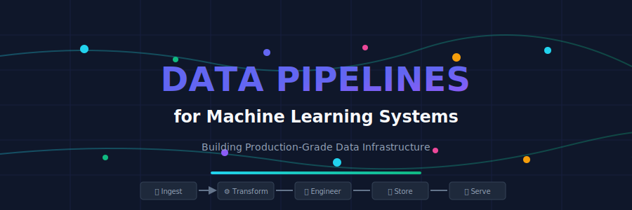
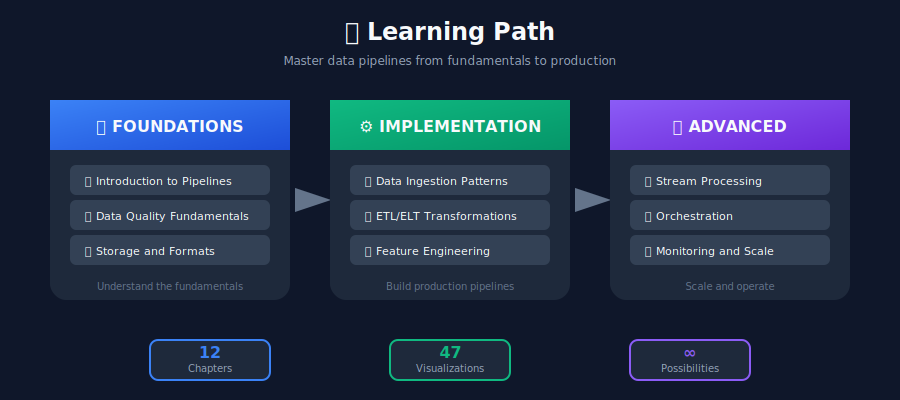
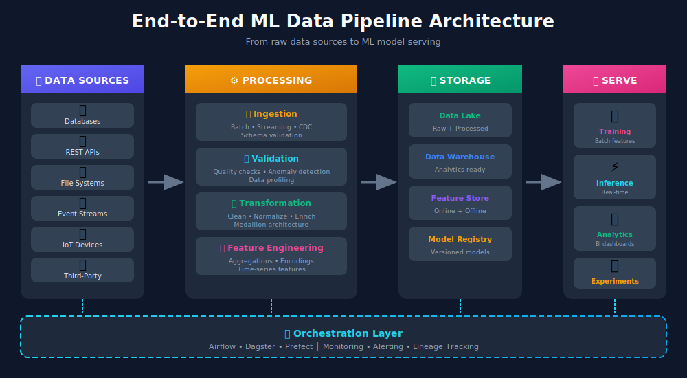
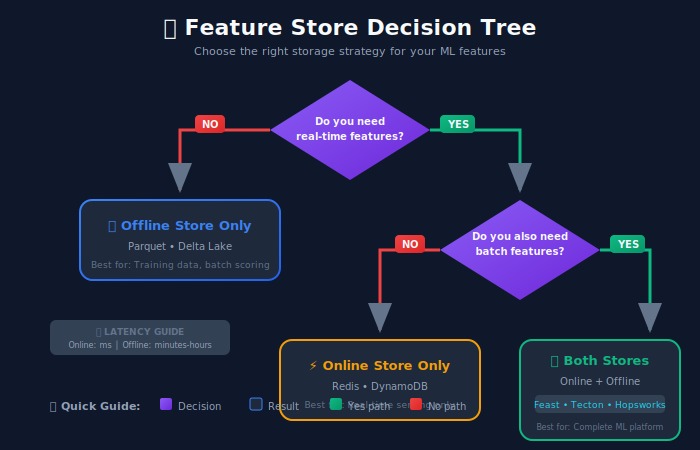

# 📊 Data Pipelines for ML Systems

> A comprehensive guide to building production-grade data pipelines for machine learning systems.



## 📚 Table of Contents

| # | Topic | Description |
|---|-------|-------------|
| 1 | [Introduction to Data Pipelines](./01_introduction_to_data_pipelines/) | Foundations, architecture, and why pipelines matter |
| 2 | [Data Ingestion](./02_data_ingestion/) | Patterns for collecting data from various sources |
| 3 | [Data Validation & Quality](./03_data_validation_quality/) | Ensuring data quality at scale |
| 4 | [ETL/ELT & Data Transformation](./04_etl_data_transformation/) | Transformation strategies and medallion architecture |
| 5 | [Feature Engineering](./05_feature_engineering/) | The art of creating ML features |
| 6 | [Data Storage & Formats](./06_data_storage_formats/) | Choosing the right storage and format |
| 7 | [Batch vs Stream Processing](./07_batch_stream_processing/) | Processing paradigms and architectures |
| 8 | [Pipeline Orchestration](./08_pipeline_orchestration/) | Coordinating complex workflows |
| 9 | [Data Versioning & Lineage](./09_data_versioning_lineage/) | Tracking data history and reproducibility |
| 10 | [Monitoring & Observability](./10_monitoring_observability/) | Observability for data pipelines |
| 11 | [Scalability Patterns](./11_scalability_patterns/) | Patterns for handling growth |
| 12 | [Real-world Case Studies](./12_case_studies/) | Learning from Netflix, Uber, Spotify & more |

---

## 📐 Mathematical Foundations

Data pipelines are built on solid mathematical and statistical foundations. Understanding these concepts helps you design more robust and efficient systems.

### Data Quality Metrics

The quality of ML models depends critically on data quality. Key metrics include:

**Completeness** — measures the proportion of non-null values:

$$C(D) = 1 - \frac{\sum_{i=1}^{n} \mathbb{1}[\text{null}(d_i)]}{n}$$

**Consistency** — measures adherence to domain constraints:

$$\text{Cons}(D) = \frac{|\{d \in D : \phi(d) = \text{true}\}|}{|D|}$$

where $\phi(d)$ represents constraint predicates (e.g., $\text{age} \geq 0$).

**Freshness** — quantifies data recency:

$$F(D) = e^{-\lambda \cdot \Delta t}$$

where $\Delta t$ is time since last update and $\lambda$ is a decay parameter.

### Information-Theoretic View of Feature Engineering

Feature transformations can be viewed through information theory:

**Mutual Information** — measures feature relevance:

$$I(X; Y) = \sum_{x,y} p(x,y) \log \frac{p(x,y)}{p(x)p(y)}$$

**Entropy** — measures information content:

$$H(X) = -\sum_{x} p(x) \log p(x)$$

Good features maximize $I(X; Y)$ while minimizing redundancy between features.

### Streaming Windows Mathematics

For time-windowed aggregations in stream processing:

**Tumbling Window** (non-overlapping):

$$W_k = [k \cdot w, (k+1) \cdot w)$$

**Sliding Window** (overlapping):

$$W_t = [t - w, t)$$

**Exponential Moving Average**:

$$\text{EMA}_t = \alpha \cdot x_t + (1-\alpha) \cdot \text{EMA}_{t-1}$$

where $\alpha = \frac{2}{w+1}$ for window size $w$.

### Probabilistic Data Structures

For scalable data processing, probabilistic structures offer space-time tradeoffs:

**Bloom Filter** — false positive rate:

$$P(\text{FP}) \approx \left(1 - e^{-kn/m}\right)^k$$

where $k$ = hash functions, $n$ = elements, $m$ = bits.

**HyperLogLog** — cardinality estimation error:

$$\sigma \approx \frac{1.04}{\sqrt{m}}$$

---

## 🎯 What You'll Learn



### After completing this guide, you'll be able to:

- ✅ Design end-to-end ML data pipelines

- ✅ Implement batch and streaming processing

- ✅ Build and operate feature stores

- ✅ Ensure data quality and freshness

- ✅ Scale pipelines to handle billions of records

- ✅ Monitor and debug production pipelines

- ✅ Apply patterns from industry leaders

---

## 🛠️ Technologies Covered

### Processing Engines

| Technology | Use Case |
|------------|----------|
| Apache Spark | Batch processing at scale |
| Apache Flink | Stream processing |
| Dask | Python-native parallel computing |
| Apache Beam | Unified batch/stream |

### Orchestration

| Tool | Highlights |
|------|------------|
| Apache Airflow | Industry standard, DAG-based |
| Prefect | Modern, Python-native |
| Dagster | Data-aware assets |
| dbt | SQL transformations |

### Storage & Formats

| Solution | Best For |
|----------|----------|
| Apache Parquet | Columnar analytics |
| Delta Lake | ACID on data lakes |
| Apache Iceberg | Large-scale tables |
| Apache Kafka | Event streaming |

### Feature Stores

| Platform | Type |
|----------|------|
| Feast | Open source |
| Tecton | Enterprise |
| Hopsworks | ML platform |

---

## 📖 How to Use This Guide

### 🚀 For Beginners
Start with Chapter 1 (Introduction) and progress sequentially. Each chapter builds on previous concepts.

### 💼 For Practitioners
Jump to specific topics based on your needs:

- Building pipelines? → Chapters 2-4
- Feature engineering? → Chapter 5
- Scaling issues? → Chapter 11
- Best practices? → Chapter 12

### 📚 For Reference
Use the case studies (Chapter 12) to understand real-world implementations and the monitoring chapter (10) for operational guidance.

---

## 🏗️ The Big Picture



---

## 📊 Quick Reference: Common Patterns

### When to Use Batch vs Streaming

| Requirement | Choose | Why |
|-------------|--------|-----|
| Training data | Batch | Historical completeness |
| Real-time features | Streaming | Low latency |
| Daily aggregations | Batch | Cost effective |
| Fraud detection | Streaming | Immediate action needed |
| Recommendations | Hybrid | Best of both |

### Feature Store Decision Tree



---

## 💡 Key Principles

1. **Design for Failure**
   - Idempotent operations
   - Retry mechanisms
   - Graceful degradation

2. **Data Quality is Non-Negotiable**
   - Validate early and often
   - Quarantine bad data
   - Monitor for drift

3. **Think in DAGs**
   - Define clear dependencies
   - Enable parallel execution
   - Make debugging easier

4. **Version Everything**
   - Data, code, models, configs
   - Enable reproducibility
   - Support rollbacks

5. **Monitor Proactively**
   - Don't wait for failures
   - Track SLOs
   - Alert on anomalies

---

## 🚀 Getting Started

```bash
# Clone the repository
cd /home/ggoswami/Project/ml_system_design/11_data_pipeline

# Explore the chapters
ls -la

# Start with the introduction
cat 01_introduction_to_data_pipelines/README.md

```

---

## 📚 Additional Resources

### Books

- "Designing Data-Intensive Applications" by Martin Kleppmann

- "Designing Machine Learning Systems" by Chip Huyen

- "Fundamentals of Data Engineering" by Joe Reis & Matt Housley

### Papers & Blogs

- [Netflix Tech Blog](https://netflixtechblog.com/)

- [Uber Engineering](https://eng.uber.com/)

- [Spotify Engineering](https://engineering.atspotify.com/)

### Communities

- [Data Engineering Subreddit](https://reddit.com/r/dataengineering)

- [MLOps Community](https://mlops.community/)

- [dbt Community](https://www.getdbt.com/community/)

---

## 🎓 Summary

Building production ML data pipelines requires understanding:

| Layer | Focus |
|-------|-------|
| **Data** | Quality, freshness, schema |
| **Processing** | Batch, stream, hybrid |
| **Storage** | Formats, partitioning, optimization |
| **Orchestration** | Scheduling, dependencies, retries |
| **Operations** | Monitoring, alerting, debugging |
| **Scale** | Partitioning, caching, distribution |

---

**Happy Pipeline Building! 🚀**

*"Data is the new oil, but like oil, it's only valuable when refined."*

---

<div align="center">

**[⬆ Back to Top](#)** | **[📚 Main Repository](https://github.com/Gaurav14cs17/ml_system_design)**

Made with 💜 by [Gaurav14cs17](https://github.com/Gaurav14cs17)

</div>
