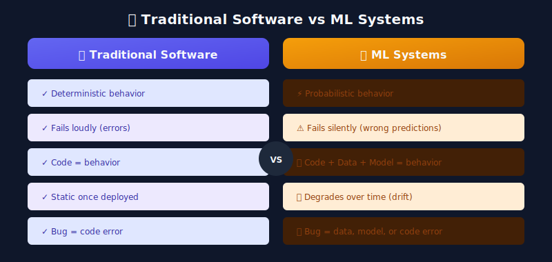
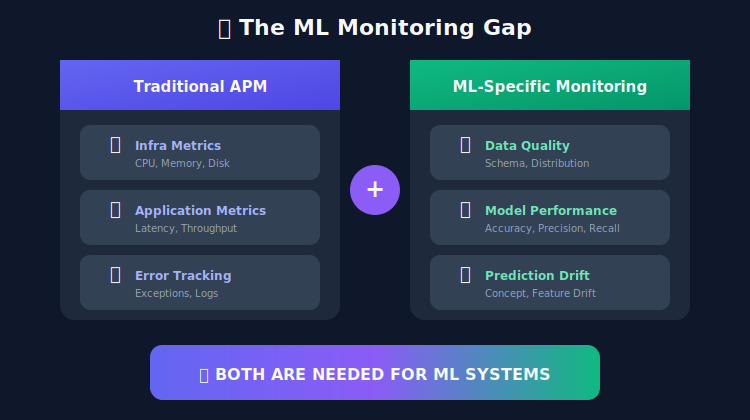
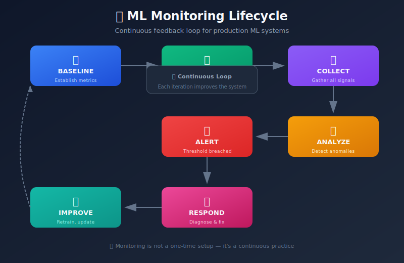
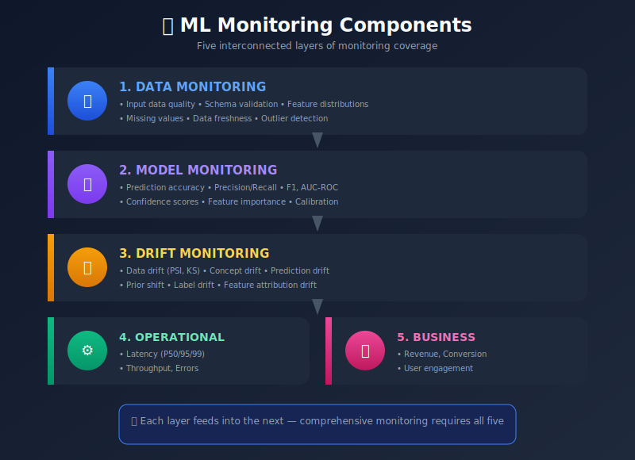
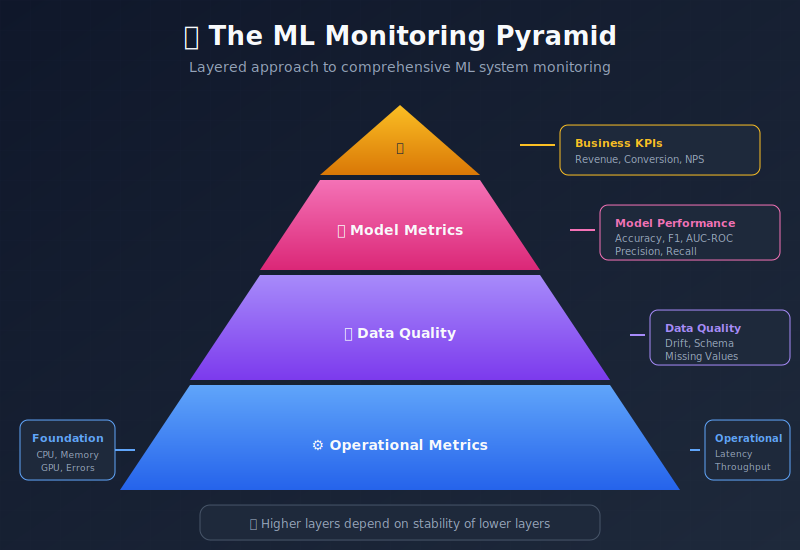
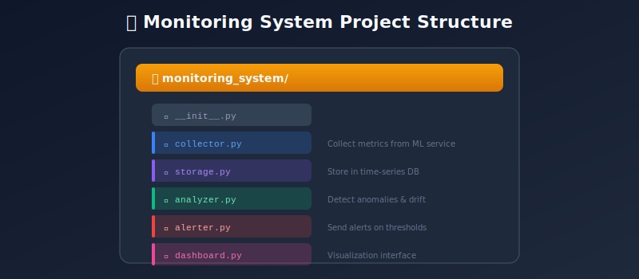

# 📚 Chapter 1: Introduction to MLOps Monitoring

> **"A model without monitoring is like a car without a dashboard—you'll only know something's wrong when you crash."**

---

## 🎯 Learning Objectives

By the end of this chapter, you will understand:
- What MLOps monitoring is and why it's critical
- The differences between traditional software monitoring and ML monitoring
- Key components of an ML monitoring system
- The monitoring lifecycle in production ML systems
- Common failure modes in ML systems

---

## 📖 Table of Contents

1. [What is MLOps Monitoring?](#what-is-mlops-monitoring)
2. [Why Traditional Monitoring Isn't Enough](#why-traditional-monitoring-isnt-enough)
3. [The ML Monitoring Lifecycle](#the-ml-monitoring-lifecycle)
4. [Key Monitoring Components](#key-monitoring-components)
5. [Common ML System Failures](#common-ml-system-failures)
6. [Building a Monitoring Strategy](#building-a-monitoring-strategy)

---

## What is MLOps Monitoring?

**MLOps Monitoring** is the practice of continuously observing, measuring, and analyzing machine learning systems in production to ensure they perform as expected and deliver business value.

### The Unique Challenge of ML Systems

Unlike traditional software where bugs manifest as errors or crashes, ML systems can **fail silently**. A model can return predictions that are technically valid but completely wrong—and you won't know until the damage is done.

### The Silent Failure Problem

Consider this mathematical formulation:

Let $f_\theta: \mathcal{X} \rightarrow \mathcal{Y}$ be our trained model. In traditional software:

$$
\text{Error} = \mathbf{1}[\text{exception thrown}]
$$

In ML systems:

$$
\text{Error} = \mathbb{E}_{(x,y) \sim P_{prod}}[L(f_\theta(x), y)]
$$

The error is a **statistical quantity** that requires monitoring the production distribution $P_{prod}$, which may differ from training.

### Real-World Impact of Silent Failures

| Company | Failure | Impact | Root Cause |
|---------|---------|--------|------------|
| Zillow | Home price predictions | $569M loss, 25% layoffs | Model couldn't adapt to market changes |
| Amazon | Recruiting tool | Gender bias in hiring | Training data reflected historical bias |
| Microsoft | Tay chatbot | Racist tweets in 24 hours | No guardrails for adversarial inputs |
| Knight Capital | Trading algorithm | $440M loss in 45 minutes | Model behavior in unexpected market conditions |

---

## Why Traditional Monitoring Isn't Enough

Traditional application performance monitoring (APM) tools like DataDog, New Relic, or Dynatrace are designed for conventional software. They excel at:

- ✅ CPU/Memory utilization
- ✅ Request latency and throughput
- ✅ Error rates and exceptions
- ✅ Service availability

But they **miss critical ML-specific concerns**:

- ❌ Data distribution changes
- ❌ Model performance degradation
- ❌ Feature engineering failures
- ❌ Prediction quality metrics
- ❌ Business metric correlation

### The ML Monitoring Gap

### Mathematical Perspective

Traditional monitoring checks:

$$
\text{healthy} = (\text{latency} < \tau) \land (\text{errors} < \epsilon) \land (\text{availability} > \alpha)
$$

ML monitoring additionally requires:

$$
\text{healthy} = \text{traditional} \land (PSI < 0.2) \land (\text{accuracy} > \text{baseline} - \delta) \land (P_{train}(X) \approx P_{prod}(X))
$$

---

## The ML Monitoring Lifecycle

ML monitoring isn't a one-time setup—it's a continuous process that evolves with your model.

### Phase 1: Baseline Establishment

Before deployment, establish reference metrics from your validation set:

| Metric Type | Examples | Purpose |
|-------------|----------|---------|
| **Performance** | Accuracy, F1, AUC | Detection threshold for degradation |
| **Distribution** | Mean, std, percentiles | Drift detection reference |
| **Latency** | P50, P95, P99 | SLA compliance baseline |

**Key Formula:** For drift detection, store the reference distribution:

$$
\hat{P}_{ref}(x) = \frac{1}{n}\sum_{i=1}^{n}\mathbf{1}[X_i \in \text{bin}(x)]
$$

### Phase 2: Production Monitoring

Monitor continuously using rolling windows:

$$
\hat{\mu}_{rolling}(t) = \frac{1}{w}\sum_{i=t-w+1}^{t} y_i
$$

Where $w$ is the window size (e.g., 1000 predictions).

### Phase 3: Alert and Response

When thresholds are breached, trigger appropriate responses:

| Alert Level | Condition | Response |
|-------------|-----------|----------|
| **INFO** | Minor drift detected | Log and continue monitoring |
| **WARNING** | PSI > 0.1 | Increase monitoring frequency |
| **CRITICAL** | PSI > 0.2 or accuracy drop > 5% | Page on-call, investigate |
| **EMERGENCY** | Business metric impact | Immediate rollback |

---

## Key Monitoring Components

A comprehensive ML monitoring system has five key layers:

### 1. Data Monitoring

**What to monitor:**
- Input feature distributions (per feature PSI)
- Schema violations (type changes, missing fields)
- Data freshness (staleness metrics)
- Missing value rates

**Mathematical formulation:**

For feature $X_i$, compute:

$$
PSI_i = \sum_{k=1}^{bins} (A_k - E_k) \ln\left(\frac{A_k}{E_k}\right)
$$

### 2. Model Performance Monitoring

**Key metrics by task type:**

| Task | Primary Metrics | Secondary |
|------|-----------------|-----------|
| Classification | Accuracy, F1, AUC | Precision, Recall, Confusion Matrix |
| Regression | MSE, MAE, R² | Residual distribution |
| Ranking | NDCG, MRR | Precision@K, Recall@K |

### 3. Drift Monitoring

**Types of drift to detect:**

| Drift Type | Definition | Detection Method |
|------------|------------|------------------|
| **Covariate** | $P(X)$ changes | PSI, KS test |
| **Concept** | $P(Y\|X)$ changes | Performance degradation |
| **Prior** | $P(Y)$ changes | Label distribution shift |
| **Prediction** | Model output distribution changes | Prediction PSI |

### 4. Operational Monitoring

**Latency percentiles matter:**

$$
P_k = \text{value at } k\text{-th percentile}
$$

- **P50**: Median experience
- **P95**: Most users' experience
- **P99**: Tail latency (often 10x P50)

### 5. Business Monitoring

**Connect ML metrics to business outcomes:**

$$
\text{Revenue Impact} = \Delta\text{Conversion} \times \text{Traffic} \times \text{AOV}
$$

---

## Common ML System Failures

Understanding failure modes helps design better monitoring:

### The Monitoring Pyramid

### Failure Categories

#### 1. Data-Related Failures

| Failure | Example | Detection |
|---------|---------|-----------|
| **Schema change** | Age field becomes string | Schema validation |
| **Missing feature** | API returns null | Missing rate monitoring |
| **Distribution shift** | Demographics change | PSI monitoring |
| **Data delay** | Feature computed from stale data | Freshness checks |

#### 2. Model-Related Failures

| Failure | Example | Detection |
|---------|---------|-----------|
| **Concept drift** | COVID changes shopping behavior | Performance monitoring |
| **Feedback loops** | Recommendations reinforce bias | Diversity metrics |
| **Adversarial inputs** | Spam evades detection | Anomaly detection |

#### 3. Infrastructure-Related Failures

| Failure | Example | Detection |
|---------|---------|-----------|
| **Resource exhaustion** | GPU OOM | Resource monitoring |
| **Version mismatch** | Wrong model loaded | Version tracking |
| **Cold start** | Lambda timeout | Latency monitoring |

---

## Building a Monitoring Strategy

### The Monitoring Pyramid Framework

Like the testing pyramid, monitoring should be layered:

1. **Foundation (Operational)**: Most coverage, cheapest
2. **Data Quality**: Catch issues before they affect models
3. **Model Performance**: Core ML metrics
4. **Business Impact**: Ultimate measure of success

### Strategy Design Principles

1. **Start simple** — Basic metrics first, add complexity as needed
2. **Automate early** — Manual monitoring doesn't scale
3. **Set meaningful thresholds** — Based on business impact, not arbitrary values
4. **Create runbooks** — Document response procedures
5. **Test your alerts** — Fire drills for monitoring systems

### Threshold Setting Guidelines

Use historical data to set thresholds:

$$
\text{threshold} = \mu_{baseline} + k \cdot \sigma_{baseline}
$$

Where $k$ depends on desired sensitivity:
- $k = 2$: ~5% false positive rate
- $k = 3$: ~0.3% false positive rate

---

## Hands-on: Project Structure

For implementation details, see the accompanying code examples in the `examples/` directory.

---

## 🔑 Key Takeaways

1. **ML systems fail differently** than traditional software—silently and gradually
2. **Traditional APM is necessary but not sufficient** for ML systems
3. **Monitoring must be continuous** and cover data, model, operations, and business
4. **Establish baselines** before deployment to detect degradation
5. **Design for observability** from day one, not as an afterthought

---

## 📐 Mathematical Summary

| Concept | Formula | Purpose |
|---------|---------|---------|
| **PSI** | $\sum(A-E)\ln(A/E)$ | Distribution stability |
| **Rolling Mean** | $\frac{1}{w}\sum_{i=t-w+1}^{t}y_i$ | Trend detection |
| **Alert Threshold** | $\mu + k\sigma$ | Anomaly detection |
| **Percentile** | $P_k = x_{(\lceil kn/100 \rceil)}$ | Latency analysis |

---

## 📚 Further Reading

- [Google's ML Test Score](https://research.google/pubs/pub46555/) - A rubric for ML production readiness
- [Hidden Technical Debt in ML Systems](https://papers.nips.cc/paper/2015/file/86df7dcfd896fcaf2674f757a2463eba-Paper.pdf) - Classic paper on ML system complexity
- [Monitoring Machine Learning Models in Production](https://christophergs.com/machine%20learning/2020/03/14/how-to-monitor-machine-learning-models/) - Practical guide

---

**Next Chapter:** [02 - Model Performance Monitoring →](../02_model_performance_monitoring/)

---

**[⬆ Back to Top](#)** | **[📚 Main Repository](https://github.com/Gaurav14cs17/ml_system_design)**

Made with 💜 by [Gaurav14cs17](https://github.com/Gaurav14cs17)

