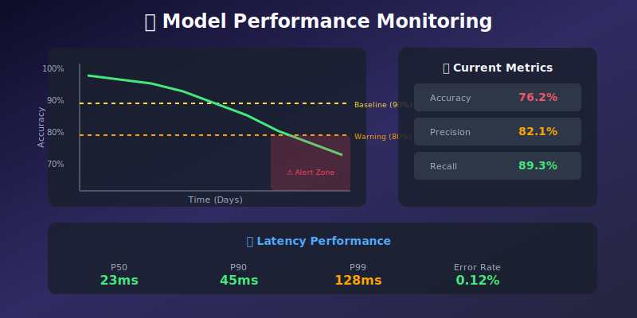
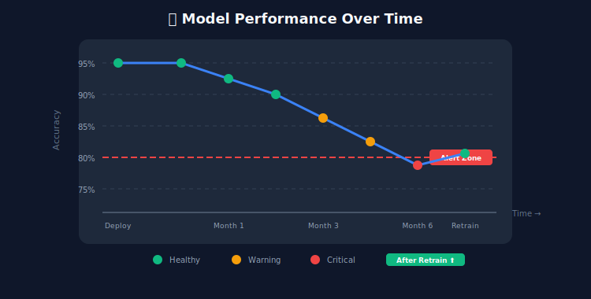
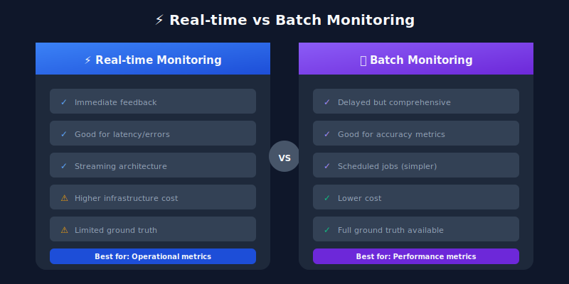
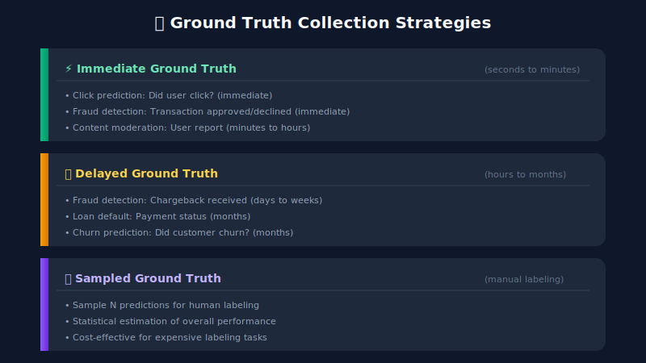

# 📊 Chapter 2: Model Performance Monitoring

> **"A model is only as good as its last prediction."**

<p align="center">
  
</p>

---

## 🎯 Learning Objectives

- Understand key model performance metrics for different ML tasks
- Learn to track accuracy, precision, recall, F1, AUC-ROC in production
- Monitor prediction latency and throughput
- Detect model degradation before business impact
- Set up performance dashboards

---

## 📖 Table of Contents

1. [Why Model Performance Monitoring?](#why-model-performance-monitoring)
2. [Metrics by Task Type](#metrics-by-task-type)
3. [Real-time vs Batch Monitoring](#real-time-vs-batch-monitoring)
4. [Ground Truth Collection](#ground-truth-collection)
5. [Performance Degradation Detection](#performance-degradation-detection)
6. [Latency Monitoring](#latency-monitoring)
7. [Code Examples](#usage-example)

---

## Why Model Performance Monitoring?

Models degrade over time due to:
- **Data drift**: Input distribution changes
- **Concept drift**: Relationship between features and target changes
- **Feedback loops**: Model predictions influence future training data



---

## Metrics by Task Type

### Classification Metrics

```python
from sklearn.metrics import (
    accuracy_score, precision_score, recall_score,
    f1_score, roc_auc_score, confusion_matrix,
    precision_recall_curve, average_precision_score
)
import numpy as np

class ClassificationMetrics:
    """Compute classification metrics for monitoring."""

    @staticmethod
    def compute_all(y_true: np.ndarray, y_pred: np.ndarray,
                   y_prob: np.ndarray = None) -> dict:
        """Compute comprehensive classification metrics."""
        metrics = {
            'accuracy': accuracy_score(y_true, y_pred),
            'precision': precision_score(y_true, y_pred, average='weighted'),
            'recall': recall_score(y_true, y_pred, average='weighted'),
            'f1_score': f1_score(y_true, y_pred, average='weighted'),
        }

        # Confusion matrix
        cm = confusion_matrix(y_true, y_pred)
        tn, fp, fn, tp = cm.ravel() if cm.size == 4 else (0, 0, 0, 0)

        metrics['true_positives'] = int(tp)
        metrics['true_negatives'] = int(tn)
        metrics['false_positives'] = int(fp)
        metrics['false_negatives'] = int(fn)

        # Rates
        metrics['false_positive_rate'] = fp / (fp + tn) if (fp + tn) > 0 else 0
        metrics['false_negative_rate'] = fn / (fn + tp) if (fn + tp) > 0 else 0

        # Probability-based metrics
        if y_prob is not None:
            metrics['auc_roc'] = roc_auc_score(y_true, y_prob)
            metrics['average_precision'] = average_precision_score(y_true, y_prob)

        return metrics

    @staticmethod
    def compute_at_thresholds(y_true: np.ndarray, y_prob: np.ndarray,
                             thresholds: list = [0.3, 0.5, 0.7]) -> dict:
        """Compute metrics at different decision thresholds."""
        results = {}
        for threshold in thresholds:
            y_pred = (y_prob >= threshold).astype(int)
            results[f'threshold_{threshold}'] = {
                'precision': precision_score(y_true, y_pred),
                'recall': recall_score(y_true, y_pred),
                'f1': f1_score(y_true, y_pred)
            }
        return results
```

### Regression Metrics

```python
from sklearn.metrics import (
    mean_absolute_error, mean_squared_error,
    r2_score, mean_absolute_percentage_error
)

class RegressionMetrics:
    """Compute regression metrics for monitoring."""

    @staticmethod
    def compute_all(y_true: np.ndarray, y_pred: np.ndarray) -> dict:
        """Compute comprehensive regression metrics."""
        return {
            'mae': mean_absolute_error(y_true, y_pred),
            'mse': mean_squared_error(y_true, y_pred),
            'rmse': np.sqrt(mean_squared_error(y_true, y_pred)),
            'r2_score': r2_score(y_true, y_pred),
            'mape': mean_absolute_percentage_error(y_true, y_pred) * 100,
            'max_error': np.max(np.abs(y_true - y_pred)),
            'median_error': np.median(np.abs(y_true - y_pred))
        }

    @staticmethod
    def compute_by_segment(y_true: np.ndarray, y_pred: np.ndarray,
                          segments: np.ndarray) -> dict:
        """Compute metrics for each segment."""
        results = {}
        for segment in np.unique(segments):
            mask = segments == segment
            results[segment] = RegressionMetrics.compute_all(
                y_true[mask], y_pred[mask]
            )
        return results
```

### Ranking Metrics

```python
class RankingMetrics:
    """Compute ranking metrics for recommendation systems."""

    @staticmethod
    def precision_at_k(y_true: list, y_pred: list, k: int) -> float:
        """Precision@K for ranking."""
        y_pred_k = y_pred[:k]
        hits = len(set(y_pred_k) & set(y_true))
        return hits / k

    @staticmethod
    def recall_at_k(y_true: list, y_pred: list, k: int) -> float:
        """Recall@K for ranking."""
        y_pred_k = y_pred[:k]
        hits = len(set(y_pred_k) & set(y_true))
        return hits / len(y_true) if y_true else 0

    @staticmethod
    def ndcg_at_k(y_true: list, y_pred: list, k: int) -> float:
        """Normalized Discounted Cumulative Gain."""
        def dcg(relevances: list) -> float:
            return sum(rel / np.log2(i + 2) for i, rel in enumerate(relevances))

        # Binary relevance
        relevances = [1 if item in y_true else 0 for item in y_pred[:k]]
        ideal_relevances = sorted(relevances, reverse=True)

        dcg_score = dcg(relevances)
        idcg_score = dcg(ideal_relevances)

        return dcg_score / idcg_score if idcg_score > 0 else 0

    @staticmethod
    def mean_reciprocal_rank(y_true: list, y_pred: list) -> float:
        """Mean Reciprocal Rank."""
        for i, item in enumerate(y_pred):
            if item in y_true:
                return 1.0 / (i + 1)
        return 0.0
```

---

## Real-time vs Batch Monitoring



### Real-time Monitoring Implementation

```python
from prometheus_client import Counter, Histogram, Gauge
import time

# Prometheus metrics
PREDICTIONS = Counter(
    'model_predictions_total',
    'Total predictions',
    ['model_name', 'model_version', 'prediction_class']
)

LATENCY = Histogram(
    'model_prediction_latency_seconds',
    'Prediction latency',
    ['model_name'],
    buckets=[0.01, 0.025, 0.05, 0.1, 0.25, 0.5, 1.0]
)

CONFIDENCE = Histogram(
    'model_prediction_confidence',
    'Prediction confidence scores',
    ['model_name'],
    buckets=[0.1, 0.2, 0.3, 0.4, 0.5, 0.6, 0.7, 0.8, 0.9, 1.0]
)

class RealTimeMonitor:
    """Real-time model performance monitoring."""

    def __init__(self, model_name: str, model_version: str):
        self.model_name = model_name
        self.model_version = model_version

    def record_prediction(self, prediction_class: str, confidence: float,
                         latency_seconds: float):
        """Record a single prediction."""
        PREDICTIONS.labels(
            model_name=self.model_name,
            model_version=self.model_version,
            prediction_class=str(prediction_class)
        ).inc()

        LATENCY.labels(model_name=self.model_name).observe(latency_seconds)
        CONFIDENCE.labels(model_name=self.model_name).observe(confidence)
```

### Batch Monitoring Implementation

```python
from datetime import datetime, timedelta
import pandas as pd

class BatchMonitor:
    """Batch model performance monitoring with ground truth."""

    def __init__(self, model_name: str, metrics_store):
        self.model_name = model_name
        self.metrics_store = metrics_store

    def compute_daily_metrics(self, date: datetime) -> dict:
        """Compute metrics for a specific day."""
        # Get predictions and ground truth
        predictions = self.metrics_store.get_predictions(
            model_name=self.model_name,
            start_date=date,
            end_date=date + timedelta(days=1)
        )

        if predictions.empty:
            return None

        # Filter to predictions with ground truth
        with_labels = predictions[predictions['ground_truth'].notna()]

        if with_labels.empty:
            return {'date': date, 'coverage': 0, 'metrics': None}

        # Compute metrics
        metrics = ClassificationMetrics.compute_all(
            y_true=with_labels['ground_truth'].values,
            y_pred=with_labels['prediction'].values,
            y_prob=with_labels['probability'].values
        )

        return {
            'date': date,
            'total_predictions': len(predictions),
            'labeled_predictions': len(with_labels),
            'coverage': len(with_labels) / len(predictions),
            'metrics': metrics
        }

    def compute_weekly_report(self, end_date: datetime) -> pd.DataFrame:
        """Generate weekly performance report."""
        daily_metrics = []

        for i in range(7):
            date = end_date - timedelta(days=i)
            result = self.compute_daily_metrics(date)
            if result:
                daily_metrics.append(result)

        return pd.DataFrame(daily_metrics)
```

---

## Ground Truth Collection

Ground truth (actual outcomes) is essential for computing real performance metrics.



### Ground Truth Collection System

```python
from datetime import datetime
from typing import Optional
import uuid

class GroundTruthCollector:
    """Collect and join ground truth with predictions."""

    def __init__(self, storage_backend):
        self.storage = storage_backend

    def log_prediction(self, features: dict, prediction: any,
                      probability: float = None,
                      metadata: dict = None) -> str:
        """Log a prediction for later ground truth collection."""
        prediction_id = str(uuid.uuid4())

        record = {
            'prediction_id': prediction_id,
            'timestamp': datetime.utcnow().isoformat(),
            'features': features,
            'prediction': prediction,
            'probability': probability,
            'metadata': metadata or {},
            'ground_truth': None,
            'ground_truth_timestamp': None
        }

        self.storage.save_prediction(prediction_id, record)
        return prediction_id

    def log_ground_truth(self, prediction_id: str, ground_truth: any,
                        feedback_delay_seconds: float = None):
        """Log ground truth for a prediction."""
        record = self.storage.get_prediction(prediction_id)

        if record is None:
            raise ValueError(f"Prediction {prediction_id} not found")

        record['ground_truth'] = ground_truth
        record['ground_truth_timestamp'] = datetime.utcnow().isoformat()

        if feedback_delay_seconds is None and record.get('timestamp'):
            pred_time = datetime.fromisoformat(record['timestamp'])
            feedback_delay_seconds = (datetime.utcnow() - pred_time).total_seconds()

        record['feedback_delay_seconds'] = feedback_delay_seconds

        self.storage.update_prediction(prediction_id, record)

    def get_labeled_data(self, start_date: datetime, end_date: datetime,
                        min_feedback_delay: float = None) -> list:
        """Get predictions with ground truth for evaluation."""
        predictions = self.storage.get_predictions_in_range(start_date, end_date)

        labeled = [p for p in predictions if p['ground_truth'] is not None]

        if min_feedback_delay:
            labeled = [
                p for p in labeled
                if p.get('feedback_delay_seconds', 0) >= min_feedback_delay
            ]

        return labeled
```

---

## Performance Degradation Detection

### Statistical Process Control

```python
import numpy as np
from scipy import stats
from collections import deque

class PerformanceDegradationDetector:
    """Detect model performance degradation using statistical methods."""

    def __init__(self, baseline_metrics: dict, window_size: int = 100):
        self.baseline = baseline_metrics
        self.window_size = window_size
        self.metric_history = {}

    def update(self, metrics: dict) -> dict:
        """Update with new metrics and check for degradation."""
        alerts = {}

        for metric_name, value in metrics.items():
            if metric_name not in self.metric_history:
                self.metric_history[metric_name] = deque(maxlen=self.window_size)

            self.metric_history[metric_name].append(value)

            # Check against baseline
            baseline_value = self.baseline.get(metric_name)
            if baseline_value:
                alert = self._check_degradation(metric_name, value, baseline_value)
                if alert:
                    alerts[metric_name] = alert

        return alerts

    def _check_degradation(self, metric_name: str, current: float,
                          baseline: float) -> Optional[dict]:
        """Check if metric has degraded significantly."""
        history = list(self.metric_history.get(metric_name, []))

        if len(history) < 10:
            return None

        # Calculate relative change
        relative_change = (current - baseline) / (abs(baseline) + 1e-10)

        # Metrics where lower is worse (accuracy, precision, etc.)
        lower_is_worse = ['accuracy', 'precision', 'recall', 'f1', 'auc_roc', 'r2_score']

        # Metrics where higher is worse (error, latency, etc.)
        higher_is_worse = ['mae', 'mse', 'rmse', 'mape', 'latency', 'error_rate']

        if metric_name in lower_is_worse and relative_change < -0.05:
            return {
                'type': 'degradation',
                'metric': metric_name,
                'baseline': baseline,
                'current': current,
                'change_pct': relative_change * 100,
                'severity': 'critical' if relative_change < -0.10 else 'warning'
            }

        if metric_name in higher_is_worse and relative_change > 0.10:
            return {
                'type': 'degradation',
                'metric': metric_name,
                'baseline': baseline,
                'current': current,
                'change_pct': relative_change * 100,
                'severity': 'critical' if relative_change > 0.20 else 'warning'
            }

        return None

    def detect_trend(self, metric_name: str, periods: int = 7) -> dict:
        """Detect downward trend in metric."""
        history = list(self.metric_history.get(metric_name, []))

        if len(history) < periods:
            return {'trend': 'insufficient_data'}

        recent = history[-periods:]

        # Linear regression to detect trend
        x = np.arange(len(recent))
        slope, intercept, r_value, p_value, std_err = stats.linregress(x, recent)

        return {
            'trend': 'declining' if slope < 0 else 'improving' if slope > 0 else 'stable',
            'slope': slope,
            'r_squared': r_value ** 2,
            'p_value': p_value,
            'significant': p_value < 0.05
        }
```

---

## Latency Monitoring

```python
import time
from collections import deque
import numpy as np

class LatencyMonitor:
    """Monitor model inference latency."""

    def __init__(self, sla_p50_ms: float = 50, sla_p99_ms: float = 200,
                 window_size: int = 1000):
        self.sla_p50 = sla_p50_ms
        self.sla_p99 = sla_p99_ms
        self.latencies = deque(maxlen=window_size)

    def record(self, latency_ms: float):
        """Record a latency measurement."""
        self.latencies.append(latency_ms)

    def get_stats(self) -> dict:
        """Get latency statistics."""
        if not self.latencies:
            return {}

        arr = np.array(self.latencies)

        return {
            'count': len(arr),
            'mean': np.mean(arr),
            'std': np.std(arr),
            'min': np.min(arr),
            'max': np.max(arr),
            'p50': np.percentile(arr, 50),
            'p75': np.percentile(arr, 75),
            'p90': np.percentile(arr, 90),
            'p95': np.percentile(arr, 95),
            'p99': np.percentile(arr, 99)
        }

    def check_sla(self) -> dict:
        """Check if latency meets SLA."""
        stats = self.get_stats()

        if not stats:
            return {'status': 'no_data'}

        p50_ok = stats['p50'] <= self.sla_p50
        p99_ok = stats['p99'] <= self.sla_p99

        return {
            'status': 'ok' if (p50_ok and p99_ok) else 'violation',
            'p50_sla': self.sla_p50,
            'p50_actual': stats['p50'],
            'p50_ok': p50_ok,
            'p99_sla': self.sla_p99,
            'p99_actual': stats['p99'],
            'p99_ok': p99_ok
        }

    def measure(self):
        """Context manager to measure inference time."""
        return LatencyMeasurer(self)

class LatencyMeasurer:
    """Context manager for latency measurement."""

    def __init__(self, monitor: LatencyMonitor):
        self.monitor = monitor
        self.start_time = None

    def __enter__(self):
        self.start_time = time.perf_counter()
        return self

    def __exit__(self, *args):
        latency_ms = (time.perf_counter() - self.start_time) * 1000
        self.monitor.record(latency_ms)

# Usage example
latency_monitor = LatencyMonitor(sla_p50_ms=50, sla_p99_ms=200)

def predict_with_monitoring(model, features):
    with latency_monitor.measure():
        prediction = model.predict(features)
    return prediction
```

---

## 📊 Dashboard Metrics Summary

| Category | Metric | Good | Warning | Critical |
|----------|--------|------|---------|----------|
| **Accuracy** | Overall Accuracy | > baseline - 2% | baseline - 5% | < baseline - 10% |
| **Classification** | Precision | > 0.90 | 0.85 - 0.90 | < 0.85 |
| | Recall | > 0.85 | 0.80 - 0.85 | < 0.80 |
| | F1 Score | > 0.87 | 0.82 - 0.87 | < 0.82 |
| | AUC-ROC | > 0.90 | 0.85 - 0.90 | < 0.85 |
| **Regression** | MAPE | < 5% | 5% - 10% | > 10% |
| | R² Score | > 0.90 | 0.80 - 0.90 | < 0.80 |
| **Latency** | P50 | < 50ms | 50-100ms | > 100ms |
| | P99 | < 200ms | 200-500ms | > 500ms |
| **Coverage** | Ground Truth | > 80% | 50% - 80% | < 50% |

---

## 🔑 Key Takeaways

1. **Choose metrics appropriate to your task** - Classification, regression, and ranking need different metrics
2. **Combine real-time and batch monitoring** - Real-time for operations, batch for accuracy
3. **Ground truth collection is critical** - Design it into your system from day one
4. **Monitor latency alongside accuracy** - Fast wrong answers are still wrong
5. **Set thresholds based on business impact** - Not all metric drops are equal

---

**Next Chapter:** [03 - Data Drift Detection →](../03_data_drift_detection/)

---

<div align="center">

**[⬆ Back to Top](#)** | **[📚 Main Repository](https://github.com/Gaurav14cs17/ml_system_design)**

Made with 💜 by [Gaurav14cs17](https://github.com/Gaurav14cs17)

</div>
