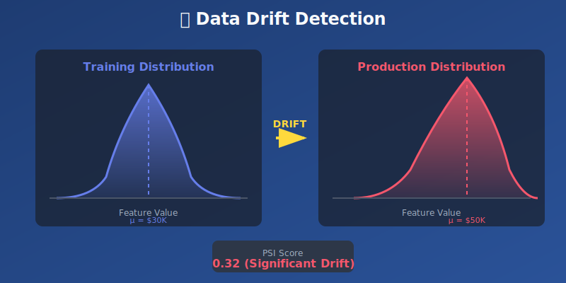
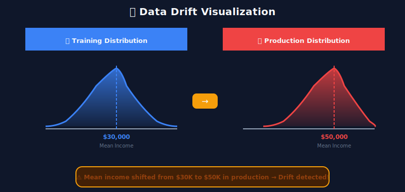

# 📈 Chapter 3: Data Drift Detection

> **"The only constant in data is change."**

<p align="center">
  
</p>

---

## 🎯 Learning Objectives

- Understand what data drift is and why it matters
- Master statistical methods for drift detection
- Learn the mathematical foundations behind drift metrics
- Implement drift detection for numerical and categorical features
- Set up automated drift monitoring pipelines

---

## 📖 Table of Contents

1. [What is Data Drift?](#what-is-data-drift)
2. [Mathematical Framework](#mathematical-framework)
3. [Statistical Tests for Drift Detection](#statistical-tests-for-drift-detection)
4. [Categorical Feature Drift](#categorical-feature-drift)
5. [Practical Implementation](#practical-implementation)
6. [Automated Monitoring Pipeline](#automated-monitoring-pipeline)

---

## What is Data Drift?

**Data drift** (also called *covariate shift*) occurs when the statistical properties of input features change over time, even though the relationship between features and target remains the same.



### Types of Distribution Shift

| Type | Mathematical Definition | Example |
|------|------------------------|---------|
| **Covariate Shift** | \( P_{train}(X) \neq P_{prod}(X) \), but \( P(Y\|X) \) same | Customer demographics change |
| **Prior Shift** | \( P_{train}(Y) \neq P_{prod}(Y) \) | Fraud rate increases seasonally |
| **Concept Drift** | \( P_{train}(Y\|X) \neq P_{prod}(Y\|X) \) | What defines "spam" evolves |
| **Feature Drift** | Individual \( P(X_i) \) changes | Age distribution shifts |

---

## Mathematical Framework

### The Drift Detection Problem

Given two samples:
- **Reference sample**: \( X_{ref} = \{x_1, x_2, ..., x_n\} \) from training distribution
- **Current sample**: \( X_{curr} = \{y_1, y_2, ..., y_m\} \) from production

We want to test whether both samples come from the same distribution:

```math
H_0: P_{ref}(X) = P_{curr}(X)
H_1: P_{ref}(X) \neq P_{curr}(X)
```

### Information-Theoretic Measures

#### Kullback-Leibler Divergence

The **KL divergence** measures how one probability distribution diverges from another:

```math
D_{KL}(P \| Q) = \sum_{i} P(i) \log\frac{P(i)}{Q(i)} = \mathbb{E}_P\left[\log\frac{P(X)}{Q(X)}\right]
```

**Properties:**
- Non-negative: \( D_{KL}(P \| Q) \geq 0 \)
- Zero iff \( P = Q \)
- **Not symmetric**: \( D_{KL}(P \| Q) \neq D_{KL}(Q \| P) \)
- Unbounded: Can be infinite if \( Q(i) = 0 \) where \( P(i) > 0 \)

#### Jensen-Shannon Divergence

The **JS divergence** is a symmetric, bounded version:

```math
JS(P \| Q) = \frac{1}{2}D_{KL}(P \| M) + \frac{1}{2}D_{KL}(Q \| M)
```

Where \( M = \frac{1}{2}(P + Q) \) is the mixture distribution.

**Properties:**
- Symmetric: \( JS(P \| Q) = JS(Q \| P) \)
- Bounded: \( 0 \leq JS(P \| Q) \leq \log(2) \) (or 1 if using log base 2)
- \( \sqrt{JS(P \| Q)} \) is a proper metric

---

## Statistical Tests for Drift Detection

### 1. Population Stability Index (PSI)

The **PSI** is the most widely used metric in production ML systems:

```math
PSI = \sum_{i=1}^{k} (A_i - E_i) \cdot \ln\left(\frac{A_i}{E_i}\right)
```

Where:
- \( k \) = number of bins
- \( A_i \) = actual (current) proportion in bin \( i \)
- \( E_i \) = expected (reference) proportion in bin \( i \)

#### Derivation

PSI is essentially a symmetric version of KL divergence:

```math
PSI = D_{KL}(A \| E) + D_{KL}(E \| A)
```

This can be verified by expanding:

```math
D_{KL}(A \| E) = \sum_i A_i \log\frac{A_i}{E_i}
D_{KL}(E \| A) = \sum_i E_i \log\frac{E_i}{A_i} = -\sum_i E_i \log\frac{A_i}{E_i}
```

Adding these:

```math
D_{KL}(A \| E) + D_{KL}(E \| A) = \sum_i (A_i - E_i) \log\frac{A_i}{E_i} = PSI
```

#### Interpretation Guidelines

| PSI Value | Interpretation | Action |
|-----------|----------------|--------|
| \( PSI < 0.1 \) | No significant change | Continue monitoring |
| \( 0.1 \leq PSI < 0.2 \) | Moderate change | Investigate, increase monitoring |
| \( PSI \geq 0.2 \) | Significant change | Action required, potential retraining |
| \( PSI \geq 0.25 \) | Major shift | Immediate investigation |

### 2. Kolmogorov-Smirnov Test

The **KS test** compares the empirical cumulative distribution functions (ECDFs):

```math
D_n = \sup_x |F_n(x) - G_m(x)|
```

Where:
- \( F_n(x) = \frac{1}{n}\sum_{i=1}^{n}\mathbf{1}_{X_i \leq x} \) is the ECDF of sample 1
- \( G_m(x) = \frac{1}{m}\sum_{j=1}^{m}\mathbf{1}_{Y_j \leq x} \) is the ECDF of sample 2

#### Asymptotic Distribution

Under \( H_0 \), the test statistic converges:

```math
\sqrt{\frac{nm}{n+m}} D_n \xrightarrow{d} K
```

Where \( K \) follows the **Kolmogorov distribution**.

#### Critical Values

| Significance Level \( \alpha \) | Critical Value \( c_\alpha \) |
|--------------------------------|------------------------------|
| 0.10 | 1.22 |
| 0.05 | 1.36 |
| 0.01 | 1.63 |

Reject \( H_0 \) if \( D_n > c_\alpha \cdot \sqrt{\frac{n+m}{nm}} \)

### 3. Wasserstein Distance (Earth Mover's Distance)

The **Wasserstein distance** measures the minimum "work" to transform one distribution into another:

```math
W_p(P, Q) = \left(\inf_{\gamma \in \Gamma(P,Q)} \int |x - y|^p d\gamma(x,y)\right)^{1/p}
```

For 1D distributions with CDFs \( F \) and \( G \):

```math
W_1(P, Q) = \int_{-\infty}^{\infty} |F(x) - G(x)| dx
```

**Advantages:**
- Provides intuitive measure of "distance" between distributions
- Works even when distributions have non-overlapping support
- Preserves geometry of the underlying space

### 4. Chi-Square Test (for Categorical Data)

For categorical features, use the chi-square test:

```math
\chi^2 = \sum_{i=1}^{k} \frac{(O_i - E_i)^2}{E_i}
```

Where:
- \( O_i \) = observed frequency in category \( i \)
- \( E_i \) = expected frequency in category \( i \)

Under \( H_0 \), \( \chi^2 \sim \chi^2_{k-1} \) with \( k-1 \) degrees of freedom.

---

## Choosing the Right Test

| Scenario | Recommended Test | Reason |
|----------|-----------------|--------|
| Production monitoring | PSI | Simple, interpretable, industry standard |
| Statistical rigor needed | KS Test | Well-understood statistical properties |
| Measure magnitude of shift | Wasserstein | Intuitive distance metric |
| Categorical features | Chi-Square | Designed for categorical data |
| Symmetric comparison | JS Divergence | Bounded, symmetric |

---

## Confidence and Sample Size

### Minimum Sample Size for Reliable Detection

The power of drift detection depends on sample size. For PSI with \( k \) bins:

```math
n_{min} \approx \frac{k \cdot z_{\alpha/2}^2}{4 \cdot \epsilon^2}
```

Where \( \epsilon \) is the minimum detectable proportional change per bin.

### Confidence Intervals for PSI

Using bootstrap methods, construct confidence intervals:

1. Resample with replacement \( B \) times
2. Compute \( PSI_b \) for each bootstrap sample
3. Use percentile method: \( CI = [PSI_{(\alpha/2)}, PSI_{(1-\alpha/2)}] \)

---

## Practical Implementation

### Computing PSI

```python
def calculate_psi(reference: np.ndarray, current: np.ndarray, 
                  bins: int = 10, eps: float = 1e-4) -> float:
    """
    Calculate Population Stability Index.
    
    PSI = Σ(Aᵢ - Eᵢ) · ln(Aᵢ/Eᵢ)
    """
    # Create bins from reference distribution
    _, bin_edges = np.histogram(reference, bins=bins)
    
    # Compute proportions
    ref_counts, _ = np.histogram(reference, bins=bin_edges)
    curr_counts, _ = np.histogram(current, bins=bin_edges)
    
    ref_pct = (ref_counts + eps) / (len(reference) + eps * bins)
    curr_pct = (curr_counts + eps) / (len(current) + eps * bins)
    
    # PSI formula
    psi = np.sum((curr_pct - ref_pct) * np.log(curr_pct / ref_pct))
    
    return psi
```

### KS Test Implementation

```python
from scipy import stats

def ks_drift_test(reference: np.ndarray, current: np.ndarray,
                  alpha: float = 0.05) -> dict:
    """
    Two-sample Kolmogorov-Smirnov test.
    
    H₀: Both samples from same distribution
    H₁: Distributions differ
    """
    statistic, p_value = stats.ks_2samp(reference, current)
    
    return {
        'statistic': statistic,  # D_n = sup|F_n(x) - G_m(x)|
        'p_value': p_value,
        'drift_detected': p_value < alpha
    }
```

---

## Automated Monitoring Pipeline

### Drift Detection Strategy

```
Reference Data (Training)
         |
         ▼
    +-------------+
    |  Binning /  |
    |  Histogram  |
    +-------------+
         |
         ▼
+---------------------+
| Production Data     |--▶ Compare Distributions
| (Rolling Window)    |
+---------------------+
         |
         ▼
    +-------------+
    |  PSI / KS   |
    |  Computation|
    +-------------+
         |
         ▼
    +-------------+     PSI ≥ 0.2
    |  Threshold  |----------------▶ Alert!
    |  Check      |
    +-------------+
```

### Multi-Feature Monitoring

When monitoring many features, apply **multiple testing correction**:

**Bonferroni Correction:**

```math
\alpha_{adjusted} = \frac{\alpha}{m}
```

Where \( m \) is the number of features tested.

**Benjamini-Hochberg (FDR Control):**
1. Order p-values: \( p_{(1)} \leq p_{(2)} \leq ... \leq p_{(m)} \)
2. Find largest \( k \) where \( p_{(k)} \leq \frac{k}{m} \cdot \alpha \)
3. Reject hypotheses \( H_{(1)}, ..., H_{(k)} \)

---

## 🔑 Key Takeaways

1. **PSI is the industry standard** — Simple, interpretable, and effective for production monitoring
2. **Mathematical foundation matters** — Understanding the theory helps choose appropriate methods
3. **Combine multiple methods** — PSI + statistical tests provide confidence
4. **Monitor all features** — Drift can occur in any feature independently
5. **Account for multiple testing** — Apply corrections when monitoring many features
6. **Set appropriate thresholds** — PSI > 0.2 is generally concerning, but context matters

---

## 📐 Mathematical Summary

| Measure | Formula | Range | Properties |
|---------|---------|-------|------------|
| **PSI** | \( \sum(A-E)\ln(A/E) \) | \( [0, \infty) \) | Symmetric, industry standard |
| **KL Divergence** | \( \sum P\log(P/Q) \) | \( [0, \infty) \) | Not symmetric |
| **JS Divergence** | \( \frac{1}{2}KL(P\|M) + \frac{1}{2}KL(Q\|M) \) | \( [0, \log 2] \) | Symmetric, bounded |
| **KS Statistic** | \( \sup|F-G| \) | \( [0, 1] \) | Distribution-free |
| **Wasserstein** | \( \int|F-G|dx \) | \( [0, \infty) \) | True metric |

---

**Next Chapter:** [04 - Concept Drift Detection →](../04_concept_drift_detection/)

---

<div align="center">

**[⬆ Back to Top](#)** | **[📚 Main Repository](https://github.com/Gaurav14cs17/ml_system_design)**

Made with 💜 by [Gaurav14cs17](https://github.com/Gaurav14cs17)

</div>
