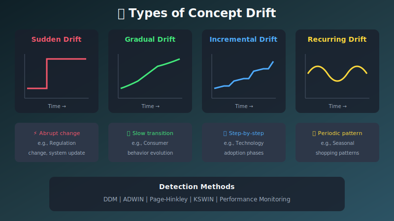
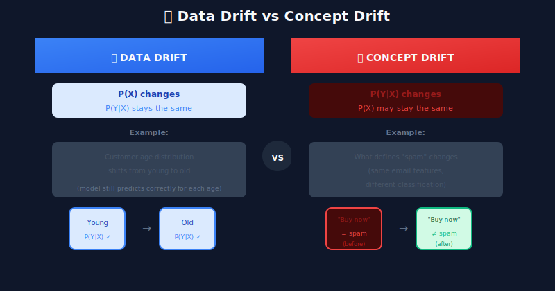
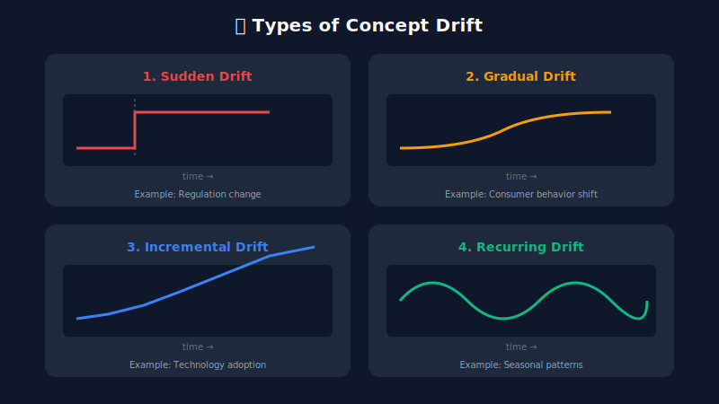
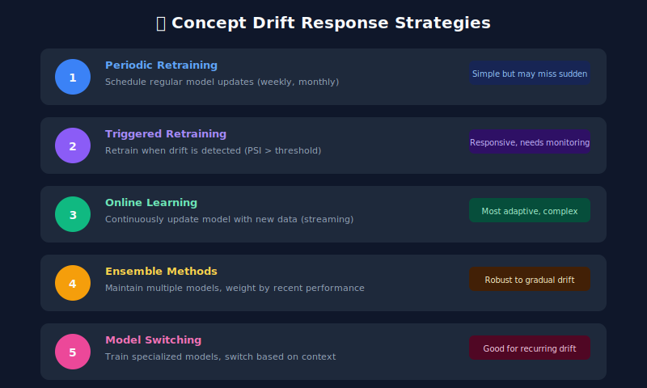

# 🔄 Chapter 4: Concept Drift Detection

> **"When the rules of the game change, yesterday's winning strategy becomes today's losing one."**

<p align="center">
  
</p>

---

## 🎯 Learning Objectives

- Understand the difference between data drift and concept drift
- Learn methods to detect concept drift
- Implement concept drift detectors
- Understand when to retrain vs adapt models

---

## What is Concept Drift?

**Concept drift** occurs when the relationship between input features (X) and target variable (Y) changes over time. Unlike data drift, the input distribution may remain stable, but what those inputs *mean* for predictions changes.



### Types of Concept Drift



---

## Detecting Concept Drift

### Method 1: Performance-Based Detection

The most direct method: monitor model performance over time.

```python
import numpy as np
from collections import deque
from scipy import stats
from dataclasses import dataclass
from typing import Optional, List
from enum import Enum

class DriftType(Enum):
    NONE = "none"
    WARNING = "warning"
    DRIFT = "drift"

@dataclass
class ConceptDriftResult:
    drift_detected: bool
    drift_type: DriftType
    confidence: float
    details: dict

class PerformanceBasedDetector:
    """Detect concept drift through performance degradation."""

    def __init__(self, baseline_performance: float,
                 warning_threshold: float = 0.05,
                 drift_threshold: float = 0.10,
                 window_size: int = 100):
        self.baseline = baseline_performance
        self.warning_threshold = warning_threshold
        self.drift_threshold = drift_threshold
        self.window = deque(maxlen=window_size)
        self.performance_history = []

    def update(self, y_true: np.ndarray, y_pred: np.ndarray) -> ConceptDriftResult:
        """Update with new batch and check for drift."""
        # Calculate batch accuracy
        accuracy = np.mean(y_true == y_pred)
        self.window.append(accuracy)
        self.performance_history.append(accuracy)

        if len(self.window) < 10:
            return ConceptDriftResult(
                drift_detected=False,
                drift_type=DriftType.NONE,
                confidence=0.0,
                details={'message': 'Insufficient data'}
            )

        # Calculate current performance
        current_performance = np.mean(list(self.window))
        performance_drop = self.baseline - current_performance

        # Statistical test for significance
        t_stat, p_value = stats.ttest_1samp(list(self.window), self.baseline)

        # Determine drift level
        if performance_drop >= self.drift_threshold and p_value < 0.01:
            drift_type = DriftType.DRIFT
            drift_detected = True
        elif performance_drop >= self.warning_threshold and p_value < 0.05:
            drift_type = DriftType.WARNING
            drift_detected = True
        else:
            drift_type = DriftType.NONE
            drift_detected = False

        return ConceptDriftResult(
            drift_detected=drift_detected,
            drift_type=drift_type,
            confidence=1 - p_value,
            details={
                'baseline_performance': self.baseline,
                'current_performance': current_performance,
                'performance_drop': performance_drop,
                'p_value': p_value,
                't_statistic': t_stat
            }
        )

```

### Method 2: Page-Hinkley Test

Sequential analysis method for detecting changes in a stream.

```python
class PageHinkleyDetector:
    """Page-Hinkley test for concept drift detection."""

    def __init__(self, delta: float = 0.005,
                 lambda_param: float = 50,
                 alpha: float = 0.9999):
        self.delta = delta  # Magnitude of changes to detect
        self.lambda_param = lambda_param  # Detection threshold
        self.alpha = alpha  # Forgetting factor

        self.sum = 0
        self.mean = 0
        self.count = 0
        self.min_sum = float('inf')

    def update(self, value: float) -> ConceptDriftResult:
        """Update with new value and check for drift."""
        self.count += 1

        # Update running mean
        self.mean = self.mean + (value - self.mean) / self.count

        # Update cumulative sum
        self.sum = self.alpha * self.sum + (value - self.mean - self.delta)

        # Track minimum
        self.min_sum = min(self.min_sum, self.sum)

        # Check for drift
        page_hinkley = self.sum - self.min_sum
        drift_detected = page_hinkley > self.lambda_param

        return ConceptDriftResult(
            drift_detected=drift_detected,
            drift_type=DriftType.DRIFT if drift_detected else DriftType.NONE,
            confidence=min(page_hinkley / self.lambda_param, 1.0),
            details={
                'page_hinkley_value': page_hinkley,
                'threshold': self.lambda_param,
                'cumulative_sum': self.sum,
                'mean': self.mean
            }
        )

    def reset(self):
        """Reset detector after drift is confirmed."""
        self.sum = 0
        self.mean = 0
        self.count = 0
        self.min_sum = float('inf')

```

### Method 3: ADWIN (Adaptive Windowing)

Automatically adjusts window size based on rate of change.

```python
class ADWINDetector:
    """ADWIN algorithm for concept drift detection."""

    def __init__(self, delta: float = 0.002):
        self.delta = delta
        self.window = []
        self.total = 0
        self.variance = 0
        self.width = 0

    def update(self, value: float) -> ConceptDriftResult:
        """Update with new value and check for drift."""
        self.window.append(value)
        self.width = len(self.window)

        if self.width < 10:
            return ConceptDriftResult(
                drift_detected=False,
                drift_type=DriftType.NONE,
                confidence=0.0,
                details={'message': 'Window too small'}
            )

        # Try to find optimal cut point
        drift_detected = False
        cut_point = None

        for i in range(1, self.width):
            if self._has_significant_change(i):
                drift_detected = True
                cut_point = i
                break

        if drift_detected and cut_point:
            # Remove old data up to cut point
            old_mean = np.mean(self.window[:cut_point])
            new_mean = np.mean(self.window[cut_point:])
            self.window = self.window[cut_point:]
            self.width = len(self.window)

            return ConceptDriftResult(
                drift_detected=True,
                drift_type=DriftType.DRIFT,
                confidence=0.95,
                details={
                    'old_mean': old_mean,
                    'new_mean': new_mean,
                    'cut_point': cut_point,
                    'new_window_size': self.width
                }
            )

        return ConceptDriftResult(
            drift_detected=False,
            drift_type=DriftType.NONE,
            confidence=0.0,
            details={'window_size': self.width}
        )

    def _has_significant_change(self, split: int) -> bool:
        """Check if split point shows significant change."""
        if split < 5 or len(self.window) - split < 5:
            return False

        left = self.window[:split]
        right = self.window[split:]

        mean_left = np.mean(left)
        mean_right = np.mean(right)

        n_left = len(left)
        n_right = len(right)
        n_total = n_left + n_right

        # Hoeffding bound
        m = 1 / (1/n_left + 1/n_right)
        epsilon = np.sqrt((1 / (2 * m)) * np.log(4 / self.delta))

        return abs(mean_left - mean_right) >= epsilon

```

### Method 4: DDM (Drift Detection Method)

```python
class DDMDetector:
    """Drift Detection Method (DDM) for concept drift."""

    def __init__(self, warning_level: float = 2.0, drift_level: float = 3.0,
                 min_instances: int = 30):
        self.warning_level = warning_level
        self.drift_level = drift_level
        self.min_instances = min_instances

        self.n = 0
        self.p = 0
        self.s = 0
        self.p_min = float('inf')
        self.s_min = float('inf')

    def update(self, prediction_correct: bool) -> ConceptDriftResult:
        """Update with prediction correctness (1=correct, 0=incorrect)."""
        self.n += 1

        # Update error rate and standard deviation
        self.p = self.p + (1 - int(prediction_correct) - self.p) / self.n
        self.s = np.sqrt(self.p * (1 - self.p) / self.n)

        if self.n < self.min_instances:
            return ConceptDriftResult(
                drift_detected=False,
                drift_type=DriftType.NONE,
                confidence=0.0,
                details={'message': 'Minimum instances not reached'}
            )

        # Update minimum values
        if self.p + self.s < self.p_min + self.s_min:
            self.p_min = self.p
            self.s_min = self.s

        # Check for drift
        if self.p + self.s >= self.p_min + self.drift_level * self.s_min:
            drift_type = DriftType.DRIFT
            drift_detected = True
            self._reset_stats()
        elif self.p + self.s >= self.p_min + self.warning_level * self.s_min:
            drift_type = DriftType.WARNING
            drift_detected = True
        else:
            drift_type = DriftType.NONE
            drift_detected = False

        return ConceptDriftResult(
            drift_detected=drift_detected,
            drift_type=drift_type,
            confidence=min((self.p + self.s) / (self.p_min + self.drift_level * self.s_min), 1.0),
            details={
                'error_rate': self.p,
                'std_dev': self.s,
                'min_error_rate': self.p_min,
                'min_std_dev': self.s_min,
                'instances': self.n
            }
        )

    def _reset_stats(self):
        """Reset statistics after drift detection."""
        self.n = 0
        self.p = 0
        self.s = 0
        self.p_min = float('inf')
        self.s_min = float('inf')

```

---

## Responding to Concept Drift



### Automated Response System

```python
from datetime import datetime, timedelta
from enum import Enum

class ResponseAction(Enum):
    NONE = "none"
    ALERT = "alert"
    RETRAIN = "retrain"
    ROLLBACK = "rollback"

class ConceptDriftResponseSystem:
    """Automated response system for concept drift."""

    def __init__(self, model_name: str,
                 retraining_pipeline,
                 alert_handler,
                 min_retrain_interval_hours: int = 24):
        self.model_name = model_name
        self.retraining_pipeline = retraining_pipeline
        self.alert_handler = alert_handler
        self.min_retrain_interval = timedelta(hours=min_retrain_interval_hours)
        self.last_retrain = None
        self.drift_history = []

    def handle_drift(self, drift_result: ConceptDriftResult) -> ResponseAction:
        """Handle detected drift and determine response."""
        self.drift_history.append({
            'timestamp': datetime.utcnow(),
            'result': drift_result
        })

        if not drift_result.drift_detected:
            return ResponseAction.NONE

        # Warning level - just alert
        if drift_result.drift_type == DriftType.WARNING:
            self.alert_handler.send_alert(
                severity='warning',
                title=f'Concept Drift Warning: {self.model_name}',
                message='Model performance degrading, monitoring closely',
                details=drift_result.details
            )
            return ResponseAction.ALERT

        # Drift level - consider retraining
        if drift_result.drift_type == DriftType.DRIFT:
            # Check if we can retrain
            if self._can_retrain():
                self._trigger_retraining(drift_result)
                return ResponseAction.RETRAIN
            else:
                self.alert_handler.send_alert(
                    severity='critical',
                    title=f'Concept Drift Detected: {self.model_name}',
                    message='Drift detected but retraining on cooldown',
                    details=drift_result.details
                )
                return ResponseAction.ALERT

        return ResponseAction.NONE

    def _can_retrain(self) -> bool:
        """Check if enough time has passed since last retraining."""
        if self.last_retrain is None:
            return True
        return datetime.utcnow() - self.last_retrain > self.min_retrain_interval

    def _trigger_retraining(self, drift_result: ConceptDriftResult):
        """Trigger model retraining pipeline."""
        self.alert_handler.send_alert(
            severity='info',
            title=f'Triggering Retraining: {self.model_name}',
            message='Concept drift detected, initiating retraining',
            details=drift_result.details
        )

        self.retraining_pipeline.trigger(
            model_name=self.model_name,
            reason='concept_drift',
            drift_details=drift_result.details
        )

        self.last_retrain = datetime.utcnow()

```

---

## 🔑 Key Takeaways

1. **Concept drift ≠ data drift** - Inputs may look same, but meaning changes
2. **Monitor performance, not just distributions** - Performance drop is the ultimate signal
3. **Multiple detection methods** - DDM for sudden drift, ADWIN for gradual
4. **Automate responses** - Manual intervention doesn't scale
5. **Consider business context** - Some drift is expected (seasonal patterns)

---

**Next Chapter:** [05 - Feature Store Monitoring →](../05_feature_store_monitoring/)

---

<div align="center">

**[⬆ Back to Top](#)** | **[📚 Main Repository](https://github.com/Gaurav14cs17/ml_system_design)**

Made with 💜 by [Gaurav14cs17](https://github.com/Gaurav14cs17)

</div>
