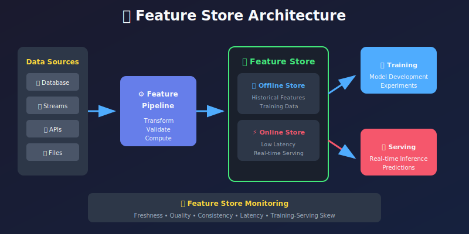
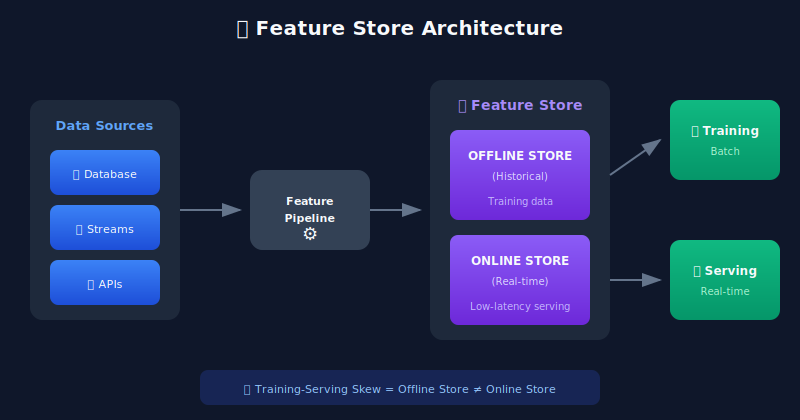
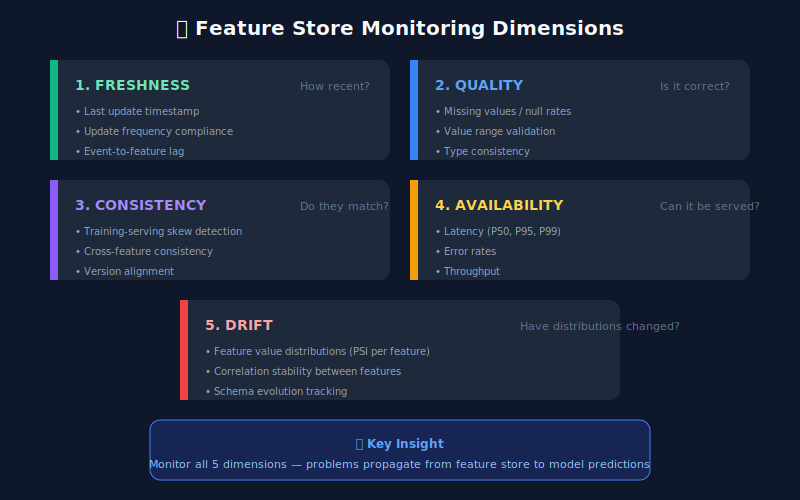

# 🗄️ Chapter 5: Feature Store Monitoring

> **"Features are the lifeblood of ML systems. Monitor them like you would a patient's vitals."**

<p align="center">
  
</p>

---

## 🎯 Learning Objectives

- Understand what feature stores are and why they need monitoring
- Learn to monitor feature freshness, quality, and consistency
- Implement feature validation pipelines
- Track feature lineage and dependencies

---

## What is a Feature Store?

A **feature store** is a centralized repository for storing, managing, and serving ML features. It bridges the gap between data engineering and ML.



---

## What to Monitor in Feature Stores



---

## Feature Freshness Monitoring

```python
from datetime import datetime, timedelta
from dataclasses import dataclass
from typing import Dict, Optional
import logging

@dataclass
class FeatureFreshnessConfig:
    """Configuration for feature freshness requirements."""
    feature_name: str
    max_age_seconds: int
    update_frequency_seconds: int
    criticality: str = "high"  # high, medium, low

@dataclass
class FreshnessStatus:
    feature_name: str
    last_updated: datetime
    age_seconds: float
    is_stale: bool
    expected_updates: int
    actual_updates: int
    freshness_score: float  # 0.0 to 1.0

class FeatureFreshnessMonitor:
    """Monitor feature freshness in the feature store."""

    def __init__(self, feature_store_client):
        self.feature_store = feature_store_client
        self.configs: Dict[str, FeatureFreshnessConfig] = {}
        self.logger = logging.getLogger(__name__)

    def register_feature(self, config: FeatureFreshnessConfig):
        """Register a feature for freshness monitoring."""
        self.configs[config.feature_name] = config

    def check_freshness(self, feature_name: str) -> FreshnessStatus:
        """Check freshness of a specific feature."""
        config = self.configs.get(feature_name)
        if not config:
            raise ValueError(f"Feature {feature_name} not registered")

        # Get feature metadata from store
        metadata = self.feature_store.get_feature_metadata(feature_name)
        last_updated = metadata['last_updated']

        now = datetime.utcnow()
        age_seconds = (now - last_updated).total_seconds()
        is_stale = age_seconds > config.max_age_seconds

        # Calculate expected vs actual updates in last hour
        updates_last_hour = self.feature_store.count_updates(
            feature_name,
            start_time=now - timedelta(hours=1)
        )
        expected_updates = 3600 / config.update_frequency_seconds

        # Freshness score: 1.0 = perfectly fresh, 0.0 = very stale
        freshness_score = max(0, 1 - (age_seconds / config.max_age_seconds))

        return FreshnessStatus(
            feature_name=feature_name,
            last_updated=last_updated,
            age_seconds=age_seconds,
            is_stale=is_stale,
            expected_updates=int(expected_updates),
            actual_updates=updates_last_hour,
            freshness_score=freshness_score
        )

    def check_all_features(self) -> Dict[str, FreshnessStatus]:
        """Check freshness of all registered features."""
        results = {}
        for feature_name in self.configs:
            try:
                results[feature_name] = self.check_freshness(feature_name)
            except Exception as e:
                self.logger.error(f"Error checking {feature_name}: {e}")
        return results

    def get_stale_features(self) -> list:
        """Get list of stale features."""
        all_status = self.check_all_features()
        return [
            status for status in all_status.values()
            if status.is_stale
        ]

```

---

## Feature Quality Validation

```python
from dataclasses import dataclass, field
from typing import Any, Callable, List, Optional
import numpy as np
import pandas as pd

@dataclass
class ValidationRule:
    """Single validation rule for a feature."""
    name: str
    validator: Callable[[Any], bool]
    error_message: str
    severity: str = "error"  # error, warning

@dataclass
class FeatureSchema:
    """Schema definition for a feature."""
    feature_name: str
    data_type: type
    nullable: bool = False
    min_value: Optional[float] = None
    max_value: Optional[float] = None
    allowed_values: Optional[list] = None
    regex_pattern: Optional[str] = None
    custom_rules: List[ValidationRule] = field(default_factory=list)

@dataclass
class ValidationResult:
    feature_name: str
    is_valid: bool
    errors: List[str]
    warnings: List[str]
    statistics: dict

class FeatureQualityValidator:
    """Validate feature quality against defined schemas."""

    def __init__(self):
        self.schemas: Dict[str, FeatureSchema] = {}

    def register_schema(self, schema: FeatureSchema):
        """Register a feature schema."""
        self.schemas[schema.feature_name] = schema

    def validate(self, feature_name: str, values: np.ndarray) -> ValidationResult:
        """Validate feature values against schema."""
        schema = self.schemas.get(feature_name)
        if not schema:
            raise ValueError(f"Schema not found for {feature_name}")

        errors = []
        warnings = []
        statistics = self._compute_statistics(values)

        # Check for nulls
        null_count = np.sum(pd.isna(values))
        null_rate = null_count / len(values) if len(values) > 0 else 0
        statistics['null_rate'] = null_rate

        if not schema.nullable and null_count > 0:
            errors.append(f"Found {null_count} null values ({null_rate:.1%})")

        # Filter non-null values for further checks
        valid_values = values[~pd.isna(values)]

        # Type check
        if not self._check_type(valid_values, schema.data_type):
            errors.append(f"Type mismatch: expected {schema.data_type}")

        # Range check for numerical features
        if schema.min_value is not None:
            below_min = np.sum(valid_values < schema.min_value)
            if below_min > 0:
                errors.append(f"{below_min} values below min ({schema.min_value})")

        if schema.max_value is not None:
            above_max = np.sum(valid_values > schema.max_value)
            if above_max > 0:
                errors.append(f"{above_max} values above max ({schema.max_value})")

        # Allowed values check for categorical features
        if schema.allowed_values is not None:
            invalid = [v for v in valid_values if v not in schema.allowed_values]
            if invalid:
                errors.append(f"Invalid values found: {set(invalid)}")

        # Custom rules
        for rule in schema.custom_rules:
            failed = [v for v in valid_values if not rule.validator(v)]
            if failed:
                msg = f"{rule.name}: {len(failed)} violations"
                if rule.severity == "error":
                    errors.append(msg)
                else:
                    warnings.append(msg)

        return ValidationResult(
            feature_name=feature_name,
            is_valid=len(errors) == 0,
            errors=errors,
            warnings=warnings,
            statistics=statistics
        )

    def _compute_statistics(self, values: np.ndarray) -> dict:
        """Compute basic statistics for feature values."""
        valid = values[~pd.isna(values)]

        if len(valid) == 0:
            return {'count': 0}

        stats = {
            'count': len(values),
            'valid_count': len(valid),
            'null_count': len(values) - len(valid)
        }

        if np.issubdtype(valid.dtype, np.number):
            stats.update({
                'mean': float(np.mean(valid)),
                'std': float(np.std(valid)),
                'min': float(np.min(valid)),
                'max': float(np.max(valid)),
                'median': float(np.median(valid))
            })
        else:
            stats.update({
                'unique_count': len(np.unique(valid)),
                'most_common': str(pd.Series(valid).mode().iloc[0]) if len(valid) > 0 else None
            })

        return stats

    def _check_type(self, values: np.ndarray, expected_type: type) -> bool:
        """Check if values match expected type."""
        if expected_type == float:
            return np.issubdtype(values.dtype, np.floating)
        elif expected_type == int:
            return np.issubdtype(values.dtype, np.integer)
        elif expected_type == str:
            return values.dtype == object
        return True

# Example usage
validator = FeatureQualityValidator()

# Register schema
validator.register_schema(FeatureSchema(
    feature_name='user_age',
    data_type=int,
    nullable=False,
    min_value=0,
    max_value=120,
    custom_rules=[
        ValidationRule(
            name='reasonable_age',
            validator=lambda x: 13 <= x <= 100,
            error_message='Age outside reasonable range',
            severity='warning'
        )
    ]
))

```

---

## Training-Serving Skew Detection

```python
class TrainingServingSkewDetector:
    """Detect skew between training and serving features."""

    def __init__(self, tolerance: float = 0.05):
        self.tolerance = tolerance
        self.training_stats = {}

    def set_training_baseline(self, feature_name: str, values: np.ndarray):
        """Set training distribution as baseline."""
        self.training_stats[feature_name] = {
            'mean': np.mean(values),
            'std': np.std(values),
            'min': np.min(values),
            'max': np.max(values),
            'histogram': np.histogram(values, bins=50, density=True)
        }

    def check_skew(self, feature_name: str,
                   serving_values: np.ndarray) -> dict:
        """Check for skew between training and serving."""
        if feature_name not in self.training_stats:
            return {'error': 'No baseline set'}

        training = self.training_stats[feature_name]

        serving_mean = np.mean(serving_values)
        serving_std = np.std(serving_values)

        # Calculate relative differences
        mean_diff = abs(serving_mean - training['mean']) / (training['mean'] + 1e-10)
        std_diff = abs(serving_std - training['std']) / (training['std'] + 1e-10)

        # PSI calculation
        training_hist = training['histogram'][0]
        serving_hist, _ = np.histogram(
            serving_values,
            bins=training['histogram'][1],
            density=True
        )

        # Add small value to avoid division by zero
        eps = 1e-10
        training_hist = training_hist + eps
        serving_hist = serving_hist + eps

        psi = np.sum((serving_hist - training_hist) * np.log(serving_hist / training_hist))

        skew_detected = (
            mean_diff > self.tolerance or
            std_diff > self.tolerance or
            psi > 0.2
        )

        return {
            'feature_name': feature_name,
            'skew_detected': skew_detected,
            'metrics': {
                'mean_difference': mean_diff,
                'std_difference': std_diff,
                'psi': psi,
                'training_mean': training['mean'],
                'serving_mean': serving_mean
            },
            'thresholds': {
                'relative_tolerance': self.tolerance,
                'psi_threshold': 0.2
            }
        }

```

---

## Feature Lineage Tracking

```python
from datetime import datetime
from typing import Set
import json

@dataclass
class FeatureNode:
    """Node in feature lineage graph."""
    feature_name: str
    source_type: str  # 'raw', 'derived', 'aggregated'
    dependencies: Set[str]
    transformation: str
    created_at: datetime
    version: str

class FeatureLineageTracker:
    """Track feature lineage and dependencies."""

    def __init__(self):
        self.features: Dict[str, FeatureNode] = {}

    def register_feature(self, node: FeatureNode):
        """Register a feature in the lineage graph."""
        self.features[node.feature_name] = node

    def get_upstream(self, feature_name: str) -> Set[str]:
        """Get all upstream dependencies (recursive)."""
        if feature_name not in self.features:
            return set()

        direct_deps = self.features[feature_name].dependencies
        all_deps = set(direct_deps)

        for dep in direct_deps:
            all_deps.update(self.get_upstream(dep))

        return all_deps

    def get_downstream(self, feature_name: str) -> Set[str]:
        """Get all features that depend on this one."""
        downstream = set()

        for name, node in self.features.items():
            if feature_name in node.dependencies:
                downstream.add(name)
                downstream.update(self.get_downstream(name))

        return downstream

    def impact_analysis(self, feature_name: str) -> dict:
        """Analyze impact of changes to a feature."""
        downstream = self.get_downstream(feature_name)

        return {
            'feature': feature_name,
            'directly_impacted': [
                name for name, node in self.features.items()
                if feature_name in node.dependencies
            ],
            'transitively_impacted': list(downstream),
            'total_impacted_count': len(downstream)
        }

# Example lineage
tracker = FeatureLineageTracker()

tracker.register_feature(FeatureNode(
    feature_name='raw_transactions',
    source_type='raw',
    dependencies=set(),
    transformation='ingestion from payment_db',
    created_at=datetime.utcnow(),
    version='1.0'
))

tracker.register_feature(FeatureNode(
    feature_name='daily_transaction_count',
    source_type='aggregated',
    dependencies={'raw_transactions'},
    transformation='COUNT(*) GROUP BY user_id, date',
    created_at=datetime.utcnow(),
    version='1.0'
))

tracker.register_feature(FeatureNode(
    feature_name='avg_transaction_amount_7d',
    source_type='derived',
    dependencies={'raw_transactions'},
    transformation='AVG(amount) OVER 7 days',
    created_at=datetime.utcnow(),
    version='1.0'
))

```

---

## 🔑 Key Takeaways

1. **Monitor freshness religiously** - Stale features cause silent failures
2. **Validate quality at ingestion** - Catch issues before they reach models
3. **Track training-serving skew** - It's a common source of model degradation
4. **Understand feature lineage** - Know what breaks when something changes
5. **Set up alerts for anomalies** - Automated detection is essential

---

**Next Chapter:** [06 - Logging and Observability →](../06_logging_and_observability/)

---

<div align="center">

**[⬆ Back to Top](#)** | **[📚 Main Repository](https://github.com/Gaurav14cs17/ml_system_design)**

Made with 💜 by [Gaurav14cs17](https://github.com/Gaurav14cs17)

</div>
