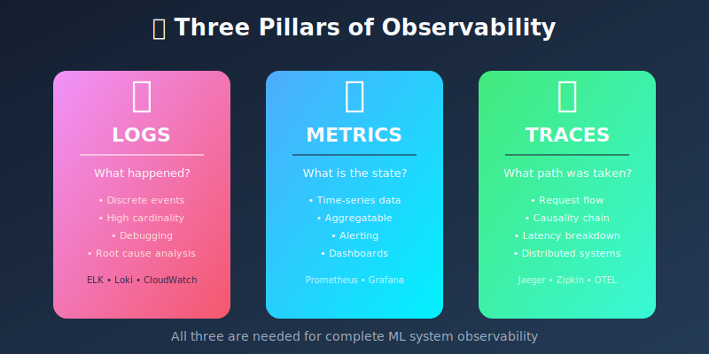
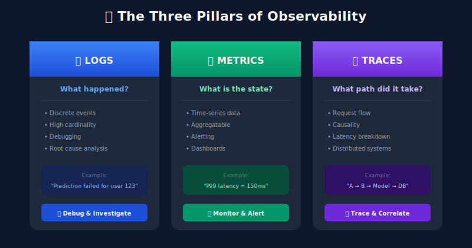
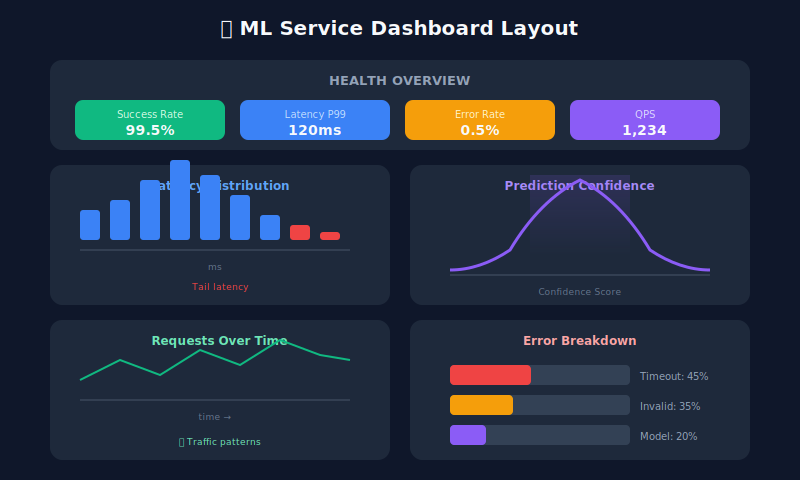

# 📝 Chapter 6: Logging and Observability

> **"In production, you can only see what you've instrumented."**

<p align="center">
  
</p>

---

## 🎯 Learning Objectives

- Understand observability pillars: logs, metrics, and traces
- Design effective logging strategies for ML systems
- Implement structured logging for predictions
- Build distributed tracing for ML pipelines
- Create actionable dashboards

---

## The Three Pillars of Observability



---

## Structured Logging for ML

```python
import json
import logging
from datetime import datetime
from typing import Any, Dict, Optional
import uuid
from dataclasses import dataclass, asdict

@dataclass
class MLLogRecord:
    """Structured log record for ML predictions."""
    timestamp: str
    request_id: str
    model_name: str
    model_version: str
    event_type: str
    level: str
    message: str

    # Optional fields
    features: Optional[Dict[str, Any]] = None
    prediction: Optional[Any] = None
    probability: Optional[float] = None
    latency_ms: Optional[float] = None
    error: Optional[str] = None
    metadata: Optional[Dict[str, Any]] = None

class MLLogger:
    """Structured logger for ML systems."""

    def __init__(self, model_name: str, model_version: str):
        self.model_name = model_name
        self.model_version = model_version
        self.logger = logging.getLogger(f"ml.{model_name}")

        # Set up JSON formatter
        handler = logging.StreamHandler()
        handler.setFormatter(JsonFormatter())
        self.logger.addHandler(handler)
        self.logger.setLevel(logging.INFO)

    def _create_record(self, event_type: str, level: str,
                       message: str, **kwargs) -> MLLogRecord:
        return MLLogRecord(
            timestamp=datetime.utcnow().isoformat(),
            request_id=kwargs.get('request_id', str(uuid.uuid4())),
            model_name=self.model_name,
            model_version=self.model_version,
            event_type=event_type,
            level=level,
            message=message,
            features=kwargs.get('features'),
            prediction=kwargs.get('prediction'),
            probability=kwargs.get('probability'),
            latency_ms=kwargs.get('latency_ms'),
            error=kwargs.get('error'),
            metadata=kwargs.get('metadata')
        )

    def log_prediction(self, request_id: str, features: dict,
                      prediction: Any, probability: float = None,
                      latency_ms: float = None, metadata: dict = None):
        """Log a successful prediction."""
        record = self._create_record(
            event_type='prediction',
            level='INFO',
            message='Prediction completed',
            request_id=request_id,
            features=features,
            prediction=prediction,
            probability=probability,
            latency_ms=latency_ms,
            metadata=metadata
        )
        self.logger.info(json.dumps(asdict(record)))

    def log_error(self, request_id: str, error: Exception,
                 features: dict = None, metadata: dict = None):
        """Log a prediction error."""
        record = self._create_record(
            event_type='error',
            level='ERROR',
            message=f'Prediction failed: {str(error)}',
            request_id=request_id,
            features=features,
            error=str(error),
            metadata=metadata
        )
        self.logger.error(json.dumps(asdict(record)))

    def log_feature_warning(self, request_id: str, feature_name: str,
                           issue: str, value: Any = None):
        """Log a feature quality warning."""
        record = self._create_record(
            event_type='feature_warning',
            level='WARNING',
            message=f'Feature issue: {feature_name} - {issue}',
            request_id=request_id,
            metadata={'feature_name': feature_name, 'issue': issue, 'value': value}
        )
        self.logger.warning(json.dumps(asdict(record)))

class JsonFormatter(logging.Formatter):
    """JSON formatter for structured logs."""

    def format(self, record: logging.LogRecord) -> str:
        return record.getMessage()
```

---

## Metrics Collection with Prometheus

```python
from prometheus_client import Counter, Histogram, Gauge, Info, start_http_server
from functools import wraps
import time

# Define metrics
PREDICTION_REQUESTS = Counter(
    'ml_prediction_requests_total',
    'Total prediction requests',
    ['model_name', 'model_version', 'status']
)

PREDICTION_LATENCY = Histogram(
    'ml_prediction_latency_seconds',
    'Prediction latency in seconds',
    ['model_name'],
    buckets=[0.01, 0.025, 0.05, 0.075, 0.1, 0.25, 0.5, 1.0, 2.5, 5.0]
)

PREDICTION_CONFIDENCE = Histogram(
    'ml_prediction_confidence',
    'Prediction confidence scores',
    ['model_name', 'prediction_class'],
    buckets=[0.1, 0.2, 0.3, 0.4, 0.5, 0.6, 0.7, 0.8, 0.9, 0.95, 0.99]
)

FEATURE_VALUE = Gauge(
    'ml_feature_value',
    'Feature values for monitoring',
    ['model_name', 'feature_name', 'statistic']
)

MODEL_INFO = Info(
    'ml_model',
    'Model information'
)

class PrometheusMLMetrics:
    """Prometheus metrics collector for ML."""

    def __init__(self, model_name: str, model_version: str):
        self.model_name = model_name
        self.model_version = model_version

        # Set model info
        MODEL_INFO.info({
            'name': model_name,
            'version': model_version
        })

    def record_prediction(self, status: str, latency: float,
                         prediction_class: str = None,
                         confidence: float = None):
        """Record a prediction."""
        PREDICTION_REQUESTS.labels(
            model_name=self.model_name,
            model_version=self.model_version,
            status=status
        ).inc()

        PREDICTION_LATENCY.labels(
            model_name=self.model_name
        ).observe(latency)

        if confidence is not None and prediction_class is not None:
            PREDICTION_CONFIDENCE.labels(
                model_name=self.model_name,
                prediction_class=str(prediction_class)
            ).observe(confidence)

    def update_feature_stats(self, feature_name: str,
                            mean: float, std: float,
                            min_val: float, max_val: float):
        """Update feature statistics gauges."""
        FEATURE_VALUE.labels(
            model_name=self.model_name,
            feature_name=feature_name,
            statistic='mean'
        ).set(mean)

        FEATURE_VALUE.labels(
            model_name=self.model_name,
            feature_name=feature_name,
            statistic='std'
        ).set(std)

def track_prediction(metrics: PrometheusMLMetrics):
    """Decorator to track predictions."""
    def decorator(func):
        @wraps(func)
        def wrapper(*args, **kwargs):
            start_time = time.time()
            try:
                result = func(*args, **kwargs)
                latency = time.time() - start_time
                metrics.record_prediction(
                    status='success',
                    latency=latency,
                    prediction_class=result.get('class'),
                    confidence=result.get('confidence')
                )
                return result
            except Exception as e:
                latency = time.time() - start_time
                metrics.record_prediction(status='error', latency=latency)
                raise
        return wrapper
    return decorator
```

---

## Distributed Tracing with OpenTelemetry

```python
from opentelemetry import trace
from opentelemetry.sdk.trace import TracerProvider
from opentelemetry.sdk.trace.export import BatchSpanProcessor
from opentelemetry.exporter.otlp.proto.grpc.trace_exporter import OTLPSpanExporter
from opentelemetry.instrumentation.requests import RequestsInstrumentor
from contextlib import contextmanager
import functools

# Initialize tracer
trace.set_tracer_provider(TracerProvider())
tracer = trace.get_tracer(__name__)

# Add OTLP exporter (e.g., to Jaeger)
# otlp_exporter = OTLPSpanExporter(endpoint="localhost:4317", insecure=True)
# trace.get_tracer_provider().add_span_processor(BatchSpanProcessor(otlp_exporter))

class MLTracer:
    """Distributed tracing for ML inference pipeline."""

    def __init__(self, service_name: str):
        self.service_name = service_name
        self.tracer = trace.get_tracer(service_name)

    @contextmanager
    def trace_prediction(self, request_id: str, model_name: str):
        """Trace entire prediction request."""
        with self.tracer.start_as_current_span(
            "prediction",
            attributes={
                "request.id": request_id,
                "model.name": model_name,
                "service.name": self.service_name
            }
        ) as span:
            try:
                yield span
            except Exception as e:
                span.set_status(trace.Status(trace.StatusCode.ERROR, str(e)))
                span.record_exception(e)
                raise

    @contextmanager
    def trace_feature_extraction(self, feature_count: int):
        """Trace feature extraction step."""
        with self.tracer.start_as_current_span(
            "feature_extraction",
            attributes={"feature.count": feature_count}
        ) as span:
            yield span

    @contextmanager
    def trace_model_inference(self, model_name: str, model_version: str):
        """Trace model inference step."""
        with self.tracer.start_as_current_span(
            "model_inference",
            attributes={
                "model.name": model_name,
                "model.version": model_version
            }
        ) as span:
            yield span

    @contextmanager
    def trace_postprocessing(self):
        """Trace postprocessing step."""
        with self.tracer.start_as_current_span("postprocessing") as span:
            yield span

# Usage example
ml_tracer = MLTracer("fraud-detection-service")

def predict_with_tracing(request_id: str, features: dict, model):
    with ml_tracer.trace_prediction(request_id, model.name) as span:

        # Feature extraction
        with ml_tracer.trace_feature_extraction(len(features)):
            processed_features = preprocess(features)

        # Model inference
        with ml_tracer.trace_model_inference(model.name, model.version):
            raw_prediction = model.predict(processed_features)

        # Postprocessing
        with ml_tracer.trace_postprocessing():
            result = postprocess(raw_prediction)

        span.set_attribute("prediction.class", result['class'])
        span.set_attribute("prediction.confidence", result['confidence'])

        return result
```

---

## Building Observable ML Services

```python
from dataclasses import dataclass
from typing import Any, Dict
import time
import uuid

@dataclass
class ObservabilityContext:
    """Context for request observability."""
    request_id: str
    start_time: float
    model_name: str
    model_version: str

    @classmethod
    def create(cls, model_name: str, model_version: str):
        return cls(
            request_id=str(uuid.uuid4()),
            start_time=time.time(),
            model_name=model_name,
            model_version=model_version
        )

    def elapsed_ms(self) -> float:
        return (time.time() - self.start_time) * 1000

class ObservableMLService:
    """ML service with full observability."""

    def __init__(self, model, model_name: str, model_version: str):
        self.model = model
        self.model_name = model_name
        self.model_version = model_version

        # Initialize observability components
        self.logger = MLLogger(model_name, model_version)
        self.metrics = PrometheusMLMetrics(model_name, model_version)
        self.tracer = MLTracer(f"{model_name}-service")

    def predict(self, features: Dict[str, Any]) -> Dict[str, Any]:
        """Make prediction with full observability."""
        ctx = ObservabilityContext.create(self.model_name, self.model_version)

        with self.tracer.trace_prediction(ctx.request_id, self.model_name):
            try:

                # Validate features
                self._validate_features(ctx, features)

                # Make prediction
                with self.tracer.trace_model_inference(
                    self.model_name, self.model_version
                ):
                    prediction = self.model.predict([features])[0]
                    probability = self.model.predict_proba([features])[0].max()

                latency_ms = ctx.elapsed_ms()

                # Log success
                self.logger.log_prediction(
                    request_id=ctx.request_id,
                    features=features,
                    prediction=prediction,
                    probability=probability,
                    latency_ms=latency_ms
                )

                # Record metrics
                self.metrics.record_prediction(
                    status='success',
                    latency=latency_ms / 1000,
                    prediction_class=str(prediction),
                    confidence=probability
                )

                return {
                    'request_id': ctx.request_id,
                    'prediction': prediction,
                    'probability': float(probability),
                    'latency_ms': latency_ms
                }

            except Exception as e:
                latency_ms = ctx.elapsed_ms()

                # Log error
                self.logger.log_error(
                    request_id=ctx.request_id,
                    error=e,
                    features=features
                )

                # Record error metric
                self.metrics.record_prediction(
                    status='error',
                    latency=latency_ms / 1000
                )

                raise

    def _validate_features(self, ctx: ObservabilityContext,
                          features: Dict[str, Any]):
        """Validate features and log warnings."""
        for name, value in features.items():
            if value is None:
                self.logger.log_feature_warning(
                    request_id=ctx.request_id,
                    feature_name=name,
                    issue='null_value',
                    value=value
                )
```

---

## Dashboard Design



### Grafana Dashboard JSON Template

```json
{
  "title": "ML Model Monitoring",
  "panels": [
    {
      "title": "Request Rate",
      "type": "stat",
      "targets": [{
        "expr": "sum(rate(ml_prediction_requests_total[5m]))"
      }]
    },
    {
      "title": "P99 Latency",
      "type": "stat",
      "targets": [{
        "expr": "histogram_quantile(0.99, rate(ml_prediction_latency_seconds_bucket[5m]))"
      }]
    },
    {
      "title": "Error Rate",
      "type": "stat",
      "targets": [{
        "expr": "sum(rate(ml_prediction_requests_total{status='error'}[5m])) / sum(rate(ml_prediction_requests_total[5m]))"
      }]
    },
    {
      "title": "Latency Distribution",
      "type": "heatmap",
      "targets": [{
        "expr": "sum(rate(ml_prediction_latency_seconds_bucket[5m])) by (le)"
      }]
    }
  ]
}
```

---

## 🔑 Key Takeaways

1. **Logs, metrics, and traces serve different purposes** - Use all three
2. **Structured logging is essential** - JSON logs are searchable and parseable
3. **Add request IDs everywhere** - Enables correlation across systems
4. **Instrument at service boundaries** - Know where time is spent
5. **Design dashboards for operators** - What do they need to know at 3 AM?

---

**Next Chapter:** [07 - Alerting Systems →](../07_alerting_systems/)

---

<div align="center">

**[⬆ Back to Top](#)** | **[📚 Main Repository](https://github.com/Gaurav14cs17/ml_system_design)**

Made with 💜 by [Gaurav14cs17](https://github.com/Gaurav14cs17)

</div>
