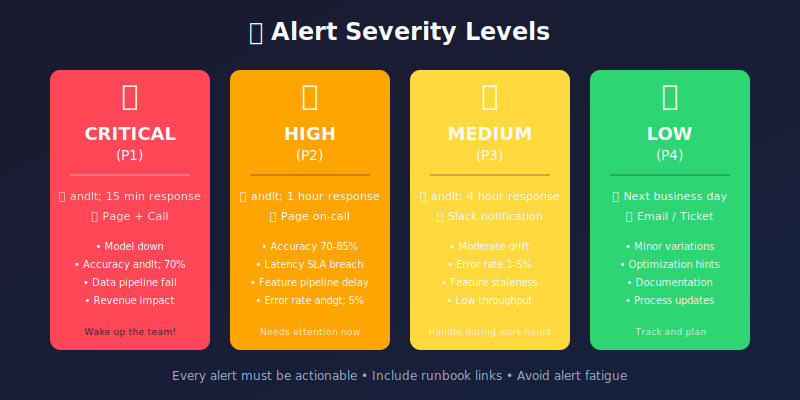
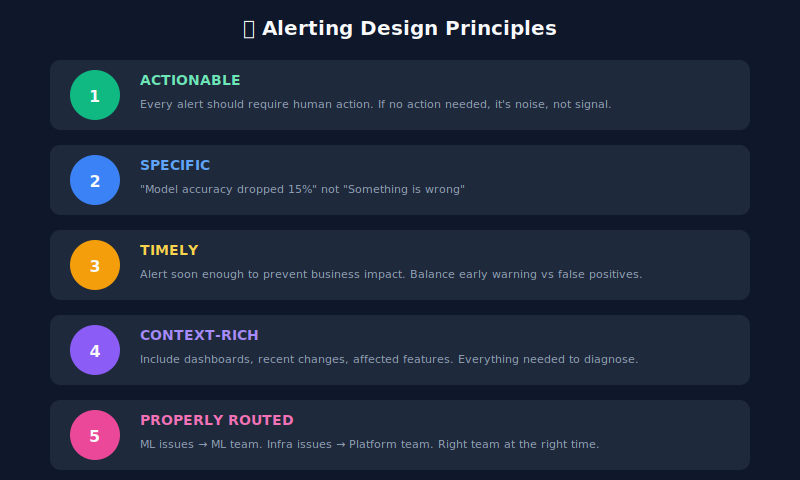
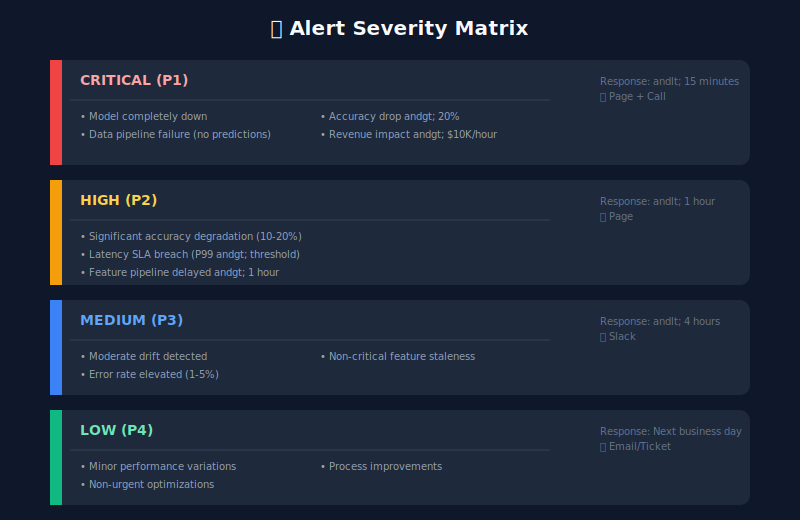

# 🚨 Chapter 7: Alerting Systems

> **"The best alert is one that tells you what's wrong, why it matters, and what to do about it."**

<p align="center">
  
</p>

---

## 🎯 Learning Objectives

- Design effective alerting strategies for ML systems
- Implement multi-level alerting with proper severity
- Reduce alert fatigue while maintaining coverage
- Create runbooks for common ML issues
- Set up on-call rotations for ML teams

---

## Alert Design Principles



---

## Alert Severity Levels



---

## Implementing an Alerting System

```python
from dataclasses import dataclass, field
from datetime import datetime, timedelta
from enum import Enum
from typing import List, Dict, Optional, Callable
import json

class AlertSeverity(Enum):
    CRITICAL = "critical"
    HIGH = "high"
    MEDIUM = "medium"
    LOW = "low"

class AlertState(Enum):
    FIRING = "firing"
    RESOLVED = "resolved"
    ACKNOWLEDGED = "acknowledged"

@dataclass
class AlertRule:
    """Define an alert rule."""
    name: str
    severity: AlertSeverity
    condition: Callable[[Dict], bool]
    message_template: str
    description: str
    runbook_url: Optional[str] = None
    cooldown_minutes: int = 15
    labels: Dict[str, str] = field(default_factory=dict)

@dataclass
class Alert:
    """An active alert instance."""
    rule_name: str
    severity: AlertSeverity
    state: AlertState
    message: str
    timestamp: datetime
    labels: Dict[str, str]
    annotations: Dict[str, str]
    resolved_at: Optional[datetime] = None

class MLAlertManager:
    """Alert manager for ML systems."""

    def __init__(self, notification_channels: List['NotificationChannel']):
        self.rules: Dict[str, AlertRule] = {}
        self.active_alerts: Dict[str, Alert] = {}
        self.alert_history: List[Alert] = []
        self.channels = notification_channels
        self.last_fired: Dict[str, datetime] = {}

    def register_rule(self, rule: AlertRule):
        """Register an alert rule."""
        self.rules[rule.name] = rule

    def evaluate(self, metrics: Dict[str, float]) -> List[Alert]:
        """Evaluate all rules against current metrics."""
        new_alerts = []

        for rule_name, rule in self.rules.items():
            try:
                should_fire = rule.condition(metrics)

                if should_fire:
                    alert = self._handle_firing(rule, metrics)
                    if alert:
                        new_alerts.append(alert)
                else:
                    self._handle_resolved(rule_name)

            except Exception as e:
                print(f"Error evaluating rule {rule_name}: {e}")

        return new_alerts

    def _handle_firing(self, rule: AlertRule, metrics: Dict) -> Optional[Alert]:
        """Handle a firing condition."""

        # Check cooldown
        last_fire = self.last_fired.get(rule.name)
        if last_fire:
            cooldown = timedelta(minutes=rule.cooldown_minutes)
            if datetime.utcnow() - last_fire < cooldown:
                return None  # Still in cooldown

        # Check if already firing
        if rule.name in self.active_alerts:
            return None  # Already alerting

        # Create new alert
        alert = Alert(
            rule_name=rule.name,
            severity=rule.severity,
            state=AlertState.FIRING,
            message=rule.message_template.format(**metrics),
            timestamp=datetime.utcnow(),
            labels=rule.labels,
            annotations={
                'description': rule.description,
                'runbook_url': rule.runbook_url or '',
                'metrics': json.dumps(metrics)
            }
        )

        self.active_alerts[rule.name] = alert
        self.last_fired[rule.name] = datetime.utcnow()

        # Send notifications
        self._notify(alert)

        return alert

    def _handle_resolved(self, rule_name: str):
        """Handle alert resolution."""
        if rule_name in self.active_alerts:
            alert = self.active_alerts[rule_name]
            alert.state = AlertState.RESOLVED
            alert.resolved_at = datetime.utcnow()

            self.alert_history.append(alert)
            del self.active_alerts[rule_name]

            # Send resolution notification
            self._notify_resolved(alert)

    def _notify(self, alert: Alert):
        """Send alert notifications."""
        for channel in self.channels:
            if channel.should_notify(alert.severity):
                channel.send(alert)

    def _notify_resolved(self, alert: Alert):
        """Send resolution notifications."""
        for channel in self.channels:
            if channel.should_notify(alert.severity):
                channel.send_resolved(alert)

    def acknowledge(self, rule_name: str, by: str):
        """Acknowledge an active alert."""
        if rule_name in self.active_alerts:
            self.active_alerts[rule_name].state = AlertState.ACKNOWLEDGED
            self.active_alerts[rule_name].annotations['acknowledged_by'] = by
            self.active_alerts[rule_name].annotations['acknowledged_at'] = datetime.utcnow().isoformat()
```

---

## Notification Channels

```python
from abc import ABC, abstractmethod
import requests
import json

class NotificationChannel(ABC):
    """Base class for notification channels."""

    @abstractmethod
    def should_notify(self, severity: AlertSeverity) -> bool:
        pass

    @abstractmethod
    def send(self, alert: Alert):
        pass

    @abstractmethod
    def send_resolved(self, alert: Alert):
        pass

class SlackChannel(NotificationChannel):
    """Slack notification channel."""

    def __init__(self, webhook_url: str, min_severity: AlertSeverity = AlertSeverity.MEDIUM):
        self.webhook_url = webhook_url
        self.min_severity = min_severity
        self.severity_order = [AlertSeverity.LOW, AlertSeverity.MEDIUM,
                               AlertSeverity.HIGH, AlertSeverity.CRITICAL]

    def should_notify(self, severity: AlertSeverity) -> bool:
        return self.severity_order.index(severity) >= self.severity_order.index(self.min_severity)

    def send(self, alert: Alert):
        """Send alert to Slack."""
        color = self._get_color(alert.severity)

        payload = {
            "attachments": [{
                "color": color,
                "title": f"🚨 {alert.severity.value.upper()}: {alert.rule_name}",
                "text": alert.message,
                "fields": [
                    {"title": "Severity", "value": alert.severity.value, "short": True},
                    {"title": "Time", "value": alert.timestamp.isoformat(), "short": True}
                ],
                "actions": [
                    {
                        "type": "button",
                        "text": "View Runbook",
                        "url": alert.annotations.get('runbook_url', '#')
                    }
                ]
            }]
        }

        requests.post(self.webhook_url, json=payload)

    def send_resolved(self, alert: Alert):
        """Send resolution notification."""
        duration = (alert.resolved_at - alert.timestamp).total_seconds() / 60

        payload = {
            "attachments": [{
                "color": "good",
                "title": f"✅ RESOLVED: {alert.rule_name}",
                "text": f"Alert resolved after {duration:.1f} minutes"
            }]
        }

        requests.post(self.webhook_url, json=payload)

    def _get_color(self, severity: AlertSeverity) -> str:
        colors = {
            AlertSeverity.CRITICAL: "#FF0000",
            AlertSeverity.HIGH: "#FFA500",
            AlertSeverity.MEDIUM: "#FFFF00",
            AlertSeverity.LOW: "#00FF00"
        }
        return colors.get(severity, "#808080")

class PagerDutyChannel(NotificationChannel):
    """PagerDuty notification for critical alerts."""

    def __init__(self, routing_key: str):
        self.routing_key = routing_key
        self.api_url = "https://events.pagerduty.com/v2/enqueue"

    def should_notify(self, severity: AlertSeverity) -> bool:
        return severity in [AlertSeverity.CRITICAL, AlertSeverity.HIGH]

    def send(self, alert: Alert):
        """Trigger PagerDuty incident."""
        payload = {
            "routing_key": self.routing_key,
            "event_action": "trigger",
            "dedup_key": alert.rule_name,
            "payload": {
                "summary": f"{alert.rule_name}: {alert.message}",
                "severity": "critical" if alert.severity == AlertSeverity.CRITICAL else "error",
                "source": "ml-monitoring",
                "custom_details": alert.annotations
            }
        }

        requests.post(self.api_url, json=payload)

    def send_resolved(self, alert: Alert):
        """Resolve PagerDuty incident."""
        payload = {
            "routing_key": self.routing_key,
            "event_action": "resolve",
            "dedup_key": alert.rule_name
        }

        requests.post(self.api_url, json=payload)
```

---

## ML-Specific Alert Rules

```python
def create_ml_alert_rules() -> List[AlertRule]:
    """Create standard ML monitoring alert rules."""

    return [

        # Model Performance Alerts
        AlertRule(
            name="model_accuracy_critical",
            severity=AlertSeverity.CRITICAL,
            condition=lambda m: m.get('accuracy', 1.0) < 0.70,
            message_template="Model accuracy dropped to {accuracy:.1%} (threshold: 70%)",
            description="Model accuracy has fallen below critical threshold",
            runbook_url="https://wiki/runbooks/ml-accuracy-critical",
            cooldown_minutes=30
        ),

        AlertRule(
            name="model_accuracy_warning",
            severity=AlertSeverity.HIGH,
            condition=lambda m: 0.70 <= m.get('accuracy', 1.0) < 0.85,
            message_template="Model accuracy degraded to {accuracy:.1%} (threshold: 85%)",
            description="Model accuracy is below expected levels",
            runbook_url="https://wiki/runbooks/ml-accuracy-warning"
        ),

        # Latency Alerts
        AlertRule(
            name="latency_sla_breach",
            severity=AlertSeverity.HIGH,
            condition=lambda m: m.get('latency_p99_ms', 0) > 200,
            message_template="P99 latency is {latency_p99_ms:.0f}ms (SLA: 200ms)",
            description="Prediction latency exceeds SLA",
            runbook_url="https://wiki/runbooks/ml-latency"
        ),

        # Data Drift Alerts
        AlertRule(
            name="data_drift_detected",
            severity=AlertSeverity.MEDIUM,
            condition=lambda m: m.get('max_psi', 0) > 0.2,
            message_template="Data drift detected: PSI={max_psi:.3f} for feature {drifted_feature}",
            description="Significant data drift detected in production",
            runbook_url="https://wiki/runbooks/data-drift"
        ),

        # Feature Pipeline Alerts
        AlertRule(
            name="feature_staleness",
            severity=AlertSeverity.HIGH,
            condition=lambda m: m.get('feature_age_hours', 0) > 24,
            message_template="Features are {feature_age_hours:.1f} hours old",
            description="Feature pipeline may be failing",
            runbook_url="https://wiki/runbooks/feature-staleness"
        ),

        # Error Rate Alerts
        AlertRule(
            name="error_rate_high",
            severity=AlertSeverity.CRITICAL,
            condition=lambda m: m.get('error_rate', 0) > 0.05,
            message_template="Error rate is {error_rate:.1%}",
            description="Prediction error rate is critically high",
            runbook_url="https://wiki/runbooks/ml-errors"
        ),

        # Throughput Alerts
        AlertRule(
            name="low_throughput",
            severity=AlertSeverity.MEDIUM,
            condition=lambda m: m.get('qps', float('inf')) < 10,
            message_template="Throughput dropped to {qps:.1f} QPS",
            description="Prediction throughput is unusually low",
            runbook_url="https://wiki/runbooks/ml-throughput"
        )
    ]
```

---

## Reducing Alert Fatigue

```python
class AlertDeduplicator:
    """Reduce alert fatigue through intelligent deduplication."""

    def __init__(self,
                 group_window_minutes: int = 5,
                 max_alerts_per_group: int = 3):
        self.group_window = timedelta(minutes=group_window_minutes)
        self.max_per_group = max_alerts_per_group
        self.alert_groups: Dict[str, List[Alert]] = {}

    def should_send(self, alert: Alert) -> bool:
        """Determine if alert should be sent or grouped."""
        group_key = self._get_group_key(alert)
        now = datetime.utcnow()

        # Clean old alerts
        if group_key in self.alert_groups:
            self.alert_groups[group_key] = [
                a for a in self.alert_groups[group_key]
                if now - a.timestamp < self.group_window
            ]
        else:
            self.alert_groups[group_key] = []

        # Check if we should suppress
        recent_count = len(self.alert_groups[group_key])

        if recent_count >= self.max_per_group:
            return False  # Suppress

        self.alert_groups[group_key].append(alert)
        return True

    def _get_group_key(self, alert: Alert) -> str:
        """Generate grouping key for alert."""
        return f"{alert.severity.value}:{alert.rule_name}"

class AlertAggregator:
    """Aggregate multiple alerts into summary."""

    def __init__(self, window_minutes: int = 10):
        self.window = timedelta(minutes=window_minutes)
        self.pending_alerts: List[Alert] = []
        self.last_summary_sent: Optional[datetime] = None

    def add(self, alert: Alert):
        """Add alert for aggregation."""
        self.pending_alerts.append(alert)

    def should_send_summary(self) -> bool:
        """Check if we should send a summary."""
        if not self.pending_alerts:
            return False

        # Send if we have critical alerts
        if any(a.severity == AlertSeverity.CRITICAL for a in self.pending_alerts):
            return True

        # Send if window has passed
        if self.last_summary_sent:
            if datetime.utcnow() - self.last_summary_sent > self.window:
                return True
        else:
            oldest = min(a.timestamp for a in self.pending_alerts)
            if datetime.utcnow() - oldest > self.window:
                return True

        return False

    def get_summary(self) -> dict:
        """Get summary of pending alerts."""
        summary = {
            'total_count': len(self.pending_alerts),
            'by_severity': {},
            'by_rule': {},
            'alerts': self.pending_alerts
        }

        for alert in self.pending_alerts:
            sev = alert.severity.value
            summary['by_severity'][sev] = summary['by_severity'].get(sev, 0) + 1

            rule = alert.rule_name
            summary['by_rule'][rule] = summary['by_rule'].get(rule, 0) + 1

        self.pending_alerts = []
        self.last_summary_sent = datetime.utcnow()

        return summary
```

---

## Runbook Template

```markdown

# Runbook: Model Accuracy Critical

## Alert Details
- **Alert Name**: model_accuracy_critical
- **Severity**: Critical (P1)
- **Response Time**: 15 minutes

## Description
Model accuracy has dropped below 70%, indicating severe degradation.

## Impact
- Customer-facing predictions are unreliable
- Potential revenue loss
- User experience degradation

## Investigation Steps

1. **Check recent changes**
   - Any model deployments in last 24h?
   - Any feature pipeline changes?
   - Any upstream data source changes?

2. **Verify data quality**
   ```bash

   # Check feature freshness
   curl -s http://feature-store/api/v1/freshness | jq .

   # Check data drift scores
   curl -s http://monitoring/api/v1/drift | jq .
   ```

3. **Check model serving health**
   ```bash
   kubectl get pods -n ml-serving
   kubectl logs -n ml-serving deployment/model-server --tail=100
   ```

4. **Review recent predictions**
   - Check prediction distribution
   - Compare to baseline

## Resolution Steps

### If data quality issue:
1. Identify problematic features
2. Trigger feature pipeline refresh
3. Monitor accuracy recovery

### If model issue:
1. Rollback to previous model version
2. Investigate root cause
3. Plan retraining if needed

## Escalation
- 15 min: Page ML on-call
- 30 min: Escalate to ML lead
- 1 hour: Incident commander

## Related Dashboards
- [Model Performance](http://grafana/d/model-perf)
- [Data Quality](http://grafana/d/data-quality)
```

---

## 🔑 Key Takeaways

1. **Every alert must be actionable** - If no action needed, don't alert
2. **Severity matters** - Route correctly to avoid fatigue
3. **Context is king** - Include everything needed to diagnose
4. **Runbooks are essential** - Document the "what to do"
5. **Deduplicate and aggregate** - Reduce noise, increase signal

---

**Next Chapter:** [08 - A/B Testing & Experimentation →](../08_ab_testing_experimentation/)

---

<div align="center">

**[⬆ Back to Top](#)** | **[📚 Main Repository](https://github.com/Gaurav14cs17/ml_system_design)**

Made with 💜 by [Gaurav14cs17](https://github.com/Gaurav14cs17)

</div>
