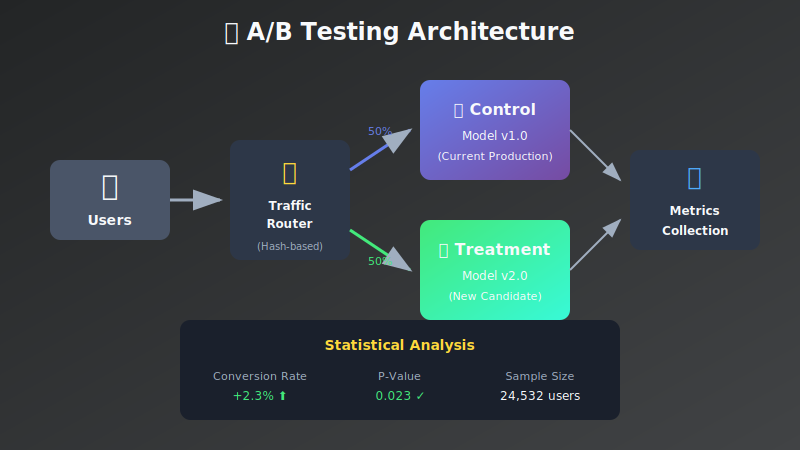
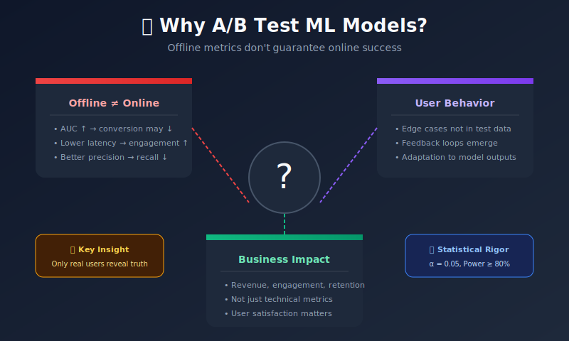
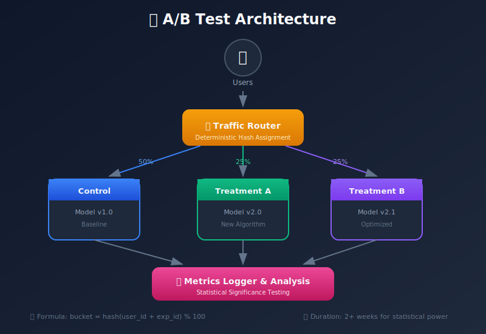
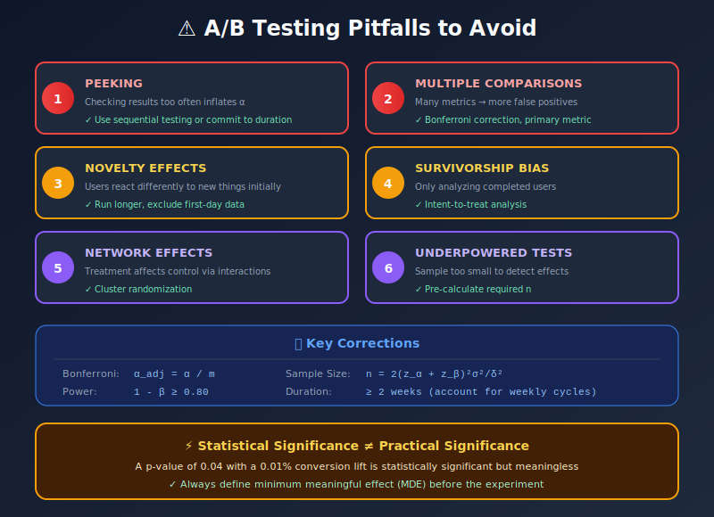

# 🧪 Chapter 8: A/B Testing & Experimentation

> **"In God we trust. All others must bring data."** — W. Edwards Deming

<p align="center">
  
</p>

---

## 🎯 Learning Objectives

- Understand the statistical foundations of A/B testing
- Design experiments with proper sample size and power
- Calculate statistical significance correctly
- Avoid common pitfalls in ML experimentation
- Implement sequential testing for early stopping

---

## 📖 Table of Contents

1. [Why A/B Test ML Models?](#why-ab-test-ml-models)
2. [Statistical Foundations](#statistical-foundations)
3. [Sample Size Calculation](#sample-size-calculation)
4. [Sequential Testing](#sequential-testing)
5. [Implementation Guide](#implementation-guide)
6. [Common Pitfalls](#common-pitfalls)

---

## Why A/B Test ML Models?



**Offline metrics don't guarantee online success.** A model with better validation accuracy might perform worse in production due to:

- Distribution differences between training and production
- Latency constraints affecting user experience
- Interaction effects with other system components
- User behavior changes in response to model outputs

---

## Statistical Foundations

### The Hypothesis Testing Framework

In A/B testing, we compare a **control** (existing model) against a **treatment** (new model):

```math
H_0: \mu_T = \mu_C \quad \text{(no difference)}
H_1: \mu_T \neq \mu_C \quad \text{(there is a difference)}
```

Where \( \mu_T \) and \( \mu_C \) are the true mean outcomes for treatment and control.

### Key Statistical Concepts

#### Type I Error (False Positive)

Rejecting \( H_0 \) when it's actually true:

```math
\alpha = P(\text{reject } H_0 | H_0 \text{ is true})
```

Typically set to \( \alpha = 0.05 \) (5% significance level).

#### Type II Error (False Negative)

Failing to reject \( H_0 \) when \( H_1 \) is true:

```math
\beta = P(\text{fail to reject } H_0 | H_1 \text{ is true})
```

#### Statistical Power

The probability of correctly detecting a true effect:

```math
\text{Power} = 1 - \beta = P(\text{reject } H_0 | H_1 \text{ is true})
```

Typically target **80% power** (β = 0.20).

### Decision Matrix

|                    | \( H_0 \) True | \( H_1 \) True |
|--------------------|----------------|----------------|
| **Reject \( H_0 \)** | Type I Error (α) | Correct (1-β) |
| **Fail to Reject** | Correct (1-α) | Type II Error (β) |

---

## The Two-Sample t-Test

### Test Statistic

For comparing means of two independent samples:

```math
t = \frac{\bar{X}_T - \bar{X}_C}{\sqrt{\frac{s_T^2}{n_T} + \frac{s_C^2}{n_C}}}
```

Where:
- \( \bar{X}_T, \bar{X}_C \) = sample means
- \( s_T^2, s_C^2 \) = sample variances
- \( n_T, n_C \) = sample sizes

### Welch's Approximation for Degrees of Freedom

```math
df = \frac{\left(\frac{s_T^2}{n_T} + \frac{s_C^2}{n_C}\right)^2}{\frac{(s_T^2/n_T)^2}{n_T-1} + \frac{(s_C^2/n_C)^2}{n_C-1}}
```

### Confidence Interval for Difference

The \( (1-\alpha) \) confidence interval for \( \mu_T - \mu_C \):

```math
(\bar{X}_T - \bar{X}_C) \pm t_{\alpha/2, df} \cdot \sqrt{\frac{s_T^2}{n_T} + \frac{s_C^2}{n_C}}
```

---

## Sample Size Calculation

### The Power Equation

Required sample size per group for a two-sided test:

```math
n = 2 \cdot \left(\frac{z_{\alpha/2} + z_{\beta}}{\delta}\right)^2 \cdot \sigma^2
```

Where:
- \( z_{\alpha/2} \) = z-score for significance level (1.96 for α=0.05)
- \( z_{\beta} \) = z-score for power (0.84 for 80% power)
- \( \delta \) = minimum detectable effect (MDE)
- \( \sigma^2 \) = variance of the metric

### Effect Size (Cohen's d)

Standardized measure of effect magnitude:

```math
d = \frac{\mu_T - \mu_C}{\sigma_{pooled}}
```

Where \( \sigma_{pooled} = \sqrt{\frac{(n_T-1)s_T^2 + (n_C-1)s_C^2}{n_T + n_C - 2}} \)

| Effect Size | Interpretation |
|-------------|----------------|
| \( d = 0.2 \) | Small |
| \( d = 0.5 \) | Medium |
| \( d = 0.8 \) | Large |

### Sample Size Formula (Simplified)

For equal groups with 80% power and α = 0.05:

```math
n \approx \frac{16}{\delta^2}
```

Where \( \delta \) is the effect size in standard deviation units.

### Practical Example

**Scenario:** Detect a 2% improvement in conversion rate (baseline: 5%, target: 5.1%)

- Baseline conversion: \( p_C = 0.05 \)
- Expected effect: \( p_T - p_C = 0.001 \)
- Variance: \( \sigma^2 = p(1-p) = 0.05 \times 0.95 = 0.0475 \)

```math
n = 2 \cdot \frac{(1.96 + 0.84)^2 \cdot 0.0475}{0.001^2} \approx 746,000 \text{ per group}
```

---

## Sequential Testing

### The Peeking Problem

Repeatedly checking results inflates Type I error:

| Number of Looks | Actual α (nominal 0.05) |
|-----------------|------------------------|
| 1 | 0.050 |
| 2 | 0.083 |
| 5 | 0.142 |
| 10 | 0.193 |
| 20 | 0.250 |

### Spending Functions

**Alpha spending functions** control error rate across interim analyses.

#### O'Brien-Fleming Spending Function

```math
\alpha^*(t) = 2 - 2\Phi\left(\frac{z_{\alpha/2}}{\sqrt{t}}\right)
```

Where \( t \) is the information fraction (proportion of max sample size).

| Information Fraction | Boundary z-score | Cumulative α |
|---------------------|------------------|--------------|
| 0.25 | 4.05 | 0.00005 |
| 0.50 | 2.86 | 0.004 |
| 0.75 | 2.34 | 0.019 |
| 1.00 | 2.01 | 0.050 |

#### Pocock Spending Function

Uses constant boundaries:

```math
\alpha^*(t) = \alpha \cdot \ln(1 + (e-1) \cdot t)
```

### When to Stop Early

Stop the experiment if:

```math
|Z_k| > c_k \quad \text{at interim analysis } k
```

Where \( c_k \) is the critical value from the spending function.

---

## Experiment Design

### Traffic Allocation



#### Deterministic Assignment

Users must see consistent variants. Use hashing:

```math
\text{bucket} = \text{hash}(\text{user\_id} + \text{experiment\_id}) \mod 100
```

### Minimum Detectable Effect (MDE)

The smallest effect your experiment can reliably detect:

```math
MDE = (z_{\alpha/2} + z_{\beta}) \cdot \sqrt{\frac{2\sigma^2}{n}}
```

### Experiment Duration

Account for:
- **Day-of-week effects**: Run at least 1-2 full weeks
- **Novelty effects**: New features may show initial bump
- **Seasonality**: Consider business cycles

---

## Multiple Testing Correction

When running multiple tests (e.g., many metrics), control the **Family-Wise Error Rate (FWER)**:

### Bonferroni Correction

```math
\alpha_{adjusted} = \frac{\alpha}{m}
```

Where \( m \) is the number of tests. Conservative but simple.

### Benjamini-Hochberg (FDR Control)

1. Order p-values: \( p_{(1)} \leq p_{(2)} \leq ... \leq p_{(m)} \)
2. Find largest \( k \) where \( p_{(k)} \leq \frac{k}{m} \cdot \alpha \)
3. Reject all \( H_{(1)}, ..., H_{(k)} \)

Less conservative, controls **False Discovery Rate**.

---

## Bayesian A/B Testing

### Alternative Framework

Instead of p-values, compute the **probability that treatment is better**:

```math
P(\mu_T > \mu_C | \text{data})
```

### Beta-Binomial Model (for conversions)

Prior: \( \theta \sim \text{Beta}(\alpha_0, \beta_0) \)

Posterior after observing \( k \) successes in \( n \) trials:

```math
\theta | k, n \sim \text{Beta}(\alpha_0 + k, \beta_0 + n - k)
```

Probability treatment beats control:

```math
P(\theta_T > \theta_C) = \int_0^1 P(\theta_T > \theta_C | \theta_C) \cdot f(\theta_C) d\theta_C
```

---

## Implementation Guide

### Experiment Configuration

```python
@dataclass
class Experiment:
    name: str
    variants: List[Variant]
    primary_metric: str
    min_sample_size: int      # From power calculation
    target_significance: float # α, typically 0.05
    target_power: float        # 1-β, typically 0.80
```

### Statistical Analysis

```python
from scipy import stats
import numpy as np

def analyze_experiment(control: np.ndarray, treatment: np.ndarray,
                       alpha: float = 0.05) -> dict:
    """
    Perform two-sample t-test for experiment analysis.
    
    Returns effect size, confidence interval, and significance.
    """
    # Basic statistics
    n_c, n_t = len(control), len(treatment)
    mean_c, mean_t = control.mean(), treatment.mean()
    std_c, std_t = control.std(ddof=1), treatment.std(ddof=1)
    
    # Effect size (Cohen's d)
    pooled_std = np.sqrt(((n_c-1)*std_c**2 + (n_t-1)*std_t**2) / (n_c+n_t-2))
    cohens_d = (mean_t - mean_c) / pooled_std
    
    # Two-sample t-test
    t_stat, p_value = stats.ttest_ind(treatment, control)
    
    # Confidence interval
    se = np.sqrt(std_c**2/n_c + std_t**2/n_t)
    ci = (mean_t - mean_c - 1.96*se, mean_t - mean_c + 1.96*se)
    
    return {
        'effect_size': cohens_d,
        'p_value': p_value,
        'significant': p_value < alpha,
        'confidence_interval': ci,
        'relative_effect': (mean_t - mean_c) / mean_c
    }
```

---

## Common Pitfalls



### 1. Peeking at Results

❌ **Problem:** Checking p-values daily inflates false positive rate

✅ **Solution:** Use sequential testing with spending functions

### 2. Stopping Too Early

❌ **Problem:** Stopping when p < 0.05 first observed

✅ **Solution:** Commit to pre-calculated sample size

### 3. Multiple Metrics Without Correction

❌ **Problem:** Testing 20 metrics, finding 1 "significant"

✅ **Solution:** Apply Bonferroni or BH correction

### 4. Ignoring Practical Significance

❌ **Problem:** Statistically significant but tiny effect

✅ **Solution:** Define minimum meaningful effect upfront

### 5. Simpson's Paradox

❌ **Problem:** Overall effect differs from segment effects

✅ **Solution:** Analyze key segments separately

---

## 🔑 Key Takeaways

1. **Statistical rigor is non-negotiable** — Understand the math behind decisions
2. **Pre-register your experiment** — Define metrics, sample size, duration upfront
3. **Don't peek** — Or use sequential testing if you must
4. **Effect size matters** — Statistical significance ≠ practical importance
5. **Correct for multiple testing** — When examining many metrics
6. **Document everything** — Learnings compound over time

---

## 📐 Formula Reference

| Concept | Formula |
|---------|---------|
| **t-statistic** | \( t = \frac{\bar{X}_T - \bar{X}_C}{\sqrt{s_T^2/n_T + s_C^2/n_C}} \) |
| **Sample size** | \( n = 2(z_{\alpha/2} + z_\beta)^2 \sigma^2 / \delta^2 \) |
| **Cohen's d** | \( d = (\mu_T - \mu_C) / \sigma_{pooled} \) |
| **Confidence interval** | \( \bar{X}_T - \bar{X}_C \pm t_{\alpha/2} \cdot SE \) |
| **Power** | \( 1 - \beta = P(\text{reject } H_0 | H_1 \text{ true}) \) |

---

**Next Chapter:** [09 - Infrastructure Monitoring →](../09_infrastructure_monitoring/)

---

<div align="center">

**[⬆ Back to Top](#)** | **[📚 Main Repository](https://github.com/Gaurav14cs17/ml_system_design)**

Made with 💜 by [Gaurav14cs17](https://github.com/Gaurav14cs17)

</div>
