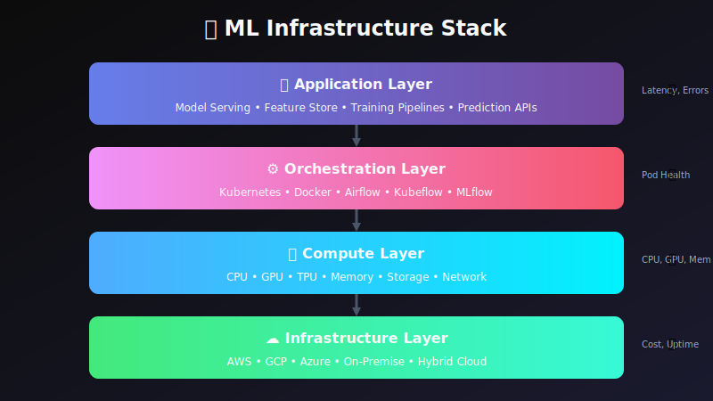
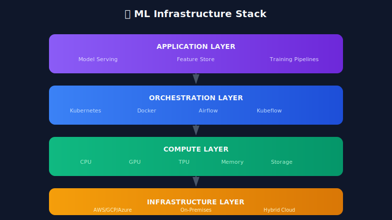

# 🖥️ Chapter 9: Infrastructure Monitoring

> **"The best ML model is useless if the infrastructure can't serve it."**

<p align="center">
  
</p>

---

## 🎯 Learning Objectives

- Monitor compute, memory, and GPU resources for ML workloads
- Set up Kubernetes monitoring for ML services
- Track model serving infrastructure health
- Optimize resource utilization

---

## ML Infrastructure Stack



---

## Key Metrics to Monitor

### Compute Metrics

```python
from prometheus_client import Gauge, Histogram
import psutil
import GPUtil

# CPU Metrics
CPU_USAGE = Gauge('ml_cpu_usage_percent', 'CPU usage percentage', ['core'])
CPU_LOAD = Gauge('ml_cpu_load_average', 'CPU load average', ['period'])

# Memory Metrics
MEMORY_USAGE = Gauge('ml_memory_usage_bytes', 'Memory usage in bytes', ['type'])
MEMORY_PERCENT = Gauge('ml_memory_usage_percent', 'Memory usage percentage')

# GPU Metrics
GPU_UTILIZATION = Gauge('ml_gpu_utilization_percent', 'GPU utilization', ['gpu_id'])
GPU_MEMORY_USED = Gauge('ml_gpu_memory_used_bytes', 'GPU memory used', ['gpu_id'])
GPU_TEMPERATURE = Gauge('ml_gpu_temperature_celsius', 'GPU temperature', ['gpu_id'])

class InfrastructureMonitor:
    """Monitor ML infrastructure resources."""

    def __init__(self, collection_interval_seconds: int = 15):
        self.interval = collection_interval_seconds

    def collect_cpu_metrics(self) -> dict:
        """Collect CPU metrics."""

        # Per-core usage
        per_core = psutil.cpu_percent(percpu=True)
        for i, usage in enumerate(per_core):
            CPU_USAGE.labels(core=str(i)).set(usage)

        # Load average (1, 5, 15 minutes)
        load = psutil.getloadavg()
        CPU_LOAD.labels(period='1m').set(load[0])
        CPU_LOAD.labels(period='5m').set(load[1])
        CPU_LOAD.labels(period='15m').set(load[2])

        return {
            'cpu_percent_avg': sum(per_core) / len(per_core),
            'cpu_per_core': per_core,
            'load_1m': load[0],
            'load_5m': load[1],
            'load_15m': load[2]
        }

    def collect_memory_metrics(self) -> dict:
        """Collect memory metrics."""
        mem = psutil.virtual_memory()
        swap = psutil.swap_memory()

        MEMORY_USAGE.labels(type='total').set(mem.total)
        MEMORY_USAGE.labels(type='used').set(mem.used)
        MEMORY_USAGE.labels(type='available').set(mem.available)
        MEMORY_USAGE.labels(type='swap_used').set(swap.used)
        MEMORY_PERCENT.set(mem.percent)

        return {
            'total_bytes': mem.total,
            'used_bytes': mem.used,
            'available_bytes': mem.available,
            'percent': mem.percent,
            'swap_percent': swap.percent
        }

    def collect_gpu_metrics(self) -> dict:
        """Collect GPU metrics."""
        try:
            gpus = GPUtil.getGPUs()
            gpu_stats = []

            for gpu in gpus:
                GPU_UTILIZATION.labels(gpu_id=str(gpu.id)).set(gpu.load * 100)
                GPU_MEMORY_USED.labels(gpu_id=str(gpu.id)).set(gpu.memoryUsed * 1024 * 1024)
                GPU_TEMPERATURE.labels(gpu_id=str(gpu.id)).set(gpu.temperature)

                gpu_stats.append({
                    'id': gpu.id,
                    'name': gpu.name,
                    'utilization_percent': gpu.load * 100,
                    'memory_used_mb': gpu.memoryUsed,
                    'memory_total_mb': gpu.memoryTotal,
                    'temperature_c': gpu.temperature
                })

            return {'gpus': gpu_stats}
        except Exception:
            return {'gpus': [], 'error': 'GPU monitoring not available'}

    def collect_all(self) -> dict:
        """Collect all infrastructure metrics."""
        return {
            'cpu': self.collect_cpu_metrics(),
            'memory': self.collect_memory_metrics(),
            'gpu': self.collect_gpu_metrics(),
            'timestamp': datetime.utcnow().isoformat()
        }
```

---

## Kubernetes Monitoring for ML

```python
from kubernetes import client, config
from prometheus_client import Gauge

# Kubernetes Metrics
K8S_POD_CPU = Gauge('ml_k8s_pod_cpu_usage', 'Pod CPU usage', ['namespace', 'pod', 'container'])
K8S_POD_MEMORY = Gauge('ml_k8s_pod_memory_usage', 'Pod memory usage', ['namespace', 'pod', 'container'])
K8S_POD_STATUS = Gauge('ml_k8s_pod_status', 'Pod status (1=running)', ['namespace', 'pod'])
K8S_DEPLOYMENT_REPLICAS = Gauge('ml_k8s_deployment_replicas', 'Deployment replicas', ['namespace', 'deployment', 'type'])

class KubernetesMLMonitor:
    """Monitor Kubernetes resources for ML workloads."""

    def __init__(self, namespace: str = 'ml-serving'):
        config.load_incluster_config()  # Use in-cluster config
        self.v1 = client.CoreV1Api()
        self.apps_v1 = client.AppsV1Api()
        self.namespace = namespace

    def get_pod_metrics(self) -> list:
        """Get metrics for all pods in namespace."""
        pods = self.v1.list_namespaced_pod(self.namespace)
        metrics = []

        for pod in pods.items:
            pod_metric = {
                'name': pod.metadata.name,
                'status': pod.status.phase,
                'containers': [],
                'node': pod.spec.node_name,
                'start_time': pod.status.start_time.isoformat() if pod.status.start_time else None
            }

            # Record status
            is_running = 1 if pod.status.phase == 'Running' else 0
            K8S_POD_STATUS.labels(
                namespace=self.namespace,
                pod=pod.metadata.name
            ).set(is_running)

            # Container details
            if pod.status.container_statuses:
                for container in pod.status.container_statuses:
                    pod_metric['containers'].append({
                        'name': container.name,
                        'ready': container.ready,
                        'restart_count': container.restart_count
                    })

            metrics.append(pod_metric)

        return metrics

    def get_deployment_status(self) -> list:
        """Get status of ML deployments."""
        deployments = self.apps_v1.list_namespaced_deployment(self.namespace)
        statuses = []

        for dep in deployments.items:
            status = {
                'name': dep.metadata.name,
                'desired_replicas': dep.spec.replicas,
                'ready_replicas': dep.status.ready_replicas or 0,
                'available_replicas': dep.status.available_replicas or 0,
                'updated_replicas': dep.status.updated_replicas or 0
            }

            # Record metrics
            K8S_DEPLOYMENT_REPLICAS.labels(
                namespace=self.namespace,
                deployment=dep.metadata.name,
                type='desired'
            ).set(dep.spec.replicas)

            K8S_DEPLOYMENT_REPLICAS.labels(
                namespace=self.namespace,
                deployment=dep.metadata.name,
                type='ready'
            ).set(dep.status.ready_replicas or 0)

            statuses.append(status)

        return statuses

    def check_health(self) -> dict:
        """Check overall health of ML infrastructure."""
        pods = self.get_pod_metrics()
        deployments = self.get_deployment_status()

        # Calculate health metrics
        running_pods = sum(1 for p in pods if p['status'] == 'Running')
        total_pods = len(pods)

        healthy_deployments = sum(
            1 for d in deployments
            if d['ready_replicas'] == d['desired_replicas']
        )

        restart_count = sum(
            c['restart_count']
            for p in pods
            for c in p.get('containers', [])
        )

        return {
            'healthy': running_pods == total_pods and healthy_deployments == len(deployments),
            'pods': {
                'running': running_pods,
                'total': total_pods
            },
            'deployments': {
                'healthy': healthy_deployments,
                'total': len(deployments)
            },
            'total_restarts': restart_count
        }
```

---

## Model Serving Monitoring

```python
from dataclasses import dataclass
from typing import Dict, List
import time

@dataclass
class ModelServingMetrics:
    """Metrics for a model serving instance."""
    model_name: str
    model_version: str
    requests_total: int
    requests_success: int
    requests_failed: int
    latency_p50_ms: float
    latency_p99_ms: float
    batch_size_avg: float
    queue_depth: int
    memory_usage_mb: float
    gpu_utilization: float

class ModelServingMonitor:
    """Monitor model serving infrastructure."""

    def __init__(self, serving_endpoints: Dict[str, str]):
        self.endpoints = serving_endpoints
        self.metrics_history = {}

    def collect_serving_metrics(self, model_name: str) -> ModelServingMetrics:
        """Collect metrics from model serving endpoint."""
        endpoint = self.endpoints.get(model_name)
        if not endpoint:
            raise ValueError(f"Unknown model: {model_name}")

        # In real implementation, query metrics from serving infrastructure
        # This is a placeholder showing the structure
        metrics = ModelServingMetrics(
            model_name=model_name,
            model_version="v1.0",
            requests_total=10000,
            requests_success=9950,
            requests_failed=50,
            latency_p50_ms=25.0,
            latency_p99_ms=120.0,
            batch_size_avg=32.0,
            queue_depth=5,
            memory_usage_mb=2048.0,
            gpu_utilization=75.0
        )

        return metrics

    def check_serving_health(self, model_name: str) -> dict:
        """Check health of model serving."""
        metrics = self.collect_serving_metrics(model_name)

        issues = []

        # Check error rate
        error_rate = metrics.requests_failed / metrics.requests_total if metrics.requests_total > 0 else 0
        if error_rate > 0.01:
            issues.append(f"High error rate: {error_rate:.2%}")

        # Check latency
        if metrics.latency_p99_ms > 200:
            issues.append(f"High P99 latency: {metrics.latency_p99_ms}ms")

        # Check queue depth
        if metrics.queue_depth > 100:
            issues.append(f"High queue depth: {metrics.queue_depth}")

        # Check GPU utilization
        if metrics.gpu_utilization < 20:
            issues.append(f"Low GPU utilization: {metrics.gpu_utilization}%")
        elif metrics.gpu_utilization > 95:
            issues.append(f"GPU saturation: {metrics.gpu_utilization}%")

        return {
            'healthy': len(issues) == 0,
            'issues': issues,
            'metrics': metrics.__dict__
        }

    def get_scaling_recommendation(self, model_name: str) -> dict:
        """Get scaling recommendation based on metrics."""
        metrics = self.collect_serving_metrics(model_name)

        recommendation = {
            'action': 'none',
            'reason': '',
            'current_state': {}
        }

        # Scale up indicators
        if metrics.queue_depth > 50 or metrics.latency_p99_ms > 150:
            recommendation['action'] = 'scale_up'
            recommendation['reason'] = 'High queue depth or latency'

        # Scale down indicators
        elif metrics.gpu_utilization < 30 and metrics.queue_depth < 5:
            recommendation['action'] = 'scale_down'
            recommendation['reason'] = 'Low utilization'

        recommendation['current_state'] = {
            'queue_depth': metrics.queue_depth,
            'latency_p99': metrics.latency_p99_ms,
            'gpu_utilization': metrics.gpu_utilization
        }

        return recommendation
```

---

## Alert Rules for Infrastructure

```yaml

# prometheus-alerts.yaml
groups:
  - name: ml-infrastructure
    rules:
      - alert: HighCPUUsage
        expr: ml_cpu_usage_percent > 85
        for: 5m
        labels:
          severity: warning
        annotations:
          summary: "High CPU usage on ML server"

      - alert: HighMemoryUsage
        expr: ml_memory_usage_percent > 90
        for: 5m
        labels:
          severity: critical
        annotations:
          summary: "Memory usage critical on ML server"

      - alert: GPUOutOfMemory
        expr: (ml_gpu_memory_used_bytes / ml_gpu_memory_total_bytes) > 0.95
        for: 1m
        labels:
          severity: critical
        annotations:
          summary: "GPU memory nearly exhausted"

      - alert: HighGPUTemperature
        expr: ml_gpu_temperature_celsius > 85
        for: 5m
        labels:
          severity: warning
        annotations:
          summary: "GPU temperature high"

      - alert: PodCrashLooping
        expr: increase(kube_pod_container_status_restarts_total{namespace="ml-serving"}[1h]) > 3
        labels:
          severity: critical
        annotations:
          summary: "ML pod is crash looping"

      - alert: DeploymentUnavailable
        expr: kube_deployment_status_replicas_available{namespace="ml-serving"} < kube_deployment_spec_replicas{namespace="ml-serving"}
        for: 5m
        labels:
          severity: high
        annotations:
          summary: "ML deployment has unavailable replicas"
```

---

## 🔑 Key Takeaways

1. **Monitor all layers** - Application, orchestration, compute, infrastructure
2. **GPU metrics are critical** - Utilization, memory, temperature
3. **Kubernetes needs ML-specific monitoring** - Not just standard pod metrics
4. **Auto-scaling needs good signals** - Queue depth, latency, utilization
5. **Set up alerts proactively** - Before you need them at 3 AM

---

**Next Chapter:** [10 - Cost Monitoring & Optimization →](../10_cost_monitoring_optimization/)

---

<div align="center">

**[⬆ Back to Top](#)** | **[📚 Main Repository](https://github.com/Gaurav14cs17/ml_system_design)**

Made with 💜 by [Gaurav14cs17](https://github.com/Gaurav14cs17)

</div>
