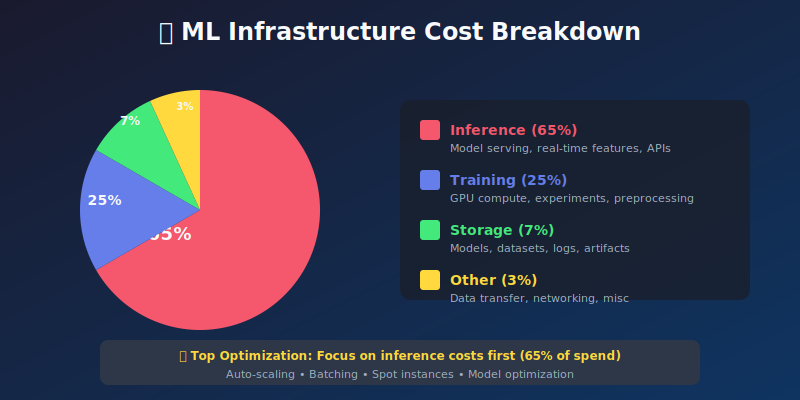
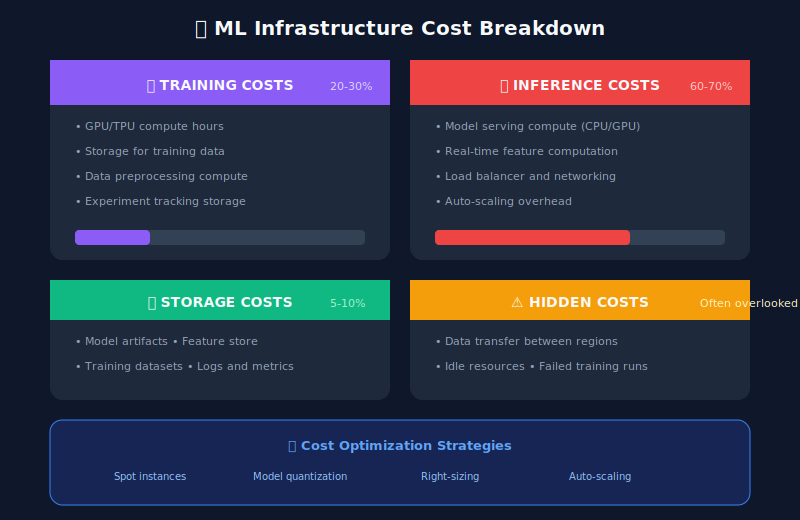

# 💰 Chapter 10: Cost Monitoring & Optimization

> **"The best model is not the most accurate one—it's the one that delivers the best ROI."**

<p align="center">
  
</p>

---

## 🎯 Learning Objectives

- Track and attribute ML infrastructure costs

- Optimize compute costs for training and inference

- Implement cost-aware model selection

- Build cost dashboards and alerts

---

## ML Cost Components



---

## Cost Tracking Implementation

```python
from dataclasses import dataclass, field
from datetime import datetime, timedelta
from typing import Dict, List, Optional
from enum import Enum
import json

class CostCategory(Enum):
    TRAINING = "training"
    INFERENCE = "inference"
    STORAGE = "storage"
    DATA_TRANSFER = "data_transfer"
    OTHER = "other"

@dataclass
class CostRecord:
    """Single cost record."""
    timestamp: datetime
    category: CostCategory
    resource_type: str
    resource_id: str
    amount_usd: float
    usage_quantity: float
    usage_unit: str
    model_name: Optional[str] = None
    team: Optional[str] = None
    tags: Dict[str, str] = field(default_factory=dict)

class MLCostTracker:
    """Track and attribute ML infrastructure costs."""

    def __init__(self, storage_backend):
        self.storage = storage_backend
        self.cost_buffer: List[CostRecord] = []

    def record_cost(self, record: CostRecord):
        """Record a cost entry."""
        self.cost_buffer.append(record)
        if len(self.cost_buffer) >= 100:
            self.flush()

    def flush(self):
        """Flush cost buffer to storage."""
        if self.cost_buffer:
            self.storage.insert_costs(self.cost_buffer)
            self.cost_buffer = []

    def get_costs_by_model(self, start_date: datetime,
                          end_date: datetime) -> Dict[str, float]:
        """Get costs grouped by model."""
        costs = self.storage.query_costs(start_date, end_date)

        by_model = {}
        for cost in costs:
            model = cost.model_name or 'unattributed'
            by_model[model] = by_model.get(model, 0) + cost.amount_usd

        return by_model

    def get_costs_by_category(self, start_date: datetime,
                             end_date: datetime) -> Dict[str, float]:
        """Get costs grouped by category."""
        costs = self.storage.query_costs(start_date, end_date)

        by_category = {}
        for cost in costs:
            cat = cost.category.value
            by_category[cat] = by_category.get(cat, 0) + cost.amount_usd

        return by_category

    def calculate_cost_per_prediction(self, model_name: str,
                                      start_date: datetime,
                                      end_date: datetime) -> float:
        """Calculate cost per prediction for a model."""
        # Get inference costs
        costs = self.storage.query_costs(
            start_date, end_date,
            model_name=model_name,
            category=CostCategory.INFERENCE
        )
        total_cost = sum(c.amount_usd for c in costs)

        # Get prediction count
        prediction_count = self.storage.get_prediction_count(
            model_name, start_date, end_date
        )

        if prediction_count == 0:
            return 0

        return total_cost / prediction_count

    def get_cost_trend(self, model_name: str,
                       periods: int = 30) -> List[Dict]:
        """Get daily cost trend for a model."""
        end_date = datetime.utcnow()
        start_date = end_date - timedelta(days=periods)

        daily_costs = []
        current = start_date

        while current < end_date:
            next_day = current + timedelta(days=1)
            costs = self.storage.query_costs(
                current, next_day, model_name=model_name
            )

            daily_costs.append({
                'date': current.strftime('%Y-%m-%d'),
                'total_usd': sum(c.amount_usd for c in costs),
                'by_category': {
                    cat.value: sum(c.amount_usd for c in costs if c.category == cat)
                    for cat in CostCategory
                }
            })

            current = next_day

        return daily_costs

class CostAttributor:
    """Attribute costs to specific models and teams."""

    def __init__(self, cloud_provider_client):
        self.cloud = cloud_provider_client

    def attribute_compute_costs(self, start_date: datetime,
                                end_date: datetime) -> List[CostRecord]:
        """Attribute compute costs from cloud billing."""
        billing_data = self.cloud.get_billing(start_date, end_date)
        records = []

        for item in billing_data:
            # Parse resource tags to attribute to model/team
            model_name = item.tags.get('model_name')
            team = item.tags.get('team')

            # Determine category from resource type
            if 'training' in item.resource_type.lower():
                category = CostCategory.TRAINING
            elif 'serving' in item.resource_type.lower():
                category = CostCategory.INFERENCE
            elif 'storage' in item.resource_type.lower():
                category = CostCategory.STORAGE
            else:
                category = CostCategory.OTHER

            records.append(CostRecord(
                timestamp=item.timestamp,
                category=category,
                resource_type=item.resource_type,
                resource_id=item.resource_id,
                amount_usd=item.cost,
                usage_quantity=item.usage,
                usage_unit=item.unit,
                model_name=model_name,
                team=team,
                tags=item.tags
            ))

        return records

```

---

## Cost Optimization Strategies

```python
from dataclasses import dataclass
from typing import List, Tuple

@dataclass
class OptimizationRecommendation:
    """Cost optimization recommendation."""
    title: str
    description: str
    estimated_savings_usd: float
    effort: str  # low, medium, high
    impact: str  # low, medium, high
    action_items: List[str]

class CostOptimizer:
    """Generate cost optimization recommendations."""

    def __init__(self, cost_tracker: MLCostTracker, metrics_store):
        self.costs = cost_tracker
        self.metrics = metrics_store

    def analyze_and_recommend(self, model_name: str) -> List[OptimizationRecommendation]:
        """Analyze costs and generate recommendations."""
        recommendations = []

        # Check GPU utilization
        gpu_rec = self._check_gpu_utilization(model_name)
        if gpu_rec:
            recommendations.append(gpu_rec)

        # Check batch size optimization
        batch_rec = self._check_batch_size(model_name)
        if batch_rec:
            recommendations.append(batch_rec)

        # Check spot instance opportunities
        spot_rec = self._check_spot_instances(model_name)
        if spot_rec:
            recommendations.append(spot_rec)

        # Check idle resources
        idle_rec = self._check_idle_resources(model_name)
        if idle_rec:
            recommendations.append(idle_rec)

        return recommendations

    def _check_gpu_utilization(self, model_name: str) -> Optional[OptimizationRecommendation]:
        """Check if GPU utilization is too low."""
        avg_utilization = self.metrics.get_avg_metric(
            model_name, 'gpu_utilization', days=7
        )

        if avg_utilization and avg_utilization < 50:
            current_cost = self.costs.get_costs_by_model(
                datetime.utcnow() - timedelta(days=30),
                datetime.utcnow()
            ).get(model_name, 0)

            # Estimate savings from right-sizing
            potential_savings = current_cost * 0.3  # ~30% savings

            return OptimizationRecommendation(
                title="Low GPU Utilization",
                description=f"GPU utilization is only {avg_utilization:.0f}%. Consider smaller instance or batching.",
                estimated_savings_usd=potential_savings,
                effort="medium",
                impact="high",
                action_items=[
                    "Increase batch size for inference",
                    "Consider CPU inference for low-volume models",
                    "Evaluate smaller GPU instance types"
                ]
            )
        return None

    def _check_batch_size(self, model_name: str) -> Optional[OptimizationRecommendation]:
        """Check if batch size can be optimized."""
        avg_batch = self.metrics.get_avg_metric(model_name, 'batch_size', days=7)

        if avg_batch and avg_batch < 8:
            return OptimizationRecommendation(
                title="Small Batch Sizes",
                description=f"Average batch size is {avg_batch:.1f}. Larger batches improve throughput.",
                estimated_savings_usd=100,  # Placeholder
                effort="low",
                impact="medium",
                action_items=[
                    "Implement request batching in serving layer",
                    "Add micro-batching with timeout",
                    "Review latency requirements for batching window"
                ]
            )
        return None

    def _check_spot_instances(self, model_name: str) -> Optional[OptimizationRecommendation]:
        """Check if spot instances can be used."""
        # Check if model can tolerate interruptions
        is_latency_sensitive = self.metrics.get_avg_metric(
            model_name, 'latency_p99', days=7
        )

        if is_latency_sensitive and is_latency_sensitive < 100:  # <100ms SLA
            return None  # Don't recommend spot for latency-sensitive

        current_cost = self.costs.get_costs_by_model(
            datetime.utcnow() - timedelta(days=30),
            datetime.utcnow()
        ).get(model_name, 0)

        return OptimizationRecommendation(
            title="Use Spot Instances for Training",
            description="Training workloads can use spot instances for 60-70% cost reduction.",
            estimated_savings_usd=current_cost * 0.5,
            effort="medium",
            impact="high",
            action_items=[
                "Enable checkpointing for training jobs",
                "Configure spot instance pools",
                "Set up automatic failover to on-demand"
            ]
        )

    def _check_idle_resources(self, model_name: str) -> Optional[OptimizationRecommendation]:
        """Check for idle resources."""
        # Check for low request rate periods
        hourly_qps = self.metrics.get_hourly_metric(
            model_name, 'requests_per_second', days=7
        )

        if not hourly_qps:
            return None

        min_qps = min(hourly_qps.values())
        max_qps = max(hourly_qps.values())

        if max_qps > 0 and min_qps / max_qps < 0.1:
            return OptimizationRecommendation(
                title="High Traffic Variance - Enable Auto-scaling",
                description=f"Traffic varies from {min_qps:.0f} to {max_qps:.0f} QPS. Auto-scaling can reduce costs.",
                estimated_savings_usd=500,  # Placeholder
                effort="low",
                impact="high",
                action_items=[
                    "Enable Kubernetes HPA",
                    "Configure scale-to-zero for very low traffic",
                    "Set appropriate min/max replicas"
                ]
            )
        return None

class CostBudgetManager:
    """Manage cost budgets and alerts."""

    def __init__(self, cost_tracker: MLCostTracker, alert_handler):
        self.costs = cost_tracker
        self.alerts = alert_handler
        self.budgets: Dict[str, float] = {}

    def set_budget(self, model_name: str, monthly_budget_usd: float):
        """Set monthly budget for a model."""
        self.budgets[model_name] = monthly_budget_usd

    def check_budgets(self) -> Dict[str, dict]:
        """Check all budgets and alert if exceeded."""
        now = datetime.utcnow()
        month_start = now.replace(day=1, hour=0, minute=0, second=0)

        results = {}

        for model_name, budget in self.budgets.items():
            current_spend = self.costs.get_costs_by_model(
                month_start, now
            ).get(model_name, 0)

            # Calculate projected spend
            days_elapsed = (now - month_start).days + 1
            days_in_month = 30
            projected_spend = (current_spend / days_elapsed) * days_in_month

            usage_pct = (current_spend / budget) * 100
            projected_pct = (projected_spend / budget) * 100

            results[model_name] = {
                'budget': budget,
                'current_spend': current_spend,
                'projected_spend': projected_spend,
                'usage_pct': usage_pct,
                'projected_pct': projected_pct
            }

            # Alert thresholds
            if usage_pct > 100:
                self.alerts.send_alert(
                    severity='critical',
                    title=f'Budget Exceeded: {model_name}',
                    message=f'Spent ${current\_spend:.2f} of ${budget:.2f} budget ({usage_pct:.0f}%)'
                )
            elif usage_pct > 80 or projected_pct > 100:
                self.alerts.send_alert(
                    severity='warning',
                    title=f'Budget Warning: {model_name}',
                    message=f'At current rate, will spend ${projected\_spend:.2f} (budget: ${budget:.2f})'
                )

        return results

```

---

## Cost Dashboard Metrics

```python
# Grafana dashboard queries for cost monitoring

COST_QUERIES = {
    "total_daily_cost": """
        SELECT
            date_trunc('day', timestamp) as day,
            SUM(amount_usd) as total_cost
        FROM ml_costs
        WHERE timestamp > NOW() - INTERVAL '30 days'
        GROUP BY day
        ORDER BY day
    """,

    "cost_by_model": """
        SELECT
            model_name,
            SUM(amount_usd) as total_cost
        FROM ml_costs
        WHERE timestamp > NOW() - INTERVAL '30 days'
        GROUP BY model_name
        ORDER BY total_cost DESC
    """,

    "cost_per_prediction": """
        SELECT
            model_name,
            SUM(amount_usd) / COUNT(DISTINCT prediction_id) as cost_per_pred
        FROM ml_costs c
        JOIN ml_predictions p ON c.model_name = p.model_name
        WHERE c.timestamp > NOW() - INTERVAL '7 days'
        GROUP BY model_name
    """,

    "cost_vs_accuracy": """
        SELECT
            model_name,
            AVG(accuracy) as accuracy,
            SUM(amount_usd) / COUNT(*) as cost_per_unit
        FROM ml_model_performance p
        JOIN ml_costs c ON p.model_name = c.model_name
        WHERE p.timestamp > NOW() - INTERVAL '7 days'
        GROUP BY model_name
    """
}

```

---

## 🔑 Key Takeaways

1. **Inference costs dominate** - Focus optimization there first

2. **Tag everything** - Cost attribution requires proper tagging

3. **Monitor cost per prediction** - Not just total cost

4. **Auto-scaling saves money** - Match resources to demand

5. **Set budgets and alerts** - Catch surprises early

---

**Next Chapter:** [11 - Compliance & Governance →](../11_compliance_governance/)

---

<div align="center">

**[⬆ Back to Top](#)** | **[📚 Main Repository](https://github.com/Gaurav14cs17/ml_system_design)**

Made with 💜 by [Gaurav14cs17](https://github.com/Gaurav14cs17)

</div>
