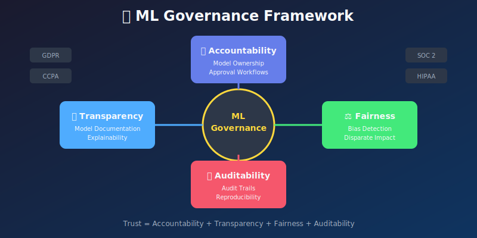
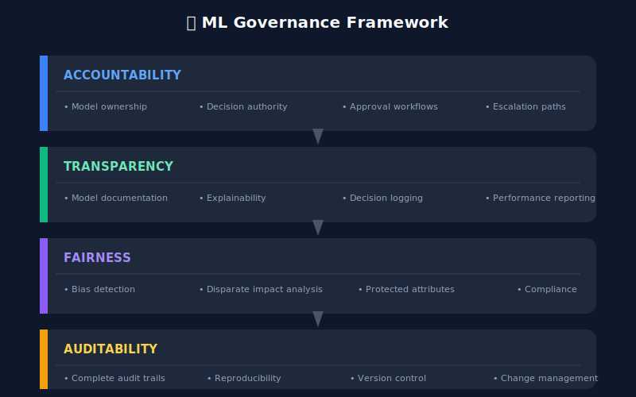
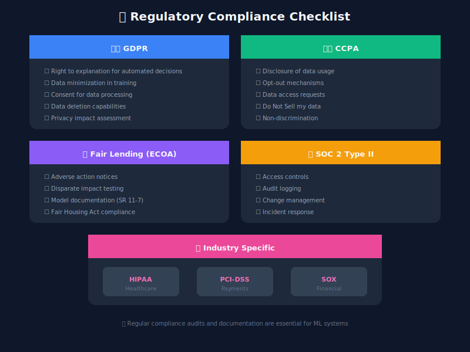

# 📋 Chapter 11: Compliance & Governance

> **"Trust is built on transparency. ML systems must be explainable and accountable."**

<p align="center">
  
</p>

---

## 🎯 Learning Objectives

- Understand ML governance requirements

- Implement audit trails for ML systems

- Create model cards and documentation

- Monitor for bias and fairness

- Meet regulatory compliance requirements

---

## ML Governance Framework



---

## Audit Trail Implementation

```python
from dataclasses import dataclass, field
from datetime import datetime
from typing import Dict, List, Optional, Any
from enum import Enum
import hashlib
import json
import uuid

class AuditEventType(Enum):
    MODEL_CREATED = "model_created"
    MODEL_TRAINED = "model_trained"
    MODEL_VALIDATED = "model_validated"
    MODEL_APPROVED = "model_approved"
    MODEL_DEPLOYED = "model_deployed"
    MODEL_RETIRED = "model_retired"
    PREDICTION_MADE = "prediction_made"
    CONFIG_CHANGED = "config_changed"
    DATA_ACCESSED = "data_accessed"

@dataclass
class AuditEvent:
    """Immutable audit event."""
    event_id: str
    event_type: AuditEventType
    timestamp: datetime
    actor: str  # user or system that triggered the event
    model_name: str
    model_version: str
    details: Dict[str, Any]
    previous_hash: str
    event_hash: str = field(init=False)

    def __post_init__(self):
        """Calculate hash for integrity verification."""
        content = json.dumps({
            'event_id': self.event_id,
            'event_type': self.event_type.value,
            'timestamp': self.timestamp.isoformat(),
            'actor': self.actor,
            'model_name': self.model_name,
            'model_version': self.model_version,
            'details': self.details,
            'previous_hash': self.previous_hash
        }, sort_keys=True)
        self.event_hash = hashlib.sha256(content.encode()).hexdigest()

class AuditTrailManager:
    """Manage immutable audit trail for ML systems."""

    def __init__(self, storage_backend):
        self.storage = storage_backend
        self.last_hash = self._get_last_hash()

    def _get_last_hash(self) -> str:
        """Get hash of last event in chain."""
        last_event = self.storage.get_last_event()
        return last_event.event_hash if last_event else "genesis"

    def log_event(self, event_type: AuditEventType, actor: str,
                  model_name: str, model_version: str,
                  details: Dict[str, Any]) -> AuditEvent:
        """Log an audit event."""
        event = AuditEvent(
            event_id=str(uuid.uuid4()),
            event_type=event_type,
            timestamp=datetime.utcnow(),
            actor=actor,
            model_name=model_name,
            model_version=model_version,
            details=details,
            previous_hash=self.last_hash
        )

        self.storage.insert_event(event)
        self.last_hash = event.event_hash

        return event

    def verify_chain_integrity(self) -> Dict[str, Any]:
        """Verify audit trail has not been tampered with."""
        events = self.storage.get_all_events()

        issues = []
        previous_hash = "genesis"

        for event in events:
            # Verify previous hash link
            if event.previous_hash != previous_hash:
                issues.append({
                    'event_id': event.event_id,
                    'issue': 'broken_chain',
                    'expected': previous_hash,
                    'actual': event.previous_hash
                })

            # Verify event hash
            recalculated = self._calculate_hash(event)
            if recalculated != event.event_hash:
                issues.append({
                    'event_id': event.event_id,
                    'issue': 'tampered_event',
                    'expected': recalculated,
                    'actual': event.event_hash
                })

            previous_hash = event.event_hash

        return {
            'valid': len(issues) == 0,
            'total_events': len(events),
            'issues': issues
        }

    def _calculate_hash(self, event: AuditEvent) -> str:
        """Recalculate hash for verification."""
        content = json.dumps({
            'event_id': event.event_id,
            'event_type': event.event_type.value,
            'timestamp': event.timestamp.isoformat(),
            'actor': event.actor,
            'model_name': event.model_name,
            'model_version': event.model_version,
            'details': event.details,
            'previous_hash': event.previous_hash
        }, sort_keys=True)
        return hashlib.sha256(content.encode()).hexdigest()

    def get_model_history(self, model_name: str) -> List[AuditEvent]:
        """Get complete history for a model."""
        return self.storage.get_events_by_model(model_name)

    def generate_audit_report(self, model_name: str,
                             start_date: datetime,
                             end_date: datetime) -> Dict[str, Any]:
        """Generate audit report for compliance."""
        events = self.storage.get_events_by_model(
            model_name, start_date, end_date
        )

        return {
            'model_name': model_name,
            'report_period': {
                'start': start_date.isoformat(),
                'end': end_date.isoformat()
            },
            'total_events': len(events),
            'events_by_type': {
                et.value: len([e for e in events if e.event_type == et])
                for et in AuditEventType
            },
            'actors_involved': list(set(e.actor for e in events)),
            'events': [
                {
                    'event_id': e.event_id,
                    'type': e.event_type.value,
                    'timestamp': e.timestamp.isoformat(),
                    'actor': e.actor,
                    'details': e.details
                }
                for e in events
            ]
        }

```

---

## Model Cards

```python
from dataclasses import dataclass, field
from datetime import datetime
from typing import Dict, List, Optional

@dataclass
class ModelCard:
    """Model card for documentation and governance."""

    # Basic Information
    model_name: str
    model_version: str
    model_type: str  # classification, regression, etc.
    description: str

    # Ownership
    owner: str
    team: str
    contact_email: str

    # Development
    created_date: datetime
    last_updated: datetime
    training_data_description: str
    training_data_size: int
    training_date: datetime
    framework: str  # tensorflow, pytorch, sklearn

    # Performance
    primary_metric: str
    primary_metric_value: float
    evaluation_data_description: str
    performance_by_segment: Dict[str, Dict[str, float]] = field(default_factory=dict)

    # Intended Use
    intended_use: str
    out_of_scope_uses: List[str] = field(default_factory=list)

    # Ethical Considerations
    sensitive_features: List[str] = field(default_factory=list)
    fairness_metrics: Dict[str, float] = field(default_factory=dict)
    potential_biases: List[str] = field(default_factory=list)
    mitigation_strategies: List[str] = field(default_factory=list)

    # Technical Details
    input_features: List[Dict[str, str]] = field(default_factory=list)
    output_format: str = ""
    model_size_mb: float = 0
    inference_latency_p50_ms: float = 0
    inference_latency_p99_ms: float = 0

    # Deployment
    deployment_environment: str = ""
    serving_infrastructure: str = ""
    scaling_policy: str = ""

    # Maintenance
    monitoring_dashboard_url: str = ""
    alerting_rules: List[str] = field(default_factory=list)
    retraining_schedule: str = ""

    def to_markdown(self) -> str:
        """Generate markdown documentation."""
        return f"""
# Model Card: {self.model_name}

## Model Details

| Field | Value |
|-------|-------|
| Version | {self.model_version} |
| Type | {self.model_type} |
| Owner | {self.owner} |
| Team | {self.team} |
| Created | {self.created_date.strftime('%Y-%m-%d')} |
| Framework | {self.framework} |

### Description
{self.description}

## Intended Use

### Primary Use Case
{self.intended_use}

### Out-of-Scope Uses
{chr(10).join(f'- {use}' for use in self.out_of_scope_uses)}

## Training Data

- **Description**: {self.training_data_description}

- **Size**: {self.training_data_size:,} samples

- **Training Date**: {self.training_date.strftime('%Y-%m-%d')}

## Performance

### Primary Metric

- **{self.primary_metric}**: {self.primary_metric_value:.4f}

### Performance by Segment
{self._format_segment_performance()}

## Ethical Considerations

### Sensitive Features
{chr(10).join(f'- {f}' for f in self.sensitive_features)}

### Fairness Metrics
{self._format_fairness_metrics()}

### Known Limitations & Biases
{chr(10).join(f'- {b}' for b in self.potential_biases)}

### Mitigation Strategies
{chr(10).join(f'- {s}' for s in self.mitigation_strategies)}

## Technical Specifications

### Input Features

| Feature | Type | Description |
|---------|------|-------------|
{self._format_features()}

### Performance

- **Model Size**: {self.model_size_mb} MB

- **P50 Latency**: {self.inference_latency_p50_ms} ms

- **P99 Latency**: {self.inference_latency_p99_ms} ms

## Deployment

- **Environment**: {self.deployment_environment}

- **Infrastructure**: {self.serving_infrastructure}

- **Scaling**: {self.scaling_policy}

## Monitoring & Maintenance

- **Dashboard**: {self.monitoring_dashboard_url}

- **Retraining Schedule**: {self.retraining_schedule}

### Alert Rules
{chr(10).join(f'- {rule}' for rule in self.alerting_rules)}

---
*Last Updated: {self.last_updated.strftime('%Y-%m-%d %H:%M')} UTC*
"""

    def _format_segment_performance(self) -> str:
        if not self.performance_by_segment:
            return "No segment analysis available."

        lines = []
        for segment, metrics in self.performance_by_segment.items():
            lines.append(f"\n**{segment}**")
            for metric, value in metrics.items():
                lines.append(f"- {metric}: {value:.4f}")
        return '\n'.join(lines)

    def _format_fairness_metrics(self) -> str:
        if not self.fairness_metrics:
            return "No fairness metrics recorded."

        lines = []
        for metric, value in self.fairness_metrics.items():
            lines.append(f"- {metric}: {value:.4f}")
        return '\n'.join(lines)

    def _format_features(self) -> str:
        lines = []
        for feature in self.input_features:
            name = feature.get('name', 'unknown')
            dtype = feature.get('type', 'unknown')
            desc = feature.get('description', '')
            lines.append(f"| {name} | {dtype} | {desc} |")
        return '\n'.join(lines)

```

---

## Bias and Fairness Monitoring

```python
import numpy as np
from typing import Dict, List, Tuple
from dataclasses import dataclass

@dataclass
class FairnessMetrics:
    """Fairness metrics for a protected group."""
    group_name: str
    group_size: int
    positive_rate: float
    true_positive_rate: float
    false_positive_rate: float
    precision: float

class FairnessMonitor:
    """Monitor ML models for bias and fairness."""

    def __init__(self, protected_attributes: List[str]):
        self.protected_attributes = protected_attributes

    def compute_fairness_metrics(self,
                                 y_true: np.ndarray,
                                 y_pred: np.ndarray,
                                 protected_attribute: np.ndarray) -> Dict[str, FairnessMetrics]:
        """Compute fairness metrics for each group."""
        groups = np.unique(protected_attribute)
        metrics = {}

        for group in groups:
            mask = protected_attribute == group
            group_true = y_true[mask]
            group_pred = y_pred[mask]

            # Calculate metrics
            positive_rate = np.mean(group_pred)

            # True positive rate (recall)
            positive_mask = group_true == 1
            if positive_mask.sum() > 0:
                tpr = np.mean(group_pred[positive_mask])
            else:
                tpr = 0

            # False positive rate
            negative_mask = group_true == 0
            if negative_mask.sum() > 0:
                fpr = np.mean(group_pred[negative_mask])
            else:
                fpr = 0

            # Precision
            predicted_positive = group_pred == 1
            if predicted_positive.sum() > 0:
                precision = np.mean(group_true[predicted_positive])
            else:
                precision = 0

            metrics[str(group)] = FairnessMetrics(
                group_name=str(group),
                group_size=int(mask.sum()),
                positive_rate=float(positive_rate),
                true_positive_rate=float(tpr),
                false_positive_rate=float(fpr),
                precision=float(precision)
            )

        return metrics

    def compute_disparate_impact(self, metrics: Dict[str, FairnessMetrics],
                                 reference_group: str) -> Dict[str, float]:
        """Compute disparate impact ratio for each group vs reference."""
        if reference_group not in metrics:
            raise ValueError(f"Reference group {reference_group} not found")

        reference_rate = metrics[reference_group].positive_rate

        ratios = {}
        for group, group_metrics in metrics.items():
            if group == reference_group:
                ratios[group] = 1.0
            else:
                if reference_rate > 0:
                    ratios[group] = group_metrics.positive_rate / reference_rate
                else:
                    ratios[group] = float('inf')

        return ratios

    def check_fairness_thresholds(self,
                                  metrics: Dict[str, FairnessMetrics],
                                  reference_group: str,
                                  di_threshold: float = 0.8,
                                  tpr_diff_threshold: float = 0.1) -> Dict[str, List[str]]:
        """Check if fairness thresholds are met."""
        violations = {}

        di_ratios = self.compute_disparate_impact(metrics, reference_group)
        reference_metrics = metrics[reference_group]

        for group, group_metrics in metrics.items():
            group_violations = []

            # Disparate impact (4/5ths rule)
            if di_ratios[group] < di_threshold:
                group_violations.append(
                    f"Disparate impact: {di_ratios[group]:.2f} < {di_threshold}"
                )

            # Equal opportunity (TPR difference)
            tpr_diff = abs(group_metrics.true_positive_rate -
                          reference_metrics.true_positive_rate)
            if tpr_diff > tpr_diff_threshold:
                group_violations.append(
                    f"TPR difference: {tpr_diff:.2f} > {tpr_diff_threshold}"
                )

            # Predictive parity (precision difference)
            prec_diff = abs(group_metrics.precision - reference_metrics.precision)
            if prec_diff > tpr_diff_threshold:
                group_violations.append(
                    f"Precision difference: {prec_diff:.2f} > {tpr_diff_threshold}"
                )

            if group_violations:
                violations[group] = group_violations

        return violations

    def generate_fairness_report(self,
                                y_true: np.ndarray,
                                y_pred: np.ndarray,
                                protected_data: Dict[str, np.ndarray]) -> Dict:
        """Generate comprehensive fairness report."""
        report = {
            'timestamp': datetime.utcnow().isoformat(),
            'total_samples': len(y_true),
            'protected_attributes': {}
        }

        for attr_name, attr_values in protected_data.items():
            metrics = self.compute_fairness_metrics(y_true, y_pred, attr_values)

            # Find reference group (largest group)
            reference_group = max(metrics.keys(),
                                 key=lambda g: metrics[g].group_size)

            violations = self.check_fairness_thresholds(metrics, reference_group)

            report['protected_attributes'][attr_name] = {
                'reference_group': reference_group,
                'metrics': {k: v.__dict__ for k, v in metrics.items()},
                'disparate_impact': self.compute_disparate_impact(metrics, reference_group),
                'violations': violations,
                'passes_fairness_check': len(violations) == 0
            }

        return report

```

---

## Regulatory Compliance Checklist



---

## 🔑 Key Takeaways

1. **Document everything** - Model cards are not optional
2. **Audit trails must be immutable** - Use cryptographic hashing
3. **Fairness is measurable** - Monitor protected groups
4. **Compliance is ongoing** - Not a one-time checkbox
5. **Explainability enables trust** - Know why your model decides

---

**Next Chapter:** [12 - Tools & Frameworks →](../12_tools_and_frameworks/)

---

<div align="center">

**[⬆ Back to Top](#)** | **[📚 Main Repository](https://github.com/Gaurav14cs17/ml_system_design)**

Made with 💜 by [Gaurav14cs17](https://github.com/Gaurav14cs17)

</div>
